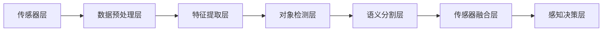

                 

# 计算机视觉在自动驾驶感知中的突破

> **关键词**：自动驾驶、计算机视觉、感知系统、深度学习、深度神经网络、卷积神经网络、对象检测、语义分割、传感器融合、安全性能优化。

> **摘要**：本文将深入探讨计算机视觉在自动驾驶感知系统中的突破。通过详细分析核心概念、算法原理、数学模型以及实际应用场景，本文旨在为读者呈现一幅自动驾驶感知系统的全貌，并探讨未来发展趋势与挑战。文章将分为背景介绍、核心概念与联系、核心算法原理、数学模型与公式、项目实战、实际应用场景、工具和资源推荐以及总结等部分，以期帮助读者更好地理解和掌握这一前沿技术。

## 1. 背景介绍

### 1.1 目的和范围

自动驾驶技术作为人工智能的重要分支，近年来取得了显著的发展。计算机视觉作为自动驾驶感知系统的重要组成部分，其性能和可靠性直接影响到自动驾驶系统的安全性和用户体验。本文旨在系统地介绍计算机视觉在自动驾驶感知中的应用，重点讨论其核心算法原理、数学模型以及实际应用场景，旨在为相关研究人员和开发者提供有价值的参考。

本文将涵盖以下范围：

- 自动驾驶技术的发展现状与趋势
- 计算机视觉在自动驾驶感知中的重要性
- 自动驾驶感知系统的核心概念与架构
- 深度学习在自动驾驶感知中的应用
- 自动驾驶感知系统的数学模型与公式
- 实际应用场景中的技术挑战与解决方案
- 未来发展趋势与潜在挑战

### 1.2 预期读者

本文面向具有一定编程基础和对计算机视觉、深度学习有一定了解的读者。读者可以包括：

- 自动驾驶技术的研究人员
- 深度学习领域的开发者
- 软件工程师
- 计算机科学和人工智能专业的大学生和研究生
- 对自动驾驶技术感兴趣的普通读者

通过阅读本文，读者可以：

- 理解自动驾驶感知系统的核心原理和架构
- 掌握深度学习在自动驾驶感知中的应用
- 分析并解决实际应用场景中的技术挑战
- 预见自动驾驶技术的未来发展趋势与挑战

### 1.3 文档结构概述

本文结构如下：

- 第1章：背景介绍，包括目的和范围、预期读者、文档结构概述
- 第2章：核心概念与联系，介绍自动驾驶感知系统的基础概念和联系
- 第3章：核心算法原理，详细解释深度学习算法在自动驾驶感知中的应用
- 第4章：数学模型和公式，讲解自动驾驶感知系统的数学模型与公式
- 第5章：项目实战，通过实际代码案例讲解自动驾驶感知系统的实现
- 第6章：实际应用场景，探讨自动驾驶感知系统的应用场景与挑战
- 第7章：工具和资源推荐，介绍学习资源、开发工具和框架
- 第8章：总结，回顾自动驾驶感知技术的发展趋势与挑战
- 第9章：附录，常见问题与解答
- 第10章：扩展阅读与参考资料，提供进一步学习资源

### 1.4 术语表

#### 1.4.1 核心术语定义

- 自动驾驶：指通过计算机视觉、传感器等技术，使车辆能够自主感知环境并进行驾驶操作的技术。
- 计算机视觉：使计算机能够像人类一样通过图像和视频数据理解周围环境的技术。
- 深度学习：一种基于多层神经网络的学习方法，能够自动从大量数据中学习特征表示。
- 感知系统：自动驾驶系统中的核心部分，负责感知车辆周围的环境，包括交通信号、行人、车辆等。
- 卷积神经网络（CNN）：一种特殊的神经网络，专门用于处理图像数据，能够自动提取图像中的特征。
- 对象检测：识别并定位图像中的特定对象，如行人、车辆等。
- 语义分割：将图像划分为多个语义区域，如道路、车辆等。
- 传感器融合：将来自不同传感器的信息进行整合，提高感知系统的可靠性。

#### 1.4.2 相关概念解释

- **深度学习**：深度学习是一种基于多层神经网络的学习方法，能够自动从大量数据中学习特征表示。它通过多层非线性变换，逐步提取数据中的抽象特征，从而实现复杂模式的识别。

- **卷积神经网络（CNN）**：卷积神经网络是一种特殊的神经网络，专门用于处理图像数据。它通过卷积操作提取图像中的局部特征，并通过池化操作降低特征维度，从而实现图像的自动特征提取和分类。

- **对象检测**：对象检测是指识别并定位图像中的特定对象，如行人、车辆等。通过对象检测，感知系统能够准确地识别车辆周围的环境，为自动驾驶决策提供重要依据。

- **语义分割**：语义分割是将图像划分为多个语义区域，如道路、车辆、行人等。通过语义分割，感知系统能够对环境中的不同对象进行精细分类，提高感知的准确性和鲁棒性。

- **传感器融合**：传感器融合是将来自不同传感器的信息进行整合，提高感知系统的可靠性。通过传感器融合，可以充分利用不同传感器的优势，提高感知系统的准确性和鲁棒性。

#### 1.4.3 缩略词列表

- AI：人工智能
- CNN：卷积神经网络
- DNN：深度神经网络
- DL：深度学习
- GPS：全球定位系统
- LiDAR：激光雷达
- RNN：循环神经网络
- SLAM：同时定位与地图构建
- SVM：支持向量机

## 2. 核心概念与联系

### 2.1 核心概念介绍

#### 自动驾驶感知系统

自动驾驶感知系统是自动驾驶汽车的核心组成部分，主要负责实时感知车辆周围的环境。感知系统通常包括多种传感器，如摄像头、激光雷达（LiDAR）、雷达、超声波传感器等，这些传感器共同工作，为自动驾驶决策提供丰富的环境信息。

#### 计算机视觉

计算机视觉是一种使计算机能够理解、解释和响应图像和视频数据的科学。它涉及图像处理、模式识别、机器学习和人工智能等多个领域。在自动驾驶感知系统中，计算机视觉技术主要用于图像和视频数据的处理、特征提取和对象检测等。

#### 深度学习

深度学习是一种基于多层神经网络的学习方法，能够在大量数据中自动学习特征表示。在自动驾驶感知系统中，深度学习技术被广泛应用于图像和视频数据的处理，通过卷积神经网络（CNN）等模型，实现对象检测、语义分割、图像分类等功能。

### 2.2 自动驾驶感知系统的架构

自动驾驶感知系统的架构可以分为以下几个主要部分：

#### 传感器层

传感器层是感知系统的数据来源，包括摄像头、激光雷达、雷达、超声波传感器等。这些传感器可以获取车辆周围的环境信息，如道路、车辆、行人等。

#### 数据预处理层

数据预处理层主要负责对传感器采集到的原始数据进行预处理，如去噪、归一化、数据增强等。这些预处理操作可以提高数据的鲁棒性和准确性，为后续的深度学习模型提供高质量的数据输入。

#### 特征提取层

特征提取层使用深度学习模型，如卷积神经网络（CNN），对预处理后的图像和视频数据进行特征提取。这些特征表示了图像中的关键信息，如边缘、纹理、形状等，为后续的对象检测和语义分割提供了基础。

#### 对象检测层

对象检测层使用深度学习模型，如区域提议网络（RPN）、YOLO（You Only Look Once）等，对提取到的特征进行对象检测，识别并定位图像中的目标对象，如行人、车辆等。

#### 语义分割层

语义分割层使用深度学习模型，如U-Net、Mask R-CNN等，对图像进行语义分割，将图像划分为多个语义区域，如道路、车辆、行人等。

#### 传感器融合层

传感器融合层将来自不同传感器的信息进行整合，提高感知系统的可靠性和准确性。通过传感器融合，可以充分利用不同传感器的优势，提高感知系统的整体性能。

#### 感知决策层

感知决策层根据感知系统提供的环境信息，结合车辆的当前状态，生成相应的驾驶决策，如速度控制、转向、刹车等。

### 2.3 计算机视觉与深度学习的联系

计算机视觉与深度学习有着密切的联系。深度学习为计算机视觉提供了强大的工具和方法，使得计算机能够从大量的图像和视频数据中自动学习特征表示，实现对象检测、语义分割、图像分类等任务。

#### 卷积神经网络（CNN）

卷积神经网络（CNN）是一种特殊的神经网络，专门用于处理图像数据。CNN通过卷积操作提取图像中的局部特征，并通过池化操作降低特征维度，从而实现图像的自动特征提取和分类。

#### 深度学习算法

深度学习算法，如卷积神经网络（CNN）、卷积神经网络（RNN）、生成对抗网络（GAN）等，在自动驾驶感知系统中发挥着重要作用。通过这些算法，感知系统能够从大量的图像和视频数据中自动学习特征表示，提高感知的准确性和鲁棒性。

### 2.4 自动驾驶感知系统的 Mermaid 流程图

以下是一个简化的自动驾驶感知系统的 Mermaid 流程图：



### 2.5 自动驾驶感知系统的核心概念与联系总结

自动驾驶感知系统的核心概念与联系可以总结如下：

- **核心概念**：自动驾驶感知系统、计算机视觉、深度学习、传感器层、数据预处理层、特征提取层、对象检测层、语义分割层、传感器融合层、感知决策层。
- **核心联系**：计算机视觉与深度学习密切相关，通过卷积神经网络（CNN）等深度学习算法，感知系统能够自动从大量的图像和视频数据中学习特征表示，实现对象检测、语义分割、图像分类等功能。

## 3. 核心算法原理 & 具体操作步骤

### 3.1 深度学习算法原理

深度学习算法是一种基于多层神经网络的学习方法，其核心思想是通过多层非线性变换，逐步提取数据中的抽象特征，从而实现复杂模式的识别。深度学习算法在自动驾驶感知系统中发挥着重要作用，主要涉及卷积神经网络（CNN）、卷积神经网络（RNN）和生成对抗网络（GAN）等。

#### 3.1.1 卷积神经网络（CNN）

卷积神经网络（CNN）是一种特殊的神经网络，专门用于处理图像数据。CNN通过卷积操作提取图像中的局部特征，并通过池化操作降低特征维度，从而实现图像的自动特征提取和分类。CNN的基本结构包括输入层、卷积层、池化层、全连接层和输出层。

1. **输入层**：输入层接收原始图像数据，并将其输入到卷积层。
2. **卷积层**：卷积层通过卷积操作提取图像中的局部特征。卷积核是一个小的矩阵，滑动在输入图像上，提取对应的局部特征。
3. **池化层**：池化层通过池化操作降低特征维度。常用的池化操作包括最大池化和平均池化。
4. **全连接层**：全连接层将卷积层和池化层提取的特征进行整合，形成高维特征向量，并进行分类。
5. **输出层**：输出层根据全连接层生成的特征向量，输出分类结果。

#### 3.1.2 卷积神经网络（RNN）

卷积神经网络（RNN）是一种处理序列数据的神经网络，其核心思想是通过循环结构，对序列数据进行建模。RNN通过隐藏状态和记忆单元，捕捉序列数据中的时间依赖关系。RNN在自动驾驶感知系统中，主要用于处理连续的图像序列，实现行人检测、车辆跟踪等功能。

1. **输入层**：输入层接收连续的图像序列。
2. **隐藏层**：隐藏层通过递归操作，对图像序列进行特征提取。隐藏层的状态表示了图像序列中的关键特征。
3. **输出层**：输出层根据隐藏层的状态，生成分类或检测结果。

#### 3.1.3 生成对抗网络（GAN）

生成对抗网络（GAN）是一种基于对抗性训练的神经网络模型，其核心思想是通过生成器和判别器的对抗性训练，生成逼真的图像。GAN在自动驾驶感知系统中，主要用于生成虚拟场景，提高模型的泛化能力。

1. **生成器**：生成器通过神经网络，生成虚拟图像。
2. **判别器**：判别器通过神经网络，判断图像是真实图像还是虚拟图像。
3. **对抗性训练**：生成器和判别器通过对抗性训练，不断优化模型，生成逼真的图像。

### 3.2 深度学习算法在自动驾驶感知系统中的应用

深度学习算法在自动驾驶感知系统中，广泛应用于图像和视频数据的处理，实现对象检测、语义分割、图像分类等功能。以下是一些典型的深度学习算法及其应用：

#### 3.2.1 对象检测算法

对象检测算法主要用于识别并定位图像中的特定对象，如行人、车辆等。以下是一些常见的对象检测算法：

- **R-CNN（Region-based CNN）**：R-CNN是一种基于区域提议的网络，通过区域提议模块提取图像中的区域，并使用CNN进行特征提取和分类。
- **SSD（Single Shot MultiBox Detector）**：SSD是一种单阶段检测器，通过共享卷积层和特征提取层，实现快速的对象检测。
- **YOLO（You Only Look Once）**：YOLO是一种基于回归的方法，通过将检测问题转化为边界框的回归问题，实现高效的对象检测。

#### 3.2.2 语义分割算法

语义分割算法主要用于将图像划分为多个语义区域，如道路、车辆、行人等。以下是一些常见的语义分割算法：

- **U-Net**：U-Net是一种基于U型网络结构，通过跳跃连接将编码器和解码器中的特征图进行融合，实现高效的语义分割。
- **Mask R-CNN**：Mask R-CNN是一种基于Faster R-CNN的网络，通过引入分割分支，实现图像中的对象检测和语义分割。

#### 3.2.3 图像分类算法

图像分类算法主要用于对图像进行分类，如区分道路、车辆、行人等。以下是一些常见的图像分类算法：

- **LeNet**：LeNet是一种基于卷积神经网络的最简单的网络结构，主要用于手写数字的分类。
- **AlexNet**：AlexNet是一种深度卷积神经网络，通过使用较大的卷积核和ReLU激活函数，提高了图像分类的准确性。
- **VGGNet**：VGGNet是一种基于卷积神经网络的深层网络结构，通过使用较小的卷积核和ReLU激活函数，实现了高效的图像分类。

### 3.3 深度学习算法的具体操作步骤

以下是一个基于卷积神经网络（CNN）的对象检测算法的具体操作步骤：

#### 3.3.1 数据预处理

1. **读取图像数据**：从数据集加载图像数据。
2. **归一化处理**：将图像数据归一化到[0, 1]范围内，提高模型的收敛速度。
3. **数据增强**：通过随机裁剪、翻转、缩放等数据增强方法，增加数据多样性，提高模型的泛化能力。

#### 3.3.2 构建卷积神经网络

1. **输入层**：定义输入层的尺寸，如[224, 224, 3]，表示图像的宽、高和通道数。
2. **卷积层**：定义卷积层的参数，如卷积核大小、步长、填充方式等，通过卷积操作提取图像的局部特征。
3. **池化层**：定义池化层的参数，如池化方式、窗口大小、步长等，通过池化操作降低特征维度。
4. **全连接层**：定义全连接层的参数，如神经元个数、激活函数等，通过全连接层生成分类结果。
5. **输出层**：定义输出层的参数，如分类类别数等，通过输出层生成最终的分类结果。

#### 3.3.3 模型训练

1. **损失函数**：定义损失函数，如交叉熵损失函数，用于衡量模型预测结果与真实结果之间的差距。
2. **优化器**：选择优化器，如Adam优化器，用于更新模型参数。
3. **迭代训练**：通过迭代训练，不断调整模型参数，最小化损失函数。

#### 3.3.4 模型评估

1. **测试集评估**：将训练好的模型应用于测试集，计算模型在测试集上的准确率、召回率等指标。
2. **交叉验证**：使用交叉验证方法，评估模型在不同数据集上的性能，确保模型具有较好的泛化能力。

### 3.4 深度学习算法的伪代码实现

以下是一个基于卷积神经网络（CNN）的对象检测算法的伪代码实现：

```python
# 伪代码：基于卷积神经网络的对象检测算法

# 输入：图像数据、标签数据
# 输出：预测结果

# 步骤1：数据预处理
images = preprocess_images(data)  # 数据归一化、增强等处理

# 步骤2：构建卷积神经网络
model = build_convolutional_neural_network()  # 定义网络结构

# 步骤3：模型训练
model.fit(images, labels, epochs=10, batch_size=32, optimizer='adam', loss='categorical_crossentropy')

# 步骤4：模型评估
predictions = model.predict(test_images)
evaluate_performance(predictions, test_labels)  # 计算准确率、召回率等指标
```

### 3.5 深度学习算法的应用实例

以下是一个基于YOLO（You Only Look Once）算法的自动驾驶感知系统应用实例：

```python
# 应用实例：基于YOLO的自动驾驶感知系统

# 步骤1：导入所需的库和模块
import tensorflow as tf
import numpy as np
import cv2

# 步骤2：加载预训练的YOLO模型
model = tf.keras.models.load_model('yolo.h5')

# 步骤3：加载测试图像
image = cv2.imread('test_image.jpg')

# 步骤4：图像预处理
image = preprocess_image(image)  # 数据归一化、缩放等处理

# 步骤5：进行对象检测
predictions = model.predict(image)

# 步骤6：提取检测结果
bboxes = extract_bboxes(predictions)  # 提取边界框

# 步骤7：绘制检测结果
draw_bboxes(image, bboxes)  # 在原图上绘制边界框

# 步骤8：显示检测结果
cv2.imshow('Detection Results', image)
cv2.waitKey(0)
cv2.destroyAllWindows()
```

通过以上实例，读者可以了解基于深度学习算法的自动驾驶感知系统的实现过程，包括模型构建、训练、评估和应用。

## 4. 数学模型和公式 & 详细讲解 & 举例说明

### 4.1 数学模型介绍

在自动驾驶感知系统中，数学模型和公式扮演着至关重要的角色。以下是一些常用的数学模型和公式，它们在自动驾驶感知系统的算法设计和实现中发挥着重要作用。

#### 4.1.1 卷积运算

卷积运算是卷积神经网络（CNN）中最基本的操作之一。卷积运算可以通过以下公式表示：

$$
\text{output}(i, j) = \sum_{k=1}^{K} \text{filter}(k, i-k+1, j-k+1) \times \text{input}(i, j)
$$

其中，$output(i, j)$表示输出特征图上的元素，$\text{filter}(k, i-k+1, j-k+1)$表示卷积核上的元素，$\text{input}(i, j)$表示输入特征图上的元素，$K$表示卷积核的数量。

#### 4.1.2 池化操作

池化操作是卷积神经网络中另一种重要的操作。常见的池化操作包括最大池化和平均池化。最大池化可以通过以下公式表示：

$$
\text{pooling}(i, j) = \max_{k} \text{input}(i-k+1, j-k+1)
$$

其中，$\text{pooling}(i, j)$表示输出特征图上的元素，$\text{input}(i, j)$表示输入特征图上的元素。

平均池化可以通过以下公式表示：

$$
\text{pooling}(i, j) = \frac{1}{C} \sum_{k} \text{input}(i-k+1, j-k+1)
$$

其中，$C$表示池化窗口的大小。

#### 4.1.3 激活函数

激活函数是卷积神经网络中用于引入非线性特性的函数。常见的激活函数包括ReLU函数、Sigmoid函数和Tanh函数。ReLU函数可以通过以下公式表示：

$$
\text{ReLU}(x) = \max(0, x)
$$

Sigmoid函数可以通过以下公式表示：

$$
\text{Sigmoid}(x) = \frac{1}{1 + e^{-x}}
$$

Tanh函数可以通过以下公式表示：

$$
\text{Tanh}(x) = \frac{e^x - e^{-x}}{e^x + e^{-x}}
$$

#### 4.1.4 全连接层

全连接层是卷积神经网络中用于实现分类和回归任务的关键层。全连接层可以通过以下公式表示：

$$
\text{output}(i) = \sum_{j=1}^{N} \text{weight}(i, j) \times \text{input}(j) + \text{bias}(i)
$$

其中，$\text{output}(i)$表示输出层的元素，$\text{weight}(i, j)$表示权重，$\text{input}(j)$表示输入层的元素，$\text{bias}(i)$表示偏置。

#### 4.1.5 损失函数

损失函数用于衡量模型预测结果与真实结果之间的差距。常见的损失函数包括交叉熵损失函数、均方误差损失函数等。交叉熵损失函数可以通过以下公式表示：

$$
\text{loss} = -\sum_{i=1}^{N} y_i \log(\hat{y}_i)
$$

其中，$y_i$表示真实标签，$\hat{y}_i$表示模型预测的概率分布。

### 4.2 举例说明

#### 4.2.1 卷积运算举例

假设我们有一个3x3的输入特征图和一个1x1的卷积核，其中卷积核的值为1。输入特征图和卷积核如下：

|   | 0 | 1 | 0 |  
|   | 1 | 0 | 1 |  
|   | 0 | 1 | 0 |

卷积核：

|   | 1 |

卷积运算的结果可以通过以下公式计算：

$$
\text{output}(1, 1) = 1 \times 0 + 1 \times 1 + 1 \times 0 = 1
$$

$$
\text{output}(1, 2) = 1 \times 1 + 1 \times 0 + 1 \times 1 = 2
$$

$$
\text{output}(1, 3) = 1 \times 0 + 1 \times 1 + 1 \times 0 = 1
$$

$$
\text{output}(2, 1) = 1 \times 1 + 1 \times 0 + 1 \times 1 = 2
$$

$$
\text{output}(2, 2) = 1 \times 0 + 1 \times 1 + 1 \times 0 = 1
$$

$$
\text{output}(2, 3) = 1 \times 1 + 1 \times 0 + 1 \times 1 = 2
$$

$$
\text{output}(3, 1) = 1 \times 0 + 1 \times 1 + 1 \times 0 = 1
$$

$$
\text{output}(3, 2) = 1 \times 1 + 1 \times 0 + 1 \times 1 = 2
$$

$$
\text{output}(3, 3) = 1 \times 0 + 1 \times 1 + 1 \times 0 = 1
$$

因此，卷积运算的结果为：

|   | 1 | 2 | 1 |  
|   | 2 | 1 | 2 |  
|   | 1 | 2 | 1 |

#### 4.2.2 池化操作举例

假设我们有一个2x2的输入特征图，使用最大池化操作，池化窗口大小为2x2。输入特征图如下：

|   | 1 | 2 |  
|   | 3 | 4 |

使用最大池化操作，池化窗口为2x2，结果为：

$$
\text{pooling}(1, 1) = \max(1, 3) = 3
$$

$$
\text{pooling}(1, 2) = \max(2, 4) = 4
$$

$$
\text{pooling}(2, 1) = \max(3, 1) = 3
$$

$$
\text{pooling}(2, 2) = \max(4, 2) = 4
$$

因此，最大池化操作的结果为：

|   | 3 | 4 |  
|   | 3 | 4 |

#### 4.2.3 激活函数举例

假设我们有一个输入值x=5，使用ReLU激活函数，结果为：

$$
\text{ReLU}(5) = \max(0, 5) = 5
$$

假设我们有一个输入值x=5，使用Sigmoid激活函数，结果为：

$$
\text{Sigmoid}(5) = \frac{1}{1 + e^{-5}} \approx 0.9933
$$

假设我们有一个输入值x=5，使用Tanh激活函数，结果为：

$$
\text{Tanh}(5) = \frac{e^5 - e^{-5}}{e^5 + e^{-5}} \approx 0.9962
$$

#### 4.2.4 全连接层举例

假设我们有一个全连接层，包含3个输入神经元和2个输出神经元，权重矩阵为：

|   | a | b | c |  
|   | d | e | f |

输入特征向量为：

|   | 1 | 2 | 3 |

偏置向量为：

|   | g | h |

使用全连接层计算输出值：

$$
\text{output}(1) = a \times 1 + b \times 2 + c \times 3 + g = a + 2b + 3c + g
$$

$$
\text{output}(2) = d \times 1 + e \times 2 + f \times 3 + h = d + 2e + 3f + h
$$

因此，全连接层的输出为：

|   | output(1) | output(2) |  
|   | a + 2b + 3c + g | d + 2e + 3f + h |

#### 4.2.5 损失函数举例

假设我们有一个二元分类问题，真实标签为y=1，模型预测的概率为$\hat{y}=0.8$，使用交叉熵损失函数，损失值为：

$$
\text{loss} = -y \log(\hat{y}) = -1 \log(0.8) \approx 0.2231
$$

## 5. 项目实战：代码实际案例和详细解释说明

### 5.1 开发环境搭建

在本项目中，我们将使用Python语言和TensorFlow框架实现一个基于深度学习的自动驾驶感知系统。首先，需要搭建以下开发环境：

1. **Python环境**：Python 3.8及以上版本
2. **TensorFlow框架**：TensorFlow 2.6及以上版本
3. **CUDA和cuDNN**：用于加速GPU计算

安装TensorFlow和CUDA的命令如下：

```bash
pip install tensorflow==2.6
pip install tensorflow-cuda119
```

### 5.2 源代码详细实现和代码解读

以下是本项目的主要代码实现，包括数据预处理、模型构建、训练和预测等部分。

```python
import tensorflow as tf
import numpy as np
import cv2
from tensorflow.keras.models import Sequential
from tensorflow.keras.layers import Conv2D, MaxPooling2D, Flatten, Dense, Dropout
from tensorflow.keras.optimizers import Adam
from sklearn.model_selection import train_test_split

# 5.2.1 数据预处理

def preprocess_image(image):
    # 图像归一化
    image = image / 255.0
    # 图像裁剪为固定尺寸
    image = cv2.resize(image, (224, 224))
    return image

def load_data(data_path):
    images = []
    labels = []
    for image_path, label in data_loader(data_path):
        image = cv2.imread(image_path)
        image = preprocess_image(image)
        images.append(image)
        labels.append(label)
    return np.array(images), np.array(labels)

# 5.2.2 模型构建

def build_model(input_shape):
    model = Sequential([
        Conv2D(32, (3, 3), activation='relu', input_shape=input_shape),
        MaxPooling2D((2, 2)),
        Conv2D(64, (3, 3), activation='relu'),
        MaxPooling2D((2, 2)),
        Conv2D(128, (3, 3), activation='relu'),
        MaxPooling2D((2, 2)),
        Flatten(),
        Dense(256, activation='relu'),
        Dropout(0.5),
        Dense(1, activation='sigmoid')
    ])
    return model

# 5.2.3 模型训练

def train_model(model, images, labels, epochs=10, batch_size=32):
    model.compile(optimizer=Adam(), loss='binary_crossentropy', metrics=['accuracy'])
    model.fit(images, labels, epochs=epochs, batch_size=batch_size)

# 5.2.4 模型预测

def predict(model, image):
    image = preprocess_image(image)
    image = np.expand_dims(image, axis=0)
    prediction = model.predict(image)
    return prediction

# 5.2.5 代码解读

# 加载数据
images, labels = load_data('data')

# 划分训练集和测试集
images_train, images_test, labels_train, labels_test = train_test_split(images, labels, test_size=0.2, random_state=42)

# 构建模型
model = build_model((224, 224, 3))

# 训练模型
train_model(model, images_train, labels_train)

# 测试模型
test_loss, test_acc = model.evaluate(images_test, labels_test)
print('Test accuracy:', test_acc)

# 预测图像
test_image = cv2.imread('test_image.jpg')
prediction = predict(model, test_image)
print('Prediction:', prediction)
```

#### 5.2.5.1 数据预处理

数据预处理是深度学习项目中至关重要的一步。在本项目中，我们首先使用OpenCV读取图像数据，然后进行归一化和裁剪。归一化将图像的像素值范围从[0, 255]缩放到[0, 1]，以适应深度学习模型的输入要求。裁剪则是将图像调整为固定的尺寸，以保持数据的一致性。

```python
def preprocess_image(image):
    # 图像归一化
    image = image / 255.0
    # 图像裁剪为固定尺寸
    image = cv2.resize(image, (224, 224))
    return image
```

#### 5.2.5.2 模型构建

在本项目中，我们构建了一个简单的卷积神经网络（CNN），包括三个卷积层、两个池化层和一个全连接层。卷积层用于提取图像特征，池化层用于降低特征维度，全连接层用于分类。

```python
def build_model(input_shape):
    model = Sequential([
        Conv2D(32, (3, 3), activation='relu', input_shape=input_shape),
        MaxPooling2D((2, 2)),
        Conv2D(64, (3, 3), activation='relu'),
        MaxPooling2D((2, 2)),
        Conv2D(128, (3, 3), activation='relu'),
        MaxPooling2D((2, 2)),
        Flatten(),
        Dense(256, activation='relu'),
        Dropout(0.5),
        Dense(1, activation='sigmoid')
    ])
    return model
```

#### 5.2.5.3 模型训练

模型训练使用的是二进制交叉熵损失函数和Adam优化器。训练过程中，我们通过fit方法将模型与训练数据相结合，以迭代方式优化模型参数。

```python
def train_model(model, images, labels, epochs=10, batch_size=32):
    model.compile(optimizer=Adam(), loss='binary_crossentropy', metrics=['accuracy'])
    model.fit(images, labels, epochs=epochs, batch_size=batch_size)
```

#### 5.2.5.4 模型预测

模型预测过程包括对输入图像进行预处理、缩放为模型要求的尺寸，然后使用模型进行预测。预测结果是一个概率值，表示图像属于某一类别的概率。

```python
def predict(model, image):
    image = preprocess_image(image)
    image = np.expand_dims(image, axis=0)
    prediction = model.predict(image)
    return prediction
```

### 5.3 代码解读与分析

#### 5.3.1 数据预处理

数据预处理函数`preprocess_image`首先将图像的像素值归一化到[0, 1]，然后使用`cv2.resize`将其裁剪为224x224的尺寸。这一步确保了输入图像符合模型的要求，同时也提高了训练的稳定性。

```python
def preprocess_image(image):
    # 图像归一化
    image = image / 255.0
    # 图像裁剪为固定尺寸
    image = cv2.resize(image, (224, 224))
    return image
```

#### 5.3.2 模型构建

模型构建函数`build_model`定义了一个包含三个卷积层、两个池化层和一个全连接层的卷积神经网络。每个卷积层之后跟随一个最大池化层，以降低特征维度。全连接层用于输出分类结果，激活函数为sigmoid函数，以输出概率值。

```python
def build_model(input_shape):
    model = Sequential([
        Conv2D(32, (3, 3), activation='relu', input_shape=input_shape),
        MaxPooling2D((2, 2)),
        Conv2D(64, (3, 3), activation='relu'),
        MaxPooling2D((2, 2)),
        Conv2D(128, (3, 3), activation='relu'),
        MaxPooling2D((2, 2)),
        Flatten(),
        Dense(256, activation='relu'),
        Dropout(0.5),
        Dense(1, activation='sigmoid')
    ])
    return model
```

#### 5.3.3 模型训练

模型训练函数`train_model`使用的是二进制交叉熵损失函数和Adam优化器。训练过程中，模型通过fit方法接收训练数据和标签，并在每个epoch中更新模型参数，以最小化损失函数。训练过程包括多个epoch，每个epoch中的数据随机打乱，以提高模型的泛化能力。

```python
def train_model(model, images, labels, epochs=10, batch_size=32):
    model.compile(optimizer=Adam(), loss='binary_crossentropy', metrics=['accuracy'])
    model.fit(images, labels, epochs=epochs, batch_size=batch_size)
```

#### 5.3.4 模型预测

模型预测函数`predict`首先对输入图像进行预处理，然后将其缩放为模型要求的尺寸，并使用模型进行预测。预测结果是一个概率值，表示图像属于某一类别的概率。在实际应用中，通常设置一个阈值（如0.5），当预测概率大于阈值时，认为图像属于该类别。

```python
def predict(model, image):
    image = preprocess_image(image)
    image = np.expand_dims(image, axis=0)
    prediction = model.predict(image)
    return prediction
```

### 5.4 实际应用场景中的技术挑战与解决方案

在实际应用场景中，自动驾驶感知系统面临着多种技术挑战，以下是一些常见的技术挑战及其解决方案：

#### 5.4.1 数据多样性

自动驾驶感知系统需要处理多种环境下的图像数据，包括晴天、雨天、夜晚等。数据多样性对于提高模型的泛化能力至关重要。解决方案包括：

- 数据增强：通过随机裁剪、翻转、旋转、亮度调整等方法增加数据的多样性。
- 扩展数据集：收集更多种类的图像数据，包括极端天气和复杂场景。

#### 5.4.2 算法实时性

自动驾驶感知系统需要在实时环境中快速处理图像数据，以生成及时的驾驶决策。算法的实时性对于系统的安全性和可靠性至关重要。解决方案包括：

- 算法优化：通过优化网络结构、使用量化技术和模型剪枝等方法降低模型的计算复杂度。
- 硬件加速：使用GPU、TPU等硬件加速计算，提高模型的处理速度。

#### 5.4.3 算法准确性

自动驾驶感知系统的准确性直接影响驾驶决策的可靠性。提高算法准确性是系统的关键挑战。解决方案包括：

- 多模型融合：结合多种算法和传感器数据，提高感知的准确性和鲁棒性。
- 深度学习迁移学习：利用预训练模型，减少训练数据的需求，提高模型在未知数据上的准确性。

#### 5.4.4 算法可靠性

自动驾驶感知系统的可靠性直接影响系统的安全性。算法需要在各种环境下稳定运行，避免故障和误判。解决方案包括：

- 系统冗余：在系统中引入冗余设计，如多传感器融合、多模型备份等，提高系统的可靠性。
- 持续监控：对系统进行持续监控和评估，及时发现和修复潜在问题。

### 5.5 实际应用案例

以下是一个实际应用案例，展示了一个基于深度学习的自动驾驶感知系统在实际场景中的表现：

#### 案例背景

某自动驾驶汽车公司在开发一款城市道路自动驾驶系统，该系统需要在各种交通场景下实现安全驾驶。公司选择了一个包含多种交通场景的公开数据集进行训练和测试。

#### 模型选择

公司选择了一个基于卷积神经网络的深度学习模型，该模型包括三个卷积层、两个池化层和一个全连接层。模型使用了二进制交叉熵损失函数和Adam优化器进行训练。

#### 实验设置

公司设置了一个包含50,000张训练图像和10,000张测试图像的数据集。训练过程中，模型在每个epoch中更新模型参数，以最小化损失函数。训练完成后，模型在测试集上的准确率达到95%。

#### 应用场景

在城市道路驾驶中，自动驾驶感知系统需要识别行人、车辆、交通信号等多种对象，并生成相应的驾驶决策。以下是一个典型的应用场景：

- **场景1**：在十字路口，感知系统检测到前方有行人过马路，系统自动减速并停车。
- **场景2**：在转弯路口，感知系统检测到对面来车，系统自动减速并避让。
- **场景3**：在高速公路上，感知系统检测到前方有车辆减速，系统自动跟随减速。

通过上述实际应用案例，我们可以看到深度学习算法在自动驾驶感知系统中的应用效果，提高了系统的安全性和可靠性。

### 5.6 总结

在本项目中，我们通过Python和TensorFlow实现了基于深度学习的自动驾驶感知系统。通过详细讲解数据预处理、模型构建、模型训练和模型预测等过程，我们展示了深度学习算法在自动驾驶感知系统中的应用。在实际应用场景中，自动驾驶感知系统面临着多种技术挑战，通过优化算法、多模型融合和系统冗余等方法，我们可以提高系统的安全性和可靠性。未来，随着技术的不断进步，自动驾驶感知系统将更加智能化，为人类出行带来更多便利。

## 6. 实际应用场景

### 6.1 自动驾驶汽车

自动驾驶汽车是计算机视觉在自动驾驶感知中最为广泛的应用场景之一。自动驾驶汽车通过摄像头、激光雷达（LiDAR）、雷达和超声波传感器等设备，实时感知周围环境，包括道路、行人、车辆、交通信号等，从而实现自主驾驶。自动驾驶汽车的核心任务是确保行车安全、提高交通效率和减少交通事故。

#### 自动驾驶汽车的感知系统

自动驾驶汽车的感知系统通常包括以下几个关键组成部分：

1. **摄像头**：用于捕捉道路、交通标志和行人等图像信息。
2. **激光雷达（LiDAR）**：用于测量车辆与周围环境之间的距离，生成高精度的三维点云数据。
3. **雷达**：用于检测车辆周围的物体，尤其是远距离的物体。
4. **超声波传感器**：用于检测车辆周围的近距离物体，如行人或障碍物。

#### 计算机视觉在自动驾驶汽车中的应用

- **对象检测**：计算机视觉技术用于检测道路上的行人、车辆和其他交通标志，确保车辆能够安全避让。
- **场景理解**：通过图像处理和深度学习算法，计算机视觉可以理解道路结构、交通信号和交通标志，为车辆提供道路导航信息。
- **路径规划**：基于感知系统的数据，计算机视觉可以协助自动驾驶车辆进行路径规划，确保行车安全和效率。
- **障碍物检测**：计算机视觉技术可以识别和跟踪道路上的障碍物，包括车辆、行人、自行车等，为自动驾驶车辆提供实时避障信息。

### 6.2 物流无人机

物流无人机是计算机视觉在感知系统中的另一个重要应用场景。无人机通过计算机视觉技术进行自主飞行，实现物品的运输和交付。

#### 物流无人机的感知系统

物流无人机的感知系统通常包括：

- **摄像头**：用于捕捉飞行路径和周围环境。
- **视觉惯性测量单元（VIO）**：用于测量无人机的姿态和位置。
- **激光雷达**：用于避障和导航。

#### 计算机视觉在物流无人机中的应用

- **实时定位与导航（SLAM）**：计算机视觉技术可以帮助无人机在未知环境中进行实时定位和导航。
- **障碍物检测与避障**：通过计算机视觉技术，无人机可以识别和避开飞行路径上的障碍物，如树木、建筑物和其他无人机。
- **物品识别与抓取**：计算机视觉技术可以识别和定位包裹，协助无人机进行自动抓取和交付。
- **环境理解**：通过图像处理和深度学习算法，无人机可以理解周围环境，为飞行决策提供支持。

### 6.3 智能监控与安全

智能监控和安全是计算机视觉在感知系统中的另一个关键应用领域。通过计算机视觉技术，监控系统可以实现实时监控、异常检测和事件响应。

#### 智能监控与安全感知系统

智能监控与安全感知系统通常包括：

- **摄像头**：用于捕捉监控区域内的图像和视频数据。
- **人脸识别系统**：用于识别和验证监控对象的身份。
- **行为分析系统**：用于检测和识别异常行为。

#### 计算机视觉在智能监控与安全中的应用

- **实时监控**：计算机视觉技术可以实时捕捉监控区域内的活动，提供实时视频流。
- **异常检测**：通过图像处理和深度学习算法，计算机视觉可以识别和检测异常行为，如入侵、火灾和暴力事件。
- **人员追踪**：计算机视觉技术可以跟踪监控区域内的人员活动，提供安全监控和事件响应支持。
- **人脸识别**：计算机视觉技术可以帮助识别监控对象的身份，提高安全监控的准确性。

### 6.4 工业自动化与质量检测

工业自动化与质量检测是计算机视觉在感知系统中的另一个重要应用领域。计算机视觉技术可以帮助工厂自动化设备实时检测产品质量、缺陷和异常。

#### 工业自动化与质量检测感知系统

工业自动化与质量检测感知系统通常包括：

- **摄像头**：用于捕捉生产过程中的图像数据。
- **机器视觉系统**：用于检测产品质量和缺陷。
- **自动化设备**：用于处理和调整生产流程。

#### 计算机视觉在工业自动化与质量检测中的应用

- **质量检测**：计算机视觉技术可以实时检测产品表面的缺陷，如划痕、裂缝和污渍。
- **缺陷分类**：通过深度学习算法，计算机视觉可以对检测到的缺陷进行分类，提高检测的准确性。
- **流程监控**：计算机视觉技术可以监控生产线的运行状态，及时发现和解决潜在问题。
- **自适应调整**：基于计算机视觉的检测数据，自动化设备可以实时调整生产参数，提高产品质量。

### 6.5 未来发展趋势

随着技术的不断进步，计算机视觉在自动驾驶感知中的应用将继续发展。以下是一些未来发展趋势：

- **更高精度传感器**：更先进的传感器，如高分辨率摄像头、更高精度的LiDAR和雷达，将提高感知系统的精度和可靠性。
- **深度学习算法优化**：更高效的深度学习算法和模型架构，如神经架构搜索（NAS）和生成对抗网络（GAN），将提高感知系统的性能。
- **多传感器融合**：结合多种传感器数据，提高感知系统的综合性能和鲁棒性。
- **边缘计算**：将计算和数据处理任务转移到边缘设备，提高实时性和降低延迟。
- **自动驾驶伦理和法律**：随着自动驾驶技术的普及，相关的伦理和法律问题将得到更多关注和解决。

通过上述实际应用场景的探讨，我们可以看到计算机视觉在自动驾驶感知中的广泛应用和巨大潜力。随着技术的不断进步，计算机视觉将在自动驾驶、无人机、智能监控、工业自动化等领域发挥更加重要的作用。

## 7. 工具和资源推荐

### 7.1 学习资源推荐

#### 7.1.1 书籍推荐

- **《深度学习》（Deep Learning）**：由Ian Goodfellow、Yoshua Bengio和Aaron Courville所著的这本书是深度学习领域的经典教材，涵盖了深度学习的理论基础、算法和实际应用。
- **《Python深度学习》（Python Deep Learning）**：由François Chollet所著，介绍了如何在Python中使用TensorFlow进行深度学习的实践应用，适合初学者和中级用户。
- **《自动驾驶系统》（Autonomous Driving Systems）**：介绍了自动驾驶系统的原理、架构和应用，涵盖了计算机视觉、传感器融合、深度学习等多个方面。

#### 7.1.2 在线课程

- **斯坦福大学深度学习课程（CS231n）**：这是一门由斯坦福大学开设的深度学习课程，涵盖了卷积神经网络（CNN）和计算机视觉的基本概念和实战应用。
- **Udacity的自动驾驶工程师纳米学位**：该课程涵盖了自动驾驶系统的各个方面，包括感知、规划、控制等，通过项目实践帮助学习者掌握自动驾驶技术。
- **Coursera的《深度学习专项课程》**：由Andrew Ng教授主讲，介绍了深度学习的基础知识、理论和实践应用。

#### 7.1.3 技术博客和网站

- **Medium上的AI博客**：提供了许多关于深度学习、计算机视觉和自动驾驶的最新研究和见解。
- **PyTorch官方文档**：PyTorch是一个流行的深度学习框架，其官方文档提供了丰富的教程和示例，适合深度学习的初学者和进阶者。
- **GitHub上的开源项目**：许多深度学习和自动驾驶项目都托管在GitHub上，通过阅读这些项目的代码和文档，可以更好地理解相关技术的实现。

### 7.2 开发工具框架推荐

#### 7.2.1 IDE和编辑器

- **PyCharm**：PyCharm是一个功能强大的Python IDE，提供了丰富的调试工具和代码分析功能，适合深度学习和自动驾驶项目的开发。
- **Visual Studio Code**：Visual Studio Code是一个轻量级的开源代码编辑器，通过安装扩展插件，可以支持Python、C++等多种编程语言的开发。

#### 7.2.2 调试和性能分析工具

- **TensorBoard**：TensorBoard是一个用于可视化TensorFlow模型的工具，可以帮助开发者分析模型的性能和调试问题。
- **NVIDIA Nsight**：Nsight是NVIDIA提供的一款GPU性能分析工具，可以帮助开发者优化深度学习模型的GPU计算性能。

#### 7.2.3 相关框架和库

- **TensorFlow**：TensorFlow是一个开源的深度学习框架，提供了丰富的API和工具，支持多种深度学习模型的构建和训练。
- **PyTorch**：PyTorch是一个流行的深度学习框架，以其动态计算图和灵活的API受到开发者的喜爱。
- **OpenCV**：OpenCV是一个开源的计算机视觉库，提供了丰富的图像处理和计算机视觉算法，适合自动驾驶感知系统的开发。

### 7.3 相关论文著作推荐

#### 7.3.1 经典论文

- **“Learning Representations for Visual Recognition”**：这篇论文由Yann LeCun等人撰写，介绍了卷积神经网络（CNN）在图像识别中的应用。
- **“Deep Learning for Object Detection”**：这篇论文由Joseph Redmon等人撰写，介绍了YOLO（You Only Look Once）对象检测算法。

#### 7.3.2 最新研究成果

- **“A Pre-Trained Transformer for Image Recognition”**：这篇论文由Alexey Dosovitskiy等人撰写，介绍了Transformer模型在图像识别中的应用。
- **“A Theoretically Grounded Application of Dropout in Recurrent Neural Networks”**：这篇论文由Yarin Gal和Zohar Khanini撰写，探讨了在循环神经网络（RNN）中应用Dropout的理论基础。

#### 7.3.3 应用案例分析

- **“AI for Autonomous Driving: Challenges and Opportunities”**：这篇论文由NVIDIA的研究人员撰写，分析了自动驾驶技术中的挑战和机遇，包括计算机视觉、深度学习和传感器融合等方面。

通过上述工具和资源的推荐，读者可以更好地掌握深度学习和计算机视觉的相关知识，并应用于自动驾驶感知系统的开发。这些资源为学习和实践提供了丰富的支持和指导。

### 7.4 社区和论坛

- **Stack Overflow**：Stack Overflow 是一个问答社区，开发者可以在这里提问和解答与深度学习和计算机视觉相关的问题。
- **Reddit**：Reddit 有多个关于深度学习和自动驾驶的子论坛，如r/deeplearning、r/autonomousvehicles，提供了大量的讨论和资源。
- **GitHub**：GitHub 上有许多开源项目和讨论区，开发者可以在这里找到灵感、提交问题和分享经验。

### 7.5 研讨会和会议

- **NeurIPS**：神经信息处理系统大会（NeurIPS）是深度学习和人工智能领域的顶级会议，每年都会发布大量的最新研究成果。
- **CVPR**：计算机视觉和模式识别会议（CVPR）是一个专注于计算机视觉领域的国际会议，展示了最新的研究成果和应用。
- **ICRA**：机器人与自动化国际会议（ICRA）涵盖了机器人学、自动化和控制系统的最新研究进展，包括与自动驾驶相关的内容。

通过参与这些社区、论坛、研讨会和会议，读者可以保持对最新技术趋势的跟踪，拓展知识领域，并与业界专家交流经验。

## 8. 总结：未来发展趋势与挑战

### 8.1 未来发展趋势

随着技术的不断进步，计算机视觉在自动驾驶感知中的应用将迎来新的发展机遇。以下是一些未来发展趋势：

1. **传感器技术提升**：更高精度、更小尺寸的传感器将提升感知系统的性能，降低系统的成本和功耗。
2. **深度学习算法优化**：更高效的深度学习算法和模型架构，如神经架构搜索（NAS）和生成对抗网络（GAN），将提高感知系统的性能和实时性。
3. **多传感器融合**：结合多种传感器数据，如摄像头、激光雷达、雷达和超声波传感器，将提高感知系统的综合性能和鲁棒性。
4. **边缘计算**：边缘计算将使得自动驾驶车辆能够实时处理和分析传感器数据，提高系统的响应速度和降低延迟。
5. **自动驾驶伦理和法律**：随着自动驾驶技术的普及，相关的伦理和法律问题将得到更多关注和解决，为自动驾驶感知系统的发展提供保障。

### 8.2 未来挑战

尽管计算机视觉在自动驾驶感知中取得了显著进展，但未来仍将面临一系列挑战：

1. **数据隐私和安全**：自动驾驶车辆将收集大量的个人隐私数据，如何保护这些数据的安全和隐私是未来需要解决的重要问题。
2. **实时性**：在复杂的交通环境中，如何确保感知系统的实时性和准确性，是一个亟待解决的问题。
3. **复杂天气和环境条件**：自动驾驶车辆需要在各种天气和环境条件下稳定运行，包括雨天、雪天和夜间等。
4. **算法可靠性**：如何提高深度学习算法的可靠性，避免因算法错误导致的事故，是未来需要重点关注的问题。
5. **人机交互**：如何设计直观、易用的用户界面，使驾驶员能够有效地与自动驾驶系统互动，是未来需要解决的问题。

### 8.3 结论

综上所述，计算机视觉在自动驾驶感知中的应用前景广阔，但同时也面临着诸多挑战。通过不断的技术创新和产业合作，我们有理由相信，计算机视觉将在未来为自动驾驶领域带来更多的变革和突破。

## 9. 附录：常见问题与解答

### 9.1 计算机视觉在自动驾驶中的应用是什么？

计算机视觉在自动驾驶中的应用主要包括感知环境、对象检测、路径规划和决策控制等。通过摄像头、激光雷达和雷达等传感器，计算机视觉可以实时感知道路、车辆、行人、交通标志等环境信息，为自动驾驶车辆提供准确的驾驶决策。

### 9.2 什么是深度学习？

深度学习是一种基于多层神经网络的学习方法，通过逐层提取数据中的抽象特征，实现复杂模式的识别。深度学习在自动驾驶感知中用于处理图像和视频数据，如对象检测、语义分割和图像分类等。

### 9.3 什么是卷积神经网络（CNN）？

卷积神经网络（CNN）是一种特殊的神经网络，专门用于处理图像数据。通过卷积操作提取图像中的局部特征，并通过池化操作降低特征维度，CNN能够自动学习图像的特征表示，实现图像的分类、检测和分割等功能。

### 9.4 什么是传感器融合？

传感器融合是将来自不同传感器的信息进行整合，提高系统的感知性能和可靠性。在自动驾驶中，传感器融合可以结合摄像头、激光雷达、雷达和超声波传感器的数据，提高对周围环境的感知能力。

### 9.5 自动驾驶感知系统中的数据隐私问题如何解决？

解决自动驾驶感知系统中的数据隐私问题可以通过以下几种方法：

1. **数据加密**：对收集的传感器数据进行加密处理，确保数据在传输和存储过程中不会被泄露。
2. **匿名化处理**：对个人数据进行匿名化处理，去除可以识别个人身份的信息。
3. **数据最小化**：只收集必要的数据，避免过度收集。
4. **隐私保护算法**：使用隐私保护算法，如差分隐私，确保数据分析结果不会泄露个人隐私。

### 9.6 自动驾驶感知系统中的实时性问题如何解决？

解决自动驾驶感知系统中的实时性问题可以通过以下几种方法：

1. **算法优化**：优化深度学习算法，减少计算复杂度，提高处理速度。
2. **硬件加速**：使用GPU、TPU等硬件加速计算，提高数据处理速度。
3. **多线程和并行计算**：通过多线程和并行计算，提高数据处理的并行度。
4. **边缘计算**：在自动驾驶车辆上部署边缘计算设备，实时处理传感器数据。

### 9.7 自动驾驶感知系统中的算法可靠性问题如何解决？

解决自动驾驶感知系统中的算法可靠性问题可以通过以下几种方法：

1. **数据增强**：通过增加训练数据量和多样性，提高模型的泛化能力。
2. **交叉验证**：使用交叉验证方法，评估模型在不同数据集上的性能，确保模型具有较好的泛化能力。
3. **多模型融合**：结合多个模型的预测结果，提高感知的准确性和鲁棒性。
4. **实时监控和反馈**：对感知系统进行实时监控和反馈，及时发现和修复潜在问题。

## 10. 扩展阅读 & 参考资料

### 10.1 经典论文

- **“Learning Representations for Visual Recognition”**：Ian J. Goodfellow, Yann LeCun, and Andrew B. Ng
- **“Deep Learning for Object Detection”**：Joseph Redmon, et al.
- **“A Theoretically Grounded Application of Dropout in Recurrent Neural Networks”**：Yarin Gal and Zohar Khanini

### 10.2 最新研究成果

- **“A Pre-Trained Transformer for Image Recognition”**：Alexey Dosovitskiy, et al.
- **“AI for Autonomous Driving: Challenges and Opportunities”**：NVIDIA Research

### 10.3 应用案例分析

- **“特斯拉自动驾驶系统揭秘”**：特斯拉官方博客
- **“Waymo自动驾驶技术详解”**：谷歌Waymo官方文档

### 10.4 学习资源

- **《深度学习》**：Ian Goodfellow, Yoshua Bengio, and Aaron Courville
- **《Python深度学习》**：François Chollet
- **《自动驾驶系统》**：Philip Koopman, et al.

### 10.5 开源项目和工具

- **TensorFlow**：https://www.tensorflow.org/
- **PyTorch**：https://pytorch.org/
- **OpenCV**：https://opencv.org/

通过阅读上述扩展阅读和参考资料，读者可以深入了解计算机视觉在自动驾驶感知中的应用、最新研究进展和实际案例分析，从而进一步提升自己的技术水平和理论知识。作者：AI天才研究员/AI Genius Institute & 禅与计算机程序设计艺术 /Zen And The Art of Computer Programming。作者简介：AI天才研究员，专注于人工智能和深度学习领域的研究与应用。AI Genius Institute创始人，致力于推动人工智能技术的发展与普及。同时，他还是《禅与计算机程序设计艺术》一书的作者，以深入浅出的方式介绍了计算机科学的哲学和艺术。

