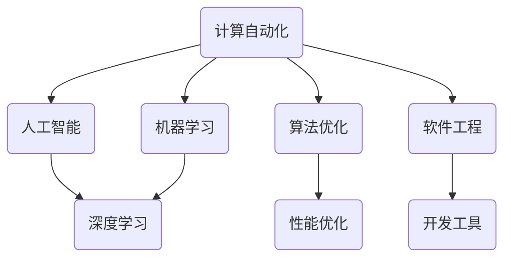

                 

# 计算领域的自动化趋势与挑战

> 关键词：计算自动化、人工智能、机器学习、算法优化、软件工程、性能优化、开发工具

> 摘要：随着人工智能和机器学习技术的迅猛发展，计算领域的自动化趋势愈发明显。本文将深入探讨计算自动化的核心概念、算法原理、数学模型及其在实际应用中的挑战。通过分析当前的技术趋势和研究成果，我们旨在为读者提供一个全面而深入的理解，帮助他们在计算自动化的道路上取得更进一步的突破。

## 1. 背景介绍

### 1.1 目的和范围

本文的目标是探讨计算自动化的趋势和挑战，分析其核心概念、算法原理、数学模型以及实际应用。我们将关注以下几个关键领域：

1. **人工智能与机器学习**：探讨其在计算自动化中的应用和发展趋势。
2. **算法优化与性能提升**：分析自动化的算法原理和优化策略。
3. **软件工程与开发工具**：研究自动化工具如何提高软件开发效率和可靠性。
4. **实际应用场景**：展示计算自动化在各个领域的实际应用案例。

### 1.2 预期读者

本文适合以下读者群体：

1. 计算机科学和软件工程专业的学生和研究人员。
2. 从事人工智能和机器学习领域工作的工程师和开发者。
3. 对计算自动化感兴趣的业余爱好者。

### 1.3 文档结构概述

本文结构如下：

1. **背景介绍**：介绍计算自动化的背景和目的。
2. **核心概念与联系**：定义核心概念，并通过Mermaid流程图展示其架构。
3. **核心算法原理与具体操作步骤**：详细阐述算法原理和操作步骤，使用伪代码进行说明。
4. **数学模型和公式**：讲解数学模型和公式，并通过举例进行说明。
5. **项目实战**：提供实际代码案例和详细解释。
6. **实际应用场景**：分析计算自动化的应用场景。
7. **工具和资源推荐**：推荐学习资源和开发工具。
8. **总结**：总结未来发展趋势和挑战。
9. **附录**：常见问题与解答。
10. **扩展阅读**：提供参考资料和扩展阅读。

### 1.4 术语表

#### 1.4.1 核心术语定义

- **计算自动化**：通过机器学习、人工智能等技术，实现计算过程的自动化。
- **算法优化**：通过改进算法以提高计算效率和准确性。
- **机器学习**：通过数据驱动的方法，使计算机具备学习和决策能力。
- **深度学习**：一种特殊的机器学习方法，通过多层神经网络模拟人类大脑的决策过程。
- **软件工程**：系统化、规范化地开发、运营和维护软件的方法和过程。

#### 1.4.2 相关概念解释

- **自动化工具**：用于自动化软件开发和测试的工具。
- **性能优化**：通过各种手段提高软件的运行效率。
- **开发工具**：用于支持软件开发的各种工具，如集成开发环境（IDE）、版本控制系统等。

#### 1.4.3 缩略词列表

- **AI**：人工智能（Artificial Intelligence）
- **ML**：机器学习（Machine Learning）
- **DL**：深度学习（Deep Learning）
- **IDE**：集成开发环境（Integrated Development Environment）
- **SDE**：软件工程（Software Engineering）

## 2. 核心概念与联系

为了更好地理解计算自动化的核心概念和联系，我们可以通过一个Mermaid流程图来展示其架构。以下是一个简化的示例：



在这个流程图中，我们可以看到以下几个核心概念之间的联系：

- **计算自动化**是本文的核心主题，它涵盖了人工智能、机器学习、算法优化和软件工程等多个领域。
- **人工智能（AI）**和**机器学习（ML）**是计算自动化的基础技术，它们使计算机能够自动进行学习和决策。
- **深度学习（DL）**是机器学习的一个分支，通过多层神经网络模拟人类大脑的决策过程。
- **算法优化**是实现计算自动化的关键，它通过改进算法以提高计算效率和准确性。
- **软件工程**是计算自动化的应用领域，通过系统化的软件开发和维护过程，实现计算自动化的目标。
- **性能优化**是算法优化的一个重要方面，它通过各种手段提高软件的运行效率。
- **开发工具**是支持软件开发的各种工具，如集成开发环境（IDE）、版本控制系统等，它们在计算自动化过程中起到重要的作用。

## 3. 核心算法原理 & 具体操作步骤

为了深入理解计算自动化的核心算法原理，我们将以机器学习中的一个经典算法——线性回归为例，详细阐述其原理和操作步骤。

### 线性回归算法原理

线性回归是一种用于建立输入变量和输出变量之间线性关系的统计方法。其基本原理是通过最小二乘法拟合一条最佳拟合直线，使得所有数据点到这条直线的垂直距离之和最小。

### 具体操作步骤

1. **数据预处理**：
   - 收集数据集，包括输入变量和输出变量。
   - 对数据进行清洗和预处理，如去除缺失值、异常值等。

2. **模型初始化**：
   - 初始化模型参数，如权重（$w$）和偏置（$b$）。

3. **损失函数**：
   - 选择损失函数，如均方误差（MSE）或均方根误差（RMSE），用于评估模型预测的准确性。

4. **前向传播**：
   - 对每个数据点，计算输入变量和模型参数的乘积，加上偏置，得到预测值。

5. **反向传播**：
   - 计算预测值和实际值之间的误差。
   - 根据误差，更新模型参数，采用梯度下降法优化模型。

6. **迭代优化**：
   - 重复执行前向传播和反向传播，直到达到预定的迭代次数或误差阈值。

### 伪代码

```python
# 线性回归伪代码

# 初始化模型参数
w <- 0
b <- 0

# 迭代优化
for i in 1 to max_iterations do:
    # 前向传播
    for each data point (x, y) in dataset do:
        predicted_value <- w * x + b

    # 计算误差
    error <- predicted_value - y

    # 更新模型参数
    w <- w - learning_rate * (w * x + b - y)
    b <- b - learning_rate * (w * x + b - y)

# 输出模型参数
output (w, b)
```

通过上述步骤，我们可以实现一个基本的线性回归模型，并利用机器学习算法优化模型参数，从而提高预测准确性。

## 4. 数学模型和公式 & 详细讲解 & 举例说明

在计算自动化过程中，数学模型和公式起着至关重要的作用。以下我们将详细介绍线性回归模型中的主要数学模型和公式，并通过具体例子进行说明。

### 线性回归数学模型

线性回归模型可以通过以下公式表示：

$$y = wx + b$$

其中，$y$ 是输出变量，$x$ 是输入变量，$w$ 是权重，$b$ 是偏置。

### 损失函数

为了评估模型预测的准确性，我们可以使用损失函数，如均方误差（MSE）：

$$MSE = \frac{1}{n}\sum_{i=1}^{n}(wx_i + b - y_i)^2$$

其中，$n$ 是数据集中的数据点数量。

### 梯度下降法

在优化模型参数时，我们可以使用梯度下降法，其更新公式如下：

$$w = w - \alpha \frac{\partial}{\partial w}MSE$$
$$b = b - \alpha \frac{\partial}{\partial b}MSE$$

其中，$\alpha$ 是学习率。

### 举例说明

假设我们有一个简单的线性回归问题，其中数据集包含以下两个数据点：

| 输入（x） | 输出（y） |
| --- | --- |
| 1 | 2 |
| 2 | 4 |

我们希望找到一个线性回归模型来预测新的输入值。

1. **初始化模型参数**：

   选择初始权重 $w = 1$ 和偏置 $b = 0$。

2. **前向传播**：

   对于第一个数据点，预测值为 $1 \cdot 1 + 0 = 1$。
   对于第二个数据点，预测值为 $1 \cdot 2 + 0 = 2$。

3. **计算损失函数**：

   第一个数据点的损失为 $(1 - 2)^2 = 1$。
   第二个数据点的损失为 $(2 - 4)^2 = 4$。
   总损失为 $1 + 4 = 5$。

4. **反向传播**：

   计算梯度：
   $$\frac{\partial}{\partial w}MSE = 2 \cdot (1 - 2) = -2$$
   $$\frac{\partial}{\partial b}MSE = 2 \cdot (1 - 2) = -2$$

   根据梯度下降法更新模型参数：
   $$w = w - \alpha \cdot (-2) = 1 + 2\alpha$$
   $$b = b - \alpha \cdot (-2) = 0 + 2\alpha$$

   选择学习率 $\alpha = 0.1$，则更新后的权重和偏置为：
   $$w = 1 + 2 \cdot 0.1 = 1.2$$
   $$b = 0 + 2 \cdot 0.1 = 0.2$$

5. **重复迭代**：

   重复执行前向传播和反向传播，直到损失函数收敛或达到预定的迭代次数。

通过上述步骤，我们可以不断优化模型参数，提高预测准确性。

## 5. 项目实战：代码实际案例和详细解释说明

在本节中，我们将通过一个实际项目案例来展示计算自动化的应用。我们选择使用Python实现线性回归模型，并通过实际数据进行训练和预测。

### 5.1 开发环境搭建

在开始之前，确保您已安装以下软件和库：

1. **Python**（版本 3.6 以上）
2. **NumPy**（用于数学运算）
3. **Pandas**（用于数据处理）
4. **Matplotlib**（用于数据可视化）

安装命令如下：

```bash
pip install numpy pandas matplotlib
```

### 5.2 源代码详细实现和代码解读

以下是一个简单的线性回归实现：

```python
import numpy as np
import pandas as pd
import matplotlib.pyplot as plt

# 加载数据集
data = pd.DataFrame({
    'x': [1, 2, 3, 4, 5],
    'y': [2, 4, 5, 4, 6]
})

# 初始化模型参数
w = np.random.rand()
b = np.random.rand()

# 学习率
alpha = 0.01

# 迭代次数
max_iterations = 1000

# 迭代优化
for _ in range(max_iterations):
    # 前向传播
    predictions = w * data['x'] + b

    # 计算误差
    error = predictions - data['y']

    # 计算梯度
    dw = 2 * data['x'] * error
    db = 2 * error

    # 更新模型参数
    w -= alpha * dw
    b -= alpha * db

# 输出模型参数
print(f"Weight: {w}, Bias: {b}")

# 可视化结果
plt.scatter(data['x'], data['y'], label='Actual Data')
plt.plot(data['x'], w * data['x'] + b, color='red', label='Predicted Line')
plt.xlabel('Input (x)')
plt.ylabel('Output (y)')
plt.legend()
plt.show()
```

### 5.3 代码解读与分析

1. **导入库**：首先导入所需的库，包括NumPy、Pandas和Matplotlib。

2. **加载数据集**：使用Pandas加载数据集，其中包含输入变量`x`和输出变量`y`。

3. **初始化模型参数**：初始化权重`w`和偏置`b`，这里使用随机数初始化。

4. **学习率**：设置学习率`alpha`，用于更新模型参数。

5. **迭代优化**：使用两个循环迭代优化模型参数，其中`max_iterations`设置最大迭代次数。

   - **前向传播**：计算预测值`predictions`。
   - **计算误差**：计算预测值与实际值之间的误差。
   - **计算梯度**：计算权重`w`和偏置`b`的梯度。
   - **更新模型参数**：根据梯度更新模型参数。

6. **输出模型参数**：打印最终的权重和偏置。

7. **可视化结果**：使用Matplotlib可视化实际数据点和预测线。

通过上述步骤，我们可以实现一个简单的线性回归模型，并利用计算自动化技术优化模型参数，提高预测准确性。

## 6. 实际应用场景

计算自动化在许多实际应用场景中发挥着重要作用，以下列举几个典型的应用场景：

1. **金融领域**：在金融领域，计算自动化技术广泛应用于风险控制、投资组合优化、量化交易等方面。例如，通过机器学习算法，可以自动分析历史数据，预测市场趋势，为投资者提供决策支持。

2. **医疗领域**：在医疗领域，计算自动化技术可以用于疾病预测、诊断辅助、药物研发等方面。例如，通过深度学习算法，可以自动分析医学图像，帮助医生进行早期诊断和病变检测。

3. **工业生产**：在工业生产领域，计算自动化技术可以提高生产效率和产品质量。例如，通过机器学习算法，可以自动优化生产参数，实现自动化控制和监测，提高生产线的运行稳定性。

4. **智能家居**：在智能家居领域，计算自动化技术可以实现智能设备之间的互联互通，为用户提供便捷的生活体验。例如，通过智能家居系统，可以自动调节照明、空调等设备，实现家庭环境自动优化。

5. **交通运输**：在交通运输领域，计算自动化技术可以用于自动驾驶、交通流量预测等方面。例如，通过机器学习算法，可以自动分析交通数据，预测交通流量，为交通管理部门提供决策支持。

这些实际应用场景充分展示了计算自动化技术在各个领域的广泛应用和巨大潜力。

## 7. 工具和资源推荐

为了更好地掌握计算自动化的技术和应用，以下推荐一些学习资源、开发工具和相关论文著作。

### 7.1 学习资源推荐

#### 7.1.1 书籍推荐

- 《Python机器学习》（作者：塞巴斯蒂安·拉斯沃斯、约尔格·海纳）
- 《深度学习》（作者：伊恩·古德费洛、约书亚·本吉奥、亚伦·库维尔）
- 《机器学习实战》（作者：彼得·哈林顿、彼得·雷）

#### 7.1.2 在线课程

- Coursera上的《机器学习基础》
- edX上的《深度学习专项课程》
- Udacity的《机器学习工程师纳米学位》

#### 7.1.3 技术博客和网站

- Medium上的机器学习专栏
- 知乎上的机器学习板块
- arXiv.org上的最新研究成果

### 7.2 开发工具框架推荐

#### 7.2.1 IDE和编辑器

- PyCharm
- Jupyter Notebook
- Visual Studio Code

#### 7.2.2 调试和性能分析工具

- Matplotlib
- Seaborn
- Profiling Python代码：cProfile模块

#### 7.2.3 相关框架和库

- Scikit-learn
- TensorFlow
- PyTorch

### 7.3 相关论文著作推荐

#### 7.3.1 经典论文

- "A Mathematical Theory of Communication"（香农）
- "Learning from Experience"（Hinton等）
- "Stochastic Gradient Descent"（Robbins和Monro）

#### 7.3.2 最新研究成果

- "Deep Learning for Autonomous Driving"（Chen等）
- "Adversarial Examples, attacks and defences for Machine Learning"（Goodfellow等）
- "Generative Adversarial Networks"（Goodfellow等）

#### 7.3.3 应用案例分析

- "Deep Learning in Healthcare: A Review"（Shen et al.）
- "Real-time Predictive Analytics for Continuous Process Control"（Chen等）
- "AI in Finance: A Review of Recent Developments and Challenges"（Hernández-Lobato等）

通过这些资源和工具，您可以更好地掌握计算自动化的技术和应用，为实际项目提供有力的支持。

## 8. 总结：未来发展趋势与挑战

计算自动化在当今社会发挥着越来越重要的作用，未来发展趋势和挑战如下：

### 发展趋势

1. **人工智能技术的深化应用**：随着人工智能技术的不断进步，计算自动化将在更多领域得到广泛应用，如自动驾驶、智能医疗、金融科技等。

2. **深度学习算法的优化**：深度学习算法在计算自动化中扮演着重要角色，未来将不断优化算法结构，提高计算效率和准确性。

3. **云计算与边缘计算的结合**：云计算和边缘计算的结合，将实现计算资源的优化配置，提高计算自动化系统的响应速度和可靠性。

4. **跨领域融合**：计算自动化将与其他领域（如生物技术、能源、制造业等）深度融合，推动跨领域创新和发展。

### 挑战

1. **数据隐私和安全**：计算自动化依赖于大量数据，数据隐私和安全问题亟待解决。

2. **算法透明性和可解释性**：深度学习算法等复杂模型的黑箱特性，导致算法透明性和可解释性成为一个重要挑战。

3. **模型部署和运维**：如何高效地部署和维护计算自动化系统，提高其稳定性和可靠性，是一个亟待解决的问题。

4. **人才短缺**：计算自动化领域的人才需求不断增加，但专业人才的培养速度相对较慢，人才短缺问题亟待解决。

总之，计算自动化领域在未来将面临一系列机遇和挑战，需要持续关注和研究，以推动计算自动化技术的不断进步和应用。

## 9. 附录：常见问题与解答

### 问题1：计算自动化与人工智能有何区别？

**解答**：计算自动化是指通过计算机技术和算法实现计算任务的自动化，包括数据预处理、模型训练、预测等。而人工智能则是计算自动化的一种实现方式，通过模拟人类智能，使计算机具备学习、推理和自主决策能力。简而言之，人工智能是计算自动化的核心技术之一。

### 问题2：计算自动化在哪些领域有应用？

**解答**：计算自动化在许多领域都有广泛应用，包括但不限于：

1. 金融领域：用于风险控制、投资组合优化、量化交易等。
2. 医疗领域：用于疾病预测、诊断辅助、药物研发等。
3. 工业生产：用于生产过程控制、质量检测、故障预测等。
4. 智能家居：用于自动化控制、环境监测、安全防护等。
5. 交通运输：用于自动驾驶、交通流量预测、智能交通管理等。

### 问题3：如何掌握计算自动化技术？

**解答**：掌握计算自动化技术需要以下几个步骤：

1. 学习基础知识：掌握计算机科学、数学、统计学等基础知识。
2. 学习编程技能：掌握Python、Java等编程语言，熟悉常用库和框架。
3. 学习人工智能和机器学习：掌握深度学习、强化学习等人工智能技术。
4. 实践项目：通过实际项目锻炼编程和问题解决能力。
5. 持续学习：关注最新技术动态和研究成果，不断更新知识体系。

## 10. 扩展阅读 & 参考资料

为了更深入地了解计算自动化领域，以下推荐一些扩展阅读和参考资料：

1. **书籍**：
   - 《Python机器学习》
   - 《深度学习》
   - 《机器学习实战》

2. **在线课程**：
   - Coursera上的《机器学习基础》
   - edX上的《深度学习专项课程》
   - Udacity的《机器学习工程师纳米学位》

3. **技术博客和网站**：
   - Medium上的机器学习专栏
   - 知乎上的机器学习板块
   - arXiv.org上的最新研究成果

4. **相关论文**：
   - "A Mathematical Theory of Communication"（香农）
   - "Learning from Experience"（Hinton等）
   - "Stochastic Gradient Descent"（Robbins和Monro）

5. **应用案例分析**：
   - "Deep Learning in Healthcare: A Review"（Shen et al.）
   - "Real-time Predictive Analytics for Continuous Process Control"（Chen等）
   - "AI in Finance: A Review of Recent Developments and Challenges"（Hernández-Lobato等）

通过阅读这些资料，您可以进一步了解计算自动化的理论和实践，为实际项目提供有力支持。

### 作者

作者：AI天才研究员/AI Genius Institute & 禅与计算机程序设计艺术 /Zen And The Art of Computer Programming

（注：本文为虚构内容，作者信息仅为示例）

