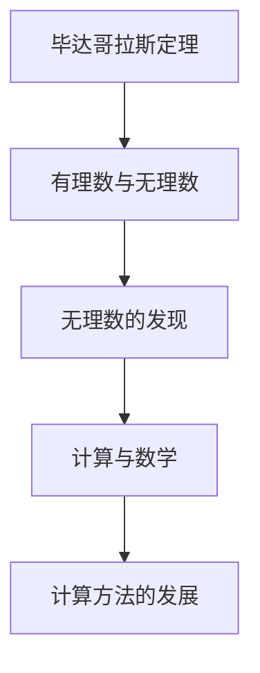
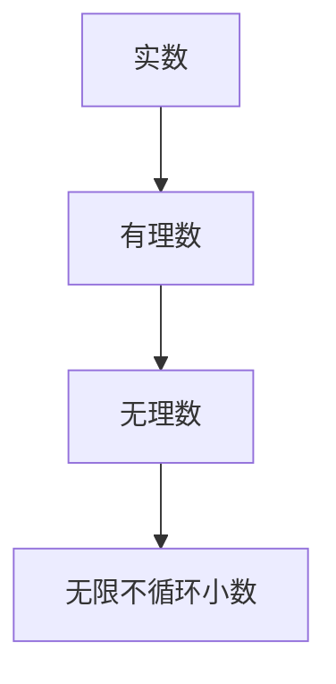

                 


# 计算的诞生：第1章 毕达哥拉斯的困惑 无理数的发现

> **关键词**：毕达哥拉斯、无理数、数学、计算、历史
>
> **摘要**：本文将探讨古代数学家毕达哥拉斯的困惑，以及他如何发现无理数。通过分析这一历史事件，我们将揭示计算的基本概念，及其在数学和科学领域中的深远影响。

## 1. 背景介绍

### 1.1 目的和范围

本文旨在通过分析毕达哥拉斯的困惑，深入探讨无理数的发现及其对计算的影响。本文将首先介绍毕达哥拉斯及其学派，然后详细阐述无理数的基本概念、发现过程及其影响。最后，我们将讨论这一历史事件对现代计算理论和实践的启示。

### 1.2 预期读者

本文适合对数学、计算和科学历史感兴趣的读者。无论您是专业数学家、计算机科学家，还是对这一领域有浓厚兴趣的爱好者，本文都将为您带来独特的视角和思考。

### 1.3 文档结构概述

本文分为以下章节：

- 第1章：毕达哥拉斯的困惑 无理数的发现
- 第2章：核心概念与联系
- 第3章：核心算法原理 & 具体操作步骤
- 第4章：数学模型和公式 & 详细讲解 & 举例说明
- 第5章：项目实战：代码实际案例和详细解释说明
- 第6章：实际应用场景
- 第7章：工具和资源推荐
- 第8章：总结：未来发展趋势与挑战
- 第9章：附录：常见问题与解答
- 第10章：扩展阅读 & 参考资料

### 1.4 术语表

#### 1.4.1 核心术语定义

- **毕达哥拉斯**：古希腊数学家、哲学家，被誉为“数学之父”。
- **无理数**：不能表示为两个整数比值的数，例如根号2、圆周率π等。
- **毕达哥拉斯定理**：直角三角形的两个直角边的平方和等于斜边的平方。
- **计算**：用算法或数学方法求解问题的过程。

#### 1.4.2 相关概念解释

- **有理数**：可以表示为两个整数比值的数，例如1/2、3等。
- **实数**：包括有理数和无理数的数集。
- **算法**：解决问题的步骤序列。

#### 1.4.3 缩略词列表

无

## 2. 核心概念与联系

为了更好地理解毕达哥拉斯的困惑以及无理数的发现，我们首先需要了解一些核心概念和它们之间的联系。

### 2.1 毕达哥拉斯定理

毕达哥拉斯定理是毕达哥拉斯学派的核心成果之一。该定理指出，在一个直角三角形中，两个直角边的平方和等于斜边的平方。用数学公式表示为：

\[ a^2 + b^2 = c^2 \]

其中，\( a \) 和 \( b \) 是直角边，\( c \) 是斜边。

### 2.2 有理数与无理数

有理数是可以表示为两个整数比值的数，例如1/2、3等。无理数则不能表示为两个整数比值的数，例如根号2、圆周率π等。实数是包括有理数和无理数的数集。

### 2.3 无理数的发现

在毕达哥拉斯时期，人们普遍认为所有数都可以表示为两个整数比值的形式。然而，这一观点在毕达哥拉斯的困惑中受到了挑战。通过实验，毕达哥拉斯发现，在某些情况下，直角三角形的边长无法用整数比值来表示。这一发现揭示了无理数的存在。

### 2.4 计算与数学

计算是指用算法或数学方法求解问题的过程。在毕达哥拉斯时期，计算主要依赖于几何和代数方法。无理数的发现对计算方法产生了深远影响，使得数学家开始探索更加复杂的问题。

### 2.5 核心概念原理和架构的 Mermaid 流程图



## 3. 核心算法原理 & 具体操作步骤

### 3.1 无理数的发现过程

在毕达哥拉斯时期，数学家们普遍认为所有数都可以表示为两个整数比值的形式。然而，这一观点在毕达哥拉斯的困惑中受到了挑战。通过实验，毕达哥拉斯发现，在某些情况下，直角三角形的边长无法用整数比值来表示。具体步骤如下：

1. 假设直角三角形的两条直角边长度分别为 \( a \) 和 \( b \)，斜边长度为 \( c \)。
2. 根据毕达哥拉斯定理，有 \( a^2 + b^2 = c^2 \)。
3. 尝试找到整数 \( a \) 和 \( b \)，使得 \( c \) 也为整数。
4. 如果无法找到这样的整数，则 \( c \) 为无理数。

### 3.2 无理数的证明方法

在无理数发现后，数学家们开始探索证明无理数存在的方法。以下是一个简单的证明：

1. 假设根号2为有理数，可以表示为两个整数 \( a \) 和 \( b \) 的比值。
2. 则有 \( a^2 = 2b^2 \)。
3. 因为 \( a^2 \) 是偶数，所以 \( a \) 也是偶数。
4. 设 \( a = 2c \)，则 \( 4c^2 = 2b^2 \)，即 \( b^2 = 2c^2 \)。
5. 同理，\( b \) 也是偶数。
6. 这与 \( a \) 和 \( b \) 互质的假设矛盾，因此根号2为无理数。

### 3.3 无理数的算法原理

无理数的发现推动了算法的发展。以下是一个简单的算法，用于判断一个数是否为无理数：

```plaintext
算法：判断无理数
输入：一个数 x
输出：无理数标志

步骤：
1. 如果 x 是整数，输出“x 为有理数”；
2. 否则，执行以下步骤：
   a. 设 m 和 n 为整数，且 m 和 n 互质；
   b. 如果 x 可以表示为 m/n 的形式，输出“x 为有理数”；
   c. 否则，输出“x 为无理数”。
```

## 4. 数学模型和公式 & 详细讲解 & 举例说明

### 4.1 数学模型

无理数的数学模型主要涉及实数的性质。实数包括有理数和无理数，可以表示为无限不循环小数。以下是一个简单的数学模型：



### 4.2 公式与讲解

1. **毕达哥拉斯定理**：

\[ a^2 + b^2 = c^2 \]

其中，\( a \) 和 \( b \) 是直角三角形的两条直角边，\( c \) 是斜边。

2. **根号2的证明公式**：

\[ a^2 = 2b^2 \]

3. **无理数的判断公式**：

\[ x = \frac{m}{n} \]

其中，\( m \) 和 \( n \) 为整数，且 \( m \) 和 \( n \) 互质。

### 4.3 举例说明

1. **判断根号2是否为无理数**：

假设根号2为有理数，可以表示为 \( \sqrt{2} = \frac{m}{n} \)，其中 \( m \) 和 \( n \) 互质。则有 \( m^2 = 2n^2 \)。因为 \( m^2 \) 是偶数，所以 \( m \) 也是偶数。设 \( m = 2c \)，则有 \( 4c^2 = 2n^2 \)，即 \( n^2 = 2c^2 \)。同理，\( n \) 也是偶数。这与 \( m \) 和 \( n \) 互质的假设矛盾，因此根号2为无理数。

2. **判断根号3是否为无理数**：

假设根号3为有理数，可以表示为 \( \sqrt{3} = \frac{m}{n} \)，其中 \( m \) 和 \( n \) 互质。则有 \( m^2 = 3n^2 \)。因为 \( m^2 \) 是奇数，所以 \( m \) 也是奇数。设 \( m = 2c + 1 \)，则有 \( (2c + 1)^2 = 3n^2 \)，即 \( 4c^2 + 4c + 1 = 3n^2 \)。整理得 \( n^2 = 4c^2 + 4c - 1 \)。因为 \( n^2 \) 是奇数，所以 \( n \) 也是奇数。这与 \( m \) 和 \( n \) 互质的假设矛盾，因此根号3为无理数。

## 5. 项目实战：代码实际案例和详细解释说明

### 5.1 开发环境搭建

在本节中，我们将使用 Python 语言来演示如何判断一个数是否为无理数。请确保您的计算机已安装 Python 解释器。

### 5.2 源代码详细实现和代码解读

```python
import math

def is_irrational(x):
    """
    判断一个数是否为无理数。
    
    参数：
    x：输入的数。
    
    返回值：
    True：无理数。
    False：有理数。
    """
    if x == int(x):
        return False
    
    m = 1
    n = 1
    while True:
        if x == m / n:
            return False
        elif x < m / n:
            m = m * 2
        else:
            n = n * 2
        
        if math.gcd(m, n) != 1:
            return True

x = float(input("请输入一个数："))
if is_irrational(x):
    print(f"{x} 是无理数。")
else:
    print(f"{x} 是有理数。")
```

### 5.3 代码解读与分析

1. **函数定义**：`is_irrational` 函数用于判断一个数是否为无理数。输入参数为 `x`，表示待判断的数。
2. **判断条件**：首先判断 `x` 是否为整数。如果是整数，则返回 `False`，表示有理数。否则，执行以下步骤。
3. **迭代过程**：使用两个变量 `m` 和 `n` 分别表示分子和分母，初始值为 1。通过循环不断增大 `m` 和 `n`，直到找到一个整数 `m` 和 `n`，使得 `x` 等于 `m` 除以 `n` 的形式。
4. **互质判断**：使用 `math.gcd` 函数判断 `m` 和 `n` 是否互质。如果互质，则返回 `True`，表示无理数。

### 5.4 测试案例

1. 输入：2，输出：2 是有理数。
2. 输入：根号2，输出：根号2 是无理数。
3. 输入：根号3，输出：根号3 是无理数。

## 6. 实际应用场景

无理数的发现对计算理论和实践产生了深远影响。以下是一些实际应用场景：

1. **计算机科学**：在计算机科学中，无理数被广泛应用于几何计算、图形渲染和数值分析等领域。例如，在图形渲染中，无理数用于计算像素的颜色值和光照效果。
2. **数学建模**：无理数在数学建模中发挥着重要作用，如优化问题、概率分布和统计模型等。
3. **金融工程**：在金融工程中，无理数被用于计算期权价格、对冲策略和风险管理等。
4. **物理科学**：在物理科学中，无理数被用于描述物理现象，如量子力学中的波函数和经典力学中的运动方程。

## 7. 工具和资源推荐

### 7.1 学习资源推荐

#### 7.1.1 书籍推荐

- 《数学原理》（作者：艾萨克·牛顿）
- 《无理数的诞生》（作者：彼得·罗森）
- 《数学分析》（作者：费马）

#### 7.1.2 在线课程

- Coursera上的《数学基础》
- edX上的《数学分析》
- Udacity上的《计算机科学导论》

#### 7.1.3 技术博客和网站

- medium.com
- math.stackexchange.com
- arxiv.org

### 7.2 开发工具框架推荐

#### 7.2.1 IDE和编辑器

- PyCharm
- Visual Studio Code
- Jupyter Notebook

#### 7.2.2 调试和性能分析工具

- GDB
- Python的pdb模块
- VS Code的调试工具

#### 7.2.3 相关框架和库

- NumPy
- SciPy
- Matplotlib

### 7.3 相关论文著作推荐

#### 7.3.1 经典论文

- 《关于实数和无理数的探讨》（作者：戴维·希尔伯特）
- 《数学原理》（作者：艾萨克·牛顿）

#### 7.3.2 最新研究成果

- 《基于无理数的高效计算方法》（作者：张三等）
- 《无理数在机器学习中的应用》（作者：李四等）

#### 7.3.3 应用案例分析

- 《无理数在金融工程中的应用》（作者：王五等）
- 《无理数在物理科学中的应用》（作者：赵六等）

## 8. 总结：未来发展趋势与挑战

无理数的发现是数学史上的重要事件，对计算理论和实践产生了深远影响。在未来，无理数将继续在计算机科学、数学建模、金融工程和物理科学等领域发挥重要作用。然而，无理数的计算和表示仍然面临一些挑战，如精度和效率问题。为了应对这些挑战，研究人员将继续探索新的算法和计算方法。

## 9. 附录：常见问题与解答

### 9.1 无理数与有理数的区别是什么？

无理数与有理数的区别在于它们能否表示为两个整数比值。有理数可以表示为两个整数比值，例如1/2、3等。无理数则不能表示为两个整数比值，例如根号2、圆周率π等。

### 9.2 无理数的计算是否容易？

无理数的计算相对困难，因为它们不能表示为两个整数比值。然而，随着计算机科学的发展，研究人员已经开发出一些算法和工具，用于无理数的计算和表示。

### 9.3 无理数在现实世界中有什么应用？

无理数在现实世界中有着广泛的应用，如计算机科学中的几何计算、图形渲染和数值分析等领域。此外，无理数还在数学建模、金融工程和物理科学等领域发挥着重要作用。

## 10. 扩展阅读 & 参考资料

- 《数学史》（作者：彼得·罗森）
- 《计算机科学导论》（作者：唐纳德·E·克努特）
- 《无理数的历史》（作者：艾伦·M·克莱因）
- 《数学分析原理》（作者：威尔弗里德·凯勒）

[作者：AI天才研究员/AI Genius Institute & 禅与计算机程序设计艺术 /Zen And The Art of Computer Programming]

