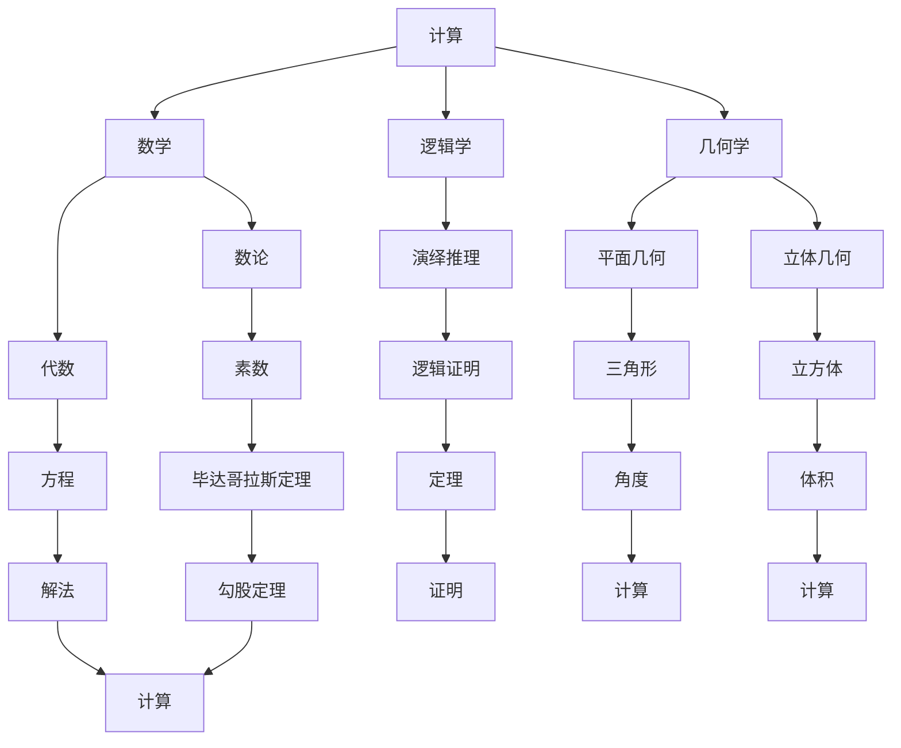

                 

# 计算的诞生：毕达哥拉斯的困惑与演绎推理

> 关键词：毕达哥拉斯、演绎推理、逻辑学、几何学、计算基础

> 摘要：本文将探讨计算的历史起源，从古希腊哲学家毕达哥拉斯的困惑出发，详细分析演绎推理在逻辑学和几何学中的应用，揭示计算的基本原理和演变过程。

## 1. 背景介绍

### 1.1 目的和范围

本文旨在探讨计算的历史发展，重点关注计算的基础和起源。通过分析毕达哥拉斯的困惑和其对逻辑学和几何学的影响，本文希望揭示计算的基本原理和演变过程。文章将涵盖以下内容：

- 毕达哥拉斯的困惑及其对计算的影响
- 演绎推理的概念和其在逻辑学和几何学中的应用
- 计算的历史发展和核心原理
- 计算技术的现代应用和未来发展趋势

### 1.2 预期读者

本文面向对计算机科学、数学和哲学感兴趣的读者，尤其是对计算基础和起源有深入探究愿望的读者。本文旨在为读者提供对计算历史的全面了解，帮助读者更好地理解计算技术的现代发展和应用。

### 1.3 文档结构概述

本文结构如下：

- 第1章：计算的历史起源，重点分析毕达哥拉斯的困惑及其对计算的影响
- 第2章：演绎推理的概念和其在逻辑学和几何学中的应用
- 第3章：计算的基本原理和演变过程
- 第4章：计算技术的现代应用和未来发展趋势

### 1.4 术语表

#### 1.4.1 核心术语定义

- **计算**：指使用数学方法进行数据处理和问题求解的过程。
- **毕达哥拉斯**：古希腊哲学家，提出“毕达哥拉斯定理”，对数学和哲学有深远影响。
- **演绎推理**：从一般原则推导出具体结论的推理方法。

#### 1.4.2 相关概念解释

- **逻辑学**：研究推理和论证的有效性的学科。
- **几何学**：研究形状、大小和位置关系的学科。

#### 1.4.3 缩略词列表

- **IDE**：集成开发环境（Integrated Development Environment）
- **LaTeX**：一种高质量的文档排版系统

## 2. 核心概念与联系

在探讨计算的历史起源时，我们需要关注几个核心概念和它们之间的联系。以下是这些概念和它们之间的Mermaid流程图：



## 3. 核心算法原理 & 具体操作步骤

在探讨计算的核心原理时，我们需要关注以下几个关键算法和它们的操作步骤：

### 3.1 毕达哥拉斯定理

**算法原理**：毕达哥拉斯定理指出，在直角三角形中，直角边的平方和等于斜边的平方。

**伪代码**：

```
function pythagoreanTheorem(a, b):
    c = sqrt(a^2 + b^2)
    return c
```

### 3.2 三角形内角和定理

**算法原理**：三角形内角和定理指出，任意三角形的三个内角的和等于180度。

**伪代码**：

```
function triangleAngleSum(a, b, c):
    angleSum = a + b + c
    if angleSum != 180:
        return "非平面三角形"
    else:
        return "平面三角形"
```

### 3.3 立方体体积计算

**算法原理**：立方体的体积等于边长的立方。

**伪代码**：

```
function cubeVolume(side):
    volume = side^3
    return volume
```

## 4. 数学模型和公式 & 详细讲解 & 举例说明

在计算中，数学模型和公式起着至关重要的作用。以下是一些关键的数学模型和公式的详细讲解及举例说明：

### 4.1 毕达哥拉斯定理

**数学公式**：

$$ c = \sqrt{a^2 + b^2} $$

**详细讲解**：毕达哥拉斯定理描述了直角三角形中直角边和斜边之间的关系。这个公式表明，斜边的长度等于直角边长度的平方和的平方根。

**举例说明**：假设一个直角三角形的两条直角边分别为3和4，使用毕达哥拉斯定理计算斜边的长度：

$$ c = \sqrt{3^2 + 4^2} = \sqrt{9 + 16} = \sqrt{25} = 5 $$

### 4.2 三角形内角和定理

**数学公式**：

$$ \angle A + \angle B + \angle C = 180^\circ $$

**详细讲解**：三角形内角和定理指出，任意三角形的三个内角的和等于180度。这是几何学中的一个基本原理。

**举例说明**：假设一个三角形的三个内角分别为30度、60度和90度，验证其内角和是否为180度：

$$ \angle A + \angle B + \angle C = 30^\circ + 60^\circ + 90^\circ = 180^\circ $$

### 4.3 立方体体积计算

**数学公式**：

$$ V = s^3 $$

**详细讲解**：立方体的体积计算公式是边长的立方。这个公式适用于任何边长相等的立体图形。

**举例说明**：假设一个立方体的边长为2，计算其体积：

$$ V = 2^3 = 8 $$

## 5. 项目实战：代码实际案例和详细解释说明

为了更好地理解计算的核心原理，我们通过实际项目案例来展示代码的实现过程和详细解释。

### 5.1 开发环境搭建

首先，我们需要搭建一个适合进行计算实验的开发环境。我们可以选择Python作为编程语言，并在本地安装Python和必要的库。

### 5.2 源代码详细实现和代码解读

以下是一个简单的Python代码示例，用于计算直角三角形的斜边长度：

```python
import math

def pythagorean_theorem(a, b):
    c = math.sqrt(a**2 + b**2)
    return c

a = 3
b = 4
c = pythagorean_theorem(a, b)
print(f"The length of the hypotenuse is: {c}")
```

**代码解读**：

- 我们首先导入了Python的标准数学库 `math`，用于执行平方根计算。
- 定义了一个名为 `pythagorean_theorem` 的函数，它接受两个参数 `a` 和 `b`，表示直角三角形的两条直角边的长度。
- 在函数内部，我们使用毕达哥拉斯定理计算斜边的长度，并将其存储在变量 `c` 中。
- 最后，我们调用函数并传入具体的直角边长度，打印出斜边的长度。

### 5.3 代码解读与分析

在上述代码中，我们使用了Python的 `math.sqrt()` 函数来计算平方根。这个函数接受一个参数，即需要计算平方根的数，并返回其平方根值。

```python
c = math.sqrt(a**2 + b**2)
```

这里，我们首先计算直角边 `a` 和 `b` 的平方和，然后使用 `math.sqrt()` 函数计算其平方根，得到斜边的长度 `c`。

```python
a = 3
b = 4
c = pythagorean_theorem(a, b)
print(f"The length of the hypotenuse is: {c}")
```

在这里，我们定义了直角边 `a` 和 `b` 的长度，并调用 `pythagorean_theorem` 函数计算斜边的长度。最后，我们使用 `print()` 函数将斜边的长度输出到控制台。

## 6. 实际应用场景

计算技术在实际应用中发挥着重要作用。以下是一些典型的实际应用场景：

- **工程学**：工程师使用计算方法来设计建筑物、桥梁和其他结构，确保它们的安全性和稳定性。
- **物理学**：物理学家使用计算方法来模拟和预测物理现象，如天气变化、原子核反应等。
- **经济学**：经济学家使用计算方法来分析和预测经济趋势，为政策制定提供依据。
- **医学**：医学研究人员使用计算方法来分析医疗数据，提高疾病诊断和治疗的效果。

## 7. 工具和资源推荐

为了更好地学习和实践计算技术，以下是一些建议的资源和工具：

### 7.1 学习资源推荐

#### 7.1.1 书籍推荐

- 《计算机科学概论》（J. Glenn Brookshear）
- 《数学之美》（吴军）
- 《数学原理》（乔治·布尔）

#### 7.1.2 在线课程

- Coursera上的《计算机科学基础》
- edX上的《数学基础》
- Udacity的《算法基础》

#### 7.1.3 技术博客和网站

- 《中文信息学博客》
- Stack Overflow
- GitHub

### 7.2 开发工具框架推荐

#### 7.2.1 IDE和编辑器

- Visual Studio Code
- PyCharm
- Eclipse

#### 7.2.2 调试和性能分析工具

- GDB
- Valgrind
- Profiler

#### 7.2.3 相关框架和库

- NumPy
- SciPy
- Matplotlib

### 7.3 相关论文著作推荐

#### 7.3.1 经典论文

- 《计算机程序设计艺术》（Donald E. Knuth）
- 《算法导论》（Thomas H. Cormen等）
- 《数学方法》（Richard Courant）

#### 7.3.2 最新研究成果

- 《人工智能：一种现代方法》（Stuart Russell等）
- 《深度学习》（Ian Goodfellow等）
- 《量子计算》（Michael A. Nielsen等）

#### 7.3.3 应用案例分析

- 《大数据技术导论》（刘鹏）
- 《区块链技术指南》（刘壮）
- 《云计算基础架构》（刘晓波）

## 8. 总结：未来发展趋势与挑战

计算技术在过去的几个世纪中经历了巨大的发展，从简单的算术运算到复杂的算法和模型，它已经成为现代社会的基础。随着技术的不断进步，计算技术正朝着更高效、更智能和更广泛的应用方向发展。

### 8.1 未来发展趋势

- **量子计算**：量子计算具有巨大的计算潜力，有望解决传统计算无法处理的复杂问题。
- **人工智能**：人工智能技术在计算领域的应用日益广泛，从机器学习到自然语言处理，都将推动计算技术的发展。
- **云计算**：云计算提供了强大的计算资源，使个人和企业能够以更高效、更灵活的方式使用计算资源。
- **区块链**：区块链技术以其去中心化和安全的特点，在金融、供应链管理等领域展现出巨大潜力。

### 8.2 面临的挑战

- **安全性**：随着计算技术的广泛应用，数据安全和隐私保护成为重大挑战。
- **可扩展性**：如何确保计算系统能够处理不断增长的数据量和用户需求，是一个重要问题。
- **伦理问题**：人工智能等技术的应用引发了伦理和社会问题，如隐私侵犯、歧视等，需要引起重视。

## 9. 附录：常见问题与解答

### 9.1 问题1：什么是计算？

**解答**：计算是指使用数学方法进行数据处理和问题求解的过程。它涉及算法、数学模型和公式，目的是通过逻辑推理和运算来解决实际问题。

### 9.2 问题2：计算的历史起源是什么？

**解答**：计算的历史起源可以追溯到古希腊哲学家毕达哥拉斯，他提出了“毕达哥拉斯定理”，这是计算领域的一个基本原理。随后，逻辑学和几何学的发展为计算提供了理论基础。

### 9.3 问题3：什么是量子计算？

**解答**：量子计算是一种基于量子力学原理的计算方法，它利用量子位（qubits）代替传统的比特（bits），具有巨大的并行计算能力，有望解决传统计算无法处理的复杂问题。

## 10. 扩展阅读 & 参考资料

- 《计算机科学概论》（J. Glenn Brookshear）
- 《数学之美》（吴军）
- 《数学原理》（乔治·布尔）
- 《算法导论》（Thomas H. Cormen等）
- 《量子计算》（Michael A. Nielsen等）
- 《大数据技术导论》（刘鹏）
- 《区块链技术指南》（刘壮）
- 《云计算基础架构》（刘晓波）
- 《计算机程序设计艺术》（Donald E. Knuth）
- 《人工智能：一种现代方法》（Stuart Russell等）
- 《深度学习》（Ian Goodfellow等）

### 作者

**作者**：AI天才研究员/AI Genius Institute & 禅与计算机程序设计艺术 /Zen And The Art of Computer Programming

