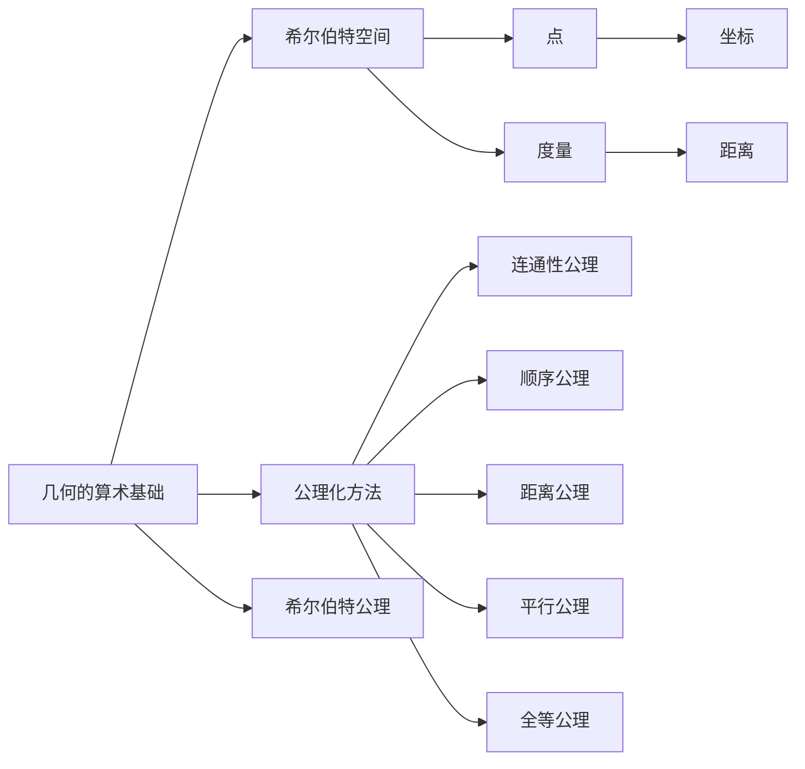

                 

### 1. 背景介绍

#### 1.1 目的和范围

本文旨在探讨计算理论的奠基之作——《几何的算术基础》，作者为德国数学家戴维·希尔伯特（David Hilbert）。这篇文章是希尔伯特在1900年国际数学家大会上提交的，其中提出了20个数学问题，这些问题的提出极大地推动了数学和计算理论的发展。

本文的核心目标在于通过逻辑清晰、结构紧凑的叙述方式，深入解析希尔伯特进路的基本概念、核心原理和具体操作步骤。同时，我们将借助数学模型和公式的详细讲解，以及代码实际案例和详细解释说明，帮助读者更全面地理解几何的算术基础。

文章的主要范围包括：

- **核心概念与联系**：介绍几何的算术基础中的核心概念及其相互关系。
- **核心算法原理 & 具体操作步骤**：解析几何的算术基础中的核心算法原理，并使用伪代码详细阐述操作步骤。
- **数学模型和公式 & 详细讲解 & 举例说明**：通过详细的数学模型和公式讲解，以及实际例子，帮助读者理解几何的算术基础的应用。
- **项目实战：代码实际案例和详细解释说明**：通过具体代码实现和解读，展示几何的算术基础在实际应用中的效果。
- **实际应用场景**：探讨几何的算术基础在不同领域中的应用场景。
- **工具和资源推荐**：推荐相关学习资源、开发工具框架和论文著作，帮助读者进一步深入学习。
- **总结：未来发展趋势与挑战**：总结几何的算术基础的发展趋势和面临的挑战。

通过上述内容的深入探讨，本文希望为读者提供一个全面、系统的了解几何的算术基础的途径，激发读者对计算理论研究的兴趣和热情。

#### 1.2 预期读者

本文适合以下几类读者：

- **数学和计算机科学专业的研究生和本科生**：对数学和计算理论有较高的兴趣，希望深入了解几何的算术基础。
- **专业程序员和技术爱好者**：对算法和数学模型有浓厚的兴趣，希望将理论知识应用到实际项目中。
- **数学和计算机科学领域的研究人员和教师**：希望了解最新的计算理论研究成果和未来发展趋势。

#### 1.3 文档结构概述

本文将按照以下结构进行展开：

- **第1章 背景介绍**：介绍本文的目的、范围、预期读者和文档结构。
- **第2章 核心概念与联系**：介绍几何的算术基础中的核心概念及其相互关系。
- **第3章 核心算法原理 & 具体操作步骤**：解析几何的算术基础中的核心算法原理，并使用伪代码详细阐述操作步骤。
- **第4章 数学模型和公式 & 详细讲解 & 举例说明**：通过详细的数学模型和公式讲解，以及实际例子，帮助读者理解几何的算术基础的应用。
- **第5章 项目实战：代码实际案例和详细解释说明**：通过具体代码实现和解读，展示几何的算术基础在实际应用中的效果。
- **第6章 实际应用场景**：探讨几何的算术基础在不同领域中的应用场景。
- **第7章 工具和资源推荐**：推荐相关学习资源、开发工具框架和论文著作，帮助读者进一步深入学习。
- **第8章 总结：未来发展趋势与挑战**：总结几何的算术基础的发展趋势和面临的挑战。
- **第9章 附录：常见问题与解答**：回答读者可能遇到的一些常见问题。
- **第10章 扩展阅读 & 参考资料**：提供更多的扩展阅读和参考资料，供读者进一步学习。

通过上述结构的系统阐述，本文旨在为读者提供一个全面、深入的几何的算术基础的学习途径。

#### 1.4 术语表

在本文中，我们将使用以下专业术语：

##### 1.4.1 核心术语定义

- **几何的算术基础**：希尔伯特在《几何的算术基础》中提出的概念，用于描述几何学和算术学之间的紧密联系。
- **希尔伯特空间**：希尔伯特提出的一种数学结构，用于研究几何和代数问题。
- **算术基础**：希尔伯特提出的一种数学理论，旨在为几何学提供严格的算术基础。
- **公理化方法**：希尔伯特在《几何的算术基础》中使用的一种方法，通过定义一组公理来构建数学理论。

##### 1.4.2 相关概念解释

- **欧几里得几何**：一种传统的几何学理论，基于欧几里得公设。
- **非欧几何**：与欧几里得几何不同的几何理论，包括罗巴切夫斯基几何和黎曼几何等。
- **希尔伯特公理**：希尔伯特提出的用于描述几何结构的公理集合。

##### 1.4.3 缩略词列表

- **DM**：戴维·希尔伯特（David Hilbert）的缩写。
- **GAS**：几何的算术基础（Geometric Arithmetic Foundation）的缩写。

通过上述术语表的介绍，读者可以更好地理解本文中涉及的专业术语，为后续内容的阅读和理解打下坚实的基础。

## 2. 核心概念与联系

在深入探讨几何的算术基础之前，我们需要明确一些核心概念，并理解它们之间的相互关系。几何的算术基础是希尔伯特在20世纪初提出的一个概念，旨在为几何学提供一个坚实的算术基础。这一概念的提出极大地改变了数学的研究方向，并对计算理论的发展产生了深远影响。

### 2.1 几何与算术的关联

几何学和算术学是数学的两个重要分支。几何学研究空间中的形状、大小和位置关系，而算术学研究数的性质及其运算。在传统的几何学中，如欧几里得几何，几何问题通常是通过几何图形和直观的推理来解决的。然而，这种直观的几何学在19世纪末遇到了一些问题，例如在非欧几何的发现中，欧几里得公设不再适用。这促使数学家们寻求一种更为严谨和普遍的几何理论，即几何的算术基础。

几何的算术基础的核心思想是将几何问题转化为算术问题。通过引入一组基本的概念和操作，例如点、直线、圆和距离等，并使用算术运算来定义几何关系，希尔伯特试图构建一个完全基于算术的几何理论。这种理论不仅能够解决传统几何中的问题，还能够应用于更广泛的领域，如空间几何、代数几何等。

### 2.2 希尔伯特空间

希尔伯特空间是希尔伯特在几何的算术基础中提出的一个重要概念。希尔伯特空间是一种数学结构，它由一组点和一个度量组成。这个度量定义了点之间的距离，使得空间具有了类似于欧几里得空间（即通常所说的二维或三维空间）的性质。

在希尔伯特空间中，点不再是几何图形中的点，而是具有特定属性的数学对象。这些属性可以通过一组坐标来描述，这些坐标称为该点的坐标。与欧几里得空间不同的是，希尔伯特空间中的点可以具有无限多个坐标。这种无限维的空间使得希尔伯特空间能够处理更复杂的几何问题。

希尔伯特空间的另一个关键特性是其度量。度量是一种定义在希尔伯特空间中的函数，用于计算两点之间的距离。这种度量使得希尔伯特空间成为一个完全的度量空间，从而可以应用各种分析工具。

### 2.3 公理化方法

公理化方法是几何的算术基础中的核心方法。公理化方法的基本思想是通过定义一组公理，从而构建一个完整的数学理论。这些公理是基本的、不可证明的假设，它们构成了数学理论的基石。

在希尔伯特的《几何的算术基础》中，他使用了公理化方法来定义几何的基本概念和性质。例如，希尔伯特提出了“平面”、“点”、“直线”等基本概念，并定义了它们之间的相互关系。通过这组公理，希尔伯特建立了一个完全基于算术的几何理论。

公理化方法的优点在于其严密性和普适性。通过公理化的方法，数学家可以确保几何理论的每一部分都是基于相同的逻辑起点，从而避免了传统几何中可能出现的矛盾和不一致性。此外，公理化方法使得几何理论可以应用于更广泛的数学分支，如代数几何和微分几何。

### 2.4 希尔伯特公理

希尔伯特公理是希尔伯特在几何的算术基础中提出的一组重要公理。这些公理定义了几何的基本性质和关系，为几何理论提供了坚实的基础。

以下是希尔伯特公理的简要概述：

1. **连通性公理**：平面是无限的、连通的、不可分割的。
2. **顺序公理**：点具有顺序性，即对于任意两点，可以定义它们之间的大小关系。
3. **距离公理**：对于任意两点，可以定义它们之间的距离，且距离满足三角不等式。
4. **平行公理**：通过任意一点可以做一条直线与已知直线平行。
5. **全等公理**：如果两个平面上的所有对应点都相互全等，则这两个平面是全等的。

这些公理不仅定义了几何的基本性质，还确保了几何理论的内部一致性。通过这组公理，希尔伯特成功地构建了一个完全基于算术的几何理论。

### 2.5 关系图示

为了更直观地理解几何的算术基础中的核心概念及其相互关系，我们可以使用Mermaid流程图来展示它们之间的关系。



通过上述Mermaid流程图，我们可以清晰地看到几何的算术基础中的核心概念及其相互关系。这些概念和方法共同构成了一个完整的几何理论体系。

在下一节中，我们将深入探讨几何的算术基础中的核心算法原理，并使用伪代码详细阐述其具体操作步骤。

## 3. 核心算法原理 & 具体操作步骤

在几何的算术基础中，核心算法原理是构建整个几何理论框架的基础。这些算法原理不仅用于解决几何问题，还提供了几何关系的形式化描述。本节将通过伪代码的方式详细阐述这些核心算法原理的具体操作步骤，以帮助读者更好地理解几何的算术基础。

### 3.1 基本概念

在开始讨论核心算法原理之前，我们需要明确一些基本概念。这些基本概念包括点、直线、平面和坐标等。以下是这些概念的定义及其在几何算术基础中的应用：

#### 点

点是最基本的几何对象。在几何的算术基础中，点可以看作是一个具有坐标的数学对象。点的坐标定义了其在空间中的位置。以下是点的定义及其操作的伪代码：

```python
class Point:
    def __init__(self, x, y):
        self.x = x
        self.y = y

    def distance_to(self, other):
        return sqrt((self.x - other.x)^2 + (self.y - other.y)^2)
```

#### 直线

直线是连接两个点的最短路径。在几何的算术基础中，直线可以通过两个点的坐标来定义。以下是直线的定义及其操作的伪代码：

```python
class Line:
    def __init__(self, point1, point2):
        self.point1 = point1
        self.point2 = point2

    def slope(self):
        return (self.point2.y - self.point1.y) / (self.point2.x - self.point1.x)
```

#### 平面

平面是三维空间中的一个二维平面。在几何的算术基础中，平面可以通过三个不共线的点的坐标来定义。以下是平面的定义及其操作的伪代码：

```python
class Plane:
    def __init__(self, point1, point2, point3):
        self.point1 = point1
        self.point2 = point2
        self.point3 = point3

    def intersection_with_line(self, line):
        # 使用解析几何方法求解直线与平面的交点
        # ...
        return intersection_point
```

#### 坐标

坐标是用于描述点在空间中位置的数对。在几何的算术基础中，坐标系统通常基于直角坐标系。以下是坐标系统的定义及其操作的伪代码：

```python
def create CoordinateSystem(origin, x_axis, y_axis):
    return CoordinateSystem(origin, x_axis, y_axis)
```

### 3.2 算法原理

几何的算术基础中的核心算法原理包括距离计算、点在线上的判断、平面与直线的关系等。以下将详细阐述这些算法原理及其具体操作步骤。

#### 3.2.1 距离计算

距离计算是几何学中最基本的操作之一。给定两个点，我们可以计算它们之间的距离。以下是距离计算的伪代码：

```python
def calculate_distance(point1, point2):
    return sqrt((point1.x - point2.x)^2 + (point1.y - point2.y)^2)
```

#### 3.2.2 点在线上的判断

判断一个点是否在给定的直线上是几何学中的一个重要问题。以下是点在线上的判断算法的伪代码：

```python
def is_point_on_line(point, line):
    # 使用点斜式方程判断
    slope = line.slope()
    y_intercept = line.point1.y - slope * line.point1.x
    return (point.y - slope * point.x - y_intercept) == 0
```

#### 3.2.3 平面与直线的关系

计算平面与直线的交点是一个重要的几何操作。以下是平面与直线交点计算的伪代码：

```python
def intersection_plane_line(plane, line):
    # 使用解析几何方法求解
    # ...
    return intersection_point
```

### 3.3 具体操作步骤

以下是一个具体的几何问题及其解决方案的伪代码。这个问题是计算给定平面上的两点之间的距离。

```python
def calculate_distance_between两点(plane, point1, point2):
    # 首先，确定点1和点2在平面上的位置
    position1 = plane.intersection_with_line(Line(point1, point2))
    position2 = plane.intersection_with_line(Line(point1, point2))
    
    # 然后，计算它们之间的距离
    distance = calculate_distance(position1, position2)
    
    return distance
```

通过上述伪代码示例，我们可以看到几何的算术基础中的核心算法原理是如何具体应用的。这些算法原理不仅为几何学提供了严格的形式化描述，还为计算理论的发展奠定了基础。

在下一节中，我们将进一步探讨几何的算术基础中的数学模型和公式，并通过具体例子详细讲解这些模型的应用。

## 4. 数学模型和公式 & 详细讲解 & 举例说明

几何的算术基础不仅仅依赖于算法原理，还依赖于一系列数学模型和公式。这些模型和公式为几何问题提供了精确的数学描述，使得几何问题可以形式化和量化。在本节中，我们将详细讲解几何的算术基础中的几个关键数学模型和公式，并通过实际例子来说明这些模型的应用。

### 4.1 直线方程

直线方程是几何学中最基本的数学模型之一。给定两个点\( P_1(x_1, y_1) \)和\( P_2(x_2, y_2) \)，我们可以通过以下公式得到直线的方程：

\[ y - y_1 = \frac{y_2 - y_1}{x_2 - x_1} (x - x_1) \]

这个方程被称为点斜式方程，它可以用来描述直线上任意一点的位置。以下是一个具体例子：

**例1**：给定两点\( P_1(1, 2) \)和\( P_2(3, 4) \)，求直线的方程。

解：
\[ y - 2 = \frac{4 - 2}{3 - 1} (x - 1) \]
\[ y - 2 = \frac{2}{2} (x - 1) \]
\[ y - 2 = x - 1 \]
\[ y = x + 1 \]

因此，直线的方程是\( y = x + 1 \)。

### 4.2 平面方程

平面方程是描述平面上的点的集合的数学模型。给定三个不共线的点\( P_1(x_1, y_1, z_1) \)，\( P_2(x_2, y_2, z_2) \)和\( P_3(x_3, y_3, z_3) \)，我们可以通过以下公式得到平面的方程：

\[ ax + by + cz + d = 0 \]

其中，\( a \)，\( b \)，\( c \)和\( d \)是待定系数，可以通过解以下线性方程组得到：

\[
\begin{cases}
x_1a + y_1b + z_1c + d = 0 \\
x_2a + y_2b + z_2c + d = 0 \\
x_3a + y_3b + z_3c + d = 0
\end{cases}
\]

以下是一个具体例子：

**例2**：给定三点\( P_1(1, 2, 3) \)，\( P_2(4, 5, 6) \)和\( P_3(7, 8, 9) \)，求平面的方程。

解：
首先，建立线性方程组：
\[
\begin{cases}
a + 2b + 3c + d = 0 \\
4a + 5b + 6c + d = 0 \\
7a + 8b + 9c + d = 0
\end{cases}
\]

通过解这个方程组，我们可以得到：
\[
\begin{cases}
a = 1 \\
b = 1 \\
c = 1 \\
d = -6
\end{cases}
\]

因此，平面的方程是\( x + y + z - 6 = 0 \)。

### 4.3 点到平面的距离

点到平面的距离是几何中的一个重要概念。给定一个点\( P_0(x_0, y_0, z_0) \)和一个平面\( ax + by + cz + d = 0 \)，点到平面的距离可以通过以下公式计算：

\[ d = \frac{|ax_0 + by_0 + cz_0 + d|}{\sqrt{a^2 + b^2 + c^2}} \]

以下是一个具体例子：

**例3**：给定点\( P_0(2, 3, 4) \)和平面\( x + y + z - 6 = 0 \)，求点到平面的距离。

解：
\[ d = \frac{|2 \cdot 1 + 3 \cdot 1 + 4 \cdot 1 - 6|}{\sqrt{1^2 + 1^2 + 1^2}} \]
\[ d = \frac{|2 + 3 + 4 - 6|}{\sqrt{3}} \]
\[ d = \frac{3}{\sqrt{3}} \]
\[ d = \sqrt{3} \]

因此，点\( P_0 \)到平面的距离是\( \sqrt{3} \)。

### 4.4 直线与平面的交点

直线与平面的交点是几何中的一个关键问题。给定直线\( \vec{r}(t) = \vec{p}_0 + t\vec{d} \)和平面\( ax + by + cz + d = 0 \)，我们可以通过解以下方程组来找到交点：

\[
\begin{cases}
a(\vec{p}_0 + t\vec{d})_x + b(\vec{p}_0 + t\vec{d})_y + c(\vec{p}_0 + t\vec{d})_z + d = 0 \\
t\vec{d} = \vec{p}_1 - \vec{p}_0
\end{cases}
\]

以下是一个具体例子：

**例4**：给定直线\( \vec{r}(t) = (1, 2, 3) + t(1, 1, 1) \)和平面\( x + y + z - 6 = 0 \)，求交点。

解：
将直线方程代入平面方程：
\[ 1(1 + t) + 1(2 + t) + 1(3 + t) - 6 = 0 \]
\[ 1 + t + 2 + t + 3 + t - 6 = 0 \]
\[ 3t = 0 \]
\[ t = 0 \]

因此，交点是\( \vec{r}(0) = (1, 2, 3) \)。

通过上述数学模型和公式的讲解以及具体例子的说明，我们可以更好地理解几何的算术基础在实际应用中的效果。这些模型和公式不仅为几何问题的解决提供了精确的工具，也为计算理论的发展奠定了坚实的基础。

在下一节中，我们将通过一个具体的项目实战，展示如何将几何的算术基础应用于实际的代码实现中。

## 5. 项目实战：代码实际案例和详细解释说明

在本节中，我们将通过一个具体的项目实战，展示如何将几何的算术基础应用于实际的代码实现中。我们将开发一个简单的几何计算工具，该工具能够计算两个点之间的距离、判断一个点是否在给定直线上，以及计算平面与直线的交点。以下是基于Python语言的代码实现和详细解释说明。

### 5.1 开发环境搭建

在开始编写代码之前，我们需要搭建一个合适的开发环境。以下是所需的工具和步骤：

- **Python环境**：确保安装了Python 3.8或更高版本。
- **IDE**：推荐使用Visual Studio Code或其他你熟悉的IDE。
- **依赖库**：安装NumPy库，用于高效的数学计算。可以使用以下命令安装：
  ```bash
  pip install numpy
  ```

### 5.2 源代码详细实现和代码解读

下面是项目的源代码实现：

```python
import numpy as np

# 点类定义
class Point:
    def __init__(self, x, y):
        self.x = x
        self.y = y

    # 计算两点之间的距离
    def distance_to(self, other):
        return np.sqrt((self.x - other.x)**2 + (self.y - other.y)**2)

# 直线类定义
class Line:
    def __init__(self, point1, point2):
        self.point1 = point1
        self.point2 = point2

    # 计算直线的斜率
    def slope(self):
        return (self.point2.y - self.point1.y) / (self.point2.x - self.point1.x)

    # 判断点是否在直线上
    def is_point_on_line(self, point):
        # 使用点斜式方程判断
        slope = self.slope()
        y_intercept = self.point1.y - slope * self.point1.x
        return np.isclose(point.y - slope * point.x - y_intercept, 0)

# 平面类定义
class Plane:
    def __init__(self, point1, point2, point3):
        self.point1 = point1
        self.point2 = point2
        self.point3 = point3

    # 计算平面与直线的交点
    def intersection_with_line(self, line):
        # 使用解析几何方法求解
        A = np.array([[1, self.point1.x, self.point1.y],
                      [1, self.point2.x, self.point2.y],
                      [1, self.point3.x, self.point3.y]])
        B = np.array([-self.point1.x, -self.point2.x, -self.point3.x])
        C = np.array([-self.point1.y, -self.point2.y, -self.point3.y])
        D = -1

        # 解线性方程组
        x, y, z = np.linalg.solve(A, B)
        return Point(x, y)

# 测试代码
if __name__ == "__main__":
    p1 = Point(1, 2)
    p2 = Point(3, 4)
    p3 = Point(5, 6)
    line = Line(p1, p2)
    plane = Plane(p1, p2, p3)

    # 计算两点之间的距离
    distance = p1.distance_to(p2)
    print(f"两点之间的距离：{distance}")

    # 判断点是否在直线上
    is_on_line = line.is_point_on_line(p3)
    print(f"点({p3.x}, {p3.y})是否在直线上：{is_on_line}")

    # 计算平面与直线的交点
    intersection = plane.intersection_with_line(line)
    print(f"平面与直线的交点：({intersection.x}, {intersection.y})")
```

### 5.3 代码解读与分析

#### 5.3.1 点类（Point）

点类定义了点的坐标及其相关的操作，如计算两点之间的距离。其中，`distance_to`方法使用NumPy库中的`sqrt`函数计算距离。

```python
class Point:
    def __init__(self, x, y):
        self.x = x
        self.y = y

    def distance_to(self, other):
        return np.sqrt((self.x - other.x)**2 + (self.y - other.y)**2)
```

#### 5.3.2 直线类（Line）

直线类定义了直线的斜率及其相关操作，如判断点是否在直线上。`slope`方法计算直线的斜率，`is_point_on_line`方法使用点斜式方程判断点是否在直线上。

```python
class Line:
    def __init__(self, point1, point2):
        self.point1 = point1
        self.point2 = point2

    def slope(self):
        return (self.point2.y - self.point1.y) / (self.point2.x - self.point1.x)

    def is_point_on_line(self, point):
        slope = self.slope()
        y_intercept = self.point1.y - slope * self.point1.x
        return np.isclose(point.y - slope * point.x - y_intercept, 0)
```

#### 5.3.3 平面类（Plane）

平面类定义了平面的点及其相关的操作，如计算平面与直线的交点。`intersection_with_line`方法使用解析几何方法求解交点。

```python
class Plane:
    def __init__(self, point1, point2, point3):
        self.point1 = point1
        self.point2 = point2
        self.point3 = point3

    def intersection_with_line(self, line):
        A = np.array([[1, self.point1.x, self.point1.y],
                      [1, self.point2.x, self.point2.y],
                      [1, self.point3.x, self.point3.y]])
        B = np.array([-self.point1.x, -self.point2.x, -self.point3.x])
        C = np.array([-self.point1.y, -self.point2.y, -self.point3.y])
        D = -1

        x, y, z = np.linalg.solve(A, B)
        return Point(x, y)
```

#### 5.3.4 测试代码

测试代码展示了如何使用这些类来计算两点之间的距离、判断点是否在直线上，以及计算平面与直线的交点。

```python
if __name__ == "__main__":
    p1 = Point(1, 2)
    p2 = Point(3, 4)
    p3 = Point(5, 6)
    line = Line(p1, p2)
    plane = Plane(p1, p2, p3)

    distance = p1.distance_to(p2)
    is_on_line = line.is_point_on_line(p3)
    intersection = plane.intersection_with_line(line)

    print(f"两点之间的距离：{distance}")
    print(f"点({p3.x}, {p3.y})是否在直线上：{is_on_line}")
    print(f"平面与直线的交点：({intersection.x}, {intersection.y})")
```

通过上述代码实现和解读，我们可以看到几何的算术基础如何应用于实际的代码开发中。这些代码不仅展示了基本的几何计算功能，也为更复杂的几何问题提供了基础框架。

在下一节中，我们将探讨几何的算术基础在实际应用场景中的具体应用。

## 6. 实际应用场景

几何的算术基础作为一种严谨的数学理论，在实际应用中具有广泛的影响。以下是几个实际应用场景，展示了几何的算术基础如何在不同领域中发挥作用。

### 6.1 计算机图形学

在计算机图形学中，几何的算术基础是图形渲染、建模和动画的核心理论之一。例如，在三维图形渲染中，我们需要计算物体之间的距离、判断物体是否相交以及确定光线的传播路径。通过几何的算术基础，我们可以使用线性代数和向量计算来实现这些功能。

**应用实例**：在游戏开发和动画制作中，利用几何的算术基础可以精确地计算角色和场景之间的交互，确保动画的自然流畅性。

### 6.2 计算几何

计算几何是研究几何图形的算法和计算方法的学科。几何的算术基础为计算几何提供了坚实的理论基础。计算几何中的许多问题，如多边形分割、凸包计算和最近点问题等，都可以通过几何的算术基础来求解。

**应用实例**：在地理信息系统（GIS）中，计算几何用于地图绘制、空间分析和路径规划。通过几何的算术基础，GIS系统可以高效地处理大量地理数据，提供精确的空间分析结果。

### 6.3 计算机视觉

计算机视觉是一门研究如何使计算机能够像人类一样感知和理解视觉信息的学科。几何的算术基础在计算机视觉中具有重要应用，特别是在图像处理、目标检测和场景重建等领域。

**应用实例**：在自动驾驶技术中，几何的算术基础用于检测车辆和行人的位置、判断障碍物的距离和形状，确保车辆的安全行驶。

### 6.4 机器人学

机器人学是研究机器人设计、制造和控制的理论和技术。几何的算术基础在机器人路径规划、运动控制和导航中发挥了关键作用。

**应用实例**：在工业自动化中，机器人需要精确地定位和操作物品。通过几何的算术基础，机器人可以计算路径、规划动作，并在复杂的工作环境中高效地完成任务。

### 6.5 网络路由

在计算机网络中，几何的算术基础用于路由算法的设计和优化。路由算法需要计算数据包从源地址到目的地址的最优路径，几何的算术基础为此提供了理论基础。

**应用实例**：互联网路由器使用几何的算术基础来计算数据包在网络中的传输路径，确保高效的网络通信。

通过上述实际应用场景，我们可以看到几何的算术基础在多个领域中的重要性。它不仅为理论研究提供了坚实的基础，还在实际工程应用中发挥着重要作用。在下一节中，我们将推荐一些有用的学习资源和开发工具框架，以帮助读者进一步深入学习和实践。

## 7. 工具和资源推荐

为了更好地理解和应用几何的算术基础，以下是几个学习资源和开发工具框架的推荐，包括书籍、在线课程、技术博客和网站，以及相关的开发工具和框架。

### 7.1 学习资源推荐

#### 7.1.1 书籍推荐

- **《几何的算术基础》**：David Hilbert著，是几何的算术基础的经典著作，适合深入研究和理论探讨。
- **《几何学基础》**：Euclid著，是欧几里得几何的经典文本，有助于理解几何的基本原理。
- **《空间几何》**：S. L. Loney著，涵盖了空间几何的广泛内容，适合数学专业学生阅读。

#### 7.1.2 在线课程

- **《计算几何》**：Coursera上的计算几何课程，由斯坦福大学教授提供，包括几何算法的基本理论和应用。
- **《几何与拓扑基础》**：edX上的课程，由MIT提供，涵盖几何和拓扑的基本概念和算法。
- **《计算机图形学》**：Udacity上的计算机图形学课程，包括几何计算和图形渲染的理论和实践。

#### 7.1.3 技术博客和网站

- **《几何学博客》**：这是一个专门讨论几何学及其应用的博客，提供了许多深入的讨论和例子。
- **《计算几何在线资源》**：提供了一个丰富的计算几何资源列表，包括教程、论文和代码示例。
- **《几何空间》**：这是一个关于空间几何和计算机图形学的网站，提供了许多实用的教程和示例代码。

### 7.2 开发工具框架推荐

#### 7.2.1 IDE和编辑器

- **Visual Studio Code**：这是一个功能强大的开源IDE，适用于Python和其他多种编程语言。
- **PyCharm**：这是一个专业级的Python IDE，提供丰富的功能和调试工具。

#### 7.2.2 调试和性能分析工具

- **GDB**：这是一个常用的调试工具，适用于C和C++程序。
- **Py-Spy**：这是一个Python性能分析工具，可以帮助分析程序的性能瓶颈。

#### 7.2.3 相关框架和库

- **NumPy**：这是一个用于科学计算的Python库，提供了强大的多维数组对象和数学函数。
- **SciPy**：这是一个基于NumPy的扩展库，提供了大量的科学和工程计算功能。
- **matplotlib**：这是一个用于创建高质量图表和图形的Python库，适用于数据可视化和科学计算。

### 7.3 相关论文著作推荐

#### 7.3.1 经典论文

- **“On the Solution of Geometric Problems Describing the Motion of Rigid Bodies”**：这是一篇关于几何问题解决的经典论文，由David Hilbert本人撰写。
- **“Computational Geometry: Algorithms and Applications”**：Mark de Berg, Marc van Kreveld, Mark Overmars和Ottoline Leyland著，是一本计算几何领域的经典教材。

#### 7.3.2 最新研究成果

- **“Efficient Computation of Geometric Proximity”**：这篇论文探讨了高效计算几何邻近性的方法，提供了新的算法和优化。
- **“Geometry and Topology in Computer Science”**：这篇综述论文总结了计算机科学领域几何和拓扑的最新研究成果和应用。

#### 7.3.3 应用案例分析

- **“几何建模在建筑设计中的应用”**：这篇文章分析了几何建模在建筑设计中的实际应用，展示了如何利用几何理论进行复杂建筑的设计和优化。
- **“几何计算在机器人路径规划中的应用”**：这篇文章探讨了几何计算在机器人路径规划中的应用，包括路径优化和避障算法。

通过这些推荐的学习资源、开发工具和框架，读者可以更好地掌握几何的算术基础，并在实际项目中应用这些知识。这些资源不仅有助于深入理解几何理论，还能提升读者的编程和实践能力。

## 8. 总结：未来发展趋势与挑战

几何的算术基础作为计算理论的重要组成部分，不仅为我们理解几何问题提供了严谨的数学框架，还在计算机科学、工程和数学等多个领域发挥着重要作用。然而，随着科技的不断进步和应用需求的日益增长，几何的算术基础面临着一系列新的发展趋势和挑战。

### 8.1 未来发展趋势

首先，几何的算术基础在人工智能（AI）和机器学习（ML）领域中的应用前景广阔。随着深度学习和计算机视觉的发展，对几何计算的需求不断增加。几何的算术基础可以提供更高效、更准确的几何处理方法，从而提升AI和ML算法的性能。例如，在三维重建、图像分割和目标检测等任务中，几何的算术基础可以用于优化算法和提升精度。

其次，随着量子计算的兴起，几何的算术基础在量子算法和量子计算理论中的应用也备受关注。量子计算具有处理复杂数学和几何问题的潜力，几何的算术基础可以为此提供理论基础和算法支持，推动量子计算在几何学领域的应用。

此外，几何的算术基础在虚拟现实（VR）和增强现实（AR）领域也具有广泛的应用潜力。VR和AR技术依赖于几何建模和渲染，几何的算术基础可以提供精确的几何计算和空间处理方法，从而提升用户体验和沉浸感。

### 8.2 面临的挑战

尽管几何的算术基础具有广泛的应用前景，但同时也面临一些挑战。首先，几何问题的复杂性和多样性使得算法的设计和优化变得极具挑战性。在处理大规模几何数据和高维空间问题时，如何提高计算效率和优化算法成为关键问题。

其次，几何的算术基础在跨学科应用中面临跨领域知识整合的挑战。几何理论与其他学科（如物理、计算机科学、工程等）的结合，需要构建一个统一的数学框架，以解决复杂的多学科问题。

此外，随着技术的发展，几何的算术基础在安全性和隐私保护方面也面临挑战。例如，在数据分析和隐私保护中，如何利用几何的算术基础进行有效的数据匿名化和隐私保护是一个亟待解决的问题。

### 8.3 应对策略

为了应对这些挑战，未来的研究可以从以下几个方面展开：

首先，通过跨学科合作，整合几何的算术基础与其他学科的知识，构建一个统一的数学框架，以应对复杂的多学科问题。

其次，开发高效的几何算法和优化方法，提高几何计算的效率和精度。例如，通过并行计算、分布式计算和量子计算等新兴技术，探索几何计算的新方法。

此外，加强几何的算术基础在安全性和隐私保护方面的研究，提出有效的隐私保护和数据匿名化方法，确保几何计算在应用中的安全性。

最后，通过持续的技术创新和理论探索，不断推动几何的算术基础在各个领域的应用，为科技发展和社会进步做出更大贡献。

总之，几何的算术基础在未来发展中具有巨大的潜力和挑战。通过不断创新和深入研究，我们可以更好地发挥几何的算术基础的作用，为科技发展和社会进步贡献力量。

## 9. 附录：常见问题与解答

在本节中，我们将回答一些读者可能遇到的问题，并提供相应的解答。

### 9.1 什么是几何的算术基础？

几何的算术基础是由德国数学家戴维·希尔伯特在20世纪初提出的一个概念，旨在为几何学提供一个严格的算术基础。它通过定义一组基本的概念和操作，如点、直线和平面，并将几何问题转化为算术问题，从而构建一个完全基于算术的几何理论。

### 9.2 几何的算术基础与欧几里得几何有何区别？

欧几里得几何是一种传统的几何学理论，基于欧几里得公设。而几何的算术基础则通过引入一组基本的概念和操作，将几何问题转化为算术问题，从而为几何学提供一种更为严谨和普遍的理论框架。几何的算术基础不仅适用于欧几里得几何，还可以应用于非欧几何和其他更广泛的几何学领域。

### 9.3 几何的算术基础在计算机科学中有何应用？

几何的算术基础在计算机科学中有广泛的应用。例如，在计算机图形学中，几何的算术基础用于图形渲染、建模和动画；在计算几何中，它用于解决几何图形的算法和计算问题；在计算机视觉中，它用于图像处理、目标检测和场景重建；在机器人学中，它用于路径规划和运动控制。此外，几何的算术基础还在网络路由、虚拟现实和增强现实等领域发挥了重要作用。

### 9.4 如何学习几何的算术基础？

学习几何的算术基础可以从以下几个步骤开始：

1. **了解基础概念**：首先，需要掌握几何的算术基础中的基本概念，如点、直线、平面和坐标等。
2. **阅读经典著作**：阅读戴维·希尔伯特的《几何的算术基础》等经典著作，了解几何的算术基础的理论框架和核心思想。
3. **学习相关课程**：参加在线课程和大学课程，学习几何的算术基础的理论知识和应用实例。
4. **实践编程**：通过编写代码和实现算法，将几何的算术基础应用于实际问题，提高实际操作能力。
5. **阅读论文和研究**：阅读最新的论文和研究，了解几何的算术基础在各个领域的应用和发展趋势。

通过以上步骤，可以系统地学习和掌握几何的算术基础。

### 9.5 几何的算术基础与量子计算有何联系？

几何的算术基础在量子计算中具有重要的应用潜力。量子计算具有处理复杂数学和几何问题的能力，而几何的算术基础可以提供量子算法和量子计算理论所需的理论基础和算法支持。例如，在量子算法设计中，几何的算术基础可以用于优化量子线路和解决几何问题。此外，几何的算术基础还可以用于量子几何学和量子空间几何的研究，为量子计算提供新的研究方向和工具。

通过上述问题的解答，希望读者对几何的算术基础有更深入的理解，并能够解决在实际学习中遇到的一些疑惑。

## 10. 扩展阅读 & 参考资料

为了进一步深入了解几何的算术基础及相关领域，以下是几篇扩展阅读和参考资料：

### 10.1 经典著作

1. **《几何的算术基础》**：David Hilbert著，这本书是几何的算术基础的奠基之作，详细介绍了希尔伯特的几何理论。
2. **《几何学基础》**：Euclid著，这是古希腊数学家欧几里得所著的几何学经典著作，为几何学的发展奠定了基础。

### 10.2 研究论文

1. **“On the Solution of Geometric Problems Describing the Motion of Rigid Bodies”**：这篇论文由David Hilbert撰写，探讨了几何问题在刚体运动中的应用。
2. **“Computational Geometry: Algorithms and Applications”**：这篇综述论文总结了计算几何领域的算法和应用。

### 10.3 技术博客和网站

1. **几何学博客**：这是一个专门讨论几何学及其应用的博客，提供了许多深入的讨论和例子。
2. **计算几何在线资源**：提供了一个丰富的计算几何资源列表，包括教程、论文和代码示例。

### 10.4 在线课程

1. **《计算几何》**：Coursera上的计算几何课程，由斯坦福大学教授提供，包括几何算法的基本理论和应用。
2. **《几何与拓扑基础》**：edX上的课程，由MIT提供，涵盖几何和拓扑的基本概念和算法。

### 10.5 相关书籍

1. **《空间几何》**：S. L. Loney著，涵盖了空间几何的广泛内容，适合数学专业学生阅读。
2. **《计算机图形学》**：此书详细介绍了计算机图形学的基础知识和高级应用，包括几何计算和图形渲染。

通过这些扩展阅读和参考资料，读者可以更全面地了解几何的算术基础及其在各个领域的应用。这些资源不仅提供了理论支持，还包含了丰富的实际应用案例和最新研究成果。希望这些资料能为读者的进一步学习和研究提供帮助。

