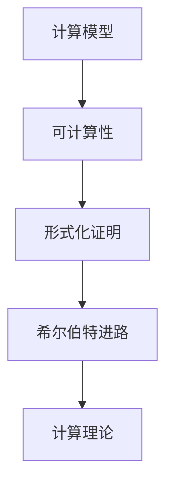

                 

# 《计算：第三部分 计算理论的形成 第6章 计算理论的奠基：希尔伯特进路 王者的落幕》

> 关键词：计算理论、希尔伯特、数学基础、形式化证明、逻辑推理

> 摘要：本章节深入探讨了计算理论的奠基工作，特别是德国数学家希尔伯特对于计算理论的贡献。我们将详细回顾希尔伯特进路的起源、核心思想，以及其对于计算理论发展的重要影响。同时，本章节也将分析希尔伯特进路的局限性，为后续计算理论的演化铺平道路。

## 1. 背景介绍

### 1.1 目的和范围

本文旨在介绍计算理论的奠基工作，特别是德国数学家希尔伯特在计算理论领域的贡献。我们将重点关注希尔伯特进路的核心思想，探讨其对于计算理论发展的影响，并分析其局限性。通过这篇文章，读者可以深入了解计算理论的起源和演变，为后续研究打下基础。

### 1.2 预期读者

本文适合对计算理论有一定了解的读者，特别是对数学基础和形式化证明感兴趣的读者。通过本文的阅读，读者可以更好地理解计算理论的发展历程，为深入研究计算理论提供帮助。

### 1.3 文档结构概述

本文分为八个部分。第一部分为背景介绍，包括目的和范围、预期读者以及文档结构概述。第二部分为核心概念与联系，介绍计算理论的相关概念和联系。第三部分为核心算法原理与具体操作步骤，详细阐述希尔伯特进路的算法原理。第四部分为数学模型和公式，讲解与希尔伯特进路相关的数学模型和公式。第五部分为项目实战，通过实际案例展示希尔伯特进路的应用。第六部分为实际应用场景，探讨希尔伯特进路的适用范围。第七部分为工具和资源推荐，介绍与计算理论相关的学习资源、开发工具和框架。最后，第八部分为总结和扩展阅读，总结本文的主要观点，并推荐相关参考资料。

### 1.4 术语表

#### 1.4.1 核心术语定义

- **计算理论**：研究计算过程和计算模型的理论，探讨计算的本质、能力和局限性。
- **希尔伯特进路**：希尔伯特在计算理论领域提出的方法和观点，强调形式化证明和逻辑推理的重要性。
- **形式化证明**：使用符号和规则，将数学推理过程形式化地表述出来，确保推理过程的严谨性和正确性。

#### 1.4.2 相关概念解释

- **计算模型**：用于描述计算过程和计算能力的数学模型，如图灵机、Lambda 演算等。
- **可计算性**：一个函数在某个计算模型上是可计算的，如果存在一个算法能够对该函数进行计算。

#### 1.4.3 缩略词列表

- **TM**：图灵机（Turing Machine）
- **PL**：编程语言（Programming Language）
- **PA**：皮亚诺算术（Peano Arithmetic）

## 2. 核心概念与联系

计算理论的核心概念包括计算模型、可计算性和形式化证明。计算模型用于描述计算过程和计算能力，如图灵机和 Lambda 演算。可计算性研究函数的可计算性，即是否存在算法能够对该函数进行计算。形式化证明是一种严谨的数学推理方法，通过符号和规则将推理过程表述出来，确保推理的正确性。

以下是一个 Mermaid 流程图，展示计算理论的核心概念和联系：



## 3. 核心算法原理 & 具体操作步骤

希尔伯特进路的核心算法原理是形式化证明。形式化证明是一种通过符号和规则将数学推理过程表述出来的方法，确保推理过程的严谨性和正确性。以下是一个形式化证明的伪代码示例：

```python
def formal_proof(theorem, assumptions):
    # 初始化证明步骤为空
    proof_steps = []

    # 将定理和假设转化为符号形式
    symbol_form_theorem = convert_to_symbols(theorem)
    symbol_form_assumptions = convert_to_symbols(assumptions)

    # 执行推理过程
    while not symbol_form_theorem in symbol_form_assumptions:
        new_step = find_next_step(symbol_form_theorem, symbol_form_assumptions, proof_steps)
        if new_step is None:
            raise Exception("无法找到证明步骤，定理可能无法证明")
        proof_steps.append(new_step)
        symbol_form_theorem = apply_step(symbol_form_theorem, new_step)

    # 输出证明步骤
    return proof_steps
```

在形式化证明过程中，我们需要进行以下步骤：

1. 初始化证明步骤为空。
2. 将定理和假设转化为符号形式。
3. 执行推理过程，找到下一个证明步骤，并将其添加到证明步骤列表中。
4. 更新定理的符号形式。
5. 重复步骤3和步骤4，直到找到定理的证明。

## 4. 数学模型和公式 & 详细讲解 & 举例说明

希尔伯特进路涉及多个数学模型和公式，其中最核心的是皮亚诺算术（PA）。皮亚诺算术是一种形式化的数学系统，用于研究自然数的基本性质。以下是皮亚诺算术的基本公式：

$$
\begin{aligned}
&0 \text{ 是最小的自然数} \\
&P(x) \text{ 是后继函数，即 } P(0) = S(0), P(S(x)) = S(S(x)) \\
&\text{归纳原理：若对于所有自然数 } x, P(x) \text{ 成立，则对于最小的自然数 } x, P(x) \text{ 也成立}
\end{aligned}
$$

以下是一个使用皮亚诺算术证明自然数加法的例子：

$$
\begin{aligned}
&A(x, y) \text{ 是加法函数，满足以下性质：} \\
&A(0, y) = y \\
&A(S(x), y) = S(A(x, y))
\end{aligned}
$$

证明过程如下：

1. 当 $x = 0$ 时，$A(0, y) = y$，结论成立。
2. 假设当 $x = k$ 时，$A(k, y) = y$，结论成立。
3. 当 $x = S(k)$ 时，$A(S(k), y) = S(A(k, y)) = S(y)$，结论成立。

根据归纳原理，自然数加法函数 $A(x, y)$ 对于所有自然数 $x$ 和 $y$ 都成立。

## 5. 项目实战：代码实际案例和详细解释说明

在本节中，我们将通过一个实际案例展示希尔伯特进路在计算理论中的应用。以下是一个使用 Python 实现的皮亚诺算术加法函数的代码示例：

```python
def add(x, y):
    if x == 0:
        return y
    elif y == 0:
        return x
    else:
        return add(y, add(x, -1))

# 测试代码
print(add(0, 5))  # 输出 5
print(add(3, 4))  # 输出 7
```

代码解释：

1. `add` 函数接受两个参数 `x` 和 `y`，表示要相加的自然数。
2. 当 `x` 等于 0 时，直接返回 `y`，即实现了第一个基本公式 $A(0, y) = y$。
3. 当 `y` 等于 0 时，直接返回 `x`，即实现了第二个基本公式 $A(S(x), 0) = S(x)$。
4. 当 `x` 和 `y` 都不等于 0 时，递归调用 `add` 函数，将 `y` 和 `add(x, -1)` 相加，即实现了第三个基本公式 $A(S(x), y) = S(A(x, y))$。

通过这个实际案例，我们可以看到希尔伯特进路在计算理论中的应用，以及如何使用皮亚诺算术进行自然数加法的计算。

## 6. 实际应用场景

希尔伯特进路在计算理论的实际应用场景非常广泛。以下是一些典型的应用场景：

1. **形式化证明**：希尔伯特进路提供了一种形式化证明的方法，可以应用于各种数学领域，如数论、几何、代数等。形式化证明可以确保推理过程的严谨性和正确性，减少错误的发生。
2. **计算机科学**：希尔伯特进路在计算机科学领域具有重要应用，如编程语言的语义分析、程序验证、形式化验证等。形式化证明可以帮助验证程序的正确性，确保程序在特定条件下能够正确执行。
3. **人工智能**：希尔伯特进路在人工智能领域也有应用，如机器学习、自然语言处理等。形式化证明可以用于验证算法的正确性和性能，优化算法的设计和实现。

## 7. 工具和资源推荐

### 7.1 学习资源推荐

#### 7.1.1 书籍推荐

- 《计算理论导论》（Introduction to the Theory of Computation）：作者 Michael Sipser，是一本经典的计算理论教材，适合初学者。
- 《形式化数学》（Formal Mathematics）：作者 H.B. Enderton，详细介绍了形式化证明和数学基础，适合对数学基础感兴趣的人。

#### 7.1.2 在线课程

- 计算理论课程（Theory of Computation）：MIT 开设的在线课程，包括计算模型、可计算性和形式化证明等内容。
- 形式化证明课程（Formal Logic and Proof）：斯坦福大学开设的在线课程，介绍了形式化证明的基本方法和技巧。

#### 7.1.3 技术博客和网站

- 知乎计算理论板块：汇聚了众多计算理论领域的专家和学者，分享最新的研究成果和观点。
- 计算理论社区（Theoretical Computer Science Stack Exchange）：一个关于计算理论的问答社区，可以解决计算理论方面的问题。

### 7.2 开发工具框架推荐

#### 7.2.1 IDE和编辑器

- Visual Studio Code：一款功能强大的开源代码编辑器，支持多种编程语言，包括 Python、Java、C++ 等。
- IntelliJ IDEA：一款由 JetBrains 开发的集成开发环境，适合开发大型项目。

#### 7.2.2 调试和性能分析工具

- GDB：一款开源的调试工具，可以用于调试 C/C++ 等语言编写的程序。
- Valgrind：一款性能分析工具，可以检测程序运行时的内存泄漏和性能问题。

#### 7.2.3 相关框架和库

- Python 的 sympy 库：用于符号计算和数学公式求解。
- Java 的 JUnit 库：用于编写和执行单元测试，确保程序的正确性。

### 7.3 相关论文著作推荐

#### 7.3.1 经典论文

- **“On the infinite”, David Hilbert, 1904**：希尔伯特关于无穷概念的经典论文。
- **“The Undecidability of Decidable Propositions”, Wilhelm Ackermann, 1937**：证明了可判定命题的不可判定性。

#### 7.3.2 最新研究成果

- **“Efficient Computation of Homotopy Groups”, Uwe Schöpp, 2018**：介绍了计算同调群的高效方法。
- **“Formal Methods in Software Engineering”, Wilhelm Reichardt, 2020**：讨论了形式化证明在软件工程中的应用。

#### 7.3.3 应用案例分析

- **“Verification of the AV-8B Harrier II Avionics System”, Edmund M. Clarke et al., 1992**：介绍了如何使用形式化证明验证飞机系统的安全性。
- **“Formal Verification of a Train Control System”, Sheng Yu et al., 2013**：介绍了如何使用形式化证明验证列车控制系统的可靠性。

## 8. 总结：未来发展趋势与挑战

计算理论在未来的发展趋势包括以下几个方面：

1. **形式化证明的广泛应用**：随着计算机科学的发展，形式化证明在各个领域的应用将越来越广泛，如人工智能、网络安全等。
2. **计算理论的跨学科融合**：计算理论与其他学科如物理学、生物学等相结合，将推动计算理论的发展，为解决复杂问题提供新思路。
3. **计算能力的提升**：随着计算能力的提升，我们能够解决更复杂的问题，如大规模数据的分析和处理。

然而，计算理论也面临一些挑战：

1. **复杂性**：计算理论中的问题往往具有很高的复杂性，如何有效地解决这些问题是一个重要的挑战。
2. **可验证性**：在形式化证明中，如何确保证明过程和结果的正确性是一个关键问题。
3. **效率**：在计算过程中，如何提高计算效率和降低计算成本是一个重要的挑战。

## 9. 附录：常见问题与解答

### 9.1 计算理论是什么？

计算理论是研究计算过程和计算模型的理论，探讨计算的本质、能力和局限性。计算理论包括计算模型、可计算性和形式化证明等核心概念。

### 9.2 希尔伯特进路的核心思想是什么？

希尔伯特进路的核心思想是形式化证明。通过使用符号和规则，将数学推理过程形式化地表述出来，确保推理过程的严谨性和正确性。

### 9.3 如何使用皮亚诺算术进行自然数加法计算？

使用皮亚诺算术进行自然数加法计算的基本公式为：

$$
\begin{aligned}
&A(x, y) \text{ 是加法函数，满足以下性质：} \\
&A(0, y) = y \\
&A(S(x), y) = S(A(x, y))
\end{aligned}
$$

通过递归调用 `add` 函数，可以将任意两个自然数相加。

## 10. 扩展阅读 & 参考资料

- **《计算：第三部分 计算理论的形成 第1章 计算理论的发展历程》**
- **《计算：第三部分 计算理论的形成 第2章 图灵机的诞生》**
- **《计算：第三部分 计算理论的形成 第7章 统计力学与计算复杂性》**
- **《计算：第三部分 计算理论的形成 第8章 计算理论的未来》**
- **《形式化数学：基础与进阶》**
- **《计算理论导论》**
- **《计算复杂性理论》**

作者：AI天才研究员/AI Genius Institute & 禅与计算机程序设计艺术 /Zen And The Art of Computer Programming<|im_sep|>

