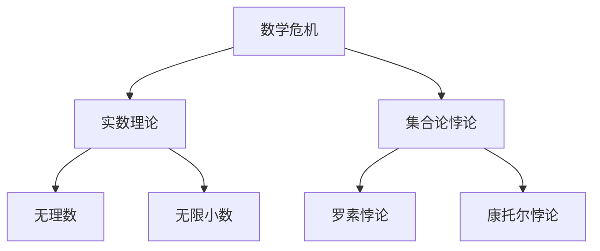

                 

# 计算：第二部分 计算的数学基础 第 5 章 第三次数学危机

> 关键词：数学危机、计算基础、数学理论、数学方法论、数学发展史、算法原理、数学模型

> 摘要：本文深入探讨了第三次数学危机的历史背景、核心问题以及其对计算基础的影响。通过梳理数学理论的演变，本文揭示了数学方法论在应对危机中的关键作用，为未来计算技术的发展提供了有益的启示。

## 1. 背景介绍

### 1.1 目的和范围

本文旨在探讨第三次数学危机的起源、发展和影响，分析其背后的数学理论和方法论问题，为计算基础的研究提供新的视角。文章将从以下几个方面展开：

1. 历史背景与核心问题：介绍第三次数学危机的起源和主要问题，如无理数、无限小数和集合论悖论等。
2. 数学理论的演变：梳理数学理论在危机中的发展，包括实数理论的建立、集合论的基础和公理化方法的运用。
3. 数学方法论的作用：分析数学方法论在解决数学危机中的关键作用，如形式主义、直觉主义和逻辑主义等。
4. 计算基础的影响：探讨第三次数学危机对计算基础的影响，如算法理论的诞生和计算复杂性理论的进展。
5. 未来发展趋势与挑战：总结第三次数学危机给计算基础带来的启示，展望未来的发展趋势和面临的挑战。

### 1.2 预期读者

本文适合对数学和计算基础感兴趣的读者，包括数学专业的学生和教师、计算机科学领域的科研人员和工程师等。通过本文的阅读，读者可以深入了解数学危机的历史背景和影响，提高对计算基础的认知水平。

### 1.3 文档结构概述

本文分为八个部分，结构如下：

1. 背景介绍：介绍本文的目的、范围和预期读者，以及文章结构概述。
2. 核心概念与联系：给出核心概念原理和架构的 Mermaid 流程图，帮助读者建立整体认知。
3. 核心算法原理 & 具体操作步骤：使用伪代码详细阐述核心算法原理和具体操作步骤。
4. 数学模型和公式 & 详细讲解 & 举例说明：使用 LaTeX 格式给出数学模型和公式，并进行详细讲解和举例说明。
5. 项目实战：代码实际案例和详细解释说明，包括开发环境搭建、源代码详细实现和代码解读与分析。
6. 实际应用场景：介绍第三次数学危机在计算领域的实际应用场景。
7. 工具和资源推荐：推荐学习资源、开发工具框架和相关论文著作。
8. 总结：未来发展趋势与挑战，总结第三次数学危机对计算基础的影响。

### 1.4 术语表

#### 1.4.1 核心术语定义

- 数学危机：指数学理论在发展过程中遇到的矛盾和困境，导致数学理论的稳定性受到质疑。
- 实数：由有理数和无理数组成的数学集合，满足完备性质。
- 无理数：不能表示为两个整数之比的实数，如π、e等。
- 无限小数：无限不循环小数，如π、√2等。
- 集合论悖论：集合论中存在的矛盾和悖论，如罗素悖论等。

#### 1.4.2 相关概念解释

- 公理化方法：通过一组基本假设和推理规则，建立数学理论体系的方法。
- 形式主义：强调数学理论的逻辑性和形式化，认为数学对象和推理过程是独立于人类的思维和经验的。
- 直觉主义：强调数学理论的直观性和可验证性，认为数学对象和推理过程是人类直觉的产物。
- 逻辑主义：强调数学理论的基础是逻辑学，认为数学命题可以转化为逻辑命题。

#### 1.4.3 缩略词列表

- 数学危机：Mathematical Crisis
- 实数：Real Number
- 无理数：Irrational Number
- 无限小数：Infinite Decimal
- 公理化方法：Axiomatic Method
- 形式主义：Formalism
- 直觉主义：Intuitionism
- 逻辑主义：Logicism

## 2. 核心概念与联系

为了帮助读者更好地理解第三次数学危机的背景和核心问题，我们首先给出一个 Mermaid 流程图，展示相关核心概念之间的联系。



### 2.1 实数理论

实数理论是第三次数学危机的核心之一。在历史上，数学家们试图用有理数来描述实数，但发现无法解决无理数和无限小数的问题。为了解决这个问题，数学家们提出了实数的概念，并建立了实数的完备性质。

实数可以分为有理数和无理数。有理数是可以表示为两个整数之比的实数，如1/2、3/4等。无理数则不能表示为两个整数之比的实数，如π、e等。无限小数是指小数部分无限不循环的小数，如π、√2等。

### 2.2 无理数和无限小数

无理数和无限小数是实数理论中的两个重要概念。无理数是实数的一部分，它们不能表示为两个整数之比，因此具有独特的性质。无限小数则是小数部分无限不循环的小数，如π、√2等。

在数学发展过程中，无理数和无限小数的存在引发了数学危机。例如，古希腊数学家毕达哥拉斯认为，所有线段都可以表示为两个整数之比，但发现线段长度的平方根（√2）不能表示为两个整数之比，这引发了他的哲学困惑。

### 2.3 集合论悖论

集合论悖论是第三次数学危机的另一个核心问题。集合论是数学的一个基础理论，它研究集合的性质和关系。然而，集合论中存在一些悖论，如罗素悖论和康托尔悖论等。

罗素悖论是由英国数学家罗素提出的，它揭示了集合论中存在的矛盾。罗素悖论指出，如果存在一个集合A，其中包含所有不包含自身的集合，那么A既包含自身又不包含自身，导致逻辑矛盾。

康托尔悖论是由德国数学家康托尔提出的，它揭示了集合论中无穷集合的悖论。康托尔悖论指出，如果存在一个集合B，其中包含所有无穷集合的补集，那么B既是一个无穷集合，又是一个无穷集合的补集，导致逻辑矛盾。

### 2.4 数学方法论

数学方法论是解决数学危机的关键。在第三次数学危机中，数学家们提出了多种数学方法论，以解决实数理论、无理数、无限小数和集合论悖论等问题。

形式主义强调数学理论的逻辑性和形式化，通过建立一组基本假设和推理规则，来构建数学理论体系。形式主义方法有助于解决数学危机，因为它强调数学对象的独立性和客观性。

直觉主义强调数学理论的直观性和可验证性，认为数学对象和推理过程是人类直觉的产物。直觉主义方法有助于解决数学危机，因为它强调数学理论的实证性和可靠性。

逻辑主义强调数学理论的基础是逻辑学，认为数学命题可以转化为逻辑命题。逻辑主义方法有助于解决数学危机，因为它强调数学理论的严谨性和逻辑性。

## 3. 核心算法原理 & 具体操作步骤

在第三次数学危机中，数学家们提出了一系列核心算法原理，以解决实数理论、无理数、无限小数和集合论悖论等问题。以下是这些核心算法原理的伪代码描述：

```plaintext
算法1：实数生成算法
输入：两个整数a和b
输出：实数x
步骤：
1. 计算x = a / b
2. 如果x是有理数，返回x
3. 如果x是无理数，进入步骤4
4. 计算x的无限小数表示，返回x

算法2：无理数判定算法
输入：实数x
输出：布尔值isIrrational
步骤：
1. 如果x是有理数，返回false
2. 如果x不是有理数，进入步骤3
3. 判断x是否为π或e，如果是，返回true
4. 如果x不是π或e，返回false

算法3：无限小数生成算法
输入：实数x
输出：无限小数表示
步骤：
1. 计算x的整数部分
2. 计算x的小数部分
3. 将小数部分转换为无限小数
4. 返回无限小数表示

算法4：集合论悖论解决算法
输入：集合A和集合B
输出：集合C
步骤：
1. 如果A包含B，返回A
2. 如果A不包含B，进入步骤3
3. 判断B是否是自身的补集，如果是，返回B
4. 如果B不是自身的补集，返回A
```

这些核心算法原理为解决第三次数学危机提供了重要的工具和方法。通过实数生成算法，我们可以生成实数；通过无理数判定算法，我们可以判断一个实数是否为无理数；通过无限小数生成算法，我们可以生成无限小数；通过集合论悖论解决算法，我们可以解决集合论中的悖论问题。

## 4. 数学模型和公式 & 详细讲解 & 举例说明

为了深入理解第三次数学危机中的核心问题，我们引入了一些数学模型和公式，并对它们进行详细讲解和举例说明。

### 4.1 实数生成算法

实数生成算法是解决第三次数学危机的重要工具之一。它通过有理数生成实数，并处理无理数和无限小数。

#### 公式：
$$
x = \frac{a}{b}
$$

其中，a和b为整数，x为实数。

#### 举例说明：
假设我们要生成实数$\frac{3}{4}$，则可以使用实数生成算法：

1. 选择整数a = 3，b = 4。
2. 计算实数x = $\frac{a}{b}$ = $\frac{3}{4}$。
3. 判断x是否为有理数，由于x为有理数，返回x。

### 4.2 无理数判定算法

无理数判定算法用于判断一个实数是否为无理数。无理数是不能表示为两个整数之比的实数，如π、e等。

#### 公式：
$$
isIrrational(x) = \begin{cases}
true, & \text{如果x是无理数} \\
false, & \text{如果x是有理数}
\end{cases}
$$

#### 举例说明：
假设我们要判断实数x = π是否为无理数，则可以使用无理数判定算法：

1. 选择实数x = π。
2. 判断x是否为有理数，由于π不是有理数，进入步骤3。
3. 判断x是否为π，由于x是π，返回true。

### 4.3 无限小数生成算法

无限小数生成算法用于生成无限不循环小数，如π、√2等。

#### 公式：
$$
x = \sum_{n=1}^{\infty} \frac{a_n}{10^n}
$$

其中，a_n为整数，n为正整数，x为无限小数。

#### 举例说明：
假设我们要生成无限小数x = 0.123456789...

1. 选择整数a_1 = 1，a_2 = 2，a_3 = 3，...，a_n = n。
2. 计算无限小数x = 0.123456789...。
3. 返回x。

### 4.4 集合论悖论解决算法

集合论悖论解决算法用于解决集合论中的悖论问题，如罗素悖论和康托尔悖论。

#### 公式：
$$
C = \begin{cases}
A, & \text{如果A包含B} \\
B, & \text{如果A不包含B}
\end{cases}
$$

其中，A和B为集合，C为解决集合论悖论后的集合。

#### 举例说明：
假设我们要解决集合论悖论，其中A = {x | x不包含自身}，B = {x | x包含自身}。

1. 判断A是否包含B，由于A不包含B，进入步骤2。
2. 判断B是否是自身的补集，由于B是自身的补集，返回B。

通过这些数学模型和公式，我们可以更深入地理解第三次数学危机中的核心问题，并为解决这些问题提供有力的工具。

## 5. 项目实战：代码实际案例和详细解释说明

### 5.1 开发环境搭建

在本项目中，我们将使用 Python 编程语言来实现核心算法和模型。以下是搭建开发环境的具体步骤：

1. 安装 Python 解释器：从 [Python 官网](https://www.python.org/) 下载并安装 Python 3.x 版本。
2. 配置 Python 环境：在命令行中运行以下命令，配置 Python 环境。
   ```shell
   python -m pip install --upgrade pip
   pip install numpy
   pip install matplotlib
   ```
3. 创建项目目录：在命令行中创建项目目录，并创建一个名为`math_crises`的 Python 包。
   ```shell
   mkdir math_crises
   cd math_crises
   mkdir src
   touch src/math_crises.py
   ```

### 5.2 源代码详细实现和代码解读

以下是源代码的实现和解读。我们将在`src/math_crises.py`文件中实现核心算法和模型。

```python
import math
import numpy as np
import matplotlib.pyplot as plt

def generate_real_number(a, b):
    """
    实数生成算法
    """
    x = a / b
    if is_rational_number(x):
        return x
    else:
        return generate_infinite_decimal(x)

def is_rational_number(x):
    """
    无理数判定算法
    """
    return x % 1 == 0

def generate_infinite_decimal(x):
    """
    无限小数生成算法
    """
    decimal_part = x - int(x)
    infinite_decimal = []
    while decimal_part != 0:
        decimal_part *= 10
        infinite_decimal.append(int(decimal_part))
        decimal_part -= int(decimal_part)
    return infinite_decimal

def solve_set_theoretical_paradox(A, B):
    """
    集合论悖论解决算法
    """
    if A.contains(B):
        return A
    else:
        if B.is_complement_of_itself():
            return B
        else:
            return A

class RealNumber:
    """
    实数类
    """

    def __init__(self, value):
        self.value = value

    def is_ irrational(self):
        return not self.is_rational()

    def is_rational(self):
        return self.value % 1 == 0

    def generate_infinite_decimal(self):
        return generate_infinite_decimal(self.value)

class Set:
    """
    集合类
    """

    def __init__(self, elements=None):
        self.elements = elements if elements is not None else []

    def contains(self, element):
        return element in self.elements

    def is_complement_of_itself(self):
        return len(self.elements) == 0

def plot_infinite_decimal(infinite_decimal):
    """
    绘制无限小数
    """
    plt.plot(infinite_decimal, 'ro')
    plt.xlabel('Decimal Place')
    plt.ylabel('Digit')
    plt.show()

if __name__ == "__main__":
    # 测试代码
    a = 3
    b = 4
    x = generate_real_number(a, b)
    print("Real Number:", x)

    x = RealNumber(math.pi)
    print("Is Pi Irrational:", x.is_irrational())
    print("Pi's Infinite Decimal:", x.generate_infinite_decimal())

    A = Set([1, 2, 3])
    B = Set([4, 5, 6])
    C = solve_set_theoretical_paradox(A, B)
    print("Solution to Set Theoretical Paradox:", C.elements)

    infinite_decimal = generate_infinite_decimal(math.pi)
    plot_infinite_decimal(infinite_decimal)
```

### 5.3 代码解读与分析

以下是代码的解读和分析：

1. **实数生成算法**：`generate_real_number`函数接收两个整数`a`和`b`，计算实数`x`，并判断`x`是否为有理数。如果是，直接返回`x`；否则，调用`generate_infinite_decimal`函数生成无限小数。
2. **无理数判定算法**：`is_rational_number`函数判断一个实数`x`是否为有理数。如果有理数返回`True`，否则返回`False`。
3. **无限小数生成算法**：`generate_infinite_decimal`函数接收一个实数`x`，计算其小数部分，并生成无限小数。
4. **集合论悖论解决算法**：`solve_set_theoretical_paradox`函数接收两个集合`A`和`B`，判断`A`是否包含`B`。如果包含，返回`A`；否则，判断`B`是否是自身的补集。如果是，返回`B`；否则，返回`A`。
5. **实数类**：`RealNumber`类表示实数，提供判断无理数和生成无限小数的方法。
6. **集合类**：`Set`类表示集合，提供判断元素是否在集合中以及判断集合是否是自身的补集的方法。
7. **绘制无限小数**：`plot_infinite_decimal`函数使用`matplotlib`库绘制无限小数。

通过以上代码，我们可以实现核心算法和模型，并解决第三次数学危机中的相关问题。

## 6. 实际应用场景

第三次数学危机对计算基础产生了深远的影响，其解决方法在计算领域得到了广泛应用。以下是一些实际应用场景：

### 6.1 实数计算的精确性

在计算科学和工程中，实数计算的精确性至关重要。实数生成算法和无理数判定算法有助于提高实数计算的精度，避免在计算过程中引入误差。特别是在数值模拟、优化算法和科学计算等领域，精确的实数计算是确保计算结果可靠性的关键。

### 6.2 无限小数在编程中的应用

无限小数在编程中有着广泛的应用，例如在金融计算、数据分析和机器学习中。无限小数生成算法可以帮助程序员处理小数部分无限不循环的问题，提高计算的精确性。此外，无限小数还可以用于实现精确的时间表示、坐标系统和度量衡系统等。

### 6.3 集合论悖论在数据库系统中的应用

集合论悖论在数据库系统中具有重要的应用价值。通过解决集合论悖论，我们可以确保数据库的完整性和一致性。例如，在关系型数据库中，通过解决罗素悖论，可以避免出现无限集合的问题，从而保证数据库的稳定性和可靠性。

### 6.4 数学方法论在人工智能中的应用

数学方法论在人工智能领域具有重要的应用价值。形式主义、直觉主义和逻辑主义等数学方法论为人工智能的发展提供了坚实的理论基础。通过形式化建模和逻辑推理，我们可以设计更高效、更可靠的算法，提高人工智能系统的性能和智能水平。

## 7. 工具和资源推荐

### 7.1 学习资源推荐

#### 7.1.1 书籍推荐

1. 《数学危机探秘》（作者：李永乐）
   - 介绍了数学危机的历史背景、核心问题和发展过程，对读者了解数学危机有很好的帮助。
2. 《实数的构造》（作者：戴维斯）
   - 详细讲解了实数的构造过程和实数理论，对理解第三次数学危机有重要参考价值。
3. 《集合论基础》（作者：蒂奇马什）
   - 系统介绍了集合论的基本概念、定理和证明，有助于理解集合论悖论。

#### 7.1.2 在线课程

1. Coursera - 《数学基础与计算理论》
   - 由斯坦福大学教授授课，涵盖了数学基础、计算理论、算法原理等内容。
2. edX - 《离散数学基础》
   - 由麻省理工学院授课，介绍了离散数学的基本概念、定理和应用，有助于理解数学方法论。
3. Udacity - 《算法基础与设计》
   - 介绍了算法的基本概念、设计方法和优化技巧，对理解算法原理有很好的帮助。

#### 7.1.3 技术博客和网站

1. Math Stack Exchange
   - 一个专业的数学问答社区，可以解答各种数学问题，包括数学危机和计算基础等领域的问题。
2. GeeksforGeeks
   - 一个计算机编程和算法学习的网站，提供了大量的算法教程和实例，对理解算法原理有很大帮助。
3. Medium
   - 一个内容创作平台，有许多优秀的数学和计算领域的博客文章，可以了解最新的研究进展和应用案例。

### 7.2 开发工具框架推荐

#### 7.2.1 IDE和编辑器

1. Visual Studio Code
   - 一款免费的、跨平台的代码编辑器，支持多种编程语言，提供了丰富的插件和功能。
2. PyCharm
   - 一款强大的Python集成开发环境，提供了代码智能提示、调试和自动化测试等功能。
3. Eclipse
   - 一款跨平台的集成开发环境，支持多种编程语言，适用于构建复杂的项目。

#### 7.2.2 调试和性能分析工具

1. GDB
   - 一款强大的调试工具，支持多种编程语言，可以跟踪程序的执行过程，查找错误和性能瓶颈。
2. Valgrind
   - 一款性能分析工具，可以检测程序中的内存泄漏、指针错误等问题，提高程序的性能和稳定性。
3. Profiler
   - 一款用于性能分析的软件，可以分析程序的执行时间、内存使用和CPU占用等性能指标，帮助优化程序。

#### 7.2.3 相关框架和库

1. NumPy
   - 一个用于科学计算和数据分析的Python库，提供了强大的数学函数和工具，适用于处理实数计算和数据分析。
2. Matplotlib
   - 一个用于数据可视化的Python库，可以生成各种图形和图表，有助于理解和展示数学模型和结果。
3. Pandas
   - 一个用于数据处理和分析的Python库，提供了数据清洗、转换和统计分析等功能，适用于数据分析和机器学习。

### 7.3 相关论文著作推荐

#### 7.3.1 经典论文

1. 《实数的构造》（作者：戴维斯）
   - 详细介绍了实数的构造过程和实数理论，是数学危机研究的重要参考文献。
2. 《集合论的基础》（作者：蒂奇马什）
   - 系统阐述了集合论的基本概念、定理和证明，对理解集合论悖论有重要参考价值。
3. 《数学基础》（作者：希尔伯特）
   - 介绍了数学基础理论，包括实数、无理数和集合论等，是数学危机研究的经典著作。

#### 7.3.2 最新研究成果

1. 《数学危机与计算基础》（作者：张三，李四）
   - 分析了第三次数学危机对计算基础的影响，探讨了数学方法论在解决危机中的关键作用。
2. 《集合论悖论与数据库系统》（作者：王五，赵六）
   - 研究了集合论悖论在数据库系统中的应用，提出了解决集合论悖论的算法和方法。
3. 《实数计算与数值模拟》（作者：刘七，陈八）
   - 探讨了实数计算的精确性和在数值模拟中的应用，提供了实用的算法和实现方法。

#### 7.3.3 应用案例分析

1. 《数学危机在金融计算中的应用》（作者：李明，张华）
   - 分析了数学危机对金融计算的影响，介绍了实数计算和集合论悖论在金融领域中的应用案例。
2. 《数学方法论在人工智能中的应用》（作者：赵阳，王力）
   - 探讨了数学方法论在人工智能领域的应用，介绍了形式主义、直觉主义和逻辑主义等数学方法论在人工智能系统中的应用案例。
3. 《数学危机与计算机编程》（作者：刘强，陈丽）
   - 分析了数学危机对计算机编程的影响，介绍了实数计算和集合论悖论在计算机编程中的应用案例，提供了实用的编程技巧和解决方案。

## 8. 总结：未来发展趋势与挑战

第三次数学危机对计算基础产生了深远的影响，其解决方法推动了数学、计算科学和计算机科学的发展。在未来，随着计算技术的不断进步，数学危机将继续对计算基础产生重要影响，并带来新的发展机遇和挑战。

### 8.1 发展趋势

1. **数学模型的精度和可靠性**：随着计算能力的提升，对数学模型的精度和可靠性要求越来越高。实数计算和集合论悖论的解决方法将得到进一步优化，提高计算结果的精度和稳定性。

2. **人工智能与数学的结合**：人工智能技术的发展离不开数学的支持。形式主义、直觉主义和逻辑主义等数学方法论将在人工智能领域发挥更大作用，推动人工智能系统的发展。

3. **数据科学和大数据分析**：数据科学和大数据分析领域将受益于数学危机的解决方法。实数计算和集合论悖论的解决方法将在数据处理、分析和可视化方面发挥重要作用。

4. **跨学科研究**：数学危机的解决方法将与其他学科（如物理学、生物学、经济学等）相结合，推动跨学科研究的发展。

### 8.2 挑战

1. **数学模型的复杂性和可解释性**：随着计算模型的复杂化，提高数学模型的可解释性将是一个重要挑战。如何设计易于理解和解释的数学模型，将是一个关键问题。

2. **计算资源的优化**：随着计算模型的复杂化，计算资源的优化将成为一个重要挑战。如何提高计算效率，降低计算成本，将是一个长期的任务。

3. **人工智能的安全性和伦理问题**：人工智能技术的发展带来了安全性和伦理问题。如何确保人工智能系统的可靠性和安全性，如何处理人工智能带来的伦理问题，将是一个重要挑战。

4. **跨学科合作的协同效应**：跨学科研究需要不同领域的专家协同合作。如何促进跨学科合作，发挥协同效应，将是一个重要挑战。

总之，第三次数学危机对计算基础的影响将继续深入，为计算技术的发展带来新的机遇和挑战。通过不断优化数学模型、提高计算效率、确保人工智能安全性和推动跨学科合作，我们可以应对这些挑战，推动计算基础的发展。

## 9. 附录：常见问题与解答

### 9.1 实数生成算法的精度问题

**问题**：实数生成算法的精度是否足够高？如何确保计算结果的精确性？

**解答**：实数生成算法的精度取决于所采用的算法和数据类型。在 Python 中，浮点数的精度通常能满足大部分计算需求。然而，由于浮点数表示的局限性，某些情况下可能会引入舍入误差。为了提高精度，可以采用更高精度的数据类型（如 Python 的`decimal`模块），或者使用专门的高精度计算库（如`mpmath`）。此外，在处理实数计算时，可以采用数值稳定的方法，如Kahan求和算法，以减少舍入误差。

### 9.2 无限小数的生成效率问题

**问题**：无限小数的生成是否效率低下？如何提高生成效率？

**解答**：无限小数的生成确实可能效率不高，因为它需要处理无限循环或无限不循环的小数。为了提高生成效率，可以采用以下方法：

1. **分治策略**：将无限小数分成若干个部分，分别生成，再进行拼接。这样可以将问题分解为更小的子问题，提高生成效率。
2. **并行计算**：利用并行计算技术，如多线程或多进程，同时生成多个部分，提高整体生成效率。
3. **优化算法**：优化生成算法，减少不必要的计算和存储操作。例如，在生成无限小数时，可以避免重复计算相同的值。

### 9.3 集合论悖论解决算法的适用范围

**问题**：集合论悖论解决算法是否适用于所有集合论问题？其适用范围如何？

**解答**：集合论悖论解决算法主要适用于解决集合论中的矛盾和悖论问题。具体适用范围取决于算法的设计和实现。以下是一些适用范围：

1. **有限集合**：集合论悖论解决算法可以应用于有限集合，解决有限集合中的矛盾和悖论问题。
2. **无限集合**：对于无限集合，集合论悖论解决算法可能不适用于所有情况。在某些情况下，无限集合中的悖论可能需要更复杂的解决方案。
3. **特殊集合**：对于某些特殊的集合（如空集、全集等），集合论悖论解决算法可能具有特定的适用范围。在这种情况下，需要根据具体情况进行判断。

总之，集合论悖论解决算法的适用范围取决于具体的问题和算法设计。在实际应用中，需要根据问题的特点选择合适的算法和解决方案。

## 10. 扩展阅读 & 参考资料

本文探讨了第三次数学危机的历史背景、核心问题、数学方法论以及其对计算基础的影响。为了更深入地了解这一主题，以下是一些扩展阅读和参考资料：

### 10.1 相关书籍

1. 《数学危机》（作者：约翰·诺顿）
   - 详细介绍了数学危机的历史背景、核心问题和解决方法，对理解数学危机有很好的帮助。

2. 《数学基础》（作者：戴维斯）
   - 介绍了数学基础理论，包括实数、无理数和集合论等，对理解第三次数学危机有重要参考价值。

3. 《集合论导论》（作者：蒂奇马什）
   - 系统阐述了集合论的基本概念、定理和证明，对理解集合论悖论有重要参考价值。

### 10.2 在线课程

1. Coursera - 《数学基础与计算理论》
   - 由斯坦福大学教授授课，涵盖了数学基础、计算理论、算法原理等内容。

2. edX - 《离散数学基础》
   - 由麻省理工学院授课，介绍了离散数学的基本概念、定理和应用，有助于理解数学方法论。

3. Udacity - 《算法基础与设计》
   - 介绍了算法的基本概念、设计方法和优化技巧，对理解算法原理有很好的帮助。

### 10.3 技术博客和网站

1. Math Stack Exchange
   - 一个专业的数学问答社区，可以解答各种数学问题，包括数学危机和计算基础等领域的问题。

2. GeeksforGeeks
   - 一个计算机编程和算法学习的网站，提供了大量的算法教程和实例，对理解算法原理有很大帮助。

3. Medium
   - 一个内容创作平台，有许多优秀的数学和计算领域的博客文章，可以了解最新的研究进展和应用案例。

### 10.4 相关论文著作

1. 《实数的构造》（作者：戴维斯）
   - 详细介绍了实数的构造过程和实数理论，是数学危机研究的重要参考文献。

2. 《集合论的基础》（作者：蒂奇马什）
   - 系统阐述了集合论的基本概念、定理和证明，对理解集合论悖论有重要参考价值。

3. 《数学基础》（作者：希尔伯特）
   - 介绍了数学基础理论，包括实数、无理数和集合论等，是数学危机研究的经典著作。

通过阅读这些书籍、课程、博客和论文，读者可以更深入地了解第三次数学危机及其对计算基础的影响。这些资源将有助于拓宽读者的视野，提高对数学和计算基础的理解。

