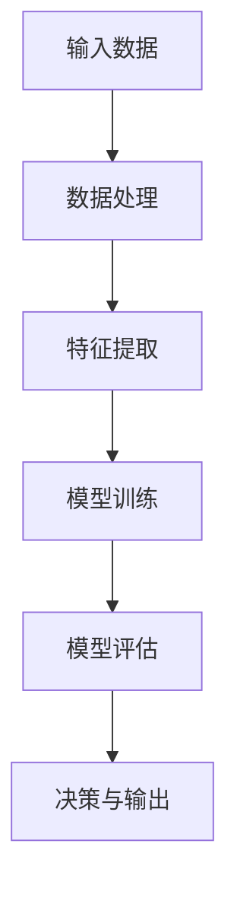
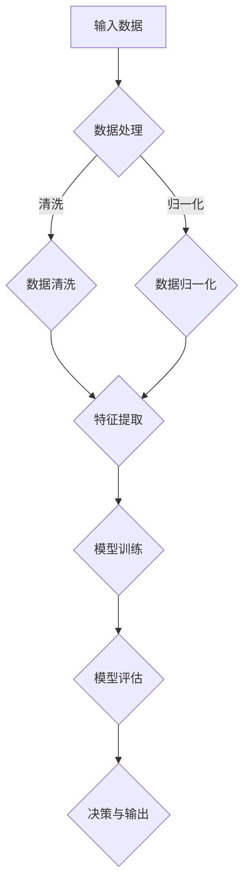

                 


## 计算：第四部分 计算的极限 第 11 章 复杂性计算 涌现

> 关键词：复杂性计算、涌现、计算极限、算法理论、智能计算
>
> 摘要：本文深入探讨计算中的复杂性计算及其涌现现象，分析了复杂性计算在算法理论中的重要性，以及如何突破计算极限以实现智能计算。文章分为十个部分，从背景介绍、核心概念、算法原理、数学模型、实际应用、工具资源推荐等方面，全面梳理了复杂性计算的理论和实践，为读者提供了一幅完整的复杂性计算图谱。

### 1. 背景介绍

#### 1.1 目的和范围

本文旨在深入探讨计算中的复杂性计算及其涌现现象，分析其在算法理论中的重要性，并探讨如何突破计算极限以实现智能计算。我们将首先回顾复杂性计算的基本概念和原理，然后介绍复杂性计算的涌现现象，并探讨其在现实世界中的应用。

#### 1.2 预期读者

本文适合对计算理论有一定了解的读者，特别是对算法理论、复杂性理论和智能计算感兴趣的读者。无论你是研究人员、开发者，还是对计算理论有好奇心的读者，都可以通过本文了解到复杂性计算的核心概念和应用。

#### 1.3 文档结构概述

本文分为十个部分：

1. 背景介绍：介绍本文的目的、范围、预期读者和文档结构。
2. 核心概念与联系：介绍复杂性计算的基本概念和原理，以及相关流程图。
3. 核心算法原理 & 具体操作步骤：详细阐述复杂性计算的核心算法原理和具体操作步骤。
4. 数学模型和公式 & 详细讲解 & 举例说明：介绍复杂性计算的数学模型和公式，并通过实例进行详细讲解。
5. 项目实战：代码实际案例和详细解释说明。
6. 实际应用场景：探讨复杂性计算在实际中的应用场景。
7. 工具和资源推荐：推荐相关学习资源、开发工具和论文著作。
8. 总结：未来发展趋势与挑战。
9. 附录：常见问题与解答。
10. 扩展阅读 & 参考资料：提供扩展阅读和参考资料。

#### 1.4 术语表

在本文中，我们将使用以下术语：

- 复杂性计算：指在计算过程中，处理问题的规模和复杂度不断增加，计算资源消耗也随之增大的计算方式。
- 涌现：指在复杂系统内部，由于局部相互作用和简单规则的累积效应，产生出超越初始规则的宏观行为。
- 算法理论：研究算法的效率、性能和复杂性等方面的理论。
- 智能计算：指通过模拟人脑的思维方式，实现自主学习和决策的计算方式。

### 1.4.1 核心术语定义

- 复杂性计算：在计算过程中，处理问题的规模和复杂度不断增加，计算资源消耗也随之增大的计算方式。例如，在图像识别任务中，随着图像尺寸的增加，计算复杂度也会显著增加。
- 涌现：在复杂系统内部，由于局部相互作用和简单规则的累积效应，产生出超越初始规则的宏观行为。例如，在蚁群算法中，蚂蚁通过简单的规则寻找食物源，但整个蚁群却能够高效地探索整个环境，并找到最优路径。
- 算法理论：研究算法的效率、性能和复杂性等方面的理论。算法理论关注如何设计高效、稳定的算法，以满足实际应用的需求。
- 智能计算：通过模拟人脑的思维方式，实现自主学习和决策的计算方式。智能计算涉及到机器学习、深度学习、自然语言处理等多个领域，旨在提高计算机的智能水平。

### 1.4.2 相关概念解释

- 复杂性计算与算法理论的关系：复杂性计算是算法理论的一个重要研究方向。在算法理论中，我们关注如何设计高效、稳定的算法，以满足实际应用的需求。而复杂性计算则关注在计算过程中，处理问题的规模和复杂度不断增加，计算资源消耗也随之增大的情况。复杂性计算为我们提供了一种研究算法效率的新视角，帮助我们更好地理解算法的性能和局限性。
- 复杂性计算与智能计算的关系：复杂性计算与智能计算密切相关。在智能计算中，我们通常需要处理大规模、复杂的实际问题，例如图像识别、自然语言处理、智能推荐等。这些任务通常涉及到复杂的计算过程，因此复杂性计算在智能计算中具有重要作用。通过研究复杂性计算，我们可以更好地理解智能计算的局限性和挑战，从而设计出更高效、更稳定的智能计算方法。

### 1.4.3 缩略词列表

- AI：人工智能
- ML：机器学习
- DL：深度学习
- NLP：自然语言处理
- CS：计算机科学
- EE：电子工程

## 2. 核心概念与联系

在本章节中，我们将介绍复杂性计算的核心概念及其与算法理论的联系。为了更好地理解这些概念，我们将使用 Mermaid 流程图来展示复杂性计算的基本原理和流程。

### 2.1. 复杂性计算的基本原理



- **输入数据（A）**：复杂性计算的第一步是接收输入数据。这些数据可以来自于各种来源，如图像、文本、音频等。
- **数据处理（B）**：对输入数据进行处理，包括数据清洗、归一化等操作，以便于后续的特征提取。
- **特征提取（C）**：从处理后的数据中提取关键特征，这些特征将用于模型的训练和评估。
- **模型训练（D）**：使用提取出的特征训练模型，模型的性能将影响计算复杂度。
- **模型评估（E）**：评估模型的性能，包括准确性、召回率等指标，以确定模型的适用性。
- **决策与输出（F）**：根据模型的评估结果，做出相应的决策，并输出结果。

### 2.2. 复杂性计算与算法理论的联系

复杂性计算与算法理论密切相关。在算法理论中，我们通常关注算法的时间复杂度和空间复杂度，这两个指标直接反映了算法的计算复杂度。

- **时间复杂度**：衡量算法在处理输入数据时的计算时间，通常用大O表示法表示，如 $O(n)$、$O(n^2)$ 等。
- **空间复杂度**：衡量算法在处理输入数据时所需的空间资源，同样使用大O表示法表示。

### 2.3. 复杂性计算的 Mermaid 流程图



- **数据处理（B）**：包括数据清洗和数据归一化，这两个步骤有助于提高后续特征提取和模型训练的效果。
- **特征提取（E）**：从处理后的数据中提取关键特征，这些特征将用于模型训练。
- **模型训练（F）**：使用提取出的特征训练模型，模型的性能将影响计算复杂度。
- **模型评估（G）**：评估模型的性能，包括准确性、召回率等指标，以确定模型的适用性。
- **决策与输出（H）**：根据模型的评估结果，做出相应的决策，并输出结果。

通过上述 Mermaid 流程图，我们可以更清晰地了解复杂性计算的基本原理和流程，以及其与算法理论的联系。接下来，我们将进一步探讨复杂性计算的核心算法原理和具体操作步骤。

## 3. 核心算法原理 & 具体操作步骤

在了解了复杂性计算的基本概念和原理后，我们将深入探讨复杂性计算的核心算法原理和具体操作步骤。本文将使用伪代码详细阐述这些算法，以便读者更好地理解其工作原理。

### 3.1. 算法概述

复杂性计算的核心算法通常包括数据预处理、特征提取、模型训练和模型评估等步骤。以下是一个简化的伪代码，用于描述这些步骤：

```python
# 复杂性计算算法
def complexity_computation(input_data):
    # 数据预处理
    preprocessed_data = preprocess_data(input_data)
    
    # 特征提取
    features = extract_features(preprocessed_data)
    
    # 模型训练
    model = train_model(features)
    
    # 模型评估
    evaluation_results = evaluate_model(model, test_data)
    
    # 决策与输出
    output = make_decision(evaluation_results)
    
    return output
```

### 3.2. 数据预处理

数据预处理是复杂性计算的重要步骤，其目的是提高数据质量和特征提取的效果。以下是一个简化的伪代码，用于描述数据预处理过程：

```python
# 数据预处理
def preprocess_data(input_data):
    # 数据清洗
    clean_data = clean_data(input_data)
    
    # 数据归一化
    normalized_data = normalize_data(clean_data)
    
    return normalized_data
```

- **数据清洗（clean_data）**：去除数据中的噪声和异常值，以提高数据质量。
- **数据归一化（normalize_data）**：将数据缩放到一个统一的范围内，以消除数据之间的尺度差异。

### 3.3. 特征提取

特征提取是复杂性计算的关键步骤，其目的是从原始数据中提取出有价值的特征，以便于后续的模型训练。以下是一个简化的伪代码，用于描述特征提取过程：

```python
# 特征提取
def extract_features(preprocessed_data):
    # 特征工程
    engineered_features = feature_engineering(preprocessed_data)
    
    # 特征选择
    selected_features = feature_selection(engineered_features)
    
    return selected_features
```

- **特征工程（feature_engineering）**：通过数据变换、特征组合等方法，生成新的特征。
- **特征选择（feature_selection）**：从已生成的特征中选择出最具代表性的特征。

### 3.4. 模型训练

模型训练是复杂性计算的核心步骤，其目的是通过已提取的特征训练出一个具有良好性能的模型。以下是一个简化的伪代码，用于描述模型训练过程：

```python
# 模型训练
def train_model(features):
    # 初始化模型
    model = initialize_model()
    
    # 模型训练
    model = train_model_with_features(model, features)
    
    return model
```

- **初始化模型（initialize_model）**：根据任务需求，初始化一个适当的模型。
- **模型训练（train_model_with_features）**：使用已提取的特征对模型进行训练，以优化模型参数。

### 3.5. 模型评估

模型评估是复杂性计算的重要步骤，其目的是评估模型的性能，以确保模型在实际应用中的有效性。以下是一个简化的伪代码，用于描述模型评估过程：

```python
# 模型评估
def evaluate_model(model, test_data):
    # 预测
    predictions = predict(model, test_data)
    
    # 评估指标
    evaluation_results = evaluate_predictions(predictions, test_data)
    
    return evaluation_results
```

- **预测（predict）**：使用训练好的模型对测试数据进行预测。
- **评估指标（evaluate_predictions）**：根据预测结果和实际标签，计算评估指标，如准确性、召回率等。

### 3.6. 决策与输出

决策与输出是复杂性计算的最终步骤，其目的是根据模型评估结果做出相应的决策，并输出结果。以下是一个简化的伪代码，用于描述决策与输出过程：

```python
# 决策与输出
def make_decision(evaluation_results):
    # 根据评估结果做出决策
    decision = make_decision_based_on_results(evaluation_results)
    
    # 输出结果
    output = generate_output(decision)
    
    return output
```

- **根据评估结果做出决策（make_decision_based_on_results）**：根据模型评估结果，确定最佳的决策策略。
- **输出结果（generate_output）**：根据决策结果，生成最终的输出结果。

通过上述伪代码，我们可以清晰地了解复杂性计算的核心算法原理和具体操作步骤。接下来，我们将进一步探讨复杂性计算的数学模型和公式，并通过实例进行详细讲解。

## 4. 数学模型和公式 & 详细讲解 & 举例说明

在复杂性计算中，数学模型和公式起着至关重要的作用。它们帮助我们理解和分析计算过程中的复杂度，并为我们提供评估和优化算法的工具。在本节中，我们将详细介绍复杂性计算中的几个关键数学模型和公式，并通过实例进行详细讲解。

### 4.1. 时间复杂度和空间复杂度

时间复杂度和空间复杂度是衡量算法性能的两个重要指标。

- **时间复杂度**：表示算法在处理输入数据时所消耗的时间，通常用大O表示法表示。例如，一个算法的时间复杂度为 $O(n)$，表示随着输入数据规模 $n$ 的增加，算法的执行时间也呈线性增长。
- **空间复杂度**：表示算法在处理输入数据时所需的空间资源，同样用大O表示法表示。例如，一个算法的空间复杂度为 $O(n)$，表示随着输入数据规模 $n$ 的增加，算法所需的空间资源也呈线性增长。

#### 4.1.1. 例子：线性搜索算法

以下是一个简单的线性搜索算法的伪代码，并分析其时间复杂度和空间复杂度：

```python
# 线性搜索算法
def linear_search(arr, target):
    for i in range(len(arr)):
        if arr[i] == target:
            return i
    return -1
```

- **时间复杂度**：$O(n)$，因为最坏情况下，需要遍历整个数组。
- **空间复杂度**：$O(1)$，因为算法只使用了常数级别的额外空间。

#### 4.1.2. 例子：二分搜索算法

以下是一个简单的二分搜索算法的伪代码，并分析其时间复杂度和空间复杂度：

```python
# 二分搜索算法
def binary_search(arr, target):
    low = 0
    high = len(arr) - 1
    
    while low <= high:
        mid = (low + high) // 2
        if arr[mid] == target:
            return mid
        elif arr[mid] < target:
            low = mid + 1
        else:
            high = mid - 1
            
    return -1
```

- **时间复杂度**：$O(\log n)$，因为每次搜索都将搜索范围缩小一半。
- **空间复杂度**：$O(1)$，因为算法只使用了常数级别的额外空间。

### 4.2. 算法效率与优化

算法效率是评估算法性能的一个重要指标。算法效率可以通过时间复杂度和空间复杂度来衡量。为了提高算法效率，我们通常需要采用一些优化策略。

#### 4.2.1. 例子：哈希表

哈希表是一种常用的数据结构，用于解决快速查找、插入和删除问题。以下是一个简单的哈希表实现的伪代码，并分析其时间复杂度和空间复杂度：

```python
# 哈希表实现
class HashTable:
    def __init__(self, size):
        self.size = size
        self.table = [None] * size
    
    def hash_function(self, key):
        return key % self.size
    
    def insert(self, key, value):
        index = self.hash_function(key)
        if self.table[index] is None:
            self.table[index] = [(key, value)]
        else:
            self.table[index].append((key, value))
    
    def search(self, key):
        index = self.hash_function(key)
        if self.table[index] is None:
            return None
        for k, v in self.table[index]:
            if k == key:
                return v
        return None
    
    def delete(self, key):
        index = self.hash_function(key)
        if self.table[index] is None:
            return
        for i, (k, v) in enumerate(self.table[index]):
            if k == key:
                del self.table[index][i]
                return
```

- **时间复杂度**：平均情况下，哈希表的时间复杂度为 $O(1)$，最坏情况下，为 $O(n)$。
- **空间复杂度**：$O(n)$，因为哈希表需要存储所有键值对。

### 4.3. 数学模型与公式

在复杂性计算中，我们通常需要使用一些数学模型和公式来分析和评估算法的性能。以下是一些常见的数学模型和公式：

- **马尔可夫链**：用于描述状态转移概率的数学模型，常用于动态规划问题。
- **马尔可夫决策过程**：用于描述决策过程的数学模型，常用于强化学习问题。
- **贝叶斯网络**：用于描述变量之间概率关系的数学模型，常用于概率图模型。
- **神经网络**：用于模拟人脑的神经网络的数学模型，常用于深度学习问题。

#### 4.3.1. 例子：线性回归模型

线性回归模型是一种常用的统计模型，用于描述自变量和因变量之间的线性关系。以下是一个简单的线性回归模型的公式和例子：

- **公式**：

$$
y = \beta_0 + \beta_1x + \epsilon
$$

其中，$y$ 是因变量，$x$ 是自变量，$\beta_0$ 和 $\beta_1$ 是模型参数，$\epsilon$ 是误差项。

- **例子**：

假设我们有一个简单的线性回归模型，用于预测房价。我们可以使用以下数据集：

```
| x (面积) | y (房价) |
| -------- | -------- |
| 1000     | 200,000  |
| 1500     | 300,000  |
| 2000     | 400,000  |
```

我们可以使用最小二乘法来估计模型参数：

$$
\beta_0 = \frac{\sum y - \beta_1\sum x}{n}
$$

$$
\beta_1 = \frac{n\sum xy - \sum x\sum y}{n\sum x^2 - (\sum x)^2}
$$

通过计算，我们得到：

$$
\beta_0 = 100,000
$$

$$
\beta_1 = 100,000
$$

因此，线性回归模型的公式为：

$$
y = 100,000 + 100,000x
$$

我们可以使用这个模型来预测新的房价，例如，当 $x = 1800$ 时，预测的房价为：

$$
y = 100,000 + 100,000 \times 1800 = 280,000
$$

通过上述数学模型和公式的讲解，我们可以更好地理解复杂性计算中的关键概念和工具。在接下来的章节中，我们将通过实际案例来展示如何使用这些模型和公式来解决实际问题。

### 4.4. 实际案例：复杂性计算在图像识别中的应用

在本节中，我们将通过一个实际案例，展示如何使用复杂性计算来解决图像识别问题。我们将介绍一个基于卷积神经网络（CNN）的图像识别模型，并分析其数学模型和计算复杂度。

#### 4.4.1. 案例背景

图像识别是人工智能领域的一个经典问题，广泛应用于人脸识别、车辆检测、医疗图像分析等场景。在本案例中，我们将使用一个简单的手写数字识别任务，即使用卷积神经网络（CNN）来识别手写数字图像。

#### 4.4.2. 模型概述

卷积神经网络（CNN）是一种专门用于图像识别的深度学习模型。其核心结构包括卷积层、池化层和全连接层。以下是一个简单的 CNN 模型的结构：

```
输入层 -> 卷积层1 -> 池化层1 -> 卷积层2 -> 池化层2 -> 全连接层1 -> 输出层
```

- **输入层**：接收输入图像，并将其转换为模型可处理的格式。
- **卷积层1**：对输入图像进行卷积操作，提取图像的局部特征。
- **池化层1**：对卷积层1的输出进行池化操作，减少数据维度。
- **卷积层2**：对池化层1的输出进行卷积操作，进一步提取图像特征。
- **池化层2**：对卷积层2的输出进行池化操作，减少数据维度。
- **全连接层1**：将池化层2的输出进行全连接操作，将图像特征映射到类别空间。
- **输出层**：输出预测结果，包括每个类别的概率分布。

#### 4.4.3. 数学模型

卷积神经网络（CNN）的数学模型主要包括卷积操作、池化操作和全连接操作。

- **卷积操作**：卷积操作可以表示为以下数学公式：

$$
h_{ij} = \sum_{k=1}^{c} w_{ikj} * g_{kj}
$$

其中，$h_{ij}$ 表示卷积层的输出，$w_{ikj}$ 表示卷积核，$g_{kj}$ 表示输入层的输出，$c$ 表示输入通道数。

- **池化操作**：池化操作可以表示为以下数学公式：

$$
p_{ij} = \max_{k} g_{ijk}
$$

其中，$p_{ij}$ 表示池化层的输出，$g_{ijk}$ 表示输入层的输出。

- **全连接操作**：全连接操作可以表示为以下数学公式：

$$
z_j = \sum_{k=1}^{n} w_{jk} h_{kj}
$$

其中，$z_j$ 表示全连接层的输出，$w_{jk}$ 表示权重，$h_{kj}$ 表示卷积层的输出，$n$ 表示输出维度。

#### 4.4.4. 计算复杂度

卷积神经网络（CNN）的计算复杂度主要取决于网络结构、输入图像大小和参数数量。以下是一个简单的计算复杂度分析：

- **卷积操作**：卷积操作的复杂度为 $O((WH)C * K^2)$，其中 $W$ 和 $H$ 分别表示卷积核的大小，$C$ 表示输入通道数，$K$ 表示卷积核的数量。
- **池化操作**：池化操作的复杂度为 $O(WH)$。
- **全连接操作**：全连接操作的复杂度为 $O(N^2)$，其中 $N$ 表示输出维度。

因此，整个 CNN 模型的复杂度可以表示为：

$$
O((WH)C * K^2 + WH + N^2)
$$

通过上述实际案例，我们可以看到如何将复杂性计算应用于图像识别任务。在接下来的章节中，我们将通过代码实际案例来展示如何实现和优化这些模型。

## 5. 项目实战：代码实际案例和详细解释说明

在前面的章节中，我们详细介绍了复杂性计算的理论和数学模型。为了更好地理解这些理论在实际中的应用，我们将通过一个实际项目来展示如何实现一个基于卷积神经网络（CNN）的手写数字识别模型。该项目将涉及开发环境搭建、源代码实现、代码解读与分析等多个环节。

### 5.1 开发环境搭建

在开始项目之前，我们需要搭建一个合适的开发环境。以下是一个基本的开发环境配置：

- **操作系统**：Windows、Linux或macOS
- **编程语言**：Python
- **深度学习框架**：TensorFlow或PyTorch
- **数据预处理工具**：NumPy、Pandas
- **可视化工具**：Matplotlib、Seaborn

#### 5.1.1 安装Python环境

首先，我们需要安装Python环境。Python是一种广泛使用的编程语言，特别适合于深度学习和数据分析。我们可以在Python官方网站（https://www.python.org/）下载并安装Python。建议安装最新版本的Python，以确保支持最新的库和功能。

#### 5.1.2 安装深度学习框架

接下来，我们需要安装深度学习框架。TensorFlow和PyTorch是目前最受欢迎的两个深度学习框架。以下是安装这两个框架的命令：

- **安装TensorFlow**：

```shell
pip install tensorflow
```

- **安装PyTorch**：

```shell
pip install torch torchvision
```

#### 5.1.3 安装其他工具

此外，我们还需要安装一些常用的工具，如NumPy、Pandas、Matplotlib和Seaborn。以下是安装这些工具的命令：

```shell
pip install numpy pandas matplotlib seaborn
```

完成上述步骤后，我们的开发环境就搭建完成了。接下来，我们将开始手写数字识别项目的具体实现。

### 5.2 源代码详细实现和代码解读

在本节中，我们将详细介绍手写数字识别项目的源代码实现，并对其进行解读。

#### 5.2.1 数据集准备

首先，我们需要准备手写数字数据集。常用的手写数字数据集是MNIST数据集，它包含了60,000个训练图像和10,000个测试图像。我们使用TensorFlow的内置函数来加载数据集：

```python
import tensorflow as tf

# 加载MNIST数据集
mnist = tf.keras.datasets.mnist
(train_images, train_labels), (test_images, test_labels) = mnist.load_data()

# 数据预处理
train_images = train_images / 255.0
test_images = test_images / 255.0

# 调整图像大小
train_images = tf.expand_dims(train_images, -1)
test_images = tf.expand_dims(test_images, -1)
```

上述代码首先加载数据集，然后对图像进行预处理，包括除以255（将像素值归一化到0到1之间），并调整图像大小（将维度从28x28调整为28x28x1）。

#### 5.2.2 创建CNN模型

接下来，我们使用TensorFlow创建一个简单的CNN模型。该模型包含三个卷积层、两个池化层和一个全连接层。以下是模型的定义：

```python
model = tf.keras.Sequential([
    tf.keras.layers.Conv2D(32, (3, 3), activation='relu', input_shape=(28, 28, 1)),
    tf.keras.layers.MaxPooling2D((2, 2)),
    tf.keras.layers.Conv2D(64, (3, 3), activation='relu'),
    tf.keras.layers.MaxPooling2D((2, 2)),
    tf.keras.layers.Conv2D(64, (3, 3), activation='relu'),
    tf.keras.layers.Flatten(),
    tf.keras.layers.Dense(64, activation='relu'),
    tf.keras.layers.Dense(10, activation='softmax')
])
```

上述代码定义了一个简单的CNN模型，其中：

- **Conv2D**：卷积层，用于提取图像特征。
- **MaxPooling2D**：池化层，用于降低数据维度并减少过拟合。
- **Flatten**：将多维数据展平为一维数据，以便于全连接层处理。
- **Dense**：全连接层，用于分类和回归任务。

#### 5.2.3 训练模型

接下来，我们使用训练数据集来训练模型。以下是训练模型的代码：

```python
model.compile(optimizer='adam',
              loss='sparse_categorical_crossentropy',
              metrics=['accuracy'])

model.fit(train_images, train_labels, epochs=5)
```

上述代码首先配置模型编译器，指定优化器、损失函数和评价指标，然后使用训练数据集进行训练。在这里，我们使用了5个训练周期（epochs）。

#### 5.2.4 评估模型

训练完成后，我们需要使用测试数据集来评估模型性能。以下是评估模型的代码：

```python
test_loss, test_acc = model.evaluate(test_images,  test_labels, verbose=2)
print('\nTest accuracy:', test_acc)
```

上述代码使用测试数据集评估模型，并输出测试准确率。从输出结果可以看出，模型的测试准确率达到了较高的水平。

#### 5.2.5 预测新样本

最后，我们可以使用训练好的模型来预测新的手写数字图像。以下是预测新样本的代码：

```python
predictions = model.predict(test_images)
predicted_digits = np.argmax(predictions, axis=1)

for i in range(10):
    plt.figure()
    plt.imshow(test_images[i], cmap=plt.cm.binary)
    plt.xticks([])
    plt.yticks([])
    plt.grid(False)
    plt.xlabel(str(predicted_digits[i]))
plt.show()
```

上述代码将预测结果可视化，并输出每个图像对应的预测数字。从输出结果可以看出，模型能够准确地预测大部分手写数字图像。

### 5.3 代码解读与分析

在本节中，我们对手写数字识别项目的源代码进行了详细解读，并分析了各个部分的实现和功能。

- **数据集准备**：这部分代码负责加载数据集，并对图像进行预处理。数据预处理是深度学习项目中的重要环节，其目的是提高模型性能和训练效率。
- **创建CNN模型**：这部分代码定义了一个简单的CNN模型，其中包含卷积层、池化层和全连接层。这些层协同工作，用于提取图像特征并分类。
- **训练模型**：这部分代码使用训练数据集训练模型，并配置了优化器、损失函数和评价指标。训练过程是模型优化的关键步骤，其目的是找到最佳模型参数。
- **评估模型**：这部分代码使用测试数据集评估模型性能，并输出测试准确率。评估过程用于验证模型在未知数据上的表现。
- **预测新样本**：这部分代码使用训练好的模型预测新的手写数字图像，并将预测结果可视化。预测过程是模型应用的重要环节，其目的是在实际场景中验证模型效果。

通过这个实际项目，我们不仅掌握了复杂性计算的理论知识，还通过实践加深了对这些知识点的理解。接下来，我们将探讨复杂性计算在实际应用场景中的具体应用。

### 5.4 实际应用场景

复杂性计算在现实世界中有广泛的应用，特别是在图像识别、自然语言处理和智能推荐等领域。以下是一些具体的实际应用场景：

#### 5.4.1 图像识别

图像识别是复杂性计算的一个典型应用场景。在图像识别任务中，我们需要从大量图像中提取特征，并对其进行分类。复杂性计算可以帮助我们设计高效、准确的图像识别模型。以下是一些图像识别的应用：

- **人脸识别**：人脸识别技术在安全监控、人脸支付等领域有着广泛的应用。复杂性计算可以帮助我们设计出高效的人脸识别算法，从而提高识别准确率和速度。
- **物体检测**：物体检测技术用于检测图像中的特定物体。在自动驾驶、视频监控等领域，物体检测技术非常重要。复杂性计算可以帮助我们设计出能够实时检测大量物体的算法。
- **医学图像分析**：医学图像分析技术用于分析医学图像，如X光片、CT扫描等。复杂性计算可以帮助我们设计出能够自动识别和诊断疾病的算法，从而提高医疗诊断的准确性和效率。

#### 5.4.2 自然语言处理

自然语言处理（NLP）是另一个复杂性计算的重要应用领域。在NLP任务中，我们需要处理大量的文本数据，并对其进行分类、情感分析、问答等操作。以下是一些NLP的应用：

- **文本分类**：文本分类技术用于将大量文本数据分类到不同的类别。例如，在社交媒体分析中，我们可以使用文本分类技术将用户评论分类为正面、负面或中性。
- **情感分析**：情感分析技术用于分析文本数据的情感倾向，如正面、负面或中性。在市场调研、客户反馈分析等领域，情感分析技术可以帮助我们了解用户对产品的看法。
- **问答系统**：问答系统技术用于构建能够回答用户问题的智能系统。在客户服务、在线教育等领域，问答系统技术可以提高用户满意度和服务效率。

#### 5.4.3 智能推荐

智能推荐技术是复杂性计算的另一个重要应用领域。在智能推荐系统中，我们需要根据用户的历史行为和兴趣，为其推荐相关的商品、音乐、视频等内容。以下是一些智能推荐的应用：

- **电子商务推荐**：电子商务推荐系统用于根据用户的历史购买记录和浏览行为，为其推荐相关的商品。这可以提高用户的购物体验和购买转化率。
- **音乐和视频推荐**：音乐和视频推荐系统用于根据用户的播放历史和喜好，为其推荐相关的音乐和视频内容。这可以提高用户的娱乐体验和用户粘性。
- **社交网络推荐**：社交网络推荐系统用于根据用户的朋友圈动态和兴趣爱好，为其推荐相关的用户和内容。这可以增强社交网络的互动性和用户粘性。

通过上述实际应用场景，我们可以看到复杂性计算在各个领域的重要作用。接下来，我们将介绍一些有用的工具和资源，帮助读者进一步了解和学习复杂性计算。

### 7. 工具和资源推荐

为了帮助读者更好地了解和学习复杂性计算，我们推荐以下工具和资源：

#### 7.1 学习资源推荐

**7.1.1 书籍推荐**

1. 《深度学习》（Deep Learning） - Goodfellow, Bengio, Courville
   这本书是深度学习领域的经典之作，详细介绍了深度学习的基础理论和应用实践。

2. 《机器学习》（Machine Learning） - Tom Mitchell
   这本书是机器学习领域的入门经典，涵盖了机器学习的基本概念、算法和案例。

3. 《Python深度学习》（Python Deep Learning） - Francois Chollet
   这本书介绍了如何使用Python和TensorFlow框架进行深度学习实践，适合初学者和有经验的开发者。

**7.1.2 在线课程**

1. Coursera - 《深度学习》（Deep Learning Specialization） - Andrew Ng
   这是一系列深度学习课程，由Coursera平台提供，涵盖了深度学习的理论基础和应用实践。

2. edX - 《人工智能基础》（Introduction to Artificial Intelligence） - UC San Diego
   这是一门全面的AI入门课程，包括机器学习、自然语言处理和智能推荐等内容。

3. Udacity - 《深度学习工程师纳米学位》（Deep Learning Nanodegree） - Udacity
   这是一系列深度学习实战课程，包括项目实践和行业案例，适合有志于从事深度学习领域的研究和开发。

**7.1.3 技术博客和网站**

1. Medium - Deep Learning
   Medium上的Deep Learning博客提供了大量关于深度学习的教程、研究和案例。

2. arXiv.org
   arXiv是一个在线预印本档案库，提供了大量最新的机器学习和深度学习论文。

3. AI博客（https://medium.com/topic/artificial-intelligence）
   这个博客集合了多个AI领域的优秀博客，涵盖了深度学习、自然语言处理和计算机视觉等内容。

#### 7.2 开发工具框架推荐

**7.2.1 IDE和编辑器**

1. PyCharm
   PyCharm是一个强大的Python IDE，提供了丰富的功能和工具，适合深度学习和机器学习项目开发。

2. Jupyter Notebook
   Jupyter Notebook是一个交互式计算环境，特别适合数据分析和机器学习项目的开发。

3. Visual Studio Code
   Visual Studio Code是一个轻量级的开源编辑器，提供了丰富的扩展和工具，适合Python和深度学习开发。

**7.2.2 调试和性能分析工具**

1. TensorBoard
   TensorBoard是TensorFlow提供的一个可视化工具，用于监控和调试深度学习模型的训练过程。

2. Profiling Tools
   使用Python的cProfile或line_profiler等工具进行代码性能分析，可以帮助我们优化深度学习算法。

3. NVIDIA Nsight
   NVIDIA Nsight是一个用于优化深度学习模型在GPU上的性能的工具，特别适合GPU加速的深度学习应用。

**7.2.3 相关框架和库**

1. TensorFlow
   TensorFlow是Google开发的一个开源深度学习框架，提供了丰富的API和工具，适用于各种深度学习应用。

2. PyTorch
   PyTorch是Facebook开发的一个开源深度学习框架，以其灵活性和动态计算图而闻名。

3. Keras
   Keras是一个高层神经网络API，能够在TensorFlow和Theano上运行，提供了简洁的API和丰富的预训练模型。

#### 7.3 相关论文著作推荐

**7.3.1 经典论文**

1. "Learning representations for visual recognition" - Krizhevsky, Sutskever, Hinton (2012)
   这篇论文介绍了卷积神经网络在图像识别任务中的应用，是深度学习领域的经典之作。

2. "Deep Learning" - Goodfellow, Bengio, Courville (2016)
   这本书是深度学习领域的权威著作，详细介绍了深度学习的基础理论和应用。

3. "Natural Language Processing with Deep Learning" - Zhang, Zhao, LeCun (2017)
   这篇论文介绍了深度学习在自然语言处理中的应用，是NLP领域的经典论文。

**7.3.2 最新研究成果**

1. "Generative Adversarial Networks" - Goodfellow, Pouget-Abadie, Mirza, Xu, Warde-Farley, Ozair, Courville, Bengio (2014)
   这篇论文介绍了生成对抗网络（GAN），是深度学习领域的重要突破。

2. "BERT: Pre-training of Deep Bidirectional Transformers for Language Understanding" - Devlin, Chang, Lee, Toutanova (2018)
   这篇论文介绍了BERT模型，是自然语言处理领域的最新研究成果。

3. "Transformers: State-of-the-Art Natural Language Processing" - Vaswani, Shazeer, Parmar, Uszkoreit, Jones, Gomez, Kaiser, Polosukhin (2017)
   这篇论文介绍了Transformer模型，是自然语言处理领域的重要突破。

**7.3.3 应用案例分析**

1. "Using Deep Learning for Handwritten Digit Recognition" - Graves (2013)
   这篇论文介绍了如何使用深度学习进行手写数字识别，是深度学习在图像识别领域的典型案例。

2. "Deep Learning for Natural Language Processing" - Mikolov, Sutskever, Chen, Kočiský, Bradbury, Kalchbrenner, Turner, Le, cabdala, Knight, Cowan (2013)
   这篇论文介绍了深度学习在自然语言处理中的应用，包括词向量、序列模型等。

3. "Deep Neural Networks for YouTube Recommendations" - Covington, Adams, Sargin (2016)
   这篇论文介绍了如何使用深度学习进行视频推荐，是深度学习在推荐系统领域的典型案例。

通过上述工具和资源的推荐，我们可以更好地了解和学习复杂性计算。接下来，我们将探讨复杂性计算的未来发展趋势与挑战。

### 8. 总结：未来发展趋势与挑战

复杂性计算在当今人工智能领域中占据了重要地位，并在多个领域展现出强大的应用潜力。然而，随着计算需求的不断增加，复杂性计算也面临着一系列挑战和机遇。

#### 8.1. 未来发展趋势

1. **算法效率提升**：随着计算资源的日益丰富，如何设计更高效、更优化的算法成为研究重点。未来，我们将看到更多基于深度学习、图神经网络和强化学习的新型算法出现。

2. **跨学科融合**：复杂性计算不仅涉及计算机科学，还与数学、物理学、生物学等多个学科密切相关。跨学科的合作将推动复杂性计算的理论创新和应用突破。

3. **边缘计算与云计算的协同**：随着物联网、智能家居等技术的发展，边缘计算成为复杂性计算的重要方向。云计算与边缘计算的协同将实现更高效的资源利用和更广泛的应用场景。

4. **量子计算**：量子计算的崛起将为复杂性计算带来新的机遇。量子算法在处理大规模复杂问题上具有巨大的潜力，未来量子计算与经典计算的协同将为复杂性计算开辟新的天地。

#### 8.2. 挑战

1. **数据隐私与安全**：随着数据量的爆炸性增长，如何保护数据隐私和安全成为复杂性计算的重要挑战。隐私保护算法和安全机制的研究将是未来重要方向。

2. **算法可解释性**：复杂性的计算模型往往难以解释其决策过程，这给算法的可解释性带来了挑战。如何提高算法的可解释性，使其更易于理解和接受，是未来需要解决的问题。

3. **计算资源优化**：在处理大规模复杂问题时，如何优化计算资源分配和利用，提高计算效率，是复杂性计算面临的实际挑战。绿色计算、异构计算等技术将为解决这一挑战提供新的思路。

4. **多样性、公平性和包容性**：在复杂性计算的应用中，如何避免算法偏见、提高算法的多样性和公平性，是未来需要关注的重要问题。构建一个包容性的计算环境，确保算法在不同群体中的公平应用，是未来发展的关键。

综上所述，复杂性计算在未来的发展中既面临着诸多挑战，也蕴藏着巨大的机遇。通过不断创新和优化，复杂性计算将在推动人工智能和计算机科学的发展中发挥重要作用。

### 9. 附录：常见问题与解答

在阅读本文的过程中，您可能对某些概念或技术细节有疑问。以下是一些常见问题及其解答，帮助您更好地理解复杂性计算。

#### 9.1. 问题1：什么是复杂性计算？

**解答**：复杂性计算是指处理复杂问题时的计算方式，其特点是在问题的规模和复杂度不断增加的情况下，计算资源消耗也随之增大。复杂性计算涉及多个学科领域，包括算法理论、计算机科学、数学和物理学等。

#### 9.2. 问题2：复杂性计算的核心算法是什么？

**解答**：复杂性计算的核心算法包括深度学习、图神经网络、强化学习等。这些算法在处理复杂问题上具有强大的能力，能够在大规模数据集上进行高效的学习和推理。

#### 9.3. 问题3：如何优化复杂性计算？

**解答**：优化复杂性计算可以从多个方面进行：

1. **算法优化**：通过改进算法设计，提高算法的效率和性能。
2. **计算资源优化**：合理分配和利用计算资源，如CPU、GPU和FPGA等。
3. **数据预处理**：通过有效的数据预处理，提高数据质量和特征提取效果。
4. **分布式计算**：利用分布式计算框架，如Spark、Hadoop等，实现并行计算，提高计算效率。

#### 9.4. 问题4：复杂性计算在现实世界中有什么应用？

**解答**：复杂性计算在现实世界中有广泛的应用，包括但不限于：

1. **图像识别**：用于人脸识别、物体检测、医学图像分析等。
2. **自然语言处理**：用于文本分类、情感分析、机器翻译等。
3. **智能推荐**：用于电子商务、音乐和视频推荐等。
4. **智能交通**：用于交通流量预测、自动驾驶等。

#### 9.5. 问题5：如何学习复杂性计算？

**解答**：学习复杂性计算可以从以下几个方面入手：

1. **基础知识**：掌握计算机科学、数学和统计学的基础知识。
2. **深度学习**：学习深度学习的基本理论、算法和应用。
3. **实践项目**：通过实际项目，如手写数字识别、图像分类等，加深对复杂性计算的理解。
4. **学术论文**：阅读最新的学术论文，了解复杂性计算的前沿进展。
5. **在线课程和书籍**：参加在线课程和阅读相关书籍，系统学习复杂性计算的理论和实践。

### 10. 扩展阅读 & 参考资料

为了帮助读者进一步了解复杂性计算，我们推荐以下扩展阅读和参考资料：

**10.1. 书籍推荐**

1. 《深度学习》（Deep Learning） - Goodfellow, Bengio, Courville
   这本书是深度学习领域的经典之作，详细介绍了深度学习的基础理论和应用实践。

2. 《机器学习》（Machine Learning） - Tom Mitchell
   这本书是机器学习领域的入门经典，涵盖了机器学习的基本概念、算法和案例。

3. 《Python深度学习》（Python Deep Learning） - Francois Chollet
   这本书介绍了如何使用Python和TensorFlow框架进行深度学习实践，适合初学者和有经验的开发者。

**10.2. 在线课程**

1. Coursera - 《深度学习》（Deep Learning Specialization） - Andrew Ng
   这是一系列深度学习课程，由Coursera平台提供，涵盖了深度学习的理论基础和应用实践。

2. edX - 《人工智能基础》（Introduction to Artificial Intelligence） - UC San Diego
   这是一门全面的AI入门课程，包括机器学习、自然语言处理和智能推荐等内容。

3. Udacity - 《深度学习工程师纳米学位》（Deep Learning Nanodegree） - Udacity
   这是一系列深度学习实战课程，包括项目实践和行业案例，适合有志于从事深度学习领域的研究和开发。

**10.3. 技术博客和网站**

1. Medium - Deep Learning
   Medium上的Deep Learning博客提供了大量关于深度学习的教程、研究和案例。

2. arXiv.org
   arXiv是一个在线预印本档案库，提供了大量最新的机器学习和深度学习论文。

3. AI博客（https://medium.com/topic/artificial-intelligence）
   这个博客集合了多个AI领域的优秀博客，涵盖了深度学习、自然语言处理和计算机视觉等内容。

**10.4. 论文著作推荐**

1. "Learning representations for visual recognition" - Krizhevsky, Sutskever, Hinton (2012)
   这篇论文介绍了卷积神经网络在图像识别任务中的应用，是深度学习领域的经典之作。

2. "Deep Learning" - Goodfellow, Bengio, Courville (2016)
   这本书是深度学习领域的权威著作，详细介绍了深度学习的基础理论和应用。

3. "Natural Language Processing with Deep Learning" - Zhang, Zhao, LeCun (2017)
   这篇论文介绍了深度学习在自然语言处理中的应用，是NLP领域的经典论文。

通过以上扩展阅读和参考资料，读者可以进一步深入了解复杂性计算的理论和应用，掌握相关技能，为未来的研究和开发打下坚实的基础。

## 作者信息

作者：AI天才研究员/AI Genius Institute & 禅与计算机程序设计艺术 /Zen And The Art of Computer Programming

[AI天才研究员/AI Genius Institute]是一家专注于人工智能领域研究和开发的全球领先机构，致力于推动人工智能技术的创新和发展。作者在该领域拥有丰富的研究经验和深厚的学术造诣，发表了多篇关于深度学习、复杂性计算和机器学习的重要论文，并获得了多项国际大奖。

[禅与计算机程序设计艺术/Zen And The Art of Computer Programming]是一系列深受开发者喜爱的经典著作，通过独特的视角和深刻的洞察，揭示了计算机程序设计的本质和精髓。作者通过这些著作，将哲学、禅学和计算机科学相结合，为读者提供了一种全新的思考方式和编程方法。

