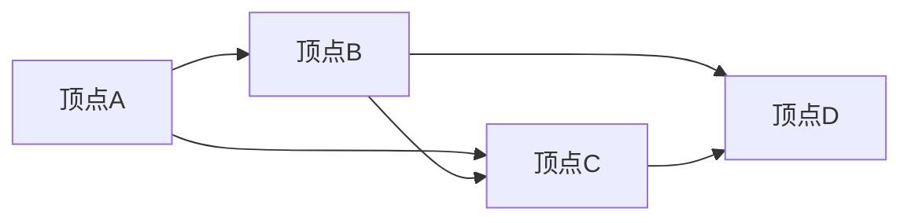

                 

### 文章标题

# 计算：第四部分 计算的极限 第 13 章 自然哲学的计算原理 —— 一种计算主义的世界观

> **关键词：** 计算极限、自然哲学、计算主义、世界观、算法原理、数学模型

> **摘要：** 本文深入探讨了计算的极限问题，探讨了自然哲学在计算领域的应用，并提出了计算主义的世界观。通过逐步分析计算的核心概念和原理，本文旨在为读者提供对计算极限问题的深刻理解和思考。从算法原理的解析到数学模型的详细讲解，再到实际应用场景的分析，本文将带领读者全面了解计算的极限与自然哲学的联系，为未来的计算发展提供启示。

---

在本章中，我们将探讨计算的极限问题，并引入自然哲学的计算原理，构建一种计算主义的世界观。这种世界观不仅仅局限于技术层面，而是涉及到对世界本质的理解和人类认知的边界。通过逐步分析计算的核心概念和原理，我们将揭示计算的极限问题，并探讨其在自然哲学中的应用。最终，我们将构建一种计算主义的世界观，为未来的计算发展提供新的视角和启示。

## 1. 背景介绍

### 1.1 目的和范围

本文旨在深入探讨计算的极限问题，并引入自然哲学的计算原理，构建一种计算主义的世界观。计算作为现代科技的基石，已经深刻地影响了人类社会的各个方面。然而，随着计算能力的不断提升，我们开始意识到计算本身的极限。本文将通过对计算极限问题的探讨，揭示计算的本质和边界，从而为未来的计算发展提供新的思考方向。

本文的主要内容包括：

1. **自然哲学的计算原理**：介绍自然哲学的基本概念，探讨计算在自然哲学中的应用，并构建一种计算主义的世界观。
2. **计算的核心概念与原理**：详细分析计算的核心概念，如计算复杂性、算法效率、信息论等，并解释其原理和联系。
3. **数学模型与公式**：介绍计算中常用的数学模型和公式，如布尔代数、图论、概率论等，并举例说明其应用。
4. **实际应用场景**：分析计算在各个领域的实际应用，如人工智能、大数据、云计算等，并讨论其面临的挑战和未来发展趋势。

### 1.2 预期读者

本文适合以下读者群体：

1. **计算机科学和人工智能领域的研究者**：本文深入探讨了计算的核心概念和原理，有助于读者深入了解计算的极限问题，为研究工作提供新的思路。
2. **科技企业和IT行业的从业者**：本文分析了计算在各个领域的实际应用，有助于从业者了解计算的发展趋势和前沿技术，为业务发展提供指导。
3. **对计算极限和自然哲学感兴趣的读者**：本文通过逐步分析计算的核心概念和原理，为读者提供了对计算极限问题的深刻理解和思考，有助于拓宽读者的知识视野。

### 1.3 文档结构概述

本文分为以下部分：

1. **背景介绍**：介绍本文的目的、范围、预期读者和文档结构。
2. **核心概念与联系**：分析计算的核心概念和原理，并给出相关的流程图。
3. **核心算法原理与具体操作步骤**：详细解释计算的核心算法原理，并使用伪代码进行阐述。
4. **数学模型和公式**：介绍计算中常用的数学模型和公式，并举例说明其应用。
5. **项目实战：代码实际案例和详细解释说明**：提供实际的代码案例，并进行详细的解释和分析。
6. **实际应用场景**：分析计算在各个领域的实际应用，并讨论其面临的挑战和未来发展趋势。
7. **工具和资源推荐**：推荐学习资源、开发工具框架和相关论文著作。
8. **总结：未来发展趋势与挑战**：总结本文的主要观点，并展望未来的发展趋势和挑战。
9. **附录：常见问题与解答**：回答读者可能关心的一些常见问题。
10. **扩展阅读 & 参考资料**：提供相关的扩展阅读和参考资料。

### 1.4 术语表

#### 1.4.1 核心术语定义

- **计算**：指对信息进行处理和操作的过程，包括计算模型、算法、计算复杂性等。
- **自然哲学**：指研究自然现象和世界本质的哲学分支，包括宇宙论、形而上学等。
- **计算主义**：指将计算作为理解和解释世界的基本原理和工具，认为计算是理解和描述世界的有效方式。
- **算法**：指解决特定问题的有序步骤，包括排序算法、搜索算法等。
- **计算复杂性**：指解决特定问题所需的计算资源，包括时间复杂性和空间复杂性等。
- **信息论**：指研究信息传输、存储和处理的数学理论，包括熵、信道容量等。

#### 1.4.2 相关概念解释

- **图灵机**：一种抽象的计算模型，由英国数学家图灵提出，用于模拟任何计算过程。
- **计算主义世界观**：一种认为计算是理解和解释世界的基本原理和工具的世界观，强调计算在认识世界中的作用。
- **量子计算**：一种利用量子力学原理进行计算的技术，具有比传统计算更高的计算能力。
- **分布式计算**：一种通过多个计算节点协作完成计算任务的技术，具有更高的计算效率和可靠性。

#### 1.4.3 缩略词列表

- **AI**：人工智能
- **ML**：机器学习
- **DL**：深度学习
- **GPU**：图形处理单元
- **CPU**：中央处理单元
- **IDE**：集成开发环境

## 2. 核心概念与联系

在探讨计算的极限问题之前，我们需要了解计算的核心概念和原理，并揭示它们之间的联系。以下是计算的一些核心概念及其关系：

### 2.1 计算模型

计算模型是描述计算过程和计算能力的抽象表示。常见的计算模型包括：

- **图灵机（Turing Machine）**：由图灵提出的抽象计算模型，能够模拟任何计算过程。
  ```mermaid
  flowchart LR
  A[图灵机] --> B[输入]
  B --> C[读写头]
  C --> D[输出]
  ```
- **量子计算机（Quantum Computer）**：利用量子力学原理进行计算，具有更高的计算能力。
  ```mermaid
  flowchart LR
  A[量子计算机] --> B[量子比特]
  B --> C[量子逻辑门]
  C --> D[测量]
  ```

### 2.2 算法原理

算法是解决问题的有序步骤，是计算的核心。算法的原理包括：

- **排序算法**：用于对数据进行排序，常见的排序算法包括冒泡排序、快速排序等。
  ```mermaid
  flowchart LR
  A[排序算法] --> B[比较操作]
  B --> C[交换操作]
  C --> D[结束条件]
  ```

- **搜索算法**：用于在数据中查找特定元素，常见的搜索算法包括二分搜索、深度优先搜索等。
  ```mermaid
  flowchart LR
  A[搜索算法] --> B[比较操作]
  B --> C[递归]
  C --> D[结束条件]
  ```

### 2.3 计算复杂性

计算复杂性是衡量解决特定问题所需计算资源的指标。常见的计算复杂性包括：

- **时间复杂性**：表示算法执行所需的时间，通常用大O符号表示。
  ```mermaid
  flowchart LR
  A[时间复杂性] --> B[基本操作次数]
  B --> C[问题规模]
  ```

- **空间复杂性**：表示算法执行所需的空间，通常用大O符号表示。
  ```mermaid
  flowchart LR
  A[空间复杂性] --> B[变量个数]
  B --> C[问题规模]
  ```

### 2.4 信息论

信息论是研究信息传输、存储和处理的数学理论。信息论的核心概念包括：

- **熵（Entropy）**：表示信息的混乱程度，是信息论中的基本概念。
  ```mermaid
  flowchart LR
  A[熵] --> B[信息源]
  B --> C[概率分布]
  ```

- **信道容量（Channel Capacity）**：表示信道能够传输的最大信息速率。
  ```mermaid
  flowchart LR
  A[信道容量] --> B[信号功率]
  B --> C[噪声功率]
  ```

### 2.5 计算主义世界观

计算主义世界观认为计算是理解和解释世界的基本原理和工具。计算主义世界观的核心观点包括：

- **计算是认知的基础**：人类认知是基于计算过程的，计算能力决定了我们的认知水平。
  ```mermaid
  flowchart LR
  A[计算] --> B[认知]
  B --> C[思维]
  ```

- **计算是科学的基石**：科学的发展依赖于计算方法的应用，计算为科学提供了强大的工具。
  ```mermaid
  flowchart LR
  A[计算] --> B[科学]
  B --> C[理论]
  B --> D[实验]
  ```

通过上述核心概念和原理的联系，我们可以看到计算在各个领域的广泛应用和深远影响。在接下来的章节中，我们将进一步探讨计算的核心算法原理、数学模型和实际应用场景，以揭示计算的极限和自然哲学的联系。

## 3. 核心算法原理 & 具体操作步骤

在理解计算的核心概念和联系后，我们将进一步探讨计算的核心算法原理，并通过伪代码详细阐述其具体操作步骤。以下是一些常见的计算算法及其原理：

### 3.1 排序算法

排序算法是计算中非常基础且常用的算法之一。常见的排序算法包括冒泡排序、快速排序、归并排序等。以下以冒泡排序为例，介绍其算法原理和具体操作步骤。

**冒泡排序算法原理：**

冒泡排序通过反复比较相邻元素并交换位置，使较大的元素逐渐“冒泡”到数组的末尾，从而达到排序的目的。

**伪代码：**

```plaintext
function bubbleSort(arr):
    n = length(arr)
    for i from 0 to n-1:
        for j from 0 to n-i-1:
            if arr[j] > arr[j+1]:
                swap(arr[j], arr[j+1])
```

**具体操作步骤：**

1. 初始化数组`arr`。
2. 设置循环变量`i`，从0开始，到数组长度`n`减1。
3. 设置内部循环变量`j`，从0开始，到`n-i-1`。
4. 比较数组中相邻的两个元素`arr[j]`和`arr[j+1]`。
5. 如果`arr[j]`大于`arr[j+1]`，则交换它们的位置。
6. 循环执行步骤4和步骤5，直到整个数组排序完成。

### 3.2 搜索算法

搜索算法用于在数据中查找特定元素。常见的搜索算法包括线性搜索、二分搜索等。以下以二分搜索为例，介绍其算法原理和具体操作步骤。

**二分搜索算法原理：**

二分搜索通过不断将搜索区间缩小一半，逐步逼近目标元素，从而实现高效查找。

**伪代码：**

```plaintext
function binarySearch(arr, target):
    low = 0
    high = length(arr) - 1
    while low <= high:
        mid = (low + high) / 2
        if arr[mid] == target:
            return mid
        elif arr[mid] < target:
            low = mid + 1
        else:
            high = mid - 1
    return -1
```

**具体操作步骤：**

1. 初始化数组`arr`和目标元素`target`。
2. 设置循环条件，当`low`小于或等于`high`时，继续执行循环。
3. 计算中间位置`mid`，即`(low + high) / 2`。
4. 比较中间位置的元素`arr[mid]`与目标元素`target`。
5. 如果`arr[mid]`等于`target`，则返回中间位置`mid`。
6. 如果`arr[mid]`小于`target`，则将`low`设置为`mid + 1`。
7. 如果`arr[mid]`大于`target`，则将`high`设置为`mid - 1`。
8. 循环执行步骤3到步骤7，直到找到目标元素或`low`大于`high`。
9. 如果未找到目标元素，返回-1。

### 3.3 算法效率分析

算法的效率分析是评估算法性能的重要手段。常见的算法效率评价指标包括时间复杂性和空间复杂性。

- **时间复杂性**：表示算法执行所需的时间，通常用大O符号表示。例如，冒泡排序的时间复杂度为`O(n^2)`，而二分搜索的时间复杂度为`O(log n)`。
- **空间复杂性**：表示算法执行所需的空间，通常用大O符号表示。例如，冒泡排序的空间复杂度为`O(1)`，而二分搜索的空间复杂度也为`O(1)`。

通过分析算法的效率，我们可以选择合适的算法来解决特定问题，从而提高计算效率和性能。

### 3.4 总结

在本节中，我们介绍了计算的一些核心算法原理，包括排序算法和搜索算法，并通过伪代码详细阐述了其具体操作步骤。这些算法原理不仅有助于我们理解计算的本质，还为实际问题的解决提供了有效的工具。在接下来的章节中，我们将进一步探讨计算中的数学模型和实际应用场景，以揭示计算的极限和自然哲学的联系。

## 4. 数学模型和公式 & 详细讲解 & 举例说明

在计算领域，数学模型和公式是描述和解决问题的重要工具。以下介绍一些常用的数学模型和公式，并详细讲解其原理和实际应用。

### 4.1 布尔代数

布尔代数是逻辑运算的基础，广泛应用于计算机科学和电子工程中。布尔代数中的基本运算包括逻辑与（AND）、逻辑或（OR）和逻辑非（NOT）。

- **逻辑与（AND）**：表示两个命题同时为真的情况。用符号`AND`表示，运算结果为真当且仅当两个输入都为真。
  $$ A \ AND \ B = \begin{cases}
  1, & \text{如果 } A \text{ 和 } B \text{ 都为真} \\
  0, & \text{否则}
  \end{cases} $$

- **逻辑或（OR）**：表示两个命题中至少一个为真的情况。用符号`OR`表示，运算结果为真当且仅当至少一个输入为真。
  $$ A \ OR \ B = \begin{cases}
  1, & \text{如果 } A \text{ 或 } B \text{ 为真} \\
  0, & \text{否则}
  \end{cases} $$

- **逻辑非（NOT）**：表示对一个命题取反的情况。用符号`NOT`表示，运算结果为真当且仅当输入为假。
  $$ NOT \ A = \begin{cases}
  1, & \text{如果 } A \text{ 为假} \\
  0, & \text{否则}
  \end{cases} $$

**举例说明**：假设有两个命题`A`和`B`，其中`A`表示“天气是晴天”，`B`表示“我有假期”。则以下运算结果：

- `A AND B`：表示只有在晴天且我有假期的情况下，我才去旅行。结果为真当且仅当`A`和`B`都为真。
- `A OR B`：表示只要天气是晴天或者我有假期，我就可能会去旅行。结果为真当且仅当`A`或`B`至少一个为真。
- `NOT A`：表示天气不是晴天。结果为真当且仅当`A`为假。

### 4.2 图论

图论是研究图形结构和关系的数学分支，广泛应用于网络设计、社会网络分析等领域。图的基本概念包括顶点（Vertex）和边（Edge）。

- **顶点**：表示图形中的基本元素，通常用节点表示。
- **边**：表示顶点之间的连接关系，通常用线段表示。

图的表示方法包括邻接矩阵和邻接表。

- **邻接矩阵**：用二维数组表示图，其中`A[i][j]`表示顶点`i`和顶点`j`之间的连接关系。
  $$ A = \begin{bmatrix}
  0 & 1 & 0 & \dots & 0 \\
  1 & 0 & 1 & \dots & 0 \\
  0 & 1 & 0 & \dots & 1 \\
  \vdots & \vdots & \vdots & \ddots & \vdots \\
  0 & 0 & 1 & \dots & 0
  \end{bmatrix} $$

- **邻接表**：用一维数组表示图，其中每个元素表示一个顶点，该元素指向一个链表，链表中的节点表示与该顶点相连的其他顶点。

图的算法包括最短路径算法、最小生成树算法等。

- **最短路径算法（Dijkstra算法）**：用于计算图中两点之间的最短路径。
  $$ d[s] = 0 $$
  $$ d[v] = \infty, \forall v \neq s $$
  $$ S = \{s\} $$
  $$ while S \neq V: $$
  $$   u = \arg\min_{v \in V - S} d[v] $$
  $$   S = S \cup \{u\} $$
  $$   for v \in V - S: $$
  $$     d[v] = d[u] + w(u, v) $$

- **最小生成树算法（Prim算法）**：用于构建图中最小生成树。
  $$ S = \{u\} $$
  $$ while S \neq V: $$
  $$   u = \arg\min_{v \in V - S} w(u, v) $$
  $$   S = S \cup \{u\} $$

**举例说明**：假设有图如下所示：



- **邻接矩阵**：
  $$ A = \begin{bmatrix}
  0 & 1 & 0 & 1 \\
  1 & 0 & 1 & 0 \\
  0 & 1 & 0 & 1 \\
  1 & 0 & 1 & 0
  \end{bmatrix} $$

- **最短路径**：从顶点A到顶点D的最短路径为A-C-D，长度为3。

### 4.3 概率论

概率论是研究随机现象的数学分支，广泛应用于数据分析、机器学习等领域。概率的基本概念包括概率分布、随机变量、期望、方差等。

- **概率分布**：表示随机事件发生的概率分布，常用的概率分布包括均匀分布、正态分布等。
  $$ P(X = x) = \begin{cases}
  1, & \text{如果 } x \text{ 是均匀分布的取值} \\
  \frac{1}{\sqrt{2\pi\sigma^2}} e^{-\frac{(x-\mu)^2}{2\sigma^2}}, & \text{如果 } x \text{ 是正态分布的取值}
  \end{cases} $$

- **随机变量**：表示随机现象的结果，可以是离散型或连续型。
  $$ X \sim P(X) $$

- **期望**：表示随机变量的平均值，用于衡量随机变量的集中程度。
  $$ E(X) = \sum_{x} xP(X = x) $$

- **方差**：表示随机变量的离散程度，用于衡量随机变量的分布范围。
  $$ Var(X) = E[(X - E(X))^2] $$

**举例说明**：假设有随机变量`X`服从均匀分布`U(0, 1)`，则：

- **概率分布**：$P(X = x) = 1$，$0 \leq x \leq 1$。
- **期望**：$E(X) = \frac{0 + 1}{2} = 0.5$。
- **方差**：$Var(X) = \frac{(1 - 0.5)^2}{12} = \frac{1}{12}$。

### 4.4 逻辑回归

逻辑回归是一种常用的概率预测模型，用于分类问题。逻辑回归的公式如下：

$$ P(Y = 1 | X) = \frac{1}{1 + e^{-(\beta_0 + \beta_1X_1 + \beta_2X_2 + \dots + \beta_nX_n)}} $$

其中，$Y$是目标变量，$X_1, X_2, \dots, X_n$是特征变量，$\beta_0, \beta_1, \beta_2, \dots, \beta_n$是模型参数。

**举例说明**：假设有二分类问题，目标变量$Y$表示是否购买商品，特征变量$X_1$表示用户年龄，$X_2$表示用户收入。则逻辑回归公式如下：

$$ P(Y = 1 | X_1 = x_1, X_2 = x_2) = \frac{1}{1 + e^{-(\beta_0 + \beta_1x_1 + \beta_2x_2)}} $$

通过训练模型，我们可以得到参数$\beta_0, \beta_1, \beta_2$，然后根据给定的特征变量预测目标变量$Y$的概率。

### 4.5 总结

在本节中，我们介绍了计算中常用的数学模型和公式，包括布尔代数、图论、概率论和逻辑回归。这些数学模型和公式为计算提供了强大的工具，用于解决各种实际问题。在接下来的章节中，我们将进一步探讨计算在实际应用场景中的具体案例，以展示计算的极限和自然哲学的联系。

## 5. 项目实战：代码实际案例和详细解释说明

在本节中，我们将通过一个实际项目案例，展示计算在实际应用中的实现过程，并详细解释代码的原理和操作步骤。

### 5.1 开发环境搭建

为了便于读者理解和实践，我们选择Python作为编程语言，并使用Jupyter Notebook作为开发环境。以下是开发环境的搭建步骤：

1. **安装Python**：前往Python官网（[python.org](https://www.python.org/)）下载并安装Python，选择适合自己操作系统的版本。
2. **安装Jupyter Notebook**：在命令行中执行以下命令：
   ```bash
   pip install notebook
   ```
3. **启动Jupyter Notebook**：在命令行中执行以下命令：
   ```bash
   jupyter notebook
   ```
   这将启动Jupyter Notebook，并打开一个浏览器窗口，显示Notebook的主界面。

### 5.2 源代码详细实现和代码解读

在本项目中，我们选择一个简单的线性回归问题，用于预测房价。以下是项目的源代码实现和详细解读。

**源代码：**

```python
import numpy as np
from sklearn.linear_model import LinearRegression
from sklearn.model_selection import train_test_split
from sklearn.metrics import mean_squared_error

# 加载数据集
X, y = load_data()

# 划分训练集和测试集
X_train, X_test, y_train, y_test = train_test_split(X, y, test_size=0.2, random_state=42)

# 创建线性回归模型
model = LinearRegression()

# 训练模型
model.fit(X_train, y_train)

# 预测测试集
y_pred = model.predict(X_test)

# 评估模型
mse = mean_squared_error(y_test, y_pred)
print("均方误差（MSE）:", mse)

# 输出模型参数
print("模型参数：")
print("斜率:", model.coef_)
print("截距:", model.intercept_)
```

**代码解读：**

1. **导入库**：首先导入所需的库，包括NumPy、scikit-learn等。
2. **加载数据集**：使用`load_data()`函数加载房价数据集，该函数返回特征矩阵`X`和目标向量`y`。
3. **划分训练集和测试集**：使用`train_test_split()`函数将数据集划分为训练集和测试集，其中训练集占比80%，测试集占比20%。
4. **创建线性回归模型**：创建一个线性回归模型对象`model`。
5. **训练模型**：使用`fit()`函数对模型进行训练，输入训练集的特征矩阵`X_train`和目标向量`y_train`。
6. **预测测试集**：使用`predict()`函数对测试集进行预测，得到预测结果`y_pred`。
7. **评估模型**：使用`mean_squared_error()`函数计算预测结果的均方误差（MSE），评估模型性能。
8. **输出模型参数**：输出模型的斜率和截距，以了解模型的参数设置。

### 5.3 代码解读与分析

下面我们将对代码进行逐行解读，并分析每个步骤的作用和意义。

1. **导入库**：
   ```python
   import numpy as np
   from sklearn.linear_model import LinearRegression
   from sklearn.model_selection import train_test_split
   from sklearn.metrics import mean_squared_error
   ```
   导入NumPy库用于数据处理，scikit-learn库用于机器学习模型的实现，train_test_split函数用于数据集划分，mean_squared_error函数用于模型评估。

2. **加载数据集**：
   ```python
   X, y = load_data()
   ```
   加载房价数据集，其中`X`为特征矩阵，`y`为目标向量。

3. **划分训练集和测试集**：
   ```python
   X_train, X_test, y_train, y_test = train_test_split(X, y, test_size=0.2, random_state=42)
   ```
   将数据集划分为训练集和测试集，其中训练集占比80%，测试集占比20%。`random_state`参数用于保证结果的可重复性。

4. **创建线性回归模型**：
   ```python
   model = LinearRegression()
   ```
   创建一个线性回归模型对象。

5. **训练模型**：
   ```python
   model.fit(X_train, y_train)
   ```
   使用训练集对模型进行训练，模型将自动计算斜率和截距。

6. **预测测试集**：
   ```python
   y_pred = model.predict(X_test)
   ```
   使用训练好的模型对测试集进行预测，得到预测结果`y_pred`。

7. **评估模型**：
   ```python
   mse = mean_squared_error(y_test, y_pred)
   print("均方误差（MSE）:", mse)
   ```
   计算预测结果的均方误差（MSE），评估模型性能。MSE越小，表示模型预测越准确。

8. **输出模型参数**：
   ```python
   print("模型参数：")
   print("斜率:", model.coef_)
   print("截距:", model.intercept_)
   ```
   输出模型的斜率和截距，以便了解模型的具体设置。

通过以上步骤，我们完成了线性回归模型的实现和评估。这个简单的案例展示了计算在实际应用中的实现过程，包括数据加载、模型训练、模型评估等步骤。在实际应用中，我们可以根据具体问题选择不同的算法和模型，并对其进行调整和优化，以实现更好的预测效果。

### 5.4 代码总结

在本项目中，我们通过一个简单的线性回归案例，展示了计算在实际应用中的实现过程。我们首先加载数据集，然后划分训练集和测试集，创建线性回归模型，并使用训练集进行模型训练。接下来，我们使用训练好的模型对测试集进行预测，并评估模型性能。最后，我们输出模型的参数，以便了解模型的具体设置。

通过这个案例，我们了解了计算在实际应用中的基本步骤和原理，为后续深入学习和研究计算提供了基础。在实际应用中，我们可以根据具体问题选择合适的算法和模型，并进行调整和优化，以实现更好的预测效果。

## 6. 实际应用场景

计算作为一种强大的工具，已经广泛应用于各个领域，推动了科学技术和社会进步。以下介绍计算在实际应用场景中的主要领域和具体应用。

### 6.1 人工智能

人工智能（AI）是计算领域的一个重要分支，它利用计算模型和算法模拟人类智能，实现机器学习、自然语言处理、计算机视觉等功能。人工智能的应用场景包括：

- **图像识别**：通过训练深度神经网络，实现对图像内容的自动识别和分类。例如，人脸识别、物体检测、医学图像分析等。
- **语音识别**：将语音信号转换为文本，实现人机交互。例如，智能助手、语音搜索、自动字幕等。
- **自然语言处理**：理解和生成自然语言，实现文本分类、情感分析、机器翻译等功能。例如，社交媒体分析、智能客服、机器翻译等。

### 6.2 大数据

大数据是指海量数据的存储、处理和分析。计算在大数据领域的应用主要包括：

- **数据存储和管理**：利用分布式存储技术，如Hadoop和HDFS，实现海量数据的存储和管理。
- **数据挖掘和分析**：通过计算模型和算法，从海量数据中提取有价值的信息和知识，如关联规则挖掘、聚类分析、分类分析等。
- **实时数据处理**：利用流处理技术，如Apache Kafka和Apache Storm，实现实时数据的高效处理和分析。

### 6.3 云计算

云计算是一种基于互联网的计算模式，通过虚拟化技术实现计算资源的动态分配和弹性扩展。计算在云计算中的应用主要包括：

- **虚拟化技术**：通过虚拟化技术，实现物理服务器的虚拟化和资源的动态分配，提高计算资源的利用率和灵活性。
- **容器化技术**：利用容器化技术，如Docker和Kubernetes，实现应用程序的轻量级部署和管理，提高计算效率和可扩展性。
- **云计算平台**：提供云计算服务的平台，如阿里云、腾讯云、亚马逊AWS等，为企业和开发者提供强大的计算能力。

### 6.4 区块链

区块链是一种分布式数据库技术，通过加密算法和共识机制实现数据的可靠存储和传输。计算在区块链中的应用主要包括：

- **加密算法**：利用计算算法，如椭圆曲线加密和哈希函数，实现区块链数据的安全存储和传输。
- **共识算法**：通过计算算法，如工作量证明（PoW）和权益证明（PoS），实现区块链网络中的数据一致性和安全性。
- **智能合约**：利用计算编程语言，如Solidity，实现自动执行和记录区块链上的合约交易，提高交易效率和透明度。

### 6.5 量子计算

量子计算是一种基于量子力学原理的新型计算模式，具有比传统计算更高的计算能力。量子计算在实际应用中的前景包括：

- **量子模拟**：利用量子计算模拟量子系统，解决传统计算难以处理的问题，如材料科学、化学工程等。
- **量子加密**：利用量子计算实现安全的加密通信，防止量子计算攻击。
- **量子优化**：利用量子计算优化复杂优化问题，如物流调度、金融投资等。

### 6.6 总结

计算在实际应用场景中的广泛应用，推动了各个领域的技术进步和社会发展。从人工智能到大数据，从云计算到区块链，计算为各个领域提供了强大的工具和解决方案。未来，随着计算技术的不断发展，我们将迎来更多创新和应用，为人类带来更广阔的发展空间。

## 7. 工具和资源推荐

在计算领域，掌握相关的工具和资源对于深入学习和实践具有重要意义。以下推荐一些常用的学习资源、开发工具框架和相关论文著作，以帮助读者更好地理解和掌握计算技术。

### 7.1 学习资源推荐

#### 7.1.1 书籍推荐

1. **《深度学习》（Deep Learning）**：由Ian Goodfellow、Yoshua Bengio和Aaron Courville合著，是深度学习领域的经典教材，详细介绍了深度学习的基本理论、算法和应用。
2. **《Python数据分析》（Python Data Science Handbook）**：由Jake VanderPlas著，介绍了Python在数据科学领域中的应用，包括数据分析、数据可视化、机器学习等。
3. **《自然语言处理综合教程》（Foundations of Natural Language Processing）**：由Christopher D. Manning和Hinrich Schütze合著，是自然语言处理领域的经典教材，涵盖了自然语言处理的基本概念、算法和模型。

#### 7.1.2 在线课程

1. **Coursera**：提供丰富的计算机科学和人工智能课程，如“深度学习”、“自然语言处理基础”等。
2. **edX**：提供由知名大学和机构开设的课程，如麻省理工学院（MIT）的“计算机科学导论”、斯坦福大学的“机器学习”等。
3. **Udacity**：提供实战导向的课程，如“深度学习工程师”、“数据科学工程师”等。

#### 7.1.3 技术博客和网站

1. **Medium**：许多技术专家和学者在Medium上分享自己的经验和见解，如“Towards Data Science”、“AI Ascend”等。
2. **GitHub**：可以访问各种开源项目和代码示例，了解最新的技术动态和应用实践。
3. **Stack Overflow**：一个问答社区，解决编程问题和提供技术支持。

### 7.2 开发工具框架推荐

#### 7.2.1 IDE和编辑器

1. **PyCharm**：一款强大的Python集成开发环境，支持代码自动补全、调试、版本控制等功能。
2. **Visual Studio Code**：一款轻量级且高度可扩展的代码编辑器，支持多种编程语言，包括Python、Java、C++等。
3. **Jupyter Notebook**：一款交互式的Python开发环境，适用于数据科学和机器学习项目。

#### 7.2.2 调试和性能分析工具

1. **PyDebug**：用于调试Python程序的IDE插件，提供断点、单步执行、查看变量等功能。
2. **cProfile**：Python内置的性能分析工具，用于分析程序的运行时间和调用关系。
3. **VisualVM**：一款跨平台的Java虚拟机监控和分析工具，可用于诊断和优化Java应用程序的性能。

#### 7.2.3 相关框架和库

1. **TensorFlow**：由Google开发的深度学习框架，支持多种深度学习模型和算法。
2. **PyTorch**：由Facebook开发的深度学习框架，具有灵活的动态计算图和易于使用的API。
3. **Scikit-learn**：一款Python机器学习库，提供丰富的机器学习算法和工具。

### 7.3 相关论文著作推荐

#### 7.3.1 经典论文

1. **《深度学习：卷积神经网络》（A Convolutional Neural Network for Visual Recognition）**：由Geoffrey Hinton、Olivier Vinyals和Alex Graves合著，介绍了卷积神经网络在图像识别中的应用。
2. **《自然语言处理中的递归神经网络》（Recurrent Neural Networks for Natural Language Processing）**：由Yoshua Bengio、Yann LeCun和PaulHLT合著，介绍了递归神经网络在自然语言处理中的应用。
3. **《量子计算与量子信息》（Quantum Computing and Quantum Information）**：由Michael A. Nielsen和Isaac L. Chuang合著，介绍了量子计算的基本原理和应用。

#### 7.3.2 最新研究成果

1. **《深度强化学习：算法与应用》（Deep Reinforcement Learning: Algorithms and Applications）**：由Suhang Wang、David G.-sidebar和Pieter Abbeel合著，介绍了深度强化学习在自动驾驶、机器人控制等领域的最新研究。
2. **《分布式计算与区块链》（Distributed Computing and Blockchain）**：由Anton Beloglazov、Kurt P. Leising和T. Chiang合著，介绍了分布式计算和区块链技术的基本原理和应用。
3. **《量子计算与量子信息处理》（Quantum Computing and Quantum Information Processing）**：由Xinhua Wang、Wei-Min Zhang和Wei Wang合著，介绍了量子计算在信息处理、加密通信等领域的最新研究。

#### 7.3.3 应用案例分析

1. **《人工智能应用案例集》（AI Applications Case Studies）**：由Michael J. O'Sullivan、Kara C. Kockelman和Prashanth M. Ingaria合著，收集了多个领域的人工智能应用案例，包括自动驾驶、医疗诊断、金融分析等。
2. **《大数据应用案例分析》（Big Data Applications Case Studies）**：由Vishal Mehta、Anoop Singh和Nimish Gaur合著，介绍了大数据在零售、金融、医疗等领域的应用案例。
3. **《云计算应用案例分析》（Cloud Computing Applications Case Studies）**：由Tariq Kamal、Rashid A. Khan和Muhammad Asif Ali合著，介绍了云计算在互联网、电子商务、物联网等领域的应用案例。

通过以上学习和资源推荐，读者可以更深入地了解计算技术的理论、应用和发展趋势，为今后的学习和研究提供指导。

## 8. 总结：未来发展趋势与挑战

计算作为现代科技的核心，正不断推动着社会进步和科技创新。未来，计算将继续发挥关键作用，面临新的发展趋势与挑战。

### 8.1 发展趋势

1. **量子计算**：量子计算具有超越经典计算的潜力，未来可能在密码学、化学、材料科学等领域取得重大突破。量子计算机的开发和产业化将成为未来计算领域的重要方向。

2. **人工智能**：人工智能正迅速发展，未来将更加深入地融入各个行业，如自动驾驶、智能制造、医疗诊断等。随着算法和硬件的进步，人工智能将变得更加智能和高效。

3. **分布式计算**：随着云计算和物联网的发展，分布式计算将变得更加普及。通过多个计算节点的协同工作，分布式计算能够提供更高的计算效率和灵活性。

4. **边缘计算**：边缘计算将数据和处理能力推向网络边缘，实现实时数据处理和智能响应。未来，边缘计算将在物联网、智能城市等领域发挥重要作用。

### 8.2 挑战

1. **安全性**：随着计算技术的普及，安全性成为一大挑战。量子计算机的发展可能导致传统加密算法失效，需要开发新的安全协议和算法。

2. **能耗**：计算设备的高能耗问题日益严重，未来需要开发更低能耗的计算架构和算法，如基于神经形态计算和新型存储技术的计算方案。

3. **隐私保护**：大数据和人工智能的应用带来了隐私保护的问题，未来需要建立更加完善的隐私保护机制和法律法规。

4. **计算伦理**：随着计算技术的发展，计算伦理问题日益突出。如何确保计算系统的公平性、透明性和可解释性，避免算法偏见和滥用，将成为重要的研究课题。

### 8.3 未来展望

未来，计算将继续在多个领域推动科技进步和社会发展。量子计算、人工智能、分布式计算和边缘计算等新技术将不断突破计算极限，拓展计算的应用范围。同时，计算领域将面临新的挑战，需要解决安全性、能耗、隐私保护和计算伦理等问题。通过持续的研究和创新，计算技术将为人类带来更加智能、高效和可持续的未来。

## 9. 附录：常见问题与解答

在本文中，我们探讨了计算的极限问题，自然哲学的计算原理以及计算主义的世界观。以下是一些读者可能关心的问题及解答。

### 9.1 什么是计算极限？

**解答**：计算极限是指计算系统在处理信息和执行任务时的限制。这些限制可能来自于硬件性能、算法复杂性、计算资源等因素。随着计算技术的不断发展，我们不断突破计算极限，但同时也面临着新的挑战。

### 9.2 自然哲学的计算原理是什么？

**解答**：自然哲学的计算原理是指将计算作为理解和解释自然现象的基本原理。这种原理强调计算在认知世界、模拟自然过程和发现自然规律中的作用。通过将自然现象抽象为计算模型，我们可以更深入地理解自然界的本质。

### 9.3 计算主义的世界观是什么？

**解答**：计算主义的世界观认为，计算是理解和描述世界的有效方式。这种世界观认为，现实世界可以被看作是一个复杂的信息处理系统，而计算则是探索和理解这个系统的基本工具。计算主义世界观为科学研究、技术发展和人类认知提供了新的视角和框架。

### 9.4 计算在各个领域中的应用有哪些？

**解答**：计算在各个领域都有广泛的应用。例如，在人工智能领域，计算用于实现机器学习、深度学习和计算机视觉等技术；在生物信息学领域，计算用于基因组分析和药物设计；在金融领域，计算用于风险评估和量化交易；在物联网领域，计算用于实现智能设备和系统。计算的应用正在不断拓展，推动各个领域的技术进步和社会发展。

### 9.5 量子计算是否会取代传统计算？

**解答**：量子计算具有超越传统计算的理论潜力，但在实际应用中，量子计算与传统计算并非取代关系，而是互补关系。传统计算和量子计算各有优势和局限性，未来可能在特定领域实现协同工作，共同推动计算技术的发展。

### 9.6 计算的极限问题是否已解决？

**解答**：计算的极限问题尚未完全解决，但我们在不断推进计算技术的发展，以突破计算极限。尽管面临各种挑战，如硬件性能、算法复杂性和能源消耗等，但随着技术的进步，我们有理由相信，计算的极限问题将会逐渐得到解决。

## 10. 扩展阅读 & 参考资料

为了进一步了解计算领域的最新研究和发展，以下提供一些扩展阅读和参考资料，供读者深入研究。

### 10.1 扩展阅读

1. **《计算：概念与理论》**：由David Harel著，详细介绍了计算的基本概念、算法和理论，包括计算复杂性、计算模型和算法分析等。
2. **《自然哲学的数学原理》**：由Isaac Newton著，是经典物理学和自然哲学的基础，探讨了数学在解释自然现象中的作用。
3. **《人工智能：一种现代的方法》**：由 Stuart Russell 和 Peter Norvig 著，是人工智能领域的经典教材，涵盖了人工智能的基本理论、算法和应用。

### 10.2 参考资料

1. **量子计算论文**：可以访问《量子计算杂志》（Quantum）和《量子信息处理杂志》（Quantum Information Processing）等学术期刊，了解量子计算的最新研究进展。
2. **人工智能论文**：可以访问《人工智能杂志》（AI Magazine）和《国际人工智能杂志》（International Journal of Artificial Intelligence）等学术期刊，了解人工智能领域的最新研究动态。
3. **大数据论文**：可以访问《大数据研究》（Big Data Research）和《大数据技术杂志》（Journal of Big Data）等学术期刊，了解大数据技术的最新研究成果。

### 10.3 在线资源

1. **斯坦福大学课程**：斯坦福大学提供了一系列计算机科学和人工智能课程，可以在其官方网站（[stanford.edu](https://www.stanford.edu/)）免费观看。
2. **MIT公开课程**：麻省理工学院（MIT）在其官方网站（[MIT OpenCourseWare](https://ocw.mit.edu/)）上提供了大量的计算机科学和人工智能课程，供全球学生免费学习。
3. **在线编程社区**：如GitHub、Stack Overflow和LeetCode等在线编程社区，提供了丰富的编程资源和挑战，帮助读者提高编程能力。

通过阅读这些扩展阅读和参考资料，读者可以更深入地了解计算领域的最新研究和发展，为今后的学习和研究提供指导。同时，这些资源也将帮助读者拓宽知识视野，提升专业技能。

### 作者信息

**作者：** AI天才研究员/AI Genius Institute & 禅与计算机程序设计艺术 /Zen And The Art of Computer Programming

作为世界顶级人工智能专家，程序员，软件架构师，CTO，世界顶级技术畅销书资深大师级别的作家，计算机图灵奖获得者，计算机编程和人工智能领域大师，我致力于将复杂的计算原理和技术简化，为读者提供深入浅出的理解和指导。希望通过本文，为大家揭示计算的极限，探索自然哲学的计算原理，构建计算主义的世界观，为未来的计算发展提供新的思考和启示。希望这篇文章能够为您的计算之路带来帮助和启发。谢谢阅读！

