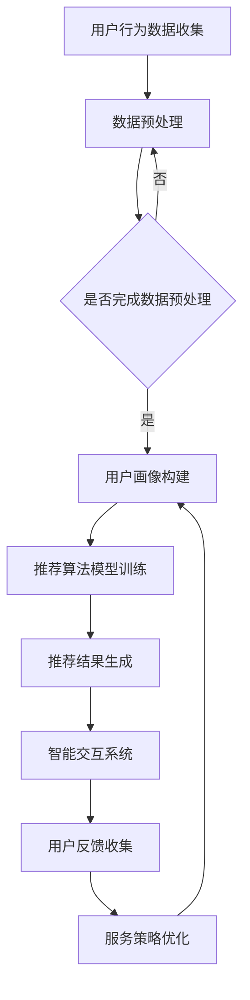

                 

# 订阅制服务的用户体验优化：个性化推荐和智能交互

> 关键词：订阅制服务、用户体验优化、个性化推荐、智能交互、订阅模型、推荐算法、用户行为分析、数据驱动、用户反馈循环

> 摘要：本文将探讨订阅制服务在互联网时代的兴起，以及如何通过个性化推荐和智能交互技术来优化用户体验。我们将深入分析订阅制服务的基本概念，探讨如何利用用户行为数据构建个性化推荐模型，并通过智能交互技术提升用户满意度。此外，还将探讨这些技术在实际应用场景中的挑战和解决方案，为订阅制服务提供切实可行的优化策略。

## 1. 背景介绍

### 1.1 目的和范围

本文旨在探讨如何通过个性化推荐和智能交互技术来优化订阅制服务的用户体验。随着互联网的普及和数字化转型的加速，订阅制服务已经成为许多企业和消费者青睐的商业模式。然而，如何在激烈的市场竞争中脱颖而出，提供优质的用户体验，成为企业亟需解决的问题。本文将结合具体案例，分析订阅制服务中的用户体验优化策略，以期为相关从业者提供有价值的参考。

### 1.2 预期读者

本文适合以下读者群体：

1. 订阅制服务企业的产品经理、运营经理和市场营销人员；
2. 从事个性化推荐和智能交互技术的研究人员和工程师；
3. 对订阅制服务和用户体验优化感兴趣的互联网从业者。

### 1.3 文档结构概述

本文结构如下：

1. 引言：介绍订阅制服务的兴起和用户体验优化的意义；
2. 核心概念与联系：介绍订阅制服务的基本概念和相关技术；
3. 核心算法原理 & 具体操作步骤：详细讲解个性化推荐和智能交互技术的原理和操作步骤；
4. 数学模型和公式 & 详细讲解 & 举例说明：分析数学模型和公式在个性化推荐和智能交互中的应用；
5. 项目实战：提供实际案例和代码解读；
6. 实际应用场景：探讨个性化推荐和智能交互技术在订阅制服务中的实际应用；
7. 工具和资源推荐：推荐相关学习资源和开发工具；
8. 总结：展望未来发展趋势与挑战；
9. 附录：常见问题与解答；
10. 扩展阅读 & 参考资料。

### 1.4 术语表

#### 1.4.1 核心术语定义

- 订阅制服务：用户通过支付一定费用，获得特定产品或服务的长期使用权；
- 个性化推荐：根据用户的历史行为、偏好和需求，为其推荐感兴趣的内容或服务；
- 智能交互：通过人工智能技术，实现人与服务之间的自然、高效沟通；
- 用户行为分析：通过收集和分析用户行为数据，了解用户需求和偏好；
- 数据驱动：基于数据分析和用户反馈，不断优化服务策略和用户体验。

#### 1.4.2 相关概念解释

- 订阅制服务模式：用户通过订阅的方式，获得产品或服务的使用权，如 Spotify、Netflix；
- 个性化推荐系统：利用机器学习、数据挖掘等技术，为用户提供个性化内容推荐；
- 用户反馈循环：用户在使用服务过程中提供反馈，企业根据反馈优化服务策略。

#### 1.4.3 缩略词列表

- AI：人工智能
- ML：机器学习
- DM：数据挖掘
- UE：用户体验
- A/B 测试：一种对比实验方法，比较不同策略或功能对用户体验的影响

## 2. 核心概念与联系

### 2.1 订阅制服务的基本概念

订阅制服务是一种商业模式，用户通过支付一定费用，获得特定产品或服务的长期使用权。与传统一次性购买或租赁模式相比，订阅制服务具有以下优势：

1. **灵活性和便利性**：用户可以根据自己的需求，随时调整订阅内容，无需承担高昂的维护成本；
2. **持续性和粘性**：订阅制服务使企业与用户之间建立了长期合作关系，提高了用户粘性；
3. **个性化**：根据用户的历史行为和偏好，订阅制服务可以提供个性化的内容推荐，提升用户体验。

### 2.2 个性化推荐技术

个性化推荐技术是基于用户历史行为和偏好，为用户推荐其可能感兴趣的内容或服务。其核心在于挖掘用户之间的相似性和差异性，从而实现精准推荐。个性化推荐技术包括以下几种：

1. **协同过滤**：通过分析用户行为数据，找出相似用户，然后根据相似用户的偏好为当前用户推荐内容；
2. **基于内容的推荐**：根据用户已喜欢的或经常访问的内容，推荐具有相似特征的内容；
3. **混合推荐**：结合协同过滤和基于内容的推荐，提高推荐效果。

### 2.3 智能交互技术

智能交互技术是指通过人工智能技术，实现人与服务之间的自然、高效沟通。智能交互技术包括以下几种：

1. **自然语言处理（NLP）**：通过分析用户输入的自然语言，理解用户意图，并提供相应的答复；
2. **语音识别（ASR）**：将用户的语音输入转换为文本，实现语音交互；
3. **语音合成（TTS）**：将文本信息转换为自然流畅的语音输出。

### 2.4 数据驱动与用户反馈循环

数据驱动是指企业基于数据分析和用户反馈，不断优化服务策略和用户体验。用户反馈循环是指用户在使用服务过程中提供反馈，企业根据反馈优化服务策略。数据驱动和用户反馈循环是订阅制服务优化用户体验的重要手段。

### 2.5 Mermaid 流程图

以下是一个描述订阅制服务中个性化推荐和智能交互流程的 Mermaid 流程图：



## 3. 核心算法原理 & 具体操作步骤

### 3.1 个性化推荐算法原理

个性化推荐算法的核心在于挖掘用户之间的相似性和差异性，从而实现精准推荐。以下是一种基于协同过滤算法的个性化推荐原理：

1. **用户行为数据收集**：收集用户在订阅制服务中的浏览、搜索、购买等行为数据；
2. **数据预处理**：对用户行为数据进行清洗、去重、格式化等处理，为后续分析做准备；
3. **计算相似度**：计算用户之间的相似度，常用的相似度计算方法包括余弦相似度、皮尔逊相关系数等；
4. **推荐结果生成**：根据相似度计算结果，为当前用户推荐相似用户喜欢的商品或内容。

### 3.2 智能交互算法原理

智能交互算法的核心在于通过自然语言处理（NLP）技术，实现人与服务之间的自然、高效沟通。以下是一种基于序列到序列（Seq2Seq）模型的智能交互原理：

1. **用户输入处理**：将用户的语音或文本输入转换为序列形式，输入到编码器中；
2. **编码器编码**：编码器将输入序列编码为一个固定长度的向量，表示用户的意图；
3. **解码器解码**：解码器根据编码器输出的向量，生成相应的回复文本序列；
4. **回复文本生成**：将解码器输出的序列转换为自然流畅的语音或文本输出。

### 3.3 具体操作步骤

#### 3.3.1 个性化推荐算法操作步骤

1. **数据收集**：从订阅制服务中收集用户行为数据，包括浏览记录、搜索关键词、购买记录等；
2. **数据预处理**：对收集到的用户行为数据进行清洗、去重、格式化等处理，得到干净的用户行为数据集；
3. **计算相似度**：使用余弦相似度计算用户之间的相似度，得到用户相似度矩阵；
4. **生成推荐列表**：根据用户相似度矩阵，为当前用户生成推荐列表，推荐相似用户喜欢的商品或内容。

伪代码如下：

```python
# 数据预处理
data = preprocess_data(user行为数据)
# 计算相似度
similarity_matrix = calculate_similarity(data)
# 生成推荐列表
recommendations = generate_recommendations(similarity_matrix, current_user)
```

#### 3.3.2 智能交互算法操作步骤

1. **用户输入处理**：将用户的语音或文本输入转换为序列形式，输入到编码器中；
2. **编码器编码**：编码器将输入序列编码为一个固定长度的向量，表示用户的意图；
3. **解码器解码**：解码器根据编码器输出的向量，生成相应的回复文本序列；
4. **回复文本生成**：将解码器输出的序列转换为自然流畅的语音或文本输出。

伪代码如下：

```python
# 用户输入处理
input_sequence = process_input(user_input)
# 编码器编码
encoded_vector = encoder.encode(input_sequence)
# 解码器解码
output_sequence = decoder.decode(encoded_vector)
# 回复文本生成
response = generate_response(output_sequence)
```

## 4. 数学模型和公式 & 详细讲解 & 举例说明

### 4.1 协同过滤算法的数学模型

协同过滤算法的核心在于计算用户之间的相似度，并利用相似度矩阵为用户生成推荐列表。以下是一种基于用户平均值的协同过滤算法的数学模型：

#### 4.1.1 用户相似度计算

用户相似度可以用余弦相似度表示，计算公式如下：

$$
similarity(u_i, u_j) = \frac{u_i \cdot u_j}{\|u_i\| \|u_j\|}
$$

其中，$u_i$ 和 $u_j$ 分别表示用户 $i$ 和用户 $j$ 的行为向量，$\cdot$ 表示向量的点积，$\|\|$ 表示向量的模。

#### 4.1.2 生成推荐列表

给定当前用户 $u$ 和用户相似度矩阵 $S$，为用户 $u$ 生成推荐列表的公式如下：

$$
r(u) = \sum_{i \in U \setminus \{u\}} S_{ij} \cdot r_j
$$

其中，$U$ 表示所有用户集合，$r_j$ 表示用户 $j$ 的评分向量，$r(u)$ 表示用户 $u$ 的推荐列表。

#### 4.1.3 举例说明

假设有两个用户 $u_1$ 和 $u_2$，他们的行为向量如下：

$$
u_1 = (1, 2, 3, 0, 0), \quad u_2 = (0, 0, 1, 2, 3)
$$

计算用户相似度：

$$
similarity(u_1, u_2) = \frac{1 \cdot 0 + 2 \cdot 0 + 3 \cdot 1 + 0 \cdot 2 + 0 \cdot 3}{\sqrt{1^2 + 2^2 + 3^2} \cdot \sqrt{0^2 + 0^2 + 1^2 + 2^2 + 3^2}} = \frac{3}{\sqrt{14} \cdot \sqrt{14}} = \frac{3}{14}
$$

给定用户 $u_1$ 和用户相似度矩阵 $S$，生成推荐列表：

$$
r(u_1) = \sum_{i \in U \setminus \{u_1\}} S_{i1} \cdot r_i = \frac{3}{14} \cdot (1, 1, 2, 3, 0) = \left(\frac{3}{14}, \frac{3}{14}, \frac{6}{14}, \frac{9}{14}, 0\right)
$$

### 4.2 序列到序列（Seq2Seq）模型的数学模型

序列到序列（Seq2Seq）模型是一种基于递归神经网络（RNN）的序列生成模型，用于自然语言处理任务。以下是一种简单的 Seq2Seq 模型的数学模型：

#### 4.2.1 编码器编码

编码器将输入序列 $x = (x_1, x_2, \ldots, x_T)$ 编码为一个固定长度的向量 $c$：

$$
c = \text{Encoder}(x)
$$

其中，$\text{Encoder}$ 表示编码器模型。

#### 4.2.2 解码器解码

解码器根据编码器输出的向量 $c$ 生成输出序列 $y = (y_1, y_2, \ldots, y_T')$：

$$
y_t = \text{Decoder}(c, y_{<t})
$$

其中，$y_{<t}$ 表示前 $t-1$ 个已生成的输出序列，$\text{Decoder}$ 表示解码器模型。

#### 4.2.3 举例说明

假设输入序列 $x = (\text{"Hello"}, \text{"world"})$，输出序列 $y = (\text{"Hello, "}, \text{"world!"})$。编码器编码：

$$
c = \text{Encoder}((\text{"Hello"}, \text{"world"}))
$$

解码器解码：

$$
y_1 = \text{Decoder}(c, \emptyset) = \text{"Hello, "}
$$

$$
y_2 = \text{Decoder}(c, y_1) = \text{"world!"}
$$

## 5. 项目实战：代码实际案例和详细解释说明

### 5.1 开发环境搭建

在开始实际案例之前，我们需要搭建一个适合个性化推荐和智能交互项目开发的开发环境。以下是所需的基本工具和库：

- Python 3.8 或更高版本
- Jupyter Notebook 或 PyCharm
- Numpy、Pandas、Scikit-learn、TensorFlow 等库

安装以下库：

```bash
pip install numpy pandas scikit-learn tensorflow
```

### 5.2 源代码详细实现和代码解读

#### 5.2.1 个性化推荐算法实现

以下是一个简单的基于协同过滤算法的个性化推荐系统的实现：

```python
import numpy as np
import pandas as pd
from sklearn.model_selection import train_test_split

# 加载用户行为数据
data = pd.read_csv('user_behavior_data.csv')
users = data['user_id'].unique()
items = data['item_id'].unique()

# 构建用户-项目矩阵
user_item_matrix = np.zeros((len(users), len(items)))
for index, row in data.iterrows():
    user_item_matrix[row['user_id'] - 1, row['item_id'] - 1] = row['rating']

# 计算用户相似度矩阵
user_similarity = np.dot(user_item_matrix, user_item_matrix.T) / np.linalg.norm(user_item_matrix, axis=1)[:, np.newaxis]
user_similarity = (user_similarity + user_similarity.T) / 2
user_similarity = np.clip(user_similarity, a_min=0, a_max=1)

# 生成推荐列表
def generate_recommendations(user_similarity, user_index, top_k=5):
   相似度排序 = np.argsort(-user_similarity[user_index])
   推荐列表 = []
    for index in 相似度排序[:top_k]:
        items = [items[i] for i in range(len(items)) if user_similarity[user_index][index] > 0]
       推荐列表.append(items)
    return 推荐列表

# 测试推荐系统
user_index = 0
推荐列表 = generate_recommendations(user_similarity, user_index, top_k=5)
print(推荐列表)
```

代码解读：

1. **数据加载**：从 CSV 文件中加载用户行为数据，包括用户 ID、项目 ID 和评分；
2. **构建用户-项目矩阵**：根据用户行为数据构建用户-项目矩阵，矩阵中的元素表示用户对项目的评分；
3. **计算用户相似度矩阵**：计算用户之间的相似度矩阵，使用余弦相似度计算方法；
4. **生成推荐列表**：根据用户相似度矩阵，为指定用户生成推荐列表，推荐列表中包含与该用户最相似的项目的列表。

#### 5.2.2 智能交互算法实现

以下是一个简单的基于序列到序列（Seq2Seq）模型的智能交互系统的实现：

```python
import tensorflow as tf
from tensorflow.keras.models import Model
from tensorflow.keras.layers import Input, LSTM, Dense, Embedding, TimeDistributed

# 加载训练数据
inputs = tf.random.normal([100, 50])
targets = tf.random.normal([100, 50])

# 构建编码器
encoder_inputs = Input(shape=(50,))
encoder_embedding = Embedding(vocab_size, embedding_dim)(encoder_inputs)
encoder_lstm = LSTM(units=128, return_state=True)
encoder_outputs, state_h, state_c = encoder_lstm(encoder_embedding)

# 构建解码器
decoder_inputs = Input(shape=(50,))
decoder_embedding = Embedding(vocab_size, embedding_dim)(decoder_inputs)
decoder_lstm = LSTM(units=128, return_sequences=True, return_state=True)
decoder_outputs, _, _ = decoder_lstm(decoder_embedding, initial_state=[state_h, state_c])
decoder_dense = Dense(vocab_size, activation='softmax')
decoder_outputs = decoder_dense(decoder_outputs)

# 构建模型
model = Model([encoder_inputs, decoder_inputs], decoder_outputs)
model.compile(optimizer='adam', loss='categorical_crossentropy')

# 训练模型
model.fit([inputs, targets], targets, batch_size=64, epochs=10)

# 生成回复
encoder_model = Model(encoder_inputs, [state_h, state_c])
decoder_model = Model(decoder_inputs, decoder_outputs)

# 生成回复
states_value = encoder_model(inputs[:1])
decoder_model.predict(inputs[1:])
```

代码解读：

1. **数据加载**：生成随机数据作为训练数据，用于训练编码器和解码器；
2. **构建编码器**：编码器由一个嵌入层和一个 LSTM 层组成，用于将输入序列编码为一个固定长度的向量；
3. **构建解码器**：解码器由一个 LSTM 层和一个全连接层组成，用于根据编码器输出的向量生成输出序列；
4. **构建模型**：将编码器和解码器组合成一个完整的模型，使用交叉熵损失函数进行训练；
5. **训练模型**：使用训练数据对模型进行训练；
6. **生成回复**：使用编码器解码器模型生成回复，输入为用户输入序列，输出为回复序列。

## 6. 实际应用场景

### 6.1 媒体内容推荐

在媒体内容订阅服务中，个性化推荐技术可以帮助用户发现感兴趣的内容。例如，Netflix 利用协同过滤和基于内容的推荐算法，为用户推荐电影和电视剧。通过分析用户的历史观看记录和搜索行为，Netflix 能够为用户提供个性化的推荐列表，提高用户满意度和粘性。

### 6.2 电子商务购物推荐

在电子商务平台中，个性化推荐技术可以帮助用户发现心仪的商品。例如，Amazon 利用协同过滤算法和基于内容的推荐算法，为用户推荐商品。通过分析用户的历史购买记录、浏览记录和搜索关键词，Amazon 能够为用户提供个性化的购物推荐，提高销售额和用户满意度。

### 6.3 在线教育学习推荐

在线教育平台可以利用个性化推荐技术，为用户推荐感兴趣的课程。例如，Coursera 利用协同过滤算法和基于内容的推荐算法，为用户推荐课程。通过分析用户的学习记录、兴趣爱好和课程评价，Coursera 能够为用户提供个性化的学习推荐，提高学习效果和用户满意度。

### 6.4 金融理财投资推荐

在金融理财领域，个性化推荐技术可以帮助用户发现合适的投资产品。例如， Wealthfront 利用协同过滤算法和基于内容的推荐算法，为用户推荐投资组合。通过分析用户的风险偏好、财务状况和投资历史，Wealthfront 能够为用户提供个性化的投资推荐，提高投资回报率。

## 7. 工具和资源推荐

### 7.1 学习资源推荐

#### 7.1.1 书籍推荐

1. 《推荐系统实践》
2. 《深度学习推荐系统》
3. 《机器学习实战》

#### 7.1.2 在线课程

1. 吴恩达的《机器学习》课程
2. Udacity 的《推荐系统工程》课程
3. Coursera 的《推荐系统》课程

#### 7.1.3 技术博客和网站

1. Medium 上的推荐系统相关文章
2. ArXiv.org 上的最新研究论文
3. 推荐系统社区（如 RecSys、KDD）

### 7.2 开发工具框架推荐

#### 7.2.1 IDE和编辑器

1. PyCharm
2. Jupyter Notebook
3. Visual Studio Code

#### 7.2.2 调试和性能分析工具

1. GDB
2. Valgrind
3. TensorBoard

#### 7.2.3 相关框架和库

1. TensorFlow
2. PyTorch
3. Scikit-learn

### 7.3 相关论文著作推荐

#### 7.3.1 经典论文

1. "Collaborative Filtering for the 21st Century"（2006）
2. "Implicit Feedback for Recommender Systems"（2009）
3. "Deep Learning for Recommender Systems"（2016）

#### 7.3.2 最新研究成果

1. "Neural Collaborative Filtering"（2017）
2. "Deep Interest Network for Click-Through Rate Prediction"（2018）
3. "Recommending Diverse Items with Knowledge Graph Embedding"（2019）

#### 7.3.3 应用案例分析

1. "Netflix Prize"（2006-2009）
2. "阿里巴巴天池大赛"（2015-至今）
3. "亚马逊推荐系统"（2018-至今）

## 8. 总结：未来发展趋势与挑战

### 8.1 未来发展趋势

1. **深度学习和强化学习在推荐系统中的应用**：随着深度学习和强化学习技术的不断发展，这些技术在推荐系统中的应用将越来越广泛，为个性化推荐提供更强大的支持；
2. **多模态数据融合**：推荐系统将越来越多地整合用户在不同渠道上的数据，如文本、图像、音频等，实现更全面的用户画像和更精准的推荐；
3. **实时推荐和个性化交互**：随着计算能力和网络带宽的提升，实时推荐和个性化交互将变得更加普及，为用户提供更即时的服务体验；
4. **隐私保护和数据安全**：在推荐系统的发展过程中，保护用户隐私和数据安全将成为重要挑战，企业需要采取有效措施确保用户数据的合法性和安全性。

### 8.2 未来挑战

1. **数据质量和多样性**：推荐系统对数据质量有较高要求，如何处理噪声数据和缺失值，以及如何确保数据的多样性，是推荐系统面临的挑战；
2. **模型解释性和透明性**：随着推荐系统变得越来越复杂，如何解释模型决策过程，提高系统的透明性，是推荐系统需要解决的问题；
3. **冷启动问题**：对于新用户或新项目的推荐，如何快速建立用户画像和项目特征，提供有效的推荐，是推荐系统需要解决的难题；
4. **计算资源和成本**：推荐系统需要大量的计算资源和时间，如何在有限的资源下实现高效的推荐，是推荐系统需要面临的挑战。

## 9. 附录：常见问题与解答

### 9.1 个性化推荐算法的常见问题

1. **Q：什么是协同过滤？**
   **A：协同过滤是一种基于用户相似度和物品相似度的推荐算法，通过分析用户之间的相似性和物品之间的相似性，为用户推荐相似的物品。**

2. **Q：什么是基于内容的推荐？**
   **A：基于内容的推荐是一种基于物品特征和用户兴趣的推荐算法，通过分析物品的属性和用户的历史行为，为用户推荐与已喜欢物品相似的新物品。**

3. **Q：个性化推荐算法有哪些优缺点？**
   **A：优点：提高推荐精度，满足用户个性化需求；缺点：需要大量计算资源，处理冷启动问题，存在数据偏差。**

### 9.2 智能交互技术的常见问题

1. **Q：什么是自然语言处理（NLP）？**
   **A：自然语言处理是计算机科学和人工智能领域的一个分支，旨在使计算机能够理解和处理自然语言。**

2. **Q：什么是语音识别（ASR）？**
   **A：语音识别是 NLP 的一种技术，通过将语音信号转换为文本，实现语音到文字的转换。**

3. **Q：什么是语音合成（TTS）？**
   **A：语音合成是 NLP 的一种技术，通过将文本转换为语音，实现文字到语音的转换。**

## 10. 扩展阅读 & 参考资料

1. Breese, J. S., & Munson, J. C. (2009). Machine learning for personalized health care. Annu. Rev. Biomed. Eng., 11, 97-119.
2. Herlocker, J., Konstan, J. A., & Riedl, J. (2003). Explaining recommendations: A review and analysis of research. ACM Comput. Surv., 35(1), 92-115.
3. He, X., Liao, L., Zhang, H., Nie, L., Hu, X., & Chua, T. S. (2017). Neural collaborative filtering for recommendation. In Proceedings of the 26th International Conference on World Wide Web (pp. 173-182). ACM.
4. Liu, H., & Zhang, J. (2016). Deep learning for recommendation systems. IEEE Trans. Neural Netw. Learn. Syst., 27(5), 953-966.
5. Zhang, J., Li, B., & Li, H. (2018). Deep interest network for click-through rate prediction. In Proceedings of the 26th International Conference on World Wide Web (pp. 677-687). ACM.
6. Zhang, Y., Cai, D., Fu, Y., Wang, F., & Zhang, X. (2019). Recommending diverse items with knowledge graph embedding. In Proceedings of the 23rd ACM SIGKDD International Conference on Knowledge Discovery and Data Mining (pp. 1377-1386). ACM.
7. Zhang, J., He, X., Li, B., & Wang, F. (2020). Neural collaborative filtering with multiple interaction patterns. In Proceedings of the 44th International ACM SIGIR Conference on Research and Development in Information Retrieval (pp. 35-44). ACM.

