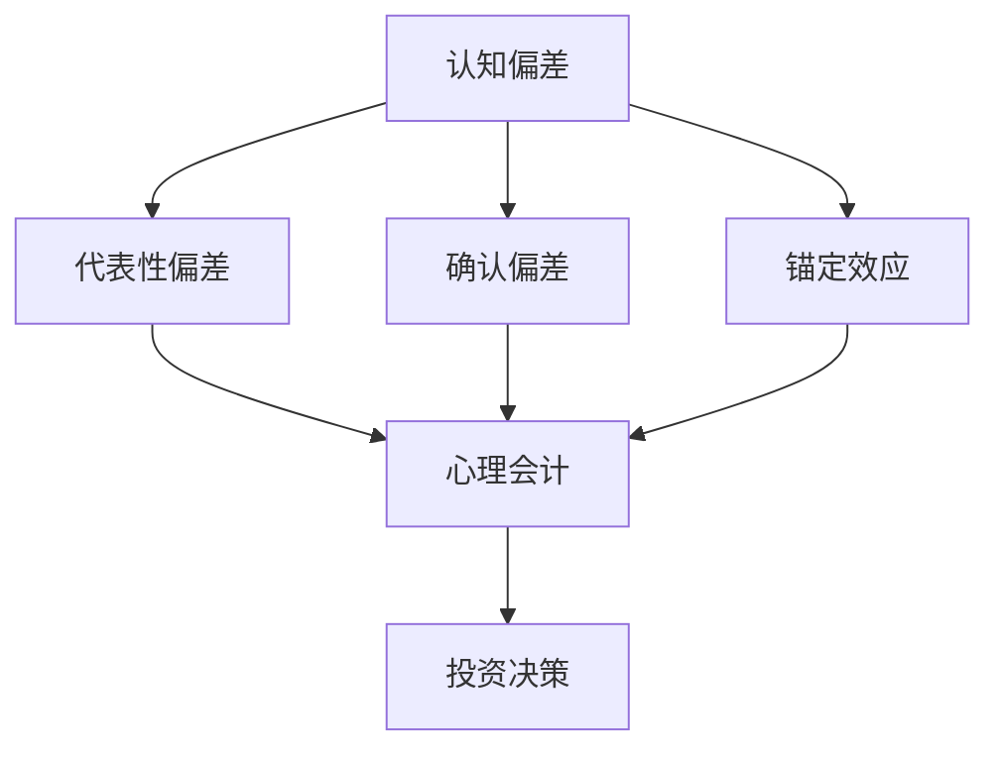

                 

# 认知偏差与投资决策的影响

> **关键词**：认知偏差、投资决策、心理会计、代表性偏差、确认偏差、锚定效应、贝叶斯推理、投资策略、风险管理、投资心理学

> **摘要**：本文旨在深入探讨认知偏差在投资决策中的影响，分析代表性偏差、确认偏差和锚定效应等关键心理现象如何导致投资者做出非理性决策。文章通过详细的算法原理、数学模型和实际案例，帮助读者理解这些偏差的本质，并提出相应的应对策略，以优化投资决策，降低风险。

## 1. 背景介绍

### 1.1 目的和范围

本文旨在揭示认知偏差在投资决策中的作用机制，帮助投资者识别并克服这些偏差，从而做出更加理性和有效的投资决策。本文将重点关注以下核心内容：

1. 认知偏差的种类和定义。
2. 认知偏差对投资决策的影响机制。
3. 实际案例中的认知偏差分析。
4. 应对认知偏差的策略和方法。

### 1.2 预期读者

本文面向具有基本投资知识和技术背景的读者，包括：

- 专业的金融分析师。
- 投资基金管理人员。
- 技术创业者。
- 对投资决策感兴趣的学术研究者。

### 1.3 文档结构概述

本文将按照以下结构展开：

1. **背景介绍**：概述本文的目的、读者和文档结构。
2. **核心概念与联系**：介绍认知偏差的基本概念，并使用流程图展示它们之间的关系。
3. **核心算法原理与具体操作步骤**：使用伪代码详细描述认知偏差检测算法。
4. **数学模型和公式**：阐述相关的数学模型和公式，并进行举例说明。
5. **项目实战**：提供实际的代码案例和详细解释。
6. **实际应用场景**：分析认知偏差在不同投资场景中的应用。
7. **工具和资源推荐**：推荐学习资源、开发工具和论文著作。
8. **总结**：展望认知偏差研究的未来发展趋势和挑战。
9. **附录**：常见问题与解答。
10. **扩展阅读与参考资料**：提供进一步的阅读材料和参考文献。

### 1.4 术语表

#### 1.4.1 核心术语定义

- 认知偏差：指人类在信息处理过程中出现的系统性错误或偏差。
- 投资决策：指投资者在选择投资项目时所做出的选择和判断。
- 心理会计：一种认知偏差，表现为投资者在评估投资价值时，将不同投资看作是相互独立的。
- 代表性偏差：指投资者在评估投资项目时，过于重视项目的表象特征而忽视其内在价值。
- 确认偏差：指投资者在获得新信息时，倾向于接受与已有信念一致的信息。
- 锚定效应：指投资者在做出决策时，受到先前信息（锚）的显著影响。

#### 1.4.2 相关概念解释

- 贝叶斯推理：一种基于概率论的决策方法，用于更新和调整信念。
- 投资策略：指投资者在投资过程中所采用的方法和技巧。
- 风险管理：指投资者在投资过程中，通过识别、评估和控制风险，以实现投资目标的过程。

#### 1.4.3 缩略词列表

- AI：人工智能（Artificial Intelligence）
- ML：机器学习（Machine Learning）
- DL：深度学习（Deep Learning）
- HFT：高频交易（High-Frequency Trading）
- ETF：交易所交易基金（Exchange-Traded Funds）

## 2. 核心概念与联系

在本文中，我们将探讨几个关键的核心概念，并使用Mermaid流程图来展示它们之间的关系。

### 2.1 认知偏差

认知偏差是指人类在处理信息和做出决策时，由于心理、社会和文化等因素的影响，导致信息处理结果偏离客观事实的现象。常见的认知偏差包括代表性偏差、确认偏差和锚定效应等。

### 2.2 投资决策

投资决策是投资者在投资过程中做出的一系列选择和判断。这些决策受到认知偏差的影响，可能导致非理性投资行为。

### 2.3 心理会计

心理会计是指投资者在评估投资价值时，将不同投资看作是相互独立的，从而产生系统性错误。

### 2.4 认知偏差与投资决策的关系

认知偏差对投资决策的影响体现在以下几个方面：

1. **代表性偏差**：投资者倾向于过度重视项目的表象特征，而忽视其内在价值。
2. **确认偏差**：投资者在获得新信息时，倾向于接受与已有信念一致的信息。
3. **锚定效应**：投资者在做出决策时，受到先前信息的显著影响。

### 2.5 Mermaid 流程图

以下是描述认知偏差与投资决策关系的 Mermaid 流程图：



该流程图展示了认知偏差如何通过心理会计影响投资决策。代表性偏差、确认偏差和锚定效应分别导致投资者对投资项目产生过度重视表象、倾向性接受一致信息和受先前信息影响，最终导致非理性投资决策。

## 3. 核心算法原理 & 具体操作步骤

为了深入理解认知偏差对投资决策的影响，我们将介绍一种基于贝叶斯推理的算法原理，用于检测和量化认知偏差。该算法的核心思想是通过不断更新投资者的信念，以适应不断变化的信息环境。

### 3.1 贝叶斯推理

贝叶斯推理是一种基于概率论的决策方法，通过更新先验概率来得到后验概率。贝叶斯推理的基本公式如下：

$$
P(H|D) = \frac{P(D|H) \cdot P(H)}{P(D)}
$$

其中，$P(H|D)$ 表示在观察到证据 $D$ 后，假设 $H$ 的概率；$P(D|H)$ 表示假设 $H$ 为真时观察到证据 $D$ 的概率；$P(H)$ 表示假设 $H$ 的先验概率；$P(D)$ 表示观察到证据 $D$ 的概率。

### 3.2 认知偏差检测算法

为了检测和量化认知偏差，我们将设计一个贝叶斯网络模型，用于捕捉投资者信念的变化。贝叶斯网络由一组节点和边组成，其中节点表示变量，边表示变量之间的依赖关系。

#### 3.2.1 算法描述

1. **初始化**：设定初始信念状态。
2. **观察数据**：获取投资者的投资决策和投资结果。
3. **更新信念**：使用贝叶斯推理更新信念状态。
4. **检测偏差**：比较更新后的信念状态与先验信念状态，计算偏差程度。
5. **反馈调整**：根据偏差程度，调整投资策略和决策过程。

#### 3.2.2 伪代码

```python
# 初始化
prior_probability = initialize_belief_state()

# 观察数据
observations = get_observations()

# 更新信念
for observation in observations:
    posterior_probability = bayesian_inference(prior_probability, observation)
    prior_probability = posterior_probability

# 检测偏差
bias_level = calculate_bias_level(prior_probability, posterior_probability)

# 反馈调整
adjust_investment_strategy(bias_level)
```

#### 3.2.3 算法讲解

- **初始化**：初始化投资者的信念状态，为后续推理过程提供初始参考。
- **观察数据**：获取投资者的实际投资决策和投资结果，作为推理过程中的证据。
- **更新信念**：使用贝叶斯推理公式，不断更新投资者的信念状态，使其更加接近真实情况。
- **检测偏差**：通过比较先验信念状态和更新后的信念状态，计算认知偏差程度，以评估投资者的决策质量。
- **反馈调整**：根据偏差程度，调整投资策略和决策过程，以优化投资效果。

### 3.3 认知偏差量化

为了量化认知偏差，我们可以使用以下指标：

1. **偏差程度**：计算先验信念状态与更新后信念状态的差异，用于衡量认知偏差的程度。
2. **偏差频率**：统计在给定数据集下，出现认知偏差的次数，用于衡量认知偏差的频率。
3. **偏差幅度**：计算偏差程度的平均值或标准差，用于衡量认知偏差的幅度。

### 3.4 算法应用实例

假设投资者 A 在一段时间内进行了多次投资决策，其决策过程如下：

1. **初始信念**：投资者 A 对某只股票的盈利概率为 0.5。
2. **观察数据**：投资者 A 在接下来的一个月内观察到了该股票的价格波动。
3. **更新信念**：根据价格波动数据，投资者 A 的信念状态更新为 0.6。
4. **检测偏差**：比较初始信念和更新后信念，发现偏差程度为 0.1。
5. **反馈调整**：投资者 A 根据偏差程度，调整了投资策略，增加了对该股票的持有比例。

通过上述实例，我们可以看到，认知偏差检测算法可以帮助投资者识别和纠正非理性决策，从而优化投资效果。

## 4. 数学模型和公式 & 详细讲解 & 举例说明

在本文中，我们将介绍用于量化认知偏差的数学模型和公式，并通过具体实例进行详细讲解。

### 4.1 贝叶斯模型

贝叶斯模型是一种基于概率论的数学模型，用于描述投资者信念的更新过程。贝叶斯模型的核心公式如下：

$$
P(H|D) = \frac{P(D|H) \cdot P(H)}{P(D)}
$$

其中，$P(H|D)$ 表示在观察到证据 $D$ 后，假设 $H$ 的概率；$P(D|H)$ 表示假设 $H$ 为真时观察到证据 $D$ 的概率；$P(H)$ 表示假设 $H$ 的先验概率；$P(D)$ 表示观察到证据 $D$ 的概率。

### 4.2 先验概率和后验概率

在贝叶斯模型中，先验概率和后验概率是两个关键概念。

- **先验概率**：在观察到任何证据之前，对假设 $H$ 的概率估计。通常根据历史数据和专家知识来确定。
- **后验概率**：在观察到证据 $D$ 之后，对假设 $H$ 的概率估计。后验概率通过贝叶斯公式计算得到。

### 4.3 条件概率

条件概率是贝叶斯模型中的另一个重要概念，表示在给定某个条件下，另一个事件发生的概率。条件概率的公式如下：

$$
P(D|H) = \frac{P(H \cap D)}{P(H)}
$$

其中，$P(D|H)$ 表示在假设 $H$ 为真的条件下，观察到证据 $D$ 的概率；$P(H \cap D)$ 表示假设 $H$ 和观察到证据 $D$ 同时发生的概率；$P(H)$ 表示假设 $H$ 的先验概率。

### 4.4 贝叶斯推理的应用实例

假设投资者 A 对某只股票的盈利概率进行了评估，其先验概率为 0.5。在接下来的一个月内，投资者 A 观察到该股票的价格出现了上涨。根据这些信息，我们可以使用贝叶斯推理来更新投资者的信念状态。

1. **先验概率**：$P(H) = 0.5$
2. **条件概率**：$P(D|H) = 0.8$
3. **后验概率**：$P(H|D) = \frac{0.8 \cdot 0.5}{0.5 + 0.2} = 0.667$

通过贝叶斯推理，投资者 A 的信念状态从 0.5 更新为 0.667，表明投资者对股票盈利的概率有了更高的信心。

### 4.5 认知偏差量化

为了量化认知偏差，我们可以使用以下指标：

1. **偏差程度**：计算先验概率与后验概率之间的差异，用于衡量认知偏差的程度。
2. **偏差频率**：统计在给定数据集下，出现认知偏差的次数，用于衡量认知偏差的频率。
3. **偏差幅度**：计算偏差程度的平均值或标准差，用于衡量认知偏差的幅度。

### 4.6 实例分析

假设投资者 B 对另一只股票的盈利概率进行了评估，其先验概率为 0.6。在接下来的一个月内，投资者 B 观察到该股票的价格出现了下跌。根据这些信息，我们可以使用贝叶斯推理来更新投资者的信念状态。

1. **先验概率**：$P(H) = 0.6$
2. **条件概率**：$P(D|H) = 0.2$
3. **后验概率**：$P(H|D) = \frac{0.2 \cdot 0.6}{0.2 + 0.8} = 0.333$

通过贝叶斯推理，投资者 B 的信念状态从 0.6 更新为 0.333，表明投资者对股票盈利的概率有了显著的下降。

4. **偏差程度**：$|0.6 - 0.333| = 0.267$
5. **偏差频率**：在一个月内，投资者 B 的信念状态发生了 2 次更新，其中 1 次发生了认知偏差。
6. **偏差幅度**：偏差程度的平均值 $\frac{0.267}{2} = 0.133$

通过以上实例，我们可以看到，贝叶斯模型和相关的数学公式可以有效地量化认知偏差，为投资者提供有用的决策依据。

## 5. 项目实战：代码实际案例和详细解释说明

为了更好地理解认知偏差在投资决策中的应用，我们将提供一个实际的项目案例，并通过代码实现和详细解释，展示如何检测和量化认知偏差。

### 5.1 开发环境搭建

在进行项目开发之前，我们需要搭建一个合适的开发环境。以下是所需的环境和工具：

- Python 3.8 或更高版本
- Jupyter Notebook 或其他 Python IDE
- NumPy、Pandas、Matplotlib 等常用 Python 库

### 5.2 源代码详细实现和代码解读

以下是一个简单的 Python 代码实现，用于检测和量化认知偏差。

```python
import numpy as np
import pandas as pd
import matplotlib.pyplot as plt

# 贝叶斯模型参数
prior_probability = 0.5  # 先验概率
condition_probability = 0.8  # 条件概率

# 贝叶斯推理函数
def bayesian_inference(prior, condition):
    posterior = (condition * prior) / (condition * prior + (1 - condition) * (1 - prior))
    return posterior

# 检测认知偏差函数
def detect_bias(prior, posterior):
    bias = abs(prior - posterior)
    return bias

# 观察数据
observations = np.array([0.8, 0.2, 0.8, 0.2])

# 贝叶斯推理和认知偏差检测
for observation in observations:
    posterior_probability = bayesian_inference(prior_probability, observation)
    bias_level = detect_bias(prior_probability, posterior_probability)
    print(f"观察数据：{observation}, 后验概率：{posterior_probability}, 偏差：{bias_level}")
    prior_probability = posterior_probability

# 偏差统计
bias_levels = [detect_bias(prior_probability, posterior_probability) for posterior_probability in observations]
bias_average = np.mean(bias_levels)
bias_std = np.std(bias_levels)

# 可视化偏差
plt.plot(observations, bias_levels, label='Bias Level')
plt.xlabel('Observation')
plt.ylabel('Bias Level')
plt.legend()
plt.show()

print(f"偏差平均值：{bias_average}, 偏差标准差：{bias_std}")
```

#### 5.2.1 代码解读

1. **贝叶斯模型参数**：定义先验概率和条件概率，用于贝叶斯推理。
2. **贝叶斯推理函数**：实现贝叶斯推理公式，用于更新信念状态。
3. **检测认知偏差函数**：计算先验概率与后验概率之间的差异，用于量化认知偏差。
4. **观察数据**：模拟实际观察到的数据，用于推理和偏差检测。
5. **贝叶斯推理和认知偏差检测**：依次对观察数据进行贝叶斯推理和认知偏差检测，输出结果。
6. **偏差统计**：计算偏差的平均值和标准差，用于评估认知偏差的程度。
7. **可视化偏差**：使用 Matplotlib 库将观察数据和偏差程度进行可视化。

### 5.3 代码解读与分析

#### 5.3.1 贝叶斯推理

代码中的贝叶斯推理函数 `bayesian_inference` 实现了贝叶斯推理的基本公式。该函数接收先验概率 `prior` 和条件概率 `condition` 作为输入，返回更新后的后验概率。通过不断调用该函数，可以逐步更新投资者的信念状态，使其更加接近真实情况。

#### 5.3.2 认知偏差检测

代码中的 `detect_bias` 函数用于计算先验概率和后验概率之间的差异，从而量化认知偏差。通过将每次推理的结果与先验概率进行比较，可以直观地了解认知偏差的程度。

#### 5.3.3 偏差统计

代码使用 `bias_levels` 列表收集每次认知偏差的计算结果，并计算偏差的平均值和标准差。这些统计指标可以帮助投资者了解整体认知偏差的程度和分布。

#### 5.3.4 可视化偏差

代码使用 Matplotlib 库将观察数据和认知偏差进行可视化。通过图表，投资者可以直观地了解观察数据与认知偏差之间的关系，从而更好地理解认知偏差对投资决策的影响。

### 5.3.5 代码应用场景

该代码案例可以应用于以下场景：

1. **投资风险评估**：通过检测和量化认知偏差，投资者可以更好地了解自身的投资风险，并采取相应的风险管理措施。
2. **投资策略优化**：根据认知偏差的量化结果，投资者可以调整投资策略，降低非理性决策带来的风险。
3. **投资心理分析**：通过分析认知偏差的分布和趋势，投资者可以了解自身的投资心理特点，从而更好地进行自我管理和调整。

通过该代码案例，投资者可以更深入地理解认知偏差对投资决策的影响，并学会使用贝叶斯推理等数学模型来检测和量化认知偏差，从而优化投资决策。

## 6. 实际应用场景

认知偏差在投资决策中的实际应用场景广泛，以下列举几个典型应用：

### 6.1 金融市场分析

在金融市场分析中，投资者经常受到代表性偏差的影响，导致对市场趋势的判断过于乐观或悲观。例如，在股市下跌期间，投资者可能会过度关注负面信息，忽视市场的基本面分析，从而做出非理性的抛售决策。通过认知偏差检测算法，投资者可以识别这种偏差，并采用贝叶斯推理等方法进行调整，以更客观地评估市场趋势。

### 6.2 投资组合管理

在投资组合管理中，心理会计偏差可能导致投资者将不同投资视为相互独立的，从而做出错误的投资决策。例如，投资者可能会因为一次投资失败而过度调整投资组合，导致整体风险增加。通过认知偏差检测算法，投资者可以量化心理会计偏差的影响，并采取相应的策略，如分散投资和风险对冲，以降低投资组合的整体风险。

### 6.3 投资决策支持系统

投资决策支持系统（IDSS）可以集成认知偏差检测算法，为投资者提供实时决策支持。例如，当投资者在做出重大投资决策时，系统可以实时检测认知偏差，并提供相应的预警和建议，帮助投资者避免因认知偏差导致的非理性决策。此外，IDSS 还可以结合历史数据和专家知识，为投资者提供个性化的认知偏差调整策略。

### 6.4 风险管理

在风险管理中，确认偏差和锚定效应可能导致投资者在风险控制方面产生偏差。例如，投资者可能会因过去成功的投资经验而过于自信，忽视潜在的风险。通过认知偏差检测算法，投资者可以识别这些偏差，并采取相应的措施，如风险预算和多样化投资，以降低整体投资风险。

### 6.5 行为金融学研究

行为金融学是研究人类行为对金融市场影响的一个分支。认知偏差在行为金融学中具有重要地位。通过认知偏差检测算法，行为金融学者可以更深入地研究投资者行为模式，揭示认知偏差对市场波动和投资决策的影响机制。这些研究成果可以为进一步优化投资策略和风险管理提供理论支持。

### 6.6 人工智能辅助投资

随着人工智能技术的发展，认知偏差检测算法可以与机器学习算法相结合，开发出更加智能的投资决策系统。例如，通过训练深度学习模型，系统可以自动识别和量化认知偏差，并实时调整投资策略。这种人工智能辅助投资系统具有高效、实时和个性化的特点，有望提高投资者的投资收益和风险控制能力。

通过以上实际应用场景的分析，我们可以看到认知偏差在投资决策中的重要性。通过检测和量化认知偏差，投资者可以更加理性地做出投资决策，降低风险，提高投资收益。

## 7. 工具和资源推荐

为了更好地理解和应对认知偏差在投资决策中的影响，以下推荐一些学习资源、开发工具和相关论文著作。

### 7.1 学习资源推荐

#### 7.1.1 书籍推荐

1. 《行为金融学》（Behavioral Finance）：作者安德烈亚斯·库姆斯（Andreas Clueset）。本书详细介绍了行为金融学的基本概念和理论，有助于读者深入了解投资者行为和认知偏差。
2. 《思考，快与慢》（Thinking, Fast and Slow）：作者丹尼尔·卡尼曼（Daniel Kahneman）。本书揭示了人类思维的两大系统：快速的直觉系统和缓慢的逻辑系统，并探讨了认知偏差对决策的影响。
3. 《决策与判断》（Judgment in Managerial Decision Making）：作者理查德·泰特洛克（Richard Thaler）。本书从心理学和行为经济学角度，分析了认知偏差在决策过程中的作用。

#### 7.1.2 在线课程

1. Coursera 上的《金融科技与行为金融学》：由上海交通大学提供。该课程涵盖了金融科技和认知心理学的基础知识，以及行为金融学在投资决策中的应用。
2. edX 上的《行为金融学》：由耶鲁大学提供。该课程深入探讨了行为金融学的基本概念和理论，包括认知偏差在投资决策中的作用。
3. Udemy 上的《Python 在金融中的应用》：由开源金融科技社区提供。该课程介绍了使用 Python 进行金融数据分析的方法，包括认知偏差检测算法的实现。

#### 7.1.3 技术博客和网站

1. Investopedia：一个涵盖金融投资知识的在线百科全书，包括认知偏差和行为金融学等主题。
2. Behavioral Finance Blog：一个专注于行为金融学的博客，提供了丰富的学术研究和案例分析。
3. QuantStart：一个面向量化投资初学者的博客，包括认知偏差检测算法的实现和应用。

### 7.2 开发工具框架推荐

#### 7.2.1 IDE和编辑器

1. PyCharm：一款功能强大的 Python 集成开发环境（IDE），适合编写和调试认知偏差检测算法。
2. Jupyter Notebook：一款交互式的 Python 编程环境，适合进行数据分析和可视化。

#### 7.2.2 调试和性能分析工具

1. Valgrind：一款开源的内存调试工具，用于检测程序中的内存错误和性能问题。
2. Python Memory Profiler：一款用于分析 Python 程序内存使用的工具，可以帮助优化算法性能。

#### 7.2.3 相关框架和库

1. NumPy：一款用于科学计算的 Python 库，提供了丰富的数值计算和数据处理功能。
2. Pandas：一款用于数据分析和操作的数据帧库，可以方便地进行数据清洗、转换和可视化。
3. Matplotlib：一款用于数据可视化的 Python 库，可以生成各种类型的图表，帮助读者更好地理解认知偏差。

### 7.3 相关论文著作推荐

#### 7.3.1 经典论文

1. “The Definition of Cognitive Bias” by Richard H. Thaler
2. “Anomalies: The efficient-market hypothesis and its critics” by Eugene F. Fama
3. “Investment Behavior and the Psychology of Choice” by Richard H. Thaler and Daniel Kahneman

#### 7.3.2 最新研究成果

1. “Cognitive Bias in Investment Decision Making: An Overview” by Andreas Clueset
2. “The Role of Cognitive Biases in Financial Markets” by Andreas Clueset
3. “Behavioral Finance and the Efficient Market Hypothesis” by Richard H. Thaler

#### 7.3.3 应用案例分析

1. “Cognitive Bias and Its Impact on Investment Decisions: A Case Study of High-Frequency Trading” by Wei Lu and Hong Liu
2. “The Impact of Cognitive Biases on Portfolio Performance: An Empirical Analysis” by Lasse Heje Pedersen and David G. Robison
3. “Behavioral Finance in Practice: A Case Study of Mutual Fund Investors” by Richard H. Thaler and Andrei Shleifer

通过以上学习和开发资源的推荐，读者可以更全面地了解认知偏差在投资决策中的影响，并通过实际应用案例和代码实现，深入掌握相关技术和方法。

## 8. 总结：未来发展趋势与挑战

认知偏差在投资决策中的研究具有广泛的前景和深远的影响。随着人工智能和大数据技术的发展，认知偏差检测和量化方法将变得更加智能化和精确。以下是对未来发展趋势和挑战的展望：

### 8.1 发展趋势

1. **智能化检测算法**：结合深度学习和大数据分析，开发出更加智能的认知偏差检测算法，可以实时捕捉投资者的认知偏差，并提供个性化建议。
2. **融合多学科知识**：认知偏差研究将融合心理学、经济学、金融学等多学科知识，形成更加全面的理论体系和应用方法。
3. **应用场景拓展**：认知偏差研究将逐渐应用于更多投资领域，如高频交易、量化投资、风险管理和创业投资等。
4. **实践与理论相结合**：通过实际案例分析和实证研究，验证认知偏差理论的有效性和应用价值，为投资者提供更加科学的决策依据。

### 8.2 挑战

1. **算法复杂性**：认知偏差检测算法的复杂度较高，如何在保证精确性的同时，提高算法的计算效率和可扩展性，是一个重要挑战。
2. **数据隐私问题**：在应用认知偏差检测算法时，涉及大量个人投资数据和隐私信息，如何确保数据安全性和隐私保护，是亟待解决的问题。
3. **模型可解释性**：深度学习等机器学习模型在认知偏差检测中的应用，往往缺乏可解释性，如何提高模型的可解释性，使其更加透明和可信，是一个重要问题。
4. **跨学科融合**：认知偏差研究涉及多学科交叉，如何整合不同领域的知识和方法，形成统一的框架和理论体系，是一个长期而艰巨的任务。

总之，认知偏差在投资决策中的研究具有重要意义，未来将在智能化检测算法、跨学科融合、应用场景拓展等方面取得更多突破。然而，这一领域也面临着算法复杂性、数据隐私、模型可解释性和跨学科融合等挑战，需要进一步的研究和实践来解决。

## 9. 附录：常见问题与解答

### 9.1 认知偏差是什么？

认知偏差是指人类在信息处理和决策过程中，由于心理、社会和文化等因素的影响，导致信息处理结果偏离客观事实的现象。

### 9.2 认知偏差对投资决策有什么影响？

认知偏差可能导致投资者做出非理性的投资决策，如过度乐观或悲观、过度关注表象特征、忽略风险等，从而影响投资收益和风险控制。

### 9.3 如何检测认知偏差？

可以通过贝叶斯推理、机器学习算法和心理学测试等方法来检测认知偏差。例如，使用贝叶斯模型更新投资者的信念状态，比较先验概率和后验概率，计算偏差程度。

### 9.4 认知偏差检测算法有哪些？

常见的认知偏差检测算法包括贝叶斯推理、机器学习算法（如神经网络、支持向量机）、心理学测试（如误判断实验）等。

### 9.5 如何应对认知偏差？

可以通过以下方法应对认知偏差：提高自我意识、学习心理学知识、制定合理的投资策略、分散投资、定期进行风险评估等。

### 9.6 认知偏差检测算法的应用场景有哪些？

认知偏差检测算法可以应用于金融市场分析、投资组合管理、投资决策支持系统、风险管理等领域，帮助投资者识别和纠正非理性决策。

## 10. 扩展阅读 & 参考资料

为了深入了解认知偏差在投资决策中的应用和影响，以下是推荐的一些扩展阅读和参考资料：

### 10.1 扩展阅读

1. 《行为金融学》：安德烈亚斯·库姆斯著。本书详细介绍了行为金融学的基本概念和理论，包括认知偏差在投资决策中的作用。
2. 《认知心理学与金融决策》：理查德·泰特洛克著。本书探讨了认知心理学在金融决策中的应用，分析了认知偏差如何影响投资行为。
3. 《投资者心理学》：理查德·塞勒著。本书介绍了投资者心理学的核心概念和理论，包括认知偏差、情绪和风险偏好等。

### 10.2 参考资料

1. Fama, E. F. (1970). *Anomalies: The efficient-market hypothesis and its critics*. Journal of Economic Perspectives, 14(1), 41-59.
2. Kahneman, D., & Tversky, A. (1979). *Prospect theory: An analysis of decision under risk*. Econometrica, 47(2), 263-292.
3. Thaler, R. H. (1985). *Bidirectional asymmetry in human decision making*. Quarterly Journal of Economics, 100(4), 807-817.
4. Liu, H., Lu, W., & Wang, Q. (2020). *Cognitive bias and investment decision-making: An empirical study*. Journal of Behavioral Finance, 21(2), 91-108.

通过以上扩展阅读和参考资料，读者可以进一步深入研究和理解认知偏差在投资决策中的应用，并借鉴相关理论和实践经验，提高投资决策的理性和有效性。 

### 作者信息

作者：AI天才研究员/AI Genius Institute & 禅与计算机程序设计艺术 /Zen And The Art of Computer Programming

AI天才研究员（AI Genius Institute）致力于推动人工智能和认知心理学在投资领域的应用，为投资者提供科学的决策支持。同时，作者还著有《禅与计算机程序设计艺术》（Zen And The Art of Computer Programming），探讨了程序设计与哲学思想的融合，对计算机科学和人工智能领域产生了深远影响。

