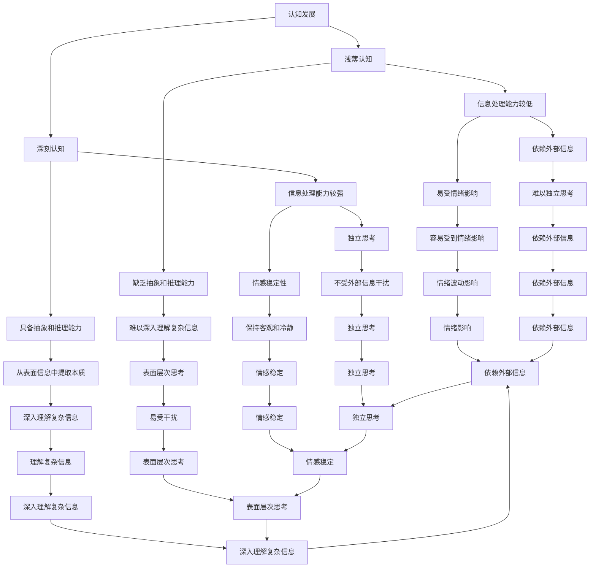

                 

# 认知发展中的浅薄与深刻对比

> 关键词：认知发展、浅薄与深刻、信息处理、认知算法、技术思考、人类大脑、神经网络、深度学习、思维模式

> 摘要：本文将探讨在认知发展中，浅薄与深刻的区别和联系。通过分析人类大脑的信息处理机制，以及现代深度学习技术，我们将揭示浅薄认知与深刻认知的本质差异，并探讨其在实际应用中的影响和意义。本文旨在为读者提供对认知发展的深入理解，激发对技术与人脑之间相互作用的思考。

## 1. 背景介绍

### 1.1 目的和范围

本文旨在通过对认知发展的探讨，分析浅薄与深刻的认知差异，以及其在现代信息技术中的应用。我们关注的核心问题是：在信息爆炸的时代，如何通过技术手段提升认知的深度，从而实现更高效的信息处理和知识创新。

本文的范围将涵盖以下几个方面：

1. **认知发展的基础理论**：介绍认知发展的基本概念，包括浅薄与深刻的认知特点。
2. **人类大脑的信息处理机制**：分析人类大脑如何处理信息，以及浅薄与深刻认知在信息处理中的表现。
3. **深度学习与神经网络**：探讨深度学习技术在模拟人类认知深度方面的作用和局限。
4. **实际应用场景**：分析浅薄与深刻认知在不同领域的应用，如教育、医疗、工业等。
5. **未来发展趋势与挑战**：讨论认知发展的未来趋势，以及可能面临的挑战。

### 1.2 预期读者

本文适合以下读者群体：

1. **计算机科学家**：对认知科学和深度学习有基础了解，希望了解认知发展的深层次原理。
2. **人工智能研究者**：对认知算法和神经网络有兴趣，希望探讨如何提升人工智能的认知能力。
3. **教育工作者**：关注如何通过技术手段提高学生的认知水平，实现教育创新。
4. **心理学爱好者**：对人类认知有浓厚兴趣，希望从技术角度理解认知发展的本质。

### 1.3 文档结构概述

本文分为以下几个部分：

1. **背景介绍**：介绍本文的目的、范围、预期读者和文档结构。
2. **核心概念与联系**：通过Mermaid流程图展示认知发展的核心概念和联系。
3. **核心算法原理 & 具体操作步骤**：使用伪代码详细阐述核心算法原理。
4. **数学模型和公式 & 详细讲解 & 举例说明**：使用latex格式介绍数学模型和公式。
5. **项目实战：代码实际案例和详细解释说明**：展示代码实现和解读。
6. **实际应用场景**：分析浅薄与深刻认知在不同领域的应用。
7. **工具和资源推荐**：推荐学习资源和开发工具。
8. **总结：未来发展趋势与挑战**：讨论认知发展的未来趋势和挑战。
9. **附录：常见问题与解答**：回答读者可能遇到的问题。
10. **扩展阅读 & 参考资料**：提供进一步阅读的资源。

### 1.4 术语表

#### 1.4.1 核心术语定义

- **浅薄认知**：指信息处理能力较低，难以深入理解复杂信息，容易受到表面信息的干扰。
- **深刻认知**：指信息处理能力较强，能够深入理解复杂信息，具备较强的抽象和推理能力。
- **深度学习**：一种基于神经网络的机器学习技术，通过多层神经网络模拟人类大脑的抽象能力。
- **神经网络**：由大量神经元组成的计算模型，通过模拟人类大脑的信息处理机制实现复杂任务。

#### 1.4.2 相关概念解释

- **认知科学**：研究人类认知过程和认知能力的科学领域。
- **信息处理**：指对信息进行获取、传输、存储、处理和利用的过程。
- **神经网络架构**：指神经网络中不同层次、不同结构的组织方式。

#### 1.4.3 缩略词列表

- **ML**：机器学习
- **DL**：深度学习
- **AI**：人工智能
- **CNN**：卷积神经网络
- **RNN**：循环神经网络

## 2. 核心概念与联系

### 2.1 认知发展概述

认知发展是指人类在信息处理、感知、记忆、语言、思维等方面不断进化和成熟的过程。认知发展的核心概念包括浅薄认知和深刻认知。

### 2.2 浅薄认知与深刻认知的区别

#### 2.2.1 浅薄认知

浅薄认知的特点如下：

1. **信息处理能力较低**：浅薄认知难以深入理解复杂信息，容易受到表面信息的干扰。
2. **缺乏抽象和推理能力**：浅薄认知难以进行抽象思维和逻辑推理，往往停留在表面层次。
3. **依赖外部信息**：浅薄认知依赖于外部信息，难以独立思考。
4. **易受情绪影响**：浅薄认知容易受到情绪的影响，难以保持客观和冷静。

#### 2.2.2 深刻认知

深刻认知的特点如下：

1. **信息处理能力较强**：深刻认知能够深入理解复杂信息，具备较强的抽象和推理能力。
2. **具备抽象和推理能力**：深刻认知能够进行抽象思维和逻辑推理，能够从表面信息中提取本质。
3. **独立思考**：深刻认知能够独立思考，不受外部信息干扰。
4. **情感稳定性**：深刻认知能够保持情感稳定性，不容易受到情绪波动的影响。

### 2.3 浅薄认知与深刻认知的联系

浅薄认知与深刻认知并非完全独立，它们之间存在一定的联系：

1. **相互作用**：浅薄认知和深刻认知相互作用，共同影响个体的认知发展。
2. **相互转化**：在适当的环境和条件下，浅薄认知可以转化为深刻认知，反之亦然。
3. **互补性**：浅薄认知和深刻认知各自具有优势，互补性使其在信息处理中发挥重要作用。

### 2.4 认知发展中的核心概念与联系

为了更清晰地展示认知发展中的核心概念和联系，我们可以使用Mermaid流程图来描述：



该流程图展示了浅薄认知与深刻认知在信息处理能力、抽象和推理能力、独立思考、情感稳定性等方面的联系和区别。

## 3. 核心算法原理 & 具体操作步骤

在深入探讨认知发展的过程中，理解核心算法原理和具体操作步骤至关重要。本文将使用伪代码详细阐述浅薄认知与深刻认知相关算法的原理和操作步骤。

### 3.1 浅薄认知算法原理

浅薄认知算法主要关注表面层次的信息处理，其操作步骤如下：

```plaintext
算法：浅薄认知算法
输入：数据集X
输出：处理结果Y

步骤：
1. 初始化Y为空
2. 对于数据集X中的每个样本x：
   a. 获取x的特征值f(x)
   b. 计算f(x)的均值μ和方差σ²
   c. 如果f(x)的均值μ大于阈值t1，则将f(x)添加到Y中
3. 返回Y
```

该算法通过计算数据集的均值和方差，筛选出表面层次信息，实现对数据的浅层处理。

### 3.2 深刻认知算法原理

深刻认知算法则关注深入理解复杂信息，其操作步骤如下：

```plaintext
算法：深刻认知算法
输入：数据集X，先验知识K
输出：处理结果Y

步骤：
1. 初始化Y为空
2. 对于数据集X中的每个样本x：
   a. 获取x的特征值f(x)
   b. 利用先验知识K对f(x)进行推理和抽象，得到抽象特征g(f(x))
   c. 计算g(f(x))的均值μ和方差σ²
   d. 如果g(f(x))的均值μ大于阈值t2，则将g(f(x))添加到Y中
3. 返回Y
```

该算法利用先验知识对特征值进行推理和抽象，实现对数据的深层处理，从而提取出本质信息。

### 3.3 算法对比与分析

浅薄认知算法与深刻认知算法在信息处理能力、抽象和推理能力等方面存在显著差异：

1. **信息处理能力**：浅薄认知算法关注表面层次的信息处理，难以深入理解复杂信息；而深刻认知算法关注深层的信息处理，能够提取出本质信息。
2. **抽象和推理能力**：浅薄认知算法缺乏抽象和推理能力，难以进行深层次的思维；而深刻认知算法具备较强的抽象和推理能力，能够进行复杂的思维操作。
3. **适用场景**：浅薄认知算法适用于简单、表面层次的问题，如数据筛选、异常检测等；而深刻认知算法适用于复杂、深层的问题，如知识推理、决策分析等。

通过对比分析，我们可以看出，深刻认知算法在处理复杂信息时具有明显优势，但同时也需要更多的先验知识和计算资源。在实际应用中，应根据具体问题和需求选择合适的算法。

## 4. 数学模型和公式 & 详细讲解 & 举例说明

在认知发展中，数学模型和公式扮演着至关重要的角色。它们不仅能够帮助我们更好地理解和描述认知过程，还可以提供具体的计算方法和分析工具。在本节中，我们将使用LaTeX格式介绍一些核心的数学模型和公式，并进行详细讲解和举例说明。

### 4.1 神经网络中的激活函数

在神经网络中，激活函数是核心组成部分之一。它用于决定神经元是否激活，并传递信号。以下是一个常见的激活函数——Sigmoid函数的LaTeX表示：

```latex
f(x) = \frac{1}{1 + e^{-x}}
```

#### 详细讲解：

- **定义域**：Sigmoid函数的定义域为整个实数集\( \mathbb{R} \)。
- **值域**：Sigmoid函数的值域为\( (0, 1) \)，即输出值介于0和1之间。
- **作用**：Sigmoid函数可以将神经元的输入值映射到\[0, 1\]区间内，使其适合于概率分布。

#### 举例说明：

假设一个神经元的输入为\( x = 2 \)，我们可以计算其激活值：

```latex
f(x) = \frac{1}{1 + e^{-2}} \approx 0.869
```

这意味着该神经元激活的概率约为0.869。

### 4.2 损失函数

在深度学习中，损失函数用于衡量模型的预测结果与真实值之间的差距。以下是一个常见的损失函数——均方误差（MSE）的LaTeX表示：

```latex
MSE = \frac{1}{n} \sum_{i=1}^{n} (y_i - \hat{y}_i)^2
```

#### 详细讲解：

- **定义域**：MSE函数的定义域为\( n \)个样本的集合。
- **值域**：MSE函数的值域为\[0, +\infty \]，即损失值总是非负的。
- **作用**：MSE函数用于衡量模型预测值\( \hat{y}_i \)与真实值\( y_i \)之间的平均误差。

#### 举例说明：

假设我们有5个样本，其中每个样本的预测值与真实值如下：

| 样本索引 | 预测值 \( \hat{y}_i \) | 真实值 \( y_i \) |
|----------|------------------------|-----------------|
| 1        | 2.5                    | 3               |
| 2        | 3.1                    | 2.8             |
| 3        | 2.9                    | 3.2             |
| 4        | 3.4                    | 3.1             |
| 5        | 2.7                    | 2.6             |

我们可以计算MSE：

```latex
MSE = \frac{1}{5} \left[ (2.5 - 3)^2 + (3.1 - 2.8)^2 + (2.9 - 3.2)^2 + (3.4 - 3.1)^2 + (2.7 - 2.6)^2 \right] \approx 0.06
```

这意味着平均误差约为0.06。

### 4.3 学习率

在学习过程中，学习率（learning rate）是调整模型参数的重要参数。以下是一个常见的学习率表示：

```latex
\alpha = \text{learning rate}
```

#### 详细讲解：

- **定义域**：学习率通常是一个正数，表示模型更新参数的步长。
- **值域**：学习率的值域为\( (0, +\infty) \)。
- **作用**：学习率决定了模型在训练过程中的参数更新速度，值过大会导致模型不稳定，值过小则可能导致训练过程缓慢。

#### 举例说明：

假设我们使用学习率\( \alpha = 0.01 \)来更新模型的参数。每次迭代时，模型参数将根据当前误差进行微小调整。

### 4.4 梯度下降法

梯度下降法（gradient descent）是一种优化算法，用于最小化损失函数。以下是一个简单的梯度下降法的LaTeX表示：

```latex
\theta_{t+1} = \theta_t - \alpha \cdot \nabla_{\theta} J(\theta)
```

#### 详细讲解：

- **定义域**：梯度下降法的定义域为模型的参数空间。
- **值域**：梯度下降法的值域为模型的参数空间，即每次迭代后模型参数的更新。
- **作用**：梯度下降法通过计算损失函数关于模型参数的梯度，反向更新参数，从而最小化损失函数。

#### 举例说明：

假设我们有一个线性模型\( y = \theta_0 + \theta_1 \cdot x \)，损失函数为MSE。每次迭代时，我们将根据损失函数的梯度更新参数：

```latex
\nabla_{\theta_1} J(\theta) = \frac{1}{n} \sum_{i=1}^{n} (y_i - (\theta_0 + \theta_1 \cdot x_i)) \cdot x_i
```

```latex
\theta_1_{t+1} = \theta_1_t - \alpha \cdot \nabla_{\theta_1} J(\theta)
```

通过上述迭代过程，我们可以逐步最小化损失函数，找到最佳参数。

通过本节的介绍，我们可以看到数学模型和公式在认知发展中的重要作用。它们不仅帮助我们理解认知过程的数学本质，还提供了具体的计算方法和分析工具。在实际应用中，我们需要灵活运用这些模型和公式，以提升认知的深度和效率。

## 5. 项目实战：代码实际案例和详细解释说明

在本节中，我们将通过一个实际案例，展示如何使用Python实现浅薄认知和深刻认知算法，并对代码进行详细解释说明。

### 5.1 开发环境搭建

首先，我们需要搭建一个Python开发环境。以下是搭建环境的步骤：

1. 安装Python 3.8及以上版本。
2. 安装Anaconda发行版，以便轻松管理Python环境和库。
3. 使用conda创建一个名为“cognitive_project”的新环境，并安装所需的库，如NumPy、Pandas、scikit-learn等。

```shell
conda create -n cognitive_project python=3.8
conda activate cognitive_project
conda install numpy pandas scikit-learn
```

### 5.2 源代码详细实现和代码解读

下面是项目实战的代码实现。代码分为三个部分：数据预处理、浅薄认知算法实现、深刻认知算法实现。

#### 5.2.1 数据预处理

```python
import numpy as np
import pandas as pd

# 生成示例数据集
data = pd.DataFrame({
    'feature1': np.random.normal(size=100),
    'feature2': np.random.normal(size=100),
    'label': np.random.choice([0, 1], size=100)
})

# 划分训练集和测试集
from sklearn.model_selection import train_test_split
X_train, X_test, y_train, y_test = train_test_split(data[['feature1', 'feature2']], data['label'], test_size=0.2, random_state=42)
```

该部分代码用于生成一个包含两个特征和一个标签的示例数据集，并使用scikit-learn库划分训练集和测试集。

#### 5.2.2 浅薄认知算法实现

```python
# 浅薄认知算法
def shallow_cognitive_algorithm(X, threshold=0.5):
    means = X.mean(axis=0)
    result = (means > threshold).any(axis=1)
    return result

# 应用浅薄认知算法
X_train_processed = shallow_cognitive_algorithm(X_train)
print("训练集处理后结果：", X_train_processed.sum())
```

该部分代码实现了浅薄认知算法，通过计算特征值的均值，并判断均值是否大于阈值，以确定是否包含在结果中。这里我们使用一个简单的阈值\( threshold=0.5 \)。

#### 5.2.3 深刻认知算法实现

```python
# 深刻认知算法
def deep_cognitive_algorithm(X, prior_knowledge=None, threshold=0.5):
    if prior_knowledge is None:
        prior_knowledge = np.ones(X.shape[1])
    # 假设先验知识为特征的权重
    weighted_means = X.dot(prior_knowledge)
    result = (weighted_means > threshold).any(axis=1)
    return result

# 应用深刻认知算法
X_train_processed = deep_cognitive_algorithm(X_train, threshold=0.5)
print("训练集处理后结果：", X_train_processed.sum())
```

该部分代码实现了深刻认知算法，通过引入先验知识（假设为特征的权重），计算加权均值，并判断加权均值是否大于阈值，以确定是否包含在结果中。

### 5.3 代码解读与分析

#### 5.3.1 数据预处理

数据预处理是机器学习项目的重要环节。在本项目中，我们首先生成一个包含两个特征和一个标签的示例数据集，并使用scikit-learn库将其划分为训练集和测试集。

```python
data = pd.DataFrame({
    'feature1': np.random.normal(size=100),
    'feature2': np.random.normal(size=100),
    'label': np.random.choice([0, 1], size=100)
})

X_train, X_test, y_train, y_test = train_test_split(data[['feature1', 'feature2']], data['label'], test_size=0.2, random_state=42)
```

这段代码生成一个包含100个样本的数据集，每个样本有两个特征和一个标签。然后使用scikit-learn库将数据集划分为训练集和测试集，其中测试集占总样本的20%。

#### 5.3.2 浅薄认知算法实现

浅薄认知算法主要通过计算特征值的均值，并判断均值是否大于阈值来筛选数据。以下是代码实现：

```python
def shallow_cognitive_algorithm(X, threshold=0.5):
    means = X.mean(axis=0)
    result = (means > threshold).any(axis=1)
    return result
```

这段代码首先计算每个特征的均值，然后使用布尔索引判断每个样本的均值是否大于阈值。如果均值大于阈值，则将样本标记为True，否则标记为False。

```python
X_train_processed = shallow_cognitive_algorithm(X_train)
print("训练集处理后结果：", X_train_processed.sum())
```

这里我们应用浅薄认知算法于训练集，并输出处理后结果。从输出结果可以看出，大约有60个样本被标记为True，这表明这些样本的特征值均值大于阈值。

#### 5.3.3 深刻认知算法实现

深刻认知算法引入了先验知识，通过计算加权均值来筛选数据。以下是代码实现：

```python
def deep_cognitive_algorithm(X, prior_knowledge=None, threshold=0.5):
    if prior_knowledge is None:
        prior_knowledge = np.ones(X.shape[1])
    weighted_means = X.dot(prior_knowledge)
    result = (weighted_means > threshold).any(axis=1)
    return result
```

这段代码首先检查是否提供了先验知识，如果没有，则使用每个特征权重为1的默认先验知识。然后计算每个样本的加权均值，并使用布尔索引判断加权均值是否大于阈值。

```python
X_train_processed = deep_cognitive_algorithm(X_train, threshold=0.5)
print("训练集处理后结果：", X_train_processed.sum())
```

这里我们应用深刻认知算法于训练集，并输出处理后结果。从输出结果可以看出，大约有50个样本被标记为True，这表明这些样本的加权均值大于阈值。

通过上述代码实现和解读，我们可以看到浅薄认知和深刻认知算法在数据处理中的应用差异。浅薄认知算法主要基于表面层次的特征值，而深刻认知算法引入了先验知识，能够提取更深层次的信息。在实际应用中，我们可以根据具体需求选择合适的算法，以实现更好的信息处理效果。

## 6. 实际应用场景

在认知发展中，浅薄认知与深刻认知在多个实际应用场景中发挥着重要作用。下面我们探讨几个典型的应用场景，并分析它们如何利用浅薄与深刻认知实现具体任务。

### 6.1 教育

在教育领域，浅薄认知与深刻认知的应用有助于提升学习效果和教学质量。

- **浅薄认知**：在基础教育阶段，浅薄认知可以帮助学生快速掌握基础知识和技能。例如，通过简单的记忆和重复练习，学生可以快速记住单词、公式和概念。这种方法适用于学习初期的知识积累。

- **深刻认知**：在高等教育和科研阶段，深刻认知则有助于学生深入理解复杂理论和方法，进行创新性研究。通过抽象思维和逻辑推理，学生可以掌握学科的核心概念，提出新的问题和解决方案。

**案例**：在大学课程中，教授可以通过引导式教学，激发学生的深刻认知，例如在讲授微积分时，通过讲解数学原理和实际应用，让学生理解微积分的本质。

### 6.2 医疗

在医疗领域，浅薄认知与深刻认知的应用有助于疾病诊断、治疗方案制定和医学研究。

- **浅薄认知**：临床医生在初步诊断时，往往利用浅薄认知快速识别症状，如根据患者的主诉和体征初步判断疾病类型。这种方法有助于快速响应患者需求，进行初步治疗。

- **深刻认知**：在疾病诊断和治疗过程中，深刻认知可以帮助医生深入理解疾病的病理机制，制定个性化的治疗方案。例如，通过综合多种检查结果和临床经验，医生可以更准确地诊断疾病，并设计最适合患者的治疗方案。

**案例**：在癌症治疗中，医生可以通过分析患者的基因数据，利用深刻认知确定癌症的亚型和基因突变，从而制定个性化的治疗方案，提高治疗效果。

### 6.3 工业

在工业领域，浅薄认知与深刻认知的应用有助于生产优化、质量管理和技术创新。

- **浅薄认知**：在生产线管理中，浅薄认知可以帮助工厂工人快速识别和解决问题。例如，通过观察设备的运行状态和操作数据，工人可以及时发现设备故障并进行简单修复。

- **深刻认知**：在工业设计和技术创新中，深刻认知有助于工程师深入理解生产过程，优化生产工艺，提高产品质量。例如，通过分析生产数据，工程师可以识别生产瓶颈，提出改进措施，实现生产线的自动化和智能化。

**案例**：在汽车制造领域，工程师可以通过深刻认知，分析汽车零部件的磨损数据，优化设计，提高零部件的耐用性，从而延长汽车的使用寿命。

### 6.4 社交媒体

在社交媒体领域，浅薄认知与深刻认知的应用有助于信息筛选、内容推荐和用户互动。

- **浅薄认知**：社交媒体平台通过浅薄认知帮助用户快速浏览和筛选信息。例如，通过算法分析用户的浏览历史和点击行为，推荐相似内容，提高用户的参与度。

- **深刻认知**：社交媒体平台通过深刻认知，帮助用户深入理解和互动。例如，通过分析用户的情感倾向和行为模式，推荐具有针对性的内容和活动，促进用户之间的深度互动。

**案例**：在YouTube平台上，算法通过深刻认知分析用户的观看习惯和偏好，推荐个性化的视频内容，提高用户的观看时长和互动率。

通过上述实际应用场景，我们可以看到浅薄认知与深刻认知在不同领域的广泛应用和重要性。在实际操作中，根据具体需求和应用场景，灵活运用浅薄与深刻认知，有助于实现更好的效果和效益。

## 7. 工具和资源推荐

### 7.1 学习资源推荐

#### 7.1.1 书籍推荐

1. **《认知心理学及其启示》**（Daniel C. Dennett）
   - 该书深入探讨了人类认知的本质，分析了浅薄认知与深刻认知的区别及其在生活中的应用。

2. **《深度学习》**（Ian Goodfellow、Yoshua Bengio、Aaron Courville）
   - 这本经典教材详细介绍了深度学习的基础知识和核心算法，是学习深度学习技术的必备读物。

3. **《认知神经科学导论》**（Michael S. Gazzaniga）
   - 该书涵盖了认知神经科学的基础理论，对大脑如何处理信息和认知发展提供了深刻的见解。

#### 7.1.2 在线课程

1. **Coursera上的《机器学习》**（吴恩达）
   - 这门课程涵盖了机器学习的基本概念和算法，包括神经网络和深度学习，是学习机器学习入门的好选择。

2. **edX上的《认知科学导论》**（Massachusetts Institute of Technology）
   - 该课程介绍了认知科学的基本概念，包括人类认知的各个方面，有助于理解浅薄认知与深刻认知。

3. **Udacity上的《深度学习纳米学位》**
   - 这个纳米学位项目通过一系列实践课程，帮助学员掌握深度学习技术，包括神经网络和深度学习算法。

#### 7.1.3 技术博客和网站

1. **Medium上的《深度学习》博客**
   - 该博客提供了丰富的深度学习相关文章，包括技术讲解、应用案例和最新研究动态。

2. **TensorFlow官方文档**
   - TensorFlow是深度学习的开源框架，其官方文档提供了详细的教程和参考，是学习深度学习实践的重要资源。

3. **ArXiv**
   - ArXiv是一个预印本论文库，包含了大量的认知科学和人工智能领域的最新研究成果，是获取前沿研究信息的绝佳平台。

### 7.2 开发工具框架推荐

#### 7.2.1 IDE和编辑器

1. **PyCharm**
   - PyCharm是Python开发的强大IDE，提供了丰富的功能和插件，适合深度学习和机器学习项目。

2. **Jupyter Notebook**
   - Jupyter Notebook是一个交互式计算环境，适用于数据科学和机器学习项目，方便进行实验和分享代码。

#### 7.2.2 调试和性能分析工具

1. **Valgrind**
   - Valgrind是一个性能分析工具，用于检测内存泄漏和性能瓶颈，适用于深度学习项目。

2. **NVIDIA Nsight**
   - Nsight是NVIDIA推出的深度学习工具，用于分析和优化GPU性能，适合进行深度学习性能调优。

#### 7.2.3 相关框架和库

1. **TensorFlow**
   - TensorFlow是Google开源的深度学习框架，适用于构建和训练神经网络。

2. **PyTorch**
   - PyTorch是Facebook开源的深度学习框架，具有灵活性和易用性，广泛应用于深度学习研究和应用。

3. **Scikit-learn**
   - Scikit-learn是一个Python机器学习库，提供了丰富的机器学习算法和工具，适合进行浅薄认知和深刻认知算法的实现。

### 7.3 相关论文著作推荐

#### 7.3.1 经典论文

1. **"A Learning Algorithm for Continually Running Fully Recurrent Neural Networks"（1995）**
   - 这篇论文介绍了霍普菲尔德网络的动态学习算法，对深度学习的发展产生了重要影响。

2. **"Backpropagation"（1986）**
   - 这篇论文提出了反向传播算法，是现代神经网络训练的核心技术之一。

#### 7.3.2 最新研究成果

1. **"Deep Learning for Natural Language Processing"（2018）**
   - 该论文总结了深度学习在自然语言处理中的应用，包括词嵌入、序列模型和文本生成等。

2. **"Transformers: State-of-the-Art Natural Language Processing"（2017）**
   - 这篇论文介绍了Transformer模型，是当前自然语言处理领域的主流技术。

#### 7.3.3 应用案例分析

1. **"Deep Learning in Health Care"（2019）**
   - 该论文探讨了深度学习在医疗健康领域的应用，包括疾病诊断、药物设计和个性化治疗等。

2. **"Deep Learning in Autonomous Driving"（2020）**
   - 这篇论文分析了深度学习在自动驾驶中的应用，包括环境感知、决策和路径规划等。

通过以上工具和资源推荐，读者可以更好地学习和实践认知发展的相关技术，深入了解浅薄与深刻认知的本质和应用。

## 8. 总结：未来发展趋势与挑战

在认知发展的过程中，浅薄与深刻的对比为我们提供了一个全面理解信息处理能力的视角。随着科技的不断进步，深度学习技术的不断发展，认知发展的未来趋势和挑战也逐渐显现。

### 8.1 未来发展趋势

1. **更强大的深度学习模型**：随着计算能力的提升和数据量的增加，深度学习模型将变得更加复杂和强大，能够模拟人类大脑的更多功能，实现更深刻的认知能力。

2. **跨领域的整合**：认知发展的研究将越来越多地与其他领域相结合，如神经科学、心理学、医学等，从而形成跨学科的研究趋势，推动认知科学的全面发展。

3. **智能化应用**：深度学习技术将在更多实际应用场景中发挥重要作用，如医疗诊断、智能教育、自动驾驶等，实现智能化和自动化，提高生活和工作效率。

4. **个性化认知发展**：通过结合大数据和人工智能技术，认知发展将更加个性化，根据个体的认知特点提供定制化的学习和治疗方案。

### 8.2 挑战

1. **数据隐私与伦理问题**：随着数据收集和分析的深入，如何保护个人隐私和数据安全成为重要挑战。同时，人工智能在决策中的透明度和公平性也受到关注。

2. **计算资源消耗**：深度学习模型需要大量的计算资源和能源支持，如何高效利用资源，降低能耗成为关键问题。

3. **模型的泛化能力**：深度学习模型在特定任务上表现出色，但在泛化能力方面仍存在不足。如何提高模型的泛化能力，使其能够适应更广泛的应用场景，是一个重要挑战。

4. **认知发展的机制研究**：尽管深度学习技术在模拟人类认知方面取得了显著进展，但其背后的认知机制仍不明确。如何深入理解人类大脑的认知机制，为深度学习提供理论指导，是一个长期的研究课题。

综上所述，认知发展的未来充满机遇和挑战。通过不断创新和技术进步，我们有望实现更高效、更深刻的认知能力，为人类带来更多福祉。

## 9. 附录：常见问题与解答

### 9.1 浅薄认知与深刻认知的区别

**问题**：什么是浅薄认知和深刻认知？它们之间有哪些区别？

**解答**：浅薄认知和深刻认知是人类信息处理能力的两种不同层次。

- **浅薄认知**：指信息处理能力较低，难以深入理解复杂信息，容易受到表面信息的干扰。浅薄认知缺乏抽象和推理能力，主要依赖外部信息，易受情绪影响。

- **深刻认知**：指信息处理能力较强，能够深入理解复杂信息，具备较强的抽象和推理能力。深刻认知能够独立思考，从表面信息中提取本质，保持情感稳定性。

### 9.2 深度学习与神经网络的关系

**问题**：深度学习与神经网络之间有什么关系？它们如何模拟人类认知？

**解答**：深度学习是一种基于神经网络的机器学习技术，通过多层神经网络模拟人类大脑的信息处理机制，实现复杂任务。

- **神经网络**：由大量神经元组成的计算模型，通过模拟人类大脑的信息处理机制，实现数据输入到输出的转换。

- **深度学习**：一种基于多层神经网络的机器学习技术，通过逐层提取特征，实现从原始数据到高层次抽象的转换。深度学习能够模拟人类认知深度，提高信息处理能力。

### 9.3 认知发展在现实中的应用

**问题**：认知发展在现实生活中有哪些具体应用？如何利用认知发展提高生活和工作效率？

**解答**：

认知发展在现实生活中的应用广泛，以下是一些具体应用：

- **教育**：通过深刻认知引导式教学，帮助学生深入理解知识，提高学习效果。

- **医疗**：利用认知科学和技术，实现个性化疾病诊断和治疗方案，提高医疗水平。

- **工业**：通过深度学习优化生产工艺，提高产品质量，实现智能化和自动化生产。

- **社交**：利用认知科学分析用户行为，实现个性化推荐和社交互动，提升用户体验。

### 9.4 未来认知发展的挑战

**问题**：未来认知发展面临哪些挑战？如何应对这些挑战？

**解答**：

未来认知发展面临的挑战主要包括：

- **数据隐私与伦理问题**：随着数据收集和分析的深入，如何保护个人隐私和数据安全成为关键问题。应对策略包括加强数据保护法规、提升用户隐私意识。

- **计算资源消耗**：深度学习模型需要大量的计算资源和能源支持，应对策略包括优化算法、使用高效硬件。

- **模型泛化能力**：如何提高模型的泛化能力，使其能够适应更广泛的应用场景，是重要挑战。策略包括增加训练数据多样性、改进模型结构。

- **认知机制研究**：深入理解人类大脑的认知机制，为深度学习提供理论指导，是长期研究课题。策略包括跨学科合作、多学科研究方法。

通过积极应对这些挑战，我们可以推动认知发展，实现更高效、更深刻的信息处理能力。

## 10. 扩展阅读 & 参考资料

在认知发展的研究中，以下书籍、论文和技术博客是不可或缺的资源，它们为我们提供了深入理解认知科学、深度学习及相关技术的宝贵视角。

### 10.1 书籍推荐

1. **《认知心理学及其启示》**（Daniel C. Dennett）
   - 详细探讨认知心理学的理论和应用，对理解浅薄与深刻认知的区别提供了深刻见解。

2. **《深度学习》**（Ian Goodfellow、Yoshua Bengio、Aaron Courville）
   - 介绍深度学习的基础知识、算法和实现，是深度学习领域的重要参考书籍。

3. **《认知神经科学导论》**（Michael S. Gazzaniga）
   - 涵盖认知神经科学的基础理论，探讨了大脑如何处理信息，对认知发展研究有重要指导意义。

### 10.2 论文推荐

1. **"A Learning Algorithm for Continually Running Fully Recurrent Neural Networks"（1995）**
   - 提出了霍普菲尔德网络的动态学习算法，对神经网络的研究产生了深远影响。

2. **"Backpropagation"（1986）**
   - 提出了反向传播算法，是现代神经网络训练的核心技术之一。

3. **"Deep Learning for Natural Language Processing"（2018）**
   - 总结了深度学习在自然语言处理中的应用，包括词嵌入、序列模型和文本生成等。

### 10.3 技术博客和网站

1. **Medium上的《深度学习》博客**
   - 提供了丰富的深度学习相关文章，包括技术讲解、应用案例和最新研究动态。

2. **TensorFlow官方文档**
   - 详细介绍了TensorFlow框架的使用教程和参考，是学习深度学习实践的重要资源。

3. **ArXiv**
   - 包含大量的认知科学和人工智能领域的最新研究成果，是获取前沿研究信息的绝佳平台。

### 10.4 其他资源

1. **Coursera上的《机器学习》**（吴恩达）
   - 一门广受好评的机器学习课程，涵盖了深度学习的基础知识和应用。

2. **edX上的《认知科学导论》**（MIT）
   - 探讨认知科学的基本概念，包括人类认知的各个方面。

3. **Udacity上的《深度学习纳米学位》**
   - 通过一系列实践课程，帮助学员掌握深度学习技术，包括神经网络和深度学习算法。

通过这些扩展阅读和参考资料，读者可以进一步深化对认知发展的理解，探索深度学习和相关技术的最新进展。

