                 

### 1. 背景介绍

#### 1.1 目的和范围

本文旨在探讨认知增强与伦理在技术应用中的社会影响。随着人工智能和认知科学的发展，认知增强技术逐渐成为提升人类认知能力的重要手段。然而，这些技术的应用也引发了诸多伦理和社会问题。本文将分析认知增强技术的核心原理、其可能带来的伦理困境，以及在实际应用中的影响。通过深入探讨这些议题，我们希望能够为相关领域的进一步研究和政策制定提供有益的参考。

本文将重点关注以下几个方面的内容：

- **核心概念与联系**：介绍认知增强技术的核心概念及其与相关领域的联系。
- **核心算法原理 & 具体操作步骤**：详细阐述认知增强技术的算法原理和操作步骤。
- **数学模型和公式 & 详细讲解 & 举例说明**：解释认知增强技术中使用的数学模型和公式，并通过实例进行说明。
- **项目实战：代码实际案例和详细解释说明**：提供实际代码案例，详细解读其实现过程。
- **实际应用场景**：分析认知增强技术在各种实际应用场景中的效果和影响。
- **工具和资源推荐**：推荐学习资源、开发工具和相关论文，以供读者进一步学习和研究。
- **总结：未来发展趋势与挑战**：总结认知增强与伦理在技术应用中的现状，探讨其未来发展趋势和面临的挑战。

通过本文的详细分析，我们期望能够帮助读者更好地理解认知增强技术的本质，以及其在实际应用中可能带来的伦理和社会影响。

#### 1.2 预期读者

本文的预期读者包括但不限于以下几类：

- **人工智能研究人员**：对认知增强技术有深入研究的学者，希望了解其伦理和社会影响的广泛背景。
- **软件开发工程师**：关注人工智能和认知科学在软件开发中的应用，希望掌握相关技术的具体实现方法。
- **伦理学家和社会科学家**：对技术应用中的伦理问题和社会影响感兴趣，希望从技术角度探讨这些问题。
- **政策制定者和企业高管**：关注科技发展对社会的影响，希望了解认知增强技术的潜在风险和应对策略。
- **计算机科学学生和爱好者**：对认知增强技术有初步了解，希望通过本文加深对其原理和应用的理解。

无论您属于上述哪一类读者，本文都将通过逻辑清晰、结构紧凑的阐述，帮助您全面了解认知增强与伦理在技术应用中的社会影响。

#### 1.3 文档结构概述

本文将按照以下结构进行详细阐述：

- **1. 背景介绍**：介绍本文的目的和范围，预期读者，以及文档结构概述。
- **2. 核心概念与联系**：解释认知增强技术的核心概念，并绘制相应的 Mermaid 流程图，展示其与相关领域的联系。
- **3. 核心算法原理 & 具体操作步骤**：详细阐述认知增强技术的算法原理和操作步骤，使用伪代码进行说明。
- **4. 数学模型和公式 & 详细讲解 & 举例说明**：解释认知增强技术中使用的数学模型和公式，并通过实例进行说明。
- **5. 项目实战：代码实际案例和详细解释说明**：提供实际代码案例，详细解读其实现过程。
- **6. 实际应用场景**：分析认知增强技术在各种实际应用场景中的效果和影响。
- **7. 工具和资源推荐**：推荐学习资源、开发工具和相关论文，以供读者进一步学习和研究。
- **8. 总结：未来发展趋势与挑战**：总结认知增强与伦理在技术应用中的现状，探讨其未来发展趋势和面临的挑战。
- **9. 附录：常见问题与解答**：列出常见问题并提供解答。
- **10. 扩展阅读 & 参考资料**：提供相关扩展阅读和参考资料。

通过本文的结构概述，读者可以清晰地了解全文的框架和内容，为后续的阅读和理解打下坚实的基础。

#### 1.4 术语表

为了确保本文的可读性和一致性，我们在此列出一些核心术语及其定义和解释：

#### 1.4.1 核心术语定义

- **认知增强技术**：指利用计算机和人工智能技术，增强或扩展人类认知能力的一系列方法，如记忆增强、注意力管理、学习效率提升等。
- **伦理**：指关于道德和行为的理论、原则和规范，涉及如何正确地行动和决策。
- **社会影响**：指技术或实践在社会各个层面上产生的效果，包括经济、文化、法律、心理等方面。
- **人工智能（AI）**：指通过机器学习和算法模拟人类智能的技术，包括感知、理解、推理、决策等能力。
- **神经网络**：指一种模仿生物神经网络的结构和功能的人工神经网络，用于执行复杂的计算和模式识别任务。

#### 1.4.2 相关概念解释

- **伦理困境**：指在某些情况下，两个或多个道德原则似乎都正确，但无法同时遵守的困境。
- **隐私保护**：指在数据处理过程中，采取措施确保个人隐私不被非法获取或滥用。
- **公平性**：指在算法和应用中，确保所有人都能获得公平的机会和待遇，避免歧视和不公正现象。
- **数据安全**：指在数据处理和存储过程中，确保数据不被未授权访问、篡改或泄露。

#### 1.4.3 缩略词列表

- **AI**：人工智能（Artificial Intelligence）
- **ML**：机器学习（Machine Learning）
- **DL**：深度学习（Deep Learning）
- **NLP**：自然语言处理（Natural Language Processing）
- **GNP**：全球神经科学项目（Global Neuroscience Project）

通过定义和解释这些核心术语，我们旨在为读者提供一致的理解基础，便于后续内容的深入探讨。

### 2. 核心概念与联系

#### 2.1 认知增强技术的核心概念

认知增强技术是一种通过模拟和增强人类大脑的认知功能，来提升个体认知能力的技术。其核心概念主要包括以下几个方面：

1. **记忆增强**：通过算法和计算机技术，增强个体的记忆能力和记忆容量。例如，使用神经网络和机器学习算法对记忆数据进行分类和检索，从而提高记忆的准确性和速度。

2. **注意力管理**：通过技术手段，帮助个体更好地管理和分配注意力。例如，使用智能助手和提醒系统来减少干扰，提高注意力的集中度和工作效率。

3. **学习效率提升**：通过优化学习过程和方法，提高个体的学习效率和效果。例如，使用个性化学习平台和自适应学习算法，根据个体的学习习惯和能力，制定个性化的学习方案。

4. **情绪调节**：通过技术手段，帮助个体更好地调节情绪和心理状态。例如，使用生物反馈设备和心理训练应用，帮助个体缓解焦虑和压力，提高心理健康水平。

#### 2.2 认知增强技术与相关领域的联系

认知增强技术不仅涵盖了认知科学的领域，还与多个相关技术领域有着密切的联系。以下是认知增强技术与相关领域的一些主要联系：

1. **人工智能（AI）**：认知增强技术依赖于人工智能技术，特别是机器学习和深度学习算法，以实现记忆增强、注意力管理和学习效率提升等功能。AI技术提供了强大的计算和数据处理能力，使得认知增强技术得以实现。

2. **生物医学工程**：认知增强技术涉及到对人类大脑和神经系统的研究，因此与生物医学工程领域有着紧密的联系。生物医学工程提供了相关的生理和心理知识，帮助认知增强技术更好地理解和模拟人类大脑的认知功能。

3. **神经科学**：认知增强技术的研究依赖于神经科学的进展，特别是对大脑结构和功能的理解。神经科学的研究成果为认知增强技术提供了理论基础和实验数据，使得技术能够更准确地模拟和增强人类认知能力。

4. **心理学**：认知增强技术旨在提升个体的认知能力，因此与心理学领域有着密切的联系。心理学提供了关于人类认知和行为的基本原理，帮助认知增强技术更好地设计和应用。

5. **教育学**：认知增强技术可以应用于教育领域，提高学生的学习效果和效率。教育学的研究成果为认知增强技术的应用提供了实践指导，使得技术能够更好地适应教育需求。

#### 2.3 Mermaid 流程图

为了更直观地展示认知增强技术与相关领域的联系，我们使用 Mermaid 流程图进行描述。以下是认知增强技术与相关领域的 Mermaid 流程图：

```mermaid
graph TB
A[认知增强技术] --> B[人工智能]
A --> C[生物医学工程]
A --> D[神经科学]
A --> E[心理学]
A --> F[教育学]
B --> G[机器学习]
B --> H[深度学习]
C --> I[生理学]
C --> J[神经影像学]
D --> K[认知神经科学]
D --> L[心理学]
E --> M[社会心理学]
E --> N[发展心理学]
F --> O[课程设计]
F --> P[教学方法]
G --> Q[监督学习]
G --> R[无监督学习]
H --> S[卷积神经网络]
H --> T[循环神经网络]
I --> U[电生理学]
I --> V[神经影像学]
J --> W[功能磁共振成像]
J --> X[结构磁共振成像]
K --> Y[认知心理学]
K --> Z[计算神经科学]
L --> AA[社会心理学]
L --> BB[发展心理学]
M --> CC[社会互动]
M --> DD[群体心理]
N --> EE[儿童心理学]
N --> FF[青少年心理学]
O --> GG[课程设计]
O --> HH[教学策略]
P --> II[教育技术]
P --> JJ[学习评估]
Q --> KK[线性回归]
Q --> LL[支持向量机]
R --> MM[聚类算法]
R --> NN[异常检测]
S --> OO[图像识别]
S --> PP[语音识别]
T --> QQ[自然语言处理]
T --> RR[序列建模]
U --> SS[神经元活动记录]
U --> TT[神经元成像]
V --> WW[脑电图]
V --> XX[脑磁图]
W --> YY[脑功能连接]
W --> ZZ[脑结构连接]
X --> AAA[脑灰质密度]
X --> BBB[脑白质完整性]
Y --> CCC[认知功能测试]
Y --> DDD[神经行为学]
Z --> EEE[神经网络模拟]
Z --> FFF[神经网络逆向工程]
AA --> GGG[社交心理学]
AA --> HHH[组织心理学]
BB --> III[婴儿心理学]
BB --> JJJ[儿童心理学]
CC --> KKK[群体行为]
CC --> LLL[团队合作]
DD --> MMM[青春期心理]
DD --> NNN[成年期心理]
EE --> OOO[儿童发展]
EE --> PPP[青少年发展]
FF --> QQQ[教育心理学]
FF --> RRR[培训心理学]
GG --> SSS[学习环境]
GG --> TTT[教学方法]
HH --> UUU[教育技术]
HH --> VVV[学习评估]
II --> WWW[在线教育]
II --> XXX[虚拟现实教育]
JJ --> YYY[学习分析]
JJ --> ZZZ[考试评估]
KK --> AAAA[团队协作]
KK --> BBBB[领导力]
LL --> CCC[团队管理]
LL --> DDD[团队沟通]
MM --> EEsumm[成人发展]
MM --> FFV[职业生涯规划]
NN --> GGG[心理健康]
NN --> HHH[心理治疗]
OO --> III[教育改革]
OO --> JJJ[教学模式]
PP --> KKK[教育政策]
PP --> LLL[教育投资]
QQ --> MMM[语言学习]
QQ --> NNN[机器翻译]
RR --> OOO[时间序列分析]
RR --> PPP[视频处理]
SS --> QQQ[人脸识别]
SS --> RRR[物体检测]
TT --> SSS[情感识别]
TT --> TTT[生物特征识别]
UU --> UUU[脑机接口]
UU --> VVV[神经反馈]
VV --> WWW[神经调节]
VV --> XXX[神经康复]
WW --> XXX[脑机接口应用]
WW --> YYY[神经系统疾病治疗]
XX --> AAA[脑机接口技术]
XX --> BBB[智能医疗]
YY --> CCC[脑认知研究]
YY --> DDD[脑功能成像]
ZZ --> EEE[神经科学仪器]
ZZ --> FFF[神经科学数据分析]
GGG --> GGG[团队心理健康]
GGG --> HHH[团队精神健康]
HHH --> III[教育伦理]
HHH --> JJJ[职业伦理]
III --> KKK[学习道德]
III --> LLL[科研伦理]
JJJ --> MMM[法律伦理]
JJJ --> NNN[社会伦理]
KKK --> OOO[教学伦理]
KKK --> PPP[学习伦理]
LLL --> QQQ[数据伦理]
LLL --> RRR[隐私伦理]
MMM --> SSS[医学伦理]
MMM --> TTT[临床伦理]
NNN --> UUU[公共伦理]
NNN --> VVV[环境伦理]
OOO --> WWW[伦理学教育]
OOO --> XXX[伦理学研究]
PPQ --> QQQ[伦理学应用]
PPQ --> RRR[伦理学实践]
QQQ --> SSS[道德哲学]
QQQ --> TTT[伦理理论]
RRR --> UUU[伦理决策]
RRR --> VVV[伦理问题]
```



通过上述 Mermaid 流程图，我们可以清晰地看到认知增强技术与人工智能、生物医学工程、神经科学、心理学和教育学等领域的紧密联系。这些联系不仅展示了认知增强技术的广泛应用，也为进一步研究和开发提供了重要的理论基础和实践指导。

### 3. 核心算法原理 & 具体操作步骤

#### 3.1 算法原理

认知增强技术的核心在于如何利用计算机和人工智能算法，模拟和增强人类大脑的认知功能。以下是几种常见的认知增强算法原理：

1. **深度学习算法**：深度学习算法通过多层神经网络结构，对大量数据进行分析和模式识别，从而模拟人类大脑的学习和认知过程。常见的深度学习算法包括卷积神经网络（CNN）、循环神经网络（RNN）和生成对抗网络（GAN）等。

2. **强化学习算法**：强化学习算法通过试错和反馈机制，让模型在特定环境中学习最优策略，从而增强个体的决策能力和问题解决能力。例如，Q-learning和深度Q网络（DQN）等算法在认知增强中有着广泛应用。

3. **迁移学习算法**：迁移学习算法通过利用预训练模型，将知识从源域迁移到目标域，从而提高认知任务的效率和准确性。这种算法在记忆增强和注意力管理中有着重要作用。

4. **进化算法**：进化算法通过模拟生物进化过程，对个体进行优化和筛选，以找到最优解决方案。这种算法在认知任务中，尤其是在复杂决策和问题解决中表现出色。

#### 3.2 具体操作步骤

以下将详细阐述一种基于迁移学习的认知增强算法——**图像识别增强算法**的具体操作步骤：

1. **数据准备**：

   首先，我们需要准备一个包含大量图像的数据集，这些图像可以是自然图像、医学图像或任何其他类型的图像。数据集应包括标签信息，以便我们能够对模型的性能进行评估。

   ```python
   import tensorflow as tf
   from tensorflow.keras.preprocessing.image import ImageDataGenerator

   # 设置数据集路径
   dataset_path = 'path/to/your/dataset'

   # 创建数据生成器
   train_datagen = ImageDataGenerator(rescale=1./255)
   validation_datagen = ImageDataGenerator(rescale=1./255)

   # 加载训练数据和验证数据
   train_data = train_datagen.flow_from_directory(
       dataset_path + '/train',
       target_size=(150, 150),
       batch_size=32,
       class_mode='binary')

   validation_data = validation_datagen.flow_from_directory(
       dataset_path + '/validation',
       target_size=(150, 150),
       batch_size=32,
       class_mode='binary')
   ```

2. **模型选择**：

   接下来，我们选择一个预训练的卷积神经网络（如VGG16、ResNet50等）作为基础模型，并使用迁移学习技术，将其应用于图像识别任务。

   ```python
   from tensorflow.keras.applications import VGG16

   # 加载预训练模型
   base_model = VGG16(weights='imagenet', include_top=False, input_shape=(150, 150, 3))

   # 冻结基础模型的权重
   for layer in base_model.layers:
       layer.trainable = False
   ```

3. **模型扩展**：

   在基础模型之上，我们添加一层全连接层（Dense Layer）和输出层（Softmax Layer），以实现图像分类任务。

   ```python
   from tensorflow.keras.models import Model
   from tensorflow.keras.layers import Dense, Flatten, GlobalAveragePooling2D

   # 添加全连接层和输出层
   x = Flatten()(base_model.output)
   x = Dense(1024, activation='relu')(x)
   predictions = Dense(2, activation='softmax')(x)

   # 创建完整的模型
   model = Model(inputs=base_model.input, outputs=predictions)
   ```

4. **模型训练**：

   使用迁移学习技术，对模型进行训练。这里我们使用交叉熵损失函数和Adam优化器，并在训练过程中使用学习率衰减策略。

   ```python
   from tensorflow.keras.optimizers import Adam
   from tensorflow.keras.losses import CategoricalCrossentropy

   # 编译模型
   model.compile(optimizer=Adam(lr=0.0001), loss=CategoricalCrossentropy(), metrics=['accuracy'])

   # 训练模型
   history = model.fit(
       train_data,
       epochs=10,
       validation_data=validation_data,
       verbose=1)
   ```

5. **模型评估**：

   训练完成后，我们对模型进行评估，以验证其性能。

   ```python
   # 评估模型
   test_loss, test_accuracy = model.evaluate(validation_data, verbose=1)
   print('Test accuracy:', test_accuracy)
   ```

通过上述具体操作步骤，我们可以看到如何利用迁移学习和卷积神经网络，实现图像识别的增强任务。类似的方法可以应用于其他认知增强任务，如自然语言处理、记忆增强和注意力管理等，从而全面提升个体的认知能力。

### 4. 数学模型和公式 & 详细讲解 & 举例说明

#### 4.1 数学模型和公式

在认知增强技术中，数学模型和公式起到了至关重要的作用，特别是在算法设计和性能优化方面。以下是几种常用的数学模型和公式：

1. **卷积神经网络（CNN）中的卷积公式**：

   卷积神经网络通过卷积操作来提取图像特征。卷积公式可以表示为：

   $$ 
   (f_{ij}^l) = \sum_{k=1}^{m} w_{ik}^l * (g_{kj}^{l-1}) + b^l
   $$

   其中，$f_{ij}^l$ 表示输出特征图上的像素值，$w_{ik}^l$ 表示卷积核权重，$g_{kj}^{l-1}$ 表示输入特征图上的像素值，$b^l$ 表示偏置项。

2. **反向传播算法中的梯度公式**：

   反向传播算法通过计算梯度来更新模型参数，从而优化模型性能。梯度公式可以表示为：

   $$
   \frac{\partial J}{\partial w^l_{ik}} = \sum_{j=1}^{n} \frac{\partial L}{\partial z^l_{ij}} * \frac{\partial z^l_{ij}}{\partial w^l_{ik}}
   $$

   其中，$J$ 表示损失函数，$L$ 表示输出层误差，$z^l_{ij}$ 表示激活值，$w^l_{ik}$ 表示权重。

3. **强化学习中的Q值公式**：

   强化学习通过Q值来评估动作的价值。Q值公式可以表示为：

   $$
   Q(s, a) = r + \gamma \max_{a'} Q(s', a')
   $$

   其中，$s$ 表示状态，$a$ 表示动作，$r$ 表示即时奖励，$\gamma$ 表示折扣因子，$s'$ 表示下一个状态，$a'$ 表示下一个动作。

4. **迁移学习中的迁移损失函数**：

   在迁移学习中，迁移损失函数用于衡量源域和目标域之间的差异。常见的迁移损失函数包括对抗损失函数和一致性损失函数：

   - **对抗损失函数**：

     $$
     L_{adv} = -\log \frac{e^{z^{l+1}(x^*)}}{\sum_{x'} e^{z^{l+1}(x')}
     $$

     其中，$z^{l+1}(x)$ 表示特征映射，$x^*$ 表示目标域中的样本。

   - **一致性损失函数**：

     $$
     L_{cons} = \frac{1}{N} \sum_{i=1}^{N} \frac{1}{2} || z^{l+1}(x_i) - z^{l+1}(x_i^*) ||^2
     $$

     其中，$N$ 表示样本数量，$x_i$ 表示源域中的样本，$x_i^*$ 表示目标域中的样本。

#### 4.2 详细讲解

为了更好地理解上述数学模型和公式，我们通过具体的例子进行讲解。

**例1：卷积神经网络中的卷积操作**

假设我们有一个3x3的卷积核，权重矩阵为：

$$
W = \begin{bmatrix}
1 & 0 & 1 \\
0 & 1 & 0 \\
1 & 0 & 1
\end{bmatrix}
$$

输入特征图大小为5x5，像素值为：

$$
G = \begin{bmatrix}
1 & 1 & 1 & 0 & 0 \\
1 & 0 & 0 & 1 & 1 \\
1 & 1 & 1 & 0 & 0 \\
0 & 0 & 1 & 1 & 1 \\
0 & 1 & 1 & 1 & 0
\end{bmatrix}
$$

我们使用上述卷积核对输入特征图进行卷积操作，输出特征图的大小为3x3。计算过程如下：

$$
F = \begin{bmatrix}
(1*1 + 0*1 + 1*1) & (0*1 + 1*1 + 0*1) & (1*1 + 0*1 + 1*1) \\
(0*1 + 1*1 + 0*1) & (1*1 + 0*0 + 1*0) & (1*1 + 1*0 + 1*1) \\
(1*1 + 0*1 + 1*1) & (0*1 + 1*1 + 0*1) & (1*1 + 0*1 + 1*1)
\end{bmatrix}
= \begin{bmatrix}
2 & 1 & 2 \\
1 & 1 & 1 \\
2 & 1 & 2
\end{bmatrix}
$$

因此，输出特征图为：

$$
F = \begin{bmatrix}
2 & 1 & 2 \\
1 & 1 & 1 \\
2 & 1 & 2
\end{bmatrix}
$$

**例2：反向传播算法中的梯度计算**

假设我们有一个简单的全连接神经网络，损失函数为均方误差（MSE），模型参数为：

$$
\begin{align*}
W_1 &= \begin{bmatrix}
1 & 2 \\
3 & 4
\end{bmatrix} \\
b_1 &= \begin{bmatrix}
5 \\
6
\end{bmatrix} \\
W_2 &= \begin{bmatrix}
7 & 8 \\
9 & 10
\end{bmatrix} \\
b_2 &= \begin{bmatrix}
11 \\
12
\end{bmatrix}
\end{align*}
$$

输入特征向量为：

$$
X = \begin{bmatrix}
1 \\
2
\end{bmatrix}
$$

输出层激活值为：

$$
Z_2 = \sigma(W_2 \cdot \sigma(W_1 \cdot X + b_1)) + b_2
$$

其中，$\sigma$ 表示 sigmoid 函数，损失函数为：

$$
L = \frac{1}{2} \sum_{i=1}^{n} (Y_i - \hat{Y}_i)^2
$$

我们需要计算模型参数的梯度，即：

$$
\frac{\partial L}{\partial W_1}, \frac{\partial L}{\partial b_1}, \frac{\partial L}{\partial W_2}, \frac{\partial L}{\partial b_2}
$$

假设输出层误差向量为：

$$
\delta_2 = \frac{\partial L}{\partial Z_2}
$$

则计算过程如下：

$$
\begin{align*}
\delta_2 &= \frac{\partial L}{\partial Z_2} \\
&= \frac{\partial}{\partial Z_2} \left( \frac{1}{2} \sum_{i=1}^{n} (Y_i - \hat{Y}_i)^2 \right) \\
&= \frac{\partial}{\partial Z_2} \left( \frac{1}{2} (y_1 - \hat{y}_1)^2 + \frac{1}{2} (y_2 - \hat{y}_2)^2 \right) \\
&= (y_1 - \hat{y}_1), (y_2 - \hat{y}_2)
\end{align*}
$$

$$
\begin{align*}
\frac{\partial L}{\partial Z_1} &= \frac{\partial}{\partial Z_1} \left( \sigma(W_2 \cdot \sigma(W_1 \cdot X + b_1)) + b_2 \right) \\
&= \frac{\partial}{\partial Z_1} \left( \sigma(W_2 \cdot Z_1) + b_2 \right) \\
&= \sigma'(W_2 \cdot Z_1)
\end{align*}
$$

$$
\begin{align*}
\frac{\partial L}{\partial W_2} &= \frac{\partial}{\partial W_2} \left( \sigma(W_2 \cdot Z_1) + b_2 \right) \\
&= Z_1 \odot \frac{\partial}{\partial Z_1} \left( \sigma(W_2 \cdot Z_1) + b_2 \right) \\
&= Z_1 \odot \sigma'(W_2 \cdot Z_1)
\end{align*}
$$

$$
\begin{align*}
\frac{\partial L}{\partial W_1} &= \frac{\partial}{\partial W_1} \left( W_2 \cdot \sigma(W_1 \cdot X + b_1) \right) \\
&= X^T \odot \frac{\partial}{\partial Z_1} \left( W_2 \cdot \sigma(W_1 \cdot X + b_1) \right) \\
&= X^T \odot \sigma'(W_1 \cdot X + b_1) \cdot W_2
\end{align*}
$$

$$
\begin{align*}
\frac{\partial L}{\partial b_1} &= \frac{\partial}{\partial b_1} \left( \sigma(W_2 \cdot Z_1) + b_2 \right) \\
&= \sigma'(W_2 \cdot Z_1)
\end{align*}
$$

$$
\begin{align*}
\frac{\partial L}{\partial b_2} &= \frac{\partial}{\partial b_2} \left( \sigma(W_2 \cdot Z_1) + b_2 \right) \\
&= 1
\end{align*}
$$

通过上述计算，我们可以得到模型参数的梯度，进而使用梯度下降算法更新模型参数，从而优化模型性能。

**例3：强化学习中的Q值计算**

假设我们有一个简单的强化学习任务，状态空间为$S=\{0, 1\}$，动作空间为$A=\{0, 1\}$。即时奖励$r(s, a) = 0$，折扣因子$\gamma = 0.9$。我们使用Q-learning算法来计算Q值。

初始Q值矩阵为：

$$
Q = \begin{bmatrix}
0 & 0 \\
0 & 0
\end{bmatrix}
$$

首先，我们选择状态$S_0 = 0$和动作$A_0 = 1$，然后进行一步动作。根据Q-learning算法，更新Q值如下：

$$
Q(s_0, a_0) = r(s_0, a_0) + \gamma \max_{a'} Q(s_1, a')
$$

其中，$s_1 = 1$，$a_1 = 0$。因此，更新后的Q值矩阵为：

$$
Q = \begin{bmatrix}
0 & 0 \\
0 & 0.9
\end{bmatrix}
$$

接下来，我们选择状态$S_1 = 1$和动作$A_1 = 0$，进行下一轮动作。再次更新Q值矩阵：

$$
Q(s_1, a_1) = r(s_1, a_1) + \gamma \max_{a'} Q(s_2, a')
$$

其中，$s_2 = 0$，$a_2 = 1$。因此，更新后的Q值矩阵为：

$$
Q = \begin{bmatrix}
0.9 & 0 \\
0 & 0
\end{bmatrix}
$$

通过上述过程，我们可以看到Q值矩阵在不断更新，最终收敛到一个稳定的值。这个值反映了每个状态和动作的价值，从而指导我们的决策。

通过上述数学模型和公式的详细讲解和举例说明，我们可以更好地理解认知增强技术中的算法原理，为实际应用提供坚实的理论基础。

### 5. 项目实战：代码实际案例和详细解释说明

在本节中，我们将通过一个实际的认知增强项目——基于深度学习的图像识别增强案例，详细展示代码实现过程，并对关键部分进行解释和分析。

#### 5.1 开发环境搭建

在开始编写代码之前，我们需要搭建一个合适的开发环境。以下是推荐的开发环境：

- **操作系统**：Windows、macOS 或 Linux
- **编程语言**：Python（版本 3.7 或更高）
- **框架和库**：TensorFlow 2.x、Keras、NumPy、Pandas
- **数据处理工具**：OpenCV（用于图像处理）

安装步骤如下：

1. **安装 Python 和相关库**：

   使用 Python 的包管理器 pip，安装所需的库：

   ```bash
   pip install tensorflow numpy pandas
   ```

   如果需要安装 OpenCV，可以使用以下命令：

   ```bash
   pip install opencv-python
   ```

2. **安装 IDE**：

   根据个人喜好，选择并安装一个合适的集成开发环境（IDE），如 PyCharm、VSCode 等。

#### 5.2 源代码详细实现和代码解读

以下是一个简单的基于卷积神经网络的图像识别增强项目的源代码实现：

```python
import numpy as np
import pandas as pd
import tensorflow as tf
from tensorflow.keras.models import Sequential
from tensorflow.keras.layers import Conv2D, MaxPooling2D, Flatten, Dense
from tensorflow.keras.preprocessing.image import ImageDataGenerator

# 设置训练和验证数据集路径
train_data_path = 'path/to/train_data'
validation_data_path = 'path/to/validation_data'

# 创建数据生成器
train_datagen = ImageDataGenerator(rescale=1./255, shear_range=0.2, zoom_range=0.2, horizontal_flip=True)
validation_datagen = ImageDataGenerator(rescale=1./255)

# 加载训练数据和验证数据
train_data = train_datagen.flow_from_directory(train_data_path, target_size=(150, 150), batch_size=32, class_mode='binary')
validation_data = validation_datagen.flow_from_directory(validation_data_path, target_size=(150, 150), batch_size=32, class_mode='binary')

# 创建卷积神经网络模型
model = Sequential()
model.add(Conv2D(32, (3, 3), activation='relu', input_shape=(150, 150, 3)))
model.add(MaxPooling2D(pool_size=(2, 2)))
model.add(Conv2D(64, (3, 3), activation='relu'))
model.add(MaxPooling2D(pool_size=(2, 2)))
model.add(Conv2D(128, (3, 3), activation='relu'))
model.add(MaxPooling2D(pool_size=(2, 2)))
model.add(Flatten())
model.add(Dense(128, activation='relu'))
model.add(Dense(1, activation='sigmoid'))

# 编译模型
model.compile(optimizer='adam', loss='binary_crossentropy', metrics=['accuracy'])

# 训练模型
history = model.fit(train_data, epochs=10, validation_data=validation_data, verbose=1)

# 评估模型
test_loss, test_accuracy = model.evaluate(validation_data, verbose=1)
print('Test accuracy:', test_accuracy)
```

#### 5.3 代码解读与分析

**1. 数据准备**

```python
train_datagen = ImageDataGenerator(rescale=1./255, shear_range=0.2, zoom_range=0.2, horizontal_flip=True)
validation_datagen = ImageDataGenerator(rescale=1./255)
```

这里，我们创建了两个 ImageDataGenerator 对象，用于处理训练数据和验证数据。通过设置 `rescale` 参数，我们将图像的像素值缩放到 [0, 1] 范围内，以适应神经网络输入。`shear_range` 和 `zoom_range` 参数用于随机剪切和缩放图像，以增加数据的多样性。`horizontal_flip` 参数用于随机水平翻转图像，进一步增加数据的多样性。

```python
train_data = train_datagen.flow_from_directory(train_data_path, target_size=(150, 150), batch_size=32, class_mode='binary')
validation_data = validation_datagen.flow_from_directory(validation_data_path, target_size=(150, 150), batch_size=32, class_mode='binary')
```

通过 `flow_from_directory` 方法，我们从指定路径中加载训练数据和验证数据。`target_size` 参数用于调整图像大小，`batch_size` 参数用于设置每次批量训练的图像数量，`class_mode` 参数用于指定输出层的模式（这里是二分类问题，所以使用 `binary`）。

**2. 模型构建**

```python
model = Sequential()
model.add(Conv2D(32, (3, 3), activation='relu', input_shape=(150, 150, 3)))
model.add(MaxPooling2D(pool_size=(2, 2)))
model.add(Conv2D(64, (3, 3), activation='relu'))
model.add(MaxPooling2D(pool_size=(2, 2)))
model.add(Conv2D(128, (3, 3), activation='relu'))
model.add(MaxPooling2D(pool_size=(2, 2)))
model.add(Flatten())
model.add(Dense(128, activation='relu'))
model.add(Dense(1, activation='sigmoid'))
```

我们使用 `Sequential` 模型构建器创建了一个卷积神经网络模型。模型包括多个卷积层和池化层，最后通过全连接层和输出层。卷积层使用 `Conv2D` 层，激活函数为 `relu`。池化层使用 `MaxPooling2D` 层，以减少参数数量和计算复杂度。全连接层使用 `Dense` 层，输出层使用 `sigmoid` 激活函数，用于实现二分类。

**3. 模型编译**

```python
model.compile(optimizer='adam', loss='binary_crossentropy', metrics=['accuracy'])
```

在这里，我们使用 `adam` 优化器来训练模型，使用 `binary_crossentropy` 作为损失函数，并监控模型的准确率。

**4. 模型训练**

```python
history = model.fit(train_data, epochs=10, validation_data=validation_data, verbose=1)
```

使用 `fit` 方法训练模型。我们设置训练轮次为 10，并使用验证数据集进行验证。`verbose` 参数设置为 1，以显示训练过程中的详细信息。

**5. 模型评估**

```python
test_loss, test_accuracy = model.evaluate(validation_data, verbose=1)
print('Test accuracy:', test_accuracy)
```

训练完成后，我们对验证数据集进行评估，以检查模型的性能。`evaluate` 方法返回损失值和准确率，并打印输出。

通过上述代码实现，我们构建了一个简单的图像识别增强模型，并对其关键部分进行了详细解释和分析。这个案例展示了如何使用深度学习技术实现认知增强任务，为后续的应用提供了实用的参考。

### 6. 实际应用场景

认知增强技术在实际应用中具有广泛的应用场景，以下是一些典型的应用领域和实例：

#### 6.1 医疗领域

在医疗领域，认知增强技术被广泛应用于图像分析、疾病诊断和治疗规划等方面。以下是一些具体实例：

1. **医学图像分析**：通过深度学习算法，可以自动识别和分割医学图像中的病变区域，如肿瘤、心脏病等。例如，使用卷积神经网络（CNN）对CT扫描图像进行肺癌检测，可以提高诊断的准确性和效率。

2. **疾病预测**：利用机器学习算法，可以从大量医疗数据中提取特征，用于预测疾病的发生和发展。例如，通过分析电子健康记录（EHR）和生物标志物，可以预测患者未来的患病风险。

3. **个性化治疗规划**：通过认知增强技术，医生可以为患者提供个性化的治疗建议。例如，结合基因组数据和药物反应数据，可以使用强化学习算法为患者推荐最优的治疗方案。

#### 6.2 教育领域

在教育领域，认知增强技术可以帮助学生提高学习效果和效率。以下是一些具体实例：

1. **个性化学习**：通过认知增强技术，可以为学生提供个性化的学习路径和资源。例如，使用自适应学习平台和算法，根据学生的学习习惯和能力，动态调整学习内容和难度。

2. **智能辅导**：利用自然语言处理（NLP）和语音识别技术，可以为学生提供智能辅导服务。例如，使用聊天机器人为学生解答问题、提供学习指导。

3. **学习评估与反馈**：通过实时监测学生的学习行为和表现，可以使用认知增强技术生成个性化的学习评估报告，为学生提供有效的反馈。

#### 6.3 安全领域

在安全领域，认知增强技术可以用于监控和预警系统，提高安全防护能力。以下是一些具体实例：

1. **视频监控与分析**：利用深度学习算法，可以自动识别视频中的异常行为和潜在威胁。例如，通过分析监控视频，可以实时检测和报警非法入侵、打架等事件。

2. **网络安全**：通过认知增强技术，可以对网络安全威胁进行智能检测和响应。例如，使用机器学习算法分析网络流量，可以识别和阻止恶意攻击。

3. **身份验证**：利用生物特征识别技术，如人脸识别和指纹识别，可以提高身份验证的准确性和便捷性。例如，使用人脸识别系统进行门禁控制和支付验证。

#### 6.4 人工智能助手

在人工智能助手领域，认知增强技术可以帮助提高其智能和交互能力。以下是一些具体实例：

1. **智能客服**：通过认知增强技术，智能客服可以更好地理解用户的意图和需求，提供更准确的答复和解决方案。

2. **语音助手**：利用自然语言处理和语音识别技术，语音助手可以与用户进行更自然的交互，实现语音指令识别和任务执行。

3. **智能家居**：通过认知增强技术，智能家居系统可以更好地理解用户的生活习惯和行为模式，提供个性化的服务和建议。

这些实例展示了认知增强技术在各个领域的广泛应用。随着技术的不断进步，认知增强技术的应用将更加深入和广泛，为人类社会带来更多创新和便利。

### 7. 工具和资源推荐

在认知增强技术的研究和应用过程中，选择合适的工具和资源对于提高效率和质量至关重要。以下是一些推荐的工具、资源和书籍，以供读者进一步学习和实践。

#### 7.1 学习资源推荐

##### 7.1.1 书籍推荐

1. **《深度学习》（Deep Learning）**：作者 Ian Goodfellow、Yoshua Bengio 和 Aaron Courville，这是一本深度学习的经典教材，详细介绍了深度学习的基础理论、算法和应用。
2. **《机器学习》（Machine Learning）**：作者 Tom Mitchell，这是一本关于机器学习的入门书籍，涵盖了机器学习的基本概念、算法和实例。
3. **《认知增强技术：理论与实践》**：作者王小峰，这本书系统地介绍了认知增强技术的原理、方法和应用案例，适合对认知增强技术感兴趣的读者。

##### 7.1.2 在线课程

1. **Coursera 上的《深度学习》**：由深度学习领域的顶级专家 Andrew Ng 开设，课程内容全面，包括深度学习的基础理论和实践。
2. **edX 上的《机器学习基础》**：由哈佛大学和 MIT 联合开设，涵盖机器学习的基本概念和算法。
3. **Udacity 上的《认知增强技术》**：这门课程结合理论和实践，介绍了认知增强技术的核心原理和应用。

##### 7.1.3 技术博客和网站

1. **Medium 上的 AI 博客**：许多顶尖的 AI 研究人员和开发者在此分享他们的研究成果和见解，适合了解最新的技术动态。
2. **ArXiv.org**：这是一个发布最新研究论文的预印本平台，涵盖了计算机科学、人工智能等多个领域，是获取最新研究成果的重要渠道。
3. **AI 别墅（AI Mansion）**：一个中文 AI 技术博客，内容涵盖人工智能、机器学习、深度学习等多个方面，适合中文读者。

#### 7.2 开发工具框架推荐

##### 7.2.1 IDE和编辑器

1. **PyCharm**：一款功能强大的 Python 集成开发环境，支持代码调试、版本控制等特性。
2. **Visual Studio Code**：一款轻量级的开源编辑器，拥有丰富的插件生态，适合快速开发和调试代码。
3. **Jupyter Notebook**：一款交互式的开发环境，适合数据分析和机器学习项目的原型设计和调试。

##### 7.2.2 调试和性能分析工具

1. **TensorBoard**：TensorFlow 提供的一款可视化工具，用于分析和调试神经网络模型。
2. **PyTorch Profiler**：PyTorch 提供的一款性能分析工具，用于监控和优化代码的运行性能。
3. **NVIDIA Nsight**：NVIDIA 提供的深度学习性能分析工具，可以实时监控 GPU 的运行状态和性能。

##### 7.2.3 相关框架和库

1. **TensorFlow**：谷歌开源的深度学习框架，支持多种神经网络架构和算法。
2. **PyTorch**：Facebook AI 研究团队开发的深度学习框架，具有灵活的动态计算图和丰富的功能。
3. **Keras**：基于 TensorFlow 的轻量级深度学习框架，提供简单易用的 API，适合快速原型设计和开发。

#### 7.3 相关论文著作推荐

##### 7.3.1 经典论文

1. **“A Learning Algorithm for Continually Running Fully Recurrent Neural Networks”**：Hopfield 网络的创始人 John Hopfield 在 1982 年发表的论文，介绍了神经网络在记忆和学习方面的应用。
2. **“Backpropagation”**：Rumelhart、Hinton 和 Williams 在 1986 年发表的论文，提出了反向传播算法，为深度学习的发展奠定了基础。
3. **“Deep Learning”**：Goodfellow、Bengio 和 Courville 在 2016 年发表的论文，系统总结了深度学习的基本理论和技术。

##### 7.3.2 最新研究成果

1. **“GPT-3: language models are few-shot learners”**：OpenAI 在 2020 年发表的论文，介绍了 GPT-3 模型，展示了深度学习在自然语言处理领域的巨大潜力。
2. **“BERT: Pre-training of Deep Bidirectional Transformers for Language Understanding”**：Google 在 2018 年发表的论文，介绍了 BERT 模型，推动了自然语言处理技术的进步。
3. **“Unsupervised Representation Learning with Deep Convolutional Generative Adversarial Networks”**：Radford 等人在 2015 年发表的论文，介绍了 GAN 模型，为图像生成和风格迁移提供了新的方法。

##### 7.3.3 应用案例分析

1. **“AI for Social Good”**：联合国开发计划署（UNDP）在 2020 年发布的一份报告，分析了人工智能在可持续发展目标（SDGs）中的应用案例。
2. **“AI in Healthcare”**：麻省理工学院（MIT）媒体实验室在 2018 年发布的一份报告，介绍了人工智能在医疗领域的应用案例和研究进展。
3. **“AI in Education”**：教育技术公司 Coursera 发布的一份报告，分析了人工智能在教育领域的应用趋势和挑战。

通过以上工具、资源和论文的推荐，读者可以更深入地了解认知增强技术的理论和实践，为研究和应用提供有益的指导。

### 8. 总结：未来发展趋势与挑战

认知增强技术作为人工智能的重要分支，正在迅速发展，并展现出广阔的应用前景。在未来，认知增强技术将在以下几个方面取得重要进展：

1. **技术成熟度**：随着计算能力的提升和算法的优化，认知增强技术的性能将得到进一步提升。特别是深度学习和强化学习等算法的不断改进，将使得认知增强技术更加智能和高效。

2. **跨领域应用**：认知增强技术将在更多领域得到应用，如医疗、教育、安全、金融等。通过与其他领域的结合，认知增强技术将带来更多创新和变革。

3. **个性化服务**：随着大数据和机器学习技术的发展，认知增强技术将能够更好地理解和满足个体的需求。通过个性化推荐和定制化服务，认知增强技术将为用户提供更加贴心的体验。

然而，认知增强技术也面临一系列挑战：

1. **伦理问题**：认知增强技术的应用引发了许多伦理问题，如隐私保护、数据安全、公平性等。如何在技术进步的同时，确保伦理和道德的底线，是一个重要的议题。

2. **隐私保护**：认知增强技术的应用往往需要大量的个人数据，如何确保这些数据的隐私和安全，防止数据滥用和泄露，是一个亟待解决的问题。

3. **公平性和歧视**：认知增强技术的决策过程可能会引入偏见，导致不公平的待遇。如何避免算法偏见和歧视，确保技术的公平性，是一个需要深入探讨的问题。

4. **法律和政策**：随着认知增强技术的普及，相关的法律和政策框架需要不断完善。如何制定合适的法律和政策，以规范认知增强技术的应用，保障公共利益，是一个重要的挑战。

总之，认知增强技术在未来具有巨大的发展潜力，同时也面临诸多挑战。只有通过技术、伦理、法律等多方面的共同努力，才能确保认知增强技术能够健康、可持续地发展，并为人类社会带来真正的福祉。

### 9. 附录：常见问题与解答

**Q1. 认知增强技术的核心原理是什么？**

A1. 认知增强技术的核心原理是通过计算机和人工智能技术，模拟和增强人类大脑的认知功能。这包括记忆增强、注意力管理、学习效率提升和情绪调节等方面。具体来说，通过深度学习、强化学习和迁移学习等算法，认知增强技术可以在大量数据中进行学习和模式识别，从而提高个体的认知能力和工作效率。

**Q2. 认知增强技术如何影响伦理和社会问题？**

A2. 认知增强技术的应用可能带来一系列伦理和社会问题。首先，隐私保护是一个关键问题，因为认知增强技术通常需要收集和分析大量个人数据。其次，公平性和歧视问题也是一个重要议题，如果算法中存在偏见，可能会导致不公平的待遇。此外，认知增强技术的普及还可能引发法律和政策上的挑战，需要制定相应的法规和监管措施。

**Q3. 如何确保认知增强技术的公平性和避免歧视？**

A3. 确保认知增强技术的公平性和避免歧视，可以从以下几个方面入手：

- **数据预处理**：在训练模型之前，对数据进行清洗和平衡，消除数据集中的偏差。
- **算法优化**：设计无偏或公平的算法，避免在算法中引入人为偏见。
- **透明性**：确保算法的决策过程透明，便于监督和审计。
- **多样性**：在模型开发和测试过程中，包含多样化的数据集和用户群体，以提高模型的泛化能力。

**Q4. 认知增强技术有哪些实际应用场景？**

A4. 认知增强技术在实际中有多种应用场景，主要包括：

- **医疗领域**：通过图像分析和疾病预测，提高医疗诊断的准确性和效率。
- **教育领域**：通过个性化学习和智能辅导，提高学生的学习效果和效率。
- **安全领域**：通过视频监控和网络安全，提升安全防护能力。
- **人工智能助手**：通过自然语言处理和语音识别，提供智能化的服务和交互体验。

**Q5. 如何开始学习认知增强技术？**

A5. 学习认知增强技术可以从以下几个方面开始：

- **基础知识**：掌握计算机科学、数学和统计学的基础知识。
- **学习资源**：利用在线课程、教科书和技术博客等学习资源，了解认知增强技术的基本概念和算法。
- **实践项目**：通过实际项目，如图像识别、文本分类等，练习和巩固所学知识。
- **社区参与**：加入相关的技术社区和论坛，与同行交流和学习，获取最新的技术动态和应用案例。

### 10. 扩展阅读 & 参考资料

为了帮助读者更深入地了解认知增强技术及其相关领域，我们推荐以下扩展阅读和参考资料：

**扩展阅读：**

1. **《认知增强：理论与实践》**：这本书详细介绍了认知增强技术的理论基础和应用案例，适合对认知增强技术感兴趣的读者。
2. **《深度学习》**：由 Ian Goodfellow、Yoshua Bengio 和 Aaron Courville 著，是深度学习的经典教材，涵盖了认知增强技术的相关内容。
3. **《人工智能伦理》**：这本书探讨了人工智能在伦理和社会问题方面的挑战，包括认知增强技术的伦理问题。

**参考资料：**

1. **学术论文**：在 ArXiv.org 和 Google Scholar 等平台，可以找到大量关于认知增强技术和伦理问题的最新研究成果。
2. **技术博客和网站**：如 Medium 上的 AI 博客、AI Mansion 和 Analytics Vidhya 等网站，提供丰富的技术文章和案例分析。
3. **在线课程**：如 Coursera 上的《深度学习》、edX 上的《机器学习基础》和 Udacity 上的《认知增强技术》等，适合不同层次的读者学习。
4. **政府报告和法规**：相关国家和组织的报告和法规，如欧盟的《通用数据保护条例》（GDPR）和美国的《人工智能法案草案》等，提供了关于认知增强技术政策和监管的参考。

通过这些扩展阅读和参考资料，读者可以更全面地了解认知增强技术的最新进展和应用，以及其在伦理和社会问题方面的挑战。

