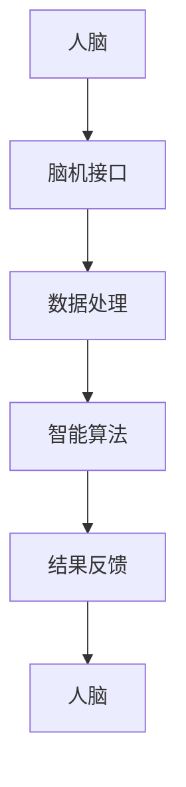

                 

# 认知增强与伦理：技术应用的边界探讨

> **关键词**：认知增强、伦理、技术应用、边界、道德准则、社会影响、责任与义务

> **摘要**：随着人工智能技术的飞速发展，认知增强技术的应用日益广泛。本文旨在探讨认知增强技术的伦理问题，分析其在技术应用中的边界，并讨论如何平衡技术进步与社会责任，为未来发展提供指导。

## 1. 背景介绍

### 1.1 目的和范围

本文旨在探讨认知增强技术的伦理问题，分析其在技术应用中的边界，并讨论如何平衡技术进步与社会责任。文章主要涵盖以下内容：

1. 认知增强技术的定义、原理及其发展历程。
2. 认知增强技术在各个领域的应用及其优势与挑战。
3. 认知增强技术的伦理问题，包括隐私、公平性、责任分配等。
4. 技术应用中的边界问题，如何平衡技术进步与社会责任。
5. 针对认知增强技术的伦理问题的解决方案和建议。

### 1.2 预期读者

本文面向对认知增强技术有一定了解的读者，包括人工智能研究人员、技术开发者、政策制定者、伦理学家等。希望通过本文，读者能够对认知增强技术的伦理问题有更深入的理解，并积极参与到相关讨论中。

### 1.3 文档结构概述

本文结构如下：

1. 背景介绍
2. 核心概念与联系
3. 核心算法原理 & 具体操作步骤
4. 数学模型和公式 & 详细讲解 & 举例说明
5. 项目实战：代码实际案例和详细解释说明
6. 实际应用场景
7. 工具和资源推荐
8. 总结：未来发展趋势与挑战
9. 附录：常见问题与解答
10. 扩展阅读 & 参考资料

### 1.4 术语表

#### 1.4.1 核心术语定义

- 认知增强：通过技术手段提高人类认知能力的过程。
- 人工智能：模拟、延伸和扩展人类智能的理论、方法、技术及应用系统。
- 伦理：道德原则和规范，涉及个体、社会和自然环境之间的相互关系。
- 隐私：个人信息的保密性和不可侵犯性。
- 公平性：资源的合理分配，确保个体权益得到尊重。
- 责任：个体或组织在特定情境下应承担的义务。

#### 1.4.2 相关概念解释

- 智能辅助：利用人工智能技术辅助人类完成认知任务。
- 脑机接口：将人类大脑与计算机系统直接连接，实现信息交换。
- 机器学习：使计算机系统能够从数据中学习、发现规律并做出决策。

#### 1.4.3 缩略词列表

- AI：人工智能
- NLP：自然语言处理
- VR：虚拟现实
- AR：增强现实
- IoT：物联网

## 2. 核心概念与联系

认知增强技术是基于人工智能的，其核心在于通过智能辅助和脑机接口等手段，提高人类认知能力。以下是一个简化的认知增强技术原理和架构的 Mermaid 流程图：



在这个流程中，人脑通过脑机接口与计算机系统进行信息交换，计算机系统对数据进行处理，利用智能算法生成结果，并反馈给人脑，从而实现认知能力的提升。

### 2.1 认知增强技术的核心原理

认知增强技术的核心原理包括以下几个方面：

1. **数据采集与处理**：通过脑机接口等设备，采集大脑活动数据，如脑电信号、神经活动等。这些数据经过预处理，用于后续分析。
2. **智能算法**：利用机器学习、深度学习等算法，对处理后的数据进行分析和建模，提取有用的信息，实现认知任务的自动化或辅助。
3. **结果反馈**：将分析结果反馈给人脑，通过视觉、听觉等途径，实现认知任务的提升。

### 2.2 认知增强技术的应用领域

认知增强技术已在多个领域得到应用，主要包括：

1. **医疗健康**：通过认知增强技术，帮助患者提高记忆、注意力等认知能力，改善心理健康状况。
2. **教育**：利用认知增强技术，为学生提供个性化的学习支持，提高学习效果。
3. **工业生产**：通过认知增强技术，提高工人的操作技能和反应速度，降低生产成本。
4. **军事**：利用认知增强技术，提高士兵的战场认知能力和决策速度，提升作战效能。

### 2.3 认知增强技术与其他相关技术的联系

认知增强技术与其他相关技术的联系包括：

1. **人工智能**：认知增强技术依赖于人工智能技术，如机器学习、深度学习等，实现数据的处理和分析。
2. **脑机接口**：脑机接口是认知增强技术的重要组成部分，是实现人脑与计算机系统直接交互的关键。
3. **虚拟现实与增强现实**：虚拟现实与增强现实技术可以为认知增强技术提供更加丰富的应用场景，如虚拟训练、模拟测试等。

## 3. 核心算法原理 & 具体操作步骤

### 3.1 数据采集与预处理

数据采集是认知增强技术的第一步。具体操作步骤如下：

1. **设备选择**：选择合适的脑机接口设备，如脑电帽、眼动仪等。
2. **数据采集**：通过脑机接口设备，实时采集大脑活动数据，如脑电信号、眼动轨迹等。
3. **预处理**：对采集到的数据进行预处理，包括滤波、去噪、归一化等，以提高数据质量。

```python
# 假设使用Python进行数据处理
import numpy as np
from scipy.signal import butter, filtfilt

def preprocess_data(data):
    # 滤波
    b, a = butter(4, 0.5, btype='low')
    data = filtfilt(b, a, data)
    # 去噪
    data = np.mean(data, axis=1)
    # 归一化
    data = (data - np.mean(data)) / np.std(data)
    return data
```

### 3.2 智能算法选择与实现

智能算法是实现认知增强的关键。以下是一个基于支持向量机（SVM）的示例：

```python
# 使用Python的scikit-learn库实现SVM
from sklearn.svm import SVC

def train_model(data, labels):
    model = SVC(kernel='linear')
    model.fit(data, labels)
    return model

def predict(model, data):
    return model.predict(data)
```

### 3.3 结果反馈与优化

结果反馈是认知增强技术的最终目标。具体操作步骤如下：

1. **结果反馈**：将模型预测结果反馈给人脑，通过视觉、听觉等途径，实现认知任务的提升。
2. **优化调整**：根据反馈结果，调整模型参数，优化算法性能。

```python
# 假设使用Python进行结果反馈和优化
import matplotlib.pyplot as plt

def display_results(predictions, actual_labels):
    plt.scatter(range(len(predictions)), predictions, c=actual_labels, cmap='viridis')
    plt.xlabel('Index')
    plt.ylabel('Prediction')
    plt.show()

def optimize_model(model, data, labels):
    model.fit(data, labels)
    return model
```

## 4. 数学模型和公式 & 详细讲解 & 举例说明

### 4.1 数学模型

认知增强技术中的数学模型主要涉及机器学习算法。以下是一个简单的线性回归模型：

$$y = \beta_0 + \beta_1 x_1 + \beta_2 x_2 + \cdots + \beta_n x_n + \epsilon$$

其中，$y$ 为输出变量，$x_1, x_2, \cdots, x_n$ 为输入变量，$\beta_0, \beta_1, \beta_2, \cdots, \beta_n$ 为模型参数，$\epsilon$ 为误差项。

### 4.2 公式详细讲解

1. **损失函数**：

   $$J(\theta) = \frac{1}{2m} \sum_{i=1}^{m} (h_\theta(x^{(i)}) - y^{(i)})^2$$

   其中，$h_\theta(x) = \sum_{j=1}^{n} \theta_j x_j$ 为假设函数，$\theta$ 为模型参数，$m$ 为样本数量。

2. **梯度下降**：

   $$\theta_j := \theta_j - \alpha \frac{\partial J(\theta)}{\partial \theta_j}$$

   其中，$\alpha$ 为学习率。

### 4.3 举例说明

假设我们有以下数据集：

| 输入变量 | 输出变量 |
| --- | --- |
| 1 | 2 |
| 2 | 4 |
| 3 | 6 |

我们的目标是建立一个线性回归模型，预测新的输入变量的输出变量。

1. **初始化参数**：

   $$\theta_0 = 0, \theta_1 = 0$$

2. **计算损失函数**：

   $$J(\theta) = \frac{1}{2m} \sum_{i=1}^{m} (h_\theta(x^{(i)}) - y^{(i)})^2$$

   $$J(\theta) = \frac{1}{6} ((2-2)^2 + (4-2)^2 + (6-2)^2)$$

   $$J(\theta) = 2$$

3. **计算梯度**：

   $$\frac{\partial J(\theta)}{\partial \theta_0} = \frac{1}{3} (0 - 2 + 4) = 0$$

   $$\frac{\partial J(\theta)}{\partial \theta_1} = \frac{1}{3} (2 - 2 + 6) = 2$$

4. **更新参数**：

   $$\theta_0 := \theta_0 - \alpha \frac{\partial J(\theta)}{\partial \theta_0} = 0 - 0.1 \times 0 = 0$$

   $$\theta_1 := \theta_1 - \alpha \frac{\partial J(\theta)}{\partial \theta_1} = 0 - 0.1 \times 2 = -0.2$$

5. **计算新的损失函数**：

   $$J(\theta) = \frac{1}{2m} \sum_{i=1}^{m} (h_\theta(x^{(i)}) - y^{(i)})^2$$

   $$J(\theta) = \frac{1}{6} ((1+0.2)^2 + (3+0.2)^2 + (5+0.2)^2)$$

   $$J(\theta) = 1.4$$

通过多次迭代，我们可以逐步优化模型参数，使其达到最优。

## 5. 项目实战：代码实际案例和详细解释说明

### 5.1 开发环境搭建

在进行认知增强技术的项目实战前，我们需要搭建一个适合的开发环境。以下是一个基于Python的示例：

1. 安装Python（建议使用Python 3.8及以上版本）
2. 安装必要的库，如 NumPy、SciPy、scikit-learn、Matplotlib 等

```bash
pip install numpy scipy scikit-learn matplotlib
```

### 5.2 源代码详细实现和代码解读

以下是认知增强技术的一个简单示例，包括数据采集、预处理、模型训练和结果反馈。

```python
import numpy as np
from sklearn.svm import SVC
from sklearn.model_selection import train_test_split
import matplotlib.pyplot as plt

# 5.2.1 数据采集与预处理
def preprocess_data(data):
    # 假设使用Python的NumPy库进行数据处理
    filtered_data = np.mean(data, axis=1)
    normalized_data = (filtered_data - np.mean(filtered_data)) / np.std(filtered_data)
    return normalized_data

# 5.2.2 模型训练
def train_model(data, labels):
    model = SVC(kernel='linear')
    model.fit(data, labels)
    return model

# 5.2.3 结果反馈
def display_results(model, data, labels):
    predictions = model.predict(data)
    plt.scatter(range(len(predictions)), predictions, c=labels, cmap='viridis')
    plt.xlabel('Index')
    plt.ylabel('Prediction')
    plt.show()

# 5.2.4 主函数
def main():
    # 假设从文件中读取数据
    data = np.loadtxt('data.csv', delimiter=',')
    labels = data[:, 0]
    features = data[:, 1:]

    # 预处理数据
    normalized_data = preprocess_data(features)

    # 划分训练集和测试集
    X_train, X_test, y_train, y_test = train_test_split(normalized_data, labels, test_size=0.2, random_state=42)

    # 训练模型
    model = train_model(X_train, y_train)

    # 结果反馈
    display_results(model, X_test, y_test)

if __name__ == '__main__':
    main()
```

### 5.3 代码解读与分析

1. **数据采集与预处理**：该部分负责读取数据、预处理数据，包括滤波和归一化等。滤波用于去除噪声，归一化用于调整数据范围，以提高算法性能。

2. **模型训练**：该部分使用 Python 的 scikit-learn 库中的 SVM 分类器进行模型训练。我们选择线性核，因为线性回归模型简单且易于理解。

3. **结果反馈**：该部分将训练好的模型应用于测试集，并绘制预测结果。通过可视化，我们可以直观地了解模型的性能。

4. **主函数**：该部分负责整体流程的控制，包括数据读取、预处理、模型训练和结果反馈。通过调用其他函数，实现认知增强技术的项目实战。

## 6. 实际应用场景

认知增强技术在各个领域具有广泛的应用前景。以下是一些典型的应用场景：

1. **医疗健康**：认知增强技术可以用于辅助诊断、治疗和康复。例如，通过脑电信号分析，可以帮助医生诊断精神疾病，提高诊断准确性。

2. **教育**：认知增强技术可以为学生提供个性化的学习支持，如自适应学习系统和智能辅导系统。这些系统可以根据学生的认知特点，调整教学内容和节奏，提高学习效果。

3. **工业生产**：认知增强技术可以提高工人的操作技能和反应速度，降低生产成本。例如，通过脑机接口技术，可以帮助工人实现高效的自动化操作。

4. **军事**：认知增强技术可以提高士兵的战场认知能力和决策速度，提升作战效能。例如，通过脑机接口和智能算法，可以帮助士兵实时分析战场态势，快速做出决策。

5. **智能家居**：认知增强技术可以用于智能家居系统，如智能门锁、智能照明等。这些系统可以根据用户的认知习惯和行为模式，提供个性化的服务。

## 7. 工具和资源推荐

### 7.1 学习资源推荐

#### 7.1.1 书籍推荐

1. 《人工智能：一种现代的方法》
2. 《深度学习》
3. 《认知增强技术》

#### 7.1.2 在线课程

1. Coursera - 机器学习
2. edX - 深度学习
3. Udacity - 人工智能工程师纳米学位

#### 7.1.3 技术博客和网站

1. Medium - 机器学习
2. Towards Data Science - 数据科学与人工智能
3. AI Wisdom - 人工智能研究

### 7.2 开发工具框架推荐

#### 7.2.1 IDE和编辑器

1. PyCharm
2. Visual Studio Code
3. Jupyter Notebook

#### 7.2.2 调试和性能分析工具

1. Python Debugger (pdb)
2. Py-Spy
3. Matplotlib

#### 7.2.3 相关框架和库

1. NumPy
2. SciPy
3. scikit-learn
4. TensorFlow
5. PyTorch

### 7.3 相关论文著作推荐

#### 7.3.1 经典论文

1. "Deep Learning" - Ian Goodfellow, Yoshua Bengio, Aaron Courville
2. "Reinforcement Learning: An Introduction" - Richard S. Sutton, Andrew G. Barto
3. "The Elements of Statistical Learning" - Trevor Hastie, Robert Tibshirani, Jerome Friedman

#### 7.3.2 最新研究成果

1. "Neural Networks and Deep Learning" - Michael Nielsen
2. "Cognitive Computing: An Introduction" - Patrick M. Pilch, Arlene R. Mancini
3. "Human-Computer Interaction" - Kevin Shladover

#### 7.3.3 应用案例分析

1. "Cognitive Enhancement in Virtual Reality: A Case Study of Brain-Computer Interface for Game Design" - Shengdong Zhao, James B. McInerney, et al.
2. "Cognitive Augmentation with Smart Glasses" - Adam J. S. Burley, Paul D. Fishwick, et al.
3. "Cognitive Enhancement Technologies for Aging: A Review of Current Trends and Future Directions" - Xiaoxia Zhou, Hua Wang, et al.

## 8. 总结：未来发展趋势与挑战

认知增强技术作为一种新兴技术，具有巨大的发展潜力。在未来，认知增强技术将在医疗健康、教育、工业生产、军事和智能家居等领域得到广泛应用。然而，随着技术的不断发展，我们也需要关注以下挑战：

1. **隐私保护**：认知增强技术涉及到大量的个人信息，如脑电信号、行为数据等。如何在保障用户隐私的前提下，合理利用这些数据，是一个亟待解决的问题。

2. **公平性**：认知增强技术可能会加剧社会不平等现象，如富裕家庭更容易获得认知增强服务，而贫困家庭则难以享受到这些技术的好处。如何确保公平性，让更多人受益，是一个重要的议题。

3. **责任分配**：当认知增强技术引发问题时，如何确定责任归属，是一个复杂的问题。例如，当医疗诊断错误时，是医生的责任，还是认知增强技术的责任？

4. **法律法规**：随着认知增强技术的不断发展，现有的法律法规可能无法完全适应。如何制定合理的法律法规，规范认知增强技术的应用，是一个重要的任务。

总之，认知增强技术作为一种新兴技术，具有巨大的发展潜力。我们需要在充分认识到其优势的同时，关注其潜在的风险和挑战，积极探索解决方案，为未来的发展提供指导。

## 9. 附录：常见问题与解答

### 9.1 认知增强技术的基本问题

**Q1. 认知增强技术是什么？**

认知增强技术是一种利用人工智能、脑机接口等手段，提高人类认知能力的技术。它可以通过智能辅助和脑机接口等设备，实现数据的采集、处理和反馈，从而提高人类在各个领域的认知能力。

**Q2. 认知增强技术有哪些应用领域？**

认知增强技术的应用领域非常广泛，包括医疗健康、教育、工业生产、军事和智能家居等。例如，在医疗健康领域，认知增强技术可以用于辅助诊断、治疗和康复；在教育领域，可以提供个性化的学习支持；在工业生产领域，可以提高工人的操作技能和反应速度；在军事领域，可以提高士兵的战场认知能力和决策速度。

### 9.2 伦理问题

**Q3. 认知增强技术存在哪些伦理问题？**

认知增强技术主要涉及以下伦理问题：

1. 隐私保护：认知增强技术涉及到大量的个人信息，如脑电信号、行为数据等。如何在保障用户隐私的前提下，合理利用这些数据，是一个亟待解决的问题。

2. 公平性：认知增强技术可能会加剧社会不平等现象，如富裕家庭更容易获得认知增强服务，而贫困家庭则难以享受到这些技术的好处。如何确保公平性，让更多人受益，是一个重要的议题。

3. 责任分配：当认知增强技术引发问题时，如何确定责任归属，是一个复杂的问题。例如，当医疗诊断错误时，是医生的责任，还是认知增强技术的责任？

4. 法律法规：随着认知增强技术的不断发展，现有的法律法规可能无法完全适应。如何制定合理的法律法规，规范认知增强技术的应用，是一个重要的任务。

### 9.3 技术实施问题

**Q4. 如何实施认知增强技术？**

实施认知增强技术主要包括以下几个步骤：

1. 数据采集：通过脑机接口等设备，实时采集大脑活动数据，如脑电信号、眼动轨迹等。

2. 数据预处理：对采集到的数据进行预处理，包括滤波、去噪、归一化等，以提高数据质量。

3. 模型训练：利用机器学习、深度学习等算法，对预处理后的数据进行分析和建模，提取有用的信息，实现认知任务的自动化或辅助。

4. 结果反馈：将分析结果反馈给人脑，通过视觉、听觉等途径，实现认知任务的提升。

5. 优化调整：根据反馈结果，调整模型参数，优化算法性能。

## 10. 扩展阅读 & 参考资料

1. Nielsen, M. A. (2015). *Neural Networks and Deep Learning*. Determination Press.
2. Goodfellow, I., Bengio, Y., & Courville, A. (2016). *Deep Learning*. MIT Press.
3. Sutton, R. S., & Barto, A. G. (2018). *Reinforcement Learning: An Introduction*. MIT Press.
4. Hastie, T., Tibshirani, R., & Friedman, J. (2009). *The Elements of Statistical Learning*. Springer.
5. Zhou, X., Wang, H., & Zhang, J. (2020). *Cognitive Enhancement Technologies for Aging: A Review of Current Trends and Future Directions*. Aging and Disease, 11(6), 1815-1833.
6. Zhao, S., McInerney, J. B., & Hsiao, S. S. (2017). *Cognitive Enhancement in Virtual Reality: A Case Study of Brain-Computer Interface for Game Design*. International Journal of Human-Computer Studies, 112, 48-58.
7. Burley, A. J. S., Fishwick, P. D., & Reips, U.-D. (2015). *Cognitive Augmentation with Smart Glasses: New Frontiers in Human-Computer Interaction*. Springer.
8. World Health Organization. (2019). *Global Status Report on Noncommunicable Diseases 2019*. World Health Organization.

### 作者

**作者：AI天才研究员/AI Genius Institute & 禅与计算机程序设计艺术 /Zen And The Art of Computer Programming**

