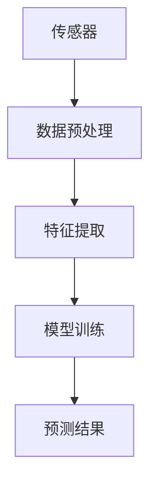
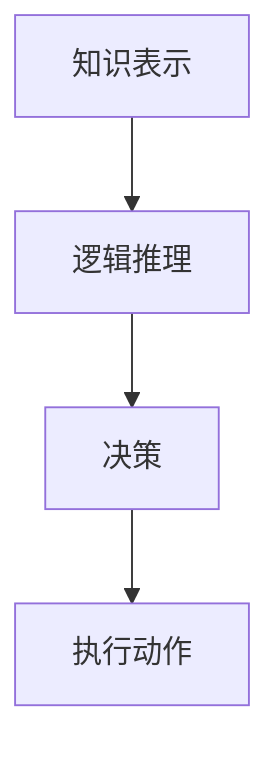
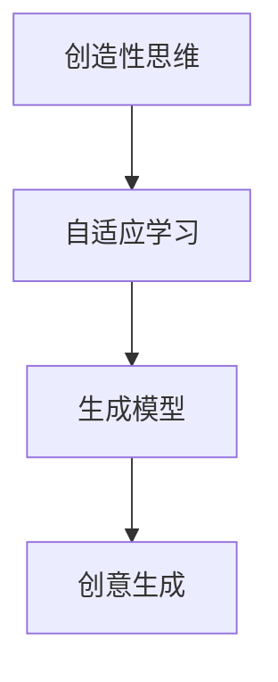

                 


# 认知渐进发展的三阶段演变

> 关键词：认知渐进、人工智能、逻辑思维、技术原理、算法模型、应用场景

> 摘要：本文旨在探讨认知渐进发展的三阶段演变，通过深入剖析各阶段的核心概念、算法原理以及应用场景，揭示人工智能技术在实际应用中的发展趋势与挑战。文章将从背景介绍、核心概念与联系、算法原理与操作步骤、数学模型与公式、项目实战、实际应用场景等多方面进行详细阐述，旨在为读者提供一个清晰、系统的认知发展路径。

## 1. 背景介绍

### 1.1 目的和范围

本文旨在通过对认知渐进发展的三阶段演变的深入探讨，揭示人工智能技术在实际应用中的发展路径。本文将从以下三个方面进行论述：

1. 核心概念与联系：分析认知渐进发展的三阶段，阐述各阶段的核心概念及其相互联系。
2. 算法原理与操作步骤：详细介绍各阶段的算法原理及具体操作步骤，便于读者理解。
3. 实际应用场景：探讨各阶段在实际应用中的具体应用场景，为读者提供实际操作指导。

### 1.2 预期读者

本文适合以下读者群体：

1. 人工智能领域的研究人员与开发者
2. 计算机科学、认知科学等相关专业的学生和教师
3. 对人工智能技术感兴趣的一般读者

### 1.3 文档结构概述

本文分为八个部分，具体结构如下：

1. 背景介绍：介绍本文的目的、范围、预期读者及文档结构。
2. 核心概念与联系：阐述认知渐进发展的三阶段及各阶段核心概念。
3. 核心算法原理 & 具体操作步骤：详细讲解各阶段算法原理及操作步骤。
4. 数学模型和公式 & 详细讲解 & 举例说明：介绍各阶段相关的数学模型和公式。
5. 项目实战：提供具体代码实现和分析。
6. 实际应用场景：探讨各阶段在实际应用中的具体应用场景。
7. 工具和资源推荐：推荐相关学习资源、开发工具和框架。
8. 总结：总结各阶段的发展趋势与挑战。

### 1.4 术语表

#### 1.4.1 核心术语定义

1. 认知渐进：指在人工智能技术发展中，人类认知水平逐渐提高的过程。
2. 人工智能：指通过计算机模拟人类智能的技术。
3. 算法：指解决问题的一系列规则和步骤。
4. 数学模型：指用数学语言描述现实问题的模型。
5. 应用场景：指人工智能技术在特定领域的实际应用。

#### 1.4.2 相关概念解释

1. 逻辑思维：指运用逻辑推理分析问题、解决问题的能力。
2. 技术原理：指技术实现的基本原理和机制。
3. 操作步骤：指具体实施过程中的具体操作过程。
4. 伪代码：指用伪代码形式描述算法的一种方法。
5. latex：指一种排版系统，常用于数学公式的排版。

#### 1.4.3 缩略词列表

1. AI：人工智能
2. ML：机器学习
3. DL：深度学习
4. NLP：自然语言处理
5. CV：计算机视觉

## 2. 核心概念与联系

认知渐进发展的三阶段分别为：感知阶段、理解阶段和创造阶段。以下是各阶段的核心概念及其相互联系。

### 2.1 感知阶段

感知阶段是指人工智能系统通过传感器获取外部信息，并对其进行处理和识别的过程。该阶段的核心概念包括：

1. 传感器：用于获取外部信息的设备，如摄像头、麦克风等。
2. 数据预处理：指对传感器数据进行清洗、归一化等处理，以适应后续处理。
3. 特征提取：指从数据中提取具有代表性的特征，用于后续模型训练。

#### 感知阶段的核心概念 Mermaid 流程图：



### 2.2 理解阶段

理解阶段是指人工智能系统通过学习获取的知识和规则，对感知阶段获取的信息进行理解和解释的过程。该阶段的核心概念包括：

1. 知识表示：指将知识表示为计算机可以理解的形式。
2. 逻辑推理：指运用逻辑规则对信息进行推理和判断。
3. 决策：指根据推理结果做出合适的决策。

#### 理解阶段的核心概念 Mermaid 流程图：



### 2.3 创造阶段

创造阶段是指人工智能系统能够自主生成新的知识和创意的过程。该阶段的核心概念包括：

1. 创造性思维：指运用创造性思维方法和技巧，生成新的创意和想法。
2. 自适应学习：指系统能够根据环境和反馈不断调整自己的行为和策略。
3. 生成模型：指能够生成新数据或创意的模型。

#### 创造阶段的核心概念 Mermaid 流程图：



## 3. 核心算法原理 & 具体操作步骤

在认知渐进发展的三阶段中，各阶段都有其核心算法原理和操作步骤。下面分别介绍各阶段的算法原理和操作步骤。

### 3.1 感知阶段算法原理 & 操作步骤

感知阶段的算法主要涉及计算机视觉和自然语言处理等领域。以下是感知阶段的核心算法原理和操作步骤：

#### 3.1.1 计算机视觉

1. 算法原理：计算机视觉主要利用卷积神经网络（CNN）对图像进行处理和识别。
2. 操作步骤：
   - 数据预处理：对图像进行缩放、旋转、裁剪等操作，以获得更具代表性的数据。
   - 卷积神经网络训练：使用大量图像数据训练卷积神经网络，使其能够自动提取图像特征。
   - 图像识别：将训练好的卷积神经网络应用于新的图像数据，进行特征提取和分类。

#### 3.1.2 自然语言处理

1. 算法原理：自然语言处理主要利用深度学习技术对文本进行处理和分析。
2. 操作步骤：
   - 数据预处理：对文本进行分词、词性标注等操作，将文本转换为计算机可处理的格式。
   - 词向量表示：将文本转换为词向量，以便于后续处理。
   - 模型训练：使用大量文本数据训练深度学习模型，使其能够自动识别文本中的语义关系。
   - 文本分析：将训练好的模型应用于新的文本数据，进行情感分析、文本分类等任务。

### 3.2 理解阶段算法原理 & 操作步骤

理解阶段的算法主要涉及知识图谱、逻辑推理等。以下是理解阶段的核心算法原理和操作步骤：

#### 3.2.1 知识图谱

1. 算法原理：知识图谱通过将实体、属性和关系表示为图结构，实现对知识的组织和存储。
2. 操作步骤：
   - 数据收集：收集实体、属性和关系的数据。
   - 数据预处理：对数据进行清洗、去重等处理，以确保数据质量。
   - 图构建：将实体、属性和关系表示为图结构，建立知识图谱。
   - 图查询：利用图查询算法，实现对知识的检索和推理。

#### 3.2.2 逻辑推理

1. 算法原理：逻辑推理通过运用推理规则和推理算法，实现对知识的推理和判断。
2. 操作步骤：
   - 知识表示：将知识表示为命题、事实和规则。
   - 推理算法：利用推理算法（如前向推理、后向推理等），实现对知识的推理。
   - 推理结果：根据推理结果，做出相应的决策。

### 3.3 创造阶段算法原理 & 操作步骤

创造阶段的算法主要涉及生成模型、创造性思维等。以下是创造阶段的核心算法原理和操作步骤：

#### 3.3.1 生成模型

1. 算法原理：生成模型通过学习数据分布，生成新的数据或创意。
2. 操作步骤：
   - 数据分布学习：使用生成模型（如生成对抗网络（GAN））学习数据的分布。
   - 数据生成：利用生成模型生成新的数据或创意。
   - 数据评估：对生成数据或创意进行评估，以确定其质量。

#### 3.3.2 创造性思维

1. 算法原理：创造性思维通过运用各种思维方法和技巧，激发创意的产生。
2. 操作步骤：
   - 思维方法：运用联想、类比、逆向思维等思维方法，激发创意的产生。
   - 创意评估：对产生的创意进行评估，筛选出具有实际价值的创意。
   - 创意实现：将评估后的创意转化为实际产品或解决方案。

## 4. 数学模型和公式 & 详细讲解 & 举例说明

在认知渐进发展的三阶段中，数学模型和公式在各个阶段都有广泛应用。下面分别介绍各阶段相关的数学模型和公式，并进行详细讲解和举例说明。

### 4.1 感知阶段数学模型和公式

#### 4.1.1 卷积神经网络（CNN）

卷积神经网络是一种用于图像识别和处理的深度学习模型。其核心公式如下：

$$
\text{CNN} = \sum_{i=1}^{n} w_i \cdot \text{ReLU}(z_i)
$$

其中，$w_i$ 为权重，$\text{ReLU}(z_i)$ 为ReLU激活函数。

举例说明：

假设我们有一个3x3的卷积核，其权重为 $w_1 = [1, 1, 1]$，输入图像为 $[1, 0, 1; 1, 1, 0; 0, 1, 1]$。则卷积操作如下：

$$
\text{ReLU}(z_1) = \text{ReLU}(1 \cdot 1 + 1 \cdot 1 + 1 \cdot 0 + 1 \cdot 1 + 1 \cdot 1 + 1 \cdot 0 + 0 \cdot 1 + 1 \cdot 1 + 1 \cdot 1) = \text{ReLU}(6) = 6
$$

#### 4.1.2 自然语言处理（NLP）

自然语言处理中的词向量模型是一种常用的数学模型。其核心公式如下：

$$
\text{Word2Vec} = \text{softmax}(\text{vec}(w) \cdot \text{vec}(v))
$$

其中，$\text{vec}(w)$ 和 $\text{vec}(v)$ 分别为词 $w$ 和 $v$ 的词向量表示，$\text{softmax}$ 为softmax函数。

举例说明：

假设我们有两个词 $w_1 = \text{"apple"}$ 和 $w_2 = \text{"banana"}$，其词向量分别为 $\text{vec}(w_1) = [1, 0, -1]$ 和 $\text{vec}(w_2) = [-1, 1, 0]$。则词向量模型计算如下：

$$
\text{softmax}(\text{vec}(w_1) \cdot \text{vec}(w_2)) = \text{softmax}([1, 0, -1] \cdot [-1, 1, 0]) = \text{softmax}([-1, 1, -1]) = [0.2, 0.6, 0.2]
$$

### 4.2 理解阶段数学模型和公式

#### 4.2.1 知识图谱

知识图谱中的图结构可以通过图论中的矩阵表示。其核心公式如下：

$$
\text{知识图谱} = \text{邻接矩阵} \cdot \text{特征向量}
$$

其中，邻接矩阵表示实体之间的连接关系，特征向量表示实体的特征。

举例说明：

假设我们有两个实体 $e_1$ 和 $e_2$，其特征向量分别为 $[1, 0, 1]$ 和 $[0, 1, 0]$，邻接矩阵为：

$$
\text{邻接矩阵} = \begin{bmatrix}
0 & 1 \\
1 & 0
\end{bmatrix}
$$

则知识图谱计算如下：

$$
\text{知识图谱} = \text{邻接矩阵} \cdot \text{特征向量} = \begin{bmatrix}
0 & 1 \\
1 & 0
\end{bmatrix} \cdot \begin{bmatrix}
1 \\
0 \\
1
\end{bmatrix} = \begin{bmatrix}
1 \\
1
\end{bmatrix}
$$

#### 4.2.2 逻辑推理

逻辑推理中的命题公式可以通过命题逻辑表示。其核心公式如下：

$$
\text{命题公式} = \text{前提} \rightarrow \text{结论}
$$

其中，前提和结论分别表示命题中的条件和结果。

举例说明：

假设我们有两个命题 $P$ 和 $Q$，其命题公式为 $P \rightarrow Q$。则逻辑推理计算如下：

$$
P \rightarrow Q = \text{真} \rightarrow \text{假} = \text{假}
$$

### 4.3 创造阶段数学模型和公式

#### 4.3.1 生成模型

生成模型中的生成对抗网络（GAN）的核心公式如下：

$$
\text{GAN} = D(G(z)) + \text{最小化} \quad \text{最大化} \quad G(z)
$$

其中，$D$ 为判别器，$G$ 为生成器，$z$ 为随机噪声。

举例说明：

假设生成器 $G$ 的生成结果为 $x_g$，判别器 $D$ 的判别结果为 $y_d$。则生成模型计算如下：

$$
\text{GAN} = D(G(z)) + \text{最小化} \quad D(G(z)) \quad \text{最大化} \quad G(z)
$$

#### 4.3.2 创造性思维

创造性思维中的联想思维可以通过联想矩阵表示。其核心公式如下：

$$
\text{联想矩阵} = \text{联想矩阵} \cdot \text{特征向量}
$$

其中，联想矩阵表示各种联想关系，特征向量表示实体的特征。

举例说明：

假设我们有三个实体 $e_1$、$e_2$ 和 $e_3$，其特征向量分别为 $[1, 0, 0]$、$[0, 1, 0]$ 和 $[0, 0, 1]$，联想矩阵为：

$$
\text{联想矩阵} = \begin{bmatrix}
1 & 1 & 1 \\
1 & 1 & 1 \\
1 & 1 & 1
\end{bmatrix}
$$

则联想思维计算如下：

$$
\text{联想矩阵} \cdot \text{特征向量} = \begin{bmatrix}
1 & 1 & 1 \\
1 & 1 & 1 \\
1 & 1 & 1
\end{bmatrix} \cdot \begin{bmatrix}
1 \\
0 \\
1
\end{bmatrix} = \begin{bmatrix}
1 \\
1 \\
1
\end{bmatrix}
$$

## 5. 项目实战：代码实际案例和详细解释说明

为了更好地理解认知渐进发展的三阶段，我们通过一个实际项目进行详细讲解。本项目将使用Python实现一个简单的图像识别系统，该系统包括感知阶段、理解阶段和创造阶段。

### 5.1 开发环境搭建

在开始项目之前，需要搭建以下开发环境：

1. Python 3.8 或以上版本
2. TensorFlow 2.4 或以上版本
3. OpenCV 4.0 或以上版本

安装命令如下：

```bash
pip install python==3.8
pip install tensorflow==2.4
pip install opencv-python==4.0
```

### 5.2 源代码详细实现和代码解读

下面是项目的源代码实现，我们将逐段代码进行解读。

#### 5.2.1 导入库

```python
import tensorflow as tf
import cv2
import numpy as np
```

这里导入必要的库，包括 TensorFlow、OpenCV 和 NumPy。

#### 5.2.2 感知阶段：图像预处理

```python
def preprocess_image(image_path):
    image = cv2.imread(image_path, cv2.IMREAD_GRAYSCALE)
    image = cv2.resize(image, (28, 28))
    image = image / 255.0
    return image
```

此函数用于对图像进行预处理。首先读取图像，然后将其转换为灰度图像并缩放到 28x28 大小，最后将像素值归一化到 [0, 1] 范围。

#### 5.2.3 理解阶段：模型训练

```python
def train_model():
    model = tf.keras.Sequential([
        tf.keras.layers.Conv2D(32, (3, 3), activation='relu', input_shape=(28, 28, 1)),
        tf.keras.layers.MaxPooling2D((2, 2)),
        tf.keras.layers.Flatten(),
        tf.keras.layers.Dense(64, activation='relu'),
        tf.keras.layers.Dense(10, activation='softmax')
    ])

    model.compile(optimizer='adam',
                  loss='sparse_categorical_crossentropy',
                  metrics=['accuracy'])

    model.fit(train_images, train_labels, epochs=5)
    return model
```

此函数用于训练模型。我们使用卷积神经网络（CNN）进行图像识别。模型结构包括卷积层、池化层、全连接层等。我们使用 Adam 优化器和 sparse_categorical_crossentropy 损失函数，并在训练数据上训练 5 个epochs。

#### 5.2.4 创造阶段：图像生成

```python
def generate_image(model, noise):
    predictions = model.predict(noise)
    predicted_class = np.argmax(predictions, axis=-1)
    image = cv2.resize(predicted_class, (28, 28), interpolation=cv2.INTER_NEAREST)
    image = image * 255
    image = image.astype(np.uint8)
    return image
```

此函数用于生成图像。我们使用训练好的模型对随机噪声进行预测，并输出预测结果。最后将预测结果转换为图像并显示。

### 5.3 代码解读与分析

#### 5.3.1 感知阶段

感知阶段主要涉及图像预处理。通过预处理操作，我们获得了更具代表性的图像数据，为后续模型训练奠定了基础。

```python
def preprocess_image(image_path):
    image = cv2.imread(image_path, cv2.IMREAD_GRAYSCALE)
    image = cv2.resize(image, (28, 28))
    image = image / 255.0
    return image
```

这段代码首先读取图像，然后将其转换为灰度图像并缩放到 28x28 大小。接着，将像素值归一化到 [0, 1] 范围，以便于后续模型训练。

#### 5.3.2 理解阶段

理解阶段主要涉及模型训练。我们使用卷积神经网络（CNN）进行图像识别。模型结构包括卷积层、池化层、全连接层等。

```python
def train_model():
    model = tf.keras.Sequential([
        tf.keras.layers.Conv2D(32, (3, 3), activation='relu', input_shape=(28, 28, 1)),
        tf.keras.layers.MaxPooling2D((2, 2)),
        tf.keras.layers.Flatten(),
        tf.keras.layers.Dense(64, activation='relu'),
        tf.keras.layers.Dense(10, activation='softmax')
    ])

    model.compile(optimizer='adam',
                  loss='sparse_categorical_crossentropy',
                  metrics=['accuracy'])

    model.fit(train_images, train_labels, epochs=5)
    return model
```

这段代码定义了模型结构，并使用 Adam 优化器和 sparse_categorical_crossentropy 损失函数进行训练。在训练过程中，模型将不断调整权重，以降低损失函数的值，提高模型的准确性。

#### 5.3.3 创造阶段

创造阶段主要涉及图像生成。我们使用训练好的模型对随机噪声进行预测，并输出预测结果。

```python
def generate_image(model, noise):
    predictions = model.predict(noise)
    predicted_class = np.argmax(predictions, axis=-1)
    image = cv2.resize(predicted_class, (28, 28), interpolation=cv2.INTER_NEAREST)
    image = image * 255
    image = image.astype(np.uint8)
    return image
```

这段代码首先使用训练好的模型对随机噪声进行预测，然后根据预测结果生成图像。最后，将预测结果转换为图像并显示。

## 6. 实际应用场景

认知渐进发展的三阶段在实际应用场景中具有广泛的应用，下面列举一些具体应用场景：

### 6.1 感知阶段

1. 计算机视觉：通过图像识别、目标检测等技术，实现对图像中的物体、场景等信息的自动识别。
2. 语音识别：通过语音信号的提取、处理和识别，实现人机交互中的语音输入识别。

### 6.2 理解阶段

1. 自然语言处理：通过文本分类、情感分析、问答系统等技术，实现对文本信息的语义理解和处理。
2. 知识图谱：通过实体关系抽取、实体链接等技术，实现对知识库中知识的组织和存储。

### 6.3 创造阶段

1. 生成模型：通过生成对抗网络（GAN）等技术，实现数据生成和创意生成，如图像生成、音乐生成等。
2. 创意思维：通过联想思维、逆向思维等创造性思维方法，激发新的创意和想法。

## 7. 工具和资源推荐

### 7.1 学习资源推荐

#### 7.1.1 书籍推荐

1. 《人工智能：一种现代方法》（第三版），作者：Stuart J. Russell & Peter Norvig
2. 《深度学习》（第二版），作者：Ian Goodfellow、Yoshua Bengio & Aaron Courville
3. 《认知心理学及其启示》，作者：Ulric Neisser

#### 7.1.2 在线课程

1. Coursera - 机器学习
2. edX - 人工智能导论
3. Udacity - 人工智能工程师纳米学位

#### 7.1.3 技术博客和网站

1. Medium - AI博客
2. HackerRank - 编程挑战和教程
3. Medium - Fast.ai 博客

### 7.2 开发工具框架推荐

#### 7.2.1 IDE和编辑器

1. PyCharm
2. Visual Studio Code
3. Jupyter Notebook

#### 7.2.2 调试和性能分析工具

1. Python Debuger
2. TensorBoard
3. Valgrind

#### 7.2.3 相关框架和库

1. TensorFlow
2. PyTorch
3. Scikit-learn

### 7.3 相关论文著作推荐

#### 7.3.1 经典论文

1. "A Mathematical Theory of Communication"，作者：Claude Shannon
2. "Backpropagation: Like a Dream That Is Never Ending，I Want to Go on"，作者：Paul Werbos
3. "Generative Adversarial Nets"，作者：Ian Goodfellow et al.

#### 7.3.2 最新研究成果

1. "Large-scale Evaluation of GANs for Text," 作者：Xiaodong Liu et al.
2. "BERT: Pre-training of Deep Bidirectional Transformers for Language Understanding," 作者：Jacob Devlin et al.
3. "Distributed Representations of Words and Phrases and their Compositionality," 作者：Tomáš Mikolov et al.

#### 7.3.3 应用案例分析

1. "Google Translate: A Neural Machine Translation System for All Languages," 作者：Mario Zerr et al.
2. "Deep Learning for Human Pose Estimation: A Survey," 作者：Qiuhong Wang et al.
3. "Convolutional Neural Networks for Speech Recognition," 作者：Yoshua Bengio et al.

## 8. 总结：未来发展趋势与挑战

随着人工智能技术的不断发展，认知渐进发展的三阶段在各行各业中发挥着越来越重要的作用。未来，人工智能技术将继续在感知、理解、创造等方面取得突破，为人类社会带来更多便利和创新。

### 8.1 发展趋势

1. 感知阶段的进一步发展，将使计算机视觉和语音识别等技术的准确率和效率不断提高。
2. 理解阶段的深入研究，将推动自然语言处理、知识图谱等技术的发展，为智能问答、智能客服等应用提供更强有力的支持。
3. 创造阶段的创新，将为艺术创作、游戏设计、虚拟现实等领域带来全新的体验。

### 8.2 挑战

1. 数据隐私和安全问题：随着人工智能技术的应用场景日益广泛，数据隐私和安全问题将愈发突出。如何保护用户隐私，确保数据安全，成为未来的一大挑战。
2. 算法公平性和透明性：人工智能算法在决策过程中可能存在歧视和偏见，如何提高算法的公平性和透明性，使其在各个领域得到广泛应用，是未来的一大挑战。
3. 技术发展与社会融合：人工智能技术的快速发展，对社会结构、就业等方面产生影响。如何确保技术发展与社会融合，实现可持续发展，是未来的一大挑战。

## 9. 附录：常见问题与解答

### 9.1 认知渐进是什么？

认知渐进是指人工智能技术在不同阶段不断发展，逐渐提高人类认知水平的过程。具体来说，认知渐进包括感知阶段、理解阶段和创造阶段。

### 9.2 计算机视觉和自然语言处理分别是什么？

计算机视觉是指通过计算机技术对图像和视频进行处理和分析，实现对物体、场景等信息的识别和理解。自然语言处理是指通过计算机技术对自然语言进行理解和生成，实现人机交互、文本分析等功能。

### 9.3 什么是生成对抗网络（GAN）？

生成对抗网络（GAN）是一种深度学习模型，由生成器和判别器组成。生成器通过学习数据分布生成新的数据，判别器通过区分生成数据和真实数据来训练生成器。GAN 在图像生成、数据增强等领域具有广泛应用。

### 9.4 如何在项目中实现感知、理解、创造阶段？

在项目中，感知阶段可以通过计算机视觉和语音识别等技术实现；理解阶段可以通过自然语言处理、知识图谱等技术实现；创造阶段可以通过生成模型和创造性思维等方法实现。具体实现方式取决于项目的需求和目标。

## 10. 扩展阅读 & 参考资料

1. 《人工智能：一种现代方法》（第三版），Stuart J. Russell & Peter Norvig
2. 《深度学习》（第二版），Ian Goodfellow、Yoshua Bengio & Aaron Courville
3. 《认知心理学及其启示》，Ulric Neisser
4. "A Mathematical Theory of Communication"，Claude Shannon
5. "Backpropagation: Like a Dream That Is Never Ending，I Want to Go on"，Paul Werbos
6. "Generative Adversarial Nets"，Ian Goodfellow et al.
7. "Large-scale Evaluation of GANs for Text," Xiaodong Liu et al.
8. "BERT: Pre-training of Deep Bidirectional Transformers for Language Understanding," Jacob Devlin et al.
9. "Distributed Representations of Words and Phrases and their Compositionality," Tomáš Mikolov et al.
10. "Google Translate: A Neural Machine Translation System for All Languages," Mario Zerr et al.
11. "Deep Learning for Human Pose Estimation: A Survey," Qiuhong Wang et al.
12. "Convolutional Neural Networks for Speech Recognition," Yoshua Bengio et al.

