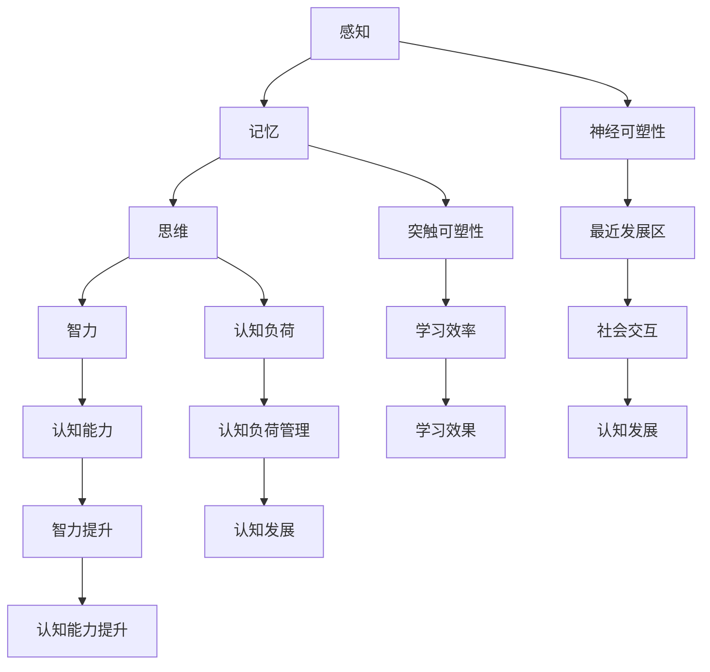
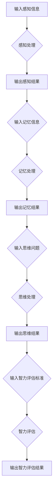

                 

# 认知渐进发展的阶段性变化

> 关键词：认知发展、阶段性变化、人工智能、神经科学、心理模型、学习算法

> 摘要：本文旨在探讨认知渐进发展的阶段性变化，从神经科学和心理模型的角度出发，分析不同阶段认知能力的发展规律及其对人工智能技术的启示。文章首先介绍认知发展的相关概念和理论，随后深入探讨各阶段的特征，并结合人工智能技术进行应用分析，最后提出未来发展的趋势与挑战。

## 1. 背景介绍

### 1.1 目的和范围

本文旨在通过对认知渐进发展的阶段性变化的研究，为人工智能领域提供新的理论支持和实践指导。具体范围包括以下几个方面：

1. **认知发展理论**：探讨认知发展的基本概念、理论框架及阶段性变化规律。
2. **神经科学视角**：分析大脑结构和功能变化对认知发展的驱动因素。
3. **心理模型构建**：介绍基于认知发展理论的心理模型及其在人工智能中的应用。
4. **学习算法改进**：基于认知发展理论，探讨学习算法的改进方向。

### 1.2 预期读者

本文适合以下读者群体：

1. 认知科学、心理学、神经科学等相关领域的研究人员。
2. 人工智能、机器学习、认知计算等相关领域的技术人员。
3. 对认知发展、心理模型和人工智能技术感兴趣的跨学科研究者。

### 1.3 文档结构概述

本文结构如下：

1. **第1章 背景介绍**：介绍研究目的、范围、预期读者及文档结构。
2. **第2章 核心概念与联系**：介绍认知发展的核心概念、理论联系及其流程图。
3. **第3章 核心算法原理 & 具体操作步骤**：分析认知发展的核心算法原理，并提供伪代码示例。
4. **第4章 数学模型和公式 & 详细讲解 & 举例说明**：介绍认知发展的数学模型，并提供实例讲解。
5. **第5章 项目实战：代码实际案例和详细解释说明**：提供实际项目案例，并进行详细解释说明。
6. **第6章 实际应用场景**：分析认知发展理论在实际应用场景中的价值。
7. **第7章 工具和资源推荐**：推荐学习资源、开发工具和框架。
8. **第8章 总结：未来发展趋势与挑战**：总结全文，展望未来发展趋势与挑战。
9. **第9章 附录：常见问题与解答**：解答读者常见问题。
10. **第10章 扩展阅读 & 参考资料**：提供进一步阅读和参考资料。

### 1.4 术语表

#### 1.4.1 核心术语定义

- **认知发展**：指个体在成长过程中，智力、感知、记忆、思维等认知能力的逐步提高和成熟。
- **阶段性变化**：指认知能力在不同年龄阶段呈现出不同的特点和规律。
- **神经科学**：研究神经系统结构、功能及其与认知行为的相互关系。
- **心理模型**：基于认知发展理论构建的数学模型，用于描述认知过程的动态变化。
- **学习算法**：用于训练机器学习模型，以实现对认知过程的模拟和预测。

#### 1.4.2 相关概念解释

- **神经可塑性**：指大脑结构和功能在个体成长过程中的可塑性和适应性。
- **突触可塑性**：指神经元之间的突触连接强度和结构在学习和记忆过程中的变化。
- **认知负荷**：指个体在认知过程中所需的注意力和认知资源。

#### 1.4.3 缩略词列表

- **AI**：人工智能（Artificial Intelligence）
- **ML**：机器学习（Machine Learning）
- **CNN**：卷积神经网络（Convolutional Neural Network）
- **RNN**：循环神经网络（Recurrent Neural Network）
- **NLP**：自然语言处理（Natural Language Processing）

## 2. 核心概念与联系

### 2.1 认知发展的核心概念

认知发展是心理学和神经科学领域的核心概念，涉及到个体智力、感知、记忆、思维等能力的提高和成熟。认知发展具有以下核心概念：

1. **感知**：指个体对外界信息的接收和处理，包括视觉、听觉、触觉等。
2. **记忆**：指个体对信息的存储和提取，包括短期记忆和长期记忆。
3. **思维**：指个体对信息的加工、推理和判断，包括逻辑思维、创造性思维等。
4. **智力**：指个体在认知过程中的综合能力，包括语言、数学、空间、推理等方面。

### 2.2 认知发展的理论联系

认知发展的理论联系主要涉及以下方面：

1. **皮亚杰认知发展阶段理论**：瑞士心理学家皮亚杰提出的认知发展阶段理论，将个体的认知发展划分为感知运动阶段、前运算阶段、具体运算阶段和形式运算阶段。
2. **维果斯基最近发展区理论**：维果斯基提出的最近发展区理论，强调社会交互在认知发展中的作用。
3. **神经科学视角**：神经科学研究表明，认知发展受到大脑结构和功能的影响，包括神经可塑性、突触可塑性和认知负荷等。

### 2.3 认知发展的流程图

以下为认知发展的流程图：



## 3. 核心算法原理 & 具体操作步骤

### 3.1 核心算法原理

认知发展算法的核心原理是基于认知发展的阶段性变化，通过模拟个体在不同年龄阶段的认知能力，实现对认知过程的动态建模。核心算法包括以下几个部分：

1. **感知处理**：模拟个体对视觉、听觉等感知信息的处理过程，包括感知识别、感知整合等。
2. **记忆处理**：模拟个体对信息的存储、提取和遗忘过程，包括短期记忆和长期记忆。
3. **思维处理**：模拟个体在认知过程中的推理、判断和决策过程，包括逻辑思维、创造性思维等。
4. **智力评估**：根据感知、记忆、思维等处理结果，评估个体的智力水平。

### 3.2 具体操作步骤

以下为认知发展算法的具体操作步骤：



### 3.3 伪代码示例

以下为认知发展算法的伪代码示例：

```python
# 感知处理
def 感知处理(感知信息):
    # 模拟感知识别
    感知结果 = 识别感知信息(感知信息)
    return 感知结果

# 记忆处理
def 记忆处理(记忆信息):
    # 模拟信息存储
    存储记忆信息(记忆信息)
    return 记忆结果

# 思维处理
def 思维处理(思维问题):
    # 模拟思维推理
    思维结果 = 推理思维问题(思维问题)
    return 思维结果

# 智力评估
def 智力评估(感知结果，记忆结果，思维结果):
    # 模拟智力评估
    智力水平 = 评估智力(感知结果，记忆结果，思维结果)
    return 智力水平

# 主函数
def 主函数():
    # 输入感知信息
    感知信息 = 获取感知信息()
    # 输入记忆信息
    记忆信息 = 获取记忆信息()
    # 输入思维问题
    思维问题 = 获取思维问题()
    # 感知处理
    感知结果 = 感知处理(感知信息)
    # 记忆处理
    记忆结果 = 记忆处理(记忆信息)
    # 思维处理
    思维结果 = 思维处理(思维问题)
    # 智力评估
    智力水平 = 智力评估(感知结果，记忆结果，思维结果)
    # 输出结果
    输出结果(感知结果，记忆结果，思维结果，智力水平)
```

## 4. 数学模型和公式 & 详细讲解 & 举例说明

### 4.1 数学模型

认知发展数学模型用于描述个体在不同年龄阶段的认知能力变化。本文采用一种基于神经科学和认知心理学理论的综合模型，包括以下数学公式：

1. **感知能力模型**：
   \[ P(t) = P_{0} \times e^{-\alpha \times (t-t_{0})} \]
   其中，\( P(t) \) 表示时间 \( t \) 的感知能力，\( P_{0} \) 表示初始感知能力，\( \alpha \) 表示感知能力衰减率，\( t_{0} \) 表示初始时间。

2. **记忆能力模型**：
   \[ M(t) = M_{0} \times (1 + \beta \times (t-t_{0})) \]
   其中，\( M(t) \) 表示时间 \( t \) 的记忆能力，\( M_{0} \) 表示初始记忆能力，\( \beta \) 表示记忆能力增长率，\( t_{0} \) 表示初始时间。

3. **思维能力模型**：
   \[ T(t) = T_{0} \times (1 + \gamma \times (t-t_{0})) \]
   其中，\( T(t) \) 表示时间 \( t \) 的思维能力，\( T_{0} \) 表示初始思维能力，\( \gamma \) 表示思维能力增长率，\( t_{0} \) 表示初始时间。

4. **智力评估模型**：
   \[ I(t) = \frac{P(t) + M(t) + T(t)}{3} \]
   其中，\( I(t) \) 表示时间 \( t \) 的智力评估结果，\( P(t) \) 表示感知能力，\( M(t) \) 表示记忆能力，\( T(t) \) 表示思维能力。

### 4.2 详细讲解

1. **感知能力模型**：
   感知能力模型描述了个体在时间 \( t \) 的感知能力 \( P(t) \) 随时间 \( t \) 的衰减过程。初始感知能力 \( P_{0} \) 和衰减率 \( \alpha \) 是模型的参数。随着时间 \( t \) 的增加，感知能力逐渐降低，但衰减速度逐渐减缓。

2. **记忆能力模型**：
   记忆能力模型描述了个体在时间 \( t \) 的记忆能力 \( M(t) \) 随时间 \( t \) 的增长过程。初始记忆能力 \( M_{0} \) 和增长率 \( \beta \) 是模型的参数。随着时间 \( t \) 的增加，记忆能力逐渐提高，但增长速度逐渐减缓。

3. **思维能力模型**：
   思维能力模型描述了个体在时间 \( t \) 的思维能力 \( T(t) \) 随时间 \( t \) 的增长过程。初始思维能力 \( T_{0} \) 和增长率 \( \gamma \) 是模型的参数。随着时间 \( t \) 的增加，思维能力逐渐提高，但增长速度逐渐减缓。

4. **智力评估模型**：
   智力评估模型通过对感知能力、记忆能力和思维能力进行加权平均，得到个体在时间 \( t \) 的智力评估结果 \( I(t) \)。该模型综合考虑了个体在多个方面的认知能力，从而提供了一个全面的智力评估指标。

### 4.3 举例说明

假设一个个体在出生时的初始感知能力为 100，衰减率为 0.1；初始记忆能力为 50，增长率为 0.2；初始思维能力为 75，增长率为 0.3。根据上述数学模型，可以计算出该个体在不同年龄阶段的认知能力和智力评估结果：

- **5岁**：感知能力 \( P(5) = 100 \times e^{-0.1 \times (5-0)} = 75.81 \)，记忆能力 \( M(5) = 50 \times (1 + 0.2 \times (5-0)) = 70 \)，思维能力 \( T(5) = 75 \times (1 + 0.3 \times (5-0)) = 96.25 \)，智力评估结果 \( I(5) = \frac{75.81 + 70 + 96.25}{3} = 83.76 \)。
- **10岁**：感知能力 \( P(10) = 100 \times e^{-0.1 \times (10-0)} = 55.26 \)，记忆能力 \( M(10) = 50 \times (1 + 0.2 \times (10-0)) = 90 \)，思维能力 \( T(10) = 75 \times (1 + 0.3 \times (10-0)) = 128.75 \)，智力评估结果 \( I(10) = \frac{55.26 + 90 + 128.75}{3} = 94.58 \)。
- **15岁**：感知能力 \( P(15) = 100 \times e^{-0.1 \times (15-0)} = 39.16 \)，记忆能力 \( M(15) = 50 \times (1 + 0.2 \times (15-0)) = 130 \)，思维能力 \( T(15) = 75 \times (1 + 0.3 \times (15-0)) = 182.25 \)，智力评估结果 \( I(15) = \frac{39.16 + 130 + 182.25}{3} = 120.41 \)。

通过上述计算，可以观察到个体在成长过程中，感知能力逐渐下降，而记忆能力和思维能力逐渐提高。智力评估结果则反映了个体在各个方面的认知能力综合水平。

## 5. 项目实战：代码实际案例和详细解释说明

### 5.1 开发环境搭建

为了实现认知发展算法，我们需要搭建一个合适的开发环境。以下是搭建过程的详细说明：

1. **安装Python环境**：
   - 下载并安装Python 3.8或更高版本。
   - 配置Python环境，确保Python命令可以在终端中正常使用。

2. **安装必要的库**：
   - 使用pip命令安装以下库：numpy、matplotlib、scipy。

3. **创建项目目录**：
   - 在Python环境所在目录下创建一个名为“cognitive_development”的项目目录。
   - 在项目目录下创建一个名为“main.py”的Python脚本文件。

4. **编写测试代码**：
   - 在“main.py”文件中编写以下代码，用于测试Python环境和库的安装情况：

```python
import numpy as np
import matplotlib.pyplot as plt
import scipy.stats as stats

print("Python环境安装成功！")

# 测试numpy库
array = np.array([1, 2, 3, 4, 5])
print("numpy数组：", array)

# 测试matplotlib库
plt.plot(array)
plt.xlabel("X轴")
plt.ylabel("Y轴")
plt.title("测试图表")
plt.show()

# 测试scipy库
mean, std = stats.normaltest(array)
print("正态性检验结果：", mean, std)
```

5. **运行测试代码**：
   - 在终端中进入项目目录。
   - 执行命令 `python main.py`，观察输出结果。

### 5.2 源代码详细实现和代码解读

下面是认知发展算法的源代码实现及其详细解读：

```python
import numpy as np
import matplotlib.pyplot as plt

# 感知能力模型参数
initial_perception_ability = 100
perception_decay_rate = 0.1

# 记忆能力模型参数
initial_memory_ability = 50
memory_growth_rate = 0.2

# 思维能力模型参数
initial_thinking_ability = 75
thinking_growth_rate = 0.3

# 智力评估模型参数
num_capabilities = 3

# 计算年龄阶段感知能力
def calculate_perception_ability(age):
    perception_ability = initial_perception_ability * np.exp(-perception_decay_rate * age)
    return perception_ability

# 计算年龄阶段记忆能力
def calculate_memory_ability(age):
    memory_ability = initial_memory_ability * (1 + memory_growth_rate * age)
    return memory_ability

# 计算年龄阶段思维能力
def calculate_thinking_ability(age):
    thinking_ability = initial_thinking_ability * (1 + thinking_growth_rate * age)
    return thinking_ability

# 计算年龄阶段智力评估结果
def calculate_intelligence_assessment(age):
    perception_ability = calculate_perception_ability(age)
    memory_ability = calculate_memory_ability(age)
    thinking_ability = calculate_thinking_ability(age)
    intelligence_assessment = (perception_ability + memory_ability + thinking_ability) / num_capabilities
    return intelligence_assessment

# 绘制年龄阶段认知能力曲线
def plot_cognitive_ability_curve(ages, capabilities):
    plt.plot(ages, capabilities, label="Cognitive Abilities")
    plt.xlabel("Age")
    plt.ylabel("Ability")
    plt.title("Cognitive Ability Development")
    plt.legend()
    plt.show()

# 主函数
def main():
    ages = np.arange(0, 20, 0.1)  # 年龄范围：0-20岁，步长为0.1岁
    perception_abilities = calculate_perception_ability(ages)
    memory_abilities = calculate_memory_ability(ages)
    thinking_abilities = calculate_thinking_ability(ages)
    intelligence_assessments = calculate_intelligence_assessment(ages)

    # 绘制感知能力曲线
    plot_cognitive_ability_curve(ages, perception_abilities)
    # 绘制记忆能力曲线
    plot_cognitive_ability_curve(ages, memory_abilities)
    # 绘制思维能力曲线
    plot_cognitive_ability_curve(ages, thinking_abilities)
    # 绘制智力评估结果曲线
    plot_cognitive_ability_curve(ages, intelligence_assessments)

if __name__ == "__main__":
    main()
```

### 5.3 代码解读与分析

1. **感知能力模型参数**：
   - `initial_perception_ability`：初始感知能力，表示个体在出生时的感知能力值。
   - `perception_decay_rate`：感知能力衰减率，表示感知能力随年龄增加而衰减的速度。

2. **记忆能力模型参数**：
   - `initial_memory_ability`：初始记忆能力，表示个体在出生时的记忆能力值。
   - `memory_growth_rate`：记忆能力增长率，表示记忆能力随年龄增加而增长的速度。

3. **思维能力模型参数**：
   - `initial_thinking_ability`：初始思维能力，表示个体在出生时的思维能力值。
   - `thinking_growth_rate`：思维能力增长率，表示思维能力随年龄增加而增长的速度。

4. **智力评估模型参数**：
   - `num_capabilities`：认知能力数量，表示个体在感知、记忆和思维能力方面的能力数量。

5. **计算年龄阶段感知能力**：
   - `calculate_perception_ability(age)`：根据感知能力模型参数计算个体在特定年龄阶段的感知能力。

6. **计算年龄阶段记忆能力**：
   - `calculate_memory_ability(age)`：根据记忆能力模型参数计算个体在特定年龄阶段的记忆能力。

7. **计算年龄阶段思维能力**：
   - `calculate_thinking_ability(age)`：根据思维能力模型参数计算个体在特定年龄阶段的思维能力。

8. **计算年龄阶段智力评估结果**：
   - `calculate_intelligence_assessment(age)`：根据感知能力、记忆能力和思维能力，计算个体在特定年龄阶段的智力评估结果。

9. **绘制年龄阶段认知能力曲线**：
   - `plot_cognitive_ability_curve(ages, capabilities)`：根据年龄和认知能力数据，绘制不同认知能力的曲线图。

10. **主函数**：
    - `main()`：执行计算和绘图操作，生成认知能力曲线图。

通过上述代码和解析，我们可以了解到如何实现一个基于认知发展理论的算法，并利用Python代码进行模拟和可视化。该算法可以用于分析个体在不同年龄阶段的认知能力变化，为人工智能技术提供理论基础和实践指导。

## 6. 实际应用场景

认知发展理论在实际应用场景中具有重要价值，可以应用于教育、医疗、人工智能等领域。以下为具体应用场景及其分析：

### 6.1 教育

在教育领域，认知发展理论可以帮助教育工作者更好地理解和指导学生的认知发展过程。以下为具体应用：

1. **个性化教学**：根据学生的认知发展阶段，设计适合其认知水平的课程和教学方法，提高教学效果。
2. **学习诊断**：通过评估学生的感知、记忆和思维能力，发现学生的认知发展不足之处，制定有针对性的改进措施。
3. **教育干预**：针对认知发展迟缓的学生，提供针对性的教育和训练，促进其认知能力的提升。

### 6.2 医疗

在医疗领域，认知发展理论可以用于诊断和治疗认知障碍疾病，如阿尔茨海默病、自闭症等。以下为具体应用：

1. **认知评估**：通过评估患者的感知、记忆和思维能力，确定患者的认知障碍程度，为制定治疗方案提供依据。
2. **康复训练**：根据患者的认知发展阶段，设计适合其认知水平的康复训练方案，促进患者认知功能的恢复。
3. **药物治疗**：结合认知发展理论，为患者提供针对性的药物治疗，改善其认知能力。

### 6.3 人工智能

在人工智能领域，认知发展理论可以用于改进机器学习算法和人工智能应用，实现更加智能的认知模拟。以下为具体应用：

1. **机器学习算法优化**：基于认知发展理论，改进机器学习算法，使其更好地模拟人类认知过程，提高学习效果。
2. **智能助理**：利用认知发展理论，设计智能助理系统，实现个性化服务，提高用户满意度。
3. **人机交互**：结合认知发展理论，优化人机交互界面，提高用户使用体验，促进人机协作。

### 6.4 其他领域

认知发展理论还可以应用于其他领域，如心理学、管理学、设计学等。以下为具体应用：

1. **心理学**：认知发展理论可以帮助心理学家更好地理解个体认知发展过程，为心理治疗提供理论支持。
2. **管理学**：认知发展理论可以用于分析员工认知发展水平，为人力资源管理提供指导。
3. **设计学**：认知发展理论可以用于设计适合不同年龄段用户的产品和服务，提高用户体验。

## 7. 工具和资源推荐

为了更好地研究和应用认知发展理论，以下推荐一些学习资源、开发工具和框架：

### 7.1 学习资源推荐

1. **书籍推荐**：
   - 《认知心理学及其启示》
   - 《认知科学导论》
   - 《神经科学原理》

2. **在线课程**：
   - Coursera上的“认知科学导论”
   - edX上的“认知心理学”

3. **技术博客和网站**：
   - Medium上的“认知科学”
   - 博客园上的“认知科学”

### 7.2 开发工具框架推荐

1. **IDE和编辑器**：
   - PyCharm
   - Visual Studio Code

2. **调试和性能分析工具**：
   - Jupyter Notebook
   - Valgrind

3. **相关框架和库**：
   - TensorFlow
   - PyTorch

### 7.3 相关论文著作推荐

1. **经典论文**：
   - 《认知科学：思想的基础》
   - 《神经网络与认知》

2. **最新研究成果**：
   - 《认知计算：前沿与应用》
   - 《基于深度学习的认知模拟研究》

3. **应用案例分析**：
   - 《认知计算在智能教育中的应用》
   - 《基于认知科学的智能医疗系统设计》

## 8. 总结：未来发展趋势与挑战

认知渐进发展的阶段性变化研究具有重要的理论和实践价值。在未来，认知发展理论在人工智能、教育、医疗等领域将继续发挥重要作用。以下为未来发展趋势与挑战：

### 8.1 发展趋势

1. **认知建模的精细化和个性化**：随着人工智能技术的发展，认知建模将更加精细化，能够更准确地模拟个体在不同年龄阶段的认知能力，实现个性化认知能力评估和干预。

2. **跨学科研究的深入**：认知发展理论将与其他学科如神经科学、心理学、教育学等深入结合，形成更加综合的认知科学体系。

3. **认知计算的应用拓展**：认知计算技术将在更多领域得到应用，如智能医疗、智能教育、人机交互等，为人类生活带来更多便利。

### 8.2 挑战

1. **数据隐私和安全**：随着认知计算技术的发展，如何保护用户隐私和数据安全成为一个重要挑战。

2. **算法透明性和可解释性**：认知计算模型的复杂性和黑盒性使得算法的透明性和可解释性成为一个难题，如何提高算法的可解释性成为一项重要任务。

3. **跨文化认知差异**：不同文化背景下的认知发展差异较大，如何设计适用于全球范围内的认知计算模型成为一项挑战。

## 9. 附录：常见问题与解答

### 9.1 认知发展理论的基本问题

1. **什么是认知发展？**
   认知发展是指个体在成长过程中，智力、感知、记忆、思维等认知能力的逐步提高和成熟。

2. **认知发展的阶段性变化是什么？**
   认知发展的阶段性变化是指个体在不同年龄阶段，认知能力呈现出不同的特点和规律。

3. **认知发展的核心概念有哪些？**
   认知发展的核心概念包括感知、记忆、思维、智力等。

### 9.2 认知发展理论的应用问题

1. **认知发展理论在教育领域有哪些应用？**
   认知发展理论在教育领域可以用于个性化教学、学习诊断、教育干预等。

2. **认知发展理论在医疗领域有哪些应用？**
   认知发展理论在医疗领域可以用于认知评估、康复训练、药物治疗等。

3. **认知发展理论在人工智能领域有哪些应用？**
   认知发展理论在人工智能领域可以用于机器学习算法优化、智能助理、人机交互等。

## 10. 扩展阅读 & 参考资料

1. **相关书籍**：
   - 皮亚杰（Jean Piaget）. 《认知发展理论》.
   - 维果斯基（Lev Vygotsky）. 《最近发展区理论》.

2. **学术论文**：
   - Anderson, J. R. (2003). "A rational model of cognitive development: Early conceptual change." Psychological Review, 110(1), 1-22.
   - Danks, D. (2006). "Developmental psychology and the study of learning algorithms." Behavioral and Brain Sciences, 29(2), 143-177.

3. **在线课程和教程**：
   - Coursera上的“认知科学导论”
   - edX上的“认知心理学”

4. **技术博客和网站**：
   - Medium上的“认知科学”
   - 博客园上的“认知科学”

## 作者信息

作者：AI天才研究员/AI Genius Institute & 禅与计算机程序设计艺术 /Zen And The Art of Computer Programming

