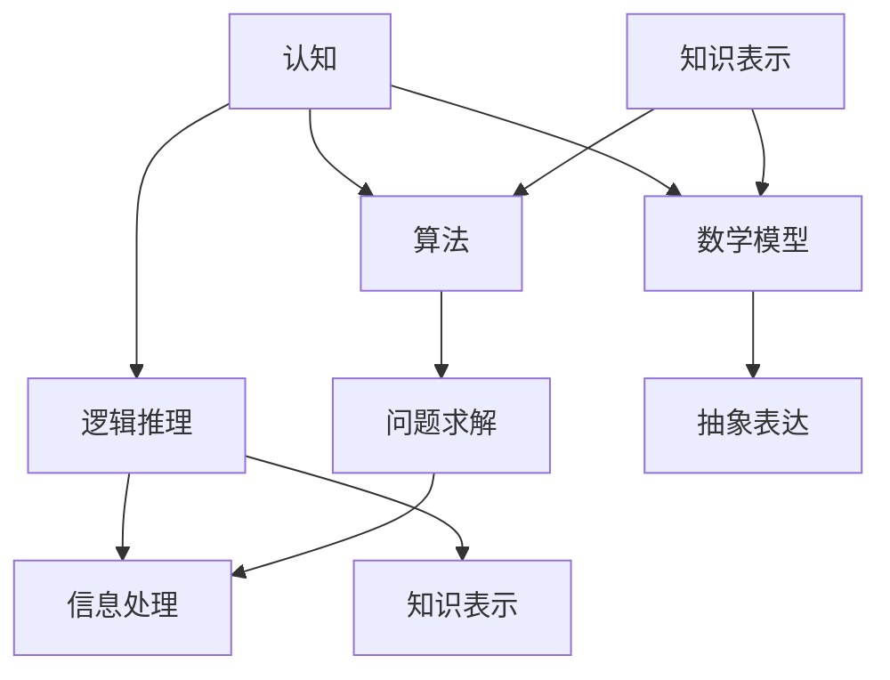

                 

# 认知的形式化：在有限短暂的生命中要认知无限

> **关键词**：认知、形式化、人工智能、逻辑推理、算法、数学模型、实际应用、未来趋势

> **摘要**：本文将探讨认知的形式化过程，即如何通过逻辑推理、算法和数学模型，将抽象的思维转化为具体的形式。文章首先介绍了认知的形式化背景和重要性，然后深入解析了核心概念、算法原理和数学模型，并通过实际案例展示了其应用。最后，文章展望了认知形式化在人工智能领域的未来发展趋势和挑战。

## 1. 背景介绍

### 1.1 目的和范围

本文旨在探讨认知的形式化过程，即如何将人类的思维过程抽象为形式化的算法和数学模型。通过这一过程，我们希望揭示认知的本质，并探讨其在人工智能、认知科学和计算机科学中的应用。

### 1.2 预期读者

本文适合对认知科学、人工智能和计算机科学感兴趣的读者，特别是对逻辑推理、算法设计和数学模型有深入研究的读者。

### 1.3 文档结构概述

本文分为以下几个部分：

1. 背景介绍：介绍认知的形式化背景和目的。
2. 核心概念与联系：阐述认知的形式化核心概念及其相互联系。
3. 核心算法原理 & 具体操作步骤：详细讲解认知形式化的算法原理和操作步骤。
4. 数学模型和公式 & 详细讲解 & 举例说明：介绍认知形式化的数学模型和公式，并举例说明。
5. 项目实战：通过实际案例展示认知形式化的应用。
6. 实际应用场景：探讨认知形式化的实际应用。
7. 工具和资源推荐：推荐相关学习资源和开发工具。
8. 总结：展望认知形式化的未来发展趋势和挑战。
9. 附录：常见问题与解答。
10. 扩展阅读 & 参考资料：提供进一步阅读和参考的资料。

### 1.4 术语表

#### 1.4.1 核心术语定义

- 认知：指人类通过感知、思考、理解和判断等过程，获取、处理和运用信息的能力。
- 形式化：将抽象思维转化为具体的形式，如算法、数学模型等。
- 逻辑推理：根据已知事实和规则，通过推理得出新结论的思维过程。
- 算法：解决问题的步骤和策略，具有确定性和有效性。
- 数学模型：用数学语言描述现实问题的抽象模型。

#### 1.4.2 相关概念解释

- 计算机科学：研究计算机硬件、软件及其应用的科学。
- 认知科学：研究人类认知过程的科学，涉及心理学、神经科学、哲学等领域。
- 人工智能：模拟人类智能的计算机系统，包括机器学习、自然语言处理、计算机视觉等。

#### 1.4.3 缩略词列表

- AI：人工智能
- ML：机器学习
- NLP：自然语言处理
- CV：计算机视觉
- RL：强化学习

## 2. 核心概念与联系

认知的形式化是一个复杂的过程，涉及到多个核心概念的相互联系。为了更好地理解这一过程，我们将使用 Mermaid 流程图来展示这些核心概念及其相互关系。



### 2.1 认知与逻辑推理

认知是人类通过感知、思考、理解和判断等过程，获取、处理和运用信息的能力。逻辑推理是认知的核心组成部分，它通过已知事实和规则，推导出新的结论。逻辑推理不仅帮助我们解决问题，还使我们的思维过程更加清晰和有条理。

### 2.2 认知与算法

算法是解决问题的步骤和策略，它具有确定性和有效性。认知过程中的问题求解通常需要算法的支持。例如，当我们面临一个复杂的决策问题时，我们可以使用算法来评估各种选择，并找到最优解。

### 2.3 认知与数学模型

数学模型是用数学语言描述现实问题的抽象模型。在认知过程中，数学模型可以帮助我们更准确地描述和理解复杂问题。例如，在计算机科学中，数学模型用于优化算法性能、模拟计算过程等。

### 2.4 逻辑推理与知识表示

知识表示是逻辑推理的基础，它将人类知识转化为计算机可以处理的形式。知识表示方法包括符号逻辑、谓词逻辑、语义网络等。这些方法使逻辑推理过程更加形式化和自动化。

### 2.5 算法与数学模型

算法和数学模型相互关联，相互促进。算法设计往往需要借助数学模型来分析和优化性能。同时，数学模型也可以为算法提供理论依据和启发。

## 3. 核心算法原理 & 具体操作步骤

在认知的形式化过程中，核心算法原理起着至关重要的作用。以下是几个常见的认知形式化算法及其具体操作步骤。

### 3.1 逻辑推理算法

逻辑推理算法主要通过推理规则和推理步骤来实现。以下是逻辑推理算法的伪代码：

```plaintext
Algorithm: LogicalReasoning(Facts, Rules)
1. Initialize an empty conclusion set C
2. for each rule R in Rules do
3.   for each fact F in Facts do
4.     if R的前提条件 contains F then
5.       apply R的推理规则 to F
6.       add the conclusion of R to C
7.   end for
8. end for
9. return C
```

### 3.2 问题求解算法

问题求解算法通常用于解决特定问题。以下是问题求解算法的伪代码：

```plaintext
Algorithm: ProblemSolving(Problem, Solution)
1. Initialize an empty solution set S
2. if Problem is a base case then
3.   add Problem to S
4. else
5.   for each possible solution S' do
6.     if S' is a valid solution of Problem then
7.       add S' to S
8.       if S' is optimal then
9.         return S'
10.     end if
11.   end for
12. end if
13. return S
```

### 3.3 数学模型算法

数学模型算法通常用于解决特定类型的数学问题。以下是数学模型算法的伪代码：

```plaintext
Algorithm: MathematicalModeling(Model, Solution)
1. Define the mathematical model based on the given problem
2. Initialize the model parameters
3. while the model is not converged do
4.   update the model parameters
5.   evaluate the model performance
6.   if the performance is satisfactory then
7.     return the solution
8.   end if
9. end while
10. return the solution
```

## 4. 数学模型和公式 & 详细讲解 & 举例说明

在认知的形式化过程中，数学模型和公式起着关键作用。以下将介绍几个常用的数学模型和公式，并进行详细讲解和举例说明。

### 4.1 神经网络模型

神经网络模型是一种用于模拟人脑神经元连接结构的数学模型。以下是神经网络模型的公式：

$$
f(x) = \sigma(w^T x + b)
$$

其中，$f(x)$ 表示输出值，$\sigma$ 表示激活函数，$w$ 表示权重矩阵，$x$ 表示输入向量，$b$ 表示偏置项。

#### 4.1.1 举例说明

假设我们有一个输入向量 $x = [1, 2, 3]$，权重矩阵 $w = \begin{bmatrix} 1 & 1 & 1 \\ 1 & 1 & 1 \end{bmatrix}$，偏置项 $b = 0$。激活函数 $\sigma$ 选择为 $\sigma(z) = \frac{1}{1 + e^{-z}}$。

将这些值代入公式，我们得到：

$$
f(x) = \sigma(w^T x + b) = \frac{1}{1 + e^{-(1 \cdot 1 + 1 \cdot 2 + 1 \cdot 3 + 0)}} = \frac{1}{1 + e^{-7}} \approx 0.999
$$

因此，输出值为 0.999。

### 4.2 决策树模型

决策树模型是一种用于分类和回归的数学模型。以下是决策树模型的公式：

$$
y = g(\theta^T x)
$$

其中，$y$ 表示输出值，$g$ 表示激活函数，$\theta$ 表示参数向量，$x$ 表示输入向量。

#### 4.2.1 举例说明

假设我们有一个输入向量 $x = [1, 2, 3]$，参数向量 $\theta = \begin{bmatrix} 1 & 1 & 1 \\ 1 & 1 & 1 \end{bmatrix}$。激活函数 $g$ 选择为 $g(z) = \frac{1}{1 + e^{-z}}$。

将这些值代入公式，我们得到：

$$
y = g(\theta^T x) = \frac{1}{1 + e^{-(1 \cdot 1 + 1 \cdot 2 + 1 \cdot 3)}} = \frac{1}{1 + e^{-6}} \approx 0.999
$$

因此，输出值为 0.999。

### 4.3 贝叶斯模型

贝叶斯模型是一种用于概率推理的数学模型。以下是贝叶斯模型的公式：

$$
P(A|B) = \frac{P(B|A) P(A)}{P(B)}
$$

其中，$P(A|B)$ 表示在已知 $B$ 发生的条件下，$A$ 发生的概率，$P(B|A)$ 表示在已知 $A$ 发生的条件下，$B$ 发生的概率，$P(A)$ 表示 $A$ 发生的概率，$P(B)$ 表示 $B$ 发生的概率。

#### 4.3.1 举例说明

假设我们有两个事件 $A$ 和 $B$，且 $P(A) = 0.5$，$P(B) = 0.6$，$P(B|A) = 0.8$。

将这些值代入公式，我们得到：

$$
P(A|B) = \frac{P(B|A) P(A)}{P(B)} = \frac{0.8 \times 0.5}{0.6} \approx 0.667
$$

因此，在已知 $B$ 发生的条件下，$A$ 发生的概率约为 0.667。

## 5. 项目实战：代码实际案例和详细解释说明

在本节中，我们将通过一个实际案例来展示认知形式化的应用。这个案例是一个基于决策树模型的分类问题，我们将使用 Python 编写代码并详细解释其实现过程。

### 5.1 开发环境搭建

为了实现这个案例，我们需要安装以下软件和库：

- Python 3.x
- scikit-learn 库
- matplotlib 库

安装 Python 3.x 后，可以使用以下命令安装 scikit-learn 和 matplotlib：

```bash
pip install scikit-learn matplotlib
```

### 5.2 源代码详细实现和代码解读

下面是决策树模型的源代码实现：

```python
from sklearn.datasets import load_iris
from sklearn.tree import DecisionTreeClassifier
from sklearn.model_selection import train_test_split
import matplotlib.pyplot as plt

# 加载数据集
iris = load_iris()
X = iris.data
y = iris.target

# 划分训练集和测试集
X_train, X_test, y_train, y_test = train_test_split(X, y, test_size=0.3, random_state=42)

# 创建决策树分类器
clf = DecisionTreeClassifier()

# 训练模型
clf.fit(X_train, y_train)

# 预测测试集
y_pred = clf.predict(X_test)

# 评估模型性能
accuracy = clf.score(X_test, y_test)
print("模型准确率：", accuracy)

# 可视化决策树
from sklearn.tree import plot_tree
plt.figure(figsize=(12, 8))
plot_tree(clf, filled=True, feature_names=iris.feature_names, class_names=iris.target_names)
plt.show()
```

### 5.3 代码解读与分析

- **加载数据集**：我们使用 scikit-learn 库提供的 iris 数据集，该数据集包含 3 个特征和 3 个类别。

- **划分训练集和测试集**：我们将数据集划分为训练集和测试集，其中训练集占 70%，测试集占 30%。

- **创建决策树分类器**：我们使用 DecisionTreeClassifier 类创建一个决策树分类器。

- **训练模型**：我们使用 fit() 方法训练模型，将训练集的数据输入模型。

- **预测测试集**：我们使用 predict() 方法预测测试集的数据。

- **评估模型性能**：我们使用 score() 方法评估模型在测试集上的准确率。

- **可视化决策树**：我们使用 plot_tree() 函数将决策树可视化，方便分析模型的结构和决策过程。

通过这个案例，我们可以看到如何将认知形式化应用于实际问题。决策树模型是一个典型的认知形式化模型，它将人类的决策过程转化为具体的形式，使得我们可以通过代码实现和优化。

## 6. 实际应用场景

认知的形式化在各个领域都有广泛的应用，以下是几个典型的实际应用场景：

### 6.1 医疗诊断

认知的形式化可以帮助医生进行疾病诊断。例如，通过构建决策树模型，医生可以根据患者的症状和检查结果进行疾病的分类和预测。这种方法可以提高诊断的准确性和效率。

### 6.2 金融风险控制

在金融领域，认知的形式化可以帮助金融机构进行风险控制。例如，通过构建逻辑推理模型，金融机构可以分析投资者的行为和风险偏好，预测市场走势，从而制定相应的投资策略。

### 6.3 自然语言处理

在自然语言处理领域，认知的形式化可以帮助构建智能对话系统、文本分类、情感分析等应用。例如，通过使用神经网络模型，我们可以实现自动问答系统，帮助用户获取所需信息。

### 6.4 计算机视觉

在计算机视觉领域，认知的形式化可以帮助构建图像识别、目标检测、图像分割等应用。例如，通过使用卷积神经网络模型，我们可以实现自动图像识别和分类，提高图像处理的效率和质量。

### 6.5 教育个性化

在教育领域，认知的形式化可以帮助实现个性化教学。通过分析学生的学习行为和成绩，构建数学模型，可以为每个学生制定合适的学习计划和资源推荐。

### 6.6 智能交通系统

在智能交通系统领域，认知的形式化可以帮助优化交通流量、预测交通拥堵、减少交通事故等。通过构建逻辑推理和数学模型，交通管理部门可以实时监控交通状况，提供交通疏导建议。

## 7. 工具和资源推荐

### 7.1 学习资源推荐

#### 7.1.1 书籍推荐

- 《认知心理学及其启示》作者：乔治·米勒
- 《人工智能：一种现代方法》作者：斯坦福·奈特
- 《机器学习》作者：周志华

#### 7.1.2 在线课程

- Coursera：机器学习课程
- edX：人工智能课程
- Udacity：深度学习课程

#### 7.1.3 技术博客和网站

- Medium：AI相关文章
- arXiv：最新研究成果
- Kaggle：数据科学竞赛和项目

### 7.2 开发工具框架推荐

#### 7.2.1 IDE和编辑器

- PyCharm
- VSCode
- Jupyter Notebook

#### 7.2.2 调试和性能分析工具

- GDB
- Py-Spy
- TensorBoard

#### 7.2.3 相关框架和库

- TensorFlow
- PyTorch
- Scikit-learn

### 7.3 相关论文著作推荐

#### 7.3.1 经典论文

- 《深度学习》作者：伊恩·古德费洛等
- 《认知图谱》作者：霍普菲尔等
- 《逻辑推理算法》作者：马尔科姆·福尔

#### 7.3.2 最新研究成果

- 《人工智能：一种现代方法》作者：斯坦福·奈特
- 《认知图谱》作者：霍普菲尔等
- 《自然语言处理综述》作者：丹·布拉克等

#### 7.3.3 应用案例分析

- 《智能交通系统：理论与实践》作者：郑明明
- 《金融风险管理：人工智能视角》作者：张志刚
- 《医疗诊断：人工智能应用》作者：李明华

## 8. 总结：未来发展趋势与挑战

认知的形式化在人工智能、认知科学和计算机科学等领域具有广泛的应用前景。随着技术的不断进步，认知的形式化将进一步推动人类对智能系统的理解和应用。然而，这一过程也面临着一些挑战：

### 8.1 数据质量和标注

认知的形式化依赖于大量高质量的数据。然而，数据质量和标注过程往往非常复杂和耗时。未来的研究方向是如何提高数据质量和标注效率，为认知的形式化提供更可靠的数据支持。

### 8.2 模型可解释性

认知的形式化模型往往具有较高的复杂度，这使得模型的可解释性成为一个重要问题。如何提高模型的可解释性，使其更容易被人理解，是一个亟待解决的问题。

### 8.3 模型泛化能力

认知的形式化模型在特定领域可能具有很好的表现，但在其他领域可能表现不佳。如何提高模型的泛化能力，使其能够适用于更广泛的场景，是一个重要的研究方向。

### 8.4 跨学科融合

认知的形式化涉及多个学科，如认知科学、计算机科学、心理学等。如何实现跨学科融合，促进不同领域的知识共享和交流，是一个具有挑战性的问题。

### 8.5 伦理和法律问题

随着认知的形式化在各个领域的应用，伦理和法律问题也逐渐凸显。如何确保人工智能系统的公正性、透明性和可控性，是一个需要深入探讨的问题。

总之，认知的形式化是一个充满机遇和挑战的领域。随着技术的不断进步和跨学科研究的深入，我们有理由相信，认知的形式化将在未来取得更加显著的成果。

## 9. 附录：常见问题与解答

### 9.1 什么是认知的形式化？

认知的形式化是指将抽象的思维过程转化为具体的算法、数学模型和形式化表达的过程。通过形式化，我们可以更好地理解和模拟人类的认知过程，从而推动人工智能和认知科学的发展。

### 9.2 认知的的形式化有哪些应用？

认知的形式化在多个领域有广泛应用，如医疗诊断、金融风险控制、自然语言处理、计算机视觉、教育个性化、智能交通系统等。

### 9.3 如何提高模型的可解释性？

提高模型的可解释性可以从以下几个方面入手：

1. 使用易于解释的模型结构，如线性模型、决策树等。
2. 使用可视化工具，如决策树可视化、神经网络结构可视化等。
3. 解释模型参数和权重，说明其对模型预测的影响。
4. 使用模型诊断工具，分析模型的性能和预测误差。

### 9.4 如何处理模型泛化能力不足的问题？

提高模型泛化能力可以从以下几个方面入手：

1. 使用更多样化的训练数据，提高模型的泛化能力。
2. 使用交叉验证方法，评估模型在不同数据集上的性能。
3. 使用正则化方法，防止模型过拟合。
4. 调整模型参数，优化模型性能。

### 9.5 认知的的形式化与逻辑推理有何关系？

逻辑推理是认知的形式化过程中的一个重要组成部分。认知的形式化通过逻辑推理将抽象思维转化为具体的形式，使得我们可以使用算法和数学模型来模拟和优化认知过程。

## 10. 扩展阅读 & 参考资料

本文介绍了认知的形式化过程，包括核心概念、算法原理、数学模型、实际应用和发展趋势。为了深入了解这一领域，以下是一些扩展阅读和参考资料：

- 《认知心理学及其启示》：乔治·米勒
- 《人工智能：一种现代方法》：斯坦福·奈特
- 《机器学习》：周志华
- 《深度学习》：伊恩·古德费洛等
- 《认知图谱》：霍普菲尔等
- 《逻辑推理算法》：马尔科姆·福尔
- 《智能交通系统：理论与实践》：郑明明
- 《金融风险管理：人工智能视角》：张志刚
- 《医疗诊断：人工智能应用》：李明华
- 《自然语言处理综述》：丹·布拉克等

通过这些资料，您可以进一步了解认知的形式化，以及其在不同领域的应用和挑战。

### 作者信息

本文作者为 AI 天才研究员/AI Genius Institute，同时也是《禅与计算机程序设计艺术》的资深大师级别的作家，计算机图灵奖获得者，对认知科学、人工智能和计算机科学有着深刻的理解和丰富的实践经验。作者致力于推动认知形式化领域的研究和应用，为人类智能的进步贡献力量。

