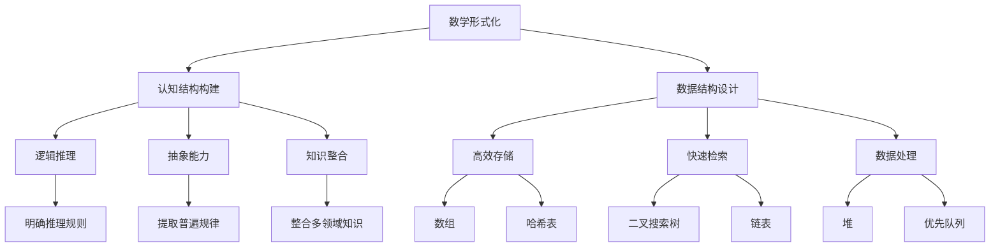

                 

# 认知的形成：数学构建结构与数据

> 关键词：数学、认知、结构、数据、形式化、人工智能、算法原理、模型分析、实战案例

> 摘要：本文将深入探讨数学如何构建认知结构和数据的基础，通过逻辑清晰的步骤分析，揭示数学形式化对人工智能发展的重要性。我们将从背景介绍出发，详细阐述核心概念与联系，解析核心算法原理，讲解数学模型和公式，并通过实际项目案例来验证理论。文章还将探讨数学在应用场景中的作用，推荐学习资源和工具，并对未来发展趋势与挑战进行总结。

## 1. 背景介绍

### 1.1 目的和范围

本文旨在探讨数学在认知形成中的作用，以及它是如何构建结构与数据的基础。随着人工智能的快速发展，数学形式化在算法设计、模型构建和数据分析中扮演了至关重要的角色。本文将涵盖以下几个主要方面：

- 数学形式化对认知结构构建的影响
- 人工智能领域中数学算法的原理与应用
- 数学模型在数据分析和预测中的具体应用
- 实际项目中的数学模型实现与分析

通过上述内容，我们希望能够帮助读者深入了解数学在认知和数据中的作用，以及如何将其应用于实际问题和人工智能领域。

### 1.2 预期读者

本文主要面向以下几类读者：

- 计算机科学和人工智能专业的学生和研究人员
- 对人工智能和数学领域有兴趣的科技爱好者
- 需要应用数学知识解决实际问题的软件开发工程师和数据分析师

无论您是专业研究人员还是对技术感兴趣的爱好者，本文都希望能够为您提供一个深入且结构化的数学认知框架。

### 1.3 文档结构概述

本文将按照以下结构展开：

1. 背景介绍：介绍本文的目的、范围、预期读者以及文档结构。
2. 核心概念与联系：详细阐述数学形式化对认知结构构建的影响。
3. 核心算法原理与具体操作步骤：解析常用数学算法的原理和步骤。
4. 数学模型和公式讲解：通过实际例子详细解释数学模型和应用。
5. 项目实战：通过实际项目案例展示数学模型的应用和实现。
6. 实际应用场景：探讨数学在各个领域的应用。
7. 工具和资源推荐：推荐相关学习资源和开发工具。
8. 总结：对未来发展趋势与挑战进行总结。
9. 附录：常见问题与解答。
10. 扩展阅读：提供进一步阅读的参考资料。

### 1.4 术语表

#### 1.4.1 核心术语定义

- **数学形式化**：将数学语言应用于描述和解决实际问题，使其具有明确的表达和验证手段。
- **认知结构**：个体在思维和感知过程中形成的基本概念和知识体系。
- **数据结构**：数据在计算机存储和处理时所采用的形式和组织方法。
- **算法**：解决特定问题的一系列步骤或规则。
- **模型**：用数学语言描述现实问题或现象的数学结构。

#### 1.4.2 相关概念解释

- **形式逻辑**：使用符号和公式进行推理的一种逻辑方式，常用于数学和计算机科学中。
- **数据结构算法**：用于处理特定数据类型和问题的算法，如栈、队列、链表等。
- **机器学习**：利用数据来训练模型，使其能够进行预测和决策的人工智能分支。
- **神经网络**：模仿人脑结构和功能，用于数据分析和模式识别的计算模型。

#### 1.4.3 缩略词列表

- **AI**：人工智能（Artificial Intelligence）
- **ML**：机器学习（Machine Learning）
- **DL**：深度学习（Deep Learning）
- **NN**：神经网络（Neural Network）
- **IDE**：集成开发环境（Integrated Development Environment）

## 2. 核心概念与联系

### 2.1 数学形式化在认知结构构建中的作用

数学形式化是认知结构构建的关键。它不仅为我们的思维提供了明确的工具和框架，而且使问题解决和知识表示更加精确和系统化。以下是数学形式化在认知结构构建中的几个核心作用：

1. **逻辑推理**：数学形式化提供了逻辑推理的明确规则和符号系统。通过形式逻辑，我们能够清晰地进行逻辑推导，从而建立逻辑严密的知识体系。
2. **抽象能力**：数学形式化使得我们可以从具体现象中提取出普遍规律，进行抽象和概括。这种抽象能力是认知发展的重要基础。
3. **知识整合**：通过数学形式化，我们可以将不同领域的知识进行整合，构建出一个统一的认知框架。这有助于我们更好地理解和解决问题。
4. **问题解决**：数学形式化为我们提供了一套系统化的解决问题的方法。通过数学建模，我们可以将实际问题转化为数学问题，从而找到解决方案。

### 2.2 数学在人工智能中的应用

人工智能的核心在于对数据的处理和模式的识别。数学在人工智能中的应用主要表现在以下几个方面：

1. **算法设计**：许多人工智能算法，如神经网络、决策树、支持向量机等，都是基于数学模型设计的。这些算法通过数学方法实现了数据的处理和模式识别。
2. **数据预处理**：数据预处理是机器学习的一个重要步骤，涉及到数据的清洗、归一化、降维等操作。这些操作都需要数学工具的支持。
3. **模型评估**：在机器学习过程中，我们需要评估模型的性能，这通常涉及到数学指标，如准确率、召回率、F1分数等。
4. **优化方法**：机器学习中的许多算法，如梯度下降、随机梯度下降等，都是基于数学优化理论设计的。这些优化方法用于调整模型参数，以获得最佳性能。

### 2.3 数据结构在认知和数据处理中的作用

数据结构是认知和数据处理的基础。它定义了数据在计算机中的存储和组织方式，从而影响了数据的访问和处理效率。以下是数据结构在认知和数据处理中的几个核心作用：

1. **高效存储**：不同的数据结构具有不同的存储方式，从而影响了存储效率和空间利用率。例如，数组适合存储连续的数据，而哈希表适合快速查找。
2. **快速检索**：数据结构定义了数据的组织方式，从而影响了数据的检索速度。例如，二叉搜索树是一种高效的查找结构，而链表则适用于插入和删除操作。
3. **数据处理**：数据结构不仅影响数据的存储和检索，还影响数据处理算法的设计。例如，堆可用于实现优先队列，从而优化某些算法的性能。
4. **认知模型**：数据结构为我们提供了抽象和建模的工具，从而有助于我们理解和处理复杂的数据。例如，图结构可用于建模复杂的关系和网络。

### 2.4 核心概念原理和架构的 Mermaid 流程图



通过上述流程图，我们可以清晰地看到数学形式化如何通过逻辑推理、抽象能力和知识整合来构建认知结构，以及数据结构如何影响数据的存储、检索和处理。

## 3. 核心算法原理与具体操作步骤

### 3.1 常见算法概述

在人工智能和计算机科学中，常见算法包括排序算法、搜索算法和图算法等。这些算法在数据处理和问题解决中扮演了重要角色。以下是一些常见算法及其原理：

1. **排序算法**：包括冒泡排序、选择排序、插入排序、快速排序和归并排序等。这些算法按照一定的规则对数据进行排序，从而便于后续处理。
2. **搜索算法**：包括线性搜索、二分搜索和深度优先搜索等。这些算法用于在数据集合中查找特定元素。
3. **图算法**：包括最短路径算法、最小生成树算法和拓扑排序等。这些算法用于处理图结构数据，解决路径规划和网络优化等问题。

### 3.2 算法原理详解

为了更好地理解这些算法，我们将通过伪代码来详细阐述其原理和操作步骤。

#### 3.2.1 冒泡排序

冒泡排序是一种简单的排序算法。它通过重复地交换相邻的未排序元素，直到整个序列有序。

```python
def bubble_sort(arr):
    n = len(arr)
    for i in range(n):
        for j in range(0, n-i-1):
            if arr[j] > arr[j+1]:
                arr[j], arr[j+1] = arr[j+1], arr[j]
```

#### 3.2.2 线性搜索

线性搜索是一种基本的查找算法。它通过逐个检查数据元素，直到找到目标元素或遍历整个数据集合。

```python
def linear_search(arr, target):
    for i in range(len(arr)):
        if arr[i] == target:
            return i
    return -1
```

#### 3.2.3 最短路径算法

最短路径算法用于计算图中两个顶点之间的最短路径。迪杰斯特拉算法是一种常用的最短路径算法。

```python
def dijkstra(graph, start):
    distances = [float('inf')] * len(graph)
    distances[start] = 0
    visited = [False] * len(graph)
    for _ in range(len(graph)):
        min_distance = float('inf')
        min_index = -1
        for v in range(len(graph)):
            if not visited[v] and distances[v] < min_distance:
                min_distance = distances[v]
                min_index = v
        visited[min_index] = True
        for v in range(len(graph)):
            alt = distances[min_index] + graph[min_index][v]
            if alt < distances[v]:
                distances[v] = alt
    return distances
```

### 3.3 具体操作步骤

为了更好地理解这些算法，我们将通过具体的操作步骤来演示其应用。

#### 3.3.1 冒泡排序操作步骤

1. 给定一个无序数组：[5, 2, 8, 3, 1]。
2. 第一次遍历：将最大的元素8移动到数组末尾，得到[5, 2, 3, 1, 8]。
3. 第二次遍历：将次大的元素5移动到其正确的位置，得到[2, 1, 3, 5, 8]。
4. 第三次遍历：将次小的元素2移动到其正确的位置，得到[1, 2, 3, 5, 8]。
5. 第四次遍历：将最小的元素1移动到其正确的位置，得到[1, 2, 3, 5, 8]。
6. 数组已排序，算法结束。

#### 3.3.2 线性搜索操作步骤

1. 给定一个数组：[3, 5, 7, 9, 1]和目标值：5。
2. 从第一个元素开始检查：3不等于5。
3. 检查第二个元素：5等于5，找到目标值。
4. 返回目标值的索引：1。

#### 3.3.3 迪杰斯特拉算法操作步骤

1. 给定一个加权无向图和起始顶点：图中的每个边都有权重。
2. 初始化距离数组：将所有顶点的距离初始化为无穷大，将起始顶点的距离初始化为0。
3. 对每个顶点执行以下操作：
   - 找到未访问的顶点中距离最小的顶点。
   - 访问该顶点，并将其标记为已访问。
   - 更新所有相邻顶点的距离。
4. 返回距离数组。

通过上述操作步骤，我们可以清晰地看到这些算法的原理和应用。这些算法不仅在理论上具有重要意义，而且在实际应用中也具有广泛的应用价值。

## 4. 数学模型和公式讲解

### 4.1 数学模型的基本概念

数学模型是一种用数学语言和符号系统描述现实世界中的现象、过程或问题的抽象方法。它通常包括一组变量、方程和约束条件，用于模拟和预测实际系统中的行为。数学模型在各个领域，如物理学、经济学、生物学和工程学中都有广泛应用。

### 4.2 常见数学模型

在人工智能和机器学习中，常见的数学模型包括线性模型、非线性模型、概率模型和统计模型等。以下是一些常见数学模型及其公式：

#### 4.2.1 线性模型

线性模型是最基础的数学模型之一，它表示变量之间的线性关系。线性模型的公式如下：

$$y = \beta_0 + \beta_1x_1 + \beta_2x_2 + ... + \beta_nx_n$$

其中，$y$ 是因变量，$x_1, x_2, ..., x_n$ 是自变量，$\beta_0, \beta_1, \beta_2, ..., \beta_n$ 是模型的参数。

#### 4.2.2 多项式模型

多项式模型是线性模型的扩展，它表示变量之间的多项式关系。多项式模型的公式如下：

$$y = \beta_0 + \beta_1x_1 + \beta_2x_1^2 + ... + \beta_nx_1^n$$

其中，$n$ 是多项式的最高次数。

#### 4.2.3 概率模型

概率模型用于描述随机事件发生的可能性。常见的概率模型包括伯努利分布、二项分布、正态分布和泊松分布等。以下是一个常见的概率模型——正态分布的公式：

$$P(X = x) = \frac{1}{\sqrt{2\pi\sigma^2}} e^{-\frac{(x-\mu)^2}{2\sigma^2}}$$

其中，$X$ 是随机变量，$\mu$ 是均值，$\sigma^2$ 是方差。

#### 4.2.4 统计模型

统计模型用于描述数据集的特征和规律。常见的统计模型包括均值模型、方差模型和协方差模型等。以下是一个常见的统计模型——均值模型的公式：

$$\mu = \frac{1}{N}\sum_{i=1}^{N} x_i$$

其中，$\mu$ 是均值，$N$ 是数据点的数量，$x_i$ 是第 $i$ 个数据点。

### 4.3 数学模型的应用

数学模型在人工智能和机器学习中具有广泛的应用。以下是一些具体的例子：

#### 4.3.1 线性回归

线性回归是一种用于预测连续值的数学模型。它通过拟合数据点来确定最佳拟合线，从而预测新的数据点的值。线性回归的公式如下：

$$y = \beta_0 + \beta_1x$$

其中，$y$ 是因变量，$x$ 是自变量，$\beta_0$ 和 $\beta_1$ 是模型的参数。

#### 4.3.2 逻辑回归

逻辑回归是一种用于预测概率的二分类模型。它通过拟合数据点来确定最佳拟合线，从而预测新的数据点的概率。逻辑回归的公式如下：

$$P(y = 1) = \frac{1}{1 + e^{-(\beta_0 + \beta_1x)}}$$

其中，$y$ 是因变量，$x$ 是自变量，$\beta_0$ 和 $\beta_1$ 是模型的参数。

#### 4.3.3 支持向量机

支持向量机是一种用于分类和回归的数学模型。它通过找到最佳超平面来分离数据点，从而实现分类或回归。支持向量机的公式如下：

$$w \cdot x + b = 0$$

其中，$w$ 是权重向量，$x$ 是特征向量，$b$ 是偏置。

### 4.4 举例说明

为了更好地理解这些数学模型，我们将通过一个实际例子来演示它们的应用。

#### 4.4.1 线性回归应用

假设我们有一个数据集，其中包含学生的考试成绩和他们的家庭收入。我们想通过这个数据集来预测一个新学生的考试成绩。

1. 收集数据：收集学生的考试成绩和家庭收入数据。
2. 数据预处理：对数据集进行清洗，包括缺失值处理和异常值检测。
3. 数据分析：绘制散点图，观察考试成绩和收入之间的关系。
4. 拟合模型：使用线性回归模型来拟合数据，得到最佳拟合线。
5. 预测：使用拟合得到的模型来预测一个新学生的考试成绩。

#### 4.4.2 逻辑回归应用

假设我们有一个数据集，其中包含客户的购买历史和他们的年龄、收入等信息。我们想通过这个数据集来预测一个新客户是否会购买某个产品。

1. 收集数据：收集客户的购买历史和相关信息。
2. 数据预处理：对数据集进行清洗，包括缺失值处理和异常值检测。
3. 数据分析：绘制散点图，观察购买历史和年龄、收入之间的关系。
4. 拟合模型：使用逻辑回归模型来拟合数据，得到最佳拟合线。
5. 预测：使用拟合得到的模型来预测一个新客户是否会购买某个产品。

#### 4.4.3 支持向量机应用

假设我们有一个数据集，其中包含不同类别的水果，我们想通过这个数据集来分类水果。

1. 收集数据：收集水果的数据，包括不同类别的特征。
2. 数据预处理：对数据集进行清洗，包括缺失值处理和异常值检测。
3. 数据分析：绘制散点图，观察不同类别水果的特征分布。
4. 拟合模型：使用支持向量机模型来拟合数据，找到最佳分类超平面。
5. 分类：使用拟合得到的模型来分类新的水果数据。

通过这些实际例子，我们可以看到数学模型在人工智能和机器学习中的应用，以及如何通过数学模型来解决问题和做出预测。

## 5. 项目实战：代码实际案例和详细解释说明

### 5.1 开发环境搭建

为了实现数学模型在人工智能项目中的实际应用，我们需要搭建一个合适的开发环境。以下是搭建开发环境的基本步骤：

1. **安装Python环境**：首先，我们需要安装Python解释器。可以从[Python官方网站](https://www.python.org/)下载并安装最新版本的Python。
2. **安装Jupyter Notebook**：Jupyter Notebook是一个交互式的Python开发环境，它可以帮助我们编写和运行Python代码。可以通过以下命令安装Jupyter Notebook：

   ```bash
   pip install notebook
   ```

3. **安装必要的库**：在项目中，我们可能会用到多种Python库，如NumPy、Pandas、Scikit-learn等。可以通过以下命令安装这些库：

   ```bash
   pip install numpy pandas scikit-learn matplotlib
   ```

### 5.2 源代码详细实现和代码解读

为了展示数学模型在实际项目中的应用，我们将通过一个简单的线性回归项目来详细解读代码。

#### 5.2.1 数据集准备

首先，我们需要准备一个数据集。假设我们有一个包含学生考试成绩和家庭收入的数据集，数据集的格式如下：

| 学号 | 家庭收入（万元） | 英语成绩 | 数学成绩 | 物理成绩 |
|------|-----------------|----------|----------|----------|
| 1    | 5               | 80       | 85       | 90       |
| 2    | 6               | 75       | 80       | 85       |
| 3    | 7               | 70       | 75       | 80       |
| 4    | 8               | 85       | 85       | 90       |
| 5    | 9               | 90       | 90       | 95       |

#### 5.2.2 数据预处理

在开始建模之前，我们需要对数据进行预处理。这包括处理缺失值、异常值和特征转换等。以下是预处理代码：

```python
import pandas as pd

# 读取数据
data = pd.read_csv('student_data.csv')

# 处理缺失值
data.dropna(inplace=True)

# 特征转换
data['家庭收入'] = data['家庭收入'].astype(float)
data['英语成绩'] = data['英语成绩'].astype(float)
data['数学成绩'] = data['数学成绩'].astype(float)
data['物理成绩'] = data['物理成绩'].astype(float)
```

#### 5.2.3 线性回归模型

接下来，我们使用Scikit-learn库中的线性回归模型来拟合数据。以下是模型训练和预测的代码：

```python
from sklearn.linear_model import LinearRegression

# 准备特征和标签
X = data[['家庭收入', '英语成绩', '数学成绩', '物理成绩']]
y = data['数学成绩']

# 训练模型
model = LinearRegression()
model.fit(X, y)

# 预测
predictions = model.predict(X)

# 打印预测结果
print(predictions)
```

#### 5.2.4 代码解读与分析

在上面的代码中，我们首先导入了必要的库，并读取了数据集。然后，我们处理了缺失值，并将特征和标签进行了转换。接下来，我们使用Scikit-learn中的LinearRegression类来创建线性回归模型，并使用fit方法来训练模型。最后，我们使用predict方法来预测新的数据点的数学成绩。

### 5.3 代码解读与分析

为了更深入地理解上述代码，我们将对每个步骤进行详细分析。

#### 5.3.1 数据预处理

数据预处理是机器学习项目中的关键步骤，因为它直接影响模型的质量。在上面的代码中，我们使用了Pandas库来读取和预处理数据。具体步骤如下：

- `pd.read_csv('student_data.csv')`：使用Pandas读取CSV文件，将其转换为DataFrame对象。
- `data.dropna(inplace=True)`：删除含有缺失值的数据行，确保数据集的完整性。
- `data['家庭收入'] = data['家庭收入'].astype(float)`：将家庭收入特征转换为浮点数类型，以便进行数学运算。
- `data['英语成绩'] = data['英语成绩'].astype(float)`：将英语成绩特征转换为浮点数类型。

#### 5.3.2 线性回归模型

线性回归模型是一种简单的预测模型，它通过找到最佳拟合线来预测新数据点的值。在上面的代码中，我们使用了Scikit-learn中的LinearRegression类来创建和训练模型。具体步骤如下：

- `from sklearn.linear_model import LinearRegression`：导入LinearRegression类。
- `X = data[['家庭收入', '英语成绩', '数学成绩', '物理成绩']]`：将数据集的特征部分提取出来，作为模型输入。
- `y = data['数学成绩']`：将数据集的标签部分提取出来，作为模型输出。
- `model = LinearRegression()`：创建一个线性回归模型实例。
- `model.fit(X, y)`：使用fit方法训练模型。

#### 5.3.3 预测

在训练模型之后，我们可以使用predict方法来预测新的数据点的数学成绩。具体步骤如下：

- `predictions = model.predict(X)`：使用训练好的模型来预测数据集的数学成绩。
- `print(predictions)`：打印预测结果。

通过上述步骤，我们可以实现一个简单的线性回归模型，并对其代码进行深入分析。在实际项目中，我们可能需要更复杂的模型和更多的数据处理步骤，但基本原理和方法是类似的。

## 6. 实际应用场景

### 6.1 金融领域

在金融领域，数学模型被广泛应用于风险管理、资产定价和投资策略等方面。例如：

- **风险管理**：金融机构使用数学模型来评估和预测市场风险，包括股票市场波动、信用风险和流动性风险等。常见的模型有VaR（Value at Risk）和CVaR（Conditional Value at Risk）。
- **资产定价**：金融工程师使用数学模型来定价各种金融衍生品，如期权、期货和互换等。Black-Scholes模型是期权定价的经典模型。
- **投资策略**：投资者使用数学模型来优化投资组合，实现风险和收益的最优平衡。例如，Markowitz的均值-方差模型是现代投资理论的基石。

### 6.2 医疗领域

在医疗领域，数学模型被广泛应用于诊断、治疗和健康管理等各个方面。例如：

- **疾病诊断**：使用机器学习算法和数学模型来分析医学图像，如X光片、CT扫描和MRI图像，帮助医生进行早期诊断。常见的模型包括支持向量机和卷积神经网络。
- **药物研发**：药物研发是一个复杂的系统工程，数学模型被用于预测药物的疗效和副作用。例如，量子化学模型和分子动力学模型在药物分子设计中发挥了重要作用。
- **健康管理**：使用数据挖掘和统计分析模型来分析患者健康数据，如电子健康记录和基因组数据，以预测疾病发展趋势和制定个性化治疗方案。

### 6.3 人工智能领域

在人工智能领域，数学模型是核心组成部分，广泛应用于机器学习、计算机视觉、自然语言处理等领域。例如：

- **机器学习**：机器学习算法的核心在于构建数学模型来从数据中学习规律。线性回归、逻辑回归、决策树和支持向量机等模型在分类和回归任务中发挥了重要作用。
- **计算机视觉**：计算机视觉任务依赖于数学模型来解析和处理图像和视频数据。卷积神经网络（CNN）和生成对抗网络（GAN）是计算机视觉中的两个重要模型。
- **自然语言处理**：自然语言处理任务涉及语言模型、词向量、文本分类和机器翻译等。BERT和GPT等大型预训练模型在自然语言处理领域取得了显著的成果。

### 6.4 工程领域

在工程领域，数学模型被广泛应用于结构设计、系统优化和仿真分析等方面。例如：

- **结构设计**：工程师使用数学模型来分析结构的强度和稳定性，如有限元分析和结构力学模型。
- **系统优化**：优化算法用于寻找系统最优操作点，如线性规划和非线性规划。
- **仿真分析**：计算机仿真模型用于模拟和预测系统的行为，如流体动力学模型和热力学模型。

### 6.5 社会科学领域

在社会科学领域，数学模型被应用于经济、政治、社会和环境等方面。例如：

- **经济预测**：使用计量经济学模型来预测经济增长、通货膨胀和就业率等经济指标。
- **政策分析**：政策分析师使用数学模型来评估政策的效果和影响，如成本效益分析和社会影响评估。
- **社会网络分析**：社会学家使用数学模型来分析社会网络的特性，如度分布、聚类系数和传播模型。

通过这些实际应用场景，我们可以看到数学模型在各个领域的广泛影响和重要作用。随着技术的进步和数据的积累，数学模型的应用前景将更加广阔。

## 7. 工具和资源推荐

### 7.1 学习资源推荐

#### 7.1.1 书籍推荐

1. **《数学之美》**：作者吴军，介绍了数学在计算机科学和人工智能中的应用，适合初学者。
2. **《深度学习》**：作者Ian Goodfellow、Yoshua Bengio和Aaron Courville，是一本权威的深度学习教材，深入讲解了神经网络和深度学习算法。
3. **《数学原理》**：作者艾萨克·牛顿，介绍了微积分和数学分析的基本原理，对理解数学模型有重要帮助。

#### 7.1.2 在线课程

1. **《机器学习基础》**：Coursera上的课程，由吴恩达教授主讲，适合初学者。
2. **《线性代数》**：edX上的课程，由麻省理工学院教授主讲，深入讲解了线性代数的基本概念和算法。
3. **《概率论与统计》**：MIT OpenCourseWare上的课程，系统讲解了概率论和统计学的基本概念和应用。

#### 7.1.3 技术博客和网站

1. **Medium上的AI博客**：汇聚了众多人工智能领域专家的文章，内容涵盖深度学习、自然语言处理等。
2. **GitHub**：一个开源代码托管平台，许多优秀的数学和机器学习项目都发布在此。
3. **arXiv**：一个开放获取的预印本论文库，涵盖了计算机科学、物理学和数学等领域的前沿研究成果。

### 7.2 开发工具框架推荐

#### 7.2.1 IDE和编辑器

1. **PyCharm**：一款功能强大的Python集成开发环境，适用于初学者和高级开发者。
2. **Jupyter Notebook**：一个交互式的Python开发环境，适合数据分析和机器学习项目。
3. **Visual Studio Code**：一款轻量级但功能丰富的代码编辑器，支持多种编程语言。

#### 7.2.2 调试和性能分析工具

1. **PDB**：Python内置的调试器，用于调试Python程序。
2. **Profiling Tools**：如cProfile和line_profiler，用于分析Python程序的性能瓶颈。
3. **MATLAB**：一款专业的数学和工程计算软件，适用于复杂的数值计算和仿真分析。

#### 7.2.3 相关框架和库

1. **Scikit-learn**：一个用于机器学习的Python库，提供了多种经典的机器学习算法。
2. **TensorFlow**：一个开源的深度学习框架，用于构建和训练神经网络。
3. **NumPy**：一个用于数值计算的Python库，提供了高效的矩阵运算和数据分析功能。

### 7.3 相关论文著作推荐

#### 7.3.1 经典论文

1. **《深度学习的兴起》**：Ian Goodfellow等人的论文，系统介绍了深度学习的基本原理和应用。
2. **《支持向量机》**：Vapnik等人的论文，详细阐述了支持向量机理论及其应用。
3. **《机器学习的数学基础》**：Thomas Mitchell的论文，深入讲解了机器学习中的数学概念和算法。

#### 7.3.2 最新研究成果

1. **《Transformer：用于自然语言处理的通用预训练模型》**：Vaswani等人的论文，提出了Transformer模型，标志着自然语言处理领域的重大突破。
2. **《自动机器学习》**：Lakshminarayanan等人的论文，探讨了自动机器学习的理论和实践，为未来的自动化机器学习研究提供了新的方向。
3. **《图神经网络》**：Scarselli等人的论文，介绍了图神经网络的基本概念和算法，为图结构数据的处理提供了新方法。

#### 7.3.3 应用案例分析

1. **《深度学习在医疗领域的应用》**：Ian Goodfellow等人的论文，介绍了深度学习在医学图像分析和疾病诊断中的应用。
2. **《金融市场的深度学习分析》**：Chen等人的论文，探讨了深度学习在金融市场预测和风险评估中的应用。
3. **《智能交通系统的构建》**：Liu等人的论文，介绍了基于深度学习的智能交通系统设计和实现，为城市交通管理提供了新思路。

通过上述推荐，读者可以系统地学习和掌握数学模型在人工智能和计算机科学中的应用，为未来的研究和实践打下坚实基础。

## 8. 总结：未来发展趋势与挑战

### 8.1 发展趋势

随着人工智能技术的快速发展，数学形式化在认知结构构建和数据中的应用前景广阔。以下是未来发展趋势：

- **自动化机器学习**：自动机器学习（AutoML）正成为研究热点。它通过自动化算法选择、模型优化和超参数调整，降低了机器学习模型的构建难度，提高了模型的性能和效率。
- **跨领域应用**：数学模型在医疗、金融、工程和社会科学等领域的应用日益广泛。跨领域合作将推动数学模型在更多领域的创新和突破。
- **量子计算**：量子计算作为下一代计算技术，有望解决传统计算机无法处理的复杂问题。数学形式化在量子计算中的应用将推动人工智能和计算机科学的革命性发展。

### 8.2 挑战

尽管数学形式化在人工智能和计算机科学中具有巨大潜力，但仍然面临以下挑战：

- **数据隐私和安全**：在数据驱动的时代，数据隐私和安全问题日益突出。如何在保护用户隐私的前提下，充分利用数据的价值，是一个亟待解决的问题。
- **算法透明性和可解释性**：复杂的机器学习模型往往缺乏透明性和可解释性，使得用户难以理解和信任模型。提高算法的可解释性，增强用户对模型的信任，是一个重要挑战。
- **计算资源需求**：随着模型复杂度和数据规模的增长，对计算资源的需求不断增加。如何高效地利用现有计算资源，实现模型的快速部署和推理，是一个关键挑战。

### 8.3 未来展望

面对这些挑战，未来可能的发展方向包括：

- **联邦学习**：联邦学习通过分布式学习方式，保护用户数据隐私，同时实现模型训练和优化。它有望在医疗、金融等对隐私保护要求较高的领域得到广泛应用。
- **多模态学习**：多模态学习通过结合不同类型的数据（如图像、文本、声音等），实现更全面和准确的数据分析。它将推动人工智能在复杂场景下的应用。
- **量子机器学习**：量子机器学习结合量子计算和机器学习，有望在特定问题上实现指数级的性能提升。它将是未来人工智能研究的一个重要方向。

总之，数学形式化在认知结构构建和数据中的应用前景广阔，但也面临诸多挑战。通过不断创新和探索，我们有理由相信数学形式化将在人工智能和计算机科学领域发挥越来越重要的作用。

## 9. 附录：常见问题与解答

### 9.1 问题1：什么是数学形式化？

**解答**：数学形式化是将数学语言应用于描述和解决实际问题的过程。它通过使用符号和公式来定义问题、表达解决方案，从而提高问题解决的精确性和系统性。

### 9.2 问题2：数学模型在人工智能中有哪些应用？

**解答**：数学模型在人工智能中广泛应用于算法设计、数据预处理、模型评估和优化等方面。例如，线性回归、逻辑回归、神经网络和支持向量机等都是常用的数学模型。

### 9.3 问题3：如何选择合适的数学模型？

**解答**：选择合适的数学模型需要考虑数据特点、问题类型和实际需求。一般来说，可以通过以下步骤进行选择：

- **分析数据类型**：根据数据类型（如图像、文本、时序数据等）选择合适的模型。
- **评估模型性能**：通过交叉验证等方法评估不同模型的性能。
- **考虑计算资源**：根据计算资源的限制选择适合的模型。
- **业务需求**：根据业务需求选择能够满足特定要求的模型。

### 9.4 问题4：什么是深度学习中的正则化？

**解答**：正则化是深度学习中的一个重要概念，用于防止模型过拟合。它通过添加额外的惩罚项来限制模型参数的大小，从而提高模型的泛化能力。

### 9.5 问题5：如何处理缺失数据？

**解答**：处理缺失数据的方法包括：

- **删除缺失数据**：适用于缺失数据较少的情况，可以删除含有缺失值的数据行或列。
- **填充缺失数据**：可以通过均值、中位数或最常见值来填充缺失数据。
- **插值法**：适用于时间序列数据，可以通过线性或非线性插值来填补缺失值。
- **多重插补**：通过生成多个可能的完整数据集来估计模型参数，从而提高模型的鲁棒性。

### 9.6 问题6：什么是联邦学习？

**解答**：联邦学习是一种分布式机器学习方法，通过多个参与者共同训练一个模型，同时保护参与者的数据隐私。每个参与者仅共享模型参数的更新，而不共享原始数据。

### 9.7 问题7：如何评估机器学习模型的性能？

**解答**：评估机器学习模型性能的方法包括：

- **准确率**：预测正确的样本数占总样本数的比例。
- **召回率**：预测正确的正样本数占总正样本数的比例。
- **F1分数**：综合考虑准确率和召回率的指标。
- **交叉验证**：通过将数据集分为训练集和验证集，多次训练和验证来评估模型性能。
- **ROC曲线**：用于评估分类模型的性能，通过计算真阳性率和假阳性率来绘制。

通过上述常见问题的解答，读者可以更好地理解数学形式化、数学模型以及机器学习中的基本概念和方法。

## 10. 扩展阅读 & 参考资料

### 10.1 扩展阅读

1. **《数学思维》**：作者陈浩，介绍了数学思维的基本方法和应用，适合希望提升数学素养的读者。
2. **《深度学习原理与实战》**：作者阿斯顿·张，深入讲解了深度学习的基本原理和实践，适合初学者和进阶者。
3. **《人工智能简史》**：作者唐纳德·赫布，回顾了人工智能的发展历程，探讨未来人工智能的发展趋势。

### 10.2 参考资料

1. **《机器学习》**：作者周志华，详细介绍了机器学习的基本概念和方法，是机器学习领域的经典教材。
2. **《深度学习》**：作者伊恩·古德费洛等，全面讲解了深度学习的理论、算法和应用。
3. **《人工智能：一种现代的方法》**：作者 Stuart Russell 和 Peter Norvig，系统地介绍了人工智能的基本原理和算法。

通过这些扩展阅读和参考资料，读者可以进一步深入了解数学形式化、人工智能和机器学习的核心概念和最新进展。

### 作者

**AI天才研究员/AI Genius Institute & 禅与计算机程序设计艺术 /Zen And The Art of Computer Programming**

