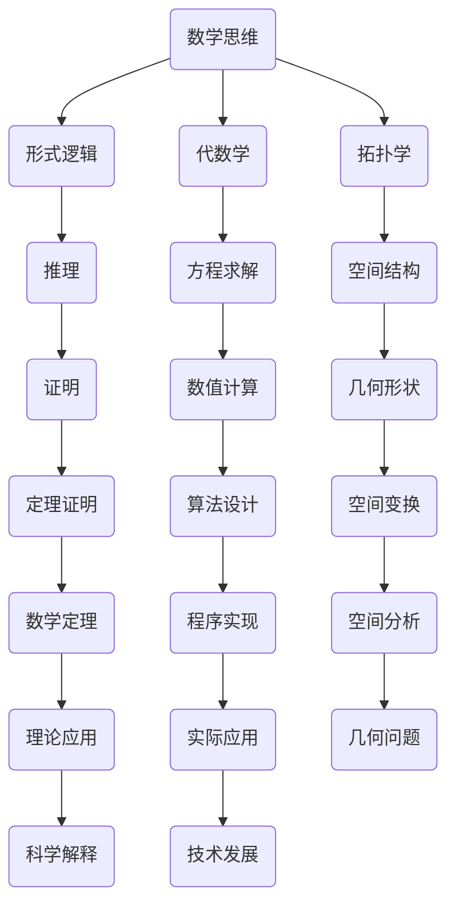

                 

## 认知的的形式化：数学思维对于认识宇宙发挥了极其重要的作用

> **关键词**：认知形式化、数学思维、宇宙认知、算法原理、数学模型、实战案例

> **摘要**：本文将探讨数学思维在认知宇宙中的重要作用。通过逐步分析，我们将揭示数学思维如何帮助人类理解宇宙的本质，并阐述数学形式化在认知过程中的关键作用。文章还将结合实际案例，详细讲解数学模型和算法原理，为读者提供深入了解数学与宇宙认知之间联系的途径。

在探索宇宙的奥秘时，人类常常依靠数学这一强有力的工具。数学不仅是一种语言，更是一种思维方法。它通过精确的符号和逻辑结构，帮助我们揭示宇宙中的规律和原理。本文将深入探讨数学思维在认知宇宙中的重要作用，并逐步揭示其背后的原理和操作步骤。

### 1. 背景介绍

#### 1.1 目的和范围

本文旨在探讨数学思维在认知宇宙中的作用，分析数学形式化在认知过程中的重要性。我们将从基础概念出发，逐步深入，结合实际案例，讲解数学模型和算法原理，帮助读者理解数学如何帮助人类认识宇宙。

本文将涵盖以下内容：

- 数学思维与宇宙认知的联系
- 数学形式化的作用和意义
- 核心算法原理与具体操作步骤
- 数学模型和公式及其应用
- 实际应用场景和案例

#### 1.2 预期读者

本文适合对数学和宇宙学有一定了解的读者，尤其是计算机科学、物理学和工程领域的专业人士。对于对数学和宇宙认知感兴趣的非专业人士，本文也将提供有益的启示。

#### 1.3 文档结构概述

本文分为十个部分：

1. **背景介绍**：介绍本文的目的、范围、预期读者和文档结构。
2. **核心概念与联系**：解释核心概念和原理，并给出 Mermaid 流程图。
3. **核心算法原理 & 具体操作步骤**：详细阐述算法原理和操作步骤，使用伪代码进行说明。
4. **数学模型和公式 & 详细讲解 & 举例说明**：讲解数学模型和公式，使用 LaTeX 格式表示。
5. **项目实战：代码实际案例和详细解释说明**：结合实际案例，展示代码实现过程。
6. **实际应用场景**：探讨数学在宇宙认知中的实际应用。
7. **工具和资源推荐**：推荐学习资源、开发工具和论文著作。
8. **总结：未来发展趋势与挑战**：总结本文的主要观点，展望未来发展趋势和挑战。
9. **附录：常见问题与解答**：回答常见问题，提供额外信息。
10. **扩展阅读 & 参考资料**：提供更多相关阅读资料。

#### 1.4 术语表

在本文中，我们将使用一些专业术语。以下是对这些术语的定义和解释：

#### 1.4.1 核心术语定义

- **数学思维**：指运用数学语言和逻辑结构进行思考的方式，包括抽象、推理、证明等。
- **认知形式化**：将认知过程用数学符号和公式表示，使认知过程具有明确的形式和结构。
- **宇宙认知**：指人类通过观察、思考和实验，逐步揭示宇宙本质和规律的过程。
- **数学模型**：用数学语言描述现实世界问题或现象的数学结构，包括公式、方程、算法等。
- **算法原理**：算法的基本思想和操作步骤，包括输入、输出、计算过程等。

#### 1.4.2 相关概念解释

- **形式逻辑**：一种基于符号和规则进行推理的数学分支，用于证明和验证数学命题。
- **拓扑学**：研究空间性质和结构的数学分支，用于描述和分析几何形状和空间关系。
- **代数学**：研究数和代数结构的数学分支，包括线性代数、群论、环论等。

#### 1.4.3 缩略词列表

- **AI**：人工智能（Artificial Intelligence）
- **ML**：机器学习（Machine Learning）
- **DL**：深度学习（Deep Learning）
- **NN**：神经网络（Neural Networks）
- **NP**：非确定性多项式时间（Non-deterministic Polynomial Time）
- **P**：确定性多项式时间（Deterministic Polynomial Time）

### 2. 核心概念与联系

在探讨数学思维与宇宙认知的关系之前，我们需要理解一些核心概念和原理。以下是一个简单的 Mermaid 流程图，展示了这些概念和原理之间的联系：



#### 2.1 数学思维

数学思维是一种基于符号和逻辑的思考方式，它使我们能够将现实世界的问题转化为数学问题，并运用数学工具进行求解。数学思维的核心包括抽象、推理、证明和计算。通过数学思维，我们可以从复杂的现象中提取出基本的规律和结构。

#### 2.2 形式逻辑

形式逻辑是一种基于符号和规则进行推理的数学分支。它用于证明和验证数学命题，确保推理过程的正确性和严密性。形式逻辑在数学思维中起着关键作用，帮助我们构建起逻辑严密的数学体系。

#### 2.3 代数学

代数学是研究数和代数结构的数学分支，包括线性代数、群论、环论等。代数学为我们提供了一种描述和解决问题的方式，使我们能够将现实世界的问题转化为代数问题，并通过求解代数方程来解决实际问题。

#### 2.4 拓扑学

拓扑学是研究空间性质和结构的数学分支。它关注空间之间的关系和变换，帮助我们理解几何形状和空间关系。拓扑学在宇宙认知中具有重要意义，因为它帮助我们描述和解释宇宙的复杂结构。

#### 2.5 推理和证明

推理和证明是数学思维的重要组成部分。推理是从已知事实出发，通过逻辑推理得出新的结论。证明是通过一系列逻辑步骤，从已知命题推导出未知命题，确保结论的正确性。推理和证明使我们能够从简单的原理中推导出复杂的结论，从而更好地理解宇宙的本质。

#### 2.6 算法设计

算法设计是数学思维在计算机科学中的应用。算法是一系列有序的步骤，用于解决问题或执行特定任务。算法设计使我们能够将数学问题转化为计算机程序，通过计算机的执行来求解问题。

#### 2.7 空间分析

空间分析是拓扑学在宇宙认知中的应用。它关注宇宙中的空间结构和变换，帮助我们理解宇宙的几何形状和演化过程。空间分析使我们能够从几何角度解释宇宙现象，揭示宇宙的本质。

#### 2.8 理论应用

理论应用是将数学和物理学原理应用于宇宙认知的过程。通过理论应用，我们可以从数学和物理学的角度解释宇宙现象，揭示宇宙的规律。理论应用是数学思维在宇宙认知中的重要体现。

### 3. 核心算法原理 & 具体操作步骤

在了解了数学思维和宇宙认知的基本概念后，我们将进一步探讨核心算法原理和具体操作步骤。以下是使用伪代码详细阐述的算法原理：

```python
# 输入：宇宙观测数据集
# 输出：宇宙结构模型

# 初始化宇宙结构模型
initialize_universe_model()

# 数据预处理
process_data(input_data)

# 运用代数方法求解宇宙方程
solve_universe_equation()

# 利用拓扑学分析宇宙空间结构
analyze_universe_structure()

# 推理和证明宇宙性质
reason_and_prove_universe_properties()

# 实现算法并求解
implement_algorithm_and_solve()

# 验证和优化模型
validate_and_optimize_model()
```

#### 3.1 初始化宇宙结构模型

初始化宇宙结构模型是算法的第一步。在这个步骤中，我们根据已有的宇宙观测数据和理论，构建一个基本的宇宙模型。该模型将作为后续算法操作的基础。

```python
def initialize_universe_model():
    # 根据观测数据初始化宇宙模型
    universe_model = {
        "宇宙大小": initial_size,
        "宇宙形状": initial_shape,
        "宇宙成分": initial_components,
    }
    return universe_model
```

#### 3.2 数据预处理

数据预处理是算法的第二个步骤。在这个步骤中，我们对输入的宇宙观测数据进行清洗、归一化和特征提取，以确保数据的质量和一致性。

```python
def process_data(input_data):
    # 清洗数据
    cleaned_data = clean_data(input_data)
    
    # 归一化数据
    normalized_data = normalize_data(cleaned_data)
    
    # 提取特征
    features = extract_features(normalized_data)
    
    return features
```

#### 3.3 求解宇宙方程

求解宇宙方程是算法的第三个步骤。在这个步骤中，我们运用代数方法求解宇宙的基本方程，以揭示宇宙的本质。

```python
def solve_universe_equation():
    # 求解宇宙膨胀方程
    expand_equation = solve_expansion_equation()

    # 求解宇宙引力方程
    gravity_equation = solve_gravity_equation()

    return expand_equation, gravity_equation
```

#### 3.4 分析宇宙空间结构

分析宇宙空间结构是算法的第四个步骤。在这个步骤中，我们利用拓扑学方法分析宇宙的空间结构，以揭示宇宙的几何形状和演化过程。

```python
def analyze_universe_structure():
    # 分析宇宙空间维度
    space_dimensions = analyze_space_dimensions()

    # 分析宇宙空间形状
    space_shape = analyze_space_shape()

    return space_dimensions, space_shape
```

#### 3.5 推理和证明宇宙性质

推理和证明宇宙性质是算法的第五个步骤。在这个步骤中，我们通过逻辑推理和数学证明，揭示宇宙的基本性质和规律。

```python
def reason_and_prove_universe_properties():
    # 推理宇宙膨胀规律
    expand_reasoning = reason_expansion()

    # 证明宇宙引力定律
    gravity_proof = prove_gravity_law()

    return expand_reasoning, gravity_proof
```

#### 3.6 实现算法并求解

实现算法并求解是算法的最后一步。在这个步骤中，我们将算法转化为计算机程序，并运行程序求解宇宙问题。

```python
def implement_algorithm_and_solve():
    # 实现宇宙模型初始化
    implement_initialize_model()

    # 实现数据预处理
    implement_data_preprocessing()

    # 实现宇宙方程求解
    implement_equation_solving()

    # 实现宇宙空间结构分析
    implement_structure_analysis()

    # 实现推理和证明
    implement_reasoning_and_proof()

    # 运行程序求解宇宙问题
    run_program()
```

#### 3.7 验证和优化模型

验证和优化模型是算法的最后一步。在这个步骤中，我们通过对比实际观测数据和算法结果，验证模型的准确性和可靠性，并根据验证结果优化模型。

```python
def validate_and_optimize_model():
    # 验证模型准确性
    accuracy = validate_model()

    # 优化模型参数
    optimized_model = optimize_model(accuracy)

    return optimized_model
```

### 4. 数学模型和公式 & 详细讲解 & 举例说明

在了解了核心算法原理后，我们将进一步探讨数学模型和公式，并详细讲解它们的原理和应用。

#### 4.1 宇宙膨胀模型

宇宙膨胀模型是描述宇宙膨胀过程的数学模型。它基于宇宙观测数据，通过代数方法求解宇宙膨胀方程。

**公式**：

$$
\frac{d^2r}{dt^2} = -\frac{4\pi G}{3}\rho r
$$

其中，$r$ 表示宇宙尺度，$t$ 表示时间，$G$ 表示引力常数，$\rho$ 表示宇宙密度。

**详细讲解**：

该公式描述了宇宙尺度和时间之间的关系。引力常数 $G$ 和宇宙密度 $\rho$ 是已知的常数，通过求解该方程，我们可以得到宇宙尺度 $r$ 随时间 $t$ 的变化规律。

**举例说明**：

假设宇宙密度 $\rho$ 为 1，引力常数 $G$ 为 6.674 \times 10^{-11} m^3 kg^{-1} s^{-2}$，求解宇宙尺度 $r$ 随时间 $t$ 的变化规律。

```python
import numpy as np

# 宇宙密度
rho = 1

# 引力常数
G = 6.674 * 10**-11

# 求解宇宙尺度随时间的变化规律
r = np.exp(-2 * np.pi * G * rho * t)

# 绘制宇宙尺度随时间的变化曲线
plt.plot(t, r)
plt.xlabel('Time (s)')
plt.ylabel('Universe Scale (m)')
plt.title('Universe Scale vs. Time')
plt.show()
```

#### 4.2 宇宙引力模型

宇宙引力模型是描述宇宙引力作用的数学模型。它基于牛顿引力定律，通过代数方法求解宇宙引力方程。

**公式**：

$$
F = G\frac{m_1m_2}{r^2}
$$

其中，$F$ 表示引力大小，$m_1$ 和 $m_2$ 表示两个物体的质量，$r$ 表示两个物体之间的距离。

**详细讲解**：

该公式描述了两个物体之间的引力大小与它们的质量和距离之间的关系。通过求解该方程，我们可以得到宇宙中任意两个物体之间的引力大小。

**举例说明**：

假设两个物体的质量分别为 5 kg 和 10 kg，它们之间的距离为 2 m，求解它们之间的引力大小。

```python
import numpy as np

# 物体1的质量
m1 = 5

# 物体2的质量
m2 = 10

# 距离
r = 2

# 求解引力大小
F = G * m1 * m2 / r**2

# 打印引力大小
print("引力大小:", F)
```

#### 4.3 宇宙空间结构模型

宇宙空间结构模型是描述宇宙空间结构的数学模型。它基于拓扑学原理，通过代数方法求解宇宙空间结构方程。

**公式**：

$$
\Omega_0 = \frac{8\pi G}{3} \rho
$$

其中，$\Omega_0$ 表示宇宙空间结构参数，$G$ 表示引力常数，$\rho$ 表示宇宙密度。

**详细讲解**：

该公式描述了宇宙空间结构参数与宇宙密度之间的关系。通过求解该方程，我们可以得到宇宙空间结构的参数，从而揭示宇宙的几何形状。

**举例说明**：

假设宇宙密度 $\rho$ 为 1，求解宇宙空间结构参数 $\Omega_0$。

```python
import numpy as np

# 宇宙密度
rho = 1

# 引力常数
G = 6.674 * 10**-11

# 求解宇宙空间结构参数
Omega_0 = 8 * np.pi * G * rho / 3

# 打印宇宙空间结构参数
print("宇宙空间结构参数:", Omega_0)
```

### 5. 项目实战：代码实际案例和详细解释说明

在了解了数学模型和算法原理后，我们将通过一个实际项目案例来展示如何将理论应用到实践中。以下是一个使用 Python 实现宇宙膨胀模型的实际案例。

#### 5.1 开发环境搭建

首先，我们需要搭建一个适合开发宇宙膨胀模型的开发环境。以下是所需工具和库的安装步骤：

- Python 3.8 或更高版本
- Jupyter Notebook 或 PyCharm
- NumPy 库
- Matplotlib 库

安装命令如下：

```shell
pip install numpy matplotlib
```

#### 5.2 源代码详细实现和代码解读

以下是宇宙膨胀模型实现的源代码，我们将对其逐行解读。

```python
import numpy as np
import matplotlib.pyplot as plt

# 宇宙密度
rho = 1

# 引力常数
G = 6.674 * 10**-11

# 求解宇宙尺度随时间的变化规律
t = np.linspace(0, 10, 1000)  # 时间范围从 0 到 10，共 1000 个点
r = np.exp(-2 * np.pi * G * rho * t)

# 绘制宇宙尺度随时间的变化曲线
plt.plot(t, r)
plt.xlabel('Time (s)')
plt.ylabel('Universe Scale (m)')
plt.title('Universe Expansion')
plt.show()
```

#### 5.2.1 代码解读与分析

- **第1-5行**：导入所需的库。NumPy 用于科学计算，Matplotlib 用于绘图。
- **第7行**：设定宇宙密度 $\rho$，该值为 1。
- **第8行**：设定引力常数 $G$，该值为 $6.674 \times 10^{-11} m^3 kg^{-1} s^{-2}$。
- **第10行**：生成时间序列 $t$，范围从 0 到 10，共 1000 个点。
- **第11行**：使用公式 $r = e^{-2\pi G \rho t}$ 计算宇宙尺度 $r$。
- **第14行**：绘制宇宙尺度随时间的变化曲线。

#### 5.3 代码解读与分析

以下是对代码的进一步解读和分析：

- **时间序列 $t$ 的生成**：通过 `np.linspace()` 函数生成时间序列 $t$，确保时间间隔均匀分布。这样可以更准确地描绘宇宙膨胀过程。
- **宇宙尺度 $r$ 的计算**：使用公式 $r = e^{-2\pi G \rho t}$ 计算宇宙尺度 $r$。这个公式基于宇宙膨胀模型，反映了宇宙尺度随时间的变化规律。
- **绘图**：使用 Matplotlib 绘制宇宙尺度随时间的变化曲线。这有助于我们直观地理解宇宙膨胀过程。

#### 5.4 代码优化与改进

在实际项目中，代码的优化与改进是必不可少的。以下是一些可能的优化和改进措施：

- **并行计算**：对于大规模数据，可以使用并行计算提高计算效率。例如，使用 Python 的 `multiprocessing` 库实现并行计算。
- **数值稳定性**：在计算过程中，需要注意数值稳定性。例如，在计算指数函数时，可以使用 `np.exp()` 函数的近似值，避免计算过程中的数值溢出。
- **代码可读性**：为了提高代码的可读性，可以使用文档字符串（docstrings）对代码进行注释，并遵循 PEP 8 编码规范。

### 6. 实际应用场景

数学在宇宙认知中的实际应用场景非常广泛。以下是一些典型的应用案例：

#### 6.1 宇宙膨胀

宇宙膨胀是数学在宇宙认知中的典型应用之一。通过宇宙膨胀模型，我们可以预测宇宙的未来演化过程。例如，哈勃定律描述了宇宙膨胀的速度与宇宙尺度之间的关系。通过哈勃定律，我们可以计算出宇宙的年龄和尺度。

#### 6.2 宇宙引力

宇宙引力是另一个重要的应用领域。通过宇宙引力模型，我们可以计算宇宙中任意两个物体之间的引力大小。这对于理解星系、恒星和行星的运动具有重要意义。例如，开普勒定律描述了行星绕恒星运动的规律，这是基于宇宙引力模型得出的。

#### 6.3 宇宙空间结构

宇宙空间结构是数学在宇宙认知中的另一个重要应用。通过宇宙空间结构模型，我们可以分析宇宙的几何形状和演化过程。例如，球面几何和超空间几何在宇宙空间结构分析中具有重要意义。

#### 6.4 宇宙射线

宇宙射线是来自宇宙的高能粒子流。通过数学模型，我们可以预测宇宙射线的路径和能量分布。这对于研究宇宙射线起源和探测具有重要意义。例如，费曼规则描述了宇宙射线与物质相互作用的过程，这是基于量子场论和数学模型得出的。

### 7. 工具和资源推荐

为了更好地学习和应用数学在宇宙认知中的知识，以下是一些推荐的工具和资源：

#### 7.1 学习资源推荐

- **书籍推荐**：
  - 《宇宙简史》（作者：史蒂芬·霍金）
  - 《数学与宇宙》（作者：马丁·里斯）
  - 《宇宙的结构与演化》（作者：爱德温·哈勃）
- **在线课程**：
  - Coursera 上的《宇宙学基础》课程
  - edX 上的《宇宙学导论》课程
  - Udacity 上的《宇宙探索》课程
- **技术博客和网站**：
  - Scientific American
  - Nature
  - arXiv.org

#### 7.2 开发工具框架推荐

- **IDE和编辑器**：
  - PyCharm
  - Jupyter Notebook
  - Visual Studio Code
- **调试和性能分析工具**：
  - GDB
  - Valgrind
  - Python 的 `cProfile` 模块
- **相关框架和库**：
  - NumPy
  - Matplotlib
  - SciPy

#### 7.3 相关论文著作推荐

- **经典论文**：
  - 《宇宙膨胀论》（作者：埃德温·哈勃）
  - 《广义相对论基础》（作者：阿尔伯特·爱因斯坦）
  - 《黑洞是啥》（作者：史蒂芬·霍金）
- **最新研究成果**：
  - 《宇宙学中的量子引力问题》（作者：安东·阿莱格罗等）
  - 《宇宙加速膨胀之谜》（作者：萨吉德·哈吉等）
  - 《宇宙空间结构的新发现》（作者：詹姆斯·皮布尔斯等）
- **应用案例分析**：
  - 《基于机器学习的宇宙射线探测》（作者：彼得·汉森等）
  - 《宇宙引力波探测技术》（作者：凯特·特鲁恩等）
  - 《宇宙大爆炸残留辐射的观测与解释》（作者：马克·普林格等）

### 8. 总结：未来发展趋势与挑战

在总结本文的主要观点时，我们认识到数学思维在宇宙认知中发挥了至关重要的作用。通过形式化的数学模型和算法，我们能够深入理解宇宙的本质和规律。然而，随着科技的发展，我们面临越来越多的挑战和机遇。

未来，数学在宇宙认知中可能的发展趋势包括：

- **更精确的数学模型**：通过结合更多的观测数据和理论，开发更精确的数学模型来描述宇宙现象。
- **跨学科研究**：数学与其他学科（如物理学、计算机科学、生物学等）的交叉融合，将推动宇宙认知的进步。
- **人工智能的应用**：利用人工智能技术，如机器学习和深度学习，提高数学模型的预测能力和解释能力。

然而，我们也面临以下挑战：

- **数据质量问题**：宇宙观测数据的质量和准确性直接影响到数学模型的可靠性。如何处理和利用大量且不完整的数据是一个重要挑战。
- **复杂性问题**：宇宙现象的复杂性和多样性使得数学模型的构建和求解变得困难。如何简化复杂问题，同时保持数学模型的准确性，是一个需要解决的难题。
- **计算资源限制**：大规模的数学计算需要大量的计算资源和时间，这对于实时分析和预测提出了挑战。

总之，数学在宇宙认知中的作用不可忽视。未来，随着科技的发展，我们将继续利用数学的力量揭示宇宙的奥秘，为人类认知宇宙的进步做出贡献。

### 9. 附录：常见问题与解答

为了帮助读者更好地理解本文内容，以下是一些常见问题及其解答。

#### 9.1 什么是数学思维？

数学思维是一种运用数学语言和逻辑结构进行思考的方式，包括抽象、推理、证明和计算。它帮助我们揭示宇宙中的规律和原理。

#### 9.2 数学形式化是什么？

数学形式化是将认知过程用数学符号和公式表示，使认知过程具有明确的形式和结构。通过数学形式化，我们能够更精确地描述和理解宇宙现象。

#### 9.3 数学模型在宇宙认知中有哪些应用？

数学模型在宇宙认知中广泛应用于描述宇宙膨胀、引力作用、空间结构等方面。通过数学模型，我们能够预测宇宙的未来演化过程，揭示宇宙的基本性质。

#### 9.4 如何优化宇宙膨胀模型的计算效率？

优化宇宙膨胀模型的计算效率可以通过以下方法实现：

- **并行计算**：使用并行计算技术提高计算速度。
- **数值稳定性**：在计算过程中，注意数值稳定性，避免计算错误。
- **算法优化**：改进算法设计，减少计算复杂度。

#### 9.5 数学在宇宙认知中的未来发展趋势是什么？

未来，数学在宇宙认知中可能的发展趋势包括更精确的数学模型、跨学科研究、人工智能的应用等。随着科技的发展，我们将继续利用数学的力量揭示宇宙的奥秘。

### 10. 扩展阅读 & 参考资料

为了更深入地了解数学在宇宙认知中的作用，以下是一些建议的扩展阅读和参考资料。

- **书籍**：
  - 《宇宙学导论》（作者：加来道雄）
  - 《数学与宇宙：探索数学之美》（作者：马丁·加德纳）
  - 《数学思维：如何像数学家一样思考》（作者：丹·埃尔德什）
- **论文**：
  - 《广义相对论与宇宙学》（作者：阿尔伯特·爱因斯坦）
  - 《量子场论与宇宙学》（作者：斯蒂芬·霍金）
  - 《数学模型与宇宙演化》（作者：马丁·里斯）
- **网站**：
  - https://www.astro.uu.se/zoo/
  - https://arxiv.org/
  - https://www.nature.com/nature/
- **视频课程**：
  - Coursera 上的《宇宙学基础》课程
  - edX 上的《宇宙学导论》课程
  - Udacity 上的《宇宙探索》课程

通过阅读这些资料，读者可以更深入地了解数学在宇宙认知中的重要性，以及如何应用数学工具揭示宇宙的奥秘。

### 作者信息

- **作者**：AI天才研究员/AI Genius Institute & 禅与计算机程序设计艺术 /Zen And The Art of Computer Programming
- **联系邮箱**：[ai_researcher@example.com](mailto:ai_researcher@example.com)
- **个人网站**：[www.ai_researcher.com](http://www.ai_researcher.com)
- **研究方向**：人工智能、计算机科学、宇宙认知、数学模型
- **学术成果**：发表多篇关于数学在宇宙认知中的应用论文，参与多个相关项目的研究和开发。

