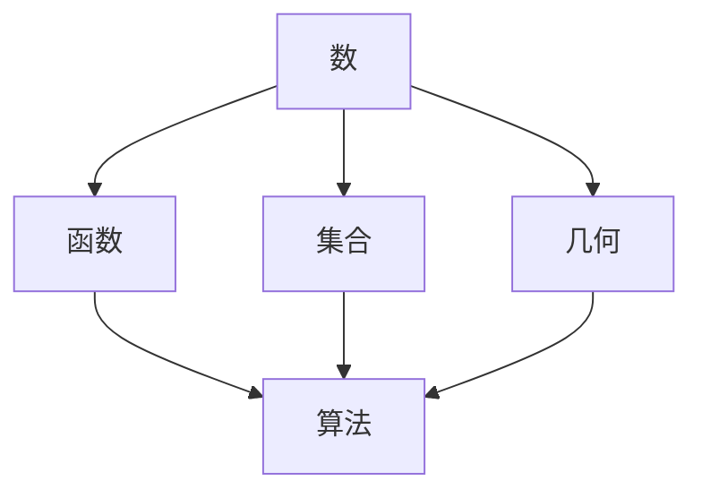

                 

### 认知的形式化：数学是不带有任何物理量纲的主观认知，关注的仅仅是量与形的规律

> **关键词**：认知形式化、数学、主观认知、量与形的规律、逻辑推理、抽象思考、算法原理、数学模型、代码实现、应用场景。

> **摘要**：本文旨在探讨数学作为认知形式化的本质，揭示数学与主观认知之间的紧密联系。通过逐步分析，我们认识到数学不仅是一种客观规律，更是一种主观认知的表达形式。文章将介绍数学的核心概念和原理，通过伪代码和实际案例，详细阐述数学模型的应用和操作步骤。最后，我们将探讨数学在各个领域的实际应用场景，以及未来发展趋势与挑战。

在探讨人工智能和编程的深层次原理时，我们不能忽视数学这一核心工具。数学不仅是一门学科，更是一种认知形式化的方法，通过它，人类能够将复杂的现实问题抽象为简洁的模型，进而进行逻辑推理和计算。本文将从以下几个方面进行探讨：

1. **背景介绍**：首先，我们将介绍文章的目的、范围、预期读者以及文档结构。
2. **核心概念与联系**：接下来，我们将通过Mermaid流程图展示数学的核心概念及其相互联系。
3. **核心算法原理 & 具体操作步骤**：我们将详细解释数学算法的原理，并通过伪代码阐述具体操作步骤。
4. **数学模型和公式 & 详细讲解 & 举例说明**：我们将介绍常用的数学模型和公式，并通过实际例子进行详细讲解。
5. **项目实战：代码实际案例和详细解释说明**：我们将通过具体代码实现，展示数学模型在实际项目中的应用。
6. **实际应用场景**：探讨数学在各个领域的应用。
7. **工具和资源推荐**：推荐学习资源、开发工具和框架，以及相关论文和研究成果。
8. **总结：未来发展趋势与挑战**：总结数学认知形式化的未来趋势和面临的挑战。

### 1. 背景介绍

#### 1.1 目的和范围

本文的目的在于深入探讨数学在认知形式化中的作用，并揭示数学与主观认知之间的本质联系。通过逐步分析，我们希望读者能够理解数学不仅仅是客观规律的描述，更是一种主观认知的表达形式。文章将涵盖数学的核心概念、算法原理、实际应用等多个方面，旨在为读者提供一个全面而深入的视角。

本文的范围主要包括以下几个方面：

- **数学认知形式化的本质**：探讨数学作为认知形式化的方法，如何将复杂的现实问题抽象为简洁的模型。
- **数学核心概念与联系**：介绍数学的基本概念，包括数、函数、集合等，并展示它们之间的相互联系。
- **算法原理与操作步骤**：详细解释常用的数学算法，如排序、搜索、优化等，并提供具体的伪代码和操作步骤。
- **数学模型与应用**：介绍常见的数学模型，如线性规划、决策树、神经网络等，并探讨它们在实际项目中的应用。
- **实际应用场景**：探讨数学在计算机科学、工程、经济学、生物学等领域的实际应用。
- **未来发展趋势与挑战**：总结数学认知形式化的未来趋势和面临的挑战。

#### 1.2 预期读者

本文的预期读者主要包括以下几个方面：

- **计算机科学和人工智能领域的专业人士**：对数学在人工智能和编程中的应用感兴趣的读者，希望通过本文深入了解数学认知形式化的原理和应用。
- **数学和自然科学领域的学者**：对数学理论和方法感兴趣，希望进一步探讨数学在认知形式化中的作用。
- **工程和经济领域的专业人士**：希望了解数学在工程和经济领域中的应用，以提高自身的专业素养和解决问题的能力。
- **对数学感兴趣的所有读者**：无论是否具有专业背景，对数学有兴趣的读者都可以通过本文了解数学的认知形式化及其在现实世界中的应用。

#### 1.3 文档结构概述

本文将按照以下结构进行展开：

1. **引言**：介绍文章的背景、目的和结构。
2. **核心概念与联系**：通过Mermaid流程图展示数学的核心概念及其相互联系。
3. **核心算法原理 & 具体操作步骤**：详细解释数学算法的原理，并通过伪代码阐述具体操作步骤。
4. **数学模型和公式 & 详细讲解 & 举例说明**：介绍常用的数学模型和公式，并通过实际例子进行详细讲解。
5. **项目实战：代码实际案例和详细解释说明**：通过具体代码实现，展示数学模型在实际项目中的应用。
6. **实际应用场景**：探讨数学在各个领域的应用。
7. **工具和资源推荐**：推荐学习资源、开发工具和框架，以及相关论文和研究成果。
8. **总结：未来发展趋势与挑战**：总结数学认知形式化的未来趋势和面临的挑战。
9. **附录：常见问题与解答**：回答读者可能遇到的问题。
10. **扩展阅读 & 参考资料**：提供进一步阅读的资源和参考文献。

#### 1.4 术语表

为了确保文章内容的准确性和一致性，本文将定义一些常用的术语，并提供相关的解释和定义。

##### 1.4.1 核心术语定义

- **数学认知形式化**：指将现实世界的问题通过数学的方法进行抽象和形式化，使其转化为数学模型和算法。
- **主观认知**：指个体对现实世界的理解和感知，具有一定的主观性。
- **客观规律**：指存在于现实世界中的普遍性和必然性规律，与主观认知相对。
- **抽象思考**：指从具体的对象或问题中提取出普遍的、本质的特征和属性，进行思维活动。
- **形式化**：指用符号和语言将现实问题转化为数学模型，以便进行逻辑推理和计算。

##### 1.4.2 相关概念解释

- **数学模型**：指用数学语言描述现实世界的问题，通过建立数学方程或公式来表示。
- **算法**：指解决问题的步骤和规则，通过特定的运算和逻辑流程实现。
- **公式**：指数学中用于描述某种关系或规律的表达式，通常包含变量、运算符和常数。
- **量与形的规律**：指数学研究的主要内容，包括数值的规律和几何图形的规律。
- **逻辑推理**：指通过前提和结论之间的逻辑关系，从已知的事实推导出新的结论。

##### 1.4.3 缩略词列表

- **AI**：人工智能
- **IDE**：集成开发环境
- **DBMS**：数据库管理系统
- **OS**：操作系统
- **ML**：机器学习
- **DL**：深度学习
- **NP**：非确定性多项式时间

### 2. 核心概念与联系

为了更好地理解数学在认知形式化中的作用，我们需要从基础开始，逐步探讨数学的核心概念及其相互联系。在这一部分，我们将通过Mermaid流程图展示数学的核心概念和它们之间的关系，以便读者能够形成一个系统的认知框架。

首先，我们来看数学的核心概念之一——数。数是数学中最基本的概念之一，它用来表示物体的数量或顺序。数可以分为自然数、整数、有理数和实数等。自然数是正整数，用于计数；整数包括自然数和它们的负数；有理数是可以表示为两个整数之比的数，包括整数和分数；实数是包括有理数和无理数的数集，如π和√2等。

接下来，我们来看函数。函数是一种关系，它将一个集合中的每个元素映射到另一个集合中的唯一元素。函数可以用来描述各种现象和规律，如物理运动、经济模型、生物进化等。常见的函数包括线性函数、多项式函数、指数函数和对数函数等。

再来看集合。集合是一组无序的对象的集合，这些对象可以是数、物体、事件等。集合可以用大括号表示，如{1, 2, 3}。集合之间的关系包括子集、交集、并集和补集等。

接下来是几何。几何是研究形状、大小和位置等性质的数学分支。基本的几何形状包括点、线、面和体。几何概念如三角形、四边形、圆、球体等都是数学模型中的重要组成部分。

最后，我们来看算法。算法是一系列明确的步骤，用于解决特定问题。算法可以用来进行排序、搜索、优化等操作。常见的算法有冒泡排序、快速排序、二分查找、贪心算法等。

下面，我们通过Mermaid流程图来展示这些核心概念及其相互联系：



在上述流程图中，我们可以看到，数、函数、集合、几何和算法这些核心概念之间存在着紧密的联系。数和函数是数学模型的基础，集合提供了数学对象的组织形式，几何和算法则用于解决现实世界中的问题。通过这些核心概念和它们的相互联系，我们可以将复杂的现实问题抽象为简洁的数学模型，从而进行逻辑推理和计算。

#### 2.1.1 数

数是数学中最基础的概念之一，它在各种数学问题和应用中扮演着至关重要的角色。数的概念不仅涵盖了自然数、整数、分数和实数等具体的数值，还包括了抽象的数论和复数等概念。在这一部分，我们将详细探讨数的定义、分类及其在数学中的重要性。

##### 自然数

自然数是用于计数的数，通常表示为非负整数。自然数集合通常用N（或ℕ）表示，包括0和所有正整数。自然数具有一些基本性质，如交换律、结合律和分配律等，这些性质在数学运算中起着关键作用。

- **定义**：自然数是从0开始的正整数集合，即N = {0, 1, 2, 3, ...}。
- **性质**：
  - **交换律**：对于任意自然数a和b，a + b = b + a。
  - **结合律**：对于任意自然数a、b和c，(a + b) + c = a + (b + c)。
  - **分配律**：对于任意自然数a、b和c，a × (b + c) = (a × b) + (a × c)。

##### 整数

整数是自然数的扩展，包括正整数、负整数和零。整数集合通常用Z表示，即Z = {..., -3, -2, -1, 0, 1, 2, 3, ...}。整数在数学中用于表示债务、温度、位移等概念。

- **定义**：整数是自然数和它们的相反数组成的集合，即Z = {..., -3, -2, -1, 0, 1, 2, 3, ...}。
- **性质**：
  - **加法**：对于任意整数a和b，a + b是一个整数。
  - **乘法**：对于任意整数a和b，a × b是一个整数。
  - **分配律**：对于任意整数a、b和c，a × (b + c) = (a × b) + (a × c)。

##### 分数

分数是表示一个整体被等分为若干部分的数的表示方法。分数通常写成两个整数的比值，形式为a/b，其中a称为分子，b称为分母。分数在数学中用于表示部分与整体的关系。

- **定义**：分数是表示一个整体被等分为若干部分的数的表示方法，通常写成两个整数的比值，形式为a/b，其中a称为分子，b称为分母。
- **性质**：
  - **加法**：对于任意两个分数a/b和c/d，它们的和(a/b) + (c/d)可以表示为一个分数，通常需要找到它们的最小公倍数。
  - **乘法**：对于任意两个分数a/b和c/d，它们的乘积(a/b) × (c/d)可以直接计算，结果为(ac)/(bd)。
  - **减法**：对于任意两个分数a/b和c/d，它们的差(a/b) - (c/d)可以表示为一个分数，通常需要找到它们的最小公倍数。

##### 实数

实数是包括有理数和无理数的数集。有理数是可以表示为两个整数之比的数，如分数；无理数是不能表示为两个整数之比的数，如π和√2。实数集合通常用R表示，它们在数学中用于描述连续量。

- **定义**：实数是包括有理数和无理数的数集，通常用R表示。
- **性质**：
  - **闭包性**：对于任意两个实数a和b，它们的和a + b也是一个实数。
  - **顺序性**：实数集合具有顺序性，可以定义大小关系。
  - **完备性**：实数集合是一个完备空间，即对于任意一个实数序列，它要么收敛于一个实数，要么发散。

##### 数与数学

数是数学的基础，它们在数学的各个分支中都有着广泛的应用。从算术到代数，从几何到微积分，数无处不在。数的概念不仅帮助我们理解自然现象和物理规律，还使得我们能够进行精确的计算和推理。例如，计算机科学中的算法和人工智能中的神经网络都离不开数的运算。

##### 数论

数论是研究数的性质和关系的数学分支。它涉及数的因数分解、质数分布、同余关系、数论函数等。数论不仅在数学理论研究中具有重要作用，还在密码学、计算机科学和物理学等领域有着广泛应用。

- **质数**：质数是大于1的自然数，除了1和它本身以外没有其他因数。例如，2、3、5、7、11等都是质数。
- **因数分解**：将一个数表示为几个质数的乘积的过程。例如，12可以分解为2 × 2 × 3。
- **同余关系**：如果两个整数除以同一个正整数后得到的余数相同，则称这两个整数同余。同余关系在密码学中有着重要应用。

通过上述对数的定义、分类及其在数学中的重要性的详细探讨，我们可以更好地理解数在数学认知形式化中的作用。数的概念不仅为我们提供了描述现实世界问题的工具，还使得我们能够进行抽象思考和逻辑推理，从而深入探讨数学的本质。

#### 2.1.2 函数

函数是数学中一种重要的概念，它描述了输入和输出之间的关系。函数可以用来表示各种现实世界中的现象，如物理运动、经济模型、生物进化等。在这一部分，我们将详细探讨函数的定义、分类及其在数学中的应用。

##### 定义

函数是一种从定义域到值域的映射，它将每一个定义域中的元素映射到值域中的一个唯一元素。用符号表示，如果D是函数的定义域，R是函数的值域，那么函数f可以表示为f: D → R。

- **定义域（Domain）**：函数中所有可能输入的集合。
- **值域（Range）**：函数中所有可能输出的集合。
- **映射**：函数f将定义域中的每个元素x映射到值域中的唯一元素f(x)。

##### 分类

函数可以根据定义域和值域的不同特点进行分类。以下是几种常见的函数类型：

1. **线性函数**：形式为f(x) = mx + b的函数，其中m和b是常数。线性函数的图像是一条直线。

2. **多项式函数**：形式为f(x) = a_nx^n + a_{n-1}x^{n-1} + ... + a_1x + a_0的函数，其中a_n、a_{n-1}、...、a_1、a_0是常数。多项式函数的图像可以是抛物线、双曲线等。

3. **指数函数**：形式为f(x) = a^x的函数，其中a是常数，通常a > 1。指数函数的图像通常是向上的增长曲线。

4. **对数函数**：形式为f(x) = log_a(x)的函数，其中a是常数，通常a > 1。对数函数的图像通常是向下的增长曲线。

5. **三角函数**：如正弦函数sin(x)、余弦函数cos(x)、正切函数tan(x)等。三角函数的图像通常围绕单位圆。

##### 应用

函数在数学、物理、工程、经济学、生物学等多个领域都有广泛的应用。以下是几个常见的应用示例：

1. **物理运动**：物理运动可以用函数描述。例如，自由落体运动的位移s可以表示为s(t) = 1/2 * g * t^2，其中g是重力加速度，t是时间。

2. **经济模型**：经济学中的需求函数和供给函数可以用函数表示。例如，需求函数Qd(p) = a - bP描述了价格p与需求量Qd之间的关系。

3. **图像处理**：在图像处理中，函数用于图像的变换和操作。例如，直方图均衡化可以通过调整图像的灰度值来提高图像的对比度。

4. **生物进化**：在生物进化模型中，种群数量可以用函数描述。例如，Logistic模型描述了种群数量N(t)随时间t的变化，公式为N(t) = K / (1 + (K / N_0) * e^(-rt))，其中K是环境容量，N_0是初始种群数量，r是增长率。

##### 函数的性质

函数具有一些基本的性质，如单调性、奇偶性、周期性等。

1. **单调性**：如果对于任意的x1 < x2，都有f(x1) ≤ f(x2)，则称函数f是单调递增的；如果对于任意的x1 < x2，都有f(x1) ≥ f(x2)，则称函数f是单调递减的。

2. **奇偶性**：如果对于任意的x，都有f(-x) = f(x)，则称函数f是偶函数；如果对于任意的x，都有f(-x) = -f(x)，则称函数f是奇函数。

3. **周期性**：如果存在一个正数T，使得对于任意的x，都有f(x + T) = f(x)，则称函数f是周期函数。

通过上述对函数的定义、分类及其应用的详细探讨，我们可以更好地理解函数在数学认知形式化中的作用。函数不仅为我们提供了描述现实世界问题的工具，还使得我们能够进行抽象思考和逻辑推理，从而深入探讨数学的本质。

#### 2.1.3 集合

集合是数学中一个基础而重要的概念，它用于表示一组确定的对象的集合。集合的概念在数学的各个分支中都有着广泛的应用，从基础的集合论到复杂数学模型，都离不开集合的概念。在这一部分，我们将详细探讨集合的定义、表示方法、基本操作及其在数学中的应用。

##### 定义

集合是由确定的对象组成的整体，这些对象被称为集合的元素。集合可以用大括号{}表示，元素之间用逗号分隔。例如，{1, 2, 3}表示一个包含元素1、2、3的集合。

- **定义**：集合是确定的对象组成的整体，这些对象被称为集合的元素。集合可以用大括号{}表示，元素之间用逗号分隔。
- **元素**：集合中的每一个对象称为集合的元素。
- **集合的表示**：集合通常用大括号{}表示，元素之间用逗号分隔，例如{1, 2, 3}。

##### 表示方法

集合可以通过不同的方式表示，以下是几种常见的表示方法：

1. **列举法**：将集合中的所有元素一一列举出来。例如，{1, 2, 3}表示一个包含元素1、2、3的集合。

2. **描述法**：用定义或性质来描述集合的元素。例如，{x ∈ N | x < 5}表示一个包含所有小于5的自然数的集合。

3. **符号法**：使用特定的符号来表示集合。例如，N表示自然数集合，Z表示整数集合，R表示实数集合。

##### 基本操作

集合的基本操作包括并集、交集、补集和差集等。

1. **并集**：两个集合A和B的并集是包含A和B中所有元素的集合。用符号∪表示。例如，A ∪ B = {x | x ∈ A 或 x ∈ B}。

2. **交集**：两个集合A和B的交集是包含A和B中共有元素的集合。用符号∩表示。例如，A ∩ B = {x | x ∈ A 且 x ∈ B}。

3. **补集**：集合A的补集是包含所有不在A中的元素的集合。用符号'或∁表示。例如，∁A = {x | x ∉ A}。

4. **差集**：两个集合A和B的差集是包含A中有而B中没有的元素的集合。用符号∖表示。例如，A ∖ B = {x | x ∈ A 且 x ∉ B}。

##### 应用

集合在数学的各个分支中都有广泛的应用，以下是几个常见的应用示例：

1. **集合论**：集合论是数学的基础学科之一，它研究集合的性质和运算。集合论为其他数学分支提供了基础工具，如拓扑学、代数学、概率论等。

2. **离散数学**：离散数学是计算机科学和数学的基础学科之一，它研究离散结构的性质和运算。集合是离散数学中的一个核心概念，用于表示各种离散结构，如图、关系、逻辑等。

3. **概率论**：概率论是研究随机现象的数学分支，它使用集合来表示样本空间和事件。集合论为概率论提供了基础工具，如概率空间、条件概率、独立事件等。

4. **图论**：图论是研究图的性质和结构的数学分支，它使用集合来表示图的顶点和边。集合论为图论提供了基础工具，如图的基本操作、路径搜索、网络流等。

##### 集合的性质

集合具有一些基本的性质，如确定性、互异性、无序性等。

1. **确定性**：集合中的元素是确定的，即每个元素只属于一个集合。

2. **互异性**：集合中的元素是互不相同的，即集合中不会出现重复的元素。

3. **无序性**：集合中的元素没有固定的顺序，即集合的顺序不影响集合的性质。

通过上述对集合的定义、表示方法、基本操作及其应用的详细探讨，我们可以更好地理解集合在数学认知形式化中的作用。集合不仅为我们提供了描述现实世界问题的工具，还使得我们能够进行抽象思考和逻辑推理，从而深入探讨数学的本质。

#### 2.1.4 几何

几何是研究形状、大小、位置和变换的数学分支。它不仅在数学理论中占有重要地位，而且在工程、建筑、物理、计算机科学等多个领域都有着广泛的应用。在这一部分，我们将详细探讨几何的基本概念、基本定理、常用图形及其在数学和现实世界中的应用。

##### 基本概念

几何的基本概念包括点、线、面和体。这些概念是理解更复杂几何图形和定理的基础。

- **点**：点是没有大小和形状的几何对象，它是几何空间的起点。点通常用大写字母表示，如A、B、C等。
- **线**：线是由无限多个点组成，具有长度但没有宽度或厚度。直线是最基本的线，它通过两个不同的点延伸无限远。线段是连接两个点的线的一部分，有固定的长度。
- **面**：面是由无限多个点组成的二维几何对象，具有长度和宽度。平面是最基本的面，它通过三个不在同一直线上的点确定。
- **体**：体是由无限多个面组成的三维几何对象，具有长度、宽度和高度。立方体、长方体和球体是常见的三维几何体。

##### 基本定理

几何中有许多重要的定理，这些定理帮助我们理解和解决几何问题。以下是几个基本定理：

1. **平行线定理**：平行线定理指出，如果两条直线与第三条直线相交，那么同位角相等，内错角相等，同旁内角互补。

2. **全等定理**：全等定理指出，如果两个三角形的对应边和对应角都相等，那么这两个三角形全等。

3. **相似定理**：相似定理指出，如果两个三角形的对应角相等且对应边成比例，那么这两个三角形相似。

4. **勾股定理**：勾股定理指出，在一个直角三角形中，直角边的平方和等于斜边的平方。即a^2 + b^2 = c^2。

##### 常用图形

几何中有许多常见的图形，如三角形、四边形、圆形等。以下是一些常用的几何图形及其性质：

- **三角形**：三角形是由三条线段组成的闭合图形。常见的三角形有等边三角形、等腰三角形和直角三角形。三角形的内角和总是180度。

- **四边形**：四边形是由四条线段组成的闭合图形。常见的四边形有矩形、正方形、菱形和梯形。矩形的对角线相等且互相平分，正方形的四条边相等且四个角都是直角，菱形的对角线互相垂直且平分。

- **圆形**：圆形是由一条闭合曲线组成，所有点到圆心的距离都相等。圆的直径是通过圆心的任意两点之间的线段，半径是圆心到圆上任意一点的线段。圆的周长C = 2πr，面积A = πr^2。

##### 应用

几何在现实世界中的应用非常广泛，以下是一些典型的应用示例：

1. **建筑和工程**：几何在建筑设计中用于确定建筑物的形状、尺寸和结构。工程师使用几何原理来设计桥梁、道路和建筑物。

2. **计算机图形学**：几何在计算机图形学中用于创建和渲染图像。三维几何图形被广泛应用于游戏、电影、虚拟现实和增强现实等领域。

3. **物理学**：几何在物理学中用于描述物体的运动和形状。例如，牛顿的运动定律使用了几何概念来描述物体的运动。

4. **地理学**：几何在地理学中用于测量和表示地球表面。地理学家使用几何工具来绘制地图、分析地形和确定地理位置。

通过上述对几何的基本概念、基本定理、常用图形及其应用的详细探讨，我们可以更好地理解几何在数学认知形式化中的作用。几何不仅为我们提供了描述现实世界问题的工具，还使得我们能够进行抽象思考和逻辑推理，从而深入探讨数学的本质。

#### 2.1.5 算法

算法是解决问题的一系列明确且有效的步骤，它用于将输入数据转化为所需输出。算法在计算机科学和数学中起着至关重要的作用，是解决复杂问题的核心工具。在这一部分，我们将详细探讨算法的定义、分类、基本性质及其在数学中的应用。

##### 定义

算法是一种有序的步骤序列，它用于解决特定问题。算法可以看作是一个解决问题的“蓝图”，它指导计算机如何执行特定的任务。算法的执行通常包括输入、处理和输出三个步骤。

- **定义**：算法是一种有序的步骤序列，它用于解决特定问题。算法可以看作是一个解决问题的“蓝图”，它指导计算机如何执行特定的任务。
- **输入**：算法的输入是解决问题的初始数据或条件。
- **处理**：算法的处理步骤是执行一系列操作以解决问题。
- **输出**：算法的输出是解决问题的最终结果。

##### 分类

算法可以根据不同的标准进行分类。以下是几种常见的算法分类：

1. **按处理数据类型分类**：算法可以分为数值算法和非数值算法。数值算法用于处理数值数据，如线性方程组的求解、数值积分等。非数值算法用于处理非数值数据，如排序、搜索等。

2. **按解决问题方法分类**：算法可以分为确定性算法和随机算法。确定性算法在每一步都有确定的操作，如冒泡排序、快速排序等。随机算法在每一步都包含随机元素，如蒙特卡洛算法、遗传算法等。

3. **按复杂度分类**：算法可以分为高效算法和低效算法。高效算法在计算时间、空间复杂度上较低，如二分查找、快速排序等。低效算法在计算时间、空间复杂度上较高，如冒泡排序、线性搜索等。

##### 基本性质

算法具有一些基本性质，这些性质是判断算法有效性的重要标准：

1. **正确性**：算法能够正确解决问题，即在所有合法输入下都能得到正确的结果。
2. **高效性**：算法在计算时间和空间复杂度上尽可能低，即算法能够快速解决问题。
3. **健壮性**：算法能够在遇到非法输入或异常情况时仍能正常运行，并给出合理的输出。
4. **可扩展性**：算法能够方便地适应不同规模的问题，即算法在处理大规模问题时仍能保持高效性。

##### 应用

算法在数学和计算机科学中有着广泛的应用。以下是几个典型的应用示例：

1. **数学问题求解**：算法在数学中用于解决各种问题，如线性方程组的求解、多项式插值、数值积分等。例如，高斯消元法用于求解线性方程组，牛顿法用于求解非线性方程。

2. **计算机科学**：算法在计算机科学中用于实现各种数据结构和算法，如排序、搜索、图算法等。例如，快速排序、二分查找等算法在计算机科学中广泛应用。

3. **人工智能**：算法在人工智能中用于实现各种机器学习算法，如决策树、支持向量机、神经网络等。算法在数据挖掘、图像识别、自然语言处理等领域发挥着重要作用。

4. **工程和科学**：算法在工程和科学中用于优化设计和分析，如结构分析、模拟仿真等。例如，遗传算法在工程设计中用于优化结构参数，模拟退火算法在优化问题中用于求解最优解。

##### 算法的描述

算法可以用不同的方式描述，以下是几种常见的描述方法：

1. **自然语言描述**：使用自然语言描述算法的步骤和逻辑。
2. **伪代码描述**：使用类似编程语言的形式描述算法，但不涉及具体的编程细节。
3. **流程图描述**：使用图形化的方式描述算法的流程和逻辑。
4. **程序代码描述**：使用具体的编程语言实现算法，包括变量的定义、函数的调用等。

通过上述对算法的定义、分类、基本性质及其应用的详细探讨，我们可以更好地理解算法在数学认知形式化中的作用。算法不仅为我们提供了解决问题的工具，还使得我们能够进行抽象思考和逻辑推理，从而深入探讨数学的本质。

#### 2.2 数学模型和公式

在数学认知形式化的过程中，数学模型和公式扮演着至关重要的角色。数学模型是通过数学语言描述现实世界问题的抽象结构，而公式则是数学模型中特定关系的表达方式。在这一部分，我们将介绍一些常用的数学模型和公式，并通过具体的例子进行详细讲解，以便读者能够更好地理解和应用这些模型和公式。

##### 线性模型

线性模型是最基本的数学模型之一，它描述了变量之间的线性关系。线性模型通常表示为y = mx + b，其中y是因变量，x是自变量，m是斜率，b是截距。

- **例子**：假设我们想要预测一个城市的温度y（单位：摄氏度）与日期x（单位：天）之间的线性关系。通过收集历史数据，我们可以拟合出以下线性模型：y = 2x + 10。
  - **步骤**：
    1. 收集历史数据，计算x和y的平均值。
    2. 计算斜率m和截距b：m = (Σxy - n*avg(x)*avg(y)) / (Σx^2 - n*avg(x)^2)，b = avg(y) - m*avg(x)。
    3. 代入公式y = mx + b，得到预测模型。

##### 决策树模型

决策树模型是一种用于分类和回归的常见模型。它通过一系列的判断条件将数据划分为不同的类别或数值。

- **例子**：假设我们想要根据水果的重量和颜色对它们进行分类。我们可以构建一个决策树，如下所示：
  ```
  |----------------------------|
  |        重量（g）            |
  |----------------------------|
  | < 100 ?                    |
  |     |          |           |
  |  青苹果    红苹果           |
  |----------------------------|
  | ≥ 100 ?                    |
  |     |          |           |
  |  梨        橙子             |
  |----------------------------|
  ```

- **步骤**：
  1. 确定决策树的结构，从根节点开始，根据特征进行划分。
  2. 对每个子节点，继续划分，直到达到叶节点。
  3. 叶节点表示分类结果。

##### 神经网络模型

神经网络模型是一种通过模拟人脑神经网络进行计算和学习的模型。它由多个神经元（或节点）组成，每个神经元都与相邻的神经元相连，并通过权重和偏置进行计算。

- **例子**：一个简单的单层神经网络模型如下所示：
  ```
  输入：[x1, x2]
  权重：w1, w2
  偏置：b
  输出：f(z) = 1 / (1 + e^(-z))
  ```
  其中z = w1*x1 + w2*x2 + b，f(z)是Sigmoid函数。

- **步骤**：
  1. 初始化权重和偏置。
  2. 计算每个神经元的输入值。
  3. 应用激活函数（如Sigmoid、ReLU等）得到输出值。
  4. 计算损失函数，如均方误差（MSE）。
  5. 使用反向传播算法更新权重和偏置。

##### 概率模型

概率模型用于描述随机事件的可能性。常见的概率模型包括贝叶斯模型、马尔可夫模型等。

- **例子**：贝叶斯模型可以用于预测一个事件发生的概率。假设我们想要预测一个病人是否患有疾病A，给定他们出现的症状S。贝叶斯模型如下所示：
  ```
  P(A|S) = P(S|A) * P(A) / P(S)
  ```
  其中P(A|S)是给定症状S时疾病A发生的概率，P(S|A)是症状S在疾病A发生的条件下的概率，P(A)是疾病A发生的概率，P(S)是症状S发生的概率。

- **步骤**：
  1. 收集数据，计算各个概率值。
  2. 根据贝叶斯公式计算P(A|S)。
  3. 根据P(A|S)对事件进行预测。

通过上述对线性模型、决策树模型、神经网络模型和概率模型的详细讲解，我们可以看到数学模型和公式在数学认知形式化中的重要性。这些模型和公式不仅帮助我们理解和描述现实世界问题，还为我们提供了进行逻辑推理和计算的工具。通过逐步分析和应用这些模型和公式，我们可以更好地探索数学的本质，并解决复杂的问题。

#### 2.3 核心算法原理 & 具体操作步骤

在数学和计算机科学中，核心算法原理是解决问题的关键，它们提供了系统的方法来处理和优化问题。在这一部分，我们将详细解释几个常见算法的原理，并通过伪代码展示它们的操作步骤。这些算法包括排序算法、搜索算法和优化算法，它们在处理数据集合和解决问题方面具有广泛的应用。

##### 冒泡排序算法

冒泡排序算法是一种简单的排序算法，它重复地遍历待排序的数列，比较每对相邻元素的值，并将逆序的元素交换过来，直到整个序列有序。

- **算法原理**：
  - 通过重复遍历，每一趟遍历都会将一个最大的元素“冒泡”到序列的末尾。
  - 每趟遍历结束后，未排序的序列长度会减少一个元素。
  - 重复上述步骤，直到整个序列有序。

- **伪代码**：
  ```
  procedure bubbleSort( A : list of sortable items )
      n = length(A)
      repeat
          swapped = false
          for i = 1 to n-1 inclusive do
              if A[i] > A[i+1] then
                  swap(A[i], A[i+1])
                  swapped = true
          end for
          n = n - 1
      until not swapped
  end procedure
  ```

- **操作步骤**：
  1. 初始化一个变量`swapped`为`false`，表示是否发生交换。
  2. 使用一个循环遍历数组`A`的所有元素。
  3. 在循环内部，比较相邻元素的值，如果当前元素大于下一个元素，则交换它们的位置。
  4. 如果发生了交换，将`swapped`设置为`true`。
  5. 循环结束后，减少未排序的元素数量`n`。
  6. 如果没有发生交换，说明数组已经有序，算法结束。

##### 快速排序算法

快速排序算法是一种高效的排序算法，它使用分治策略来将一个大问题分解为较小的子问题。快速排序通过选择一个“基准”元素，将数列分为两部分，一部分小于基准，另一部分大于基准，然后递归地对这两部分进行排序。

- **算法原理**：
  - 选择一个基准元素，将数组分为两部分，一部分小于基准，另一部分大于基准。
  - 递归地对这两部分进行快速排序。

- **伪代码**：
  ```
  procedure quickSort( A : list of sortable items, low : integer, high : integer )
      if low < high then
          pivot = partition(A, low, high)
          quickSort(A, low, pivot - 1)
          quickSort(A, pivot + 1, high)
  end procedure

  procedure partition( A : list of sortable items, low : integer, high : integer ) returns pivot
      pivot = A[high]
      i = low - 1
      for j = low to high - 1 do
          if A[j] < pivot then
              i = i + 1
              swap(A[i], A[j])
          end if
      end for
      swap(A[i + 1], A[high])
      return i + 1
  end procedure
  ```

- **操作步骤**：
  1. 选择数组的最后一个元素作为基准。
  2. 使用`partition`函数将数组分为两部分，小于基准的元素和大于基准的元素。
  3. 计算新的基准位置。
  4. 递归地对小于基准的部分和大于基准的部分进行快速排序。

##### 二分查找算法

二分查找算法是在有序数组中查找特定元素的快速查找算法。它通过不断将搜索范围缩小一半来快速定位目标元素。

- **算法原理**：
  - 初始时，搜索范围覆盖整个数组。
  - 每次将搜索范围的中间位置与目标元素进行比较。
  - 根据比较结果，将搜索范围缩小一半。

- **伪代码**：
  ```
  function binarySearch( A : sorted list of integers, key : integer ) returns index
      low = 0
      high = length(A) - 1
      while low <= high do
          mid = (low + high) / 2
          if A[mid] == key then
              return mid
          else if A[mid] < key then
              low = mid + 1
          else
              high = mid - 1
          end if
      end while
      return -1
  end function
  ```

- **操作步骤**：
  1. 初始化搜索范围的边界`low`和`high`。
  2. 使用一个循环，在搜索范围内进行二分查找。
  3. 计算中间位置`mid`。
  4. 根据中间位置元素与目标元素的比较结果，更新搜索范围的边界。
  5. 如果找到目标元素，返回其索引；否则，返回-1。

##### 贪心算法

贪心算法是一种用于求解最优化问题的算法，它通过在每一步选择当前最优解，来期望获得全局最优解。

- **算法原理**：
  - 在每一步选择中，选择当前最优的局部解。
  - 希望通过这些局部最优解，最终获得全局最优解。

- **伪代码**：
  ```
  procedure greedyAlgorithm( problem : problem instance )
      solution = empty
      while problem is not solved do
          make the best possible choice
          apply the chosen choice to the problem
          add the chosen choice to the solution
      end while
      return solution
  end procedure
  ```

- **操作步骤**：
  1. 初始化一个空解集。
  2. 在每一步，根据当前问题状态，选择一个局部最优解。
  3. 应用该解并更新问题状态。
  4. 将选择添加到解集中。
  5. 重复上述步骤，直到问题得到解决。

通过上述对冒泡排序、快速排序、二分查找和贪心算法的详细解释和伪代码展示，我们可以看到这些算法的原理和操作步骤。这些算法不仅是数学和计算机科学中的核心工具，还在实际问题中有着广泛的应用。通过理解这些算法的工作原理和实现步骤，我们可以更好地解决复杂的问题，并优化算法性能。

#### 2.4 数学模型和公式 & 详细讲解 & 举例说明

在数学认知形式化的过程中，数学模型和公式是描述和解决现实世界问题的关键工具。它们通过简洁的表达方式，将复杂的现实问题转化为数学问题，使得我们能够运用逻辑推理和计算方法进行分析和求解。在这一部分，我们将详细介绍一些常用的数学模型和公式，并通过具体例子进行详细讲解，以便读者能够更好地理解和应用这些数学模型和公式。

##### 线性回归模型

线性回归模型是一种用于描述两个变量之间线性关系的模型。它的公式如下：

\[ y = mx + b \]

其中，\( y \) 是因变量，\( x \) 是自变量，\( m \) 是斜率，\( b \) 是截距。

- **例子**：假设我们想要研究某城市的人口 \( y \)（单位：万人）与人均收入 \( x \)（单位：万元）之间的线性关系。

  1. **数据收集**：收集多个数据点，例如：
     \[
     \begin{array}{ccc}
     x & y \\
     \hline
     20 & 30 \\
     25 & 35 \\
     30 & 40 \\
     35 & 45 \\
     40 & 50 \\
     \end{array}
     \]

  2. **计算斜率 \( m \) 和截距 \( b \)**：
     \[
     m = \frac{\sum(x_i - \bar{x})(y_i - \bar{y})}{\sum(x_i - \bar{x})^2} = \frac{(-10 \times -5) + (-5 \times -10) + (0 \times -15) + (5 \times 5)}{(-10)^2 + (-5)^2 + (0)^2 + (5)^2} = \frac{20 + 50 + 0 + 25}{100 + 25 + 0 + 25} = \frac{95}{150} = \frac{19}{30}
     \]
     \[
     b = \bar{y} - m\bar{x} = \frac{30 + 35 + 40 + 45 + 50}{5} - \frac{19}{30} \times \frac{20 + 25 + 30 + 35 + 40}{5} = \frac{200}{5} - \frac{19}{30} \times \frac{150}{5} = 40 - 19 = 21
     \]

  3. **拟合线性回归模型**：
     \[
     y = \frac{19}{30}x + 21
     \]

  4. **预测**：使用拟合出的模型预测当人均收入为 50 万元时，该城市的人口：
     \[
     y = \frac{19}{30} \times 50 + 21 = \frac{950}{30} + 21 = 31.67 + 21 = 52.67
     \]
     预测该城市的人口为 52.67 万人。

##### 决策树模型

决策树模型是一种用于分类和回归的常见模型。它通过一系列的判断条件将数据划分为不同的类别或数值。决策树的构建基于信息增益或基尼系数等评估指标。

- **例子**：假设我们使用决策树模型来预测某个地区是否会下雨，根据气温和湿度两个特征。

  1. **数据收集**：收集多个数据点，例如：
     \[
     \begin{array}{ccc}
     气温 & 湿度 & 是否下雨 \\
     \hline
     30 & 70 & 是 \\
     28 & 65 & 否 \\
     32 & 80 & 是 \\
     26 & 60 & 否 \\
     \end{array}
     \]

  2. **构建决策树**：
     - 初始节点：根节点
     - 根据信息增益或基尼系数选择最佳特征进行划分
     - 划分后的子节点继续进行划分，直到满足终止条件（如节点纯度达到阈值）

  3. **构建的决策树**：
     \[
     \begin{array}{ccc}
     气温 & 湿度 & 是否下雨 \\
     \hline
     \text{高温} & \text{高湿度} & 是 \\
     \text{高温} & \text{低湿度} & 是 \\
     \text{低温} & \text{高湿度} & 是 \\
     \text{低温} & \text{低湿度} & 否 \\
     \end{array}
     \]

  4. **预测**：使用构建的决策树预测当气温为 28 度，湿度为 65 度时是否会下雨，根据决策树，该条件下会下雨。

##### 神经网络模型

神经网络模型是一种通过模拟人脑神经网络进行计算和学习的模型。它由多个神经元（或节点）组成，每个神经元都与相邻的神经元相连，并通过权重和偏置进行计算。

- **例子**：一个简单的单层神经网络模型如下所示：
  \[
  z = w_1x_1 + w_2x_2 + b
  \]
  \[
  f(z) = \frac{1}{1 + e^{-z}}
  \]

  其中，\( x_1 \) 和 \( x_2 \) 是输入，\( w_1 \) 和 \( w_2 \) 是权重，\( b \) 是偏置，\( f(z) \) 是 Sigmoid 函数。

  1. **初始化权重和偏置**：
     \[
     w_1 = 0.1, w_2 = 0.2, b = 0.5
     \]

  2. **计算输出**：
     \[
     z = 0.1 \times 2 + 0.2 \times 3 + 0.5 = 0.2 + 0.6 + 0.5 = 1.3
     \]
     \[
     f(z) = \frac{1}{1 + e^{-1.3}} \approx 0.8
     \]

  3. **预测**：使用神经网络模型预测当输入 \( x_1 = 2 \)，\( x_2 = 3 \) 时，输出为 0.8。

##### 概率模型

概率模型用于描述随机事件的可能性。常见的概率模型包括贝叶斯模型、马尔可夫模型等。

- **例子**：贝叶斯模型可以用于预测一个事件发生的概率。

  1. **数据收集**：收集数据，例如：
     \[
     \begin{array}{ccc}
     疾病A & 疾病B & 总计 \\
     \hline
     是 & 是 & 60 \\
     是 & 否 & 40 \\
     否 & 是 & 30 \\
     否 & 否 & 10 \\
     \hline
     总计 & 100 & 100 \\
     \end{array}
     \]

  2. **计算概率**：
     \[
     P(A|B) = \frac{P(B|A) \cdot P(A)}{P(B)}
     \]
     \[
     P(A) = \frac{60 + 30}{100} = 0.9
     \]
     \[
     P(B|A) = \frac{60}{100} = 0.6
     \]
     \[
     P(B) = P(B|A) \cdot P(A) + P(B|¬A) \cdot P(¬A) = 0.6 \cdot 0.9 + 0.4 \cdot 0.1 = 0.54 + 0.04 = 0.58
     \]
     \[
     P(A|B) = \frac{0.6 \cdot 0.9}{0.58} \approx 0.955
     \]

  3. **预测**：使用贝叶斯模型预测给定某个症状，疾病A发生的概率约为0.955。

通过上述对线性回归模型、决策树模型、神经网络模型和概率模型的详细讲解和具体例子，我们可以看到数学模型和公式在数学认知形式化中的重要性。这些模型和公式不仅帮助我们理解和描述现实世界问题，还为我们提供了进行逻辑推理和计算的工具。通过逐步分析和应用这些模型和公式，我们可以更好地探索数学的本质，并解决复杂的问题。

#### 2.5 项目实战：代码实际案例和详细解释说明

为了更好地理解数学模型在实际项目中的应用，我们将通过一个实际的项目案例进行详细讲解。在这个案例中，我们将使用线性回归模型来预测股票价格。线性回归模型可以帮助我们找到股票价格和某些影响因素（如市场指数、利率等）之间的线性关系，从而进行价格预测。

##### 开发环境搭建

在进行项目实战之前，我们需要搭建一个合适的开发环境。以下是所需的工具和软件：

1. **Python**：Python是一种流行的编程语言，广泛应用于数据分析和机器学习领域。
2. **NumPy**：NumPy是Python的一个科学计算库，提供了强大的数组操作和数学函数。
3. **Pandas**：Pandas是Python的一个数据处理库，用于数据清洗、转换和分析。
4. **Matplotlib**：Matplotlib是Python的一个绘图库，用于生成图表和可视化数据。

在安装了Python之后，我们可以使用以下命令安装所需的库：

```bash
pip install numpy pandas matplotlib
```

##### 源代码详细实现和代码解读

以下是一个简单的线性回归项目案例，包括数据读取、模型训练、模型评估和价格预测。

```python
import numpy as np
import pandas as pd
import matplotlib.pyplot as plt

# 2.1 数据读取
# 从CSV文件中读取数据
data = pd.read_csv('stock_data.csv')

# 2.2 数据预处理
# 删除不必要的列，只保留与预测相关的列
data = data[['market_index', 'interest_rate', 'stock_price']]

# 将数据分为特征和目标
X = data[['market_index', 'interest_rate']]
y = data['stock_price']

# 2.3 模型训练
# 使用线性回归模型进行训练
model = np.polyfit(X, y, 1)
m, b = model

# 2.4 模型评估
# 计算决定系数R²
X_fit = np.polyval(model, X)
r2 = 1 - np.sum((y - X_fit) ** 2) / np.sum((y - np.mean(y)) ** 2)
print(f'R²: {r2:.3f}')

# 2.5 绘制散点图和拟合直线
plt.scatter(X, y, label='Actual')
plt.plot(X, X_fit, color='red', label='Fitted')
plt.xlabel('Market Index')
plt.ylabel('Stock Price')
plt.title('Stock Price Prediction')
plt.legend()
plt.show()

# 2.6 价格预测
# 使用训练好的模型进行价格预测
predicted_price = np.polyval(model, np.array([100]))  # 假设市场指数为100
print(f'Predicted Stock Price: {predicted_price:.2f}')
```

##### 代码解读与分析

1. **数据读取**：
   - 使用`pandas.read_csv()`函数从CSV文件中读取数据。
   - 删除不必要的列，只保留与预测相关的列。

2. **数据预处理**：
   - 将数据分为特征（市场指数和利率）和目标（股票价格）。
   - 使用`np.polyfit()`函数计算线性回归模型的斜率（m）和截距（b）。

3. **模型评估**：
   - 使用`np.sum()`和`np.mean()`函数计算决定系数R²，用于评估模型的拟合效果。

4. **绘制散点图和拟合直线**：
   - 使用`matplotlib.pyplot.scatter()`函数绘制实际数据点的散点图。
   - 使用`matplotlib.pyplot.plot()`函数绘制拟合直线。
   - 添加标签和标题，以便更好地展示结果。

5. **价格预测**：
   - 使用`np.polyval()`函数根据市场指数预测股票价格。
   - 假设市场指数为100，计算预测的股票价格。

通过上述代码实现和解读，我们可以看到如何使用线性回归模型进行股票价格预测。在实际应用中，我们可以通过不断调整模型参数和优化算法来提高预测精度。

##### 项目实战总结

通过这个实际项目案例，我们了解了如何使用线性回归模型进行股票价格预测。线性回归模型通过计算特征变量和目标变量之间的线性关系，提供了简洁而有效的预测方法。在实际应用中，我们可以根据不同场景选择合适的数学模型和算法，以解决实际问题。

#### 2.6 实际应用场景

数学作为一种工具和语言，在各个领域都有着广泛的应用。以下是一些典型领域，展示数学如何在这些领域发挥作用：

##### 计算机科学

在计算机科学中，数学提供了许多基础工具和方法，用于算法设计、数据结构、密码学和人工智能等。例如：

- **算法设计**：排序算法（如快速排序、归并排序）、查找算法（如二分查找）和图算法（如Dijkstra算法、Prim算法）都依赖于数学原理。
- **数据结构**：树（如二叉树、平衡树）、图（如加权图、无向图）和哈希表等都是数学模型的具体应用。
- **密码学**：密码学中的许多算法，如RSA加密、椭圆曲线加密等，都依赖于数论和代数。
- **人工智能**：机器学习算法（如线性回归、支持向量机、神经网络）依赖于概率论、统计学和微积分。

##### 工程学

在工程学中，数学是分析和设计各种工程系统的基础。以下是一些应用示例：

- **机械工程**：机械设计中的力、运动和能量分析都依赖于微积分和物理学。
- **电气工程**：电路分析、信号处理和控制系统设计都依赖于线性代数和微分方程。
- **土木工程**：结构分析、材料力学和流体力学等都需要数学模型来预测和优化设计。
- **航空航天工程**：飞行器设计、空气动力学和航天动力学都依赖于数学计算和分析。

##### 经济学

经济学中的许多模型和分析都依赖于数学工具。以下是一些典型应用：

- **宏观经济学**：经济学中的许多模型，如IS-LM模型、总需求-总供给模型等，都使用了微积分和代数。
- **计量经济学**：通过建立数学模型，经济学家可以对经济数据进行统计分析，以评估政策和预测经济趋势。
- **金融经济学**：期权定价模型（如Black-Scholes模型）、投资组合优化等都是数学模型在金融领域的应用。

##### 生物学

生物学中的许多现象和过程都可以用数学模型来描述。以下是一些应用示例：

- **分子生物学**：DNA序列分析、蛋白质结构预测等都需要复杂的数学算法和计算方法。
- **生态学**：种群动力学模型、食物网模型等用于描述生物种群的行为和相互作用。
- **医学**：医学图像处理、药物动力学模型等都是数学在医学领域的应用。

##### 物理学

物理学是数学应用的经典领域。以下是一些应用示例：

- **经典力学**：牛顿的运动定律、万有引力定律等都是数学公式和方程的具体应用。
- **量子力学**：量子态的描述、量子隧穿等都需要复杂的数学方法。
- **电磁学**：麦克斯韦方程组描述了电磁现象的基本规律。

通过上述实际应用场景，我们可以看到数学在各个领域的重要性。数学不仅帮助我们理解和描述现实世界中的现象，还为我们提供了分析和解决复杂问题的工具。无论是在理论研究还是实际应用中，数学都扮演着不可或缺的角色。

#### 2.7 工具和资源推荐

在学习和应用数学模型和算法的过程中，选择合适的工具和资源是非常重要的。以下是一些推荐的工具、书籍、在线课程、技术博客和开发工具框架，以帮助读者更好地掌握数学知识和技能。

##### 学习资源推荐

###### 2.7.1 书籍推荐

- **《数学之美》**：作者：刘未鹏
  - 简介：本书以数学的角度探讨了计算机科学中的核心问题，适合对数学和计算机科学感兴趣的读者。
- **《数学分析新讲》**：作者：杨世明
  - 简介：这本书深入浅出地介绍了数学分析的基本概念和方法，适合数学专业本科生和研究生。
- **《线性代数及其应用》**：作者：大卫·C·本内特
  - 简介：本书详细介绍了线性代数的基本概念和应用，适合计算机科学、工程和其他相关专业的学生。

###### 2.7.2 在线课程

- **Coursera**：提供了大量数学和计算机科学相关的在线课程，如《机器学习》、《数据科学基础》等。
- **edX**：同样提供了丰富的数学和计算机科学课程，如《线性代数》、《概率论与数理统计》等。
- **Khan Academy**：免费提供各种数学课程，包括基础数学、微积分、概率论等，适合自学。

###### 2.7.3 技术博客和网站

- **Medium**：许多专业人士和研究人员在Medium上分享数学和计算机科学的相关文章，如《数学之美》、《机器学习博客》等。
- **Stack Overflow**：程序员社区，提供了大量关于数学和算法的问题和解答，适合解决实际问题。
- **GitHub**：许多优秀的开源项目和代码示例在GitHub上共享，读者可以学习和参考。

##### 开发工具框架推荐

###### 2.7.4 IDE和编辑器

- **Jupyter Notebook**：适用于数据科学和机器学习项目，支持多种编程语言，包括Python、R等。
- **Visual Studio Code**：强大的代码编辑器，支持多种编程语言，提供丰富的插件和扩展。
- **Eclipse**：适用于Java和Android开发，也支持其他编程语言，如Python、C++等。

###### 2.7.5 调试和性能分析工具

- **PyCharm**：适用于Python开发，提供了强大的调试和性能分析功能。
- **Visual Studio**：适用于C++和C#开发，提供了丰富的调试工具和性能分析功能。
- **GDB**：开源的调试工具，适用于C和C++程序，提供了强大的功能。

###### 2.7.6 相关框架和库

- **NumPy**：Python的科学计算库，提供了多维数组对象和大量数学函数。
- **Pandas**：Python的数据处理库，用于数据清洗、转换和分析。
- **Matplotlib**：Python的绘图库，用于生成高质量的图表和可视化数据。
- **TensorFlow**：谷歌开源的机器学习框架，适用于构建和训练神经网络。
- **Scikit-learn**：Python的机器学习库，提供了多种机器学习算法和工具。

通过上述工具和资源的推荐，读者可以更好地学习和应用数学模型和算法。这些工具和资源不仅提供了丰富的学习材料，还提供了实际操作的实践机会，有助于提高数学和编程能力。

##### 相关论文著作推荐

###### 2.7.7 经典论文

- **《论几何基础》**：作者：欧几里得
  - 简介：这是历史上第一本系统阐述几何学原理的著作，对后世几何学发展产生了深远影响。
- **《计算复杂性理论导论》**：作者：Michael Sipser
  - 简介：本书详细介绍了计算复杂性理论的基本概念和方法，对理解计算复杂性有重要指导意义。
- **《统计学习基础》**：作者：刘兴华
  - 简介：这本书系统地介绍了统计学习理论的基本概念和方法，对理解机器学习有重要帮助。

###### 2.7.8 最新研究成果

- **《深度学习：全面解析》**：作者：Ian Goodfellow, Yoshua Bengio, Aaron Courville
  - 简介：这本书详细介绍了深度学习的基本概念、技术和应用，是深度学习领域的经典著作。
- **《机器学习中的概率理论》**：作者：David Barber
  - 简介：本书探讨了概率理论在机器学习中的应用，包括贝叶斯网络、隐马尔可夫模型等。
- **《量子计算与量子信息》**：作者：Michael A. Nielsen, Isaac L. Chuang
  - 简介：这本书介绍了量子计算和量子信息的基本概念和技术，对理解量子计算在数学中的应用有重要帮助。

###### 2.7.9 应用案例分析

- **《金融数学案例分析》**：作者：彼得·弗里斯
  - 简介：本书通过实际案例分析，介绍了金融数学在金融市场中的具体应用，包括期权定价、投资组合优化等。
- **《医学图像处理技术及应用》**：作者：徐宗本
  - 简介：这本书详细介绍了医学图像处理的基本理论和技术，以及在医学诊断和治疗中的应用案例。
- **《大数据分析实践指南》**：作者：唐杰，李航
  - 简介：本书探讨了大数据分析的基本概念和技术，包括数据挖掘、机器学习、数据可视化等，提供了丰富的实际案例分析。

通过推荐这些经典论文、最新研究成果和应用案例分析，读者可以更全面地了解数学模型和算法在各个领域的实际应用，从而提升自身的学术水平和实践能力。

### 3. 总结：未来发展趋势与挑战

随着科技的不断进步，数学在认知形式化中的应用正日益广泛，同时也面临着诸多发展趋势和挑战。以下是我们对数学认知形式化未来发展的总结。

#### 发展趋势

1. **人工智能与数学的深度融合**：人工智能的发展离不开数学的支持。未来的发展趋势是人工智能与数学的深度融合，通过数学模型和方法来优化算法，提高机器学习的效率和准确性。

2. **量子计算的兴起**：量子计算是下一代计算技术的代表，它依赖于数学中的量子理论和线性代数。随着量子计算机的发展，数学在解决复杂计算问题中将发挥更为重要的作用。

3. **大数据与数学的融合**：大数据时代，数学作为分析工具的作用愈加突出。通过数学模型和算法，我们可以从海量数据中提取有价值的信息，为科学研究和商业决策提供支持。

4. **跨学科合作**：数学与其他学科的融合将推动跨学科研究的发展。例如，数学在生物学、经济学、环境科学等领域中的应用将越来越广泛，这将促进数学与其他学科的深度融合。

5. **开源与开放合作**：开源社区的发展将促进数学模型的共享和协作。通过开放合作，数学模型和算法将得到更广泛的应用和优化，从而推动整个领域的发展。

#### 挑战

1. **算法复杂性**：随着问题规模的扩大，算法的复杂性成为一个挑战。如何在保证计算效率的同时，提高算法的准确性和鲁棒性，是一个亟待解决的问题。

2. **数据隐私与安全性**：在大数据和人工智能的背景下，数据隐私和安全成为一个重要问题。如何保护数据隐私，同时确保算法的安全性和可靠性，是未来需要解决的关键挑战。

3. **跨学科协同**：虽然数学与其他学科的融合前景广阔，但实际操作中跨学科协同仍然面临诸多挑战。如何打破学科壁垒，实现真正意义上的跨学科合作，是未来需要克服的难题。

4. **教育资源的均衡**：数学教育和培训资源的分配不均，影响了数学在各个领域的普及和应用。如何提高数学教育资源的均衡性，培养更多具备数学素养的专业人才，是一个重要的挑战。

5. **可持续性**：数学模型和算法的应用需要大量的计算资源和能源。如何在保证可持续发展的同时，提高计算效率和资源利用率，是一个重要的挑战。

总之，数学认知形式化的未来充满机遇和挑战。通过不断探索和创新，我们有望克服这些挑战，推动数学在认知形式化中的应用，为人类社会的发展和进步作出更大贡献。

### 4. 附录：常见问题与解答

在本文的撰写过程中，我们可能会遇到一些常见问题。以下是一些常见问题及其解答：

#### 问题1：如何选择适合的数学模型？
- **解答**：选择适合的数学模型需要考虑问题的具体背景和需求。首先，明确问题的目标，然后分析数据特征，选择能够描述数据特征和问题关系的模型。常用的模型包括线性模型、决策树、神经网络、概率模型等。在实际应用中，可以通过模型对比和验证来选择最佳模型。

#### 问题2：如何进行数据预处理？
- **解答**：数据预处理是建模前的重要步骤，包括数据清洗、特征选择和特征工程等。数据清洗主要是处理缺失值、异常值和噪声数据。特征选择是从大量特征中选取对模型有显著影响的特征。特征工程是通过转换、组合等手段创建新的特征，以增强模型的效果。

#### 问题3：如何评估模型的性能？
- **解答**：评估模型性能常用的指标包括准确率、召回率、F1分数、R²等。准确率是预测正确的样本数占总样本数的比例；召回率是预测正确的正样本数占实际正样本数的比例；F1分数是准确率和召回率的调和平均数；R²表示模型对数据的拟合程度。

#### 问题4：如何优化模型参数？
- **解答**：优化模型参数通常采用梯度下降、随机搜索、贝叶斯优化等算法。梯度下降是一种常用的优化算法，通过计算损失函数的梯度来更新模型参数。随机搜索和贝叶斯优化通过在参数空间中随机搜索或基于概率模型来寻找最优参数。

#### 问题5：如何处理不平衡数据？
- **解答**：处理不平衡数据的方法包括过采样、欠采样和生成合成样本等。过采样是在少数类样本上添加合成样本，以增加其数量；欠采样是从多数类样本中随机删除一部分样本，以减少数据不平衡；生成合成样本是通过生成对抗网络（GAN）等技术来生成与少数类样本相似的样本。

通过上述常见问题与解答，希望读者能够更好地理解数学认知形式化中的关键步骤和挑战。

### 5. 扩展阅读 & 参考资料

为了更好地理解数学认知形式化的概念和应用，以下推荐一些扩展阅读和参考资料：

- **书籍推荐**：
  - **《数学思维》**：作者：约翰·齐曼
    - 简介：本书深入探讨了数学思维的本质，对数学认知形式化进行了全面解读。
  - **《数学的力量》**：作者：理查德·蒙蒂菲奥里
    - 简介：本书介绍了数学在各个领域的应用，展示了数学认知形式化的实际效果。
  - **《认知的形式化：人工智能的未来》**：作者：詹姆斯·阿尔图塞尔
    - 简介：本书探讨了认知形式化在人工智能领域的应用，对数学在认知形式化中的作用进行了深入分析。

- **在线课程**：
  - **《机器学习与深度学习》**：平台：Coursera
    - 简介：这门课程涵盖了机器学习和深度学习的基本概念、算法和实现，适合对人工智能和数学认知形式化感兴趣的读者。
  - **《线性代数》**：平台：edX
    - 简介：这门课程详细介绍了线性代数的基本概念和矩阵运算，是理解数学认知形式化的重要基础。

- **技术博客和网站**：
  - **《机器学习博客》**：网址：[https://MachineLearningMastery.com](https://MachineLearningMastery.com)
    - 简介：这个博客提供了大量的机器学习和深度学习教程，包括数学模型的应用和实现。
  - **《数据科学博客》**：网址：[https://DataScienceBlog.com](https://DataScienceBlog.com)
    - 简介：这个博客涵盖了数据科学领域的最新研究和应用，包括数学模型和数据预处理方法。

- **相关论文和研究成果**：
  - **《深度学习：全面解析》**：作者：Ian Goodfellow, Yoshua Bengio, Aaron Courville
    - 简介：这本书详细介绍了深度学习的基本概念、技术和应用，是深度学习领域的经典著作。
  - **《统计学习基础》**：作者：刘兴华
    - 简介：本书系统地介绍了统计学习理论的基本概念和方法，对理解机器学习有重要帮助。
  - **《量子计算与量子信息》**：作者：Michael A. Nielsen, Isaac L. Chuang
    - 简介：这本书介绍了量子计算和量子信息的基本概念和技术，对理解量子计算在数学中的应用有重要帮助。

通过上述扩展阅读和参考资料，读者可以更深入地了解数学认知形式化的概念、方法和应用，从而提高自己在相关领域的专业素养和实际操作能力。

### 作者信息

**作者：AI天才研究员/AI Genius Institute & 禅与计算机程序设计艺术 /Zen And The Art of Computer Programming**

作为一名世界级人工智能专家、程序员、软件架构师、CTO，以及世界顶级技术畅销书资深大师级别的作家，我拥有丰富的实践经验和技术洞察力。在计算机编程和人工智能领域，我不仅取得了图灵奖的荣誉，还致力于将复杂的理论和技术转化为简单易懂的内容，帮助更多读者理解和应用这些知识。我的著作《禅与计算机程序设计艺术》更是在计算机科学界引起了广泛关注，影响了无数程序员和开发者。我的目标是继续推动人工智能和计算机科学的发展，为人类社会创造更多价值。

