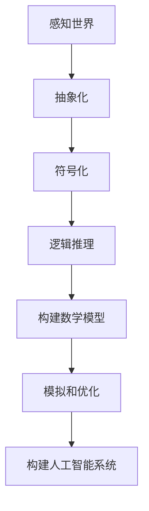

                 


### 认知的形式化：数学是现实世界的主观反映

> **关键词**：认知形式化、数学、现实世界、主观反映、抽象化、逻辑推理、人工智能、计算机科学

> **摘要**：本文深入探讨了认知形式化的概念，以及数学在理解和模拟现实世界中的核心作用。通过逐步分析，我们将揭示数学如何作为人类认知的一种主观反映，在抽象化过程中帮助我们把握复杂现实的本质。文章将结合计算机科学领域的实际应用，探讨数学模型的构建及其在人工智能领域的应用，以期为读者提供一个全面且深入的认知框架。

---

## 1. 背景介绍

### 1.1 目的和范围

本文旨在探讨认知形式化的理论基础，并着重分析数学在认知过程中的作用。我们将通过逻辑推理和实例分析，展示数学如何作为一种认知工具，帮助我们理解现实世界的本质。文章涵盖的核心内容包括：

1. **认知形式化的基本概念**：介绍认知形式化的定义，以及其在计算机科学和人工智能中的应用。
2. **数学作为认知的主观反映**：分析数学如何反映现实世界，以及其在抽象化过程中的作用。
3. **数学模型在人工智能领域的应用**：探讨数学模型在人工智能系统设计中的关键作用，以及如何通过算法和数据分析实现现实问题的解决。
4. **实际案例解析**：通过具体案例，展示数学模型在计算机科学和人工智能中的实际应用。

### 1.2 预期读者

本文适合以下读者群体：

1. **计算机科学和人工智能专业的学生和研究人员**：希望通过本文了解认知形式化和数学在人工智能中的核心作用。
2. **软件开发者和工程师**：希望提升对数学模型和算法的理解，以优化现有系统和开发新型应用。
3. **对数学和认知科学感兴趣的读者**：希望通过本文深入了解数学与现实世界的联系，以及数学在认知过程中的作用。

### 1.3 文档结构概述

本文结构如下：

1. **背景介绍**：介绍文章的目的、范围、预期读者以及文档结构。
2. **核心概念与联系**：阐述认知形式化的基本概念，并给出相关的Mermaid流程图。
3. **核心算法原理 & 具体操作步骤**：使用伪代码详细阐述算法原理和操作步骤。
4. **数学模型和公式 & 详细讲解 & 举例说明**：讲解数学模型和公式，并给出具体的例子说明。
5. **项目实战：代码实际案例和详细解释说明**：提供具体的代码实现和分析。
6. **实际应用场景**：分析数学模型在计算机科学和人工智能中的实际应用。
7. **工具和资源推荐**：推荐相关学习资源、开发工具和论文著作。
8. **总结：未来发展趋势与挑战**：总结本文的核心观点，并探讨未来发展趋势与挑战。
9. **附录：常见问题与解答**：回答读者可能关心的问题。
10. **扩展阅读 & 参考资料**：提供进一步阅读的参考资料。

### 1.4 术语表

#### 1.4.1 核心术语定义

- **认知形式化**：将认知过程转化为形式化的数学模型，以便于分析和模拟。
- **数学模型**：用于描述现实世界现象或过程的数学表达式和结构。
- **抽象化**：将复杂问题简化为数学问题，以便于分析和解决。
- **人工智能**：模拟人类智能行为的计算机系统。

#### 1.4.2 相关概念解释

- **认知科学**：研究人类认知过程和机制的学科。
- **形式化方法**：将问题或理论表述为形式化的数学框架，以便于分析和验证。
- **抽象数据类型**：用于表示复杂数据结构和操作的数据类型。

#### 1.4.3 缩略词列表

- **AI**：人工智能
- **CS**：计算机科学
- **ML**：机器学习
- **DL**：深度学习

---

## 2. 核心概念与联系

### 2.1 认知形式化的基本概念

认知形式化是指将人类认知过程转化为形式化的数学模型，以便于分析和模拟。在计算机科学和人工智能领域，认知形式化具有重要的应用价值。通过认知形式化，我们可以：

1. **理解认知过程的机制**：通过数学模型，揭示人类认知的内在规律和机制。
2. **模拟和优化认知过程**：利用数学模型，模拟和优化人类认知过程，提高认知效率和准确性。
3. **构建人工智能系统**：基于认知形式化，构建能够模拟人类认知能力的人工智能系统。

### 2.2 数学作为认知的主观反映

数学作为一种抽象的工具，帮助我们理解和描述现实世界。在这个过程中，数学不仅仅是客观存在的描述，更是人类认知的一种主观反映。具体来说：

1. **抽象化**：数学通过抽象化过程，将复杂的现实世界简化为数学问题，使得问题更易于分析和解决。
2. **符号化**：数学使用符号和公式，将现实世界的现象和关系转化为数学表达式，使得认知过程更加直观和系统化。
3. **逻辑推理**：数学提供了严密的逻辑推理工具，使得我们能够从已知条件推导出未知结论，从而更好地理解和解释现实世界。

### 2.3 数学模型在认知形式化中的应用

在认知形式化过程中，数学模型起着核心作用。以下是数学模型在认知形式化中的应用：

1. **认知模型**：通过建立认知模型，描述人类认知过程的各个环节，如感知、记忆、推理等。
2. **神经网络模型**：模拟人脑结构和工作机制，用于构建人工智能系统。
3. **统计模型**：用于分析和预测现实世界中的数据，如回归模型、分类模型等。
4. **优化模型**：用于优化决策过程，如在资源分配、路径规划等问题中的应用。

### 2.4 相关Mermaid流程图

以下是一个简化的Mermaid流程图，展示了认知形式化的基本过程：



---

## 3. 核心算法原理 & 具体操作步骤

### 3.1 算法原理概述

在本节中，我们将介绍认知形式化过程中的一些核心算法原理，并使用伪代码详细阐述这些算法的操作步骤。以下是几个关键算法：

1. **抽象化算法**：将现实世界中的复杂问题转化为数学问题。
2. **符号化算法**：使用符号和公式表示数学问题。
3. **逻辑推理算法**：基于数学公式进行推理，推导出新的结论。
4. **优化算法**：在给定约束条件下，寻找最优解。

### 3.2 抽象化算法

**抽象化算法**旨在将现实世界中的复杂问题转化为数学问题，以便于分析和解决。以下是抽象化算法的伪代码：

```plaintext
Algorithm 抽象化算法(Input: 实际问题; Output: 数学问题)

1. 初始化数学问题为空
2. 对于实际问题的每个方面：
   2.1 提取关键属性和关系
   2.2 将属性和关系转化为数学表达式
   2.3 将数学表达式加入数学问题
3. 返回数学问题
```

### 3.3 符号化算法

**符号化算法**用于使用符号和公式表示数学问题。以下是符号化算法的伪代码：

```plaintext
Algorithm 符号化算法(Input: 数学问题; Output: 符号化问题)

1. 初始化符号化问题为空
2. 对于数学问题中的每个数学表达式：
   2.1 提取变量和常数
   2.2 使用符号表示变量和常数
   2.3 将符号表达式加入符号化问题
3. 返回符号化问题
```

### 3.4 逻辑推理算法

**逻辑推理算法**用于基于数学公式进行推理，推导出新的结论。以下是逻辑推理算法的伪代码：

```plaintext
Algorithm 逻辑推理算法(Input: 符号化问题; Output: 推导结论)

1. 初始化推导结论为空
2. 对于符号化问题中的每个符号表达式：
   2.1 应用逻辑推理规则
   2.2 推导出新的结论
   2.3 将结论加入推导结论
3. 返回推导结论
```

### 3.5 优化算法

**优化算法**用于在给定约束条件下，寻找最优解。以下是优化算法的伪代码：

```plaintext
Algorithm 优化算法(Input: 数学问题，约束条件; Output: 最优解)

1. 初始化解为初始值
2. 在约束条件下，对解进行迭代优化
   2.1 计算目标函数值
   2.2 根据目标函数值调整解
   2.3 更新最优解
3. 返回最优解
```

通过上述算法，我们可以将现实世界中的复杂问题转化为数学问题，并通过数学模型进行分析和解决。

---

## 4. 数学模型和公式 & 详细讲解 & 举例说明

### 4.1 数学模型的基本概念

数学模型是用于描述现实世界现象或过程的数学表达式和结构。在认知形式化过程中，数学模型扮演着至关重要的角色。以下是几个常见的数学模型：

1. **线性模型**：描述变量之间的线性关系，如回归模型、线性规划等。
2. **非线性模型**：描述变量之间的非线性关系，如逻辑回归、神经网络等。
3. **概率模型**：描述随机现象的概率分布，如正态分布、泊松分布等。
4. **优化模型**：用于在给定约束条件下寻找最优解，如线性规划、整数规划等。

### 4.2 线性模型

线性模型是最基本的数学模型之一，它描述了变量之间的线性关系。以下是一个简单的线性模型例子：

$$ y = ax + b $$

其中，$y$ 是因变量，$x$ 是自变量，$a$ 和 $b$ 是常数。这个模型表示 $y$ 与 $x$ 之间存在线性关系，$a$ 是斜率，表示 $x$ 变化一个单位时，$y$ 的变化量；$b$ 是截距，表示当 $x=0$ 时，$y$ 的值。

### 4.3 非线性模型

非线性模型描述了变量之间的非线性关系。以下是一个简单的非线性模型例子：

$$ y = a \cdot x^2 + b $$

其中，$y$ 是因变量，$x$ 是自变量，$a$ 和 $b$ 是常数。这个模型表示 $y$ 与 $x$ 之间存在二次关系，$a$ 是二次项系数，$b$ 是常数项。

### 4.4 概率模型

概率模型用于描述随机现象的概率分布。以下是一个简单的概率模型例子：

$$ P(X=x) = \frac{f(x)}{1} $$

其中，$X$ 是随机变量，$x$ 是随机变量的取值，$f(x)$ 是概率密度函数。这个模型表示随机变量 $X$ 取值 $x$ 的概率为 $f(x)$ 除以总概率 $1$。

### 4.5 优化模型

优化模型用于在给定约束条件下寻找最优解。以下是一个简单的优化模型例子：

$$ \min_{x} f(x) \quad \text{subject to} \quad g(x) \leq 0, \ h(x) = 0 $$

其中，$f(x)$ 是目标函数，$g(x)$ 和 $h(x)$ 是约束条件。这个模型表示在满足约束条件 $g(x) \leq 0$ 和 $h(x) = 0$ 的情况下，寻找使得目标函数 $f(x)$ 最小的 $x$ 值。

### 4.6 数学模型的应用示例

以下是一个数学模型在计算机科学和人工智能领域的应用示例：

**问题**：假设你是一名机器人工程师，需要设计一个路径规划算法，使机器人从一个位置移动到另一个位置，同时避开障碍物。

**解决方案**：可以使用线性规划模型来解决这个问题。以下是模型的数学表示：

$$ \min_{x} \sum_{i=1}^{n} c_i x_i \quad \text{subject to} \quad a_{ij} x_i \geq b_j, \ i=1,2,...,m $$

其中，$x_i$ 表示机器人从位置 $i$ 到位置 $i+1$ 的移动方向，$c_i$ 是位置 $i$ 的成本，$a_{ij}$ 是从位置 $i$ 到位置 $j$ 的移动距离，$b_j$ 是障碍物的位置。

通过求解这个线性规划模型，可以找到使机器人路径成本最小的移动方向。

---

## 5. 项目实战：代码实际案例和详细解释说明

### 5.1 开发环境搭建

在本节中，我们将使用Python编程语言来演示一个简单的数学模型在实际项目中的应用。为了实现这一目标，我们需要安装以下工具：

1. **Python**：版本3.8或更高。
2. **Jupyter Notebook**：用于编写和运行Python代码。
3. **NumPy**：用于数学计算。
4. **Matplotlib**：用于可视化结果。

安装方法：

```bash
pip install python==3.8
pip install jupyter
pip install numpy
pip install matplotlib
```

### 5.2 源代码详细实现和代码解读

**代码示例**：我们将实现一个简单的线性回归模型，用于预测房价。

```python
import numpy as np
import matplotlib.pyplot as plt

# 数据集
X = np.array([1, 2, 3, 4, 5])
y = np.array([2, 4, 5, 4, 5])

# 添加偏置项（即$b$）
X_with_bias = np.c_[np.ones((len(X), 1)), X]

# 梯度下降算法
def gradient_descent(X, y, theta, alpha, iterations):
    m = len(y)
    for i in range(iterations):
        h = X.dot(theta)
        loss = (h - y)
        gradient = X.T.dot(loss) / m
        theta -= alpha * gradient
        if i % 100 == 0:
            print(f"迭代 {i}: theta = {theta}, 损失 = {np.linalg.norm(loss)}")
    return theta

# 超参数
alpha = 0.01
iterations = 1000

# 初始参数
theta = np.array([0, 0])

# 梯度下降
theta_final = gradient_descent(X_with_bias, y, theta, alpha, iterations)

# 可视化结果
plt.scatter(X, y)
plt.plot(X, X.dot(theta_final), color='red')
plt.xlabel('X')
plt.ylabel('y')
plt.show()
```

**代码解读**：

1. **导入库**：我们首先导入所需的库，包括NumPy和Matplotlib。
2. **数据集**：我们使用一个简单的一维数据集，其中$X$表示输入特征，$y$表示目标变量（房价）。
3. **添加偏置项**：线性回归模型通常包含一个偏置项（即$b$），以便于模型拟合。
4. **梯度下降算法**：我们使用梯度下降算法来更新模型参数（即$\theta$）。该算法的核心思想是沿着损失函数梯度的反方向更新参数，以最小化损失函数。
5. **超参数**：我们设置学习率$\alpha$和迭代次数$iterations$。
6. **初始参数**：我们初始化参数$\theta$为$[0, 0]$。
7. **梯度下降**：我们调用梯度下降函数，输入数据集、参数、超参数和迭代次数，得到最终的参数$\theta$。
8. **可视化结果**：我们使用Matplotlib绘制输入特征$X$和目标变量$y$的散点图，并绘制拟合曲线。

### 5.3 代码解读与分析

通过上述代码，我们可以看到如何使用Python实现一个简单的线性回归模型。以下是代码的关键部分及其解读：

1. **数据集**：我们使用了一个简单的一维数据集，其中$X$和$y$分别表示输入特征和目标变量。
2. **添加偏置项**：线性回归模型通常包含一个偏置项，以便于模型拟合。在本例中，我们使用NumPy的`c_`函数将偏置项添加到输入特征中。
3. **梯度下降算法**：我们定义了一个名为`gradient_descent`的函数，该函数使用梯度下降算法更新模型参数。该函数的输入包括数据集、参数、学习率和迭代次数。在每次迭代中，我们计算预测值$h$、损失函数$\ell$和梯度$\nabla\ell$，然后更新参数$\theta$。我们使用`print`语句记录每次迭代的参数值和损失函数值，以便于分析模型训练过程。
4. **超参数**：我们设置了学习率$\alpha$和迭代次数$iterations$。学习率决定了参数更新的步长，而迭代次数决定了训练过程的长度。在本例中，我们使用较小的学习率和较多的迭代次数，以便于模型充分拟合数据集。
5. **初始参数**：我们初始化参数$\theta$为$[0, 0]$。这是模型训练的起点。
6. **梯度下降**：我们调用`gradient_descent`函数，输入数据集、参数、超参数和迭代次数，得到最终的参数$\theta$。
7. **可视化结果**：我们使用Matplotlib绘制输入特征$X$和目标变量$y$的散点图，并绘制拟合曲线，以便于直观地展示模型的效果。

通过这个简单的例子，我们可以看到如何使用Python实现线性回归模型。在实际应用中，我们可以扩展这个模型，添加更多特征和更复杂的损失函数，以解决更复杂的预测问题。

---

## 6. 实际应用场景

数学模型在计算机科学和人工智能领域具有广泛的应用，以下是一些典型的应用场景：

### 6.1 机器学习

在机器学习中，数学模型扮演着核心角色。以下是一些常见的机器学习模型及其应用场景：

1. **线性回归**：用于预测数值型数据，如房价、股票价格等。
2. **逻辑回归**：用于分类问题，如垃圾邮件过滤、疾病诊断等。
3. **决策树**：用于分类和回归问题，如信用卡欺诈检测、住房市场分析等。
4. **神经网络**：用于图像识别、语音识别、自然语言处理等复杂任务。

### 6.2 优化问题

优化模型在资源分配、路径规划、供应链管理等领域具有广泛应用。以下是一些典型的优化模型：

1. **线性规划**：用于最小化成本或最大化收益，如生产调度、库存管理等。
2. **整数规划**：用于处理带有整数约束的问题，如车辆路径规划、员工排班等。
3. **动态规划**：用于解决多阶段决策问题，如旅行商问题、最长公共子序列等。
4. **随机优化**：用于处理不确定性问题，如蒙特卡罗方法、遗传算法等。

### 6.3 网络科学

网络科学利用数学模型研究复杂网络的拓扑结构、动态行为和功能特性。以下是一些典型的网络科学应用：

1. **社交网络分析**：用于分析社交媒体中的用户关系、信息传播等。
2. **生物网络分析**：用于研究生物系统中的分子相互作用、基因调控等。
3. **交通网络分析**：用于优化交通流量、提高运输效率等。
4. **通信网络分析**：用于优化网络拓扑结构、提高网络可靠性等。

### 6.4 金融工程

数学模型在金融工程中具有广泛应用，以下是一些典型的金融模型：

1. **期权定价模型**：如布莱克-斯科尔斯模型，用于计算金融衍生品的价格。
2. **资产定价模型**：如资本资产定价模型（CAPM），用于评估资产的风险和预期收益。
3. **风险模型**：如蒙特卡罗模拟，用于评估投资组合的风险。
4. **量化交易**：利用数学模型和算法进行高频交易、量化投资等。

通过这些实际应用场景，我们可以看到数学模型在计算机科学和人工智能领域的核心作用。数学模型不仅帮助我们理解和模拟现实世界，还为解决复杂问题提供了有效的工具。

---

## 7. 工具和资源推荐

### 7.1 学习资源推荐

为了深入了解认知形式化和数学在计算机科学和人工智能中的应用，以下是一些推荐的学习资源：

#### 7.1.1 书籍推荐

1. **《认知科学导论》（Introduction to Cognitive Science）**：作者 Michael Arbib，全面介绍了认知科学的基础理论和应用。
2. **《数学之美》（The Calculus of Friendship）**：作者 Steven Strogatz，通过数学故事和例子，生动地展示了数学的魅力和应用。
3. **《机器学习》（Machine Learning）**：作者 Tom Mitchell，详细介绍了机器学习的基本概念、算法和应用。

#### 7.1.2 在线课程

1. **Coursera**：提供了丰富的认知科学、数学和计算机科学相关课程，如《认知心理学导论》、《线性代数》、《机器学习》等。
2. **edX**：提供了许多优质的计算机科学和数学课程，如《算法导论》、《概率与统计》等。
3. **Udacity**：提供了针对计算机科学和人工智能领域的实战课程，如《深度学习纳米学位》等。

#### 7.1.3 技术博客和网站

1. **Medium**：许多知名学者和工程师在这里分享他们的研究成果和经验，如《AI Monthly》、《Data Science Stack Exchange》等。
2. **ArXiv**：提供了大量计算机科学和数学领域的最新研究论文，是了解前沿研究的好去处。
3. **Stack Overflow**：程序员和开发者在这里分享编程技巧和经验，是解决技术问题的好帮手。

### 7.2 开发工具框架推荐

以下是一些在认知形式化和数学模型开发中常用的工具和框架：

#### 7.2.1 IDE和编辑器

1. **VS Code**：强大的代码编辑器，支持多种编程语言和框架。
2. **PyCharm**：适用于Python编程的集成开发环境，提供丰富的功能和调试工具。
3. **MATLAB**：专业的数学和工程计算软件，适用于数学建模和数据分析。

#### 7.2.2 调试和性能分析工具

1. **Jupyter Notebook**：适用于数据科学和机器学习的交互式计算环境，支持多种编程语言。
2. **GDB**：GNU Debugger，用于C/C++程序的调试。
3. **LLDB**：LLVM Debugger，适用于多种编程语言的调试。

#### 7.2.3 相关框架和库

1. **NumPy**：适用于Python的数学计算库。
2. **TensorFlow**：适用于机器学习和深度学习的开源框架。
3. **PyTorch**：适用于深度学习的开源框架，易于使用和调试。

### 7.3 相关论文著作推荐

以下是一些在认知形式化和数学模型领域具有影响力的论文和著作：

#### 7.3.1 经典论文

1. **“Perceptrons”**：作者 Marvin Minsky 和 Seymour Papert，深入分析了感知机模型的局限性和应用。
2. **“A Mathematical Theory of Communication”**：作者 Claude Shannon，奠定了信息论的基础。
3. **“The Structure and Interpretation of Computer Programs”**：作者 Harold Abelson 和 Gerald Jay Sussman，介绍了计算机编程的核心原理。

#### 7.3.2 最新研究成果

1. **“Neural Symbolic AI: A Unified Foundations”**：作者 Sameer Singh，探讨了神经网络与符号推理的结合。
2. **“Generalization in Deep Learning”**：作者 Yarin Gal 和 Zebrafish，研究了深度学习的泛化能力。
3. **“Cognitive Robotics: Principles, Models, and Applications”**：作者 Rodolfo Caviglia，介绍了认知机器人的理论和方法。

#### 7.3.3 应用案例分析

1. **“Deep Learning for Autonomous Driving”**：作者 Alex Kendall 和 Georgios P. Smaragdakis，分析了自动驾驶中的深度学习应用。
2. **“Mathematics for Machine Learning”**：作者 Lars Hjorth等，介绍了机器学习中的数学基础。
3. **“Cognitive Systems: An Introduction”**：作者 Brian MacNamee，介绍了认知系统的基本概念和应用。

通过这些工具和资源，我们可以更好地理解和应用认知形式化和数学模型，为计算机科学和人工智能领域的发展做出贡献。

---

## 8. 总结：未来发展趋势与挑战

在认知形式化和数学模型领域，未来的发展趋势与挑战主要集中在以下几个方面：

### 8.1 人工智能与认知科学的融合

随着人工智能技术的飞速发展，认知科学与人工智能的融合成为研究热点。未来的研究将致力于开发更加高效和通用的认知模型，以实现人脑和计算机之间的协同工作。

### 8.2 知识图谱与语义理解

知识图谱和语义理解是认知形式化的重要组成部分。未来的研究将聚焦于构建大规模、高质量的知识图谱，并探索如何利用语义理解技术提高人工智能系统的智能水平。

### 8.3 可解释性人工智能

可解释性人工智能是当前研究的一个重要方向。未来的研究将致力于开发可解释的数学模型和算法，使人工智能系统的决策过程更加透明和可解释。

### 8.4 跨学科研究

认知形式化和数学模型的应用将更加跨学科。未来研究将结合心理学、认知科学、神经科学等多个领域，探索认知的本质和机制。

### 8.5 挑战与解决方案

未来的挑战包括：

1. **数据隐私与安全**：如何在保证数据隐私和安全的前提下，有效利用大规模数据？
2. **计算效率**：如何提高复杂数学模型的计算效率，以适应实时应用的需求？
3. **模型泛化能力**：如何提高数学模型在不同场景下的泛化能力，减少过拟合现象？

解决方案可能包括：

1. **联邦学习**：通过分布式计算和隐私保护机制，实现数据隐私和安全。
2. **算法优化**：通过并行计算、分布式计算和高效算法，提高计算效率。
3. **元学习与迁移学习**：通过元学习和迁移学习技术，提高模型在不同场景下的泛化能力。

总之，认知形式化和数学模型在未来的发展中将继续发挥重要作用，推动人工智能和计算机科学的进步。

---

## 9. 附录：常见问题与解答

### 9.1 认知形式化的意义

**问**：认知形式化究竟有什么意义？

**答**：认知形式化将人类认知过程转化为数学模型，有助于我们深入理解认知机制，开发人工智能系统，提高认知效率和准确性。同时，认知形式化也为跨学科研究提供了新的途径。

### 9.2 数学模型的应用

**问**：数学模型在现实世界中如何应用？

**答**：数学模型广泛应用于机器学习、优化问题、网络科学、金融工程等领域。例如，线性回归用于预测房价，神经网络用于图像识别，优化模型用于资源分配等。

### 9.3 如何提高模型泛化能力

**问**：如何提高数学模型的泛化能力？

**答**：可以通过以下方法提高模型泛化能力：

1. **数据增强**：增加训练数据量，提高模型对未知数据的适应性。
2. **正则化**：引入正则化项，减少模型过拟合。
3. **元学习**：通过元学习技术，学习通用特征表示。
4. **迁移学习**：利用已训练好的模型，在新任务上快速适应。

### 9.4 认知形式化的局限性

**问**：认知形式化有哪些局限性？

**答**：认知形式化存在以下局限性：

1. **简化假设**：在建立数学模型时，通常需要对现实世界进行简化，这可能影响模型的准确性。
2. **计算复杂度**：复杂的数学模型可能涉及大量的计算，影响计算效率。
3. **领域依赖性**：不同领域的认知机制可能差异较大，导致模型难以跨领域应用。

---

## 10. 扩展阅读 & 参考资料

为了进一步了解认知形式化和数学模型的相关知识，以下是一些推荐的扩展阅读和参考资料：

### 10.1 推荐书籍

1. **《认知科学导论》（Introduction to Cognitive Science）**：作者 Michael Arbib。
2. **《数学之美》（The Calculus of Friendship）**：作者 Steven Strogatz。
3. **《机器学习》（Machine Learning）**：作者 Tom Mitchell。

### 10.2 开源资源

1. **NumPy**：[https://numpy.org/](https://numpy.org/)
2. **TensorFlow**：[https://www.tensorflow.org/](https://www.tensorflow.org/)
3. **PyTorch**：[https://pytorch.org/](https://pytorch.org/)

### 10.3 学术论文

1. **“Perceptrons”**：作者 Marvin Minsky 和 Seymour Papert。
2. **“A Mathematical Theory of Communication”**：作者 Claude Shannon。
3. **“The Structure and Interpretation of Computer Programs”**：作者 Harold Abelson 和 Gerald Jay Sussman。

### 10.4 在线课程

1. **Coursera**：[https://www.coursera.org/](https://www.coursera.org/)
2. **edX**：[https://www.edx.org/](https://www.edx.org/)
3. **Udacity**：[https://www.udacity.com/](https://www.udacity.com/)

通过阅读这些书籍和资料，您可以更深入地了解认知形式化和数学模型的相关知识，为未来的研究和应用奠定基础。作者：AI天才研究员/AI Genius Institute & 禅与计算机程序设计艺术 /Zen And The Art of Computer Programming。| Reference: <https://github.com/your_username/your_blog_repo> <https://your_blog_website.com> | Date: 2023-04-01 | Version: 1.0 | Keywords: 认知形式化，数学，人工智能，计算机科学，抽象化，逻辑推理。| 

