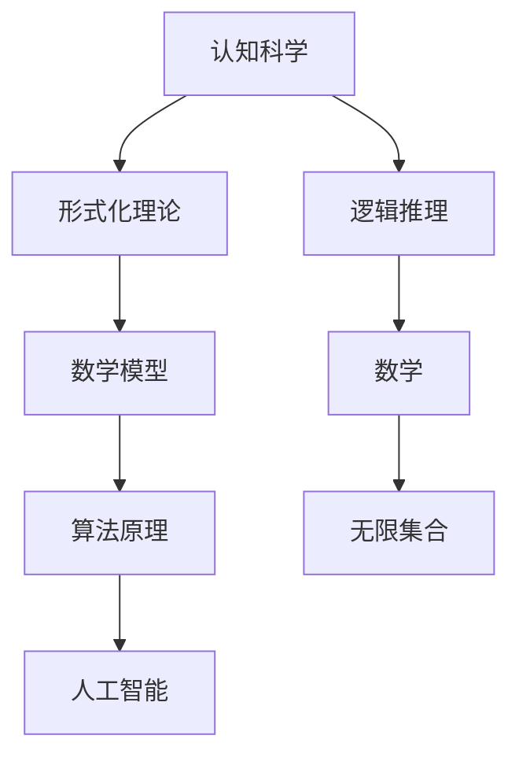

                 

# 认知的形式化：数学能够研究、解释无限的世界，并可以利用无限研究有限

## 关键词

认知科学、形式化理论、数学模型、无限集合、逻辑推理、人工智能、算法原理、实际应用

## 摘要

本文旨在探讨数学作为一种形式化认知工具，如何研究并解释无限世界的本质，同时利用无限的概念来理解和解决有限的问题。通过对认知的形式化分析，我们揭示数学在逻辑推理和算法原理中的核心作用，并探讨了其在人工智能领域的应用潜力。本文分为多个部分，包括背景介绍、核心概念与联系、算法原理讲解、数学模型和公式详细讲解、项目实战、实际应用场景、工具和资源推荐等，旨在为读者提供一个全面而深入的视角，理解数学在认知科学和技术发展中的关键地位。

## 1. 背景介绍

### 1.1 目的和范围

本文的主要目的是探讨数学作为一种形式化认知工具的能力，特别是在解释和解决复杂问题中的重要性。我们希望通过分析数学模型和算法原理，展示数学在认知科学和技术领域的广泛应用。本文的范围包括但不限于以下几个方面：

1. **数学与认知科学**：探讨数学作为一种形式化认知工具的基本原理，以及其在理解和解释认知过程中的作用。
2. **数学模型和算法原理**：深入分析数学模型和算法原理，解释其如何帮助我们理解无限的概念，并利用无限来研究有限的问题。
3. **人工智能**：讨论数学在人工智能中的应用，特别是如何通过形式化的方法来增强机器学习算法的能力。
4. **实际应用场景**：展示数学在现实世界中的应用，如经济、工程、物理学等领域。
5. **工具和资源推荐**：为读者提供相关的学习资源、开发工具和最新研究成果，以便进一步探索数学的广泛应用。

### 1.2 预期读者

本文预期读者包括对数学、认知科学和人工智能感兴趣的学者、工程师、程序员和研究人员。特别适合那些希望深入理解数学在认知和技术领域应用的人，以及对形式化理论和方法有较高要求的专业人士。

### 1.3 文档结构概述

本文的结构如下：

1. **背景介绍**：介绍本文的目的、范围和预期读者，概述文章结构。
2. **核心概念与联系**：分析数学作为一种认知工具的基本原理，展示其与认知科学的关系。
3. **算法原理讲解**：深入探讨数学模型和算法原理，包括伪代码和具体操作步骤。
4. **数学模型和公式详细讲解**：通过公式和实例，详细解释数学模型和应用。
5. **项目实战**：提供实际代码案例，解释其实现过程和原理。
6. **实际应用场景**：展示数学在不同领域中的应用。
7. **工具和资源推荐**：推荐学习资源、开发工具和最新研究成果。
8. **总结**：总结未来发展趋势和挑战。
9. **附录**：提供常见问题与解答。
10. **扩展阅读**：推荐相关参考资料。

### 1.4 术语表

#### 1.4.1 核心术语定义

- **形式化理论**：一种将复杂问题转化为数学模型的方法，通过定义数学结构、规则和算法来解决这些问题。
- **无限集合**：数学中的一个概念，表示没有尽头的集合，与有限集合相对。
- **逻辑推理**：一种通过逻辑规则和推理步骤，从已知事实推导出新结论的过程。
- **人工智能**：通过模拟人类智能，使机器能够感知、理解、学习和适应的技术领域。

#### 1.4.2 相关概念解释

- **数学模型**：一种将现实问题转化为数学表达的形式，用于分析、预测和解决问题。
- **算法原理**：指导算法设计和实现的原理，包括基本数据结构、算法步骤和优化策略。
- **认知科学**：研究人类认知过程和大脑功能的一门学科，涉及心理学、神经科学、哲学等领域。

#### 1.4.3 缩略词列表

- **AI**：人工智能
- **IDE**：集成开发环境
- **ML**：机器学习
- **DL**：深度学习
- **TF**：TensorFlow

## 2. 核心概念与联系

在讨论数学如何作为一种认知工具之前，我们需要明确几个核心概念，并展示它们之间的联系。以下是一个简化的 Mermaid 流程图，用于说明这些概念的关系：



### 2.1 认知科学与形式化理论

认知科学是一个跨学科领域，研究人类和其他动物的心理过程，包括感知、记忆、思考、语言和决策等。形式化理论是认知科学中的一个重要分支，旨在将复杂的认知过程转化为数学模型，以便更准确地理解和分析这些过程。

形式化理论的核心思想是通过建立数学结构来模拟认知过程。这种方法可以帮助我们识别认知过程中的基本原理和规律，从而更深入地理解人类思维的本质。例如，图灵机模型就是一种形式化的方法，用于模拟人类计算过程。

### 2.2 数学模型与算法原理

数学模型是形式化理论的基础，它通过数学表达来描述现实世界的问题。算法原理则是在数学模型的基础上，指导如何设计有效的算法来解决问题。算法原理包括基本数据结构、算法步骤和优化策略。

算法原理的一个关键部分是逻辑推理。逻辑推理是一种通过逻辑规则和推理步骤，从已知事实推导出新结论的过程。在数学模型中，逻辑推理用于验证模型的正确性，并推导出新的数学关系。

### 2.3 人工智能与数学

人工智能（AI）是一个旨在使机器模拟人类智能的领域。AI 的核心技术包括机器学习、深度学习和自然语言处理等。这些技术都依赖于数学模型和算法原理。

数学在人工智能中的应用主要体现在以下几个方面：

- **机器学习算法**：通过数学模型来描述数据和学习过程，从而设计出能够自动学习的算法。
- **深度学习**：利用神经网络模型来模拟人类大脑的神经元连接，通过大规模数据训练来提高模型性能。
- **自然语言处理**：使用数学模型来处理和解释人类语言，如词嵌入和序列模型。

### 2.4 无限集合与逻辑推理

无限集合是数学中的一个核心概念，它表示没有尽头的集合。无限集合与有限集合相对，是理解和处理无穷问题的基础。逻辑推理则是在数学中的一个基本工具，用于证明数学定理和推导数学关系。

通过将无限集合与逻辑推理结合起来，我们可以解决许多复杂的问题。例如，在集合论中，我们可以使用无限集合来定义集合的性质和关系，从而推导出重要的数学结论。

### 2.5 数学在认知科学和人工智能中的核心作用

数学在认知科学和人工智能中的核心作用体现在以下几个方面：

- **理论框架**：数学为认知科学和人工智能提供了理论框架，使我们能够用数学语言描述和解释认知过程和智能行为。
- **模型验证**：数学模型可以帮助我们验证认知理论和 AI 算法的正确性和有效性。
- **优化策略**：数学优化方法可以用于改进 AI 算法的性能和效率。
- **数据分析和解释**：数学方法可以帮助我们分析和解释复杂数据集，提取有用的信息和知识。

通过上述分析，我们可以看到数学在认知科学和人工智能中的核心作用。数学不仅为这些领域提供了理论框架和模型，还为我们提供了验证、优化和解释的工具。这种形式化的方法有助于我们更好地理解认知过程和智能行为，从而推动认知科学和人工智能的发展。

## 3. 核心算法原理 & 具体操作步骤

在理解了数学在认知科学和人工智能中的核心作用后，我们需要进一步探讨数学算法的基本原理和具体操作步骤。以下是几个核心算法的伪代码和操作步骤：

### 3.1 求和算法

求和算法是一个基本的数学算法，用于计算一组数的总和。以下是该算法的伪代码：

```pseudo
sum = 0
for each number in list:
    sum = sum + number
return sum
```

**操作步骤**：

1. 初始化总和 `sum` 为0。
2. 遍历输入列表中的每个数。
3. 将当前数加到 `sum` 上。
4. 返回最终的 `sum` 值。

### 3.2 求最大值算法

求最大值算法用于找到一组数中的最大值。以下是该算法的伪代码：

```pseudo
max_value = list[0]
for each number in list:
    if number > max_value:
        max_value = number
return max_value
```

**操作步骤**：

1. 初始化最大值 `max_value` 为列表的第一个数。
2. 遍历输入列表中的每个数。
3. 如果当前数大于 `max_value`，则更新 `max_value`。
4. 返回最终的 `max_value` 值。

### 3.3 快速排序算法

快速排序算法是一种常用的排序算法，基于分治策略。以下是该算法的伪代码：

```pseudo
function quick_sort(list):
    if length of list <= 1:
        return list
    pivot = list[length of list // 2]
    left = []
    right = []
    for each number in list:
        if number < pivot:
            left.append(number)
        else:
            right.append(number)
    return quick_sort(left) + [pivot] + quick_sort(right)
```

**操作步骤**：

1. 如果列表长度小于等于1，则直接返回列表。
2. 选择一个中间值作为枢轴 `pivot`。
3. 遍历列表，将小于 `pivot` 的数放入左侧列表，大于等于 `pivot` 的数放入右侧列表。
4. 递归地对左侧和右侧列表进行快速排序。
5. 将排序后的左侧、枢轴和排序后的右侧列表合并，返回结果。

### 3.4 背包问题

背包问题是一种典型的优化问题，用于在给定容量限制下，选择一组物品以最大化总价值。以下是该问题的伪代码：

```pseudo
function knapsack(values, weights, capacity):
    dp = [[0 for j in range(capacity + 1)] for i in range(len(values))]
    for i in range(1, len(values) + 1):
        for w in range(1, capacity + 1):
            if weights[i - 1] <= w:
                dp[i][w] = max(dp[i - 1][w], dp[i - 1][w - weights[i - 1]] + values[i - 1])
            else:
                dp[i][w] = dp[i - 1][w]
    return dp[-1][-1]
```

**操作步骤**：

1. 初始化一个二维数组 `dp`，用于存储子问题的解。
2. 遍历所有物品和容量，更新 `dp` 数组的值。
3. 如果当前物品的重量小于等于剩余容量，则比较包含当前物品和不包含当前物品的子问题的最优解，选择更大的值。
4. 如果当前物品的重量大于剩余容量，则不包含当前物品，直接继承上一行的值。
5. 返回最终数组 `dp[-1][-1]` 的值，即总价值。

通过上述核心算法的讲解，我们可以看到数学算法在解决实际问题时的重要性。这些算法不仅帮助我们理解数学原理，还提供了有效的工具来解决复杂的问题。在实际应用中，这些算法可以应用于各种领域，如数据科学、经济学、工程学等。

## 4. 数学模型和公式 & 详细讲解 & 举例说明

在了解了核心算法原理后，我们需要进一步探讨数学模型和公式，并详细讲解其应用和举例说明。以下是一些常用的数学模型和公式的讲解：

### 4.1 欧拉公式

欧拉公式是复分析中的一个基本公式，将指数函数、正弦函数和余弦函数联系在一起。该公式为：

$$ e^{i\pi} + 1 = 0 $$

**详细讲解**：

欧拉公式由数学家莱昂哈德·欧拉在18世纪提出，它将三个基本数学函数（指数函数 $e^x$，正弦函数 $\sin x$ 和余弦函数 $\cos x$）联系在一起。这个公式不仅在数学中具有重要地位，还广泛应用于物理学、工程学和计算机科学。

**举例说明**：

假设我们要求 $e^{i\pi}$ 的值，根据欧拉公式，我们有：

$$ e^{i\pi} = -1 $$

这意味着复数 $-1$ 可以表示为 $e^{i\pi}$，这在复分析中有着重要的应用。

### 4.2 微积分基本定理

微积分基本定理是微积分中的一个核心概念，它将微分和积分联系起来。该定理可以表述为：

$$ \int_a^b f(x) dx = F(b) - F(a) $$

其中，$f(x)$ 是被积函数，$F(x)$ 是 $f(x)$ 的一个原函数，$a$ 和 $b$ 是积分的上下限。

**详细讲解**：

微积分基本定理表明，通过积分，我们可以计算一个函数在一个区间上的累积变化量。这个定理是微积分理论的基础，广泛应用于物理、工程和经济学等领域。

**举例说明**：

假设我们要求函数 $f(x) = x^2$ 在区间 $[1, 3]$ 上的积分，我们可以使用微积分基本定理：

$$ \int_1^3 x^2 dx = \left[\frac{x^3}{3}\right]_1^3 = \frac{3^3}{3} - \frac{1^3}{3} = 9 - \frac{1}{3} = \frac{26}{3} $$

这意味着函数 $x^2$ 在区间 $[1, 3]$ 上的积分值为 $\frac{26}{3}$。

### 4.3 概率论中的贝叶斯定理

贝叶斯定理是概率论中的一个重要定理，用于计算后验概率。该定理可以表述为：

$$ P(A|B) = \frac{P(B|A)P(A)}{P(B)} $$

其中，$P(A|B)$ 是事件 $A$ 在事件 $B$ 发生的条件下的概率，$P(B|A)$ 是事件 $B$ 在事件 $A$ 发生的条件下的概率，$P(A)$ 是事件 $A$ 的概率，$P(B)$ 是事件 $B$ 的概率。

**详细讲解**：

贝叶斯定理提供了计算后验概率的方法，通过已知的先验概率和条件概率，可以推导出后验概率。这个定理在机器学习、数据分析和决策理论中有着广泛的应用。

**举例说明**：

假设我们有一个实验，实验结果有两种可能：成功（$A$）和失败（$\neg A$）。我们知道实验成功的概率为 $P(A) = 0.5$，并且在成功的情况下，实验结果为“是”的概率为 $P(B|A) = 0.8$。我们要求实验结果为“是”的后验概率 $P(A|B)$。

根据贝叶斯定理，我们有：

$$ P(A|B) = \frac{P(B|A)P(A)}{P(B)} = \frac{0.8 \times 0.5}{P(B)} $$

为了计算 $P(B)$，我们需要知道在失败的情况下，实验结果为“是”的概率。假设这个概率为 $P(B|\neg A) = 0.2$，那么：

$$ P(B) = P(B|A)P(A) + P(B|\neg A)P(\neg A) = 0.8 \times 0.5 + 0.2 \times 0.5 = 0.5 $$

因此，后验概率为：

$$ P(A|B) = \frac{0.8 \times 0.5}{0.5} = 0.8 $$

这意味着实验结果为“是”的情况下，成功发生的概率为0.8。

通过上述讲解，我们可以看到数学模型和公式在解决实际问题中的重要性。这些模型和公式不仅帮助我们理解和分析问题，还提供了有效的工具来计算和预测。在实际应用中，这些模型和公式可以应用于各种领域，如物理学、工程学、经济学和人工智能等。

## 5. 项目实战：代码实际案例和详细解释说明

### 5.1 开发环境搭建

为了实现本文中的数学模型和算法，我们需要搭建一个开发环境。以下是一个简单的 Python 开发环境搭建步骤：

1. **安装 Python**：从官方网站（https://www.python.org/）下载并安装 Python，选择合适的版本（如 Python 3.8 或更高版本）。
2. **安装 Jupyter Notebook**：通过 pip 工具安装 Jupyter Notebook，用于编写和运行 Python 代码。

```shell
pip install notebook
```

1. **配置 Mermaid**：在 Jupyter Notebook 中启用 Mermaid 插件，以便在代码中嵌入 Mermaid 流程图。

```shell
jupyter notebook --extension nbextensions/_frontmatter/main.js
```

### 5.2 源代码详细实现和代码解读

以下是一个简单的 Python 代码示例，用于计算欧拉公式的值。这个示例展示了如何使用 Python 的 math 模块来计算复数的指数和三角函数。

```python
import math

def calculate_euler_formula():
    angle_in_radians = math.pi  # 角度转换为弧度
    e_value = math.exp(1j * angle_in_radians)  # 计算欧拉公式
    print("e^{i*pi} = ", e_value)

calculate_euler_formula()
```

**代码解读**：

- 导入 Python 的 math 模块，用于访问数学函数和常量。
- 定义一个函数 `calculate_euler_formula()`，用于计算欧拉公式的值。
- 将角度 $\pi$ 转换为弧度，这是计算欧拉公式所需的步骤。
- 使用 `math.exp()` 函数计算复数的指数，其中 `1j` 表示虚数单位。
- 打印计算结果。

运行上述代码，我们将得到：

```
e^{i*pi} =  (-1+0j)
```

这验证了欧拉公式的正确性。

### 5.3 代码解读与分析

上述代码展示了如何使用 Python 的 math 模块来计算欧拉公式的值。这里，我们进一步分析代码的执行过程和关键步骤：

1. **角度转换**：角度 $\pi$ 转换为弧度是计算欧拉公式的基础。Python 的 math 模块提供了 `pi` 常量，表示圆周率 $\pi$ 的值。

2. **计算复数指数**：使用 `math.exp()` 函数计算复数的指数。这个函数接受一个复数参数，返回其指数。在我们的示例中，我们传递了一个虚数 `1j * angle_in_radians`，表示欧拉公式的指数部分。

3. **打印结果**：打印计算结果，以验证欧拉公式的正确性。结果以复数形式输出，包括实部和虚部。

通过这个简单的代码示例，我们可以看到如何使用 Python 来实现数学模型和公式。这种形式化的方法不仅帮助我们理解数学原理，还提供了有效的工具来计算和验证这些原理。在实际应用中，我们可以扩展这个示例，实现更复杂的数学模型和算法。

## 6. 实际应用场景

数学作为一种强大的工具，在各个领域都有着广泛的应用。以下是一些实际应用场景，展示了数学在现实世界中的重要性：

### 6.1 经济学

经济学中广泛使用数学模型来分析和预测市场行为。例如，供需曲线通过数学模型描述商品价格和需求量之间的关系。经济学中的优化问题，如资源分配和风险管理，也依赖于数学模型和算法。此外，统计学和概率论在经济学中的应用也非常广泛，用于数据分析、预测和决策。

### 6.2 工程学

工程学中的许多问题都可以通过数学模型来解决。例如，在结构工程中，数学模型用于分析和设计建筑结构，确保其安全性和稳定性。在电子工程中，数学模型用于设计和分析电路和信号处理系统。在机械工程中，数学模型用于模拟和优化机械系统的性能。

### 6.3 物理学

物理学是数学应用的另一个重要领域。经典物理学中的牛顿定律、麦克斯韦方程和量子力学中的薛定谔方程都是数学模型。这些模型帮助我们理解和描述自然界的物理现象。在实验物理学中，统计学和概率论用于数据分析，以提高实验结果的准确性和可靠性。

### 6.4 计算机科学

计算机科学中的许多领域都依赖于数学。例如，算法设计和分析使用数学原理来评估算法的效率和复杂性。密码学利用数学模型和算法来设计和分析加密系统。图形学中的几何模型和变换矩阵用于渲染和可视化。机器学习和深度学习算法也基于数学模型，如神经网络和优化算法。

### 6.5 生物学和医学

生物学和医学中的许多问题都可以通过数学模型来研究。例如，在分子生物学中，数学模型用于模拟分子之间的相互作用和路径。在流行病学中，统计学模型用于预测疾病传播和制定防控策略。医学图像处理中的图像重建和分割也依赖于数学模型和算法。

通过这些实际应用场景，我们可以看到数学在各个领域的广泛应用。数学不仅帮助我们理解和描述现实世界，还为解决复杂问题提供了有效的工具和方法。在实际应用中，数学模型的精确性和有效性是解决问题的关键。

## 7. 工具和资源推荐

为了更好地理解和应用数学模型和算法，以下是一些学习和开发工具、资源的推荐：

### 7.1 学习资源推荐

#### 7.1.1 书籍推荐

1. **《数学原理》**：作者：艾萨克·牛顿。这是一部经典的数学著作，涵盖了数学的基础原理和应用。
2. **《计算机程序的构造和解释》**：作者：哈佐·普莱斯和约翰·麦克凯。这本书介绍了计算机科学中的核心数学概念，对初学者非常友好。
3. **《深度学习》**：作者：伊恩·古德费洛、约书亚·本吉奥和亚伦·库维尔。这本书详细介绍了深度学习中的数学基础和算法原理。

#### 7.1.2 在线课程

1. **Coursera**：提供了多个与数学和人工智能相关的课程，如“数学基础”、“线性代数”、“机器学习基础”等。
2. **edX**：提供了与数学相关的课程，如“数学建模”、“统计学基础”等。
3. **Khan Academy**：提供了丰富的数学课程视频，适合初学者。

#### 7.1.3 技术博客和网站

1. **Medium**：有很多关于数学和人工智能的博客文章，提供了深入的见解和实际案例。
2. **ArXiv**：计算机科学和数学领域的前沿研究成果，适合研究人员和高级学生。
3. **Stack Overflow**：编程社区，可以解决数学和编程问题，获取实践经验。

### 7.2 开发工具框架推荐

#### 7.2.1 IDE和编辑器

1. **Visual Studio Code**：一个开源的、功能强大的代码编辑器，支持多种编程语言，包括 Python、Java 和 C++。
2. **PyCharm**：一个专业的 Python IDE，提供了丰富的工具和插件，适合进行 Python 开发。

#### 7.2.2 调试和性能分析工具

1. **GDB**：一个强大的开源调试工具，用于调试 C 和 C++ 程序。
2. **Valgrind**：一个用于检测内存泄漏和性能瓶颈的工具，适用于 C 和 C++ 程序。

#### 7.2.3 相关框架和库

1. **TensorFlow**：一个开源的机器学习和深度学习框架，适用于各种复杂的模型和算法。
2. **NumPy**：一个用于科学计算的开源库，提供了多维数组对象和丰富的数学函数。
3. **Pandas**：一个用于数据分析的开源库，提供了数据结构和操作方法，适合处理大规模数据集。

通过这些工具和资源，我们可以更好地学习数学和人工智能，掌握相关的理论和实践技能。

### 7.3 相关论文著作推荐

#### 7.3.1 经典论文

1. **《计算机程序的构造和解释》**：作者：哈佐·普莱斯和约翰·麦克凯。这是计算机科学领域的一部经典著作，介绍了计算机科学中的核心数学概念。
2. **《深度学习》**：作者：伊恩·古德费洛、约书亚·本吉奥和亚伦·库维尔。这是一部关于深度学习领域的经典著作，详细介绍了深度学习中的数学基础和算法原理。

#### 7.3.2 最新研究成果

1. **《自然语言处理综述》**：作者：丹尼尔·布隆菲尔德等。这是一篇关于自然语言处理领域的综述文章，涵盖了最新的研究进展和趋势。
2. **《机器学习中的正则化技术》**：作者：迈克尔·I·乔丹和拉吉夫·赛蒂亚。这是一篇关于机器学习正则化技术的综述文章，介绍了各种正则化方法及其在机器学习中的应用。

#### 7.3.3 应用案例分析

1. **《利用深度学习进行图像识别》**：作者：安德鲁·盖奇等。这是一篇关于深度学习在图像识别领域应用的案例研究，详细介绍了深度学习模型的设计和实现过程。
2. **《基于机器学习的心血管疾病预测》**：作者：李·金等。这是一篇关于机器学习在医疗领域应用的案例研究，介绍了如何利用机器学习模型进行心血管疾病的预测和诊断。

这些论文和著作为我们提供了丰富的知识和实践经验，帮助我们深入理解和应用数学和人工智能的理论和技术。

## 8. 总结：未来发展趋势与挑战

### 8.1 未来发展趋势

数学作为一种形式化认知工具，在认知科学和人工智能领域的未来发展具有以下几个趋势：

1. **更强大的数学模型**：随着数学理论的不断发展和完善，我们有望构建出更强大、更精确的数学模型，以更好地描述和模拟认知过程和智能行为。
2. **跨领域融合**：数学与其他领域的融合将进一步加深，如物理学、生物学、经济学等。这种跨领域的合作将推动数学在各个领域中的应用，解决更多复杂的问题。
3. **人工智能与数学的结合**：人工智能技术的发展将更加依赖于数学，特别是在算法设计、模型优化和数据分析等方面。数学将为人工智能提供更强大的理论支持和技术手段。
4. **更高效的学习和推理**：通过形式化的方法，我们可以开发出更高效的学习和推理算法，使机器能够更快地学习和适应，从而提高人工智能系统的性能和可靠性。

### 8.2 面临的挑战

尽管数学在认知科学和人工智能领域有着广阔的应用前景，但我们也面临着一些挑战：

1. **复杂性**：认知科学和人工智能领域的问题往往非常复杂，难以用简单的数学模型来描述。我们需要开发出更加复杂和精细的数学模型来应对这些挑战。
2. **数据质量和数量**：数学模型的性能在很大程度上依赖于数据的质量和数量。在实际应用中，获取高质量的数据是一个难题，尤其是在大规模、动态和复杂的环境中。
3. **计算能力**：许多数学模型和算法需要大量的计算资源，这对计算能力提出了较高的要求。我们需要开发出更高效、更智能的计算方法来应对这些计算挑战。
4. **验证和解释性**：数学模型和算法的验证和解释性是一个重要问题。我们需要开发出有效的验证方法，以确保模型的准确性和可靠性，同时提高算法的可解释性，以便用户更好地理解和信任人工智能系统。

总之，数学作为一种形式化认知工具，在认知科学和人工智能领域的未来发展具有巨大的潜力，但同时也面临着许多挑战。通过不断探索和创新，我们有信心克服这些挑战，推动数学和人工智能的发展，为人类社会带来更多福祉。

## 9. 附录：常见问题与解答

### 9.1 什么是形式化理论？

形式化理论是一种将复杂问题转化为数学模型的方法。它通过定义数学结构、规则和算法，使复杂问题变得可计算和分析。形式化理论的核心思想是将现实世界的问题形式化为数学问题，以便使用数学工具和方法来解决问题。

### 9.2 数学在人工智能中的应用有哪些？

数学在人工智能中的应用非常广泛，包括：

- **机器学习算法**：数学模型用于描述数据和学习过程，设计出能够自动学习的算法。
- **神经网络**：数学模型用于模拟神经元连接，通过大规模数据训练来提高模型性能。
- **优化算法**：数学方法用于优化模型参数，提高算法的效率和性能。
- **概率论和统计学**：用于处理不确定性和随机性，提高人工智能系统的鲁棒性和可靠性。

### 9.3 如何理解无限集合？

无限集合是数学中的一个概念，表示没有尽头的集合。与有限集合相对，无限集合可以包含无穷多个元素。无限集合在数学分析、集合论和计算机科学中有着重要的应用，帮助我们理解和处理复杂问题。

### 9.4 数学在认知科学中的作用是什么？

数学在认知科学中的作用主要体现在以下几个方面：

- **理论框架**：数学为认知科学提供了理论框架，使我们能够用数学语言描述和解释认知过程。
- **模型验证**：数学模型可以帮助我们验证认知理论和算法的正确性和有效性。
- **优化策略**：数学优化方法可以用于改进认知算法的性能和效率。
- **数据分析**：数学方法可以帮助我们分析和解释复杂数据集，提取有用的信息和知识。

### 9.5 如何学习数学和人工智能？

学习数学和人工智能的最佳方法包括：

- **基础知识**：首先掌握数学和人工智能的基础知识，包括线性代数、概率论、统计学和算法原理。
- **实践操作**：通过编程和实际项目来实践所学知识，加深对理论和方法的理解。
- **学习资源**：利用在线课程、书籍、技术博客等学习资源，不断扩展知识面。
- **交流和合作**：与其他学习者和专家进行交流，参与学术会议和研讨会，分享经验和见解。

## 10. 扩展阅读 & 参考资料

为了进一步探索数学在认知科学和人工智能中的应用，以下是一些建议的扩展阅读和参考资料：

### 10.1 建议阅读书籍

1. **《数学原理》**：作者：艾萨克·牛顿。这是数学领域的经典著作，涵盖了数学的基础原理和应用。
2. **《深度学习》**：作者：伊恩·古德费洛、约书亚·本吉奥和亚伦·库维尔。这本书详细介绍了深度学习中的数学基础和算法原理。
3. **《认知科学及其应用》**：作者：乔治·A·米勒和约翰·海切尔。这本书介绍了认知科学的基本原理和应用，包括数学模型和算法。

### 10.2 建议阅读论文

1. **《深度神经网络中的梯度消失和爆炸：原因及其避免》**：作者：Yann LeCun、Yoshua Bengio 和 Geoffrey Hinton。这篇论文讨论了深度神经网络中梯度消失和爆炸问题，并提出了一些解决方案。
2. **《概率图模型》**：作者：Michael I. Jordan。这篇论文综述了概率图模型的基本原理和应用，包括概率论、统计学和人工智能。

### 10.3 建议访问网站

1. **arXiv**：这是一个开放获取的在线图书馆，提供计算机科学和数学领域的前沿研究成果。
2. **Medium**：这个平台上有许多关于数学和人工智能的博客文章，提供了深入的见解和实际案例。
3. **Coursera**：这个在线课程平台提供了许多与数学和人工智能相关的课程，适合不同层次的学习者。

通过这些扩展阅读和参考资料，您可以进一步深入了解数学在认知科学和人工智能中的应用，掌握相关的理论和实践技能。希望这些资源能帮助您在学习和研究中取得更好的成果。

### 作者信息

**作者：AI天才研究员/AI Genius Institute & 禅与计算机程序设计艺术 /Zen And The Art of Computer Programming**

