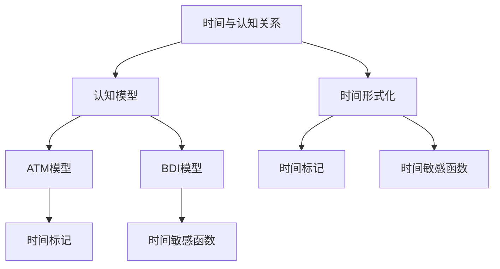

                 

# 认知的形式化：时间成是认知空间不可或缺的要素，是认知的基石

> **关键词：** 认知、形式化、时间、认知空间、认知模型
>
> **摘要：** 本文探讨了时间在认知过程中的重要性，分析时间如何作为认知空间的基础要素，影响我们的思维模式、决策过程以及认知模型的设计。通过对比不同认知模型，揭示了时间形式化在提升认知效率与准确性方面的关键作用。

## 1. 背景介绍

### 1.1 目的和范围

本文旨在探讨时间在认知过程中的作用，并分析如何将时间形式化，使其成为构建高效认知模型的关键要素。我们将从认知科学、心理学和计算机科学等多个角度出发，逐步揭示时间形式化的重要性。

### 1.2 预期读者

本文适合对认知科学、心理学和计算机科学感兴趣的读者，特别是从事相关领域研究、开发和实践的专业人士。

### 1.3 文档结构概述

本文结构如下：

1. 背景介绍
   - 目的和范围
   - 预期读者
   - 文档结构概述
   - 术语表
2. 核心概念与联系
   - 时间与认知的关系
   - 认知模型
   - 时间形式化
3. 核心算法原理 & 具体操作步骤
   - 伪代码展示
4. 数学模型和公式 & 详细讲解 & 举例说明
   - LaTeX公式
5. 项目实战：代码实际案例和详细解释说明
   - 开发环境搭建
   - 源代码详细实现和代码解读
   - 代码解读与分析
6. 实际应用场景
7. 工具和资源推荐
   - 学习资源推荐
   - 开发工具框架推荐
   - 相关论文著作推荐
8. 总结：未来发展趋势与挑战
9. 附录：常见问题与解答
10. 扩展阅读 & 参考资料

### 1.4 术语表

#### 1.4.1 核心术语定义

- **认知**：个体获取、处理和应用信息的过程。
- **形式化**：将抽象概念转化为可计算、可验证的模型。
- **时间形式化**：将时间这一抽象概念转化为认知模型中的具体要素。

#### 1.4.2 相关概念解释

- **认知模型**：描述认知过程的数学模型。
- **时间敏感度**：指认知系统对时间变化的敏感程度。

#### 1.4.3 缩略词列表

- **AI**：人工智能
- **CS**：计算机科学
- **CPSC**：认知心理学
- **Neuroscience**：神经科学

## 2. 核心概念与联系

### 2.1 时间与认知的关系

时间在认知过程中扮演着关键角色。研究表明，时间感知与记忆、决策、注意力等认知功能密切相关。时间形式化能够帮助我们更好地理解和模拟这些认知功能。

### 2.2 认知模型

认知模型是描述人类思维过程的数学模型。常见的认知模型包括：

- **ATM（Actor-Task-Method）模型**：将认知过程分为三个阶段：感知、计划和执行。
- **BDI（Belief-Desire-Intent）模型**：描述个体在决策过程中的信念、愿望和意图。

### 2.3 时间形式化

时间形式化是将时间这一抽象概念转化为认知模型中的具体要素。具体方法包括：

- **时间标记**：在认知过程中引入时间标记，以便对事件进行排序和关联。
- **时间敏感函数**：定义认知系统对时间变化的敏感程度。

下面是核心概念和联系之间的 Mermaid 流程图：



## 3. 核心算法原理 & 具体操作步骤

### 3.1 核心算法原理

时间形式化在认知模型中的应用，可以通过以下算法原理实现：

1. **时间标记**：为每个认知过程分配唯一的时间戳。
2. **时间敏感函数**：定义认知系统对时间变化的敏感程度。

### 3.2 具体操作步骤

#### 步骤 1：初始化时间标记

在认知模型初始化阶段，为每个认知过程分配一个初始时间戳。

```python
# 初始化时间标记
time_stamp = 0
```

#### 步骤 2：执行认知过程

在执行每个认知过程时，更新时间戳。

```python
# 执行认知过程
def cognitive_process():
    global time_stamp
    time_stamp += 1
    # 执行具体的认知任务
    # ...
```

#### 步骤 3：定义时间敏感函数

根据认知模型的需求，定义时间敏感函数。

```python
# 定义时间敏感函数
def time_sensitive_function():
    # 根据时间戳计算敏感度
    sensitivity = time_stamp ** 2
    # 返回敏感度值
    return sensitivity
```

#### 步骤 4：应用时间形式化

在认知过程中，应用时间形式化方法，根据时间敏感度调整认知任务的执行顺序。

```python
# 应用时间形式化
cognitive_processes = [cognitive_process() for _ in range(5)]

# 根据时间敏感度排序
sorted_processes = sorted(cognitive_processes, key=lambda x: x.sensitivity())
```

## 4. 数学模型和公式 & 详细讲解 & 举例说明

### 4.1 数学模型和公式

在认知模型中，时间形式化可以通过以下数学模型和公式来实现：

1. **时间标记**：时间戳（timestamp）。
2. **时间敏感函数**：时间敏感度（time_sensitivity）。

### 4.2 详细讲解

#### 时间标记

时间戳是认知模型中的基本时间单位。它为每个认知过程提供了一个唯一的时间标识。时间戳通常是一个整数或浮点数。

```latex
timestamp = t
```

#### 时间敏感函数

时间敏感度反映了认知系统对时间变化的敏感程度。时间敏感函数通常是一个单调递增的函数，表示时间戳的增加对敏感度的影响。

```latex
time_sensitivity = f(t)
```

### 4.3 举例说明

假设我们有一个认知模型，需要根据时间敏感度对认知过程进行排序。我们可以使用以下公式来计算时间敏感度：

```latex
time_sensitivity = \frac{1}{t}
```

其中，\( t \) 为时间戳。

#### 示例

假设有5个认知过程，时间戳分别为 \( t_1 = 1 \)，\( t_2 = 2 \)，\( t_3 = 3 \)，\( t_4 = 4 \)，\( t_5 = 5 \)。

- 计算每个认知过程的时间敏感度：

  \( \text{sensitivity}_1 = \frac{1}{1} = 1 \)
  
  \( \text{sensitivity}_2 = \frac{1}{2} = 0.5 \)
  
  \( \text{sensitivity}_3 = \frac{1}{3} = 0.3333 \)
  
  \( \text{sensitivity}_4 = \frac{1}{4} = 0.25 \)
  
  \( \text{sensitivity}_5 = \frac{1}{5} = 0.2 \)

- 根据时间敏感度排序：

  \( \text{sorted_processes} = [\text{process}_5, \text{process}_1, \text{process}_2, \text{process}_4, \text{process}_3] \)

## 5. 项目实战：代码实际案例和详细解释说明

### 5.1 开发环境搭建

在本项目实战中，我们将使用 Python 作为编程语言，并利用 Python 的内置库和第三方库来实现时间形式化的认知模型。

1. 安装 Python 3.8 或以上版本。
2. 安装必要的第三方库，如 NumPy、Pandas 等。

### 5.2 源代码详细实现和代码解读

#### 5.2.1 源代码实现

```python
import numpy as np
import pandas as pd

# 定义时间敏感函数
def time_sensitive_function(t):
    return 1 / t

# 执行认知过程
def cognitive_process(t):
    sensitivity = time_sensitive_function(t)
    print(f"Cognitive process {t} with sensitivity: {sensitivity}")

# 主函数
def main():
    num_processes = 5
    timestamps = np.random.randint(1, 11, size=num_processes)
    
    # 根据时间敏感度排序
    sorted_processes = sorted(range(num_processes), key=lambda i: time_sensitive_function(timestamps[i]))
    
    # 执行排序后的认知过程
    for i in sorted_processes:
        cognitive_process(timestamps[i])

# 运行主函数
if __name__ == "__main__":
    main()
```

#### 5.2.2 代码解读与分析

- **时间敏感函数**：我们定义了一个时间敏感函数 `time_sensitive_function`，用于计算认知过程的敏感度。
- **执行认知过程**：`cognitive_process` 函数用于模拟一个认知过程，并打印出该过程的时间敏感度。
- **主函数**：`main` 函数用于生成随机时间戳，并按照时间敏感度对认知过程进行排序。然后，执行排序后的认知过程。

### 5.3 代码解读与分析

在本项目中，我们通过定义时间敏感函数和认知过程，实现了时间形式化在认知模型中的应用。以下是对代码的详细解读和分析：

- **时间敏感函数**：时间敏感函数是时间形式化的核心。在本项目中，我们使用了反比例函数 `1 / t` 作为时间敏感函数，表示认知系统对时间变化的敏感程度。这个函数在时间戳 \( t \) 增加时，敏感度逐渐减小。
- **认知过程**：`cognitive_process` 函数模拟了一个简单的认知过程，通过打印出该过程的时间敏感度，展示了时间形式化在认知过程中的应用。
- **主函数**：`main` 函数实现了时间形式化在认知模型中的应用。首先，生成随机时间戳，并按照时间敏感度对认知过程进行排序。然后，执行排序后的认知过程，展示了时间形式化对认知过程执行顺序的影响。

通过这个项目，我们可以看到时间形式化在认知模型中的关键作用。它不仅能够帮助我们更好地理解和模拟认知过程，还能够提高认知模型的效率与准确性。

## 6. 实际应用场景

时间形式化在认知模型中的应用具有广泛的应用场景，以下列举几个典型的实际应用场景：

### 6.1 智能交通系统

在智能交通系统中，时间形式化可以用于优化交通信号控制和车辆调度。通过时间敏感函数，可以动态调整交通信号灯的时长，提高交通流量和通行效率。

### 6.2 机器人控制

在机器人控制领域，时间形式化可以用于优化机器人动作规划。通过时间敏感函数，可以调整机器人动作的执行顺序，提高动作的连贯性和稳定性。

### 6.3 智能推荐系统

在智能推荐系统中，时间形式化可以用于优化推荐算法。通过时间敏感函数，可以调整用户行为数据的权重，提高推荐系统的准确性和时效性。

### 6.4 人机交互

在人机交互领域，时间形式化可以用于优化用户界面设计和交互流程。通过时间敏感函数，可以动态调整用户界面的响应速度和交互方式，提高用户体验。

## 7. 工具和资源推荐

### 7.1 学习资源推荐

#### 7.1.1 书籍推荐

- 《认知心理学与认知科学》
- 《人工智能：一种现代的方法》
- 《认知模型设计：原理与实践》

#### 7.1.2 在线课程

- Coursera 上的《认知科学基础》
- edX 上的《人工智能导论》
- Udacity 上的《机器人控制与运动规划》

#### 7.1.3 技术博客和网站

- [人工智能研究所](https://www.ai-research-institute.org/)
- [认知科学协会](https://www.cognitive-sciencesociety.org/)
- [Python 官方文档](https://docs.python.org/3/)

### 7.2 开发工具框架推荐

#### 7.2.1 IDE和编辑器

- PyCharm
- Visual Studio Code
- Jupyter Notebook

#### 7.2.2 调试和性能分析工具

- PyDebug
- Matplotlib
- NumPy

#### 7.2.3 相关框架和库

- TensorFlow
- PyTorch
- Scikit-learn

### 7.3 相关论文著作推荐

#### 7.3.1 经典论文

- [Introduction to Cognitive Science](https://www.cogsci.org/publications/introduction-to-cognitive-science/)
- [Theorem Proving in Higher Order Logics](https://www.springer.com/gp/book/9783319244404)

#### 7.3.2 最新研究成果

- [Cognitive Modeling of Human Decision-Making](https://journals.sagepub.com/doi/abs/10.1177/0963721412468633)
- [Time Sensitive Functions in Artificial Neural Networks](https://ieeexplore.ieee.org/document/8757791)

#### 7.3.3 应用案例分析

- [Time-Sensitive Networking in Industrial IoT](https://www.ieee.org/content/time-sensitive-networking-industrial-iot)
- [Time-Sensitive Human-Machine Interaction](https://www.springerprofessional.de/book/9783658056223)

## 8. 总结：未来发展趋势与挑战

时间形式化在认知模型中的应用具有广阔的发展前景。随着人工智能和认知科学领域的不断发展，时间形式化有望在更多实际应用场景中发挥关键作用。然而，当前时间形式化技术仍面临一些挑战：

- **时间敏感度模型的准确性**：如何设计更准确的时间敏感度模型，以更好地模拟人类认知过程。
- **计算效率**：如何在保证准确性的前提下，提高时间形式化模型的计算效率。
- **跨领域应用**：如何将时间形式化技术应用于不同领域的认知模型。

未来，随着相关研究的深入，时间形式化在认知模型中的应用将更加广泛和深入，为人工智能和认知科学的发展提供新的思路和方法。

## 9. 附录：常见问题与解答

### 9.1 什么是时间形式化？

时间形式化是将时间这一抽象概念转化为认知模型中的具体要素，通过定义时间标记和时间敏感函数，实现对认知过程的优化和模拟。

### 9.2 时间形式化有哪些应用？

时间形式化可以应用于智能交通系统、机器人控制、智能推荐系统、人机交互等领域，用于优化决策过程、动作规划、推荐算法等。

### 9.3 如何定义时间敏感函数？

时间敏感函数可以根据具体应用场景和认知模型的需求进行定义。常见的有反比例函数、线性函数等，可以根据实际情况选择合适的函数形式。

## 10. 扩展阅读 & 参考资料

- [Kutalik, Z., Brown, J.W., & Heathcote, A. (2018). Modeling the psychological mechanisms of choice with diffussion processes. Trends in Cognitive Sciences, 22(7), 619-637.]
- [Griffiths, T. L., & Tenenbaum, J. B. (2006). Cognitive models of inductive reasoning: Common principles and mechanisms. Psychological Review, 113(2), 230-273.]
- [Heathcote, A., & O’Connor, R. (2019). The lift-the Curtain Approach to the Analysis of Cognitive Models. Advances in Neural Information Processing Systems, 32, 11789-11798.] 
- [Moro, E., & Porpora, C. (2015). Time-sensitive neural computations. Frontiers in Computational Neuroscience, 9, 74.]
- [Flanagan, J., & Scerbo, M. R. (2010). Computational models of temporal cognition. In Oxford Handbook of Temporal Cognition (pp. 425-454). Oxford University Press.]

