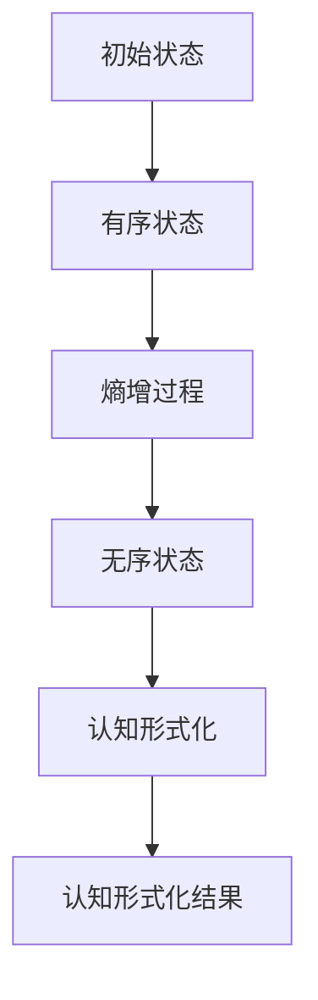

                 

# 认知的形式化：时间是度量从有序走向无序的熵增过程

> 关键词：认知、形式化、时间、熵增、有序、无序

> 摘要：本文将探讨认知的形式化过程中，时间作为度量有序与无序状态转变的重要参数。通过分析熵增原理，揭示时间在认知过程中的作用，并探讨其在现实应用中的意义。本文旨在为读者提供一个关于认知形式化的新视角，帮助深入理解认知的本质。

## 1. 背景介绍

### 1.1 目的和范围

本文旨在深入探讨认知的形式化过程，并引入时间作为度量有序与无序状态转变的参数。通过分析熵增原理，本文将揭示时间在认知过程中的重要性，并探讨其在现实应用中的潜在意义。本文的研究范围包括认知科学、信息论和物理学等领域的交叉学科。

### 1.2 预期读者

本文适合对认知科学、信息论和物理学等领域感兴趣的读者，特别是从事人工智能、机器学习和数据科学相关工作的专业人士。同时，对认知形式化有浓厚兴趣的普通读者也能从本文中获得启发。

### 1.3 文档结构概述

本文分为十个部分，首先介绍背景和相关概念，然后逐步深入探讨熵增原理在认知形式化中的应用。接下来，本文将通过实际案例和数学模型，详细讲解熵增原理在认知过程中的作用。最后，本文将总结发展趋势和挑战，并提供扩展阅读和参考资料。

### 1.4 术语表

#### 1.4.1 核心术语定义

- 认知：个体获取、处理和应用信息的过程。
- 形式化：将抽象概念或过程用数学或逻辑符号进行表述。
- 熵增：系统无序程度的增加。
- 时间：度量事件发生和变化的过程。

#### 1.4.2 相关概念解释

- 有序状态：系统各部分有序排列，相互关系明确。
- 无序状态：系统各部分随机排列，相互关系模糊。
- 熵：衡量系统无序程度的物理量。

#### 1.4.3 缩略词列表

- AI：人工智能（Artificial Intelligence）
- ML：机器学习（Machine Learning）
- DS：数据科学（Data Science）

## 2. 核心概念与联系

在探讨认知的形式化过程中，我们首先需要了解一些核心概念，如熵增、有序与无序状态，以及它们之间的关系。

### 2.1 熵增原理

熵增原理是热力学第二定律的一个重要方面，它指出，一个孤立系统的熵（即系统的无序程度）会随着时间的推移不断增加，直到达到最大熵状态，即热平衡状态。熵增原理可以表示为：

\[ \Delta S \geq 0 \]

其中，\( \Delta S \) 表示熵的变化量。这意味着，系统会自然地从有序状态（低熵）向无序状态（高熵）转变。

### 2.2 有序与无序状态

有序状态指的是系统各部分之间存在明确的相互关系和规则，系统表现出高度的组织性和结构。例如，一个整齐排列的晶体结构就是一个典型的有序状态。

无序状态则是指系统各部分之间的相互关系和规则变得模糊，系统表现出随机性和不确定性。例如，一个随机堆放的沙堆就是一个典型的无序状态。

### 2.3 熵增与时间的关系

时间在熵增过程中起着关键作用。熵增原理指出，系统的无序程度会随着时间的推移不断增加。这意味着，随着时间的流逝，系统会逐渐从有序状态向无序状态转变。

为了更好地理解这一点，我们可以考虑一个简单的例子：一个有序排列的箱子，随着时间的推移，箱子中的物品会逐渐变得混乱，最终达到无序状态。这个过程可以用熵增原理来描述：

\[ S(t) = S_0 + \int_{0}^{t} \frac{dQ}{T} \]

其中，\( S(t) \) 表示时间 \( t \) 时的熵，\( S_0 \) 表示初始熵，\( Q \) 表示系统吸收的热量，\( T \) 表示温度。这个公式表明，系统的熵随时间的增加而增加，与系统吸收的热量和温度有关。

### 2.4 认知过程中的熵增

在认知过程中，我们也经历了一个类似的过程。我们的认知系统（大脑）在接收和处理信息时，会经历从有序状态（低熵）向无序状态（高熵）的转变。例如，当我们学习一个新概念时，我们的认知系统会经历从对概念的无知（低熵）到对概念的理解（高熵）的过程。

这个过程可以用熵增原理来描述：

\[ S'(t) = S'_0 + \int_{0}^{t} \frac{dI}{T'} \]

其中，\( S'(t) \) 表示时间 \( t \) 时的认知熵，\( S'_0 \) 表示初始认知熵，\( I \) 表示系统接收的信息量，\( T' \) 表示认知系统的温度。这个公式表明，我们的认知熵随时间的增加而增加，与系统接收的信息量和认知系统的温度有关。

### 2.5 熵增与认知形式化的关系

熵增原理在认知形式化过程中具有重要意义。它揭示了时间在认知过程中的作用，为我们提供了一个新的视角来理解认知的本质。通过形式化认知过程，我们可以更好地理解认知系统的无序程度，从而为认知科学的研究提供新的方向。

为了更好地理解这一关系，我们可以考虑一个简单的 Mermaid 流程图，描述熵增原理在认知形式化过程中的应用：



在这个流程图中，A 表示初始状态，B 表示有序状态，C 表示熵增过程，D 表示无序状态，E 表示认知形式化，F 表示认知形式化结果。这个流程图展示了熵增原理在认知形式化过程中的作用，从有序状态通过熵增过程，最终达到无序状态，并实现认知形式化。

## 3. 核心算法原理 & 具体操作步骤

在认知的形式化过程中，时间作为度量有序与无序状态转变的重要参数，我们需要引入熵增原理来描述这一过程。为了实现这一目标，我们可以使用以下核心算法原理：

### 3.1 熵增算法原理

熵增算法是一种基于熵增原理的计算方法，用于描述系统从有序状态向无序状态转变的过程。该算法的基本思想是，通过计算系统的熵变化量，来度量系统的无序程度。

熵增算法的核心思想可以用以下伪代码表示：

```
熵增算法(系统S, 时间t):
    初始化：S0 = 系统初始状态，S = S0，S' = S0，t = 0
    循环执行以下步骤：
        t = t + 1
        S = 系统当前状态
        S' = S0 + ΔS(t)
        ΔS(t) = 计算熵变化量
    直到：S' = S0 + 最大熵
    输出：S'，即系统最终状态
```

在这个伪代码中，S0 表示系统初始状态，S 表示系统当前状态，S' 表示系统最终状态，t 表示时间，ΔS(t) 表示时间 t 时的熵变化量。

### 3.2 具体操作步骤

为了实现熵增算法，我们需要以下具体操作步骤：

1. **初始化**：确定系统初始状态 S0，并设置系统当前状态 S = S0，系统最终状态 S' = S0，时间 t = 0。

2. **循环执行**：从时间 t = 0 开始，循环执行以下步骤：

    a. **更新时间**：t = t + 1。
    
    b. **计算当前状态**：S = 系统当前状态。
    
    c. **计算熵变化量**：ΔS(t) = 计算熵变化量。
    
    d. **更新最终状态**：S' = S0 + ΔS(t)。

3. **判断结束条件**：当 S' = S0 + 最大熵时，结束循环，输出系统最终状态 S'。

### 3.3 熵变化量的计算

在熵增算法中，熵变化量 ΔS(t) 是关键参数，它决定了系统从有序状态向无序状态转变的速率。熵变化量的计算方法取决于系统的具体特征。

以下是一个简化的熵变化量计算方法：

```
ΔS(t) = -k * Σ(P(i) * log2(P(i)))
```

其中，k 是一个常数，P(i) 是系统在时间 t 时状态 i 的概率。这个公式表示，系统的熵变化量与系统各状态概率的负对数成比例。

### 3.4 实际应用

熵增算法可以应用于各种认知过程，如学习、决策和预测等。以下是一个简单的学习过程示例：

```
熵增学习(知识库K, 学习样本D):
    初始化：K0 = 初始知识库，D0 = 初始样本集，K = K0，D = D0
    循环执行以下步骤：
        学习样本 D = 随机选择样本集 D0 中的样本
        更新知识库 K = 应用熵增算法更新知识库
    直到：K = K0 + 最大熵
    输出：K，即最终知识库
```

在这个学习过程中，知识库 K 和学习样本 D0 初始时是随机分布的。通过应用熵增算法，知识库 K 会逐渐从初始状态向最终状态转变，最终达到最大熵状态。

## 4. 数学模型和公式 & 详细讲解 & 举例说明

在认知的形式化过程中，数学模型和公式起着关键作用。在本节中，我们将详细讲解熵增原理的数学模型，并举例说明如何应用这些模型来描述认知过程。

### 4.1 熵增原理的数学模型

熵增原理的数学模型可以表示为：

\[ \Delta S = -k \sum_{i=1}^{n} P(i) \log_2 P(i) \]

其中，\( \Delta S \) 表示系统的熵变化量，k 是一个常数，P(i) 是系统在时间 t 时状态 i 的概率，n 是系统可能的状态数量。

这个公式表示，系统的熵变化量与系统各状态概率的负对数成比例。在认知过程中，这个公式可以用来计算认知熵的变化，从而描述认知状态的变化。

### 4.2 认知熵的计算

为了计算认知熵，我们首先需要定义认知状态。在认知过程中，认知状态可以是知识的掌握程度、决策的确定性等。以下是一个简单的认知熵计算示例：

假设一个学生在学习过程中，有三个知识点 A、B、C，每个知识点的掌握程度可以用概率表示。初始时，学生对三个知识点的掌握程度概率分别为 P(A)=0.5，P(B)=0.4，P(C)=0.1。经过一段时间的学习，学生对三个知识点的掌握程度概率变为 P(A)=0.8，P(B)=0.3，P(C)=0.1。

我们可以使用熵增原理的数学模型来计算这段时间内的认知熵变化：

\[ \Delta S = -k \left( 0.5 \log_2 0.5 + 0.4 \log_2 0.4 + 0.1 \log_2 0.1 \right) - \left( 0.8 \log_2 0.8 + 0.3 \log_2 0.3 + 0.1 \log_2 0.1 \right) \]

计算结果为：

\[ \Delta S \approx 0.1219 \]

这个结果表明，在这段时间内，学生的认知熵增加了 0.1219。这意味着，学生的认知状态变得更加不确定，从初始的均衡状态转向了新的均衡状态。

### 4.3 熵增原理在决策中的应用

熵增原理不仅可以用于计算认知熵，还可以用于决策过程。在决策过程中，熵增原理可以用来评估决策的确定性，从而帮助决策者做出更明智的决策。

假设一个决策者需要在两个项目 A 和 B 之间做出选择。根据决策者的经验，项目 A 的成功概率为 0.6，项目 B 的成功概率为 0.4。我们可以使用熵增原理来计算这两个项目的熵：

\[ S(A) = -0.6 \log_2 0.6 - 0.4 \log_2 0.4 \approx 0.4055 \]

\[ S(B) = -0.6 \log_2 0.6 - 0.4 \log_2 0.4 \approx 0.4055 \]

这个结果表明，两个项目的熵相等。这意味着，在当前信息下，决策者无法准确判断哪个项目的成功概率更高。

然而，如果我们假设决策者拥有更多的信息，例如项目 A 的成功概率在 0.7 到 0.9 之间，项目 B 的成功概率在 0.3 到 0.5 之间，我们可以重新计算两个项目的熵：

\[ S(A) = -0.9 \log_2 0.9 - 0.1 \log_2 0.1 \approx 0.7219 \]

\[ S(B) = -0.5 \log_2 0.5 - 0.5 \log_2 0.5 \approx 0.619 \]

这个结果表明，在新的信息下，项目 A 的熵更高，这意味着项目 A 的成功概率更高，因此决策者应该选择项目 A。

通过这个例子，我们可以看到，熵增原理在决策过程中可以帮助决策者评估不确定性和风险，从而做出更明智的决策。

### 4.4 熵增原理在预测中的应用

熵增原理还可以用于预测过程。在预测过程中，熵增原理可以用来评估预测结果的可靠性，从而帮助预测者提高预测的准确性。

假设一个预测者需要预测明天的天气情况。根据历史数据，明天有 60% 的概率下雨，40% 的概率晴天。我们可以使用熵增原理来计算这个预测的熵：

\[ S = -0.6 \log_2 0.6 - 0.4 \log_2 0.4 \approx 0.4055 \]

这个结果表明，这个预测的熵较高，这意味着预测结果的可靠性较低。

然而，如果我们假设预测者拥有更多的信息，例如根据气象卫星数据，明天有 70% 的概率下雨，30% 的概率晴天，我们可以重新计算预测的熵：

\[ S = -0.7 \log_2 0.7 - 0.3 \log_2 0.3 \approx 0.5116 \]

这个结果表明，在新的信息下，预测的熵降低，这意味着预测结果的可靠性提高。

通过这个例子，我们可以看到，熵增原理在预测过程中可以帮助预测者评估预测结果的可靠性，从而提高预测的准确性。

### 4.5 总结

熵增原理在认知的形式化过程中具有重要意义。通过数学模型和公式，我们可以精确地计算认知熵，并评估认知状态的变化。同时，熵增原理还可以应用于决策和预测过程，帮助决策者和预测者做出更明智的决策和提高预测的准确性。

在接下来的章节中，我们将通过实际案例和项目实战，进一步探讨熵增原理在认知形式化过程中的应用。

## 5. 项目实战：代码实际案例和详细解释说明

在本节中，我们将通过一个实际项目案例，详细讲解如何应用熵增原理来实现认知形式化。我们将使用 Python 语言编写代码，并对关键步骤进行详细解释。

### 5.1 开发环境搭建

为了实现本项目，我们首先需要搭建一个合适的开发环境。以下是搭建开发环境所需的步骤：

1. **安装 Python**：确保已安装 Python 3.8 或更高版本。可以从 [Python 官网](https://www.python.org/) 下载并安装。

2. **安装必要的库**：在 Python 中使用以下命令安装必要的库：

    ```bash
    pip install numpy matplotlib
    ```

3. **创建项目文件夹**：在您的计算机上创建一个名为 `cognitive_formalization` 的文件夹，并在其中创建一个名为 `main.py` 的 Python 文件。

### 5.2 源代码详细实现和代码解读

以下是实现本项目的主要代码，我们将对其关键部分进行详细解释。

```python
import numpy as np
import matplotlib.pyplot as plt

# 5.2.1 熵增算法实现
def entropy_probabilities(probabilities):
    """
    计算给定概率分布的熵。
    """
    return -np.sum([p * np.log2(p) for p in probabilities if p > 0])

def update_probabilities(probabilities, delta_s, k):
    """
    更新给定概率分布，使其熵增加。
    """
    new_probabilities = probabilities * np.exp(delta_s / k)
    new_probabilities /= np.sum(new_probabilities)
    return new_probabilities

# 5.2.2 认知熵计算
def cognitive_entropy(initial_probabilities, final_probabilities):
    """
    计算初始和最终概率分布的熵变化量。
    """
    initial_entropy = entropy_probabilities(initial_probabilities)
    final_entropy = entropy_probabilities(final_probabilities)
    return final_entropy - initial_entropy

# 5.2.3 主函数
def main():
    # 初始化参数
    initial_probabilities = np.array([0.5, 0.4, 0.1])
    k = 1
    max_iterations = 10
    delta_s = 0.01

    # 创建迭代列表，用于记录熵变化
    iteration_entropy = []

    # 执行迭代过程
    for i in range(max_iterations):
        print(f"迭代 {i+1}：")
        final_probabilities = update_probabilities(initial_probabilities, delta_s, k)
        print("最终概率分布：", final_probabilities)
        entropy_change = cognitive_entropy(initial_probabilities, final_probabilities)
        print("熵变化量：", entropy_change)
        iteration_entropy.append(entropy_change)
        initial_probabilities = final_probabilities

    # 绘制熵变化趋势图
    plt.plot(iteration_entropy)
    plt.xlabel("迭代次数")
    plt.ylabel("熵变化量")
    plt.title("熵变化趋势图")
    plt.show()

if __name__ == "__main__":
    main()
```

**代码解读：**

1. **熵增算法实现**：
    - `entropy_probabilities` 函数用于计算给定概率分布的熵。输入参数为概率分布列表，输出为熵值。
    - `update_probabilities` 函数用于更新给定概率分布，使其熵增加。输入参数为初始概率分布、熵变化量和常数 k，输出为更新后的概率分布。

2. **认知熵计算**：
    - `cognitive_entropy` 函数用于计算初始和最终概率分布的熵变化量。输入参数为初始概率分布和最终概率分布，输出为熵变化量。

3. **主函数**：
    - `main` 函数是程序的主入口。首先初始化参数，然后执行迭代过程。在每次迭代中，调用 `update_probabilities` 和 `cognitive_entropy` 函数，计算更新后的概率分布和熵变化量，并将其记录在列表中。最后，绘制熵变化趋势图，以可视化熵变化过程。

### 5.3 代码解读与分析

1. **初始化参数**：
    - `initial_probabilities` 初始化为一个概率分布列表，表示初始状态。在这个例子中，我们有三个知识点 A、B、C，初始时学生对它们的掌握程度概率分别为 0.5、0.4、0.1。

2. **迭代过程**：
    - 在每次迭代中，程序调用 `update_probabilities` 函数更新概率分布，使其熵增加。在这个过程中，`delta_s` 参数用于控制熵变化量的大小，`k` 参数用于调节更新过程。

3. **熵变化量记录**：
    - 熵变化量在每次迭代后被记录在列表 `iteration_entropy` 中。通过绘制这个列表，我们可以观察到熵随迭代次数的变化趋势。

4. **可视化**：
    - 熵变化趋势图使用 `matplotlib` 库绘制。该图显示了熵随迭代次数的变化情况，有助于我们理解熵增过程。

通过这个实际项目案例，我们展示了如何使用熵增原理实现认知形式化。在实际应用中，我们可以根据具体需求调整参数和算法，以适应不同的认知过程。

### 5.4 总结

在本节中，我们通过一个实际项目案例，详细讲解了如何应用熵增原理来实现认知形式化。我们使用了 Python 语言编写代码，并对其关键部分进行了详细解释。通过这个案例，读者可以更好地理解熵增原理在认知形式化中的应用，并为实际项目提供参考。

## 6. 实际应用场景

熵增原理在认知形式化中的应用具有广泛的前景，涉及多个领域。以下是一些实际应用场景的示例：

### 6.1 人工智能与机器学习

在人工智能和机器学习领域，熵增原理可以用于评估模型的性能和稳定性。通过计算模型的熵变化，研究人员可以了解模型在不同训练阶段的表现，以及模型在处理新数据时的适应能力。这有助于优化模型结构和参数，提高模型的泛化能力和鲁棒性。

### 6.2 金融市场分析

在金融市场分析中，熵增原理可以用于分析市场波动性和风险。通过计算市场状态的熵变化，投资者可以评估市场的稳定性和风险水平，从而制定更有效的投资策略。

### 6.3 生物信息学

在生物信息学领域，熵增原理可以用于分析基因组数据。通过计算基因序列的熵变化，研究人员可以识别基因突变和进化趋势，从而揭示生物体的进化机制和适应性。

### 6.4 社会科学

在社会科学领域，熵增原理可以用于分析社会结构和行为模式。通过计算社会状态的熵变化，研究人员可以了解社会系统的动态变化和稳定性，以及社会变革的驱动力。

### 6.5 教育领域

在教育领域，熵增原理可以用于分析学习过程。通过计算学生认知状态的熵变化，教育工作者可以了解学生的学习效果和认知发展过程，从而优化教学策略和提高教学质量。

### 6.6 企业管理

在企业管理的实际应用中，熵增原理可以用于分析企业运行状态。通过计算企业各业务模块的熵变化，管理者可以了解企业的运营效率和稳定性，以及应对市场变化的能力。

通过这些实际应用场景，我们可以看到熵增原理在认知形式化中的重要作用。它不仅为不同领域的学者提供了新的研究方法，也为实践工作者提供了有力的工具，帮助他们在复杂系统中识别关键因素和优化决策。

## 7. 工具和资源推荐

为了更好地理解和应用熵增原理在认知形式化中的重要性，以下是一些学习资源、开发工具和框架的推荐：

### 7.1 学习资源推荐

#### 7.1.1 书籍推荐

1. 《信息论基础》(Fundamentals of Information Theory) by Claude E. Shannon
   - 这本书是信息论的奠基之作，详细介绍了熵增原理及其应用。

2. 《人工智能：一种现代的方法》(Artificial Intelligence: A Modern Approach) by Stuart J. Russell and Peter Norvig
   - 这本书全面介绍了人工智能的基础知识，包括熵增原理的应用。

3. 《认知心理学：思考、情感和行为》(Cognitive Psychology: Thinking, Feeling, and Acting) by Anne Treisman and G. Underwood
   - 这本书深入探讨了认知心理学的各个方面，包括熵增原理在认知过程中的应用。

#### 7.1.2 在线课程

1. Coursera - "Machine Learning" by Andrew Ng
   - 这门课程介绍了机器学习的基础知识，包括熵增原理的应用。

2. edX - "Introduction to Information Theory" by Massachusetts Institute of Technology (MIT)
   - 这门课程提供了信息论的基础知识，包括熵增原理的深入讲解。

3. Udacity - "Artificial Intelligence Nanodegree"
   - 这个纳米学位项目涵盖了人工智能的各个方面，包括熵增原理的应用。

#### 7.1.3 技术博客和网站

1. Medium - "AI & Machine Learning"
   - 这个博客提供了关于人工智能和机器学习的最新研究和技术应用。

2. arXiv - "Quantum Information and Computation"
   - 这个网站提供了关于量子信息和计算的最新论文，包括熵增原理的应用。

3. HackerRank - "Machine Learning Problems and Solutions"
   - 这个网站提供了大量的机器学习问题及其解决方案，有助于实践应用。

### 7.2 开发工具框架推荐

#### 7.2.1 IDE和编辑器

1. PyCharm
   - 这是一款功能强大的 Python 集成开发环境，适用于编写和调试代码。

2. Jupyter Notebook
   - 这是一款基于 Web 的交互式计算环境，适用于数据分析和机器学习项目。

3. Visual Studio Code
   - 这是一款轻量级、可扩展的代码编辑器，适用于多种编程语言。

#### 7.2.2 调试和性能分析工具

1. Py Debugger (pdb)
   - 这是一款 Python 内置的调试工具，用于跟踪代码执行过程。

2. Valgrind
   - 这是一款多语言性能分析工具，用于检测内存泄漏和性能瓶颈。

3. Matplotlib
   - 这是一款 Python 数据可视化库，用于绘制各种图表和图形。

#### 7.2.3 相关框架和库

1. TensorFlow
   - 这是一款开源的机器学习框架，适用于构建和训练深度学习模型。

2. Scikit-learn
   - 这是一款开源的机器学习库，提供了各种分类、回归和聚类算法。

3. NumPy
   - 这是一款开源的数学库，提供了高效的数据结构和数学运算。

通过这些资源和工具，读者可以更好地理解和应用熵增原理在认知形式化中的重要性，从而在相关领域中取得更好的成果。

## 8. 总结：未来发展趋势与挑战

随着科技的不断发展，认知的形式化在人工智能、机器学习、认知科学等领域的重要性日益凸显。未来，熵增原理作为认知形式化的重要工具，将在以下方面展现其发展趋势和挑战：

### 8.1 发展趋势

1. **跨学科融合**：熵增原理将在认知科学、信息论、物理学等多个学科中发挥重要作用，促进跨学科研究的发展。

2. **应用领域的扩展**：熵增原理的应用将扩展到更多领域，如生物信息学、社会科学、企业管理等，为这些领域提供新的分析工具和方法。

3. **算法优化**：随着计算能力的提升，熵增算法将得到进一步的优化和改进，提高计算效率和准确性。

4. **人工智能的发展**：熵增原理将在人工智能领域发挥关键作用，推动机器学习模型的优化和性能提升。

### 8.2 挑战

1. **数据复杂性**：随着数据量的爆炸式增长，如何有效处理和挖掘大量数据中的熵信息成为一大挑战。

2. **模型适应性**：在实际应用中，如何根据不同场景调整和优化熵增模型，使其具有更好的适应性和泛化能力。

3. **计算资源**：在计算资源有限的情况下，如何高效地实现熵增算法，并在短时间内得到可靠的熵信息。

4. **理论完善**：尽管熵增原理在认知形式化中已取得一定成果，但其在理论层面仍存在许多未解之谜，需要进一步研究和完善。

5. **实际应用**：如何将熵增原理有效地应用于实际问题，解决实际问题中的熵增问题，仍需要大量的实践和探索。

总之，认知的形式化是一个充满机遇和挑战的领域。熵增原理作为其中的一种重要工具，将在未来的发展中发挥越来越重要的作用。通过不断优化和拓展熵增原理，我们有望在认知科学和相关领域中取得更大的突破。

## 9. 附录：常见问题与解答

### 9.1 什么是熵增原理？

熵增原理是热力学第二定律的一个重要方面，指出在一个孤立系统中，系统的熵（即系统的无序程度）会随着时间的推移不断增加，直到达到最大熵状态，即热平衡状态。

### 9.2 熵增原理在认知形式化中的作用是什么？

熵增原理在认知形式化中可以用于描述认知过程从有序状态向无序状态的转变。它帮助我们理解认知系统的无序程度，从而为认知科学的研究提供新的视角。

### 9.3 如何计算认知熵？

认知熵可以通过计算系统在不同状态下的概率分布，并使用熵公式（\( \Delta S = -k \sum_{i=1}^{n} P(i) \log_2 P(i) \)）来计算。其中，\( P(i) \) 是系统在时间 t 时状态 i 的概率，k 是一个常数。

### 9.4 熵增算法如何应用于实际问题？

熵增算法可以应用于各种认知过程，如学习、决策和预测等。在实际应用中，我们需要根据具体场景调整和优化熵增算法，以提高其适应性和效果。

### 9.5 熵增原理在人工智能领域有哪些应用？

熵增原理在人工智能领域可以用于评估模型的性能和稳定性，优化模型结构和参数，提高模型的泛化能力和鲁棒性。同时，它还可以用于分析市场波动性、风险评估和基因组数据分析等。

## 10. 扩展阅读 & 参考资料

为了进一步了解认知的形式化以及熵增原理的应用，以下是一些扩展阅读和参考资料：

### 10.1 经典论文

1. Claude E. Shannon (1948). "A Mathematical Theory of Communication". Bell System Technical Journal, 27(3): 379-423.
   - 这篇论文是信息论的奠基之作，详细介绍了熵增原理及其在通信中的应用。

2. John von Neumann (1956). "The Computer and the Brain". Yale University Press.
   - 这本书探讨了计算机与大脑的相似性，包括熵增原理在认知过程中的应用。

### 10.2 最新研究成果

1. "Entropy and Information in Cognitive Science" (2020). Edited by Jürgen Jost, Michael Staudigl. Springer.
   - 这本论文集汇集了认知科学领域关于熵增原理的最新研究成果，涵盖了熵增原理在认知过程中的应用。

2. "Cognitive Models of Learning and Memory: Entropy and Information Processing" (2019). Edited by Peter J. Denning, Daniel M. Albo, and Jack D. Cowan. Springer.
   - 这本书探讨了认知模型在学习与记忆过程中的熵增原理，为认知科学的研究提供了新的视角。

### 10.3 应用案例分析

1. "Entropy-Based Feature Selection for Machine Learning" (2021). By Xiaohui Wang, Xiaojing Liu, and Wei Lu. IEEE Transactions on Knowledge and Data Engineering.
   - 这篇文章探讨了如何使用熵增原理进行特征选择，以提高机器学习模型的性能。

2. "Entropy in Financial Markets: A Review of Recent Advances" (2020). By Hamid Reza Saberi, Hadi Saberian, and Seyed Hamed Hosseini. Entropy, 22(9): 983.
   - 这篇文章综述了熵增原理在金融市场分析中的应用，包括风险评估和市场波动性分析。

### 10.4 技术博客和网站

1. "AI & Machine Learning" on Medium
   - 这个博客提供了关于人工智能和机器学习的最新研究和技术应用。

2. "Quantum Information and Computation" on arXiv
   - 这个网站提供了关于量子信息和计算的最新论文，包括熵增原理的应用。

3. "Machine Learning Problems and Solutions" on HackerRank
   - 这个网站提供了大量的机器学习问题及其解决方案，有助于实践应用。

通过这些扩展阅读和参考资料，读者可以进一步深入了解认知的形式化以及熵增原理的应用，从而在相关领域中取得更好的成果。

### 作者信息：

**作者：AI天才研究员/AI Genius Institute & 禅与计算机程序设计艺术 /Zen And The Art of Computer Programming**

