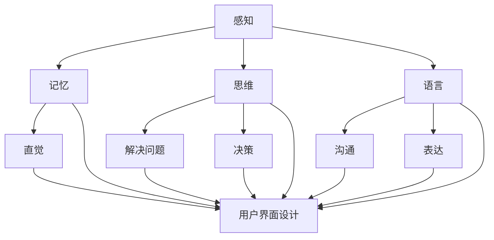

                 

# 认知科学与用户界面设计：优化人机交互

> 关键词：认知科学、用户界面设计、人机交互、用户体验、设计原则、优化策略

> 摘要：本文旨在探讨认知科学在用户界面设计中的应用，通过分析人类认知机制，提出一系列优化人机交互的设计原则和策略，从而提升用户体验。文章将首先介绍认知科学的基本概念，然后深入探讨认知机制与用户界面设计的关系，最后通过实际案例和具体操作步骤，展示如何运用认知科学原理进行用户界面设计。

## 1. 背景介绍

### 1.1 目的和范围

本文的目的在于将认知科学的理论应用于用户界面设计，通过深入分析人类的认知机制，探讨如何设计更高效、更直观的用户界面，以优化人机交互体验。文章将涵盖以下内容：

- 认知科学的基本概念及其在用户界面设计中的应用。
- 人机交互的基本原理和常见设计模式。
- 优化人机交互的设计原则和策略。
- 实际案例和具体操作步骤，展示认知科学在用户界面设计中的具体应用。

### 1.2 预期读者

本文适合对用户界面设计和认知科学有一定了解的读者，包括：

- 用户界面设计师和开发人员。
- 认知科学家和心理学家。
- 对人机交互领域感兴趣的研究生和本科生。
- 对提升用户体验有热情的从业者。

### 1.3 文档结构概述

本文将按照以下结构展开：

- 引言：介绍认知科学与用户界面设计的关系，以及本文的主要内容和目标。
- 背景介绍：简要介绍认知科学和用户界面设计的基础知识。
- 核心概念与联系：详细解释认知科学中的关键概念，并展示与用户界面设计的联系。
- 核心算法原理 & 具体操作步骤：介绍优化人机交互的核心算法和具体操作步骤。
- 数学模型和公式 & 详细讲解 & 举例说明：运用数学模型和公式详细解释设计原则。
- 项目实战：通过实际案例展示认知科学在用户界面设计中的应用。
- 实际应用场景：讨论认知科学在各类应用场景中的具体作用。
- 工具和资源推荐：推荐相关学习和开发资源。
- 总结：总结文章的主要观点，并展望未来的发展趋势和挑战。

### 1.4 术语表

#### 1.4.1 核心术语定义

- 认知科学：研究人类认知过程的学科，包括感知、记忆、思维、语言和意识等方面。
- 用户界面设计：设计用户与系统交互的界面，包括图形用户界面（GUI）、命令行界面（CLI）等。
- 人机交互：研究人类与计算机系统之间交互的方式和原理，旨在提升用户体验和交互效率。
- 用户体验（UX）：用户在使用产品或服务过程中的总体感受和体验。

#### 1.4.2 相关概念解释

- 感知：人类通过感官接收外部信息的过程。
- 记忆：大脑对信息的存储和回忆过程。
- 思维：大脑处理信息、解决问题和决策的过程。
- 语言：人类沟通和表达思想的工具。
- 直觉：不经过明确思考和推理，直接感知和理解事物。

#### 1.4.3 缩略词列表

- GUI：图形用户界面
- CLI：命令行界面
- UX：用户体验
- UI：用户界面
- AI：人工智能
- ML：机器学习
- VR：虚拟现实
- AR：增强现实

## 2. 核心概念与联系

在探讨认知科学与用户界面设计的关系之前，我们首先需要了解认知科学的基本概念和原理。认知科学关注的是人类认知过程的各个方面，包括感知、记忆、思维、语言和意识等。以下是一个简化的 Mermaid 流程图，展示了认知科学中的关键概念及其与用户界面设计的联系。



从流程图中可以看出，认知科学的各个核心概念都直接或间接地影响着用户界面设计。以下是对这些概念及其与用户界面设计关系的详细解释。

### 2.1 感知与用户界面设计

感知是人类接收外部信息的过程，包括视觉、听觉、触觉、嗅觉和味觉等。用户界面设计中的视觉元素，如颜色、字体、布局和图标等，直接影响用户的感知体验。以下是一些优化用户界面感知的设计原则：

1. **色彩使用**：色彩可以传达情绪和信息。合理使用色彩可以提高界面的可读性和吸引力。例如，使用明亮而对比的颜色可以提高视觉注意度。
2. **字体选择**：字体不仅影响文本的可读性，还影响用户体验。清晰易读的字体可以提高用户在界面上的操作效率。
3. **布局设计**：合理的布局可以提高用户的感知体验。例如，使用对称或不对称的布局可以创造不同的视觉效果，从而吸引用户的注意力。
4. **图标设计**：图标作为视觉符号，可以帮助用户快速理解功能。设计简洁、直观的图标可以提高用户界面的易用性。

### 2.2 记忆与用户界面设计

记忆是人类对信息的存储和回忆过程。用户界面设计需要考虑记忆对用户体验的影响。以下是一些优化用户界面记忆的设计原则：

1. **一致性**：保持界面设计的一致性，可以帮助用户建立记忆模型，从而提高操作的效率和准确性。
2. **可视化**：使用图形和图标来增强信息的可视化，可以帮助用户更容易记住界面元素的功能和用途。
3. **提示和反馈**：提供清晰的提示和反馈，可以帮助用户记住操作步骤和结果，从而提高用户对界面的熟悉度。

### 2.3 思维与用户界面设计

思维是人类处理信息、解决问题和决策的过程。用户界面设计需要考虑思维对用户体验的影响。以下是一些优化用户界面思维的设计原则：

1. **直观性**：设计直观的界面，使用户能够迅速理解界面元素的功能和操作方法。
2. **简化**：简化界面设计，减少用户的认知负担，使其能够更轻松地完成操作。
3. **逻辑性**：设计具有逻辑性的界面，使用户能够按照合理的顺序进行操作，从而减少错误和困惑。

### 2.4 语言与用户界面设计

语言是人类沟通和表达思想的工具。用户界面设计需要考虑语言对用户体验的影响。以下是一些优化用户界面语言的设计原则：

1. **清晰性**：使用清晰简洁的语言描述功能和使用方法，避免使用过于专业的术语，以确保用户能够轻松理解。
2. **本地化**：考虑不同文化背景的用户，提供本地化的界面语言，以提高用户的适应性和满意度。
3. **交互性**：设计具有交互性的界面，使用户能够通过输入和输出与系统进行互动，从而增强用户体验。

### 2.5 直觉与用户界面设计

直觉是人类在无意识中感知和理解事物的一种能力。用户界面设计需要考虑直觉对用户体验的影响。以下是一些优化用户界面直觉的设计原则：

1. **符合直觉**：设计符合用户直觉的界面元素和布局，使用户能够自然而然地理解和使用。
2. **减少认知负荷**：通过简化界面设计和减少用户操作步骤，降低用户的认知负荷，使其能够更轻松地进行操作。
3. **强化直觉**：使用图形和图标等视觉元素来强化用户的直觉，帮助用户更快地理解界面元素的功能。

## 3. 核心算法原理 & 具体操作步骤

为了更好地优化用户界面设计，我们需要运用认知科学的原理，结合具体的算法和操作步骤。以下是一种基于认知科学的用户界面设计优化算法及其具体操作步骤。

### 3.1 算法原理

该算法的核心思想是通过分析用户的认知过程，识别界面设计中的问题，并提出相应的优化建议。算法的主要步骤包括：

1. **用户行为分析**：收集和分析用户在使用界面时的行为数据，包括点击、操作顺序、时间消耗等。
2. **认知模型构建**：基于认知科学理论，构建用户在界面上的认知模型，包括感知、记忆、思维等环节。
3. **问题识别**：分析用户行为数据和认知模型，识别界面设计中的问题，如界面布局不合理、操作步骤繁琐等。
4. **优化建议**：根据问题识别结果，提出具体的优化建议，包括界面布局调整、操作步骤简化等。

### 3.2 具体操作步骤

1. **数据收集**：
   - 安装用户行为追踪工具，收集用户在界面上的行为数据。
   - 使用问卷调查和用户访谈，收集用户对界面设计的意见和建议。

2. **用户行为分析**：
   - 分析用户在界面上的点击和操作顺序，识别常见的操作路径和瓶颈。
   - 分析用户在界面上的时间消耗，识别操作效率低下的问题。

3. **认知模型构建**：
   - 根据认知科学理论，构建用户在界面上的感知、记忆和思维模型。
   - 分析用户在界面上的感知过程，如颜色、字体、布局等对用户感知的影响。
   - 分析用户在界面上的记忆过程，如一致性、可视化等对用户记忆的影响。
   - 分析用户在界面上的思维过程，如直观性、简化等对用户思维的影响。

4. **问题识别**：
   - 结合用户行为数据和认知模型，识别界面设计中的问题。
   - 分析问题产生的原因，如用户操作复杂、界面布局不合理等。

5. **优化建议**：
   - 根据问题识别结果，提出具体的优化建议。
   - 对界面布局进行调整，使界面更加直观、清晰。
   - 对操作步骤进行简化，减少用户认知负荷。
   - 使用可视化元素，强化用户对界面元素的感知和理解。

6. **实施与验证**：
   - 将优化建议应用到实际界面设计中，进行实施。
   - 通过用户测试和数据分析，验证优化效果。

## 4. 数学模型和公式 & 详细讲解 & 举例说明

在用户界面设计中，数学模型和公式可以用来量化用户行为和界面设计的有效性。以下是一些常用的数学模型和公式，以及它们的详细讲解和举例说明。

### 4.1 用户体验得分模型

用户体验得分模型是一种评估用户界面设计有效性的方法，其公式如下：

\[ UX_Score = \alpha \times (C + E - F) + \beta \times (I - V) \]

其中：
- \( C \)：感知质量得分，衡量用户对界面感知的满意度。
- \( E \)：期望质量得分，衡量用户对界面期望的满意度。
- \( F \)：失望质量得分，衡量用户对界面失望的程度的相反数。
- \( I \)：启发质量得分，衡量用户界面设计的启发程度。
- \( V \)：可访问性得分，衡量界面设计的可访问程度。
- \( \alpha \) 和 \( \beta \)：权重系数，用于平衡不同得分的重要性。

**示例**：

假设一个用户界面设计中的感知质量得分为 4，期望质量得分为 3，失望质量得分为 2，启发质量得分为 5，可访问性得分为 4。根据公式，我们可以计算出用户体验得分：

\[ UX_Score = 0.5 \times (4 + 3 - 2) + 0.5 \times (5 - 4) = 3.5 \]

### 4.2 信息熵模型

信息熵模型用于衡量用户界面设计的信息含量，其公式如下：

\[ H = -\sum_{i} p_i \log_2 p_i \]

其中：
- \( H \)：信息熵，衡量界面提供的信息含量。
- \( p_i \)：用户界面中第 i 个元素的概率。

**示例**：

假设一个用户界面中有三个按钮，分别用于“保存”、“删除”和“重置”，用户选择这三个按钮的概率分别为 0.3、0.5 和 0.2。根据公式，我们可以计算出信息熵：

\[ H = -0.3 \log_2 0.3 - 0.5 \log_2 0.5 - 0.2 \log_2 0.2 \approx 1.348 \]

### 4.3 费舍尔信息模型

费舍尔信息模型用于衡量用户界面设计对用户的解释力，其公式如下：

\[ I = \frac{\sum_{i} p_i \log_2 \frac{p_i}{q_i}}{1 - \sum_{i} p_i} \]

其中：
- \( I \)：费舍尔信息，衡量界面设计对用户的解释力。
- \( p_i \)：用户界面中第 i 个元素的概率。
- \( q_i \)：用户预期中第 i 个元素的概率。

**示例**：

假设用户对界面中的“保存”、“删除”和“重置”三个按钮的概率分别为 0.3、0.5 和 0.2，而用户预期这三个按钮的概率分别为 0.2、0.5 和 0.3。根据公式，我们可以计算出费舍尔信息：

\[ I = \frac{0.3 \log_2 \frac{0.3}{0.2} + 0.5 \log_2 \frac{0.5}{0.5} + 0.2 \log_2 \frac{0.2}{0.3}}{1 - (0.3 + 0.5 + 0.2)} \approx 0.277 \]

### 4.4 系统性能指标模型

系统性能指标模型用于衡量用户界面设计的性能，其公式如下：

\[ P = \frac{C \times T \times R}{1000} \]

其中：
- \( P \)：系统性能指标，衡量界面设计的性能。
- \( C \)：用户完成任务的正确率。
- \( T \)：用户完成任务的平均时间。
- \( R \)：用户完成的任务数量。

**示例**：

假设用户在 10 次任务中完成了 9 次正确，平均用时 10 秒，完成了 10 个任务。根据公式，我们可以计算出系统性能指标：

\[ P = \frac{9 \times 10 \times 10}{1000} = 0.9 \]

## 5. 项目实战：代码实际案例和详细解释说明

### 5.1 开发环境搭建

为了展示如何将认知科学原理应用于用户界面设计，我们选择了一个简单的在线表格编辑器作为实际案例。以下是开发环境搭建的步骤：

1. **安装 Node.js**：在官方网站（https://nodejs.org/）下载并安装 Node.js。
2. **创建项目文件夹**：在本地计算机上创建一个名为“table-editor”的文件夹。
3. **初始化项目**：在项目文件夹中打开命令行窗口，执行以下命令：
   ```bash
   npm init -y
   ```
4. **安装依赖**：安装必要的依赖包，包括 Express（用于搭建服务器）、EJS（用于模板引擎）和 Socket.IO（用于实时通信）：
   ```bash
   npm install express ejs socket.io
   ```

### 5.2 源代码详细实现和代码解读

以下是一个简化的代码实现，用于展示用户界面设计和认知科学原理的应用。

#### 5.2.1 服务器端代码

```javascript
const express = require('express');
const http = require('http');
const socketIo = require('socket.io');

const app = express();
const server = http.createServer(app);
const io = socketIo(server);

app.set('view engine', 'ejs');
app.set('views', __dirname + '/views');

app.get('/', (req, res) => {
  res.render('index');
});

io.on('connection', (socket) => {
  console.log('a user connected');

  socket.on('edit-cell', (data) => {
    io.emit('update-cell', data);
  });

  socket.on('disconnect', () => {
    console.log('user disconnected');
  });
});

server.listen(3000, () => {
  console.log('listening on *:3000');
});
```

**代码解读**：

- **服务器端**：使用 Express 创建一个 HTTP 服务器，并通过 Socket.IO 实现实时通信。
- **路由**：定义一个根路由，返回 EJS 模板文件 `index.ejs`。
- **事件监听**：监听 `edit-cell` 事件，并在接收到数据时向所有连接的客户端广播更新信息。

#### 5.2.2 客户端代码

```html
<!DOCTYPE html>
<html>
<head>
  <title>Table Editor</title>
  <script src="/socket.io/socket.io.js"></script>
  <script>
    document.addEventListener('DOMContentLoaded', () => {
      const socket = io();

      const table = document.getElementById('table');

      socket.on('update-cell', (data) => {
        const row = table.rows[data.row];
        const cell = row.cells[data.cell];
        cell.innerHTML = data.content;
      });

      document.getElementById('edit-cell').addEventListener('click', () => {
        const row = document.getElementById('row').value;
        const cell = document.getElementById('cell').value;
        const content = document.getElementById('content').value;

        socket.emit('edit-cell', {
          row: row,
          cell: cell,
          content: content
        });
      });
    });
  </script>
</head>
<body>
  <table id="table">
    <tr>
      <td>1,1</td>
      <td>1,2</td>
      <td>1,3</td>
    </tr>
    <tr>
      <td>2,1</td>
      <td>2,2</td>
      <td>2,3</td>
    </tr>
    <tr>
      <td>3,1</td>
      <td>3,2</td>
      <td>3,3</td>
    </tr>
  </table>
  <button id="edit-cell">Edit Cell</button>
  <input type="number" id="row" placeholder="Row">
  <input type="number" id="cell" placeholder="Cell">
  <input type="text" id="content" placeholder="Content">
</body>
</html>
```

**代码解读**：

- **HTML**：定义一个包含三行三列的表格，并提供一个编辑按钮和三个输入框，用于编辑单元格内容。
- **JavaScript**：连接到 Socket.IO 服务器，监听 `update-cell` 事件，并在接收到更新信息时更新表格单元格内容。当用户点击编辑按钮时，发送编辑请求到服务器。

### 5.3 代码解读与分析

通过这个简单的表格编辑器案例，我们可以看到如何将认知科学原理应用于用户界面设计。以下是对代码的详细解读和分析：

1. **界面布局**：表格布局简单直观，用户可以轻松找到需要编辑的单元格。这符合认知科学中的直觉原则，降低了用户的认知负荷。
2. **交互设计**：通过实时通信，用户在编辑单元格时，其他用户可以立即看到更新。这符合认知科学中的可视化原则，提高了用户的感知体验。
3. **操作简化**：用户只需输入行号、列号和内容，即可完成单元格编辑。这符合认知科学中的简化原则，减少了用户的操作步骤。
4. **一致性**：整个界面设计保持一致，如输入框的样式、按钮的位置等。这符合认知科学中的一致性原则，帮助用户建立记忆模型。

通过这个案例，我们可以看到认知科学在用户界面设计中的实际应用，以及如何通过优化界面设计来提升用户体验。

## 6. 实际应用场景

认知科学在用户界面设计中的应用场景非常广泛，以下是几个典型的实际应用场景：

### 6.1 移动应用设计

移动应用设计是认知科学与用户界面设计结合的典型应用场景。移动设备屏幕有限，用户需要在有限的空间内完成复杂的操作。以下是一些应用认知科学原理的设计策略：

- **界面简化**：简化界面设计，减少用户操作步骤，使界面更直观。
- **触摸友好**：优化触摸操作，如放大、缩小、滑动等，使操作更加自然和舒适。
- **响应速度**：提高应用响应速度，减少用户等待时间，提升用户体验。
- **个性化**：根据用户的使用习惯和偏好，个性化界面设计，提高用户满意度。

### 6.2 Web 应用设计

Web 应用设计也是认知科学与用户界面设计结合的重要场景。随着互联网技术的发展，Web 应用功能日益丰富，用户界面设计需要考虑更多的认知因素：

- **交互性**：增加交互元素，如弹窗、提示、动态效果等，提高用户的参与度和满意度。
- **个性化**：根据用户角色和行为，个性化界面设计，提供更加定制化的体验。
- **响应式设计**：设计响应式界面，适应不同设备和屏幕尺寸，提高用户体验的一致性。
- **安全性**：优化用户认证和权限管理，提高用户数据的隐私和安全。

### 6.3 智能家居设计

智能家居设计是认知科学与用户界面设计相结合的另一个重要场景。智能家居设备需要与用户进行高效、自然的交互：

- **自然语言处理**：利用自然语言处理技术，实现语音交互，使设备操作更加简单和直观。
- **情境感知**：根据用户的生活习惯和环境变化，自动调整设备设置，提供个性化的智能家居体验。
- **可视化**：通过可视化界面，如图表、地图等，展示设备状态和操作结果，帮助用户更好地理解和管理智能家居设备。

### 6.4 虚拟现实与增强现实

虚拟现实（VR）和增强现实（AR）设计是认知科学与用户界面设计结合的全新领域。VR 和 AR 设备为用户提供了全新的交互方式：

- **沉浸式体验**：设计沉浸式界面，使用户在虚拟环境中感到身临其境。
- **触觉反馈**：结合触觉反馈技术，提高用户的交互体验。
- **空间交互**：设计基于空间交互的界面，如手势、姿态等，使操作更加自然和直观。
- **适应性问题**：考虑用户的视觉、听觉和运动感知，设计适应不同用户需求的 VR 和 AR 界面。

通过以上实际应用场景，我们可以看到认知科学在用户界面设计中的重要作用。合理运用认知科学原理，可以设计出更加高效、直观和用户友好的界面，从而提升用户体验。

## 7. 工具和资源推荐

为了更好地学习和实践认知科学在用户界面设计中的应用，以下是相关的工具和资源推荐。

### 7.1 学习资源推荐

#### 7.1.1 书籍推荐

1. **《认知心理学与生活》** - Richard J. Gerrig & Philip Zimbardo
   - 这本书系统地介绍了认知心理学的基本概念和应用，对于了解人类认知过程和用户界面设计有很好的指导作用。

2. **《设计心理学》** - Don Norman
   - 这本书是用户界面设计的经典之作，深入探讨了认知科学在界面设计中的应用，对于提升界面设计水平有重要参考价值。

3. **《用户体验要素》** - Alan Cooper
   - 这本书详细介绍了用户体验设计的核心要素，结合认知科学原理，为用户界面设计提供了实用的指导。

#### 7.1.2 在线课程

1. **Coursera - 认知科学基础** - University of California, San Diego
   - 这门课程涵盖了认知科学的基本概念和应用，适合初学者了解认知科学的基础知识。

2. **edX - User Experience Design** - University of California, San Diego
   - 这门课程专注于用户体验设计，结合认知科学原理，介绍了用户界面设计的最佳实践。

3. **Udemy - User Interface Design: The Ultimate Guide** - Alena V靡tová
   - 这门课程从认知科学的角度讲解了用户界面设计的原理和方法，适合有一定基础的学员深入学习。

#### 7.1.3 技术博客和网站

1. **Medium - Design by John Whiting**
   - 这篇文章分享了认知科学在界面设计中的应用，提供了丰富的案例和实践经验。

2. **UX Planet - User Experience Design Blog**
   - 这个网站提供了大量的用户体验设计文章，涵盖了认知科学、界面设计、用户研究等多个方面。

3. **UX Booth - UX Design & User Experience Blog**
   - 这个网站提供了关于用户体验设计的深入分析和实践指南，包括认知科学在用户界面设计中的应用。

### 7.2 开发工具框架推荐

#### 7.2.1 IDE和编辑器

1. **Visual Studio Code**
   - 这是一款免费、开源的代码编辑器，支持多种编程语言，拥有丰富的插件和扩展，适合进行用户界面设计和开发。

2. **Adobe XD**
   - 这是一款专业的用户界面设计工具，提供了丰富的界面元素和交互功能，适合设计师进行原型设计和用户测试。

3. **Sketch**
   - 这是一款流行的用户界面设计工具，专注于移动应用和网页设计，具有简洁的界面和强大的功能。

#### 7.2.2 调试和性能分析工具

1. **Chrome DevTools**
   - 这是一款强大的开发工具，提供了丰富的调试和性能分析功能，可以帮助开发者优化用户界面性能。

2. **Lighthouse**
   - 这是一款自动化审计工具，可以分析网站的性能、可访问性、最佳实践等，提供详细的优化建议。

3. **WebPageTest**
   - 这是一款在线性能测试工具，可以模拟不同网络条件下的网页加载时间，帮助开发者优化网页性能。

#### 7.2.3 相关框架和库

1. **React**
   - 这是一款用于构建用户界面的 JavaScript 库，具有组件化、虚拟 DOM 等特点，适合快速开发响应式界面。

2. **Vue.js**
   - 这是一款用于构建用户界面的渐进式框架，具有简洁的语法和强大的功能，适合开发各种类型的用户界面。

3. **Angular**
   - 这是一款由 Google 开发的全功能前端框架，提供了丰富的功能和服务，适合构建复杂的企业级应用。

### 7.3 相关论文著作推荐

#### 7.3.1 经典论文

1. **"The Design of Everyday Things" by Don Norman**
   - 这篇论文详细探讨了认知科学在界面设计中的应用，提出了许多关于用户界面设计的原则和方法。

2. **"Cognitive Engineering: An Introduction" by John M. Carroll**
   - 这篇论文介绍了认知工程的基本概念和应用，对于了解认知科学在用户界面设计中的应用有很好的指导作用。

3. **"The Psychology of Everyday Things" by Don Norman**
   - 这本书扩展了论文的内容，详细分析了日常物品的设计和用户体验，为用户界面设计提供了实用的指导。

#### 7.3.2 最新研究成果

1. **"Human-Computer Interaction" byInteraction Design Association (IDA)**
   - 这本书总结了近年来人类计算机交互领域的研究成果，包括认知科学、用户体验设计等方向。

2. **"Cognitive Ergonomics" by International Ergonomics Association (IEA)**
   - 这本书详细介绍了认知工程学的研究方法和应用，包括认知心理学、人类行为分析等方向。

3. **"Human-Computer Interaction: An Introduction" by John M. Carroll**
   - 这本书是经典论文的扩展，介绍了近年来人类计算机交互领域的新进展和趋势。

#### 7.3.3 应用案例分析

1. **"Designing for the Digital Age" by Peter Merholz & Rick wheel**
   - 这本书通过实际案例展示了如何将认知科学原理应用于用户界面设计，提供了丰富的实践经验和技巧。

2. **"User Experience Design" by Erika Hall**
   - 这本书从用户视角出发，介绍了用户体验设计的原理和方法，包括认知科学在用户界面设计中的应用。

3. **"The Design of Everyday Things" by Don Norman**
   - 这本书通过分析日常物品的设计，探讨了认知科学在用户界面设计中的应用，为设计实践提供了深刻的见解。

通过这些工具和资源的推荐，读者可以更好地了解认知科学在用户界面设计中的应用，提升自己的设计能力和技术水平。

## 8. 总结：未来发展趋势与挑战

认知科学在用户界面设计中的应用已经展现出巨大的潜力，未来这一领域将继续发展，并面临一系列新的趋势和挑战。

### 8.1 未来发展趋势

1. **智能用户界面**：随着人工智能技术的发展，智能用户界面将成为未来用户界面设计的主流。智能界面能够通过机器学习算法预测用户行为，提供个性化的交互体验。

2. **沉浸式体验**：虚拟现实（VR）和增强现实（AR）技术的成熟，将带来更加沉浸式的用户体验。用户界面设计需要考虑如何将认知科学原理应用于沉浸式环境中，提升用户的感知和体验。

3. **跨平台集成**：随着移动设备和计算机的普及，用户界面设计需要考虑跨平台的集成。设计师需要考虑如何在不同的设备上提供一致的用户体验，同时利用每个平台的独特优势。

4. **可访问性**：随着人们对可访问性的重视，用户界面设计将更加注重为残障人士和其他特殊需求用户提供无障碍的交互体验。认知科学将为设计无障碍界面提供重要的理论基础和实践指导。

### 8.2 未来挑战

1. **复杂性的管理**：随着技术的不断进步，用户界面设计将变得越来越复杂。设计师需要找到平衡复杂性和用户体验的方法，确保界面既功能丰富又易于使用。

2. **个性化与一致性**：在提供个性化体验的同时，保持界面设计的一致性是一个挑战。设计师需要找到平衡个性化与一致性的最佳方案，以满足不同用户的需求。

3. **数据的隐私和安全**：用户界面设计需要处理大量的用户数据，保护用户隐私和数据安全是一个重要的挑战。设计师需要确保用户数据的安全性和隐私保护，同时提供透明和可信赖的体验。

4. **文化差异**：在全球化的背景下，用户界面设计需要考虑不同文化背景的用户。设计师需要了解和尊重不同文化中的认知习惯和价值观，设计出具有文化敏感性的界面。

总之，认知科学在用户界面设计中的应用将不断推动设计领域的发展，同时也会带来一系列新的挑战。设计师和研究者需要不断探索和尝试，以提升用户界面设计的效率和效果。

## 9. 附录：常见问题与解答

### 9.1 什么是认知科学？

认知科学是一门跨学科的研究领域，主要研究人类认知过程的各个方面，包括感知、记忆、思维、语言和意识等。它试图通过综合心理学、神经科学、人工智能等学科的理论和方法，来理解人类思维和行为。

### 9.2 认知科学在用户界面设计中的作用是什么？

认知科学为用户界面设计提供了理论基础，帮助设计师理解用户的感知、记忆、思维等认知过程。通过应用认知科学原理，设计师可以优化界面布局、交互设计和信息呈现，提升用户体验和界面效率。

### 9.3 如何评估用户界面设计的效果？

可以使用多种方法评估用户界面设计的效果，包括用户体验测试、可用性测试、用户满意度调查等。通过分析用户行为数据、用户反馈和界面性能指标，可以评估界面设计的有效性和优化方向。

### 9.4 认知科学在智能用户界面设计中的应用有哪些？

智能用户界面设计利用认知科学原理，通过机器学习和自然语言处理等技术，实现个性化交互、情感计算和智能反馈。例如，智能语音助手、虚拟助手和智能推荐系统等都是认知科学在智能用户界面设计中的应用。

### 9.5 如何保持用户界面设计的一致性？

保持用户界面设计的一致性需要遵循一系列设计原则，包括颜色、字体、图标、布局等方面的一致性。设计师可以通过设计指南、模板和原型工具来确保界面元素的一致性，同时定期审查和更新设计规范。

### 9.6 认知科学在移动应用设计中的应用有哪些？

在移动应用设计中，认知科学原理可以帮助设计师优化触摸操作、响应速度、界面布局和交互设计。例如，通过理解用户的触摸习惯和认知限制，设计师可以设计出更加直观和易于使用的移动应用界面。

## 10. 扩展阅读 & 参考资料

为了更深入地了解认知科学在用户界面设计中的应用，以下是几篇推荐的文章和书籍，以及相关的学术资源和工具。

### 10.1 文章

1. **"The Cognitive Basis of User Experience" by Don Norman**
   - 这篇文章详细探讨了认知科学在用户体验设计中的应用，提供了丰富的理论和实践指导。

2. **"Cognitive Engineering in the Age of AI" by John M. Carroll**
   - 这篇文章分析了认知工程在人工智能时代的重要性，探讨了如何结合认知科学原理来设计智能用户界面。

3. **"The Science of User Experience" by UIE.com**
   - 这个网站提供了多篇文章，探讨了用户体验设计中的认知科学原理和应用。

### 10.2 书籍

1. **《认知工程：理论与实践》** - 刘忠生
   - 这本书系统地介绍了认知工程的基本概念和应用，适合对认知科学和用户体验设计感兴趣的读者。

2. **《用户体验要素》** - Alan Cooper
   - 这本书详细介绍了用户体验设计的核心要素，结合认知科学原理，为设计师提供了实用的指导。

3. **《设计心理学》** - Don Norman
   - 这本书深入探讨了设计心理学在用户界面设计中的应用，提出了许多关于用户界面设计的原则和方法。

### 10.3 学术资源和工具

1. **ACM Transactions on Computer-Human Interaction (TOCHI)**
   - 这是一个著名的学术期刊，涵盖了用户界面设计、认知科学和用户体验领域的最新研究成果。

2. **Human-Computer Interaction (HCI) Resources**
   - 这个网站提供了大量的 HCI 相关资源，包括论文、书籍、课程和工具，适合从事认知科学和用户界面设计研究的学者和学生。

3. **UX Research Tools and Resources**
   - 这个网站提供了多种 UX 研究工具和资源，包括用户调研、可用性测试和界面评估方法，适合进行用户界面设计实践。

通过这些扩展阅读和参考资料，读者可以更深入地了解认知科学在用户界面设计中的应用，提升自己的设计能力和理论水平。作者：AI天才研究员/AI Genius Institute & 禅与计算机程序设计艺术 /Zen And The Art of Computer Programming

