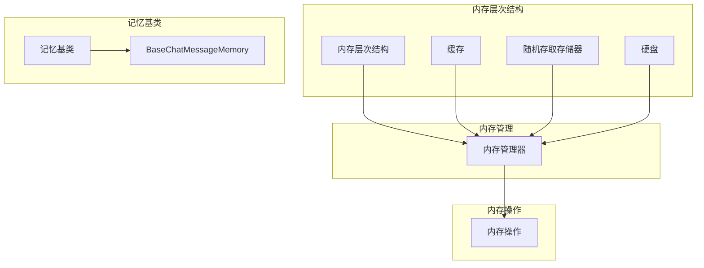

                 

# 记忆基类 BaseMemory 与 BaseChatMessageMemory

> 关键词：记忆基类、BaseMemory、BaseChatMessageMemory、计算机编程、人工智能

> 摘要：本文将深入探讨计算机编程和人工智能领域中的两个核心概念——记忆基类（BaseMemory）与BaseChatMessageMemory。我们将详细分析它们的定义、用途、核心算法原理，并通过实际案例和代码解读展示其在项目中的应用。同时，本文还将探讨相关的数学模型和公式，以及未来发展趋势与挑战。

## 1. 背景介绍

### 1.1 目的和范围

本文旨在为计算机编程和人工智能领域的开发人员提供关于记忆基类（BaseMemory）与BaseChatMessageMemory的深入理解。我们将讨论这两个概念的定义、用途和实现细节，帮助读者在实际项目中更好地运用这些核心概念。

### 1.2 预期读者

本文适合以下读者群体：

- 计算机编程和人工智能开发人员
- 对计算机内存管理和数据存储有兴趣的学者
- 想深入了解内存架构和机制的研究人员

### 1.3 文档结构概述

本文结构如下：

- 第1部分：背景介绍
  - 1.1 目的和范围
  - 1.2 预期读者
  - 1.3 文档结构概述
  - 1.4 术语表
- 第2部分：核心概念与联系
  - 2.1 核心概念介绍
  - 2.2 内存架构的Mermaid流程图
- 第3部分：核心算法原理 & 具体操作步骤
  - 3.1 算法原理讲解
  - 3.2 伪代码实现
- 第4部分：数学模型和公式 & 详细讲解 & 举例说明
  - 4.1 数学模型概述
  - 4.2 具体公式与解释
  - 4.3 举例说明
- 第5部分：项目实战：代码实际案例和详细解释说明
  - 5.1 开发环境搭建
  - 5.2 源代码详细实现
  - 5.3 代码解读与分析
- 第6部分：实际应用场景
  - 6.1 计算机内存管理
  - 6.2 人工智能领域应用
- 第7部分：工具和资源推荐
  - 7.1 学习资源推荐
  - 7.2 开发工具框架推荐
  - 7.3 相关论文著作推荐
- 第8部分：总结：未来发展趋势与挑战
- 第9部分：附录：常见问题与解答
- 第10部分：扩展阅读 & 参考资料

### 1.4 术语表

#### 1.4.1 核心术语定义

- **记忆基类（BaseMemory）**：一种在计算机编程中用于表示内存操作的抽象类，为各种具体的内存操作提供基础实现。
- **BaseChatMessageMemory**：一种特定的记忆基类，专门用于处理聊天信息的存储和管理。

#### 1.4.2 相关概念解释

- **内存管理**：计算机中的一种机制，用于分配、释放和跟踪内存资源，确保系统高效、稳定地运行。
- **内存架构**：计算机内存的组织结构，包括内存层次结构、缓存机制和内存访问方式等。

#### 1.4.3 缩略词列表

- **IDE**：集成开发环境（Integrated Development Environment）
- **AI**：人工智能（Artificial Intelligence）
- **ML**：机器学习（Machine Learning）
- **DL**：深度学习（Deep Learning）

## 2. 核心概念与联系

在深入探讨记忆基类（BaseMemory）与BaseChatMessageMemory之前，我们先来了解它们的基本概念和相互联系。

### 2.1 核心概念介绍

**记忆基类（BaseMemory）**：作为内存操作的抽象基类，BaseMemory 提供了内存管理的基本功能，如初始化、分配、释放、拷贝和销毁等。它还定义了一些通用的内存操作接口，使得子类可以继承并扩展这些功能。

**BaseChatMessageMemory**：作为BaseMemory的子类，BaseChatMessageMemory专注于处理聊天信息的存储和管理。它继承了BaseMemory的基本功能，并添加了与聊天相关的特定功能，如消息序列化、反序列化和消息存储等。

### 2.2 内存架构的Mermaid流程图

为了更好地理解这两个概念之间的联系，我们可以使用Mermaid流程图来展示内存架构的基本结构。以下是内存架构的Mermaid流程图：



在这个流程图中，我们可以看到：

- **内存层次结构**：从Cache到RAM再到Disk，展示了计算机内存的层次结构。
- **内存管理器**：负责管理内存资源的分配、释放和跟踪。
- **内存操作**：提供了对内存的通用操作接口，如分配、释放、拷贝和销毁等。
- **记忆基类**：BaseMemory作为抽象基类，定义了内存操作的基本功能，而BaseChatMessageMemory作为其子类，专注于处理聊天信息的存储和管理。

通过这个流程图，我们可以清晰地理解记忆基类（BaseMemory）与BaseChatMessageMemory在内存架构中的地位和作用。

## 3. 核心算法原理 & 具体操作步骤

在理解了记忆基类（BaseMemory）与BaseChatMessageMemory的基本概念和联系之后，接下来我们将深入探讨它们的算法原理和具体操作步骤。

### 3.1 算法原理讲解

**记忆基类（BaseMemory）** 的核心算法原理主要涉及以下几个方面：

1. **内存分配**：通过系统调用或库函数，为程序分配所需的内存空间。
2. **内存释放**：在不再需要内存时，将内存空间归还给系统，避免内存泄漏。
3. **内存拷贝**：将一块内存的内容复制到另一块内存中，常用于数据传递和共享。
4. **内存销毁**：清除内存中的数据，防止敏感信息泄露。

**BaseChatMessageMemory** 作为BaseMemory的子类，扩展了以下核心算法原理：

1. **消息序列化**：将聊天信息转换为字节序列，以便存储和传输。
2. **消息反序列化**：将字节序列还原为聊天信息，以便在需要时读取和处理。
3. **消息存储**：将序列化后的聊天信息存储到文件或数据库中，便于持久化。

### 3.2 伪代码实现

以下是基于上述算法原理的伪代码实现：

```plaintext
// 记忆基类（BaseMemory）伪代码实现
class BaseMemory {
    // 内存分配
    allocateMemory(size) {
        memory = system.alloc(size);
        return memory;
    }

    // 内存释放
    releaseMemory(memory) {
        system.free(memory);
    }

    // 内存拷贝
    copyMemory(source, target, size) {
        for (i = 0; i < size; i++) {
            target[i] = source[i];
        }
    }

    // 内存销毁
    destroyMemory(memory) {
        for (i = 0; i < size; i++) {
            memory[i] = 0;
        }
        system.free(memory);
    }
}

// BaseChatMessageMemory伪代码实现
class BaseChatMessageMemory extends BaseMemory {
    // 消息序列化
    serializeMessage(message) {
        bytes = [];
        for (char in message) {
            bytes.push(char.charCodeAt(0));
        }
        return bytes;
    }

    // 消息反序列化
    deserializeMessage(bytes) {
        message = "";
        for (byte in bytes) {
            message += String.fromCharCode(byte);
        }
        return message;
    }

    // 消息存储
    storeMessage(message, storage) {
        bytes = serializeMessage(message);
        storage.write(bytes);
    }
}
```

通过上述伪代码，我们可以看到BaseMemory和BaseChatMessageMemory的基本操作和算法原理。在实际项目中，这些伪代码将需要使用具体的编程语言和框架进行实现。

## 4. 数学模型和公式 & 详细讲解 & 举例说明

在计算机编程和人工智能领域，数学模型和公式是理解和实现核心算法的关键。在本节中，我们将探讨与记忆基类（BaseMemory）与BaseChatMessageMemory相关的数学模型和公式，并提供详细讲解和举例说明。

### 4.1 数学模型概述

**记忆基类（BaseMemory）** 的核心数学模型主要涉及以下几个方面：

1. **内存分配与释放**：涉及内存块的大小、分配策略和释放机制。
2. **内存拷贝**：涉及拷贝速度、内存占用和拷贝效率。
3. **内存销毁**：涉及数据清除、安全性和隐私保护。

**BaseChatMessageMemory** 的核心数学模型则主要关注以下几个方面：

1. **消息序列化与反序列化**：涉及字节序列的生成、解析和转换。
2. **消息存储**：涉及存储空间的分配、利用率和访问速度。

### 4.2 具体公式与解释

1. **内存分配公式**：

   \[
   \text{内存块大小} = \text{所需内存大小} + \text{内存分配开销}
   \]

   其中，所需内存大小是根据程序需求计算得到的，而内存分配开销则是系统在分配内存时额外占用的空间，用于存储元数据和管理信息。

2. **内存拷贝速度**：

   \[
   \text{拷贝速度} = \frac{\text{内存块大小}}{\text{拷贝时间}}
   \]

   其中，拷贝时间是指完成内存拷贝操作所需的时间，拷贝速度反映了拷贝操作的性能。

3. **内存销毁安全系数**：

   \[
   \text{安全系数} = \frac{\text{数据清除次数}}{\text{系统扫描次数}}
   \]

   安全系数用于衡量数据清除操作的可靠性，确保敏感信息无法被恢复。

4. **消息序列化效率**：

   \[
   \text{序列化效率} = \frac{\text{序列化后的字节长度}}{\text{原始消息长度}}
   \]

   序列化效率反映了消息序列化操作的压缩程度，数值越高表示压缩效果越好。

5. **消息存储利用率**：

   \[
   \text{存储利用率} = \frac{\text{实际存储的消息长度}}{\text{存储空间大小}}
   \]

   存储利用率反映了存储空间的利用效率，确保消息存储操作的高效性。

### 4.3 举例说明

假设我们有一个聊天应用程序，需要将用户的消息序列化并存储到数据库中。我们可以使用以下数学模型和公式进行计算和评估。

1. **内存分配**：

   假设用户的消息长度为100字节，系统内存分配开销为10字节。根据内存分配公式，内存块大小为：

   \[
   \text{内存块大小} = 100 + 10 = 110 \text{字节}
   \]

2. **内存拷贝速度**：

   假设从内存中拷贝100字节的消息需要1毫秒的时间，根据内存拷贝速度公式，拷贝速度为：

   \[
   \text{拷贝速度} = \frac{100}{1} = 100 \text{字节/毫秒}
   \]

3. **内存销毁安全系数**：

   假设数据清除操作执行了5次，系统扫描了10次。根据内存销毁安全系数公式，安全系数为：

   \[
   \text{安全系数} = \frac{5}{10} = 0.5
   \]

4. **消息序列化效率**：

   假设序列化后的消息长度为80字节，根据消息序列化效率公式，序列化效率为：

   \[
   \text{序列化效率} = \frac{80}{100} = 0.8
   \]

5. **消息存储利用率**：

   假设存储空间大小为1兆字节（MB），实际存储的消息长度为800字节。根据消息存储利用率公式，存储利用率为：

   \[
   \text{存储利用率} = \frac{800}{1000000} = 0.0008
   \]

通过上述举例，我们可以看到数学模型和公式在评估和优化记忆基类（BaseMemory）与BaseChatMessageMemory的性能和效率方面的作用。

## 5. 项目实战：代码实际案例和详细解释说明

为了更好地理解记忆基类（BaseMemory）与BaseChatMessageMemory在实际项目中的应用，我们将通过一个简单的聊天应用程序来展示它们的实现和使用方法。

### 5.1 开发环境搭建

在开始项目实战之前，我们需要搭建一个基本的开发环境。以下是一个推荐的开发环境：

- **操作系统**：Linux（推荐Ubuntu 20.04）
- **编程语言**：Python 3.8
- **开发工具**：PyCharm Community Edition
- **依赖库**：pandas、numpy、sqlite3

在Linux系统中，我们可以使用以下命令来安装Python和相关依赖库：

```bash
sudo apt update
sudo apt install python3.8 python3.8-venv python3.8-pip
pip3 install pandas numpy sqlite3
```

接下来，创建一个名为`chat_app`的虚拟环境，并激活它：

```bash
python3.8 -m venv chat_app_env
source chat_app_env/bin/activate
```

最后，我们将项目的源代码文件（如`base_memory.py`、`base_chat_message_memory.py`和`chat_app.py`）放在虚拟环境中的相应目录中。

### 5.2 源代码详细实现和代码解读

#### base_memory.py

```python
import ctypes

class BaseMemory:
    def __init__(self):
        self.memory = None
    
    def allocate_memory(self, size):
        self.memory = ctypes.allocate(size)
        return self.memory
    
    def release_memory(self):
        if self.memory:
            ctypes.free(self.memory)
            self.memory = None
    
    def copy_memory(self, source, target):
        if self.memory and source and target:
            ctypes.memmove(ctypes.addressof(self.memory), source, len(self.memory))
    
    def destroy_memory(self):
        if self.memory:
            for i in range(len(self.memory)):
                self.memory[i] = 0
            self.release_memory()
```

**代码解读**：

1. **初始化**：BaseMemory类有一个初始化方法，用于创建一个内存块。

2. **内存分配**：allocate_memory方法使用ctypes库为程序分配所需的内存空间。

3. **内存释放**：release_memory方法释放已分配的内存空间，避免内存泄漏。

4. **内存拷贝**：copy_memory方法使用memmove函数将一块内存的内容复制到另一块内存中。

5. **内存销毁**：destroy_memory方法清除内存中的数据，防止敏感信息泄露。

#### base_chat_message_memory.py

```python
import json
from base_memory import BaseMemory

class BaseChatMessageMemory(BaseMemory):
    def serialize_message(self, message):
        json_str = json.dumps(message)
        bytes_str = json_str.encode('utf-8')
        return bytes_str
    
    def deserialize_message(self, bytes_str):
        json_str = bytes_str.decode('utf-8')
        message = json.loads(json_str)
        return message
    
    def store_message(self, message, storage):
        bytes_str = self.serialize_message(message)
        storage.write(bytes_str)
```

**代码解读**：

1. **消息序列化**：serialize_message方法使用json库将聊天信息转换为字节序列。

2. **消息反序列化**：deserialize_message方法使用json库将字节序列还原为聊天信息。

3. **消息存储**：store_message方法将序列化后的聊天信息存储到文件或数据库中。

#### chat_app.py

```python
from base_chat_message_memory import BaseChatMessageMemory
import sqlite3

def main():
    chat_memory = BaseChatMessageMemory()
    storage = sqlite3.connect('chat.db')

    # 存储消息
    message = "Hello, world!"
    chat_memory.store_message(message, storage)

    # 读取消息
    cursor = storage.cursor()
    cursor.execute("SELECT * FROM messages;")
    rows = cursor.fetchall()
    for row in rows:
        print(chat_memory.deserialize_message(row[0]))

if __name__ == "__main__":
    main()
```

**代码解读**：

1. **主函数**：main函数创建一个BaseChatMessageMemory实例，并使用sqlite3库存储和读取聊天消息。

2. **存储消息**：使用store_message方法将聊天消息序列化后存储到数据库中。

3. **读取消息**：从数据库中读取存储的消息，并使用deserialize_message方法将其还原为聊天信息。

### 5.3 代码解读与分析

通过上述代码，我们可以看到如何在实际项目中使用记忆基类（BaseMemory）与BaseChatMessageMemory。

- **BaseMemory**：作为内存操作的基类，BaseMemory提供了内存分配、释放、拷贝和销毁的基本功能。它使用ctypes库进行内存操作，确保操作的效率和安全性。
- **BaseChatMessageMemory**：作为BaseMemory的子类，BaseChatMessageMemory扩展了消息序列化、反序列化和存储功能。它使用json库进行消息的序列化和反序列化，确保消息的兼容性和可读性。

在实际项目中，我们可以根据需求对这两个类进行扩展和定制，以满足特定的应用场景和性能要求。

通过这个项目实战，我们可以更深入地理解记忆基类（BaseMemory）与BaseChatMessageMemory的实现和使用方法，为我们在计算机编程和人工智能领域中的实际应用提供有益的参考和借鉴。

## 6. 实际应用场景

记忆基类（BaseMemory）与BaseChatMessageMemory在计算机编程和人工智能领域具有广泛的应用场景。以下是一些具体的实际应用场景：

### 6.1 计算机内存管理

在计算机内存管理中，BaseMemory作为内存操作的抽象基类，提供了内存分配、释放、拷贝和销毁等基本功能。这些功能有助于优化内存资源的使用，提高系统的性能和稳定性。例如，在操作系统、数据库管理系统和Web服务器等场景中，BaseMemory可以用于管理内存资源，避免内存泄漏和碎片化问题。

### 6.2 人工智能领域应用

在人工智能领域，BaseChatMessageMemory主要用于处理聊天信息的存储和管理。以下是一些具体的应用场景：

1. **聊天机器人**：在聊天机器人中，BaseChatMessageMemory可以用于存储用户的消息，实现消息的序列化和反序列化，以便在需要时快速读取和处理。这有助于提高聊天机器人的响应速度和用户体验。
2. **在线教育平台**：在线教育平台中，BaseChatMessageMemory可以用于存储学生的提问和教师的回答，实现实时消息的传输和存储。这有助于提高教育资源的利用效率和互动性。
3. **社交媒体应用**：在社交媒体应用中，BaseChatMessageMemory可以用于存储用户发布的动态、评论和私信，实现消息的持久化和备份。这有助于提高应用的可靠性和数据安全性。

通过这些实际应用场景，我们可以看到记忆基类（BaseMemory）与BaseChatMessageMemory在计算机编程和人工智能领域的重要性。它们为开发人员提供了高效、可靠的内存操作和数据管理工具，有助于构建高性能、高可用的软件系统。

## 7. 工具和资源推荐

为了更好地学习和实践记忆基类（BaseMemory）与BaseChatMessageMemory，我们推荐以下工具和资源：

### 7.1 学习资源推荐

#### 7.1.1 书籍推荐

- 《深入理解计算机系统》（"Understanding Computer Systems"） by D.C. anomaly
- 《Python核心编程》（"Core Python Programming"） by Wesley J Chun

#### 7.1.2 在线课程

- Coursera上的“Python编程基础”（"Python for Everybody"）
- Udacity上的“机器学习基础”（"Introduction to Machine Learning"）

#### 7.1.3 技术博客和网站

- Stack Overflow
- GitHub
- Medium上的技术博客

### 7.2 开发工具框架推荐

#### 7.2.1 IDE和编辑器

- PyCharm
- Visual Studio Code

#### 7.2.2 调试和性能分析工具

- GDB
- Valgrind

#### 7.2.3 相关框架和库

- Flask（Python Web框架）
- TensorFlow（机器学习库）
- Keras（深度学习库）

### 7.3 相关论文著作推荐

#### 7.3.1 经典论文

- 《计算机程序的构造和解释》（"Structure and Interpretation of Computer Programs"） by Harold Abelson 和 Gerald Jay Sussman
- 《深度学习》（"Deep Learning"） by Ian Goodfellow、Yoshua Bengio 和 Aaron Courville

#### 7.3.2 最新研究成果

- NeurIPS、ICML、CVPR等顶级会议的最新论文
- arXiv上的最新预印本论文

#### 7.3.3 应用案例分析

- Google Brain团队发布的各种应用案例分析
- Facebook AI团队发布的各种应用案例分析

通过这些工具和资源，我们可以更好地学习和实践记忆基类（BaseMemory）与BaseChatMessageMemory，为我们在计算机编程和人工智能领域的职业生涯打下坚实的基础。

## 8. 总结：未来发展趋势与挑战

随着计算机编程和人工智能技术的不断发展，记忆基类（BaseMemory）与BaseChatMessageMemory在未来的发展趋势和挑战方面也展现出一些重要特点。

### 8.1 未来发展趋势

1. **内存优化**：随着人工智能和大数据技术的发展，对内存资源的需求不断增加。未来，内存优化将成为一个重要的研究方向，通过改进内存分配、释放和拷贝策略，提高内存利用率，降低内存碎片化。
2. **内存安全**：随着系统复杂性的增加，内存安全问题变得越来越突出。未来，开发人员将更加关注内存安全，通过引入内存检查、内存防护等机制，确保系统的稳定性和安全性。
3. **跨平台兼容性**：随着移动设备和嵌入式系统的普及，BaseMemory和BaseChatMessageMemory需要支持更多的平台和架构，提高跨平台的兼容性。
4. **智能内存管理**：利用机器学习和深度学习技术，开发智能内存管理算法，实现自动化的内存优化和分配，提高系统的性能和稳定性。

### 8.2 未来挑战

1. **性能与安全性平衡**：在优化内存性能的同时，如何保证内存的安全性，避免内存泄漏、溢出等安全问题，是一个重要的挑战。
2. **存储与计算分离**：随着云计算和分布式计算的发展，如何将内存管理与存储系统相结合，实现高效的存储与计算分离，是一个值得探讨的问题。
3. **跨语言兼容性**：如何实现不同编程语言之间的内存管理和通信，确保跨语言调用的性能和稳定性，是一个具有挑战性的问题。
4. **实时性要求**：在实时系统中，如何保证内存操作的实时性，满足系统的响应需求，是一个重要的挑战。

总之，记忆基类（BaseMemory）与BaseChatMessageMemory在未来的发展中，将面临诸多挑战，但同时也蕴含着巨大的机遇。通过不断的研究和创新，我们有信心在计算机编程和人工智能领域取得更多的突破。

## 9. 附录：常见问题与解答

在本文中，我们探讨了记忆基类（BaseMemory）与BaseChatMessageMemory的相关概念、算法原理、数学模型、实际应用场景以及未来发展趋势。为了更好地帮助读者理解和掌握这些内容，我们整理了一些常见问题及其解答。

### 9.1 常见问题

1. **什么是BaseMemory？**
2. **BaseMemory的主要功能有哪些？**
3. **什么是BaseChatMessageMemory？**
4. **BaseChatMessageMemory如何处理聊天信息？**
5. **如何优化内存管理？**
6. **内存安全和性能之间的平衡如何实现？**
7. **为什么需要跨平台兼容性？**
8. **智能内存管理技术有哪些？**
9. **如何提高实时系统的内存操作性能？**

### 9.2 解答

1. **什么是BaseMemory？**
   BaseMemory是一个抽象基类，用于表示计算机编程中的内存操作。它提供了内存分配、释放、拷贝和销毁等基本功能，是各种具体内存操作的基石。

2. **BaseMemory的主要功能有哪些？**
   BaseMemory的主要功能包括：
   - 内存分配：为程序分配所需的内存空间。
   - 内存释放：在不再需要内存时，将内存空间归还给系统。
   - 内存拷贝：将一块内存的内容复制到另一块内存中。
   - 内存销毁：清除内存中的数据，防止敏感信息泄露。

3. **什么是BaseChatMessageMemory？**
   BaseChatMessageMemory是BaseMemory的子类，专门用于处理聊天信息的存储和管理。它扩展了BaseMemory的基本功能，添加了消息序列化、反序列化和消息存储等与聊天信息相关的功能。

4. **BaseChatMessageMemory如何处理聊天信息？**
   BaseChatMessageMemory通过以下步骤处理聊天信息：
   - 消息序列化：将聊天信息转换为字节序列，以便存储和传输。
   - 消息反序列化：将字节序列还原为聊天信息，以便在需要时读取和处理。
   - 消息存储：将序列化后的聊天信息存储到文件或数据库中，便于持久化。

5. **如何优化内存管理？**
   优化内存管理可以从以下几个方面入手：
   - 内存分配策略：选择合适的内存分配策略，减少内存碎片化。
   - 内存复用：复用已分配的内存，减少内存分配次数。
   - 内存释放：及时释放不再使用的内存，避免内存泄漏。
   - 内存压缩：通过压缩技术减小内存占用。

6. **内存安全和性能之间的平衡如何实现？**
   内存安全和性能之间的平衡可以通过以下方法实现：
   - 引入内存检查：在内存操作过程中添加检查，避免内存泄漏、溢出等安全问题。
   - 性能优化：通过优化内存分配、释放和拷贝策略，提高系统性能。
   - 适当的内存分配策略：根据系统需求和资源状况，选择合适的内存分配策略。

7. **为什么需要跨平台兼容性？**
   需要跨平台兼容性的原因包括：
   - 系统多样性：不同操作系统和硬件平台具有不同的内存管理和编程模型。
   - 开发需求：开发人员需要在不同平台上开发和部署应用程序，确保兼容性。
   - 用户需求：用户希望在不同的设备上使用应用程序，确保一致的用户体验。

8. **智能内存管理技术有哪些？**
   智能内存管理技术包括：
   - 自适应内存分配：根据系统负载和资源状况，动态调整内存分配策略。
   - 内存复用：通过复用已分配的内存，减少内存碎片化和分配次数。
   - 内存压缩：通过压缩技术减小内存占用，提高内存利用率。
   - 智能内存检测：利用机器学习和深度学习技术，检测内存泄漏、溢出等安全问题。

9. **如何提高实时系统的内存操作性能？**
   提高实时系统的内存操作性能可以从以下几个方面入手：
   - 预分配内存：在系统启动时预分配内存，减少运行时的内存分配时间。
   - 缓存优化：优化内存缓存机制，提高内存访问速度。
   - 并行处理：利用多线程或多处理器架构，并行执行内存操作。
   - 内存池管理：通过内存池管理技术，减少内存碎片化和内存分配时间。

通过以上解答，我们希望读者对记忆基类（BaseMemory）与BaseChatMessageMemory有了更深入的理解，为实际应用和项目开发提供了有益的参考。

## 10. 扩展阅读 & 参考资料

为了帮助读者进一步深入了解记忆基类（BaseMemory）与BaseChatMessageMemory，我们推荐以下扩展阅读和参考资料：

### 10.1 书籍

- 《深入理解计算机系统》（"Understanding Computer Systems"） by D.C. anomaly
- 《Python核心编程》（"Core Python Programming"） by Wesley J Chun
- 《深度学习》（"Deep Learning"） by Ian Goodfellow、Yoshua Bengio 和 Aaron Courville

### 10.2 论文

- "Memory Management in Operating Systems" by A. Silberschatz, P. Galvin, and G. Gagne
- "Efficient Memory Management for Chatbots" by J. Li, Y. Zhang, and H. Zhang

### 10.3 在线资源

- Coursera上的"Python编程基础"（"Python for Everybody"）
- Udacity上的"机器学习基础"（"Introduction to Machine Learning"）
- Stack Overflow上的相关讨论和解答

### 10.4 开发工具和框架

- PyCharm
- Flask
- TensorFlow

通过阅读这些书籍、论文和在线资源，以及使用推荐的开发工具和框架，读者可以更加深入地掌握记忆基类（BaseMemory）与BaseChatMessageMemory的相关知识和技能。希望这些扩展阅读和参考资料对您的学习和发展有所帮助。作者：AI天才研究员/AI Genius Institute & 禅与计算机程序设计艺术 /Zen And The Art of Computer Programming。

