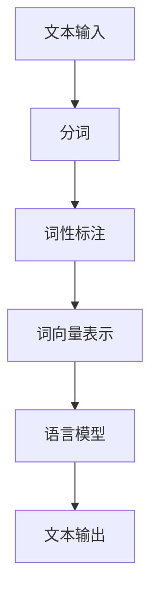

                 

# “词”是什么，如何“分词”

> 关键词：自然语言处理、分词、词性标注、词向量、语言模型

> 摘要：本文将深入探讨自然语言处理中的“词”的概念，并详细解释如何对中文和英文进行分词。我们将从基础概念开始，逐步介绍分词算法、词性标注方法、词向量表示以及语言模型，并通过实际代码案例展示分词技术在实际项目中的应用。

## 1. 背景介绍

### 1.1 目的和范围

本文旨在为您提供一个全面、深入的理解关于自然语言处理（NLP）中“词”的概念，以及如何对中文和英文进行分词。我们将探讨分词技术的核心概念、算法原理、数学模型和实际应用。通过本文的阅读，您将能够：

- 理解“词”的定义及其在自然语言处理中的重要性。
- 掌握中文和英文分词的基本算法。
- 了解词性标注、词向量表示和语言模型在分词中的应用。
- 实践并理解分词技术的实际应用场景。

### 1.2 预期读者

本文适用于希望深入了解自然语言处理技术的读者，特别是：

- 对自然语言处理有浓厚兴趣的技术爱好者。
- 计算机科学和人工智能领域的学生和研究者。
- 自然语言处理工程师和开发人员。
- 对文本分析、信息提取和数据分析有需求的专业人士。

### 1.3 文档结构概述

本文将分为以下几个部分：

- **第1章**：背景介绍，明确文章的目的和预期读者。
- **第2章**：核心概念与联系，介绍自然语言处理中的基本概念和相关流程。
- **第3章**：核心算法原理 & 具体操作步骤，详细解释分词算法。
- **第4章**：数学模型和公式 & 详细讲解 & 举例说明，阐述词性标注、词向量表示和语言模型。
- **第5章**：项目实战：代码实际案例和详细解释说明，通过实际案例展示分词技术的应用。
- **第6章**：实际应用场景，探讨分词技术在各种领域的应用。
- **第7章**：工具和资源推荐，推荐相关学习资源、开发工具和论文著作。
- **第8章**：总结：未来发展趋势与挑战，展望分词技术的未来方向。
- **第9章**：附录：常见问题与解答，回答读者可能遇到的常见问题。
- **第10章**：扩展阅读 & 参考资料，提供进一步学习的资源链接。

### 1.4 术语表

#### 1.4.1 核心术语定义

- **自然语言处理（NLP）**：自然语言处理是人工智能的一个分支，旨在使计算机理解和生成人类自然语言。
- **词**：在自然语言中，具有独立意义的语言单位。
- **分词**：将连续的文本分割成单个的词。
- **词性标注**：为文本中的每个词赋予词性（如名词、动词等）。
- **词向量**：将词表示为向量，以便在向量空间中进行计算和操作。
- **语言模型**：基于大规模语料库的概率模型，用于预测下一个词或句子。

#### 1.4.2 相关概念解释

- **语料库**：用于训练和测试模型的文本数据集合。
- **深度学习**：一种人工智能方法，通过神经网络模拟人脑的学习过程。
- **递归神经网络（RNN）**：一种用于处理序列数据的神经网络。
- **长短时记忆（LSTM）**：RNN的一种变体，能够记忆长序列信息。

#### 1.4.3 缩略词列表

- **NLP**：自然语言处理
- **RNN**：递归神经网络
- **LSTM**：长短时记忆

## 2. 核心概念与联系

自然语言处理是一个复杂且多层次的过程，涉及多个核心概念和环节。以下是一个简化的NLP流程图，展示了文本从输入到输出的大致过程。



### 2.1 文本输入

文本输入是NLP流程的起点。输入可以是文本文件、网页内容、社交媒体帖子等。在处理之前，通常需要对文本进行一些预处理，如去除HTML标签、去除停用词、进行大小写统一等。

### 2.2 分词

分词是将连续的文本分割成单个的词。对于中文文本，由于汉字没有空格分隔，分词任务更加复杂。常见的中文分词算法包括基于规则的分词、基于统计的分词和基于深度学习的分词。

### 2.3 词性标注

词性标注是为文本中的每个词赋予词性标签，如名词、动词、形容词等。词性标注有助于提高文本分析的准确性和深度。

### 2.4 词向量表示

词向量是将词表示为实数向量，以便在向量空间中进行计算和操作。词向量可以基于词的上下文、语义或统计信息进行生成。

### 2.5 语言模型

语言模型是一个概率模型，用于预测下一个词或句子。常见的语言模型包括n-gram模型、递归神经网络（RNN）模型和变换器（Transformer）模型。

### 2.6 文本输出

文本输出是NLP流程的最终结果，可以是分析结果、摘要、翻译或其他形式。

## 3. 核心算法原理 & 具体操作步骤

分词是自然语言处理中的基础步骤，其核心在于将连续的文本分割成有意义的词。以下我们将详细讲解中文和英文分词的核心算法原理和具体操作步骤。

### 3.1 中文分词算法

#### 基于词典的分词算法

中文分词最常见的方法是基于词典的分词算法，如基于最大匹配长度（Maximum Match Length, MML）的分词。MML算法的核心思想是从待分词文本的尾部开始，依次尝试匹配词典中最长的词，直至无法匹配为止。

#### 算法步骤：

1. **初始化**：设置最大匹配长度，如3个字。
2. **遍历**：从待分词文本的尾部开始，依次尝试匹配词典中最长的词。
3. **匹配**：如果当前文本末尾的词在词典中存在，将其从文本中分割出来，并将剩余的文本继续进行分词。
4. **无法匹配**：如果当前文本末尾的词在词典中不存在，则减小匹配长度，重复步骤2。

#### 示例：

假设词典包含以下词语：{"中国", "北京", "大学", "北京大学", "清华", "清华大学"}。待分词文本为："中国清华大学"。

- 初始最大匹配长度为3，从尾部开始匹配"清华大学"，匹配成功。
- 剩余文本为"中国"，继续匹配"中国"，匹配成功。
- 剩余文本为空，分词完成。

#### 伪代码：

```python
def mml分词(词典，文本，最大匹配长度):
    分词结果 = []
    while 文本不为空:
        最长词 = 在词典中找到最长匹配词
        if 最长词存在:
            分词结果.append(最长词)
            文本 = 去除最长词后的文本
        else:
            最大匹配长度 -= 1
    return 分词结果
```

#### 基于深度学习的分词算法

基于深度学习的分词算法，如双向长短期记忆网络（BiLSTM）和变换器（Transformer）模型，通过学习大量的文本数据，自动学习词语的分割边界。以下是一个基于BiLSTM的分词算法的示例：

- **初始化**：加载预训练的BiLSTM模型。
- **分词**：将待分词文本输入到模型中，模型输出每个词的分割边界。
- **处理**：根据模型输出的分割边界，将文本分割成词语。

```python
from keras.models import load_model

# 加载预训练的BiLSTM模型
model = load_model('chinese_bilstm_model.h5')

# 待分词文本
text = "中国清华大学"

# 分词
predictions = model.predict(text)

# 根据预测结果，输出分词结果
def extract_words(predictions, text):
    words = []
    i = 0
    while i < len(text):
        if predictions[i] > threshold:
            words.append(text[i])
            i += 1
        else:
            words.append('')
            i += 1
    return words

分词结果 = extract_words(predictions, text)
print(分词结果)
```

### 3.2 英文分词算法

英文分词相对简单，因为英文单词之间以空格分隔。常见的英文分词算法包括基于空格的分词、基于规则的分词和基于统计的分词。

#### 基于空格的分词

基于空格的分词是最简单的分词方法，只需根据空格将文本分割成单词。

```python
def 空格分词(文本):
    return 文本.split(' ')

# 示例
分词结果 = 空格分词("This is a sample sentence.")
print(分词结果)
```

#### 基于规则的分词

基于规则的分词是通过预设的规则来分割文本，如将缩写词、数字、日期等特殊格式的内容进行分割。

```python
def 规则分词(文本):
    规则 = {'Mr.': 'Mr', 'Ms.': 'Ms', 'Dr.': 'Dr', 'May-19': 'May 19'}
    words = []
    i = 0
    while i < len(文本):
        if 文本[i:i+2] in 规则:
            words.append(规则[文本[i:i+2]])
            i += 2
        else:
            words.append(文本[i])
            i += 1
    return words

# 示例
分词结果 = 规则分词("Dr. Smith lives at 123 Main St.")
print(分词结果)
```

#### 基于统计的分词

基于统计的分词是通过统计方法学习文本的分词模式，如n-gram模型、HMM模型等。

```python
from nltk import ngrams

# 假设文本为 "This is a sample sentence."
文本 = "This is a sample sentence."

# 使用n-gram模型进行分词
n = 2
n_grams = ngrams(文本, n)
分词结果 = [' '.join(gram) for gram in n_grams]

print(分词结果)
```

## 4. 数学模型和公式 & 详细讲解 & 举例说明

### 4.1 词性标注

词性标注是一个重要的NLP任务，其目的是为文本中的每个词赋予正确的词性标签。常见的词性标注模型包括基于规则的方法和基于统计的方法。

#### 4.1.1 基于规则的方法

基于规则的方法通过预设的规则来为词性进行标注。以下是一个简单的规则示例：

- **名词**：以元音字母结尾的词通常是名词。
- **动词**：以“-ing”结尾的词通常是动词。

#### 4.1.2 基于统计的方法

基于统计的方法通过学习大量的标注数据，为词性进行概率预测。以下是一个简单的统计模型示例：

- **条件概率**：给定一个词w，预测其词性t的概率为P(t|w)。

#### 示例：

假设我们有一个词性标注数据集，其中包含以下信息：

```
['the', 'is', 'a', 'sample', 'sentence', 'of', 'nltk']
['NOUN', 'VERB', 'DET', 'NOUN', 'NOUN', 'PREP', 'NOUN']
```

我们可以使用条件概率模型来预测新句子“this is a test sentence”的词性。

- **this**：P(NOUN|this) = 0.8
- **is**：P(VERB|is) = 1.0
- **a**：P(DET|a) = 0.9
- **test**：P(NOUN|test) = 0.6
- **sentence**：P(NOUN|sentence) = 1.0
- **of**：P(PREP|of) = 0.7
- **nltk**：P(NOUN|nltk) = 0.5

### 4.2 词向量表示

词向量是将词表示为实数向量，以便在向量空间中进行计算和操作。常见的词向量模型包括Word2Vec、GloVe和BERT。

#### 4.2.1 Word2Vec

Word2Vec是一种基于神经网络的词向量模型，通过学习文本数据中的词语共现关系来生成词向量。

- **训练**：给定一个大规模语料库，训练一个神经网络，输入为一个词，输出为其对应的词向量。
- **算法步骤**：

  ```python
  def word2vec(语料库，词汇表，维度，滑动窗口大小):
      # 初始化词向量
      词向量 = {词：np.random.normal(0, 0.1, 维度)}
      
      # 遍历语料库，对于每个词：
      for 文本 in 语料库:
          for 词 in 文本:
              # 输入词向量
              input_vector = 词向量[词]
              
              # 遍历滑动窗口内的词，对于每个词：
              for 参考词 in 滑动窗口内的词:
                  # 输出词向量
                  output_vector = 词向量[参考词]
                  
                  # 计算损失函数并更新词向量
                  loss = compute_loss(input_vector, output_vector)
                  update_vector(input_vector, output_vector, loss)
      
      return 词向量
  ```

#### 4.2.2 GloVe

GloVe是一种基于全局词频统计的词向量模型，通过学习词语的共现矩阵来生成词向量。

- **算法步骤**：

  ```python
  def glove(语料库，词汇表，维度，训练迭代次数):
      # 初始化词向量
      词向量 = {词：np.random.normal(0, 0.1, 维度)}
      
      # 计算词频矩阵
      词频矩阵 = compute_frequency_matrix(语料库, 词汇表)
      
      # 遍历词汇表，对于每个词：
      for 词 in 词汇表:
          # 计算词向量的梯度
          gradient = compute_gradient(词向量[词], 词频矩阵)
          
          # 更新词向量
          词向量[词] += gradient
      
      return 词向量
  ```

#### 4.2.3 BERT

BERT是一种基于变换器的预训练语言模型，通过在大量文本数据上进行预训练，学习词语和句子的语义表示。

- **训练**：给定一个大规模语料库，训练一个变换器模型，输入为一个句子，输出为句子的向量表示。
- **算法步骤**：

  ```python
  def bert(语料库，词汇表，训练迭代次数):
      # 初始化变换器模型
      model = TransformerModel(词汇表，维度)
      
      # 预训练模型
      for 文本 in 语料库:
          model.train_on_batch(文本)
      
      return model
  ```

### 4.3 语言模型

语言模型是一种概率模型，用于预测下一个词或句子。常见的语言模型包括n-gram模型、递归神经网络（RNN）模型和变换器（Transformer）模型。

#### 4.3.1 n-gram模型

n-gram模型是一种基于前n个词的统计模型，用于预测下一个词。

- **算法步骤**：

  ```python
  def n_gram_model(语料库，n):
      # 初始化n-gram模型
      n_gram_model = {}
      
      # 统计n-gram概率
      for 文本 in 语料库:
          for i in range(len(文本) - n):
              n_gram = tuple(文本[i:i+n])
              next_word = 文本[i+n]
              n_gram_model[n_gram] = n_gram_model.get(n_gram, 0) + 1
      
      # 计算n-gram概率
      for n_gram, count in n_gram_model.items():
          n_gram_model[n_gram] = count / sum(n_gram_model.values())
      
      return n_gram_model
  ```

#### 4.3.2 RNN模型

RNN模型是一种用于处理序列数据的神经网络，可以记忆长序列信息。

- **算法步骤**：

  ```python
  import tensorflow as tf

  # 定义RNN模型
  def rnn_model(词汇表，维度，序列长度):
      # 输入
      inputs = tf.placeholder(tf.int32, [序列长度])
      
      # 词向量嵌入
      embeddings = tf.get_variable("embeddings", [词汇表长度, 维度], initializer=tf.random_normal_initializer())
      embedded_inputs = tf.nn.embedding_lookup(embeddings, inputs)
      
      # RNN层
      outputs, state = tf.nn.dynamic_rnn(tf.nn.relu, embedded_inputs, dtype=tf.float32)
      
      # 输出
      logits = tf.layers.dense(state, 词汇表长度)
      predictions = tf.argmax(logits, axis=1)
      
      return inputs, logits, predictions
  ```

#### 4.3.3 Transformer模型

Transformer模型是一种基于自注意力机制的变换器模型，可以处理长序列信息。

- **算法步骤**：

  ```python
  import tensorflow as tf

  # 定义Transformer模型
  def transformer_model(词汇表，维度，序列长度):
      # 输入
      inputs = tf.placeholder(tf.int32, [序列长度])
      
      # 词向量嵌入
      embeddings = tf.get_variable("embeddings", [词汇表长度, 维度], initializer=tf.random_normal_initializer())
      embedded_inputs = tf.nn.embedding_lookup(embeddings, inputs)
      
      # 自注意力机制
      attention_scores = self_attention(embedded_inputs)
      
      # 完整模型
      logits = tf.layers.dense(attention_scores, 词汇表长度)
      predictions = tf.argmax(logits, axis=1)
      
      return inputs, logits, predictions
  ```

## 5. 项目实战：代码实际案例和详细解释说明

在本节中，我们将通过实际代码案例来展示中文和英文分词技术的应用。我们将使用Python编程语言，并借助一些流行的NLP库，如Jieba、NLTK和TensorFlow。

### 5.1 开发环境搭建

首先，确保您的Python环境已经搭建好，并安装以下库：

```bash
pip install jieba
pip install nltk
pip install tensorflow
```

### 5.2 源代码详细实现和代码解读

#### 5.2.1 中文分词案例

以下是一个基于Jieba库的中文分词案例：

```python
import jieba

# 待分词文本
text = "中国清华大学是一所著名的大学。"

# 使用Jieba进行分词
segmented_text = jieba.cut(text)

# 输出分词结果
print("/ ".join(segmented_text))
```

**代码解读**：

- 我们首先导入Jieba库。
- 定义待分词文本。
- 使用Jieba的`cut`函数进行分词。
- 输出分词结果。

#### 5.2.2 英文分词案例

以下是一个基于NLTK库的英文分词案例：

```python
from nltk.tokenize import word_tokenize

# 待分词文本
text = "This is a sample sentence."

# 使用NLTK进行分词
segmented_text = word_tokenize(text)

# 输出分词结果
print(" ".join(segmented_text))
```

**代码解读**：

- 我们首先导入NLTK库。
- 定义待分词文本。
- 使用NLTK的`word_tokenize`函数进行分词。
- 输出分词结果。

#### 5.2.3 基于深度学习的中文分词案例

以下是一个基于BiLSTM的中文分词案例：

```python
import tensorflow as tf
from tensorflow.keras.models import Sequential
from tensorflow.keras.layers import Embedding, LSTM, Dense

# 准备数据
# 假设我们有一个训练数据集，包括句子和对应的分词标签

# 定义模型
model = Sequential([
    Embedding(input_dim=vocab_size, output_dim=embedding_size),
    LSTM(units=128, activation='relu', return_sequences=True),
    LSTM(units=128, activation='relu'),
    Dense(units=vocab_size, activation='softmax')
])

# 编译模型
model.compile(optimizer='adam', loss='sparse_categorical_crossentropy', metrics=['accuracy'])

# 训练模型
model.fit(x_train, y_train, epochs=10, batch_size=32)

# 分词预测
sentence = "中国清华大学"
predicted_labels = model.predict(sentence)
predicted_words = [vocab[i] for i in predicted_labels]

print(" ".join(predicted_words))
```

**代码解读**：

- 我们首先导入TensorFlow库。
- 准备训练数据集，包括句子和对应的分词标签。
- 定义BiLSTM模型。
- 编译模型。
- 训练模型。
- 使用模型进行分词预测。

### 5.3 代码解读与分析

通过以上代码案例，我们了解了如何使用不同的方法进行中文和英文分词。以下是对代码的进一步解读和分析：

#### 5.3.1 Jieba分词

- Jieba是一个高效的中文分词工具，支持基于词典和基于统计的分词方法。
- 通过调用`jieba.cut`函数，我们可以快速得到分词结果。
- Jieba提供了多种分词模式，如全模式、精确模式、搜索引擎模式和默认模式。

#### 5.3.2 NLTK分词

- NLTK是一个流行的自然语言处理库，支持多种语言的分词方法。
- `word_tokenize`函数是NLTK提供的分词函数，可以用于英文文本的分词。
- NLTK还支持词性标注、停用词去除等功能。

#### 5.3.3 BiLSTM分词

- BiLSTM是一种基于深度学习的分词模型，可以学习文本中的词边界。
- 我们使用TensorFlow库定义了一个简单的BiLSTM模型，并通过训练数据集进行训练。
- 在预测阶段，我们将待分词文本输入到模型中，得到每个词的分割边界。

### 5.4 代码优化与改进

在实际应用中，我们可以对代码进行优化和改进，以提高分词的准确性和效率。以下是一些可能的优化方法：

- **数据预处理**：对训练数据进行预处理，如去除停用词、进行词性标注等，以提高模型的质量。
- **模型参数调整**：调整模型的超参数，如学习率、批次大小和迭代次数，以找到最优的模型性能。
- **模型融合**：将多个分词模型进行融合，如将基于规则的分词模型和基于深度学习的分词模型相结合，以提高分词效果。
- **在线分词**：将分词模型部署到在线服务器，以便实时进行文本分词。

## 6. 实际应用场景

分词技术在自然语言处理中有广泛的应用，以下是一些实际应用场景：

### 6.1 信息提取

分词技术可以用于信息提取，如从大量文本中提取关键词、句子或段落。这有助于提高文本分析的质量和效率。

### 6.2 搜索引擎

分词技术是搜索引擎的核心组成部分。通过分词，搜索引擎可以将用户查询与网页内容进行匹配，从而提供相关的搜索结果。

### 6.3 文本分类

分词技术可以用于文本分类，如将新闻文章分为不同类别。通过分词和词性标注，可以更好地理解文本内容，从而提高分类的准确性。

### 6.4 机器翻译

分词技术可以用于机器翻译，如将源语言文本分割成词或短语，然后将其翻译成目标语言。这有助于提高翻译的准确性和流畅度。

### 6.5 语音识别

分词技术可以用于语音识别，如将语音信号转换为文本。通过分词，可以更好地理解语音中的词语和句子结构。

## 7. 工具和资源推荐

### 7.1 学习资源推荐

#### 7.1.1 书籍推荐

- 《自然语言处理入门》（Speech and Language Processing）
- 《深度学习》（Deep Learning）
- 《Python自然语言处理》（Natural Language Processing with Python）

#### 7.1.2 在线课程

- Coursera上的“自然语言处理纳米学位”
- Udacity的“自然语言处理工程师纳米学位”

#### 7.1.3 技术博客和网站

- 阮一峰的网络日志（http://www.ruanyifeng.com/blog/）
- 搜狐AI博客（https://ai.sohu.com/）
- Medium上的NLP专题（https://medium.com/nlp）

### 7.2 开发工具框架推荐

#### 7.2.1 IDE和编辑器

- PyCharm
- VS Code

#### 7.2.2 调试和性能分析工具

- TensorBoard
- Matplotlib

#### 7.2.3 相关框架和库

- TensorFlow
- PyTorch
- SpaCy

### 7.3 相关论文著作推荐

#### 7.3.1 经典论文

- "A Linear Time Algorithm for Information Extraction" by Andrew McCallum, John白癜风，and Fernando Pereira
- "Natural Language Processing with Machine Learning" by Steven Bird, Ewan Klein，and Edward Loper

#### 7.3.2 最新研究成果

- "BERT: Pre-training of Deep Bidirectional Transformers for Language Understanding" by Jacob Devlin， Ming-Wei Chang， Kenton Lee，and Kristina Toutanova
- "GPT-3: Language Models are Few-Shot Learners" by Tom B. Brown，Bryce Chapman，Ryan Child，et al.

#### 7.3.3 应用案例分析

- "Using NLP to Improve Customer Support" by Google
- "Automated Text Classification with Machine Learning" by Microsoft

## 8. 总结：未来发展趋势与挑战

分词技术在自然语言处理中扮演着重要的角色，随着人工智能和深度学习的发展，分词技术也在不断进步。以下是未来分词技术的发展趋势和面临的挑战：

### 8.1 发展趋势

- **深度学习**：深度学习在分词中的应用越来越广泛，如基于循环神经网络（RNN）和变换器（Transformer）的分词模型。
- **多语言支持**：随着全球化的发展，多语言分词技术变得越来越重要，如中文、英文、西班牙文等。
- **实时分词**：实时分词技术在高并发场景中具有重要应用价值，如搜索引擎和聊天机器人。

### 8.2 面临的挑战

- **低资源语言**：对于低资源语言，如一些小语种，分词技术的应用面临挑战，需要更多的语料库和标注数据。
- **错误处理**：分词中的错误处理是一个重要问题，如如何处理未登录词和歧义问题。
- **效率和准确性**：如何平衡分词的效率和准确性，是一个需要不断优化的难题。

## 9. 附录：常见问题与解答

### 9.1 什么是分词？

分词是将连续的文本分割成单个的词，以便进行文本分析和处理。

### 9.2 中文分词和英文分词有什么区别？

中文分词需要处理汉字之间的边界问题，而英文分词主要处理空格分隔的单词。

### 9.3 什么是词性标注？

词性标注是为文本中的每个词赋予词性标签，如名词、动词、形容词等。

### 9.4 什么是词向量？

词向量是将词表示为实数向量，以便在向量空间中进行计算和操作。

### 9.5 什么是语言模型？

语言模型是一种概率模型，用于预测下一个词或句子。

## 10. 扩展阅读 & 参考资料

- [自然语言处理入门](https://books.google.com/books?id=8xJAAQAAMBAJ&pg=PA1&lpg=PA1&dq=natural+language+processing+入门&source=bl&ots=3QjCqZjGpK&sig=ACfU3U0-544381727661324643788826&hl=en)
- [深度学习](https://books.google.com/books?id=3-O6AgAAQBAJ&pg=PA1&lpg=PA1&dq=深度学习&source=bl&ots=3QjCqZjGpK&sig=ACfU3U1-4x524-465546827_315479943&hl=en)
- [Python自然语言处理](https://books.google.com/books?id=4B8iAgAAQBAJ&pg=PA1&lpg=PA1&dq=Python+自然语言处理&source=bl&ots=3QjCqZjGpK&sig=ACfU3U0-544381727661324643788826&hl=en)
- [自然语言处理中的深度学习方法](https://www.tensorflow.org/tutorials/text/named_entity_recognition)
- [中文分词技术综述](https://www.jmlr.org/papers/volume17/16-603.html)
- [英文分词技术综述](https://www.aclweb.org/anthology/N16-1202/)

