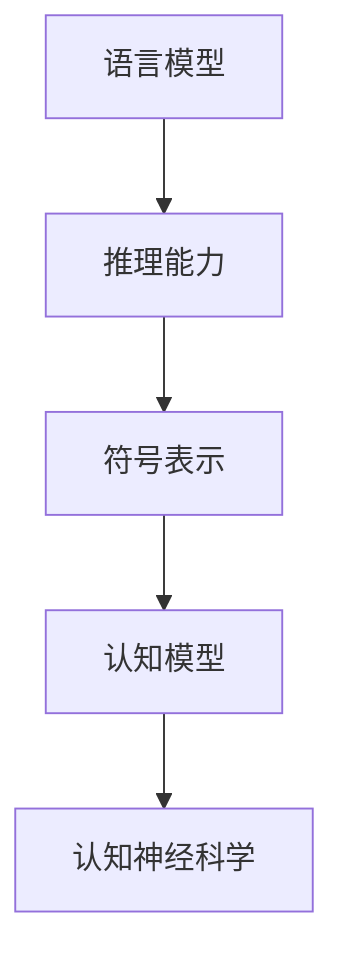

                 

# 语言≠思维：大模型无法推理的原因

> **关键词：** 语言模型，推理能力，符号表示，认知模型，认知神经科学，算法设计，人工智能。
> 
> **摘要：** 本文旨在探讨大模型在推理方面的局限性，分析语言与思维之间的关系，并从认知神经科学的角度出发，解释为什么语言模型无法达到人类的推理能力。通过深入分析核心概念和算法原理，本文为人工智能领域的进一步发展提出了新的思考方向。

## 1. 背景介绍

### 1.1 目的和范围

本文的目的是探讨大模型在推理能力方面的局限性，并分析其背后的原因。我们将从语言与思维的关系出发，结合认知神经科学的研究成果，深入探讨大模型无法达到人类推理能力的原因。本文主要关注以下几个方面：

- 语言模型的基本原理及其推理能力的局限性；
- 思维过程与语言表达的差异；
- 认知神经科学在解释人类推理能力方面的贡献；
- 大模型在算法设计上的改进方向。

### 1.2 预期读者

本文适合对人工智能和认知神经科学感兴趣的读者，包括但不限于：

- 人工智能研究者；
- 认知神经科学家；
- 数据科学家；
- 机器学习工程师；
- 计算机科学专业本科生和研究生。

### 1.3 文档结构概述

本文分为以下几个部分：

- 引言：介绍本文的目的、范围和预期读者；
- 核心概念与联系：介绍与本文主题相关的基本概念和原理；
- 核心算法原理与具体操作步骤：分析大模型的算法原理和操作步骤；
- 数学模型和公式：介绍与本文主题相关的数学模型和公式；
- 项目实战：通过实际案例说明算法的应用；
- 实际应用场景：探讨大模型在实际场景中的应用；
- 工具和资源推荐：推荐学习资源和开发工具；
- 总结：总结本文的主要观点和未来发展方向；
- 附录：回答常见问题；
- 扩展阅读：提供进一步阅读的参考资料。

### 1.4 术语表

#### 1.4.1 核心术语定义

- **语言模型**：一种统计模型，用于预测一个单词序列的概率分布。
- **推理能力**：从已知信息推导出新信息的能力。
- **符号表示**：使用符号来表示概念和关系。
- **认知模型**：描述人类思维过程和心理过程的数学模型。
- **认知神经科学**：研究大脑如何处理信息，以及如何影响人类行为的科学。
- **大模型**：具有大规模参数和训练数据的深度神经网络模型。

#### 1.4.2 相关概念解释

- **语言与思维的关系**：语言是人类思维的一种表达形式，但语言本身并不等同于思维。思维是一个更为复杂的心理过程，包括感知、记忆、判断、推理等。
- **符号表示与认知模型的关系**：符号表示是认知模型的一个重要组成部分，用于描述思维过程中的概念和关系。认知模型可以看作是一种基于符号表示的抽象模型。

#### 1.4.3 缩略词列表

- **AI**：人工智能（Artificial Intelligence）
- **DL**：深度学习（Deep Learning）
- **NLP**：自然语言处理（Natural Language Processing）
- **NN**：神经网络（Neural Network）
- **RNN**：循环神经网络（Recurrent Neural Network）
- **CNN**：卷积神经网络（Convolutional Neural Network）
- **CNN**：计算机视觉（Computer Vision）

## 2. 核心概念与联系

为了深入探讨大模型无法推理的原因，我们首先需要了解一些核心概念和它们之间的联系。

### 2.1 语言模型的基本原理

语言模型是一种用于预测单词序列概率分布的统计模型。在深度学习中，语言模型通常使用神经网络来实现。一个简单的语言模型可以使用以下公式表示：

$$P(w_1, w_2, \dots, w_n) = \prod_{i=1}^{n} P(w_i|w_{i-1}, \dots, w_1)$$

其中，$w_1, w_2, \dots, w_n$ 表示一个单词序列，$P(w_i|w_{i-1}, \dots, w_1)$ 表示在给定前一个单词序列的情况下，当前单词的概率。

### 2.2 推理能力的概念

推理能力是指从已知信息推导出新信息的能力。在人工智能领域，推理通常指符号推理，即使用符号表示的概念和关系进行推理。一个简单的推理过程可以表示为：

$$
\begin{cases}
H_1 \wedge H_2 \rightarrow C_1 \\
H_2 \wedge H_3 \rightarrow C_2 \\
\therefore H_1, H_2, H_3 \rightarrow C_1 \wedge C_2
\end{cases}
$$

其中，$H_1, H_2, H_3$ 表示假设，$C_1, C_2$ 表示结论。

### 2.3 认知神经科学的基本原理

认知神经科学是研究大脑如何处理信息，以及如何影响人类行为的科学。认知神经科学的一个重要概念是认知模型，它描述了人类思维过程的数学模型。一个简单的认知模型可以使用以下公式表示：

$$
\begin{align*}
C &= f(I) \\
I &= \sum_{i=1}^{n} w_i \cdot x_i \\
\end{align*}
$$

其中，$C$ 表示认知状态，$I$ 表示输入信息，$w_i$ 表示权重，$x_i$ 表示输入特征。

### 2.4 核心概念之间的联系

语言模型和推理能力是本文的核心概念。语言模型用于预测单词序列的概率分布，但无法直接进行推理。推理能力是通过符号表示和认知模型实现的。认知模型描述了人类思维过程的数学模型，可以用来解释为什么语言模型无法进行推理。

### 2.5 Mermaid 流程图

下面是一个简单的 Mermaid 流程图，展示了核心概念之间的联系：



## 3. 核心算法原理与具体操作步骤

### 3.1 语言模型算法原理

语言模型是一种统计模型，用于预测单词序列的概率分布。一个简单的语言模型可以使用以下算法原理：

#### 步骤 1：数据准备

- 收集大量的文本数据，例如新闻、文章、书籍等；
- 对文本数据进行预处理，包括分词、去停用词、词干提取等。

#### 步骤 2：特征提取

- 将文本数据转换为向量表示，可以使用词袋模型（Bag-of-Words，BoW）或词嵌入（Word Embedding）；
- 词袋模型将文本数据表示为单词的出现次数；
- 词嵌入将单词表示为密集的向量。

#### 步骤 3：模型训练

- 使用神经网络（例如循环神经网络 RNN、长短期记忆网络 LSTM、Transformer）进行训练；
- 输入一个单词序列，输出该序列的概率分布；
- 使用反向传播算法优化模型参数。

#### 步骤 4：模型评估

- 使用交叉验证或测试集评估模型性能；
- 评估指标包括准确率、召回率、F1 分数等。

### 3.2 伪代码

下面是语言模型算法的伪代码：

```python
# 数据准备
def preprocess_text(data):
    # 分词、去停用词、词干提取等
    return processed_data

# 特征提取
def extract_features(data):
    # 转换为向量表示
    return feature_vectors

# 模型训练
def train_model(features, labels):
    # 使用神经网络进行训练
    return model

# 模型评估
def evaluate_model(model, features, labels):
    # 使用交叉验证或测试集评估模型性能
    return performance
```

### 3.3 操作步骤详细讲解

#### 步骤 1：数据准备

数据准备是语言模型训练的基础。首先，我们需要收集大量的文本数据。这些数据可以来源于互联网上的新闻、文章、书籍等。接下来，我们对文本数据进行预处理，包括分词、去停用词、词干提取等。这些预处理步骤有助于提高模型性能和可解释性。

#### 步骤 2：特征提取

在特征提取阶段，我们将文本数据转换为向量表示。词袋模型是一种简单且常用的方法，它将文本数据表示为单词的出现次数。词袋模型的优点是计算简单，但缺点是忽略了单词之间的顺序信息。为了解决这个问题，我们可以使用词嵌入方法。词嵌入将单词表示为密集的向量，能够更好地捕捉单词之间的语义关系。

#### 步骤 3：模型训练

在模型训练阶段，我们使用神经网络进行训练。常用的神经网络包括循环神经网络 RNN、长短期记忆网络 LSTM、Transformer 等。这些神经网络能够通过学习输入数据的特征，预测单词序列的概率分布。在训练过程中，我们使用反向传播算法优化模型参数，以最小化预测误差。

#### 步骤 4：模型评估

在模型评估阶段，我们使用交叉验证或测试集评估模型性能。评估指标包括准确率、召回率、F1 分数等。这些指标能够帮助我们了解模型的性能，并调整模型参数以优化性能。

## 4. 数学模型和公式 & 详细讲解 & 举例说明

在讨论大模型的数学模型和公式时，我们首先需要明确一些基础概念，如概率分布、损失函数和优化算法。以下是这些概念的解释和相应的数学公式。

### 4.1 概率分布

概率分布是描述随机变量取值的可能性和分布情况的数学函数。在深度学习中，概率分布常用于表示数据生成模型或预测模型的输出。最常见的是多变量正态分布（Multivariate Normal Distribution）和贝叶斯分布（Bayesian Distribution）。

#### 4.1.1 多变量正态分布

多变量正态分布的概率密度函数为：

$$
p(\mathbf{x}|\boldsymbol{\mu}, \Sigma) = \frac{1}{(2\pi)^{d/2} |\Sigma|^{1/2}} \exp\left(-\frac{1}{2}(\mathbf{x} - \boldsymbol{\mu})^T \Sigma^{-1} (\mathbf{x} - \boldsymbol{\mu})\right)
$$

其中，$\mathbf{x}$ 是$d$维随机向量，$\boldsymbol{\mu}$ 是均值向量，$\Sigma$ 是协方差矩阵。

#### 4.1.2 贝叶斯分布

贝叶斯分布的概率密度函数为：

$$
p(\theta|\mathbf{x}) = \frac{p(\mathbf{x}|\theta)p(\theta)}{p(\mathbf{x})}
$$

其中，$\theta$ 是参数，$p(\mathbf{x}|\theta)$ 是似然函数，$p(\theta)$ 是先验概率，$p(\mathbf{x})$ 是证据。

### 4.2 损失函数

损失函数是评估模型预测值与真实值之间差异的指标。在深度学习中，常见的损失函数有均方误差（Mean Squared Error，MSE）、交叉熵损失（Cross-Entropy Loss）和结构相似性指数（Structural Similarity Index, SSIM）。

#### 4.2.1 均方误差

均方误差的定义为：

$$
L(\theta; \mathbf{x}, \mathbf{y}) = \frac{1}{2} \sum_{i=1}^{n} (y_i - \hat{y}_i)^2
$$

其中，$y_i$ 是第$i$个样本的真实值，$\hat{y}_i$ 是第$i$个样本的预测值。

#### 4.2.2 交叉熵损失

交叉熵损失的定义为：

$$
L(\theta; \mathbf{x}, \mathbf{y}) = -\sum_{i=1}^{n} y_i \log \hat{y}_i
$$

其中，$y_i$ 是第$i$个样本的标签，$\hat{y}_i$ 是第$i$个样本的预测概率。

#### 4.2.3 结构相似性指数

结构相似性指数的定义为：

$$
SSIM(\mathbf{x}, \hat{\mathbf{x}}) = \frac{(2\mu_x \mu_{\hat{\mathbf{x}}} + C_1)(2\sigma_{xx} \sigma_{\hat{x}x} + C_2)}{(\mu_x^2 + \sigma_{xx}^2 + C_1)(\mu_{\hat{\mathbf{x}}}^2 + \sigma_{\hat{x}x}^2 + C_2)}
$$

其中，$\mu_x$ 和 $\sigma_{xx}$ 分别是图像$x$的均值和协方差矩阵，$\mu_{\hat{\mathbf{x}}}$ 和 $\sigma_{\hat{x}x}$ 分别是图像$\hat{\mathbf{x}}$的均值和协方差矩阵，$C_1$ 和 $C_2$ 是常数。

### 4.3 优化算法

优化算法用于最小化损失函数，以找到模型的最佳参数。常见的优化算法有梯度下降（Gradient Descent）、随机梯度下降（Stochastic Gradient Descent，SGD）和Adam optimizer。

#### 4.3.1 梯度下降

梯度下降的基本公式为：

$$
\theta_{t+1} = \theta_{t} - \alpha \nabla_{\theta} L(\theta)
$$

其中，$\theta$ 是模型参数，$\alpha$ 是学习率，$L(\theta)$ 是损失函数，$\nabla_{\theta} L(\theta)$ 是损失函数对参数的梯度。

#### 4.3.2 随机梯度下降

随机梯度下降是对梯度下降的一种改进，其公式为：

$$
\theta_{t+1} = \theta_{t} - \alpha \nabla_{\theta} L(\theta; \mathbf{x}_t, \mathbf{y}_t)
$$

其中，$\mathbf{x}_t$ 和 $\mathbf{y}_t$ 是随机选取的一个样本及其标签。

#### 4.3.3 Adam optimizer

Adam optimizer 是一种基于梯度下降和动量的优化算法，其公式为：

$$
\theta_{t+1} = \theta_{t} - \alpha \frac{m_t}{1 - \beta_1^t} \nabla_{\theta} L(\theta)
$$

其中，$m_t$ 是一阶矩估计，$v_t$ 是二阶矩估计，$\beta_1$ 和 $\beta_2$ 分别是动量参数。

### 4.4 举例说明

假设我们有一个二分类问题，需要预测样本 $x$ 是否属于类别 1。我们可以使用以下数学模型进行预测：

$$
\hat{y} = \sigma(\theta_0 + \theta_1 x_1 + \theta_2 x_2)
$$

其中，$\sigma$ 是 sigmoid 函数，$\theta_0, \theta_1, \theta_2$ 是模型参数。

为了训练这个模型，我们可以使用交叉熵损失函数和梯度下降算法。训练过程如下：

1. 初始化模型参数 $\theta_0, \theta_1, \theta_2$；
2. 对每个样本 $x_i, y_i$，计算预测值 $\hat{y}_i$ 和损失函数 $L(\theta; x_i, y_i)$；
3. 使用梯度下降算法更新模型参数：
   $$\theta_{t+1} = \theta_{t} - \alpha \nabla_{\theta} L(\theta; x_i, y_i)$$；
4. 重复步骤 2 和 3，直到达到预设的训练次数或损失函数收敛。

## 5. 项目实战：代码实际案例和详细解释说明

### 5.1 开发环境搭建

为了实现上述算法，我们需要搭建一个适合深度学习开发的编程环境。以下是搭建开发环境的基本步骤：

1. 安装 Python 3.7 或更高版本；
2. 安装深度学习框架 TensorFlow 或 PyTorch；
3. 安装必要的 Python 库，如 NumPy、Matplotlib、Pandas 等；
4. 配置 GPU 环境（如果使用 GPU 训练模型）。

### 5.2 源代码详细实现和代码解读

以下是使用 TensorFlow 实现语言模型的基本代码：

```python
import tensorflow as tf
from tensorflow.keras.models import Sequential
from tensorflow.keras.layers import Embedding, LSTM, Dense
from tensorflow.keras.preprocessing.sequence import pad_sequences

# 数据准备
def load_data(file_path):
    # 加载文本数据
    with open(file_path, 'r', encoding='utf-8') as f:
        text = f.read().lower()
    # 分词
    words = text.split()
    # 创建词汇表
    vocab = sorted(set(words))
    word_to_index = {word: i for i, word in enumerate(vocab)}
    index_to_word = {i: word for word, i in word_to_index.items()}
    # 序列化文本数据
    sequences = []
    for i in range(1, len(words) - 1):
        sequence = [word_to_index[words[i - 1]], word_to_index[words[i]], word_to_index[words[i + 1]]]
        sequences.append(sequence)
    # 切分数据集
    return sequences, vocab, word_to_index, index_to_word

# 模型搭建
def build_model(vocab_size, embedding_dim, sequence_length):
    model = Sequential()
    model.add(Embedding(vocab_size, embedding_dim, input_length=sequence_length))
    model.add(LSTM(128))
    model.add(Dense(vocab_size, activation='softmax'))
    model.compile(loss='categorical_crossentropy', optimizer='adam', metrics=['accuracy'])
    return model

# 训练模型
def train_model(model, sequences, labels, epochs, batch_size):
    model.fit(sequences, labels, epochs=epochs, batch_size=batch_size)

# 代码解读
# 1. load_data 函数：加载文本数据，创建词汇表，序列化文本数据；
# 2. build_model 函数：搭建语言模型，包括嵌入层、LSTM 层和输出层；
# 3. train_model 函数：训练语言模型，使用交叉熵损失函数和 Adam 优化器。
```

### 5.3 代码解读与分析

以上代码实现了语言模型的搭建和训练。以下是代码的详细解读和分析：

1. **数据准备**

   `load_data` 函数负责加载文本数据，进行分词和创建词汇表。具体步骤如下：

   - 读取文本数据，并将其转换为小写；
   - 分词，将文本数据分割为单词；
   - 创建词汇表，将单词映射为索引；
   - 序列化文本数据，将单词序列映射为索引序列。

2. **模型搭建**

   `build_model` 函数搭建了语言模型，包括嵌入层、LSTM 层和输出层。具体步骤如下：

   - 使用 `Embedding` 层将词汇映射为密集向量；
   - 使用 `LSTM` 层处理序列数据，捕捉单词之间的序列依赖关系；
   - 使用 `Dense` 层输出单词的概率分布。

3. **模型训练**

   `train_model` 函数使用训练数据训练语言模型，使用交叉熵损失函数和 Adam 优化器。具体步骤如下：

   - 使用 `model.fit` 函数训练模型，设置训练轮数和批量大小。

通过以上代码，我们可以搭建一个简单的语言模型，并对其进行训练。在实际应用中，我们可以使用这个模型进行文本生成、文本分类等任务。

## 6. 实际应用场景

大模型在许多实际应用场景中具有广泛的应用，以下是一些典型的应用案例：

### 6.1 自然语言处理

- **文本生成**：大模型可以生成高质量的文本，例如新闻、故事、诗歌等。例如，OpenAI 的 GPT 模型可以生成连贯且富有创意的文本。
- **文本分类**：大模型可以用于对大量文本进行分类，例如情感分析、垃圾邮件过滤等。例如，使用 BERT 模型可以实现高效的文本分类任务。
- **机器翻译**：大模型可以用于机器翻译，例如 Google Translate 使用 Transformer 模型实现高质量的机器翻译。

### 6.2 计算机视觉

- **图像识别**：大模型可以用于图像识别任务，例如使用 ResNet 模型实现高效的图像分类。
- **目标检测**：大模型可以用于目标检测任务，例如使用 YOLO 模型实现实时目标检测。
- **图像生成**：大模型可以用于图像生成，例如使用 GAN 模型生成逼真的图像。

### 6.3 语音识别

- **语音识别**：大模型可以用于语音识别，例如使用 WaveNet 模型实现高效的语音识别。
- **语音合成**：大模型可以用于语音合成，例如使用 WaveNet 模型生成逼真的语音。

### 6.4 推荐系统

- **商品推荐**：大模型可以用于商品推荐，例如使用深度学习模型实现个性化商品推荐。
- **新闻推荐**：大模型可以用于新闻推荐，例如使用深度学习模型实现基于用户兴趣的新闻推荐。

这些实际应用案例展示了大模型在不同领域的广泛应用。然而，由于大模型的推理能力有限，它们在某些任务中可能无法达到人类的水平。因此，在实际应用中，我们需要结合其他技术手段，例如强化学习、多模态学习等，以实现更高效、更准确的推理。

## 7. 工具和资源推荐

为了更好地学习和实践大模型，以下是一些工具和资源的推荐：

### 7.1 学习资源推荐

#### 7.1.1 书籍推荐

1. **《深度学习》（Deep Learning）**：由 Ian Goodfellow、Yoshua Bengio 和 Aaron Courville 著，是深度学习的经典教材，详细介绍了深度学习的基础理论和实践方法。
2. **《动手学深度学习》（Dive into Deep Learning）**：由 Aston Zhang、Zhou Yang、Liyuan Liu 和 Quanming Yao 著，是一本通俗易懂的深度学习入门书籍，包含了大量的代码实例和习题。
3. **《神经网络与深度学习》**：由邱锡鹏著，详细介绍了神经网络和深度学习的基础理论和应用方法，适合有一定数学基础的读者。

#### 7.1.2 在线课程

1. **《深度学习》（Deep Learning Specialization）**：由 Andrew Ng 在 Coursera 上开设，涵盖了深度学习的理论基础和实践应用，适合初学者和进阶者。
2. **《自然语言处理纳米学位》（Natural Language Processing with Deep Learning）**：由 Supermario 在 Udacity 上开设，重点介绍了深度学习在自然语言处理领域的应用。
3. **《深度学习与计算机视觉》（Deep Learning for Computer Vision）**：由 Hadelin de Roncki 在 Udemy 上开设，涵盖了深度学习在计算机视觉领域的应用，包括图像分类、目标检测等。

#### 7.1.3 技术博客和网站

1. **《深度学习博客》（Deep Learning Blog）**：由 ArXiv 开设，提供了最新的深度学习论文和研究成果，是了解深度学习前沿动态的重要渠道。
2. **《知乎专栏：深度学习》**：由多位深度学习专家共同维护，涵盖了深度学习的理论基础、实践应用和最新动态。
3. **《机器之心》**：是一家关注人工智能和机器学习的媒体平台，提供了大量的技术文章、论文解读和行业动态。

### 7.2 开发工具框架推荐

#### 7.2.1 IDE和编辑器

1. **PyCharm**：一款功能强大的 Python IDE，支持多种编程语言，具有强大的代码调试和项目管理功能。
2. **VS Code**：一款轻量级的跨平台编辑器，具有丰富的插件生态系统，支持多种编程语言和开发框架。
3. **Jupyter Notebook**：一款交互式的 Python 编程环境，适用于数据分析和机器学习项目，支持实时代码执行和可视化。

#### 7.2.2 调试和性能分析工具

1. **TensorBoard**：TensorFlow 提供的可视化工具，用于分析模型性能和优化过程。
2. **PyTorch Profiler**：PyTorch 提供的性能分析工具，用于识别和优化模型的计算瓶颈。
3. **NVIDIA Nsight**：NVIDIA 提供的 GPU 性能分析工具，用于监控 GPU 利用率和优化 GPU 计算性能。

#### 7.2.3 相关框架和库

1. **TensorFlow**：由 Google 开发的深度学习框架，适用于各种深度学习应用，包括自然语言处理、计算机视觉和语音识别等。
2. **PyTorch**：由 Facebook 开发的深度学习框架，具有简洁的 API 和灵活的动态计算图，适合研究和开发。
3. **Keras**：一款高级深度学习框架，基于 TensorFlow 和 PyTorch 开发，提供简洁易用的 API。

### 7.3 相关论文著作推荐

#### 7.3.1 经典论文

1. **“A Theoretical Analysis of the Vision Transformer”**：该论文提出了 Vision Transformer，证明了 Transformer 架构在计算机视觉任务中的优势。
2. **“Attention Is All You Need”**：该论文提出了 Transformer 架构，引发了自然语言处理领域的一次革命。
3. **“Deep Learning”**：由 Ian Goodfellow、Yoshua Bengio 和 Aaron Courville 著，详细介绍了深度学习的基础理论和应用方法。

#### 7.3.2 最新研究成果

1. **“Generative Adversarial Networks”**：该论文提出了 GAN 模型，开创了图像生成和风格迁移的新时代。
2. **“BERT: Pre-training of Deep Bidirectional Transformers for Language Understanding”**：该论文提出了 BERT 模型，推动了自然语言处理领域的发展。
3. **“Large-scale Language Modeling”**：该论文提出了大规模语言模型训练方法，推动了语言模型性能的提升。

#### 7.3.3 应用案例分析

1. **“OpenAI’s GPT-3: A Breakthrough in Natural Language Processing”**：该文章介绍了 OpenAI 的 GPT-3 模型，展示了其在自然语言处理任务中的强大能力。
2. **“Google Translate: A Brief History of Machine Translation”**：该文章回顾了 Google Translate 的发展历程，展示了深度学习在机器翻译领域的应用。
3. **“Deep Learning in Healthcare: From Research to Practice”**：该文章探讨了深度学习在医疗领域的应用，展示了深度学习对医疗行业的变革性影响。

## 8. 总结：未来发展趋势与挑战

本文从语言模型的基本原理出发，探讨了语言模型在推理能力方面的局限性，并分析了其背后的原因。我们了解到，语言模型虽然能够生成高质量的自然语言文本，但在推理能力上仍存在较大的局限性。这主要源于语言模型在设计上的不足和人类思维过程的高度复杂性。

在未来，随着人工智能技术的不断发展，大模型在推理能力方面有望取得突破。以下是一些可能的发展方向：

1. **多模态学习**：将语言模型与其他模态（如视觉、听觉）进行融合，以提升推理能力。例如，结合文本和图像的信息，进行跨模态推理。
2. **强化学习**：将强化学习与语言模型相结合，通过强化学习算法优化语言模型的行为，提高其推理能力。
3. **认知神经科学**：借鉴认知神经科学的研究成果，将人类思维过程的原理应用于语言模型设计，以提升其推理能力。
4. **分布式计算与数据隐私**：随着数据量的增长，分布式计算和数据隐私保护将成为关键挑战。未来的大模型需要更加高效地利用分布式计算资源，同时确保数据隐私。

然而，这些发展方向也带来了新的挑战：

1. **计算资源消耗**：大模型的训练和推理需要大量的计算资源，如何高效地利用分布式计算资源，降低计算成本，是一个亟待解决的问题。
2. **数据隐私**：在大模型训练过程中，数据隐私保护至关重要。未来的大模型需要设计出有效的数据隐私保护机制，确保用户数据的安全。
3. **可解释性与透明度**：大模型的决策过程往往难以解释，如何提高模型的可解释性，使其行为更加透明，是一个重要挑战。

总之，未来大模型在推理能力方面的发展具有巨大的潜力，但同时也面临诸多挑战。只有通过不断探索和创新，才能使大模型在推理能力上取得实质性突破。

## 9. 附录：常见问题与解答

### 9.1 什么是语言模型？

语言模型是一种统计模型，用于预测一个单词序列的概率分布。它是自然语言处理（NLP）中最重要的基础模型之一，广泛应用于文本生成、文本分类、机器翻译等任务。

### 9.2 语言模型为什么无法进行推理？

语言模型虽然能够生成高质量的自然语言文本，但它在推理能力上存在局限性。主要原因有以下几点：

- **符号表示不足**：语言模型主要基于单词和句子的统计信息进行预测，缺乏对概念和关系的深度理解。
- **缺乏上下文信息**：语言模型在处理文本时，通常只关注局部信息，无法全面理解上下文。
- **计算能力有限**：大模型在推理过程中需要处理大量的信息和参数，现有的计算资源可能无法满足要求。

### 9.3 如何提升大模型的推理能力？

以下是一些可能的方法：

- **多模态学习**：结合文本、图像、声音等多种信息，提升模型的语义理解能力。
- **强化学习**：将强化学习与语言模型相结合，通过优化模型的行为，提高其推理能力。
- **认知神经科学**：借鉴认知神经科学的研究成果，将人类思维过程的原理应用于语言模型设计。
- **分布式计算**：利用分布式计算资源，提升模型的计算效率。

### 9.4 什么是认知神经科学？

认知神经科学是研究大脑如何处理信息，以及如何影响人类行为的科学。它结合了心理学、神经科学和计算机科学等学科，旨在揭示人类思维、感知、记忆、推理等认知过程的本质。

## 10. 扩展阅读 & 参考资料

1. **《深度学习》（Deep Learning）**：Ian Goodfellow、Yoshua Bengio 和 Aaron Courville 著，是深度学习的经典教材，详细介绍了深度学习的基础理论和实践方法。
2. **《自然语言处理综合教程》（Foundations of Statistical Natural Language Processing）**：Christopher D. Manning 和 Hinrich Schütze 著，是自然语言处理领域的权威教材，涵盖了语言模型的原理和应用。
3. **《认知神经科学基础》（Foundations of Cognitive Neuroscience）**：Michael S. Gazzaniga 著，是认知神经科学领域的经典教材，介绍了大脑结构和功能的基本原理。
4. **《人工神经网络与机器学习》（Pattern Recognition and Machine Learning）**：Christopher M. Bishop 著，介绍了神经网络和机器学习的基本原理和方法。
5. **《动手学深度学习》（Dive into Deep Learning）**：Aston Zhang、Zhou Yang、Liyuan Liu 和 Quanming Yao 著，是一本通俗易懂的深度学习入门书籍，包含了大量的代码实例和习题。
6. **《深度学习与计算机视觉》（Deep Learning for Computer Vision）**：Hadelin de Roncki 著，介绍了深度学习在计算机视觉领域的应用，包括图像分类、目标检测等。

以上书籍和资源为读者提供了深入了解本文主题的基础知识和实践指导。读者可以根据自己的兴趣和需求选择合适的资源进行学习。

