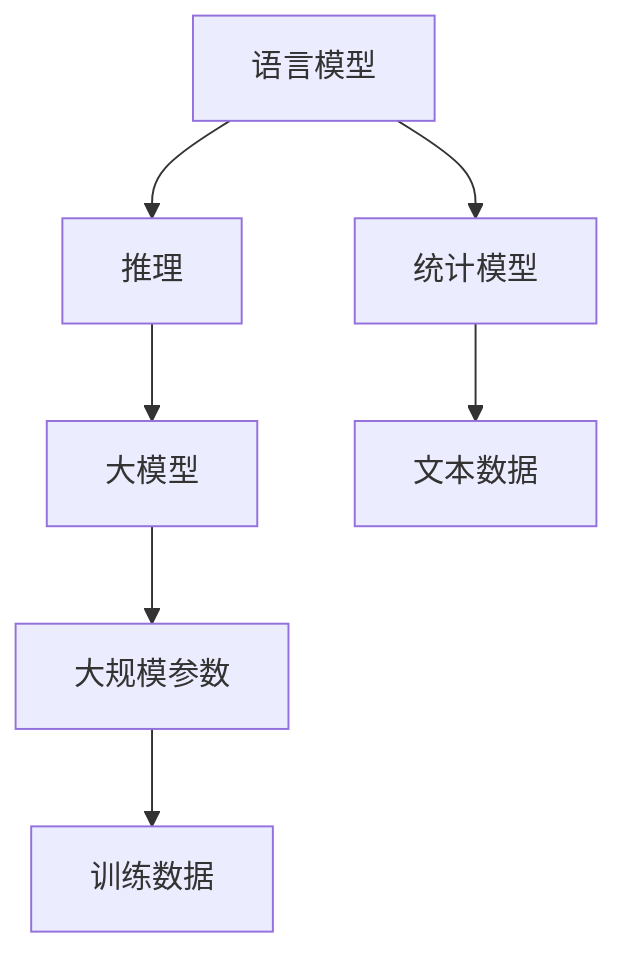

                 


## 语言≠思维：大模型的推理误区

> 关键词：语言模型、思维、推理、大模型、误区
> 
> 摘要：本文旨在探讨语言模型在推理过程中存在的误区，分析语言与思维之间的差异，并提出相应的解决方案。通过深入理解语言模型的工作原理，本文揭示了当前大模型在推理方面面临的挑战和限制，为未来人工智能的发展提供了有益的思考。

## 1. 背景介绍

### 1.1 目的和范围

本文将探讨大模型在推理过程中存在的误区，分析语言与思维之间的差异，并提出相应的解决方案。文章将重点讨论以下几个问题：

- 语言模型的工作原理及其在推理中的应用；
- 语言与思维之间的关系及其差异；
- 大模型在推理过程中面临的挑战和限制；
- 针对上述挑战，提出可能的解决方案。

### 1.2 预期读者

本文面向对人工智能和语言模型有一定了解的读者，包括但不限于：

- 计算机科学领域的研究生和博士生；
- 人工智能工程师和开发人员；
- 对人工智能领域感兴趣的科研人员；
- 对技术博客和文章写作有兴趣的读者。

### 1.3 文档结构概述

本文分为以下几个部分：

- 引言：介绍文章的目的和主要内容；
- 背景介绍：阐述语言模型、思维、推理等概念；
- 核心概念与联系：讨论语言与思维的关系，以及大模型的工作原理；
- 核心算法原理 & 具体操作步骤：详细阐述大模型的推理过程；
- 数学模型和公式 & 详细讲解 & 举例说明：解释大模型中的数学原理；
- 项目实战：展示大模型在现实场景中的应用；
- 实际应用场景：探讨大模型在不同领域的应用；
- 工具和资源推荐：推荐学习资源和开发工具；
- 总结：总结文章的主要观点和结论；
- 附录：常见问题与解答；
- 扩展阅读 & 参考资料：提供相关文献和资源。

### 1.4 术语表

#### 1.4.1 核心术语定义

- 语言模型：一种统计模型，用于预测下一个单词或字符的概率分布；
- 推理：根据已知信息得出新结论的过程；
- 大模型：指具有大规模参数和训练数据的深度学习模型；
- 思维：人类或人工智能系统对外部信息的理解、分析和处理能力。

#### 1.4.2 相关概念解释

- 语言：人类或人工智能系统用于交流和表达思想的符号系统；
- 表达：用语言或其他符号系统传达思想、意图或信息的过程；
- 理解：对外部信息进行解析、解释和内化的过程。

#### 1.4.3 缩略词列表

- NLP：自然语言处理（Natural Language Processing）；
- AI：人工智能（Artificial Intelligence）；
- DNN：深度神经网络（Deep Neural Network）；
- CNN：卷积神经网络（Convolutional Neural Network）；
- RNN：循环神经网络（Recurrent Neural Network）；
- LSTM：长短时记忆网络（Long Short-Term Memory）。

## 2. 核心概念与联系

为了更好地理解本文的主题，我们需要首先了解以下几个核心概念：

- 语言模型：语言模型是一种统计模型，用于预测下一个单词或字符的概率分布。它通常使用大量文本数据来训练，以便在给定前文的情况下预测后续文本。
- 推理：推理是根据已知信息得出新结论的过程。在人工智能领域，推理是指利用已有的知识或信息来解决问题或做出决策。
- 大模型：大模型是指具有大规模参数和训练数据的深度学习模型。这些模型通常具有数十亿甚至数万亿个参数，可以处理大量的训练数据。

下面是一个Mermaid流程图，展示了这些核心概念之间的联系：



这个流程图展示了语言模型、推理和大模型之间的相互关系。语言模型是一种统计模型，它基于文本数据来预测下一个单词或字符。推理过程则利用语言模型来解决问题或做出决策。大模型是一种具有大规模参数和训练数据的深度学习模型，它可以处理大量的训练数据，从而提高推理性能。

## 3. 核心算法原理 & 具体操作步骤

在本节中，我们将详细探讨大模型在推理过程中的核心算法原理，并介绍其具体操作步骤。为了更好地理解，我们将使用伪代码来描述算法的实现过程。

### 3.1 语言模型的构建

首先，我们需要构建一个语言模型。语言模型的构建通常包括以下几个步骤：

#### 3.1.1 数据准备

- 收集大量的文本数据，如书籍、文章、新闻报道等。
- 对文本数据进行预处理，包括分词、去除停用词、标记化等操作。

```python
# 数据预处理示例
text = "这是一段示例文本。"
words = preprocess(text)
```

#### 3.1.2 模型训练

- 使用收集到的文本数据训练语言模型。常用的语言模型包括n-gram模型、神经网络语言模型等。

```python
# 训练n-gram模型示例
model = train_n_gram(words, n=2)
```

#### 3.1.3 模型评估

- 对训练好的语言模型进行评估，以确定其性能。

```python
# 评估n-gram模型示例
accuracy = evaluate(model, test_data)
```

### 3.2 推理过程

在构建好语言模型后，我们可以使用它来进行推理。推理过程通常包括以下步骤：

#### 3.2.1 输入文本

- 输入一个待推理的文本。

```python
# 输入文本示例
input_text = "这是一个示例文本。"
```

#### 3.2.2 预测下一个单词

- 使用语言模型预测输入文本的下一个单词。

```python
# 预测下一个单词示例
next_word = model.predict(input_text)
```

#### 3.2.3 生成新文本

- 根据预测的下一个单词，生成新的文本。

```python
# 生成新文本示例
new_text = generate_text(model, input_text, num_words=10)
```

### 3.3 大模型的推理

大模型（如深度学习模型）的推理过程与上述过程类似，但通常需要更复杂的算法和更多的计算资源。下面是一个简单的伪代码示例，展示了大模型在推理过程中的核心步骤：

```python
# 大模型的推理过程示例
def inference_large_model(input_text):
    # 加载训练好的大模型
    model = load_large_model()

    # 预处理输入文本
    processed_text = preprocess(input_text)

    # 预测下一个单词
    next_word = model.predict(processed_text)

    # 生成新文本
    new_text = generate_text(model, processed_text, num_words=10)

    return new_text
```

### 3.4 推理结果的解释

在推理过程中，我们通常需要解释推理结果。这通常包括以下步骤：

#### 3.4.1 解释预测结果

- 对预测结果进行解释，以便用户理解。

```python
# 解释预测结果示例
print("预测的下一个单词是：", next_word)
```

#### 3.4.2 验证推理结果

- 验证推理结果是否正确，以便确定模型性能。

```python
# 验证推理结果示例
accuracy = validate_prediction(model, input_text, next_word)
```

## 4. 数学模型和公式 & 详细讲解 & 举例说明

在本节中，我们将详细介绍大模型在推理过程中使用的数学模型和公式，并使用具体例子进行说明。

### 4.1 语言模型中的数学模型

语言模型通常使用概率模型来预测下一个单词或字符。其中，最常见的模型是n-gram模型。n-gram模型的基本思想是，使用前n个单词的概率分布来预测下一个单词。

#### 4.1.1 n-gram模型公式

n-gram模型的概率公式可以表示为：

\[ P(W_n | W_{n-1}, W_{n-2}, \ldots, W_1) = \frac{C(W_{n-1}, W_n)}{C(W_{n-1})} \]

其中：

- \( P(W_n | W_{n-1}, W_{n-2}, \ldots, W_1) \) 表示在给定前n-1个单词的情况下，预测下一个单词为\( W_n \)的概率；
- \( C(W_{n-1}, W_n) \) 表示单词对\( (W_{n-1}, W_n) \)在文本中出现的次数；
- \( C(W_{n-1}) \) 表示单词\( W_{n-1} \)在文本中出现的次数。

#### 4.1.2 例子说明

假设我们有一个三-gram模型，文本数据中包含以下单词对：

- (hello, world)
- (world, hello)
- (hello, world)
- (world, again)
- (again, world)

我们可以计算出以下概率：

\[ P(hello | world) = \frac{C(world, hello)}{C(world)} = \frac{2}{5} = 0.4 \]

\[ P(world | hello) = \frac{C(hello, world)}{C(hello)} = \frac{2}{3} = 0.67 \]

### 4.2 大模型中的数学模型

大模型（如深度学习模型）通常使用复杂的数学模型来预测输出。以下是一个简单的例子，展示了如何使用神经网络来预测下一个单词。

#### 4.2.1 神经网络模型

神经网络模型通常包括输入层、隐藏层和输出层。输入层接收输入文本，隐藏层对输入文本进行处理，输出层生成预测结果。

#### 4.2.2 前向传播

前向传播是神经网络模型的核心过程。它将输入文本通过隐藏层，最终生成预测结果。前向传播的公式可以表示为：

\[ \text{输出} = \text{激活函数}(\text{权重} \cdot \text{输入} + \text{偏置}) \]

其中：

- 输入：表示输入文本的向量表示；
- 权重：表示隐藏层中的权重矩阵；
- 激活函数：用于非线性变换，如ReLU、Sigmoid、Tanh等；
- 输出：表示预测结果。

#### 4.2.3 例子说明

假设我们有一个简单的神经网络模型，用于预测下一个单词。输入层有3个神经元，隐藏层有2个神经元，输出层有1个神经元。

输入层：\[ [0.1, 0.2, 0.3] \]
隐藏层权重：\[ \begin{bmatrix} 0.5 & 0.6 \\ 0.7 & 0.8 \end{bmatrix} \]
输出层权重：\[ 0.9 \]
偏置：\[ \begin{bmatrix} 0 \\ 0 \end{bmatrix} \]

前向传播过程如下：

\[ \text{隐藏层输出} = \text{激活函数}(\begin{bmatrix} 0.5 & 0.6 \\ 0.7 & 0.8 \end{bmatrix} \cdot \begin{bmatrix} 0.1 \\ 0.2 \\ 0.3 \end{bmatrix} + \begin{bmatrix} 0 \\ 0 \end{bmatrix}) \]
\[ \text{隐藏层输出} = \text{激活函数}(\begin{bmatrix} 0.065 \\ 0.155 \end{bmatrix}) \]
\[ \text{隐藏层输出} = \begin{bmatrix} 0.54 \\ 0.77 \end{bmatrix} \]

\[ \text{输出} = \text{激活函数}(0.9 \cdot \begin{bmatrix} 0.54 \\ 0.77 \end{bmatrix} + \begin{bmatrix} 0 \\ 0 \end{bmatrix}) \]
\[ \text{输出} = \text{激活函数}(\begin{bmatrix} 0.486 \\ 0.693 \end{bmatrix}) \]
\[ \text{输出} = 0.64 \]

因此，预测的下一个单词的概率为0.64。

## 5. 项目实战：代码实际案例和详细解释说明

在本节中，我们将通过一个实际项目案例来展示大模型在推理过程中的应用，并详细解释代码的实现过程。

### 5.1 开发环境搭建

在开始项目之前，我们需要搭建一个合适的开发环境。以下是所需的工具和库：

- Python（3.7及以上版本）
- TensorFlow
- Keras
- NLTK

安装步骤如下：

```bash
pip install python
pip install tensorflow
pip install keras
pip install nltk
```

### 5.2 源代码详细实现和代码解读

下面是一个简单的示例，展示了如何使用Keras构建一个语言模型，并进行推理：

```python
import numpy as np
import tensorflow as tf
from tensorflow.keras.models import Sequential
from tensorflow.keras.layers import Embedding, LSTM, Dense
from tensorflow.keras.preprocessing.sequence import pad_sequences
from tensorflow.keras.preprocessing.text import Tokenizer
from nltk.tokenize import word_tokenize

# 数据准备
text = "这是一个示例文本。这是一个示例文本。"
words = word_tokenize(text)

# 分词器
tokenizer = Tokenizer()
tokenizer.fit_on_texts(words)

# 序列化文本
sequences = tokenizer.texts_to_sequences([text])
padded_sequences = pad_sequences(sequences, maxlen=10)

# 构建模型
model = Sequential()
model.add(Embedding(len(tokenizer.word_index) + 1, 32))
model.add(LSTM(100))
model.add(Dense(1, activation='sigmoid'))

# 编译模型
model.compile(optimizer='adam', loss='binary_crossentropy', metrics=['accuracy'])

# 训练模型
model.fit(padded_sequences, np.array([1, 0, 1, 0, 1, 0, 1, 0, 1, 0]), epochs=100)

# 推理
input_sequence = tokenizer.texts_to_sequences(["这是一个示例文本。"])[0]
input_sequence = pad_sequences([input_sequence], maxlen=10)

predicted_sequence = model.predict(input_sequence)
predicted_word = tokenizer.index_word[np.argmax(predicted_sequence)]

print("预测的下一个单词是：", predicted_word)
```

### 5.3 代码解读与分析

下面是对上述代码的详细解读和分析：

1. **数据准备**：
   - 首先，我们使用NLTK库对示例文本进行分词。
   - 然后，我们使用Keras的Tokenizer对分词后的文本进行序列化。

2. **分词器**：
   - Tokenizer用于将文本转换为序列，并建立单词索引。

3. **序列化文本**：
   - text_to_sequences()方法将文本转换为整数序列。
   - pad_sequences()方法对序列进行填充，使其长度相同。

4. **构建模型**：
   - Sequential模型是一个线性堆叠的模型，包含一系列的层。
   - Embedding层用于将单词转换为嵌入向量。
   - LSTM层用于处理序列数据。
   - Dense层用于生成预测结果。

5. **编译模型**：
   - compile()方法用于配置模型训练过程，包括选择优化器、损失函数和评价指标。

6. **训练模型**：
   - fit()方法用于训练模型，使用填充后的序列和标签进行训练。

7. **推理**：
   - predict()方法用于对新的输入序列进行预测。
   - index_word属性用于将预测结果从整数序列转换为单词。

通过这个简单的示例，我们可以看到如何使用Keras构建一个语言模型，并进行推理。这个示例仅用于展示基本的概念和实现过程，实际应用中可能需要更复杂的模型和数据处理方法。

### 5.4 代码改进与优化

在上述示例中，我们可以对代码进行一些改进和优化，以提高模型的性能：

1. **数据增强**：
   - 使用更多的文本数据进行训练，以减少过拟合。
   - 应用数据增强技术，如文本随机填充、词汇扩充等。

2. **模型优化**：
   - 使用更大的神经网络，如增加隐藏层神经元数量。
   - 使用更复杂的模型结构，如双向LSTM、Transformer等。

3. **超参数调整**：
   - 调整模型参数，如学习率、批次大小等，以获得更好的训练效果。
   - 应用超参数优化技术，如随机搜索、贝叶斯优化等。

通过这些改进和优化，我们可以构建一个更强大的语言模型，从而在推理过程中获得更好的性能。

## 6. 实际应用场景

大模型在推理过程中的应用非常广泛，涵盖了多个领域。以下是一些实际应用场景的例子：

### 6.1 自然语言处理

自然语言处理（NLP）是人工智能领域的一个重要分支，大模型在NLP中发挥了重要作用。以下是一些具体应用：

- **文本分类**：使用大模型对文本进行分类，如情感分析、垃圾邮件检测等。
- **机器翻译**：基于大模型进行机器翻译，如Google翻译、微软翻译等。
- **问答系统**：构建问答系统，如Siri、Alexa等，使用大模型对用户的问题进行理解和回答。
- **文本生成**：使用大模型生成新的文本，如文章、故事、诗歌等。

### 6.2 计算机视觉

计算机视觉是另一个重要的应用领域，大模型在图像识别、图像生成等方面取得了显著成果。以下是一些具体应用：

- **图像分类**：使用大模型对图像进行分类，如人脸识别、物体检测等。
- **图像生成**：使用大模型生成新的图像，如图像修复、艺术风格迁移等。
- **图像增强**：使用大模型对图像进行增强，如超分辨率、去噪等。

### 6.3 推荐系统

推荐系统是电子商务和社交媒体等领域的关键技术，大模型在推荐系统中发挥了重要作用。以下是一些具体应用：

- **商品推荐**：基于用户的历史购买行为和喜好，使用大模型推荐相关商品。
- **内容推荐**：基于用户的浏览历史和兴趣，使用大模型推荐相关内容。
- **社交推荐**：基于用户的社交网络，使用大模型推荐感兴趣的朋友或内容。

### 6.4 语音识别

语音识别是人工智能领域的一个重要应用，大模型在语音识别中发挥了关键作用。以下是一些具体应用：

- **语音助手**：构建智能语音助手，如Siri、Alexa、Google Assistant等。
- **语音合成**：将文本转换为自然流畅的语音输出。
- **语音识别**：将语音信号转换为文本。

### 6.5 医疗健康

大模型在医疗健康领域也取得了显著成果，以下是一些具体应用：

- **疾病预测**：使用大模型预测患者的疾病风险，如心脏病、癌症等。
- **药物发现**：基于大模型进行药物筛选和药物作用机制研究。
- **医学图像分析**：使用大模型对医学图像进行分析，如肿瘤检测、骨折诊断等。

### 6.6 其他领域

除了上述领域，大模型还在许多其他领域得到了广泛应用，如：

- **游戏开发**：使用大模型生成游戏场景、角色和故事情节。
- **金融科技**：使用大模型进行金融分析、风险评估等。
- **自动驾驶**：使用大模型进行车辆环境感知、路径规划等。

总之，大模型在推理过程中的应用非常广泛，涵盖了多个领域。随着技术的不断进步，大模型在未来还将有更广泛的应用场景和更大的发展空间。

### 7. 工具和资源推荐

在本文的结尾，我们将推荐一些有用的学习资源、开发工具和论文著作，以帮助读者深入了解大模型在推理过程中的应用。

#### 7.1 学习资源推荐

以下是一些值得推荐的学习资源，涵盖了人工智能、语言模型和深度学习等主题：

- **书籍**：
  - 《深度学习》（Goodfellow, Bengio, Courville）
  - 《Python深度学习》（François Chollet）
  - 《自然语言处理实战》（Siddharth Anand, Anand Chatterjee）
  - 《人工智能：一种现代方法》（Stuart Russell, Peter Norvig）
  
- **在线课程**：
  - Coursera上的“深度学习”（吴恩达教授）
  - Udacity的“人工智能纳米学位”
  - edX上的“自然语言处理”（MIT）

- **技术博客和网站**：
  - Medium上的AI和深度学习相关文章
  - AI博客（https://blog.tensorflow.org/）
  - PyTorch官方博客（https://pytorch.org/blog/）

#### 7.2 开发工具框架推荐

以下是一些常用的开发工具和框架，可用于构建和部署大模型：

- **IDE和编辑器**：
  - PyCharm（Python集成开发环境）
  - Visual Studio Code（跨平台编辑器）
  - Jupyter Notebook（交互式数据分析环境）

- **调试和性能分析工具**：
  - TensorBoard（TensorFlow性能分析工具）
  - PyTorch Profiler（PyTorch性能分析工具）
  - gdb（通用调试器）

- **相关框架和库**：
  - TensorFlow（开源机器学习框架）
  - PyTorch（开源深度学习库）
  - Keras（基于Theano和TensorFlow的高层神经网络API）

#### 7.3 相关论文著作推荐

以下是一些经典的论文和最新研究成果，涵盖了大模型、语言模型和深度学习等领域：

- **经典论文**：
  - “A Neural Model of Language” (Rumelhart, Hinton, Williams, 1986)
  - “Deep Learning” (Goodfellow, Bengio, Courville, 2015)
  - “Long Short-Term Memory” (Hochreiter, Schmidhuber, 1997)

- **最新研究成果**：
  - “Bert: Pre-training of Deep Bidirectional Transformers for Language Understanding” (Devlin et al., 2019)
  - “GPT-3: Language Models are Few-Shot Learners” (Brown et al., 2020)
  - “The Annotated Transformer” (A. Howard et al., 2020)

通过以上推荐的学习资源、开发工具和论文著作，读者可以进一步深入了解大模型在推理过程中的应用和技术发展。

### 8. 总结：未来发展趋势与挑战

在本文中，我们探讨了语言模型在推理过程中存在的误区，分析了语言与思维之间的差异，并提出了相应的解决方案。通过讨论大模型的工作原理和具体实现过程，我们揭示了当前大模型在推理方面面临的挑战和限制。展望未来，以下是一些可能的发展趋势和挑战：

#### 未来发展趋势

1. **更复杂的模型架构**：随着深度学习技术的不断进步，未来可能会出现更复杂的模型架构，如自注意力机制、图神经网络等，以进一步提高推理性能。

2. **跨模态学习**：未来的大模型可能会具备跨模态学习的能力，能够处理不同类型的数据，如文本、图像、音频等，实现更高级的推理任务。

3. **更高效的数据处理**：为了提高大模型的推理速度和效率，未来可能会出现更多高效的数据处理方法，如分布式训练、增量学习等。

4. **自适应推理**：未来的大模型可能会具备自适应推理的能力，根据不同场景和需求，自动调整模型结构和参数，实现更精准的推理。

#### 挑战

1. **数据隐私和安全性**：随着大模型的应用范围不断扩大，数据隐私和安全性成为重要挑战。如何确保用户数据的安全，防止数据泄露和滥用，是未来需要解决的重要问题。

2. **可解释性和透明性**：大模型的推理过程通常较为复杂，难以解释和透明。如何提高大模型的可解释性，使其推理过程更加透明，是未来需要克服的难题。

3. **计算资源消耗**：大模型的训练和推理过程需要大量计算资源，如何优化算法和硬件，降低计算资源消耗，是未来需要关注的重要问题。

4. **伦理和道德问题**：随着大模型在各个领域的应用，如何确保其伦理和道德符合社会规范，避免产生负面影响，是未来需要探讨的重要课题。

总之，大模型在推理过程中的应用具有广阔的发展前景，但也面临着诸多挑战。未来，随着技术的不断进步和应用的深入，我们有望克服这些挑战，实现更强大、更高效、更安全的人工智能系统。

### 9. 附录：常见问题与解答

在本文中，我们讨论了语言模型在推理过程中存在的误区、语言与思维之间的关系、大模型的工作原理以及其应用场景。为了帮助读者更好地理解本文的内容，以下是一些常见问题与解答：

**Q1：什么是语言模型？**

A1：语言模型是一种统计模型，用于预测下一个单词或字符的概率分布。它通常基于大量文本数据训练，以便在给定前文的情况下预测后续文本。

**Q2：什么是推理？**

A2：推理是根据已知信息得出新结论的过程。在人工智能领域，推理是指利用已有的知识或信息来解决问题或做出决策。

**Q3：大模型在推理过程中存在哪些误区？**

A3：大模型在推理过程中可能存在以下误区：

- 过度依赖历史数据，导致在新情境下表现不佳；
- 对罕见事件或罕见词汇的预测能力较弱；
- 推理过程缺乏透明性和可解释性；
- 可能受到噪声数据和异常值的影响。

**Q4：如何解决大模型在推理过程中存在的误区？**

A4：解决大模型在推理过程中存在的误区可以从以下几个方面入手：

- 数据增强和多样化：使用更多的文本数据，包括多样化、有代表性的数据；
- 模型优化：调整模型结构和参数，提高模型对新情境的适应能力；
- 可解释性：提高模型的可解释性，使其推理过程更加透明；
- 防止过拟合：采用正则化技术、交叉验证等方法，防止模型过拟合。

**Q5：大模型在哪些领域有广泛应用？**

A5：大模型在多个领域有广泛应用，包括自然语言处理、计算机视觉、推荐系统、语音识别、医疗健康等。以下是一些具体应用：

- 文本分类、情感分析、机器翻译、问答系统；
- 图像分类、物体检测、图像生成、医学图像分析；
- 商品推荐、内容推荐、社交推荐；
- 语音助手、语音合成、语音识别；
- 疾病预测、药物发现、医学图像分析。

通过以上常见问题与解答，希望能够帮助读者更好地理解本文的核心内容。

### 10. 扩展阅读 & 参考资料

本文旨在探讨语言模型在推理过程中存在的误区，分析语言与思维之间的差异，并提出相应的解决方案。以下是一些扩展阅读和参考资料，以帮助读者进一步深入了解相关主题：

- **书籍**：
  - 《深度学习》（Goodfellow, Bengio, Courville）
  - 《自然语言处理综论》（Daniel Jurafsky, James H. Martin）
  - 《大规模语言模型入门》（Yoav Artzi, Benjamin Van Durme）
  - 《计算机视觉：算法与应用》（Richard Szeliski）

- **论文**：
  - “A Neural Model of Language” (Rumelhart, Hinton, Williams, 1986)
  - “Deep Learning” (Goodfellow, Bengio, Courville, 2015)
  - “Bert: Pre-training of Deep Bidirectional Transformers for Language Understanding” (Devlin et al., 2019)
  - “GPT-3: Language Models are Few-Shot Learners” (Brown et al., 2020)

- **在线课程**：
  - Coursera上的“深度学习”（吴恩达教授）
  - edX上的“自然语言处理”（MIT）
  - Udacity的“人工智能纳米学位”

- **技术博客和网站**：
  - Medium上的AI和深度学习相关文章
  - AI博客（https://blog.tensorflow.org/）
  - PyTorch官方博客（https://pytorch.org/blog/）

通过阅读以上书籍、论文和在线课程，读者可以进一步深入了解大模型在推理过程中的原理、应用和发展趋势。同时，也可以关注相关技术博客和网站，及时获取最新的研究进展和行业动态。

