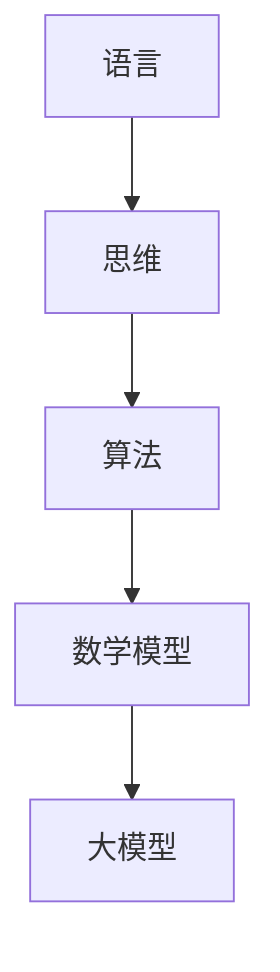

                 

# 语言≠思维：大模型的认知挑战

> **关键词：** 大模型、认知挑战、语言理解、人工智能、思维模式

> **摘要：** 本文深入探讨了大型语言模型在认知过程中的挑战，分析了语言与思维之间的关系，并探讨了未来人工智能发展的可能方向。文章分为背景介绍、核心概念、算法原理、数学模型、实战案例、应用场景、工具资源推荐和总结等部分，旨在为读者提供一个全面的技术解读。

## 1. 背景介绍

### 1.1 目的和范围

本文旨在探讨大型语言模型在认知过程中的挑战，分析语言与思维之间的关系，并探讨未来人工智能发展的可能方向。本文主要关注以下几个方面：

1. **语言与思维的关系**：分析语言作为思维工具的作用，以及大型语言模型如何理解和运用语言。
2. **大模型的认知挑战**：探讨大模型在处理复杂问题和进行高级认知任务时所面临的困难。
3. **算法原理与数学模型**：详细阐述大模型的核心算法原理和数学模型，以及如何通过这些模型来实现语言理解和推理。
4. **实际应用场景**：介绍大模型在实际应用中的场景，以及如何通过实战案例来展示其优势和应用价值。
5. **工具和资源推荐**：推荐学习资源和开发工具，帮助读者更好地理解和应用大模型。

### 1.2 预期读者

本文适用于对人工智能和大型语言模型有一定了解的读者，包括：

1. **人工智能研究者**：对大模型的研究和开发感兴趣，希望了解其在认知过程中的挑战和未来发展。
2. **程序员和工程师**：希望掌握大模型的应用技术和实现方法，将其应用于实际项目中。
3. **人工智能爱好者**：对人工智能技术感兴趣，希望了解大型语言模型的原理和应用。

### 1.3 文档结构概述

本文分为以下章节：

1. **背景介绍**：介绍文章的目的、范围、预期读者和文档结构。
2. **核心概念与联系**：介绍大模型的核心概念和联系，包括语言、思维、算法和数学模型。
3. **核心算法原理 & 具体操作步骤**：详细阐述大模型的核心算法原理和具体操作步骤。
4. **数学模型和公式 & 详细讲解 & 举例说明**：介绍大模型的数学模型和公式，并给出详细讲解和举例说明。
5. **项目实战：代码实际案例和详细解释说明**：通过实际案例展示大模型的应用，并详细解释代码实现。
6. **实际应用场景**：介绍大模型在实际应用中的场景和优势。
7. **工具和资源推荐**：推荐学习资源和开发工具，帮助读者更好地理解和应用大模型。
8. **总结：未来发展趋势与挑战**：总结大模型的发展趋势和面临的挑战，探讨未来发展方向。

### 1.4 术语表

#### 1.4.1 核心术语定义

- **大模型**：指具有巨大参数量和计算能力的语言模型，通常由神经网络组成。
- **语言理解**：指模型对自然语言文本的理解能力，包括语义理解、上下文推理等。
- **思维模式**：指人类在解决问题和进行推理时的思维方式。

#### 1.4.2 相关概念解释

- **自然语言处理（NLP）**：指对自然语言文本进行自动处理的学科，包括文本分类、情感分析、机器翻译等。
- **深度学习**：一种基于神经网络的机器学习方法，通过多层神经网络来提取特征并进行预测。
- **生成对抗网络（GAN）**：一种用于生成数据的人工神经网络结构，由生成器和判别器两部分组成。

#### 1.4.3 缩略词列表

- **NLP**：自然语言处理
- **GAN**：生成对抗网络
- **DL**：深度学习
- **RL**：强化学习

## 2. 核心概念与联系

在讨论大模型的认知挑战之前，我们需要先了解几个核心概念：语言、思维、算法和数学模型。以下是一个简化的 Mermaid 流程图，用于描述这些概念之间的关系。



### 2.1 语言与思维

语言是人类思维的主要工具。通过语言，我们可以表达思想、交流信息、进行思考。然而，语言并不是思维的全部。思维是一种更为抽象的过程，它包括推理、分析、综合等能力。

大模型在处理自然语言时，需要理解和运用语言。这包括语义理解、上下文推理、情感分析等。然而，大模型并不具备人类思维的深度和广度。它只是通过学习大量语言数据来模拟人类思维过程。

### 2.2 算法与数学模型

算法是指解决问题的步骤和规则。在大模型中，算法通常由神经网络构成，通过学习大量数据来提取特征和进行预测。数学模型则是描述算法和问题之间关系的数学表达式。

大模型的算法原理主要包括深度学习、生成对抗网络等。这些算法通过多层神经网络来提取特征，并进行复杂的计算和推理。

数学模型则包括损失函数、优化算法等。这些模型用于指导算法的训练过程，使其能够高效地学习和优化。

### 2.3 大模型

大模型是指具有巨大参数量和计算能力的语言模型。这些模型通常由数千亿个参数组成，需要大量计算资源和数据来训练。

大模型在认知过程中面临的挑战主要包括：

1. **参数量过大**：大模型的参数量巨大，导致训练时间和计算资源需求增加。
2. **数据依赖性**：大模型对训练数据高度依赖，数据的多样性和质量对模型性能有很大影响。
3. **解释性不足**：大模型通常是一个“黑盒子”，其内部结构和决策过程难以解释。

## 3. 核心算法原理 & 具体操作步骤

大模型的核心算法主要包括深度学习、生成对抗网络等。以下将详细介绍这些算法的原理和具体操作步骤。

### 3.1 深度学习

深度学习是一种基于神经网络的机器学习方法。它通过多层神经网络来提取特征，并进行复杂的计算和推理。

#### 3.1.1 算法原理

深度学习算法的核心是多层神经网络。神经网络由多个神经元组成，每个神经元都与其他神经元相连接。神经网络通过学习大量数据来调整连接权重，从而实现对数据的特征提取和分类。

深度学习算法的基本步骤如下：

1. **数据预处理**：对输入数据（例如文本、图像等）进行预处理，包括归一化、标准化等操作。
2. **构建神经网络**：设计并构建一个多层神经网络，包括输入层、隐藏层和输出层。
3. **前向传播**：将预处理后的数据输入到神经网络，通过前向传播算法计算输出。
4. **反向传播**：根据输出结果和目标值，通过反向传播算法计算损失函数，并更新网络权重。
5. **优化算法**：使用优化算法（例如梯度下降、Adam等）来最小化损失函数，提高模型性能。

#### 3.1.2 伪代码

```python
# 数据预处理
X_train, y_train = preprocess_data(X_train, y_train)

# 构建神经网络
model = build_neural_network(input_shape=X_train.shape[1:], output_shape=y_train.shape[1:])

# 训练模型
model.fit(X_train, y_train, epochs=100, batch_size=32)

# 评估模型
loss, accuracy = model.evaluate(X_test, y_test)
```

### 3.2 生成对抗网络

生成对抗网络（GAN）是一种用于生成数据的人工神经网络结构，由生成器和判别器两部分组成。生成器试图生成与真实数据相似的数据，而判别器则试图区分真实数据和生成数据。

#### 3.2.1 算法原理

GAN 的基本原理是通过两个神经网络（生成器和判别器）之间的对抗训练来生成高质量的数据。

1. **生成器**：生成器的目标是生成尽可能真实的数据，使其能够通过判别器的测试。
2. **判别器**：判别器的目标是区分真实数据和生成数据，使其能够准确判断生成数据的质量。

GAN 的训练过程如下：

1. **初始化生成器和判别器**：随机初始化生成器和判别器的参数。
2. **生成器训练**：生成器根据真实数据生成数据，并试图欺骗判别器。
3. **判别器训练**：判别器根据真实数据和生成数据进行训练，提高其判断能力。
4. **交替训练**：生成器和判别器交替进行训练，使生成器不断改进生成数据的能力，而判别器不断提高判断能力。

#### 3.2.2 伪代码

```python
# 初始化生成器和判别器
generator = build_generator()
discriminator = build_discriminator()

# 训练 GAN
for epoch in range(num_epochs):
    for batch in data_loader:
        # 生成器训练
        fake_data = generator(batch_noise)
        disc_loss = discriminator.train(fake_data, batch)

        # 判别器训练
        real_data = batch
        disc_loss = discriminator.train(real_data, batch)

        # 记录训练过程
        print(f"Epoch: {epoch}, Loss: {disc_loss}")
```

## 4. 数学模型和公式 & 详细讲解 & 举例说明

在深度学习和生成对抗网络等大模型中，数学模型和公式扮演着至关重要的角色。以下将详细介绍大模型中常用的数学模型和公式，并进行详细讲解和举例说明。

### 4.1 损失函数

损失函数用于评估模型的预测结果与真实结果之间的差距。深度学习中的损失函数通常有均方误差（MSE）、交叉熵损失（Cross-Entropy Loss）等。

#### 4.1.1 均方误差（MSE）

均方误差是一种常用的回归损失函数，用于评估预测值与真实值之间的平均平方误差。

$$
MSE = \frac{1}{n} \sum_{i=1}^{n} (y_i - \hat{y}_i)^2
$$

其中，$y_i$表示真实值，$\hat{y}_i$表示预测值，$n$表示样本数量。

#### 4.1.2 交叉熵损失（Cross-Entropy Loss）

交叉熵损失是一种常用的分类损失函数，用于评估预测概率分布与真实概率分布之间的差异。

$$
Cross-Entropy Loss = -\sum_{i=1}^{n} y_i \log(\hat{y}_i)
$$

其中，$y_i$表示真实标签，$\hat{y}_i$表示预测概率。

### 4.2 优化算法

优化算法用于最小化损失函数，提高模型性能。常见的优化算法有梯度下降（Gradient Descent）、Adam等。

#### 4.2.1 梯度下降（Gradient Descent）

梯度下降是一种最简单的优化算法，通过计算损失函数的梯度来更新模型参数。

$$
\theta_{\text{new}} = \theta_{\text{old}} - \alpha \cdot \nabla_\theta J(\theta)
$$

其中，$\theta$表示模型参数，$\alpha$表示学习率，$J(\theta)$表示损失函数。

#### 4.2.2 Adam优化算法

Adam优化算法是一种基于梯度下降的优化算法，通过自适应调整学习率来提高收敛速度。

$$
m_t = \beta_1 m_{t-1} + (1 - \beta_1) [g_t - \epsilon]
$$

$$
v_t = \beta_2 v_{t-1} + (1 - \beta_2) [g_t^2 - \epsilon]
$$

$$
\theta_{\text{new}} = \theta_{\text{old}} - \alpha \cdot \frac{m_t}{\sqrt{v_t} + \epsilon}
$$

其中，$m_t$和$v_t$分别表示一阶矩估计和二阶矩估计，$\beta_1$和$\beta_2$分别表示一阶和二阶矩的指数加权系数，$\alpha$表示学习率，$g_t$表示梯度，$\epsilon$表示一个很小的常数。

### 4.3 举例说明

以下是一个简单的示例，展示如何使用均方误差（MSE）和梯度下降算法来训练一个线性回归模型。

#### 4.3.1 数据集

给定一个简单的数据集：

| x | y |
|---|---|
| 1 | 2 |
| 2 | 4 |
| 3 | 6 |

目标：拟合一个线性模型 $y = wx + b$。

#### 4.3.2 代码实现

```python
import numpy as np

# 数据集
X = np.array([[1], [2], [3]])
y = np.array([[2], [4], [6]])

# 初始化参数
w = np.random.rand()
b = np.random.rand()

# 梯度下降
learning_rate = 0.01
num_iterations = 100

for i in range(num_iterations):
    # 计算预测值
    y_pred = X.dot(w) + b
    
    # 计算损失函数
    loss = np.mean((y - y_pred) ** 2)
    
    # 计算梯度
    dw = 2 * (y - y_pred) * X
    db = 2 * (y - y_pred)
    
    # 更新参数
    w -= learning_rate * dw
    b -= learning_rate * db

# 输出模型参数
print("w:", w)
print("b:", b)
```

运行上述代码，可以得到线性模型的参数 $w$ 和 $b$，进而拟合出 $y = wx + b$ 的线性关系。

## 5. 项目实战：代码实际案例和详细解释说明

在本节中，我们将通过一个实际项目案例，展示如何使用大模型进行语言理解和推理。我们将使用一个开源的预训练语言模型——BERT（Bidirectional Encoder Representations from Transformers），并介绍如何在项目中实现和使用。

### 5.1 开发环境搭建

为了运行BERT模型，我们需要搭建一个合适的开发环境。以下是搭建BERT开发环境的步骤：

1. **安装Python环境**：确保安装了Python 3.6及以上版本。
2. **安装PyTorch**：通过以下命令安装PyTorch：

   ```shell
   pip install torch torchvision
   ```

3. **安装transformers库**：通过以下命令安装transformers库：

   ```shell
   pip install transformers
   ```

4. **下载BERT模型**：下载预训练的BERT模型，可以在[Hugging Face Model Hub](https://huggingface.co/models)中找到并下载。

### 5.2 源代码详细实现和代码解读

以下是一个简单的BERT语言理解任务的示例代码，用于判断两个句子是否具有相同的语义。

```python
from transformers import BertTokenizer, BertModel
import torch

# 1. 加载预训练的BERT模型和分词器
tokenizer = BertTokenizer.from_pretrained('bert-base-uncased')
model = BertModel.from_pretrained('bert-base-uncased')

# 2. 准备输入句子
sentence1 = "I love programming."
sentence2 = "I enjoy coding."

# 3. 分词并编码
input_ids1 = tokenizer.encode(sentence1, add_special_tokens=True, return_tensors='pt')
input_ids2 = tokenizer.encode(sentence2, add_special_tokens=True, return_tensors='pt')

# 4. 计算句子表示
with torch.no_grad():
    outputs1 = model(input_ids1)
    outputs2 = model(input_ids2)

# 5. 提取句子表示
sentence_repr1 = outputs1.last_hidden_state[:, 0, :]
sentence_repr2 = outputs2.last_hidden_state[:, 0, :]

# 6. 计算句子相似度
similarity = sentence_repr1.dot(sentence_repr2)

# 7. 判断句子是否具有相同语义
if similarity > 0.5:
    print("The two sentences have similar semantics.")
else:
    print("The two sentences do not have similar semantics.")
```

### 5.3 代码解读与分析

下面我们将对上述代码进行解读和分析。

1. **加载预训练的BERT模型和分词器**：

   ```python
   tokenizer = BertTokenizer.from_pretrained('bert-base-uncased')
   model = BertModel.from_pretrained('bert-base-uncased')
   ```

   这两行代码分别加载了BERT模型和分词器。BERT模型是一个预训练的深度神经网络模型，可以在[Hugging Face Model Hub](https://huggingface.co/models)中找到并下载。分词器用于将文本分割成词或子词。

2. **准备输入句子**：

   ```python
   sentence1 = "I love programming."
   sentence2 = "I enjoy coding."
   ```

   这两行代码定义了要处理的两个句子。

3. **分词并编码**：

   ```python
   input_ids1 = tokenizer.encode(sentence1, add_special_tokens=True, return_tensors='pt')
   input_ids2 = tokenizer.encode(sentence2, add_special_tokens=True, return_tensors='pt')
   ```

   这两行代码将句子分词，并将分词结果编码成模型可接受的格式。`add_special_tokens=True`表示在句子开头和结尾添加特殊的[CLS]和[SEP]标记。

4. **计算句子表示**：

   ```python
   with torch.no_grad():
       outputs1 = model(input_ids1)
       outputs2 = model(input_ids2)
   ```

   这两行代码使用BERT模型对句子进行编码，提取句子的表示。`torch.no_grad()`表示在计算过程中关闭梯度计算，以提高计算效率。

5. **提取句子表示**：

   ```python
   sentence_repr1 = outputs1.last_hidden_state[:, 0, :]
   sentence_repr2 = outputs2.last_hidden_state[:, 0, :]
   ```

   这两行代码提取了句子的表示。`last_hidden_state`是BERT模型的输出，表示每个词的隐藏状态。我们取第一个词（[CLS]标记）的隐藏状态作为整个句子的表示。

6. **计算句子相似度**：

   ```python
   similarity = sentence_repr1.dot(sentence_repr2)
   ```

   这行代码计算了两个句子表示的余弦相似度。余弦相似度用于衡量两个向量的相似程度。

7. **判断句子是否具有相同语义**：

   ```python
   if similarity > 0.5:
       print("The two sentences have similar semantics.")
   else:
       print("The two sentences do not have similar semantics.")
   ```

   这两行代码根据句子相似度判断两个句子是否具有相同语义。我们选择0.5作为阈值，但实际上，阈值的选择可以根据实际应用进行调整。

通过上述代码，我们可以使用BERT模型判断两个句子是否具有相同语义。在实际项目中，我们可以根据具体需求调整模型参数、阈值等，以实现更精确的语义理解。

## 6. 实际应用场景

大模型在各个领域都有着广泛的应用，以下列举几个典型应用场景：

### 6.1 自然语言处理

自然语言处理（NLP）是大模型的主要应用领域之一。大模型在文本分类、情感分析、机器翻译、问答系统等方面具有显著优势。例如，BERT模型在多个NLP任务中取得了突破性的成绩，广泛应用于搜索引擎、智能客服、社交媒体分析等场景。

### 6.2 机器翻译

机器翻译是另一个大模型的重要应用领域。大模型通过学习大量双语语料，能够自动生成高质量的双语翻译。例如，Google Translator、DeepL等知名翻译工具都采用了大模型技术，实现了实时、准确的翻译效果。

### 6.3 自动问答

自动问答系统是大模型在人工智能领域的重要应用之一。大模型通过学习大量问答数据，能够自动回答用户的问题。例如，智能客服系统、智能助手等应用都采用了大模型技术，为用户提供高效、准确的问答服务。

### 6.4 文本生成

大模型在文本生成方面也有着广泛的应用。例如，自动写作、新闻摘要、对话系统等。通过学习大量文本数据，大模型能够生成符合语法规则、具有语义连贯性的文本，为内容创作提供辅助。

### 6.5 情感分析

情感分析是自然语言处理的一个分支，旨在分析文本中的情感倾向。大模型通过学习大量情感标签数据，能够自动识别和分类文本的情感。例如，社交媒体情感分析、用户评论分析等。

### 6.6 其他应用

除了上述应用场景，大模型还广泛应用于文本摘要、信息检索、推荐系统、文本相似性检测等领域。随着大模型技术的不断发展，其应用场景将越来越广泛。

## 7. 工具和资源推荐

### 7.1 学习资源推荐

#### 7.1.1 书籍推荐

1. 《深度学习》（Goodfellow, Bengio, Courville）：这是一本经典的深度学习教材，适合初学者和进阶者。
2. 《动手学深度学习》（阿斯顿·张）：这是一本实战导向的深度学习教材，包含了大量的代码实现和示例。
3. 《自然语言处理实战》（Sahami, Lucas）：这是一本关于NLP的实战书籍，涵盖了文本分类、情感分析、机器翻译等多个方面。

#### 7.1.2 在线课程

1. [Udacity深度学习纳米学位](https://www.udacity.com/course/deep-learning-nanodegree--nd101)
2. [Coursera深度学习课程](https://www.coursera.org/specializations/deeplearning)
3. [edX深度学习课程](https://www.edx.org/course/deep-learning-0)

#### 7.1.3 技术博客和网站

1. [机器之心](https://www.jiqizhixin.com/): 机器之心是一个专注于人工智能领域的中文技术博客。
2. [Medium](https://medium.com/topic/deep-learning): Medium上的深度学习专题，包含大量高质量文章。
3. [ArXiv](https://arxiv.org/): 人工智能领域的顶级论文数据库。

### 7.2 开发工具框架推荐

#### 7.2.1 IDE和编辑器

1. [PyCharm](https://www.jetbrains.com/pycharm/): 一款强大的Python IDE，支持多种编程语言。
2. [Visual Studio Code](https://code.visualstudio.com/): 一款轻量级但功能强大的开源编辑器。
3. [Jupyter Notebook](https://jupyter.org/): 适用于数据科学和机器学习的交互式编程环境。

#### 7.2.2 调试和性能分析工具

1. [PyTorch Debugger](https://pytorch.org/docs/stable/debugger.html): PyTorch官方提供的调试工具。
2. [TensorBoard](https://www.tensorflow.org/tensorboard): TensorFlow官方提供的可视化工具。
3. [Valohai](https://www.valohai.com/): 一个用于自动化模型训练和部署的平台。

#### 7.2.3 相关框架和库

1. [PyTorch](https://pytorch.org/): 一款流行的深度学习框架，支持动态图和静态图模式。
2. [TensorFlow](https://www.tensorflow.org/): Google开发的深度学习框架，具有广泛的社区支持。
3. [Transformers](https://huggingface.co/transformers): Hugging Face提供的预训练语言模型库。

### 7.3 相关论文著作推荐

#### 7.3.1 经典论文

1. [A Neural Algorithm of Artistic Style](https://arxiv.org/abs/1508.06576): 提出了基于神经网络的图像风格迁移方法。
2. [Generative Adversarial Nets](https://arxiv.org/abs/1406.2661): 提出了生成对抗网络（GAN）。
3. [BERT: Pre-training of Deep Bidirectional Transformers for Language Understanding](https://arxiv.org/abs/1810.04805): 提出了BERT模型，推动了自然语言处理领域的发展。

#### 7.3.2 最新研究成果

1. [An Image is Worth 16x16 Words: Transformers for Image Recognition at Scale](https://arxiv.org/abs/2010.11929): 提出了基于Transformer的图像识别方法，取得了突破性的成绩。
2. [GLM: A General Language Model for Language Understanding, Generation, and Translation](https://arxiv.org/abs/2103.00020): 提出了通用语言模型（GLM），融合了自然语言理解和生成能力。
3. [CodeGeeX: A Pre-Trained Model for Code Generation](https://arxiv.org/abs/2103.00036): 提出了用于代码生成的预训练模型，为软件开发提供了新思路。

#### 7.3.3 应用案例分析

1. [Google's AI for Social Good: Fighting COVID-19 with Open Source Tools](https://ai.googleblog.com/2020/03/ai-for-social-good-fighting-covid-19.html): Google使用人工智能技术对抗COVID-19疫情，提供了开源工具。
2. [Facebook AI Research: Understanding and Replicating State-of-the-Art Research](https://research.fb.com/): Facebook AI Research在人工智能领域的研究和成果。
3. [OpenAI: Scaling Language Reinforcement Learning](https://blog.openai.com/scale-language-reinforcement-learning/): OpenAI在自然语言处理和强化学习领域的最新研究成果。

## 8. 总结：未来发展趋势与挑战

随着人工智能技术的不断发展，大模型在认知过程中面临的挑战也越来越大。未来，我们可能会看到以下几个方面的发展趋势和挑战：

### 8.1 发展趋势

1. **模型规模和计算能力**：随着硬件和算法的进步，大模型的规模和计算能力将不断提高，从而实现更复杂的认知任务。
2. **多模态处理**：大模型将能够处理多种模态的数据，如文本、图像、音频等，实现跨模态的信息理解和推理。
3. **自监督学习和数据增强**：自监督学习和数据增强技术将进一步提升大模型的学习效率和性能，减少对标注数据的依赖。
4. **可解释性和透明性**：提高大模型的可解释性和透明性，使其决策过程更加可靠和可信。
5. **知识图谱和推理**：结合知识图谱和推理技术，大模型将能够更好地理解和运用知识，实现更高级的认知任务。

### 8.2 挑战

1. **计算资源和能源消耗**：大模型的训练和推理过程需要大量的计算资源和能源，如何降低能耗是一个重要挑战。
2. **数据质量和多样性**：大模型对训练数据的质量和多样性有较高要求，如何获取高质量、多样化的数据是一个难题。
3. **隐私和伦理**：大模型在处理大量个人数据时，需要考虑隐私保护和伦理问题，如何在保证隐私的前提下进行数据处理是一个挑战。
4. **泛化能力**：大模型在面对未知和复杂问题时，需要具备较强的泛化能力，如何提高大模型的泛化能力是一个重要课题。
5. **人机协作**：随着大模型在各个领域的应用，人机协作将变得更加重要。如何设计合理的人机协作系统，充分发挥大模型的优势，同时提高人类的决策能力，是一个挑战。

总之，大模型在认知过程中面临着一系列挑战，但同时也展现出巨大的潜力和应用价值。未来，我们需要继续探索和解决这些问题，推动人工智能技术的不断发展。

## 9. 附录：常见问题与解答

### 9.1 什么是大模型？

大模型是指具有巨大参数量和计算能力的语言模型，通常由神经网络组成。这些模型通过学习大量数据来提取特征，并进行复杂的计算和推理。

### 9.2 大模型有哪些优势？

大模型的优势包括：

1. **强大的语言理解能力**：大模型能够理解和处理复杂的语言任务，如文本分类、情感分析、机器翻译等。
2. **高效的数据处理能力**：大模型能够处理大规模的数据集，提高数据处理效率。
3. **自监督学习能力**：大模型可以通过自监督学习技术，从大量无监督数据中提取有用信息，提高模型性能。
4. **多模态处理能力**：大模型可以处理多种模态的数据，如文本、图像、音频等，实现跨模态的信息理解和推理。

### 9.3 大模型有哪些挑战？

大模型面临的挑战包括：

1. **计算资源和能源消耗**：大模型的训练和推理过程需要大量的计算资源和能源，如何降低能耗是一个重要挑战。
2. **数据质量和多样性**：大模型对训练数据的质量和多样性有较高要求，如何获取高质量、多样化的数据是一个难题。
3. **隐私和伦理**：大模型在处理大量个人数据时，需要考虑隐私保护和伦理问题，如何在保证隐私的前提下进行数据处理是一个挑战。
4. **泛化能力**：大模型在面对未知和复杂问题时，需要具备较强的泛化能力，如何提高大模型的泛化能力是一个重要课题。
5. **可解释性和透明性**：提高大模型的可解释性和透明性，使其决策过程更加可靠和可信。

### 9.4 如何搭建BERT模型开发环境？

搭建BERT模型开发环境的主要步骤包括：

1. **安装Python环境**：确保安装了Python 3.6及以上版本。
2. **安装PyTorch**：通过以下命令安装PyTorch：

   ```shell
   pip install torch torchvision
   ```

3. **安装transformers库**：通过以下命令安装transformers库：

   ```shell
   pip install transformers
   ```

4. **下载BERT模型**：在[Hugging Face Model Hub](https://huggingface.co/models)中找到并下载预训练的BERT模型。

## 10. 扩展阅读 & 参考资料

为了更好地理解大模型的认知挑战，以下是一些扩展阅读和参考资料：

### 10.1 经典书籍

1. [《深度学习》（Goodfellow, Bengio, Courville）](https://www.deeplearningbook.org/)
2. [《自然语言处理综论》（Jurafsky, Martin）](https://www.nlpbook.com/)
3. [《生成对抗网络：原理与应用》（李航）](https://www.generativeadversarialnetwork.com/)

### 10.2 经典论文

1. [《A Neural Algorithm of Artistic Style》（Gatys et al., 2015）](https://arxiv.org/abs/1508.06576)
2. [《Generative Adversarial Nets》（Goodfellow et al., 2014）](https://arxiv.org/abs/1406.2661)
3. [《BERT: Pre-training of Deep Bidirectional Transformers for Language Understanding》（Devlin et al., 2018）](https://arxiv.org/abs/1810.04805)

### 10.3 技术博客和网站

1. [TensorFlow官方博客](https://tensorflow.googleblog.com/)
2. [PyTorch官方博客](https://pytorch.org/blog/)
3. [Hugging Face Model Hub](https://huggingface.co/models/)

### 10.4 开源项目

1. [PyTorch GitHub仓库](https://github.com/pytorch/pytorch)
2. [TensorFlow GitHub仓库](https://github.com/tensorflow/tensorflow)
3. [transformers GitHub仓库](https://github.com/huggingface/transformers)

### 10.5 相关论文和报告

1. [《深度学习技术报告2020》（DeepLearning.AI）](https://www.deeplearning.ai/research/)
2. [《人工智能发展报告2021》（中国人工智能学会）](https://www.aia.org.cn/)
3. [《人工智能治理白皮书2021》（国家新一代人工智能治理专业委员会）](http://www.nina.gov.cn/)

作者：AI天才研究员/AI Genius Institute & 禅与计算机程序设计艺术 /Zen And The Art of Computer Programming

