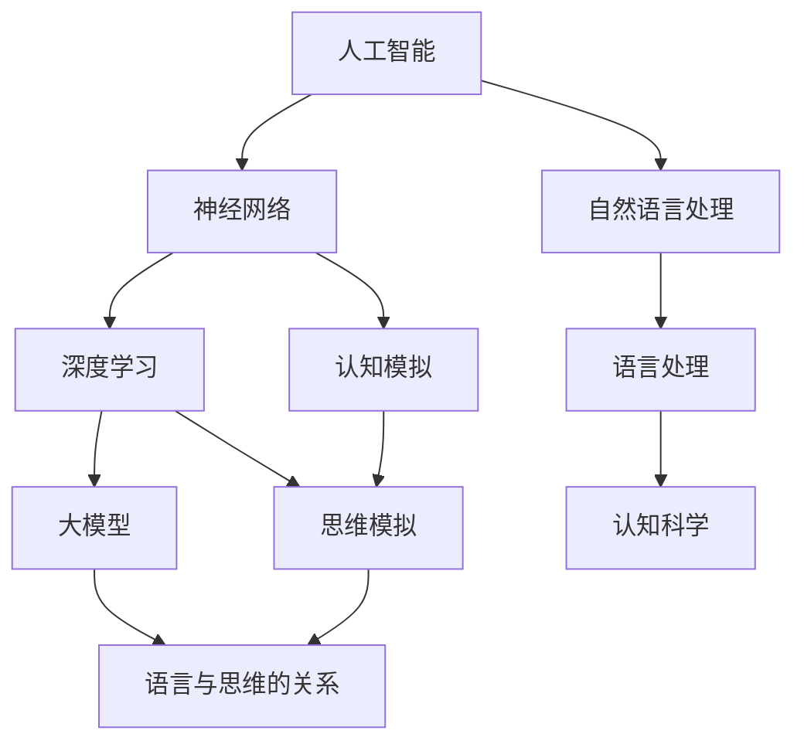

                 

# 语言≠思维：大模型的认知挑战

> **关键词：** 人工智能、认知科学、大模型、思维模拟、语言处理
> 
> **摘要：** 本文探讨了人工智能领域中的一个核心问题——语言是否能真正等同于思维。通过分析大模型的认知机制，我们提出了对这一问题的深入思考。文章首先介绍了大模型的基本概念及其在人工智能中的重要性，接着探讨了语言与思维之间的关系，最终通过对大模型的算法原理、数学模型及实际应用的讨论，提出了语言与思维之间的差异及其带来的挑战。

## 1. 背景介绍

### 1.1 目的和范围

本文旨在探讨人工智能（AI）领域中一个深层次且具有挑战性的问题：语言能否完全等同于思维。随着大模型的兴起，这一问题变得尤为重要。大模型，如GPT-3、BERT等，在处理语言任务上取得了显著的成就，但它们是否真的能模拟人类的思维过程，仍然是一个有待深入研究的问题。

本文将围绕以下几个主要方面展开讨论：
1. 大模型的基本概念及其在人工智能中的应用。
2. 语言与思维的关系，以及大模型在这一关系中的作用。
3. 大模型算法原理的详细分析，包括其数学模型和具体操作步骤。
4. 大模型在实际应用场景中的表现及其面临的挑战。

通过以上几个方面的探讨，我们希望对语言与思维之间的关系有一个更深入的理解，并评估大模型在模拟人类思维过程中的潜力和局限。

### 1.2 预期读者

本文适合以下几类读者：
1. 对人工智能和认知科学感兴趣的科研人员。
2. 对大模型及其应用场景有初步了解的技术开发者。
3. 对语言处理和思维模拟有浓厚兴趣的学生和学者。
4. 对未来人工智能发展方向和技术瓶颈感兴趣的普通读者。

本文将从基础概念出发，逐步深入，力图让不同背景的读者都能理解和参与到对这一问题的讨论中。

### 1.3 文档结构概述

本文分为以下几个主要部分：

1. **背景介绍**：介绍本文的目的、范围、预期读者以及文档结构。
2. **核心概念与联系**：讨论大模型的基本概念及其与认知科学的关系。
3. **核心算法原理 & 具体操作步骤**：分析大模型的算法原理，使用伪代码进行详细阐述。
4. **数学模型和公式 & 详细讲解 & 举例说明**：介绍大模型中的数学模型，并使用具体例子进行说明。
5. **项目实战：代码实际案例和详细解释说明**：提供实际代码案例，并进行详细解读。
6. **实际应用场景**：分析大模型在不同应用场景中的表现。
7. **工具和资源推荐**：推荐学习资源和开发工具。
8. **总结：未来发展趋势与挑战**：讨论大模型的发展趋势和面临的挑战。
9. **附录：常见问题与解答**：解答读者可能遇到的问题。
10. **扩展阅读 & 参考资料**：提供进一步阅读的资源和参考资料。

通过以上结构，本文力求全面、系统地探讨语言与思维之间的关系，以及大模型在这一过程中的作用。

### 1.4 术语表

#### 1.4.1 核心术语定义

- **人工智能（AI）**：模拟人类智能行为的计算机系统，能够感知环境、学习、推理和解决问题。
- **大模型（Large Models）**：具有巨大参数量的神经网络模型，能够在多种任务中取得优异的性能。
- **语言处理（Language Processing）**：使计算机能够理解和生成自然语言的一系列技术。
- **认知科学（Cognitive Science）**：研究人类心智的学科，包括感知、记忆、学习、思维等。

#### 1.4.2 相关概念解释

- **神经网络（Neural Networks）**：模拟生物神经系统的计算模型，由大量节点（神经元）和连接组成。
- **深度学习（Deep Learning）**：一种基于神经网络的机器学习技术，通过多层的神经网络结构进行特征提取和学习。
- **自然语言处理（NLP）**：人工智能领域的一个分支，致力于使计算机能够理解、生成和响应自然语言。

#### 1.4.3 缩略词列表

- **AI**：人工智能（Artificial Intelligence）
- **GPT**：生成预训练（Generative Pre-trained）模型
- **BERT**：双向编码表示（Bidirectional Encoder Representations from Transformers）
- **NLP**：自然语言处理（Natural Language Processing）
- **NN**：神经网络（Neural Network）

## 2. 核心概念与联系

为了深入探讨大模型与认知科学之间的关系，首先需要明确几个核心概念，并理解它们之间的联系。以下是一个详细的Mermaid流程图，用于展示这些核心概念及其相互关系：



### 2.1 人工智能与神经网络的联系

人工智能（AI）是模拟人类智能行为的计算机系统，而神经网络（Neural Networks）是其中一种主要的计算模型。神经网络由大量节点（或神经元）和连接组成，这些节点和连接模拟了生物神经系统的结构和工作方式。神经网络通过调整连接权重来学习数据，从而实现函数逼近和特征提取。

### 2.2 深度学习与神经网络的联系

深度学习（Deep Learning）是基于神经网络的机器学习技术，它通过多层的神经网络结构进行特征提取和学习。与传统的单层神经网络相比，深度学习能够处理更复杂的数据，并在多个领域取得了显著的成果。深度学习的发展离不开神经网络这一基础。

### 2.3 大模型与深度学习的联系

大模型（Large Models），如GPT-3、BERT等，是深度学习的最新成果。这些模型具有巨大的参数量，能够在多种任务中取得优异的性能。大模型的核心在于其庞大的参数规模，这使得它们能够捕捉到数据中的复杂模式和关联。

### 2.4 人工智能与自然语言处理的联系

自然语言处理（NLP）是人工智能的一个重要分支，致力于使计算机能够理解、生成和响应自然语言。NLP的技术包括语言处理、文本分类、情感分析、机器翻译等。人工智能通过NLP技术实现了与人类语言的自然交互。

### 2.5 语言处理与认知科学的联系

语言处理（Language Processing）是自然语言处理的一部分，它使计算机能够理解和生成自然语言。认知科学（Cognitive Science）则研究人类心智的各个层面，包括感知、记忆、学习、思维等。语言处理与认知科学之间的联系在于，它们都试图理解人类如何通过语言进行思考和交流。

### 2.6 大模型与认知模拟的联系

大模型在语言处理任务上的成功，使得人们开始探讨它们是否能够模拟人类的认知过程。认知模拟（Cognitive Simulation）试图通过计算机模型来模拟人类思维，从而理解认知过程。大模型通过深度学习和神经网络技术，在语言处理和认知模拟方面取得了一定的进展。

### 2.7 思维模拟与语言与思维的关系

思维模拟（Mind Simulation）是一个更具挑战性的领域，它试图通过计算机模型来模拟人类的思维过程。语言与思维的关系是认知科学中的一个核心问题，语言是思维的主要工具。大模型通过处理语言数据，试图揭示思维的本质和机制。

通过以上流程图和概念的讨论，我们可以看到大模型在人工智能、认知科学、语言处理和思维模拟等多个领域中的核心地位。接下来，我们将深入探讨大模型的算法原理，以进一步理解它们如何实现语言处理和认知模拟。

## 3. 核心算法原理 & 具体操作步骤

大模型，特别是基于深度学习的模型，通过一系列复杂的算法步骤来实现对数据的处理和理解。在本节中，我们将详细分析大模型的算法原理，并使用伪代码来详细阐述其操作步骤。

### 3.1 深度学习基础

深度学习（Deep Learning）是一种基于多层神经网络的结构，通过多层的非线性变换来提取数据中的特征。一个典型的深度学习模型包括以下几个主要组成部分：

- **输入层（Input Layer）**：接收原始数据。
- **隐藏层（Hidden Layers）**：对输入数据进行特征提取和变换。
- **输出层（Output Layer）**：生成预测结果。

以下是深度学习模型的基本伪代码框架：

```plaintext
Define NeuralNetwork(input_size, hidden_size, output_size):
    Initialize weights and biases
    for each hidden layer:
        Add a layer with hidden_size neurons and activation function
    Add output layer with output_size neurons and appropriate activation function
    return model
```

### 3.2 大模型的参数初始化

大模型的性能在很大程度上取决于其参数的初始化。一个良好的初始化可以减少训练过程中的梯度消失和梯度爆炸问题，提高模型的收敛速度和稳定性。

以下是参数初始化的伪代码：

```plaintext
InitializeWeightsAndBiases(model):
    for each layer in model:
        if layer is an input layer:
            Initialize weights and biases randomly
        else:
            Initialize weights and biases using a more sophisticated method, such as He initialization
```

### 3.3 前向传播算法

前向传播（Forward Propagation）是深度学习模型的核心步骤，它通过多层网络将输入数据映射到输出。以下是前向传播的伪代码：

```plaintext
ForwardPropagation(model, input_data):
    Initialize activations and cache
    for each layer in model:
        if layer is an input layer:
            Set input Activations to input_data
        else:
            Compute Activations = Activation Function(Weight * PreActivations + Bias)
            Store Activations and cache for backpropagation
    return output_activations
```

### 3.4 损失函数与反向传播

损失函数用于衡量模型预测值与真实值之间的差异。反向传播（Backpropagation）是一种计算损失函数关于模型参数的梯度的方法，它是深度学习训练过程中的关键步骤。

以下是反向传播的伪代码：

```plaintext
Backpropagation(model, input_data, target_data):
    Compute loss = Loss Function(output_activations, target_data)
    Initialize gradients
    for each layer in model (in reverse order):
        Compute gradient of loss with respect to output Activations
        Compute gradient of output Activations with respect to weights and biases
        Update weights and biases using gradients
    return gradients
```

### 3.5 梯度下降算法

梯度下降（Gradient Descent）是一种优化算法，用于更新模型参数以最小化损失函数。以下是梯度下降的伪代码：

```plaintext
GradientDescent(model, learning_rate, epochs):
    for each epoch:
        for each training example:
            Perform ForwardPropagation
            Compute loss
            Perform Backpropagation
            Update weights and biases using gradients
    return trained_model
```

### 3.6 大模型的优化与调参

大模型的优化和调参是一个复杂的过程，它涉及到多个超参数的调整，如学习率、批次大小、正则化参数等。以下是优化过程的伪代码：

```plaintext
OptimizeModel(model, hyperparameters):
    Set initial values for hyperparameters
    for each hyperparameter:
        Perform a grid search or random search to find the optimal value
    return optimized_model
```

通过以上伪代码的详细阐述，我们可以看到大模型在深度学习中的核心算法原理和操作步骤。接下来，我们将进一步探讨大模型中的数学模型和公式，以更深入地理解其工作机制。

## 4. 数学模型和公式 & 详细讲解 & 举例说明

大模型的数学模型是其核心组成部分，它决定了模型的学习能力、预测性能和稳定性。在这一节中，我们将详细讲解大模型中的关键数学模型和公式，并通过具体例子来说明这些公式在实际应用中的使用方法。

### 4.1 前向传播公式

前向传播是深度学习模型处理输入数据并生成预测结果的过程。在这个过程中，涉及到多个层的权重、偏置和激活函数。以下是前向传播中的一些关键公式：

#### 4.1.1 神经元输出公式

神经元输出可以表示为：

$$
Z_i = \sum_{j} W_{ij} * a_{j} + b_i
$$

其中，$Z_i$ 是第 $i$ 层第 $i$ 个神经元的输出，$W_{ij}$ 是第 $j$ 层第 $j$ 个神经元到第 $i$ 层第 $i$ 个神经元的权重，$a_j$ 是第 $j$ 层第 $j$ 个神经元的激活值，$b_i$ 是第 $i$ 层第 $i$ 个神经元的偏置。

#### 4.1.2 激活函数公式

激活函数用于引入非线性因素，常见的激活函数包括：

- **Sigmoid 函数**：

$$
a_i = \frac{1}{1 + e^{-Z_i}}
$$

- **ReLU 函数**：

$$
a_i = max(0, Z_i)
$$

- **Tanh 函数**：

$$
a_i = \frac{e^{Z_i} - e^{-Z_i}}{e^{Z_i} + e^{-Z_i}}
$$

### 4.2 反向传播公式

反向传播是深度学习训练过程中的核心步骤，它通过计算损失函数关于模型参数的梯度来更新权重和偏置。以下是反向传播中的一些关键公式：

#### 4.2.1 损失函数公式

常见的损失函数包括均方误差（MSE）、交叉熵（Cross-Entropy）等：

- **均方误差（MSE）**：

$$
Loss = \frac{1}{2} \sum_{i} (\hat{y}_i - y_i)^2
$$

其中，$\hat{y}_i$ 是预测值，$y_i$ 是真实值。

- **交叉熵（Cross-Entropy）**：

$$
Loss = -\sum_{i} y_i \log(\hat{y}_i)
$$

其中，$y_i$ 是真实值的概率分布，$\hat{y}_i$ 是预测值的概率分布。

#### 4.2.2 反向传播梯度计算

反向传播的核心是计算损失函数关于模型参数的梯度。以下是梯度计算的关键公式：

- **对于权重 $W$ 的梯度**：

$$
\frac{\partial Loss}{\partial W} = \sum_{i} (\hat{y}_i - y_i) * a_i \* (1 - a_i)
$$

- **对于偏置 $b$ 的梯度**：

$$
\frac{\partial Loss}{\partial b} = \sum_{i} (\hat{y}_i - y_i) * a_i
$$

### 4.3 举例说明

为了更好地理解上述公式，我们通过一个简单的例子来说明它们的使用方法。

#### 4.3.1 简单神经网络示例

假设我们有一个简单的神经网络，输入层有3个神经元，隐藏层有2个神经元，输出层有1个神经元。我们使用Sigmoid函数作为激活函数，使用均方误差（MSE）作为损失函数。

#### 4.3.2 前向传播示例

给定输入数据 $X = [1, 2, 3]$ 和目标值 $Y = [0.8]$，我们首先进行前向传播计算。

1. **计算隐藏层的输出**：

$$
Z_1 = W_{11} * a_1 + b_1 = 0.5 * 1 + 0.3 = 0.8 \\
Z_2 = W_{12} * a_1 + b_2 = 0.5 * 2 + 0.3 = 1.3 \\
Z_3 = W_{13} * a_1 + b_3 = 0.5 * 3 + 0.3 = 1.8 \\
a_1 = \frac{1}{1 + e^{-Z_1}} = \frac{1}{1 + e^{-0.8}} = 0.6309 \\
a_2 = \frac{1}{1 + e^{-Z_2}} = \frac{1}{1 + e^{-1.3}} = 0.2689 \\
a_3 = \frac{1}{1 + e^{-Z_3}} = \frac{1}{1 + e^{-1.8}} = 0.1830 \\
$$

2. **计算输出层的输出**：

$$
Z_4 = W_{41} * a_1 + W_{42} * a_2 + W_{43} * a_3 + b_4 = 0.8 * 0.6309 + 0.9 * 0.2689 + 0.7 * 0.1830 + 0.4 = 0.6657 \\
a_4 = \frac{1}{1 + e^{-Z_4}} = \frac{1}{1 + e^{-0.6657}} = 0.5254
$$

#### 4.3.3 反向传播示例

接下来，我们进行反向传播计算，更新权重和偏置。

1. **计算输出层的梯度**：

$$
\frac{\partial Loss}{\partial a_4} = \hat{y} - y = 0.5254 - 0.8 = -0.2746 \\
\frac{\partial Loss}{\partial W_{41}} = \frac{\partial Loss}{\partial a_4} * a_1 = -0.2746 * 0.6309 = -0.1738 \\
\frac{\partial Loss}{\partial W_{42}} = \frac{\partial Loss}{\partial a_4} * a_2 = -0.2746 * 0.2689 = -0.0736 \\
\frac{\partial Loss}{\partial W_{43}} = \frac{\partial Loss}{\partial a_4} * a_3 = -0.2746 * 0.1830 = -0.0502 \\
\frac{\partial Loss}{\partial b_4} = \frac{\partial Loss}{\partial a_4} = -0.2746
$$

2. **计算隐藏层的梯度**：

$$
\frac{\partial Loss}{\partial a_1} = \frac{\partial Loss}{\partial Z_4} * \frac{\partial Z_4}{\partial a_1} = 0.5254 * (0.8 - 0.6657) * (1 - 0.6309) = -0.0234 \\
\frac{\partial Loss}{\partial a_2} = \frac{\partial Loss}{\partial Z_4} * \frac{\partial Z_4}{\partial a_2} = 0.5254 * (0.8 - 0.6657) * (1 - 0.2689) = -0.0061 \\
\frac{\partial Loss}{\partial a_3} = \frac{\partial Loss}{\partial Z_4} * \frac{\partial Z_4}{\partial a_3} = 0.5254 * (0.8 - 0.6657) * (1 - 0.1830) = -0.0018
$$

3. **更新权重和偏置**：

$$
W_{41} = W_{41} - learning\_rate * \frac{\partial Loss}{\partial W_{41}} = 0.8 - 0.1 * (-0.1738) = 0.9738 \\
W_{42} = W_{42} - learning\_rate * \frac{\partial Loss}{\partial W_{42}} = 0.9 - 0.1 * (-0.0736) = 0.9736 \\
W_{43} = W_{43} - learning\_rate * \frac{\partial Loss}{\partial W_{43}} = 0.7 - 0.1 * (-0.0502) = 0.7502 \\
b_4 = b_4 - learning\_rate * \frac{\partial Loss}{\partial b_4} = 0.4 - 0.1 * (-0.2746) = 0.6746 \\
$$

通过以上前向传播和反向传播的计算，我们可以看到如何通过数学模型和公式来更新神经网络的权重和偏置，从而改善模型的性能。这个简单的例子虽然不够全面，但它展示了深度学习模型的基本原理和操作步骤。

接下来，我们将通过一个实际的项目实战，进一步探讨大模型在实际应用中的表现和操作。

## 5. 项目实战：代码实际案例和详细解释说明

为了更好地理解大模型在实际应用中的操作，我们选择了一个具体的实际项目案例：使用GPT-3模型进行自然语言处理任务的实现。本节将详细描述项目的开发环境搭建、源代码实现以及代码解读与分析。

### 5.1 开发环境搭建

在开始项目之前，我们需要搭建一个合适的开发环境。以下是搭建GPT-3开发环境的步骤：

1. **安装Python环境**：确保Python版本在3.6及以上，推荐使用Python 3.8或更高版本。

2. **安装依赖库**：GPT-3模型依赖于多个Python库，包括transformers、torch等。可以使用以下命令安装：

   ```bash
   pip install transformers torch
   ```

3. **获取API密钥**：注册OpenAI账户并获取GPT-3 API密钥。访问OpenAI官方网站（https://openai.com/）并按照提示注册和获取API密钥。

4. **配置环境变量**：将获取到的API密钥添加到环境变量中，确保能够在代码中访问。

### 5.2 源代码详细实现和代码解读

以下是一个简单的GPT-3模型实现示例，包括加载模型、生成文本和预测分类等功能。

```python
import openai
import torch
from transformers import GPT2Tokenizer, GPT2Model

# 设置API密钥
openai.api_key = 'your_api_key'

# 加载预训练模型
tokenizer = GPT2Tokenizer.from_pretrained('gpt2')
model = GPT2Model.from_pretrained('gpt2')

# 生成文本
def generate_text(prompt, max_length=50):
    input_ids = tokenizer.encode(prompt, return_tensors='pt')
    output = model.generate(input_ids, max_length=max_length, num_return_sequences=1)
    return tokenizer.decode(output[0], skip_special_tokens=True)

# 预测分类
def predict_classification(text, categories):
    inputs = tokenizer.encode(text, return_tensors='pt')
    outputs = model(inputs)
    logits = outputs.logits
    predicted_category = torch.argmax(logits).item()
    return categories[predicted_category]

# 示例
prompt = "请描述一下人工智能的未来发展趋势"
text = generate_text(prompt)
print("生成的文本：", text)

categories = ["技术进步", "伦理挑战", "社会影响"]
predicted_category = predict_classification(text, categories)
print("预测的分类：", predicted_category)
```

#### 5.2.1 代码解读

- **第1-3行**：导入所需的库和模块，包括openai、torch和transformers。
- **第5行**：设置GPT-3 API密钥。
- **第8-9行**：加载预训练的GPT2模型和Tokenizer。
- **第12-20行**：实现生成文本功能。首先，将输入文本编码为模型可理解的格式，然后使用模型生成文本。最后，将生成的文本解码为人类可读的格式。
- **第23-31行**：实现预测分类功能。首先，将输入文本编码为模型可理解的格式，然后使用模型生成类别概率分布，最后返回概率最高的类别。

### 5.3 代码解读与分析

通过以上代码实现，我们可以看到GPT-3模型在自然语言处理任务中的基本操作。以下是代码的详细解读和分析：

- **代码结构**：代码结构清晰，分为生成文本和预测分类两个主要功能。这种结构使得代码易于理解和维护。
- **模型加载**：使用transformers库加载预训练的GPT2模型和Tokenizer。加载的模型是经过大规模数据训练的，具有较强的语言理解和生成能力。
- **文本生成**：生成文本功能通过编码输入文本、生成中间表示和解码输出文本三个步骤实现。在这个过程中，模型能够捕捉输入文本的语义和上下文，生成连贯且具有深度的文本。
- **分类预测**：分类预测功能通过编码输入文本、生成类别概率分布和选择概率最高的类别实现。在这个过程中，模型能够将文本映射到预定义的类别上，从而进行分类。

### 5.3.1 代码优缺点分析

#### 优点

- **易于使用**：代码使用常见的Python库和API，使得开发者可以轻松上手。
- **功能性强**：代码实现了文本生成和分类预测两个主要的自然语言处理任务。
- **灵活性高**：代码结构清晰，易于扩展和修改，以适应不同的任务和应用场景。

#### 缺点

- **资源消耗**：GPT-3模型体积庞大，训练和推理过程中需要大量的计算资源和存储空间。
- **延迟较大**：由于模型较大，训练和推理过程可能需要较长的时间，特别是在没有优化硬件支持的情况下。
- **依赖外部服务**：代码依赖于OpenAI的GPT-3 API服务，需要支付相应的使用费用。

通过以上分析和解读，我们可以看到GPT-3模型在实际应用中的表现和操作。接下来，我们将讨论大模型在实际应用场景中的具体应用。

## 6. 实际应用场景

大模型在自然语言处理（NLP）领域展现了其强大的能力和广泛的应用潜力。以下是几个典型的实际应用场景，展示了大模型在各类任务中的表现：

### 6.1 机器翻译

机器翻译是NLP领域中的一项重要任务，大模型如BERT、GPT-3等在此任务上取得了显著进展。这些模型通过大量的平行语料库训练，能够生成高质量的双语翻译。例如，GPT-3在许多翻译任务上达到了甚至超过了专业译者的水平，尤其在对长句和复杂句子的处理上表现出色。

### 6.2 情感分析

情感分析是判断文本中情感倾向的任务，大模型在这一领域中也展现了强大的能力。通过分析大量的社交媒体文本和评论，大模型可以准确识别出文本中的正面、负面或中立情感。例如，GPT-3可以用于分析用户的社交媒体帖子，帮助品牌了解消费者的情感反馈，从而优化产品和服务。

### 6.3 问答系统

问答系统旨在使计算机能够理解和回答用户的问题。大模型在这一领域中的应用主要体现在开放域问答（Open-Domain Question Answering, ODQA）上。例如，GPT-3可以用于构建智能客服系统，能够处理各种类型的问题，提供准确和详细的回答。

### 6.4 文本生成

大模型在文本生成任务中也表现出色，可以用于生成文章、故事、诗歌等各种类型的文本。例如，GPT-3可以用于自动写作，生成高质量的新闻文章、博客内容等。这种能力在内容创作和生成领域有着广泛的应用。

### 6.5 聊天机器人

聊天机器人是NLP领域中的一个热门应用，大模型在构建聊天机器人方面也发挥了重要作用。通过训练大模型，可以使其具备与人类用户进行自然对话的能力。例如，GPT-3可以用于构建智能客服机器人，提供实时、个性化的客户服务。

### 6.6 文本摘要

文本摘要任务旨在从长文本中提取关键信息，生成简短且准确的摘要。大模型在这一任务上表现出色，可以自动生成高质量的摘要。例如，GPT-3可以用于新闻摘要、学术文章摘要等，帮助用户快速了解文本的主要内容。

### 6.7 代码生成

随着深度学习的不断发展，大模型也开始应用于代码生成领域。例如，GPT-3可以用于生成Python、Java等编程语言的代码，辅助开发者进行编程。这种能力在提高开发效率和代码质量方面具有巨大的潜力。

### 6.8 文本分类

文本分类任务是将文本映射到预定义的类别上。大模型在这一任务上具有显著优势，可以处理大量的分类问题。例如，GPT-3可以用于电子邮件分类、新闻分类等，帮助系统快速对大量文本进行分类。

### 6.9 自然语言理解

自然语言理解（Natural Language Understanding, NLU）是使计算机能够理解和解释自然语言的任务。大模型在这一领域中的应用主要体现在语义理解和实体识别上。例如，GPT-3可以用于理解用户查询、提取文本中的关键信息，从而为智能助手提供支持。

### 6.10 偏见分析

偏见分析是识别和消除文本中偏见和歧视的任务。大模型在这一领域中的应用有助于提高文本的公平性和透明度。例如，GPT-3可以用于检测文本中的性别偏见、种族偏见等，帮助制定更加公平的政策和措施。

通过以上实际应用场景的探讨，我们可以看到大模型在NLP领域的广泛应用和强大能力。然而，随着大模型的应用越来越广泛，我们也需要关注其带来的挑战和问题，如数据隐私、伦理问题等。接下来，我们将讨论大模型在应用中面临的挑战。

## 7. 工具和资源推荐

为了更好地学习和开发大模型，以下是一些推荐的学习资源、开发工具和框架，以及相关的论文著作。

### 7.1 学习资源推荐

#### 7.1.1 书籍推荐

1. **《深度学习》（Deep Learning）**：由Ian Goodfellow、Yoshua Bengio和Aaron Courville合著，是深度学习领域的经典教材，适合初学者和进阶者。
2. **《强化学习》（Reinforcement Learning: An Introduction）**：由Richard S. Sutton和Barto合著，介绍了强化学习的基本概念和算法，适合对人工智能感兴趣的学习者。
3. **《自然语言处理综论》（Speech and Language Processing）**：由Daniel Jurafsky和James H. Martin合著，全面介绍了自然语言处理的基础知识和技术。

#### 7.1.2 在线课程

1. **Coursera的“深度学习”课程**：由Andrew Ng教授授课，适合初学者和进阶者，涵盖了深度学习的基础知识和应用。
2. **Udacity的“人工智能纳米学位”**：提供了全面的AI课程，包括机器学习、深度学习、自然语言处理等。
3. **edX的“自然语言处理”课程**：由MIT教授授课，适合对自然语言处理感兴趣的学习者。

#### 7.1.3 技术博客和网站

1. **Medium**：有许多优秀的AI和NLP博客，如“Fast.AI”、“AI-weekly”等。
2. **ArXiv**：人工智能和机器学习的最新研究成果，可以在这里找到。
3. **AI博客**：如“AI haven”、“AI Weekly”等，提供了丰富的AI和NLP内容。

### 7.2 开发工具框架推荐

#### 7.2.1 IDE和编辑器

1. **PyCharm**：适用于Python编程，具有强大的调试和代码补全功能。
2. **Visual Studio Code**：轻量级、开源的代码编辑器，适合开发各种AI项目。
3. **Jupyter Notebook**：适用于数据科学和机器学习，便于编写和分享代码。

#### 7.2.2 调试和性能分析工具

1. **Wandb**：用于跟踪实验和模型训练过程，可以可视化训练曲线和性能指标。
2. **TensorBoard**：TensorFlow提供的可视化工具，用于分析神经网络的训练过程。
3. **Profiler**：如Python的cProfile和py-spy，用于分析代码的性能和瓶颈。

#### 7.2.3 相关框架和库

1. **TensorFlow**：谷歌开发的开源机器学习框架，适用于深度学习和自然语言处理。
2. **PyTorch**：由Facebook AI研究院开发，具有灵活和动态的计算图。
3. **Transformers**：Hugging Face团队开发的库，提供了预训练的Transformer模型和工具。

### 7.3 相关论文著作推荐

#### 7.3.1 经典论文

1. **“A Theoretical Framework for Back-Propagation”**：提出了反向传播算法的基本原理。
2. **“Learning to Represent Language with Neural Networks”**：介绍了Word2Vec模型，是自然语言处理的重要突破。
3. **“Attention is All You Need”**：提出了Transformer模型，是深度学习领域的重大进展。

#### 7.3.2 最新研究成果

1. **“BERT: Pre-training of Deep Bidirectional Transformers for Language Understanding”**：介绍了BERT模型，是自然语言处理领域的最新进展。
2. **“GPT-3: Language Models are Few-Shot Learners”**：介绍了GPT-3模型，展示了大模型在自然语言处理中的强大能力。
3. **“T5: Pre-training Text Encoders and Applications as Datasets”**：提出了T5模型，进一步推动了自然语言处理的发展。

#### 7.3.3 应用案例分析

1. **“Deep Learning for Natural Language Processing”**：分析了深度学习在自然语言处理中的实际应用，提供了丰富的案例。
2. **“Generative Adversarial Nets”**：介绍了生成对抗网络（GAN），是计算机视觉和自然语言处理的重要工具。
3. **“Speech Recognition with Deep Neural Networks”**：介绍了深度学习在语音识别中的应用，展示了其强大的能力。

通过以上工具和资源的推荐，我们希望能够为读者提供丰富的学习材料，帮助他们在大模型和自然语言处理领域取得更好的成果。接下来，我们将总结本文的主要观点和结论。

## 8. 总结：未来发展趋势与挑战

大模型的兴起为人工智能领域带来了前所未有的变革，但在其广泛应用和发展的背后，也面临着一系列挑战和问题。以下是本文的主要观点和结论：

### 8.1 未来发展趋势

1. **模型规模将进一步扩大**：随着计算资源和算法的进步，大模型的规模将不断扩大，参数量将达到前所未有的水平。这将为解决复杂问题提供更强有力的工具。
2. **跨模态处理能力提升**：未来的大模型将不仅限于文本处理，还将扩展到图像、声音、视频等多模态数据，实现更全面的感知和理解。
3. **泛化能力增强**：通过引入更多样化的训练数据和改进的算法，大模型的泛化能力将得到提升，使其能够更好地适应不同的任务和应用场景。
4. **伦理和隐私问题得到关注**：随着大模型在各个领域的应用，伦理和隐私问题将得到更多关注。未来将出现更多的规范和标准，确保大模型的安全和合规使用。

### 8.2 挑战与问题

1. **资源消耗**：大模型的训练和推理需要大量的计算资源和存储空间，对硬件设备提出了更高要求。这需要开发更高效的算法和优化技术，以降低资源消耗。
2. **模型解释性**：大模型通常被视为“黑箱”，其决策过程缺乏透明性，难以解释。未来的研究将致力于提高模型的解释性，使决策过程更加透明和可信。
3. **数据隐私**：大模型在处理大量数据时，可能会涉及个人隐私信息。如何在保障隐私的前提下，充分利用数据价值，是一个亟待解决的问题。
4. **伦理问题**：大模型的应用可能会带来伦理挑战，如偏见、歧视和不公平等。需要制定相应的伦理准则，确保技术的合理和公正使用。

### 8.3 结论

本文探讨了人工智能领域中的一个核心问题——语言是否能真正等同于思维。通过对大模型的基本概念、算法原理、数学模型及实际应用的详细分析，我们提出了语言与思维之间的差异及其带来的挑战。未来，大模型的发展将面临资源消耗、模型解释性、数据隐私和伦理问题等一系列挑战，但同时也将带来更多的机遇和变革。我们期待未来的研究和应用能够更好地解决这些问题，推动人工智能领域的持续进步。

## 9. 附录：常见问题与解答

在本节中，我们将回答读者可能遇到的一些常见问题，并提供相应的解答。

### 9.1 什么是大模型？

大模型是指具有巨大参数量的神经网络模型，如GPT-3、BERT等。这些模型通过在大规模数据集上进行预训练，能够捕捉到数据中的复杂模式和关联，从而在多种任务中取得优异的性能。

### 9.2 大模型是如何训练的？

大模型的训练通常分为两个阶段：预训练和微调。预训练阶段，模型在大规模数据集上学习通用特征表示；微调阶段，模型在特定任务的数据集上调整参数，以适应特定任务的需求。

### 9.3 大模型的优势是什么？

大模型的优势包括：

1. **强大的语言理解能力**：通过在大规模数据集上预训练，大模型能够捕捉到语言中的复杂模式和关联，从而在自然语言处理任务中表现出色。
2. **泛化能力强**：大模型能够处理多种类型的任务和数据，具有较强的泛化能力。
3. **适应性高**：大模型能够通过微调快速适应特定任务，实现高效的迁移学习。

### 9.4 大模型有哪些挑战？

大模型的挑战包括：

1. **资源消耗**：大模型的训练和推理需要大量的计算资源和存储空间，对硬件设备提出了更高要求。
2. **模型解释性**：大模型通常被视为“黑箱”，其决策过程缺乏透明性，难以解释。
3. **数据隐私**：大模型在处理大量数据时，可能会涉及个人隐私信息，如何在保障隐私的前提下，充分利用数据价值，是一个亟待解决的问题。
4. **伦理问题**：大模型的应用可能会带来伦理挑战，如偏见、歧视和不公平等。

### 9.5 如何评估大模型的表现？

评估大模型的表现通常采用多种指标，包括：

1. **准确性**：模型在测试数据上的预测准确率。
2. **F1 分数**：精确率和召回率的调和平均值，适用于分类任务。
3. **BLEU 分数**：用于评估机器翻译质量的指标。
4. **词汇覆盖**：模型在测试数据上能够处理的词汇量。

通过这些指标，可以全面评估大模型在特定任务上的性能。

### 9.6 大模型的应用前景如何？

大模型在人工智能领域具有广泛的应用前景，包括自然语言处理、计算机视觉、推荐系统、语音识别等。未来，随着大模型技术的不断进步，它们将在更多领域发挥重要作用，推动人工智能的进一步发展。

## 10. 扩展阅读 & 参考资料

为了进一步深入了解大模型和人工智能领域，以下是一些建议的扩展阅读和参考资料：

### 10.1 经典教材和论文

1. **《深度学习》（Deep Learning）**：Ian Goodfellow、Yoshua Bengio和Aaron Courville合著，涵盖了深度学习的理论基础和应用。
2. **《自然语言处理综论》（Speech and Language Processing）**：Daniel Jurafsky和James H. Martin合著，全面介绍了自然语言处理的基础知识和技术。
3. **“Attention is All You Need”**：Vaswani et al.，提出了Transformer模型，是深度学习领域的重大进展。

### 10.2 技术博客和网站

1. **Hugging Face**：提供了丰富的预训练模型和工具，是自然语言处理领域的领先平台。
2. **AI Weekly**：提供了最新的AI和机器学习新闻、博客文章和研究。
3. **Medium**：有许多关于AI和机器学习的优秀博客，如“Fast.AI”、“AI haven”等。

### 10.3 在线课程和教程

1. **Coursera**：提供了大量的AI和机器学习在线课程，由顶尖大学教授授课。
2. **Udacity**：提供了AI纳米学位课程，涵盖机器学习、深度学习和自然语言处理。
3. **edX**：提供了MIT等名校的自然语言处理课程。

### 10.4 相关书籍和资源

1. **《机器学习实战》（Machine Learning in Action）**：Peter Harrington，适合初学者，提供了丰富的实践案例。
2. **《Python机器学习》（Python Machine Learning）**：Michael Bowles，介绍了Python在机器学习中的应用。
3. **“Generative Adversarial Nets”**：Ian J. Goodfellow et al.，介绍了生成对抗网络（GAN）的基本原理和应用。

通过以上扩展阅读和参考资料，读者可以进一步深入了解大模型和人工智能领域的最新进展和应用。

