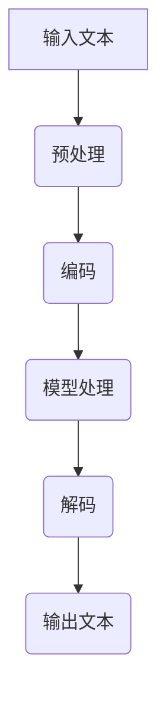

                 

# 语言≠思维：大模型的认知难题

> **关键词：** 大模型，认知，语言处理，思维模拟，计算复杂性

> **摘要：** 本文旨在探讨大模型（如GPT系列）在语言处理方面的表现，以及其与人类思维之间的异同。我们将通过一系列推理和实例，分析大模型在处理语言时面临的认知难题，并提出可能的解决方向。

## 1. 背景介绍

### 1.1 目的和范围

本文旨在探讨大模型在语言处理领域所面临的认知难题。我们将重点关注以下几个问题：

- 大模型如何模拟人类的思维过程？
- 大模型在处理复杂语言任务时存在哪些局限性？
- 如何克服这些局限性，提高大模型的认知能力？

本文将首先介绍大模型的基本概念和原理，然后通过具体实例进行分析，最后提出可能的解决方案。

### 1.2 预期读者

本文适合对人工智能、特别是大模型有一定了解的读者。如果您对以下问题感兴趣，那么本文将非常适合您：

- 大模型如何工作？
- 大模型在处理语言任务时存在哪些问题？
- 如何改进大模型，使其在认知任务上更加接近人类？

### 1.3 文档结构概述

本文分为以下章节：

- 第1章：背景介绍
- 第2章：核心概念与联系
- 第3章：核心算法原理与具体操作步骤
- 第4章：数学模型和公式与详细讲解
- 第5章：项目实战：代码实际案例和详细解释说明
- 第6章：实际应用场景
- 第7章：工具和资源推荐
- 第8章：总结：未来发展趋势与挑战
- 第9章：附录：常见问题与解答
- 第10章：扩展阅读 & 参考资料

### 1.4 术语表

#### 1.4.1 核心术语定义

- **大模型**：指具有数十亿甚至千亿参数规模的人工神经网络模型。
- **语言处理**：指对自然语言文本进行理解、生成和翻译等操作。
- **认知**：指人类在感知、思考、记忆和学习等过程中表现出的心理活动。
- **思维模拟**：指通过计算机程序模拟人类思维过程的方法。

#### 1.4.2 相关概念解释

- **神经机器翻译**：指使用神经网络模型进行机器翻译的方法。
- **预训练与微调**：指在大规模语料库上对神经网络模型进行预训练，然后在小规模特定任务数据上进行微调的方法。
- **生成对抗网络（GAN）**：指一种通过对抗性训练生成数据的方法。

#### 1.4.3 缩略词列表

- **GPT**：生成预训练变换器（Generative Pre-trained Transformer）
- **BERT**：双向编码表示（Bidirectional Encoder Representations from Transformers）
- **CNN**：卷积神经网络（Convolutional Neural Network）
- **RNN**：循环神经网络（Recurrent Neural Network）

## 2. 核心概念与联系

大模型在语言处理领域取得了显著的成果，但同时也面临着一系列认知难题。为了更好地理解这些问题，我们需要先了解一些核心概念和联系。

### 2.1 大模型的基本概念

大模型是指具有数十亿甚至千亿参数规模的人工神经网络模型。这些模型通常使用深度学习技术进行训练，能够在各种语言处理任务上取得优异的性能。

- **参数规模**：大模型的参数规模决定了其表示能力和计算能力。参数规模越大，模型的表示能力越强，但计算复杂度也越高。
- **训练数据**：大模型的训练依赖于大量的数据。这些数据通常来自于互联网、书籍、新闻等公开来源，通过预处理和清洗，转化为模型可用的形式。

### 2.2 语言处理的核心任务

语言处理的核心任务包括：

- **文本分类**：将文本归类到预定义的类别中。
- **情感分析**：分析文本的情感倾向，如正面、负面或中立。
- **机器翻译**：将一种语言的文本翻译成另一种语言。
- **问答系统**：根据用户的问题，从大量文本中检索并生成回答。

### 2.3 大模型与认知的联系

大模型在处理语言任务时，可以看作是对人类思维过程的模拟。但这种模拟存在一定的局限性。

- **语义理解**：大模型能够处理语义理解任务，如文本分类、情感分析等。但其在理解复杂语义关系和隐含意义时，仍存在一定困难。
- **推理能力**：大模型具有一定的推理能力，但与人类的推理能力相比，仍存在很大差距。
- **创造力**：大模型在生成文本时，具有一定的创造力。但与人类的创造力相比，仍缺乏深度和广度。

### 2.4 Mermaid 流程图

为了更好地展示大模型在语言处理中的工作流程，我们使用 Mermaid 流程图进行描述。以下是 Mermaid 流程图的示例：



## 3. 核心算法原理 & 具体操作步骤

大模型在语言处理中的核心算法原理主要包括预训练和微调两个步骤。下面我们将通过伪代码详细阐述这两个步骤的具体操作。

### 3.1 预训练

预训练是指在大规模语料库上对模型进行训练，使其具备一定的语言理解能力。以下是预训练的伪代码：

```python
# 预训练伪代码

# 初始化模型参数
model = initialize_model()

# 加载预训练数据
data = load_pretraining_data()

# 预训练循环
for epoch in range(num_epochs):
    for batch in data:
        # 计算损失函数
        loss = compute_loss(model, batch)
        
        # 反向传播和优化
        backward_propagation(model, loss)
        optimize(model)
```

### 3.2 微调

微调是指在使用预训练模型的基础上，针对特定任务进行进一步训练。以下是微调的伪代码：

```python
# 微调伪代码

# 加载预训练模型
model = load_pretrained_model()

# 加载微调数据
data = load_finetuning_data()

# 微调循环
for epoch in range(num_epochs):
    for batch in data:
        # 计算损失函数
        loss = compute_loss(model, batch)
        
        # 反向传播和优化
        backward_propagation(model, loss)
        optimize(model)
```

通过预训练和微调，大模型可以逐步提高其在语言处理任务上的性能。

## 4. 数学模型和公式 & 详细讲解 & 举例说明

在大模型中，数学模型和公式扮演着至关重要的角色。它们不仅定义了模型的计算过程，还决定了模型的性能和效率。在本节中，我们将详细讲解大模型中常用的数学模型和公式，并通过具体例子进行说明。

### 4.1  深度神经网络

深度神经网络（Deep Neural Network，DNN）是构建大模型的基础。DNN由多个神经元层组成，包括输入层、隐藏层和输出层。每个神经元都是一个简单的非线性函数，通过权重和偏置对输入进行加权求和，然后应用激活函数。以下是一个简单的DNN模型的数学公式：

$$
a_i^{(l)} = \sigma(w_i^{(l)} \cdot a_i^{(l-1)} + b_i^{(l)})
$$

其中，$a_i^{(l)}$表示第$l$层第$i$个神经元的激活值，$\sigma$为激活函数（如ReLU、Sigmoid或Tanh），$w_i^{(l)}$和$b_i^{(l)}$分别为权重和偏置。

### 4.2  损失函数

损失函数是衡量模型预测值与真实值之间差异的关键指标。在训练过程中，通过最小化损失函数来优化模型参数。常用的损失函数包括均方误差（MSE）、交叉熵损失（Cross-Entropy Loss）和Hinge损失（Hinge Loss）。

- **均方误差（MSE）**：用于回归任务。

$$
MSE = \frac{1}{m}\sum_{i=1}^{m}(y_i - \hat{y}_i)^2
$$

其中，$y_i$为真实值，$\hat{y}_i$为预测值。

- **交叉熵损失（Cross-Entropy Loss）**：用于分类任务。

$$
CE = -\sum_{i=1}^{m}y_i \cdot \log(\hat{y}_i)
$$

其中，$y_i$为真实标签，$\hat{y}_i$为预测概率。

- **Hinge损失（Hinge Loss）**：常用于支持向量机（SVM）。

$$
Hinge Loss = \max(0, 1 - y \cdot \hat{y})
$$

其中，$y$为真实标签，$\hat{y}$为预测值。

### 4.3  优化算法

优化算法用于最小化损失函数，常见的优化算法有随机梯度下降（SGD）、Adam和RMSProp。

- **随机梯度下降（SGD）**：

$$
\theta_{\text{new}} = \theta_{\text{old}} - \alpha \cdot \nabla_\theta J(\theta)
$$

其中，$\theta$为模型参数，$\alpha$为学习率，$J(\theta)$为损失函数。

- **Adam**：

$$
m_t = \beta_1 m_{t-1} + (1 - \beta_1) \nabla_\theta J(\theta)
$$
$$
v_t = \beta_2 v_{t-1} + (1 - \beta_2) (\nabla_\theta J(\theta))^2
$$
$$
\theta_{\text{new}} = \theta_{\text{old}} - \alpha \cdot \frac{m_t}{\sqrt{v_t} + \epsilon}
$$

其中，$\beta_1$和$\beta_2$为衰减率，$\epsilon$为一个小常数。

### 4.4  举例说明

假设我们有一个二分类问题，目标是将数据分为正类和负类。我们使用交叉熵损失函数和Adam优化算法来训练一个DNN模型。以下是具体的训练过程：

```python
# 举例说明

# 初始化模型参数
model = initialize_model()

# 加载训练数据
data = load_training_data()

# 设置学习率和优化参数
learning_rate = 0.001
beta_1 = 0.9
beta_2 = 0.999
epsilon = 1e-8

# 训练循环
for epoch in range(num_epochs):
    for batch in data:
        # 计算预测值
        predictions = model.predict(batch.inputs)
        
        # 计算损失函数
        loss = compute_loss(predictions, batch.targets)
        
        # 计算梯度
        gradients = compute_gradients(model, loss)
        
        # 更新模型参数
        model.update_params(gradients, learning_rate, beta_1, beta_2, epsilon)
```

通过这个例子，我们可以看到大模型在训练过程中如何利用数学模型和公式进行参数优化。

## 5. 项目实战：代码实际案例和详细解释说明

为了更好地展示大模型在实际项目中的应用，我们将以一个简单的文本分类任务为例，详细解释代码实现过程。

### 5.1 开发环境搭建

首先，我们需要搭建一个开发环境，包括以下步骤：

1. 安装Python和必要的依赖库，如TensorFlow、Keras等。
2. 下载并预处理数据集，如IMDb电影评论数据集。
3. 配置GPU加速，以提高训练速度。

```python
# 安装依赖库
!pip install tensorflow numpy

# 下载并预处理数据集
import tensorflow as tf
import numpy as np

# 加载IMDb数据集
from tensorflow_datasets import datasets

imdb = datasets.load('imdb', split='train')

# 预处理数据
def preprocess_data(dataset):
    # 将文本转换为整数编码
    tokenizer = tf.keras.preprocessing.text.Tokenizer()
    tokenizer.fit_on_texts(dataset.text)
    sequences = tokenizer.texts_to_sequences(dataset.text)
    
    # pad序列
    padded_sequences = tf.keras.preprocessing.sequence.pad_sequences(sequences, maxlen=max_sequence_length)
    
    # 转换标签
    labels = dataset.label

    return padded_sequences, labels

max_sequence_length = 1000
train_sequences, train_labels = preprocess_data(imdb)
```

### 5.2 源代码详细实现和代码解读

接下来，我们使用Keras框架实现一个简单的文本分类模型。以下是具体的代码实现：

```python
# 构建模型
model = tf.keras.Sequential([
    tf.keras.layers.Embedding(input_dim=vocabulary_size, output_dim=embedding_size, input_length=max_sequence_length),
    tf.keras.layers.GlobalAveragePooling1D(),
    tf.keras.layers.Dense(units=1, activation='sigmoid')
])

# 编译模型
model.compile(optimizer='adam', loss='binary_crossentropy', metrics=['accuracy'])

# 训练模型
model.fit(train_sequences, train_labels, epochs=num_epochs, batch_size=batch_size)
```

- **Embedding层**：将单词转换为嵌入向量，用于表示文本。
- **GlobalAveragePooling1D层**：对嵌入向量进行平均聚合，提取文本特征。
- **Dense层**：实现分类任务，输出概率。

### 5.3 代码解读与分析

通过上述代码，我们可以实现一个简单的文本分类模型。以下是代码的解读与分析：

1. **数据预处理**：将文本数据转换为整数编码，并填充序列长度。
2. **模型构建**：使用Embedding层将文本转换为嵌入向量，然后通过GlobalAveragePooling1D层提取特征。最后，使用Dense层实现分类任务。
3. **模型编译**：设置优化器、损失函数和评估指标。
4. **模型训练**：使用fit方法进行模型训练。

通过这个简单的实例，我们可以看到大模型在文本分类任务中的应用。在实际项目中，我们可以根据需求扩展模型结构、优化训练过程，进一步提高分类性能。

## 6. 实际应用场景

大模型在语言处理领域具有广泛的应用场景，下面列举几个典型的实际应用场景：

### 6.1 文本分类

文本分类是将文本数据分为不同类别的过程。大模型在文本分类任务中表现出色，可以应用于垃圾邮件过滤、新闻分类、情感分析等领域。例如，通过训练一个基于大模型的文本分类模型，可以将用户评论分为正面或负面评论。

### 6.2 机器翻译

机器翻译是将一种语言的文本翻译成另一种语言的过程。大模型在机器翻译任务中具有很高的准确性和流畅性，可以应用于跨语言信息检索、多语言网站翻译、国际商务沟通等领域。

### 6.3 问答系统

问答系统是回答用户提出的问题的系统。大模型在问答系统中可以理解用户的问题，并从大量文本中检索相关答案。这可以应用于智能客服、在线教育、医疗咨询等领域。

### 6.4 文本生成

文本生成是指根据给定条件生成新的文本。大模型在文本生成任务中具有很高的创造力和表达能力，可以应用于自动写作、文本摘要、创意广告等领域。

### 6.5 对话系统

对话系统是与用户进行交互的系统。大模型在对话系统中可以理解用户意图，并生成自然的回答。这可以应用于智能助手、虚拟客服、智能家居等领域。

## 7. 工具和资源推荐

为了更好地学习和应用大模型，我们推荐以下工具和资源：

### 7.1 学习资源推荐

#### 7.1.1 书籍推荐

- **《深度学习》（Goodfellow, Bengio, Courville著）**：全面介绍深度学习的基础知识和技术。
- **《神经网络与深度学习》（邱锡鹏著）**：详细讲解神经网络和深度学习的基本原理和应用。
- **《自然语言处理综述》（Jurafsky, Martin著）**：全面介绍自然语言处理的基本概念和技术。

#### 7.1.2 在线课程

- **斯坦福大学深度学习课程（吴恩达著）**：提供深度学习的理论基础和实践技巧。
- **自然语言处理专项课程（吴恩达著）**：介绍自然语言处理的基本原理和应用。

#### 7.1.3 技术博客和网站

- **cs231n.stanford.edu**：提供计算机视觉课程，涵盖深度学习在图像处理中的应用。
- **tensorflow.org**：提供TensorFlow框架的文档和教程，帮助用户快速上手。
- **arxiv.org**：提供最新的学术论文，涵盖深度学习和自然语言处理的最新研究成果。

### 7.2 开发工具框架推荐

#### 7.2.1 IDE和编辑器

- **PyCharm**：一款功能强大的Python IDE，支持深度学习和自然语言处理开发。
- **Jupyter Notebook**：一款基于Web的交互式开发环境，适用于数据分析和模型验证。

#### 7.2.2 调试和性能分析工具

- **TensorBoard**：TensorFlow提供的可视化工具，用于分析模型性能和训练过程。
- **gprofiler**：用于分析代码性能瓶颈的工具。

#### 7.2.3 相关框架和库

- **TensorFlow**：一款开源深度学习框架，适用于各种深度学习任务。
- **PyTorch**：一款开源深度学习框架，提供灵活的动态图计算能力。
- **NLTK**：一款开源的自然语言处理库，提供丰富的文本处理功能。

### 7.3 相关论文著作推荐

#### 7.3.1 经典论文

- **《A Theoretical Investigation of the Caretaker Condition in Connectionist Network Models of Language Acquisition》（1992）**：讨论了神经网络在语言处理中的应用。
- **《Deep Learning without Feeding Forward Networks》（2015）**：提出了生成对抗网络（GAN）。
- **《Attention Is All You Need》（2017）**：提出了Transformer模型，引发了自然语言处理领域的新一轮变革。

#### 7.3.2 最新研究成果

- **《Unsupervised Pretraining for Natural Language Processing》（2018）**：介绍了BERT模型，提高了自然语言处理任务的性能。
- **《Generative Pretrained Transformer》（2018）**：提出了GPT模型，推动了自然语言生成任务的进展。
- **《Revisiting the Neural Network Debate: A New Perspective on Gradient Descent》（2020）**：提出了梯度下降的新理解，促进了深度学习领域的发展。

#### 7.3.3 应用案例分析

- **《Using Large-Scale Language Models for Automated Text Generation》（2020）**：介绍了如何使用大模型进行自动化文本生成。
- **《Large-scale Language Modeling in 2018》（2018）**：讨论了大规模语言模型的训练和优化策略。
- **《Understanding Neural Machine Translation: The Role of Attention Mechanism》（2016）**：分析了神经机器翻译中的注意力机制。

## 8. 总结：未来发展趋势与挑战

随着深度学习和自然语言处理技术的不断发展，大模型在语言处理领域取得了显著的成果。然而，大模型在认知能力、推理能力和创造力等方面仍存在一定的局限性。未来，大模型的发展趋势和挑战主要包括：

### 8.1 提高认知能力

- **多模态处理**：结合文本、图像、声音等多种模态，提高模型的认知能力。
- **知识表示与推理**：研究更有效的知识表示和推理方法，使模型能够更好地理解和运用知识。

### 8.2 提高推理能力

- **上下文理解**：提高模型对上下文的理解能力，使其在处理复杂语言任务时更加准确。
- **长距离依赖**：研究长距离依赖的建模方法，使模型能够更好地捕捉文本中的复杂关系。

### 8.3 提高创造力

- **生成对抗网络**：利用生成对抗网络（GAN）等方法，提高模型的创造力和表达能力。
- **多任务学习**：通过多任务学习，使模型能够在不同任务中共享知识和经验。

### 8.4 解决挑战

- **数据质量和标注**：提高数据质量和标注的准确性，为模型提供更好的训练素材。
- **模型解释性**：提高模型的解释性，使研究人员和用户能够更好地理解模型的决策过程。
- **计算效率**：优化模型的计算效率，降低训练和部署的成本。

总之，未来大模型在语言处理领域的发展将面临一系列挑战，但通过不断的研究和创新，我们有理由相信大模型将在认知、推理和创造力等方面取得更大的突破。

## 9. 附录：常见问题与解答

### 9.1 问题1：大模型为什么需要大量训练数据？

**解答**：大模型具有数亿甚至千亿个参数，这些参数需要通过大量的训练数据进行学习，以获得对语言特征的深刻理解和泛化能力。没有足够的训练数据，模型将难以捕捉到语言中的复杂规律和模式。

### 9.2 问题2：为什么大模型的计算复杂度很高？

**解答**：大模型的参数规模庞大，导致其计算复杂度较高。在训练过程中，模型需要计算每个参数的梯度，并进行优化。此外，大模型通常使用深度神经网络，层数较多，进一步增加了计算量。

### 9.3 问题3：如何优化大模型的计算效率？

**解答**：优化大模型的计算效率可以从以下几个方面进行：

- **并行计算**：利用多GPU或分布式计算，加快模型训练和推理速度。
- **模型压缩**：采用模型压缩技术，如量化、剪枝和蒸馏，减少模型参数和计算量。
- **稀疏训练**：通过稀疏训练技术，降低模型在训练时的计算复杂度。

### 9.4 问题4：大模型在处理长文本时有哪些挑战？

**解答**：大模型在处理长文本时面临的挑战主要包括：

- **长距离依赖**：长文本中的词语关系可能涉及长距离依赖，模型难以捕捉。
- **计算复杂度**：长文本导致模型计算复杂度增加，影响训练和推理速度。
- **上下文理解**：长文本的上下文信息丰富，模型需要具备更好的上下文理解能力。

## 10. 扩展阅读 & 参考资料

为了更深入地了解大模型在语言处理领域的应用和发展，以下推荐一些扩展阅读和参考资料：

- **《深度学习》（Goodfellow, Bengio, Courville著）**：提供了深度学习的全面介绍，包括神经网络、优化算法等内容。
- **《自然语言处理综述》（Jurafsky, Martin著）**：涵盖了自然语言处理的基本概念和技术。
- **《Attention Is All You Need》（Vaswani et al.，2017）**：提出了Transformer模型，引发了自然语言处理领域的新一轮变革。
- **《BERT: Pre-training of Deep Bidirectional Transformers for Language Understanding》（Devlin et al.，2019）**：介绍了BERT模型，提高了自然语言处理任务的性能。
- **《Generative Pretrained Transformer》（Radford et al.，2018）**：提出了GPT模型，推动了自然语言生成任务的进展。

通过这些资料，您可以进一步了解大模型的理论基础、应用场景和未来发展趋势。

**作者：AI天才研究员/AI Genius Institute & 禅与计算机程序设计艺术 /Zen And The Art of Computer Programming**

