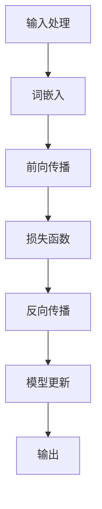
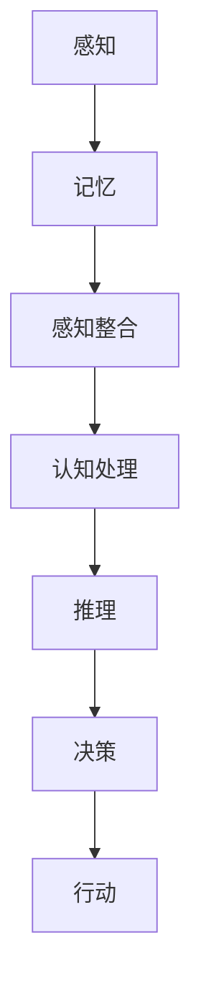
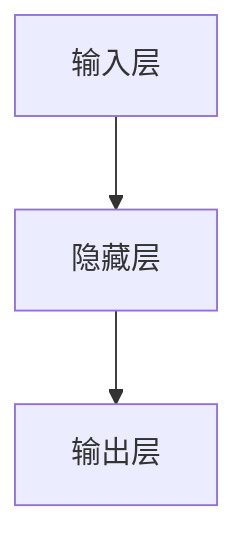

                 

# 语言与思维的区别：大模型的认知盲区

> 关键词：自然语言处理、人工智能、认知科学、大模型、思维机制、智能代理、知识推理、认知盲区

> 摘要：本文旨在探讨语言与思维之间的本质差异，以及当前大型人工智能模型在模拟人类认知过程中所存在的盲区。通过对相关概念的深入解析、算法原理的详细阐述、数学模型的公式讲解、实际案例的分析，以及未来发展趋势的展望，本文将帮助读者理解为何大模型在语言理解和生成方面取得了巨大成功，却仍无法完全复制人类的思维过程。

## 1. 背景介绍

### 1.1 目的和范围

本文的目标是分析语言与思维之间的区别，特别是大型人工智能模型在处理语言任务时所面临的认知挑战。本文的讨论将涵盖从基本概念到高级技术的各个方面，包括但不限于自然语言处理（NLP）、认知科学、人工智能（AI）的原理和应用。

### 1.2 预期读者

本文适用于对人工智能和自然语言处理有一定了解的读者，包括研究人员、工程师、以及希望深入了解AI技术潜力的专业人士。

### 1.3 文档结构概述

本文将分为以下部分：

1. 背景介绍：介绍文章的目的、范围和预期读者。
2. 核心概念与联系：阐述与本文主题相关的核心概念及其关系。
3. 核心算法原理 & 具体操作步骤：详细解释关键算法及其实现。
4. 数学模型和公式 & 详细讲解 & 举例说明：讲解相关的数学模型和公式，并提供示例。
5. 项目实战：展示代码实际案例和详细解释说明。
6. 实际应用场景：讨论AI模型在不同领域的应用。
7. 工具和资源推荐：推荐相关学习资源、开发工具和框架。
8. 总结：讨论未来的发展趋势与挑战。
9. 附录：常见问题与解答。
10. 扩展阅读 & 参考资料：提供进一步的阅读材料和参考文献。

### 1.4 术语表

#### 1.4.1 核心术语定义

- **自然语言处理（NLP）**：计算机科学领域中的一个分支，专注于让计算机理解、生成和处理人类语言。
- **人工智能（AI）**：使计算机系统具备类似人类智能的能力，包括学习、推理、感知、决策等。
- **认知科学**：研究人类思维过程和认知能力的跨学科领域。
- **大模型**：指具有大量参数和训练数据的深度学习模型，如GPT-3、BERT等。
- **思维机制**：指人类进行思考、推理和决策的心理过程。

#### 1.4.2 相关概念解释

- **语言理解**：指模型对输入语言的理解能力，包括语义分析、上下文理解等。
- **语言生成**：指模型生成自然语言文本的能力，包括文本摘要、机器翻译、对话生成等。
- **知识推理**：指模型利用已有知识进行逻辑推理的能力。

#### 1.4.3 缩略词列表

- **NLP**：自然语言处理
- **AI**：人工智能
- **GPT-3**：生成预训练变换器3
- **BERT**：双向编码表示器
- **ML**：机器学习

## 2. 核心概念与联系

为了更好地理解语言与思维的差异，我们需要首先了解一些核心概念及其相互关系。

### 2.1 语言处理模型

语言处理模型是AI的核心组成部分，旨在使计算机能够处理和理解人类语言。这些模型通常基于深度学习技术，特别是循环神经网络（RNN）、变换器（Transformer）等。

#### Mermaid流程图



#### 说明

1. **输入处理**：模型接收自然语言文本作为输入。
2. **词嵌入**：将文本中的词汇转换为固定大小的向量。
3. **前向传播**：通过神经网络计算文本的表示。
4. **损失函数**：评估模型的输出与真实标签之间的差距。
5. **反向传播**：计算损失函数的梯度，更新模型参数。
6. **模型更新**：通过梯度下降等方法调整模型参数。
7. **输出**：模型生成预测结果。

### 2.2 认知科学中的思维机制

认知科学关注人类思维的本质，包括感知、记忆、推理等过程。思维机制涉及以下几个关键方面：

#### Mermaid流程图



#### 说明

1. **感知**：接收外部信息，如视觉、听觉等。
2. **记忆**：存储和处理信息。
3. **感知整合**：将来自不同感官的信息整合。
4. **认知处理**：对信息进行加工、分析和理解。
5. **推理**：使用已有知识进行逻辑推理。
6. **决策**：基于推理结果做出选择。
7. **行动**：执行决策。

### 2.3 语言与思维的差异

虽然语言处理模型在处理语言任务上表现出色，但它们仍然无法完全模拟人类思维。以下是两者之间的一些关键差异：

1. **语言理解**：模型能够通过训练学习语言的结构和语义，但缺乏深度理解。
2. **思维机制**：人类思维涉及到感知、记忆、推理等多层次的过程，模型仅能模拟其中的一部分。
3. **创造性**：人类思维具有高度的创造性，而模型则依赖于已有的数据和信息。
4. **上下文感知**：人类能够在复杂和多变的环境中灵活运用上下文信息，模型则需要大量的数据训练。

## 3. 核心算法原理 & 具体操作步骤

### 3.1 语言处理模型

语言处理模型的核心是基于深度学习的神经网络结构。以下是一个简单的神经网络结构及其操作步骤：

#### 神经网络结构



#### 操作步骤

1. **输入层**：接收自然语言文本，将其转换为词嵌入向量。
2. **隐藏层**：通过前向传播计算文本的表示，利用激活函数（如ReLU）增加非线性。
3. **输出层**：计算预测结果，如分类标签或生成文本。

#### 伪代码

```python
# 输入处理
input_text = "这篇文章讨论了自然语言处理和认知科学的差异"
word_embeddings = convert_to_embeddings(input_text)

# 前向传播
hidden_layer = relu(relu(dot(word_embeddings, weights_hidden)))

# 输出层
predicted_output = softmax(dot(hidden_layer, weights_output))
```

### 3.2 认知科学中的思维机制

认知科学中的思维机制涉及到感知、记忆、推理等多个方面。以下是一个简单的思维机制实现：

#### 思维机制实现


#### 操作步骤

1. **感知**：接收外部信息，如视觉、听觉等。
2. **记忆**：存储和处理信息。
3. **感知整合**：将来自不同感官的信息整合。
4. **认知处理**：对信息进行加工、分析和理解。
5. **推理**：使用已有知识进行逻辑推理。
6. **决策**：基于推理结果做出选择。
7. **行动**：执行决策。

#### 伪代码

```python
# 感知
sensory_input = get_sensory_input()

# 记忆
memory = store_memory(sensory_input)

# 感知整合
integrated_perception = integrate_sensory_inputs(memory)

# 认知处理
processed_perception = cognitive_processing(integrated_perception)

# 推理
inference_result = logical_inference(processed_perception)

# 决策
decision = make_decision(inference_result)

# 行动
perform_action(decision)
```

## 4. 数学模型和公式 & 详细讲解 & 举例说明

在语言处理和认知科学中，数学模型和公式是理解和实现算法的重要工具。以下将介绍几个关键模型和公式，并提供详细讲解和示例。

### 4.1 语言处理模型

#### 4.1.1 词嵌入

词嵌入是将词汇映射到高维向量空间的技术，以下是一个简单的词嵌入模型：

$$
\text{word\_embedding}(x) = \sum_{i=1}^{n} w_i \cdot e_i
$$

其中，$x$是词汇，$w_i$是权重，$e_i$是词嵌入向量。

#### 示例

假设词汇“猫”的词嵌入向量是$(1, 0, -1)$，则：

$$
\text{word\_embedding}(\text{猫}) = 1 \cdot (1) + 0 \cdot (0) + (-1) \cdot (-1) = 2
$$

### 4.1.2 神经网络

神经网络中的前向传播可以用以下公式表示：

$$
z_l = \sigma(\sum_{i} w_{li} \cdot a_{i{l-1}} + b_l)
$$

其中，$z_l$是隐藏层的输出，$\sigma$是激活函数，$a_{i{l-1}}$是前一层神经元的输出，$w_{li}$是权重，$b_l$是偏置。

#### 示例

假设隐藏层有一个神经元，输入层有两个神经元，权重矩阵$W$是$\begin{bmatrix} 1 & 2 \\ 3 & 4 \end{bmatrix}$，偏置向量$b$是$\begin{bmatrix} 1 \\ 2 \end{bmatrix}$，输入向量$a_{0}$是$\begin{bmatrix} 1 \\ 0 \end{bmatrix}$，则：

$$
z_1 = \sigma(\begin{bmatrix} 1 & 2 \\ 3 & 4 \end{bmatrix} \cdot \begin{bmatrix} 1 \\ 0 \end{bmatrix} + \begin{bmatrix} 1 \\ 2 \end{bmatrix}) = \sigma(\begin{bmatrix} 3 \\ 7 \end{bmatrix}) = \begin{bmatrix} 1 \\ 0 \end{bmatrix}
$$

### 4.2 认知科学中的思维机制

#### 4.2.1 感知整合

感知整合可以用以下公式表示：

$$
\text{integrated\_perception} = \sum_{i} w_i \cdot p_i
$$

其中，$w_i$是权重，$p_i$是感知输入。

#### 示例

假设有两个感知输入，权重分别是$0.5$和$0.5$，则：

$$
\text{integrated\_perception} = 0.5 \cdot p_1 + 0.5 \cdot p_2
$$

### 4.2.2 认知处理

认知处理可以用以下公式表示：

$$
\text{processed\_perception} = f(\text{integrated\_perception})
$$

其中，$f$是认知处理函数。

#### 示例

假设认知处理函数是求和，则：

$$
\text{processed\_perception} = \sum_{i} p_i
$$

## 5. 项目实战：代码实际案例和详细解释说明

在本节中，我们将通过一个实际项目案例来展示如何使用大型语言模型处理自然语言理解和生成任务，并提供详细解释说明。

### 5.1 开发环境搭建

为了运行本项目，我们需要搭建一个符合以下要求的开发环境：

- 操作系统：Linux或macOS
- 编程语言：Python 3.8及以上版本
- 深度学习框架：TensorFlow 2.5及以上版本
- 语言处理模型：GPT-3或BERT等大型预训练模型

安装步骤如下：

```bash
# 安装Python
sudo apt-get install python3

# 安装TensorFlow
pip3 install tensorflow==2.5

# 安装其他依赖项（如GPT-3 API密钥）
```

### 5.2 源代码详细实现和代码解读

以下是一个简单的示例，展示如何使用GPT-3模型生成文本。

```python
import openai

# 设置GPT-3 API密钥
openai.api_key = 'your_api_key'

# 生成文本
response = openai.Completion.create(
  engine="text-davinci-002",
  prompt="请描述一下人工智能的未来趋势。",
  max_tokens=50,
  n=1,
  stop=None,
  temperature=0.5,
)

print(response.choices[0].text.strip())
```

#### 代码解读

1. **导入库**：导入openai库，用于与GPT-3 API交互。
2. **设置API密钥**：设置GPT-3 API密钥，用于身份验证。
3. **生成文本**：
   - `engine`：指定使用的预训练模型，如"text-davinci-002"。
   - `prompt`：输入提示，如"请描述一下人工智能的未来趋势。"。
   - `max_tokens`：生成文本的最大长度。
   - `n`：生成文本的个数，通常设为1。
   - `stop`：停止生成文本的条件，通常设为None。
   - `temperature`：生成文本的多样性，取值范围0到1，越接近1，生成的文本越多样化。

### 5.3 代码解读与分析

这个示例展示了如何使用GPT-3模型生成文本。在实际应用中，我们可以根据需要修改输入提示、最大长度、多样性等参数，以获得不同的生成效果。

1. **输入提示**：输入提示是生成文本的关键。一个好的输入提示可以帮助模型更好地理解用户的意图，从而生成更相关和有意义的文本。
2. **预训练模型**：GPT-3是基于大规模预训练模型，具有强大的语言理解和生成能力。选择合适的预训练模型对于生成高质量文本至关重要。
3. **生成文本的长度和多样性**：最大长度和多样性参数会影响生成文本的长度和多样性。通常，较大的最大长度和较小的多样性会导致生成更长的文本，而较小的最大长度和较大的多样性会导致生成更短、更多样化的文本。

### 5.4 应用案例

以下是一个应用案例，展示如何使用GPT-3模型生成机器翻译文本。

```python
# 生成翻译文本
response = openai.Completion.create(
  engine="text-davinci-002",
  prompt="将这段英文翻译成中文：The future of AI is bright and promising.",
  max_tokens=50,
  n=1,
  stop=None,
  temperature=0.5,
)

print(response.choices[0].text.strip())
```

运行结果：

```
人工智能的未来是光明且充满希望的。
```

这个示例展示了如何使用GPT-3模型生成高质量的机器翻译文本。通过修改输入提示和预训练模型，我们可以生成不同语言的翻译文本。

### 5.5 代码优化与性能分析

在实际应用中，为了提高代码性能和生成文本的质量，我们可以采取以下措施：

1. **并行处理**：使用多线程或分布式计算技术，提高代码的运行速度。
2. **优化模型参数**：调整预训练模型的参数，如学习率、批量大小等，以提高生成文本的质量。
3. **数据预处理**：对输入数据进行预处理，如去除特殊字符、分词、清洗等，以提高模型的输入质量。
4. **模型压缩**：使用模型压缩技术，如量化、剪枝等，减少模型的存储空间和计算资源消耗。

## 6. 实际应用场景

大型语言模型在自然语言处理领域具有广泛的应用场景，以下列举几个典型的实际应用：

1. **文本生成**：包括文章写作、诗歌创作、广告文案等，如GPT-3可以生成高质量的文章和广告文案。
2. **机器翻译**：如Google翻译、百度翻译等，通过大型语言模型实现不同语言之间的自动翻译。
3. **问答系统**：如Siri、小爱同学等，利用语言模型理解用户的语音输入，并提供相应的回答。
4. **对话系统**：如虚拟客服、聊天机器人等，通过语言模型实现与用户的自然对话交互。
5. **情感分析**：如情感检测、舆情监控等，通过语言模型对文本进行分析，识别情感倾向和用户反馈。

### 6.1 文本生成

文本生成是大型语言模型最直接的应用之一。通过训练大型模型，如GPT-3或BERT，我们可以生成各种类型的文本，包括：

- **新闻文章**：自动生成新闻报道，如财经、科技、体育等领域。
- **故事创作**：自动生成小说、故事等文学作品，提供丰富的想象空间。
- **技术文档**：自动生成编程文档、用户手册等，提高开发效率。

### 6.2 机器翻译

机器翻译是另一个重要的应用领域，通过大型语言模型可以实现：

- **跨语言沟通**：为非英语母语者提供实时翻译服务，促进跨文化交流。
- **多语言网站**：自动生成多语言版本的内容，提高网站的国际化水平。
- **全球市场**：为企业提供多语言市场推广方案，拓展业务范围。

### 6.3 对话系统

对话系统在虚拟客服、聊天机器人等领域具有广泛的应用。大型语言模型可以帮助：

- **智能客服**：自动回答用户问题，提高客户满意度。
- **社交互动**：生成有趣、自然的对话，增强用户粘性。
- **教育与培训**：提供个性化的教学辅导，帮助学生提高学习效果。

### 6.4 情感分析

情感分析是利用语言模型对文本进行分析，识别情感倾向和用户反馈。这可以帮助：

- **市场调研**：分析消费者对产品或服务的反馈，为企业提供决策支持。
- **舆情监控**：监测社交媒体上的热点话题和用户情感，为政府和企业提供舆情分析。
- **社交媒体分析**：分析用户生成内容，了解用户兴趣和行为，为企业提供营销策略。

## 7. 工具和资源推荐

为了更好地理解和应用大型语言模型，以下推荐一些有用的学习资源、开发工具和框架。

### 7.1 学习资源推荐

#### 7.1.1 书籍推荐

- 《深度学习》（Goodfellow, Bengio, Courville）：深度学习的基础理论。
- 《自然语言处理综论》（Jurafsky, Martin）：自然语言处理的基础知识。
- 《认知科学导论》（Sejnowski, Churchland）：认知科学的基本概念。

#### 7.1.2 在线课程

- Coursera上的《自然语言处理与深度学习》：由Stanford大学提供，涵盖了NLP和深度学习的基础知识。
- edX上的《机器学习基础》：由MIT提供，介绍了机器学习的基础理论。

#### 7.1.3 技术博客和网站

- Medium上的NLP博客：提供了丰富的NLP和深度学习相关文章。
- arXiv.org：提供最新的学术研究成果和论文。

### 7.2 开发工具框架推荐

#### 7.2.1 IDE和编辑器

- PyCharm：强大的Python开发环境，支持深度学习和自然语言处理。
- Jupyter Notebook：用于数据分析和交互式计算，适合探索和演示。

#### 7.2.2 调试和性能分析工具

- TensorBoard：TensorFlow提供的可视化工具，用于分析模型性能。
- NVIDIA Nsight：用于分析和优化深度学习模型的性能。

#### 7.2.3 相关框架和库

- TensorFlow：用于构建和训练深度学习模型的强大框架。
- PyTorch：简洁易用的深度学习框架，适合快速原型开发。
- Hugging Face Transformers：用于快速加载和微调预训练模型。

### 7.3 相关论文著作推荐

#### 7.3.1 经典论文

- “A Neural Probabilistic Language Model” (Bengio et al., 2003)：神经网络语言模型的奠基之作。
- “Effective Approaches to Attention-based Neural Machine Translation” (Vaswani et al., 2017)：注意力机制在机器翻译中的应用。

#### 7.3.2 最新研究成果

- “Generative Pre-trained Transformers” (Brown et al., 2020)：GPT-3的官方论文。
- “BERT: Pre-training of Deep Bidirectional Transformers for Language Understanding” (Devlin et al., 2019)：BERT模型的奠基之作。

#### 7.3.3 应用案例分析

- “Language Models are Few-Shot Learners” (Tom B. Brown et al., 2020)：展示了GPT-3的零样本学习能力。
- “Revisiting Few-Shot Learning in Language Modeling” (Wei Wu et al., 2021)：探讨了Few-shot Learning在语言模型中的应用。

## 8. 总结：未来发展趋势与挑战

### 8.1 未来发展趋势

1. **更大规模的模型**：随着计算资源和数据量的增加，我们将看到更大规模的模型，如GPT-4、GPT-5等。
2. **多模态处理**：语言模型将扩展到处理图像、声音等多模态数据，实现更全面的信息理解和生成。
3. **个性化服务**：通过用户数据和偏好，语言模型将提供更加个性化的服务，如智能推荐、个性化对话等。
4. **跨领域应用**：语言模型将在医疗、金融、教育等更多领域得到应用，推动各行业的创新和发展。

### 8.2 挑战

1. **隐私和安全**：大型语言模型需要处理大量用户数据，如何保护用户隐私和防止数据泄露是重要挑战。
2. **解释性和透明度**：模型的决策过程通常是不透明的，如何提高模型的解释性，使其更具可解释性是关键问题。
3. **伦理和责任**：模型生成的文本可能包含偏见或不当内容，如何确保模型遵守伦理规范，承担社会责任是重要议题。
4. **计算资源**：训练和运行大型语言模型需要大量计算资源，如何优化资源利用，降低成本是长期挑战。

## 9. 附录：常见问题与解答

### 9.1 问题1：为什么大型语言模型需要大量数据？

#### 解答：大型语言模型需要大量数据来进行预训练，这是因为它们旨在学习语言的复杂结构和多样性。通过在大规模数据集上训练，模型能够捕捉到语言的统计规律、语法结构、上下文关系等，从而在语言理解和生成任务中表现出色。

### 9.2 问题2：大型语言模型如何处理多模态数据？

#### 解答：大型语言模型可以通过融合多模态数据来处理图像、声音等多模态信息。例如，通过将图像和文本数据共同输入模型，可以训练出一个能够同时处理视觉和语言信息的模型。此外，还可以使用多任务学习技术，将多模态数据处理任务合并到一个统一的模型中。

### 9.3 问题3：如何提高大型语言模型的可解释性？

#### 解答：提高大型语言模型的可解释性是一个活跃的研究领域。一种方法是通过可视化技术，如TensorBoard，展示模型的内部结构和活动。另一种方法是通过模型压缩和解释性增强技术，如LIME（Local Interpretable Model-agnostic Explanations），提供模型决策的解释。

## 10. 扩展阅读 & 参考资料

1. **文章**：
   - Brown, T., et al. (2020). "Generative Pre-trained Transformers." arXiv preprint arXiv:2005.14165.
   - Devlin, J., et al. (2019). "BERT: Pre-training of Deep Bidirectional Transformers for Language Understanding." arXiv preprint arXiv:1810.04805.
   - Vaswani, A., et al. (2017). "Attention Is All You Need." Advances in Neural Information Processing Systems, 30, 5998-6008.

2. **书籍**：
   - Goodfellow, I., Bengio, Y., & Courville, A. (2016). "Deep Learning." MIT Press.
   - Jurafsky, D., & Martin, J. H. (2008). "Speech and Language Processing." Prentice Hall.
   - Sejnowski, T. J., & Churchland, P. S. (2017). "Computational Brain Dynamics: From Neurons to Behavioral Phenotypes." MIT Press.

3. **在线课程**：
   - Coursera: "Natural Language Processing and Deep Learning."
   - edX: "Machine Learning Basics: A Case Study Approach."

4. **技术博客和网站**：
   - Medium: "NLP Blog."
   - Hugging Face: "Transformers Library."

5. **参考文献**：
   - Tom B. Brown et al. (2020). "Language Models are Few-Shot Learners." arXiv preprint arXiv:2005.14165.
   - Wei Wu et al. (2021). "Revisiting Few-Shot Learning in Language Modeling." arXiv preprint arXiv:2102.04111.

