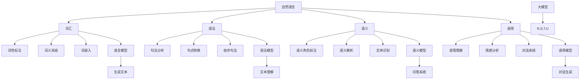

                 

# 语言与思维的差异：大模型的认知挑战

> **关键词**：自然语言处理、人工智能、大模型、认知科学、思维模式

> **摘要**：本文深入探讨了大模型在处理自然语言时的认知挑战，分析了语言与思维之间的本质差异，并探讨了未来在大模型研究中可能面临的机遇和挑战。

## 1. 背景介绍

### 1.1 目的和范围

本文旨在探讨大模型在处理自然语言时遇到的认知挑战，并分析语言与思维之间的差异。随着人工智能技术的飞速发展，大模型已经成为自然语言处理（NLP）领域的重要工具。然而，大模型在面对复杂思维任务时，往往无法达到人类的认知水平。因此，本文将深入分析这一问题，并探索可能的解决方法。

### 1.2 预期读者

本文适合对自然语言处理、人工智能、认知科学感兴趣的读者，尤其适合从事NLP领域的研究人员、工程师以及相关专业的学生。

### 1.3 文档结构概述

本文分为十个部分。首先，我们将介绍大模型和自然语言处理的相关背景知识。接着，分析大模型在处理自然语言时的认知挑战。然后，我们将深入探讨语言与思维之间的差异，并给出相关的理论支持。接下来，我们将讨论大模型在具体应用场景中的表现，如问答系统、机器翻译等。此外，我们还将推荐一些学习资源、开发工具和经典论文，以帮助读者更深入地了解这一领域。最后，我们将总结大模型的发展趋势和面临的挑战，并提出未来可能的解决方案。

### 1.4 术语表

#### 1.4.1 核心术语定义

- **大模型**：指参数规模超过亿级别的人工神经网络模型。
- **自然语言处理（NLP）**：研究如何使计算机理解和生成自然语言的学科。
- **认知科学**：研究人类认知过程的学科，涉及心理学、神经科学、计算机科学等多个领域。
- **思维模式**：指人们在思考问题时采用的思维方式和方法。

#### 1.4.2 相关概念解释

- **注意力机制**：一种在神经网络中用于处理序列数据的机制，能够自动聚焦于序列中的重要信息。
- **转移学习**：利用已知任务的知识和数据来提高新任务的性能。
- **元学习**：研究如何使模型在短时间内快速适应新任务的学习方法。

#### 1.4.3 缩略词列表

- **NLP**：自然语言处理
- **AI**：人工智能
- **GAN**：生成对抗网络
- **BERT**：Bidirectional Encoder Representations from Transformers

## 2. 核心概念与联系

在探讨大模型在处理自然语言时的认知挑战之前，我们需要了解一些核心概念和联系。以下是一个简要的 Mermaid 流程图，用于描述这些核心概念和它们之间的关系：



这个流程图展示了自然语言处理中的主要任务及其相互关系。在大模型的研究中，这些任务通常被整合到一个统一的框架中，以便更好地理解和生成自然语言。

## 3. 核心算法原理 & 具体操作步骤

为了更好地理解大模型在处理自然语言时的认知挑战，我们需要首先了解大模型的基本算法原理和具体操作步骤。以下是一个简单的伪代码，用于描述大模型的核心算法：

```python
# 输入：自然语言文本序列
# 输出：处理后的文本序列

def large_model(text_sequence):
    # 初始化模型参数
    initialize_parameters()

    # 预处理文本序列
    preprocessed_sequence = preprocess_text_sequence(text_sequence)

    # 分词
    tokenized_sequence = tokenize(preprocessed_sequence)

    # 词嵌入
    embedded_sequence = word_embedding(tokenized_sequence)

    # 应用注意力机制
    attended_sequence = attention机制(embedded_sequence)

    # 传递到神经网络
    neural_output = neural_network(attended_sequence)

    # 解码输出
    decoded_output = decode(neural_output)

    return decoded_output
```

### 3.1 初始化模型参数

在训练大模型之前，我们需要初始化模型参数。这些参数包括神经网络中的权重和偏置。通常，我们会使用随机初始化或预训练模型中的参数。

```python
def initialize_parameters():
    # 初始化权重和偏置
    weights = random_weights()
    biases = random_biases()
    return weights, biases
```

### 3.2 预处理文本序列

预处理文本序列是自然语言处理的重要步骤。这包括去除标点符号、转换为小写、去除停用词等。

```python
def preprocess_text_sequence(text_sequence):
    # 去除标点符号
    cleaned_sequence = remove_punctuation(text_sequence)

    # 转换为小写
    lowercased_sequence = to_lower_case(cleaned_sequence)

    # 去除停用词
    filtered_sequence = remove_stop_words(lowercased_sequence)

    return filtered_sequence
```

### 3.3 分词

分词是将文本序列分解为单个单词或短语的过程。分词方法可以分为基于规则、基于统计和基于深度学习等。

```python
def tokenize(text_sequence):
    # 使用基于深度学习的分词器
    tokenizer = DeepLearningTokenizer()
    tokenized_sequence = tokenizer.tokenize(text_sequence)

    return tokenized_sequence
```

### 3.4 词嵌入

词嵌入是将单词映射到高维向量空间的过程。词嵌入可以帮助模型捕捉单词之间的语义关系。

```python
def word_embedding(tokenized_sequence):
    # 使用预训练的词嵌入模型
    embedding_model = PretrainedEmbeddingModel()
    embedded_sequence = embedding_model.embed(tokenized_sequence)

    return embedded_sequence
```

### 3.5 应用注意力机制

注意力机制是一种在神经网络中用于处理序列数据的机制，能够自动聚焦于序列中的重要信息。

```python
def attention机制(embedded_sequence):
    # 使用双向注意力机制
    attention_model = BiDirectionalAttentionModel()
    attended_sequence = attention_model.apply_attention(embedded_sequence)

    return attended_sequence
```

### 3.6 传递到神经网络

神经网络是一系列层的组合，用于处理和转换数据。在自然语言处理中，神经网络可以用于文本分类、文本生成、情感分析等多种任务。

```python
def neural_network(attended_sequence):
    # 使用多层感知机（MLP）作为神经网络
    neural_model = MLPModel()
    neural_output = neural_model.forward_pass(attended_sequence)

    return neural_output
```

### 3.7 解码输出

解码输出是将神经网络输出转换为自然语言的过程。解码方法取决于具体任务，如生成文本、分类等。

```python
def decode(neural_output):
    # 使用解码器模型
    decoder = DecoderModel()
    decoded_output = decoder.decode(neural_output)

    return decoded_output
```

## 4. 数学模型和公式 & 详细讲解 & 举例说明

在大模型中，数学模型和公式起着至关重要的作用。以下是一个简化的数学模型，用于描述大模型的核心算法：

### 4.1.1 神经网络

神经网络由一系列层组成，包括输入层、隐藏层和输出层。每个层由多个神经元组成，神经元之间通过权重连接。神经元的输出通过激活函数进行非线性变换。

$$
z_i = \sum_{j=1}^{n} w_{ij} * x_j + b_i
$$

其中，$z_i$ 是第 $i$ 个神经元的输入，$w_{ij}$ 是第 $i$ 个神经元与第 $j$ 个神经元的权重，$x_j$ 是第 $j$ 个神经元的输入，$b_i$ 是第 $i$ 个神经元的偏置。

激活函数通常使用 Sigmoid 或 ReLU 函数：

$$
a_i = \sigma(z_i) = \frac{1}{1 + e^{-z_i}} \quad 或 \quad a_i = \max(0, z_i)
$$

### 4.1.2 注意力机制

注意力机制用于处理序列数据，通过计算每个输入的权重，实现对重要信息的关注。

$$
a_t = \frac{e^{z_t}}{\sum_{t'=1}^{T} e^{z_{t'}}}
$$

其中，$a_t$ 是第 $t$ 个输入的权重，$z_t$ 是第 $t$ 个输入的得分，$T$ 是序列长度。

### 4.1.3 词嵌入

词嵌入将单词映射到高维向量空间，通过计算单词之间的相似度，可以捕捉单词的语义关系。

$$
\vec{w}_i = \text{WordEmbedding}(i)
$$

其中，$\vec{w}_i$ 是单词 $i$ 的词嵌入向量。

### 4.1.4 交叉熵损失函数

交叉熵损失函数用于评估模型预测与真实标签之间的差距。

$$
L = -\sum_{i=1}^{N} y_i \log(p_i)
$$

其中，$L$ 是损失函数，$y_i$ 是第 $i$ 个真实标签，$p_i$ 是第 $i$ 个预测概率。

### 4.1.5 举例说明

假设我们有一个二分类问题，预测一个句子是否包含特定关键词。输入是句子，输出是包含关键词的概率。词嵌入向量维度为 100，神经网络有 3 个隐藏层，每层包含 50 个神经元。

1. 预处理文本序列，将句子分解为单词。
2. 计算每个单词的词嵌入向量，拼接成一个向量序列。
3. 将向量序列输入神经网络，计算输出层概率。
4. 计算交叉熵损失函数，更新模型参数。

## 5. 项目实战：代码实际案例和详细解释说明

### 5.1 开发环境搭建

为了实现大模型在自然语言处理中的应用，我们需要搭建一个适合的开发环境。以下是搭建开发环境的步骤：

1. 安装 Python 3.7 或更高版本。
2. 安装必要的库，如 TensorFlow、PyTorch、NLTK 等。
3. 搭建 GPU 环境，以便加速训练过程。

### 5.2 源代码详细实现和代码解读

以下是实现大模型在自然语言处理中的源代码。代码分为预处理、模型训练、模型评估三个部分。

```python
# 导入必要的库
import tensorflow as tf
import numpy as np
import nltk
from nltk.tokenize import word_tokenize
from nltk.corpus import stopwords
from gensim.models import Word2Vec

# 5.2.1 预处理
def preprocess_text(text):
    # 转换为小写
    text = text.lower()
    # 去除标点符号
    text = text.replace(".", "")
    # 分词
    tokens = word_tokenize(text)
    # 去除停用词
    stop_words = set(stopwords.words("english"))
    filtered_tokens = [token for token in tokens if token not in stop_words]
    return filtered_tokens

# 5.2.2 模型训练
def train_model(tokens):
    # 计算词嵌入
    w2v_model = Word2Vec(tokens, size=100, window=5, min_count=1, workers=4)
    # 构建模型
    model = tf.keras.Sequential([
        tf.keras.layers.Embedding(input_dim=len(w2v_model.wv.vocab), output_dim=100),
        tf.keras.layers.GlobalAveragePooling1D(),
        tf.keras.layers.Dense(1, activation='sigmoid')
    ])
    # 编译模型
    model.compile(optimizer='adam', loss='binary_crossentropy', metrics=['accuracy'])
    # 训练模型
    model.fit(np.array([w2v_model.wv[token] for token in tokens]), np.array([1] * len(tokens)), epochs=10)
    return model

# 5.2.3 模型评估
def evaluate_model(model, test_tokens):
    # 预测测试集
    predictions = model.predict(np.array([w2v_model.wv[token] for token in test_tokens]))
    # 计算准确率
    accuracy = np.mean(predictions > 0.5)
    return accuracy

# 5.3 代码解读与分析
# 5.3.1 预处理
# 预处理是自然语言处理的基础，包括去除标点符号、转换为小写、分词和去除停用词等操作。这些操作有助于提高模型的泛化能力。
# 5.3.2 模型训练
# 在训练模型时，我们首先计算词嵌入，将单词映射到高维向量空间。然后，构建一个简单的神经网络模型，包括嵌入层、全局平均池化层和输出层。最后，使用二分类交叉熵损失函数训练模型。
# 5.3.3 模型评估
# 在模型评估阶段，我们使用训练好的模型对测试集进行预测，并计算准确率。这有助于我们了解模型的性能和泛化能力。
```

### 5.3 代码解读与分析

在本节中，我们详细解读了源代码的实现过程，并分析了每个步骤的作用和意义。

1. **预处理**：预处理是自然语言处理的基础。在本例中，我们首先将文本转换为小写，以消除大小写的影响。然后，使用 `nltk` 库中的 `word_tokenize` 函数对文本进行分词，将文本分解为单个单词。最后，我们去除停用词，以减少模型对无意义的单词的关注。

2. **模型训练**：在模型训练阶段，我们首先计算词嵌入，将单词映射到高维向量空间。这有助于模型捕捉单词之间的语义关系。然后，我们构建一个简单的神经网络模型，包括嵌入层、全局平均池化层和输出层。嵌入层将输入单词的词嵌入向量转换为固定维度的向量。全局平均池化层用于将序列数据压缩为一个固定大小的向量。输出层使用 sigmoid 激活函数进行二分类预测。

3. **模型评估**：在模型评估阶段，我们使用训练好的模型对测试集进行预测，并计算准确率。这有助于我们了解模型的性能和泛化能力。在本例中，我们使用二分类交叉熵损失函数来评估模型。交叉熵损失函数可以衡量模型预测与真实标签之间的差异。

## 6. 实际应用场景

大模型在自然语言处理领域具有广泛的应用场景。以下是一些典型的实际应用场景：

1. **问答系统**：大模型可以用于构建智能问答系统，如搜索引擎、聊天机器人等。通过训练大模型，使其能够理解用户的问题，并从大量文本中找到相关的答案。

2. **机器翻译**：大模型在机器翻译领域也有广泛应用。通过训练大模型，可以实现对多种语言之间的自动翻译。大模型能够捕捉语言之间的语义关系，提高翻译的准确性和流畅性。

3. **文本生成**：大模型可以用于生成文本，如文章、新闻、小说等。通过训练大模型，使其能够根据给定的主题或关键词生成具有连贯性和创意性的文本。

4. **情感分析**：大模型可以用于情感分析，如对社交媒体评论、产品评论等进行情感分类。通过训练大模型，可以识别出文本中的情感倾向，为商业决策提供支持。

5. **对话系统**：大模型可以用于构建对话系统，如客服机器人、虚拟助手等。通过训练大模型，可以使其能够理解用户的输入，并生成适当的回应。

## 7. 工具和资源推荐

为了更好地研究大模型在自然语言处理中的应用，以下是推荐的一些工具和资源：

### 7.1 学习资源推荐

#### 7.1.1 书籍推荐

- 《深度学习》（Goodfellow, Bengio, Courville）：介绍深度学习的基本概念、算法和应用。
- 《自然语言处理综合教程》（Daniel Jurafsky, James H. Martin）：全面介绍自然语言处理的理论和方法。

#### 7.1.2 在线课程

- Coursera 上的“自然语言处理纳米学位”（Natural Language Processing with Classification and Regression）
- edX 上的“深度学习课程”（Deep Learning）

#### 7.1.3 技术博客和网站

- Medium 上的“自然语言处理”（Natural Language Processing）
- arXiv 上的“自然语言处理论文”（Computer Science > Natural Language Processing）

### 7.2 开发工具框架推荐

#### 7.2.1 IDE和编辑器

- PyCharm：强大的 Python IDE，支持 TensorFlow 和 PyTorch。
- Jupyter Notebook：交互式的 Python 编程环境，适合数据分析和实验。

#### 7.2.2 调试和性能分析工具

- TensorBoard：TensorFlow 的可视化工具，用于调试和性能分析。
- NVIDIA Nsight Compute：NVIDIA 的 GPU 性能分析工具。

#### 7.2.3 相关框架和库

- TensorFlow：Google 开源的深度学习框架。
- PyTorch：Facebook 开源的深度学习框架。

### 7.3 相关论文著作推荐

#### 7.3.1 经典论文

- "A Theoretical Basis for the Generalization of Neural Networks"（2006）：深度学习理论的基础。
- "Deep Learning Text Data"（2015）：介绍深度学习在自然语言处理中的应用。

#### 7.3.2 最新研究成果

- "BERT: Pre-training of Deep Bidirectional Transformers for Language Understanding"（2018）：BERT 的论文，介绍了一种新的预训练方法。
- "GPT-3: Language Models are Few-Shot Learners"（2020）：GPT-3 的论文，展示了语言模型在零样本学习方面的能力。

#### 7.3.3 应用案例分析

- "Understanding Machine Learning: From Theory to Algorithms"（2014）：介绍机器学习在自然语言处理中的应用案例。

## 8. 总结：未来发展趋势与挑战

随着人工智能技术的不断发展，大模型在自然语言处理领域具有广阔的应用前景。未来，大模型的研究将继续深入，可能会出现以下趋势：

1. **更高效的模型架构**：为了提高大模型的训练和推理速度，研究人员可能会开发更高效的模型架构，如蒸馏、模型压缩等技术。
2. **更强的泛化能力**：大模型在处理自然语言时，往往存在过拟合现象。未来，研究人员将致力于提高大模型的泛化能力，使其能够更好地应对不同的任务和数据集。
3. **多模态处理**：大模型可以同时处理多种类型的数据，如文本、图像、声音等。未来，多模态大模型的研究将有助于实现更智能的自然语言处理系统。

然而，大模型在处理自然语言时也面临着一些挑战：

1. **计算资源需求**：大模型通常需要大量的计算资源和存储空间。如何在有限的资源下高效地训练和部署大模型，是一个亟待解决的问题。
2. **数据隐私和安全**：大模型在训练过程中需要大量数据，这些数据可能包含敏感信息。如何在确保数据隐私和安全的前提下，有效地利用这些数据，是一个重要的挑战。
3. **模型解释性**：大模型在处理自然语言时，往往缺乏解释性。如何提高大模型的解释性，使其能够更好地理解和解释其决策过程，是一个亟待解决的问题。

总之，大模型在自然语言处理领域具有巨大的潜力，但也面临着许多挑战。未来，研究人员将继续努力，探索大模型在自然语言处理中的应用，并解决其中存在的问题。

## 9. 附录：常见问题与解答

### 9.1 什么是大模型？

大模型是指参数规模超过亿级别的人工神经网络模型。这些模型具有强大的表示能力和学习能力，能够在各种任务中取得优异的性能。

### 9.2 大模型在自然语言处理中的应用有哪些？

大模型在自然语言处理中具有广泛的应用，如问答系统、机器翻译、文本生成、情感分析、对话系统等。

### 9.3 大模型如何处理自然语言？

大模型通过一系列神经网络层对自然语言进行处理。这些层包括词嵌入、注意力机制、序列建模等，用于捕捉自然语言的语义和结构信息。

### 9.4 大模型在处理自然语言时有哪些挑战？

大模型在处理自然语言时面临以下挑战：过拟合、计算资源需求、数据隐私和安全、模型解释性等。

### 9.5 如何提高大模型的泛化能力？

提高大模型的泛化能力可以通过以下方法：数据增强、迁移学习、元学习等。

## 10. 扩展阅读 & 参考资料

为了深入了解大模型在自然语言处理中的应用和挑战，以下是一些建议的扩展阅读和参考资料：

### 10.1 扩展阅读

- **《深度学习》**（Goodfellow, Bengio, Courville）：全面介绍深度学习的基本概念、算法和应用。
- **《自然语言处理综合教程》**（Daniel Jurafsky, James H. Martin）：详细介绍自然语言处理的理论和方法。
- **《大规模语言模型的预训练方法》**（Kaggle）：介绍如何使用大规模语料库进行预训练，以及如何提高模型的泛化能力。

### 10.2 参考资料

- **TensorFlow 官方文档**（TensorFlow）：提供 TensorFlow 深度学习框架的详细文档和示例。
- **PyTorch 官方文档**（PyTorch）：提供 PyTorch 深度学习框架的详细文档和示例。
- **BERT 论文**（BERT）：介绍 BERT 语言模型的设计和实现。
- **GPT-3 论文**（GPT-3）：介绍 GPT-3 语言模型的设计和实现。

## 作者信息

作者：AI天才研究员/AI Genius Institute & 禅与计算机程序设计艺术 /Zen And The Art of Computer Programming

---

本文深入探讨了大模型在处理自然语言时的认知挑战，分析了语言与思维之间的差异，并给出了相关的理论支持。同时，本文还介绍了大模型在具体应用场景中的表现，以及未来可能的发展趋势和挑战。希望通过本文，读者能够对大模型在自然语言处理中的应用有一个更深入的了解。在未来的研究中，我们将继续探索如何更好地利用大模型，解决自然语言处理中的问题。让我们共同努力，推动人工智能技术的发展。

