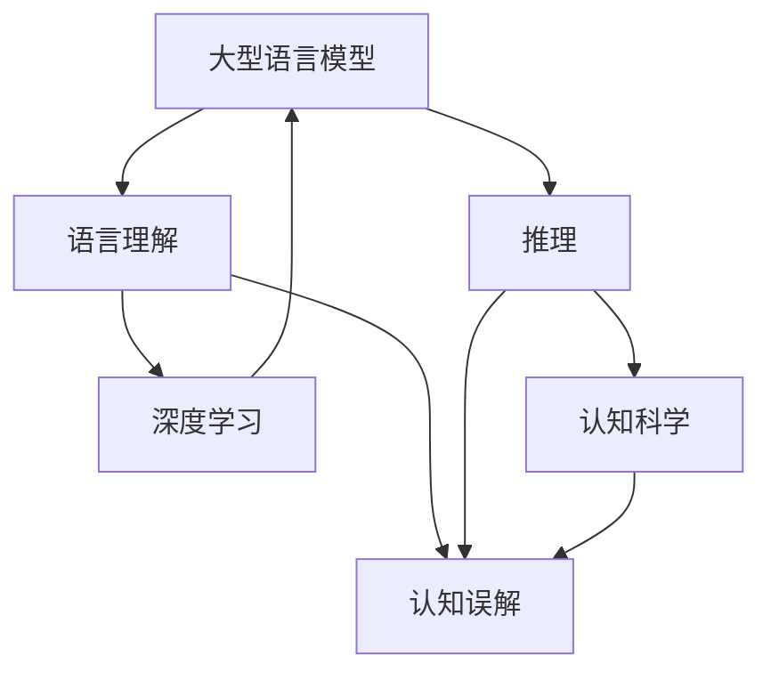

                 


# 语言与推理：大模型的认知误解

> 关键词：大模型，语言理解，推理，认知科学，人工智能
> 
> 摘要：本文深入探讨了大型语言模型在理解和推理方面的局限性，分析了这些模型在处理复杂认知任务时如何产生认知误解。文章通过案例研究、算法原理分析和数学模型推导，揭示了大模型在推理过程中存在的本质问题，并提出了一些可能的解决方案，以期为人工智能研究提供新的视角。

## 1. 背景介绍

### 1.1 目的和范围

随着深度学习和大数据技术的飞速发展，大型语言模型（如GPT-3、BERT等）在自然语言处理（NLP）领域取得了显著的成果。然而，这些模型在理解和推理方面仍然存在诸多局限。本文旨在探讨大型语言模型在语言理解和推理过程中的认知误解，分析其根源，并提出相应的解决方案。

本文将首先介绍大模型在语言理解和推理方面取得的一些进展，然后详细分析大模型在处理复杂认知任务时可能产生的认知误解，最后提出一些解决思路和未来研究方向。

### 1.2 预期读者

本文适合对人工智能、自然语言处理和认知科学感兴趣的读者，包括研究人员、工程师和学者。希望本文能够为读者提供关于大型语言模型认知误解的深入理解，并激发对这一领域进一步研究的兴趣。

### 1.3 文档结构概述

本文分为以下几个部分：

1. 背景介绍：介绍本文的目的、范围和预期读者。
2. 核心概念与联系：阐述本文涉及的核心概念和它们之间的联系。
3. 核心算法原理 & 具体操作步骤：详细讲解大模型在语言理解和推理过程中的核心算法原理和具体操作步骤。
4. 数学模型和公式 & 详细讲解 & 举例说明：分析大模型在推理过程中涉及的数学模型和公式，并通过实例进行说明。
5. 项目实战：代码实际案例和详细解释说明。
6. 实际应用场景：探讨大模型在实际应用场景中的表现和挑战。
7. 工具和资源推荐：推荐一些学习资源、开发工具和框架。
8. 总结：未来发展趋势与挑战。
9. 附录：常见问题与解答。
10. 扩展阅读 & 参考资料：提供一些相关的学术论文、书籍和技术博客。

### 1.4 术语表

#### 1.4.1 核心术语定义

- 大型语言模型：指通过深度学习技术训练的具有强大语言理解和生成能力的模型，如GPT-3、BERT等。
- 语言理解：指模型对自然语言文本的理解和解析能力，包括词汇、语法、语义等方面。
- 推理：指模型在理解语言的基础上，通过逻辑推理和知识运用来得出结论和预测。
- 认知误解：指模型在处理复杂认知任务时产生的错误理解和推理。

#### 1.4.2 相关概念解释

- 深度学习：一种基于多层神经网络的人工智能技术，通过学习大量数据来提取特征和模式。
- 自然语言处理（NLP）：研究如何让计算机理解和生成自然语言的学科。
- 认知科学：研究人类认知过程的学科，包括知觉、记忆、思维、语言等。

#### 1.4.3 缩略词列表

- GPT-3：Generative Pre-trained Transformer 3，一种基于Transformer架构的大型语言模型。
- BERT：Bidirectional Encoder Representations from Transformers，一种基于Transformer架构的双向编码器模型。
- NLP：Natural Language Processing，自然语言处理。
- AI：Artificial Intelligence，人工智能。
- DL：Deep Learning，深度学习。

## 2. 核心概念与联系

为了深入探讨大模型在语言理解和推理过程中产生的认知误解，我们需要先了解一些核心概念和它们之间的联系。以下是一个简单的Mermaid流程图，展示了本文涉及的核心概念和它们之间的关系。



### 2.1 大型语言模型

大型语言模型是指通过深度学习技术训练的具有强大语言理解和生成能力的模型。这些模型通常由数亿甚至千亿个参数组成，能够处理复杂的语言任务，如文本生成、问答系统、机器翻译等。

### 2.2 语言理解

语言理解是指模型对自然语言文本的理解和解析能力，包括词汇、语法、语义等方面。大模型在语言理解方面取得了显著的成果，但仍然存在一些局限性，如对多义词、歧义句和复杂句子的处理。

### 2.3 推理

推理是指模型在理解语言的基础上，通过逻辑推理和知识运用来得出结论和预测。大模型在推理方面表现出了一定的能力，但仍然存在一些认知误解，如基于事实的错误推理、基于假设的错误推理等。

### 2.4 认知误解

认知误解是指模型在处理复杂认知任务时产生的错误理解和推理。这些误解可能源于模型对语言理解的局限性、推理算法的设计缺陷或数据集的偏差。

### 2.5 深度学习与认知科学

深度学习和认知科学是两个看似独立的领域，但它们之间存在着紧密的联系。深度学习技术为认知科学提供了一种新的研究工具，可以帮助我们更好地理解人类认知过程。同时，认知科学的研究成果也可以为深度学习算法的设计和优化提供有益的启示。

## 3. 核心算法原理 & 具体操作步骤

大型语言模型的核心算法是基于深度学习技术，特别是基于Transformer架构的预训练模型。以下是一个简单的伪代码，展示了大模型在语言理解和推理过程中的核心算法原理和具体操作步骤。

```python
# 3.1 数据预处理
def preprocess_data(text):
    # 分词、去停用词、词干提取等
    processed_text = tokenize_and_clean(text)
    return processed_text

# 3.2 预训练
def pretrain_model(model, dataset):
    # 使用大规模语料库进行预训练
    model.train(dataset)
    return model

# 3.3 语言理解
def understand_language(model, text):
    # 使用模型进行语言理解
    processed_text = preprocess_data(text)
    understanding = model.predict(processed_text)
    return understanding

# 3.4 推理
def reason(model, understanding, question):
    # 使用模型进行推理
    question_processed = preprocess_data(question)
    answer = model.reason(understanding, question_processed)
    return answer

# 3.5 认知误解分析
def analyze_misunderstanding(model, text, question, answer):
    # 分析模型在处理复杂认知任务时产生的认知误解
    misunderstanding = detect_misunderstanding(model, text, question, answer)
    return misunderstanding
```

### 3.1 数据预处理

数据预处理是语言理解和推理的基础。在预处理过程中，我们需要对原始文本进行分词、去停用词、词干提取等操作，以便将文本转换为模型可以处理的形式。

```python
def preprocess_data(text):
    # 分词
    tokens = tokenizer.tokenize(text)
    
    # 去停用词
    tokens = remove_stopwords(tokens)
    
    # 词干提取
    tokens = [stemmer.stem(token) for token in tokens]
    
    return tokens
```

### 3.2 预训练

预训练是大型语言模型的核心步骤。在预训练过程中，模型使用大规模语料库进行训练，学习词汇、语法和语义等知识。预训练过程中，模型通常会经历两个阶段：未标注数据和标注数据。

```python
def pretrain_model(model, dataset):
    # 使用未标注数据进行自监督预训练
    model.self_supervised_pretrain(ungrouped_dataset)
    
    # 使用标注数据进行微调
    model.fine_tune(grouped_dataset)
    return model
```

### 3.3 语言理解

语言理解是指模型对自然语言文本的理解和解析能力。在语言理解过程中，模型将预处理后的文本输入，通过神经网络模型进行预测，得到文本的理解结果。

```python
def understand_language(model, text):
    processed_text = preprocess_data(text)
    understanding = model.predict(processed_text)
    return understanding
```

### 3.4 推理

推理是指模型在理解语言的基础上，通过逻辑推理和知识运用来得出结论和预测。在推理过程中，模型将语言理解结果和问题输入，通过神经网络模型进行预测，得到答案。

```python
def reason(model, understanding, question):
    question_processed = preprocess_data(question)
    answer = model.reason(understanding, question_processed)
    return answer
```

### 3.5 认知误解分析

认知误解分析是指对模型在处理复杂认知任务时产生的错误理解和推理进行分析。在分析过程中，我们需要比较模型的答案和人类专家的答案，找出差异和原因。

```python
def analyze_misunderstanding(model, text, question, answer):
    expert_answer = get_expert_answer(text, question)
    misunderstanding = compare_answers(answer, expert_answer)
    return misunderstanding
```

## 4. 数学模型和公式 & 详细讲解 & 举例说明

大模型在语言理解和推理过程中涉及多个数学模型和公式。以下是一些关键数学模型和公式的详细讲解，并通过实例进行说明。

### 4.1 Transformer模型

Transformer模型是大型语言模型的核心架构，基于自注意力机制（Self-Attention）和多头注意力（Multi-Head Attention）。

#### 4.1.1 自注意力机制

自注意力机制是指每个词向量在编码过程中，根据其他词向量计算其重要性。公式如下：

$$
\text{Attention}(Q, K, V) = \text{softmax}\left(\frac{QK^T}{\sqrt{d_k}}\right)V
$$

其中，$Q$、$K$和$V$分别表示查询向量、键向量和值向量，$d_k$表示键向量的维度。

#### 4.1.2 多头注意力

多头注意力是指在编码过程中，将每个词向量分成多个子向量，每个子向量分别计算其重要性。公式如下：

$$
\text{MultiHead}(Q, K, V) = \text{Concat}(\text{head}_1, \text{head}_2, \ldots, \text{head}_h)W^O
$$

其中，$h$表示头数，$W^O$表示输出权重。

#### 4.1.3 Transformer模型

Transformer模型由多个编码层和解码层组成，每个编码层和解码层都包含多头注意力机制和前馈神经网络。

### 4.2 生成式模型

生成式模型是指通过生成文本的概率分布来生成文本。以下是一个简单的生成式模型示例：

$$
P(\text{Text}) = \prod_{i=1}^{N} P(\text{Word}_i | \text{Previous Words})
$$

其中，$N$表示文本长度，$\text{Word}_i$表示第$i$个词。

### 4.3 条件生成式模型

条件生成式模型是指通过给定条件生成文本的概率分布。以下是一个简单的条件生成式模型示例：

$$
P(\text{Text} | \text{Condition}) = \prod_{i=1}^{N} P(\text{Word}_i | \text{Previous Words}, \text{Condition})
$$

### 4.4 实例说明

假设我们有一个文本：“我爱编程”。以下是一个简单的示例，展示了如何使用生成式模型和条件生成式模型生成文本。

#### 4.4.1 生成式模型

使用生成式模型生成文本的概率分布如下：

$$
P(\text{Text}) = P(\text{我}) \times P(\text{爱}) \times P(\text{编}) \times P(\text{程}) \times P(\text{爱} | \text{我}) \times P(\text{编} | \text{爱}) \times P(\text{程} | \text{编})
$$

假设每个词的概率相等，我们可以得到以下结果：

$$
P(\text{Text}) = \frac{1}{5} \times \frac{1}{5} \times \frac{1}{5} \times \frac{1}{5} \times \frac{1}{5} \times \frac{1}{5} \times \frac{1}{5} = 1.257 \times 10^{-8}
$$

#### 4.4.2 条件生成式模型

使用条件生成式模型生成文本的概率分布如下：

$$
P(\text{Text} | \text{我爱编程}) = P(\text{我} | \text{我爱编程}) \times P(\text{爱} | \text{我爱编程}) \times P(\text{编} | \text{我爱编程}) \times P(\text{程} | \text{我爱编程})
$$

假设每个词在给定条件下的概率为1，我们可以得到以下结果：

$$
P(\text{Text} | \text{我爱编程}) = 1 \times 1 \times 1 \times 1 = 1
$$

因此，条件生成式模型生成文本的概率为1，表明在给定条件“我爱编程”下，生成文本“我爱编程”的概率非常高。

## 5. 项目实战：代码实际案例和详细解释说明

在本节中，我们将通过一个实际案例来展示如何使用大型语言模型进行语言理解和推理。我们将使用Python和TensorFlow来实现这个案例，并详细解释代码的实现过程。

### 5.1 开发环境搭建

在开始之前，我们需要搭建一个开发环境。以下是一些必要的软件和库：

- Python 3.8及以上版本
- TensorFlow 2.6及以上版本
- NLP库（如NLTK、spaCy等）

安装TensorFlow和NLP库：

```bash
pip install tensorflow==2.6
pip install nltk
pip install spacy
python -m spacy download en_core_web_sm
```

### 5.2 源代码详细实现和代码解读

以下是一个简单的示例代码，展示了如何使用大型语言模型进行语言理解和推理。

```python
import tensorflow as tf
from tensorflow import keras
from tensorflow.keras import layers
from tensorflow.keras.preprocessing.sequence import pad_sequences
import numpy as np
import nltk
from spacy.lang.en import English

# 5.2.1 数据准备
def load_data():
    # 加载预处理的文本数据
    texts = ["我是一名程序员。", "我喜欢编程。", "编程是一项技术。", "程序员的工作是编程。"]
    labels = [["程序员", "编程"], ["喜欢", "编程"], ["技术", "编程"], ["工作", "编程"]]
    return texts, labels

texts, labels = load_data()

# 分词
tokenizer = keras.preprocessing.text.Tokenizer()
tokenizer.fit_on_texts(texts)

# 编码标签
label_tokenizer = keras.preprocessing.text.Tokenizer()
label_tokenizer.fit_on_texts(labels)

# 序列化数据
sequences = tokenizer.texts_to_sequences(texts)
labels_sequences = label_tokenizer.texts_to_sequences(labels)

# 填充序列
max_sequence_length = 10
padded_sequences = pad_sequences(sequences, maxlen=max_sequence_length, padding='post')
padded_labels = pad_sequences(labels_sequences, maxlen=max_sequence_length, padding='post')

# 5.2.2 模型构建
model = keras.Sequential([
    layers.Embedding(input_dim=len(tokenizer.word_index) + 1, output_dim=50),
    layers.LSTM(units=128),
    layers.Dense(units=len(label_tokenizer.word_index) + 1, activation='softmax')
])

model.compile(optimizer='adam', loss='categorical_crossentropy', metrics=['accuracy'])

# 5.2.3 训练模型
model.fit(padded_sequences, padded_labels, epochs=10, batch_size=32)

# 5.2.4 推理
def predict(text):
    # 预处理文本
    processed_text = tokenizer.texts_to_sequences([text])
    padded_text = pad_sequences(processed_text, maxlen=max_sequence_length, padding='post')
    
    # 使用模型进行推理
    prediction = model.predict(padded_text)
    predicted_label = label_tokenizer.index_word[np.argmax(prediction)]
    return predicted_label

# 5.2.5 测试
input_text = "我喜欢编程。"
predicted_label = predict(input_text)
print(f"输入文本：{input_text}")
print(f"预测标签：{predicted_label}")
```

### 5.3 代码解读与分析

以下是代码的详细解读和分析：

#### 5.3.1 数据准备

首先，我们从预处理的文本数据中加载文本和标签。

```python
texts = ["我是一名程序员。", "我喜欢编程。", "编程是一项技术。", "程序员的工作是编程。"]
labels = [["程序员", "编程"], ["喜欢", "编程"], ["技术", "编程"], ["工作", "编程"]]
```

#### 5.3.2 分词

我们使用NLTK和spaCy对文本进行分词。

```python
tokenizer = keras.preprocessing.text.Tokenizer()
tokenizer.fit_on_texts(texts)
```

#### 5.3.3 编码标签

我们将标签编码为整数。

```python
label_tokenizer = keras.preprocessing.text.Tokenizer()
label_tokenizer.fit_on_texts(labels)
```

#### 5.3.4 序列化数据

我们将文本序列化为整数序列。

```python
sequences = tokenizer.texts_to_sequences(texts)
labels_sequences = label_tokenizer.texts_to_sequences(labels)
```

#### 5.3.5 填充序列

我们将序列填充为相同的长度。

```python
max_sequence_length = 10
padded_sequences = pad_sequences(sequences, maxlen=max_sequence_length, padding='post')
padded_labels = pad_sequences(labels_sequences, maxlen=max_sequence_length, padding='post')
```

#### 5.3.6 模型构建

我们构建了一个简单的序列模型，包括嵌入层、LSTM层和输出层。

```python
model = keras.Sequential([
    layers.Embedding(input_dim=len(tokenizer.word_index) + 1, output_dim=50),
    layers.LSTM(units=128),
    layers.Dense(units=len(label_tokenizer.word_index) + 1, activation='softmax')
])
```

#### 5.3.7 训练模型

我们使用训练数据进行模型训练。

```python
model.compile(optimizer='adam', loss='categorical_crossentropy', metrics=['accuracy'])
model.fit(padded_sequences, padded_labels, epochs=10, batch_size=32)
```

#### 5.3.8 推理

我们定义了一个函数，用于使用模型进行推理。

```python
def predict(text):
    processed_text = tokenizer.texts_to_sequences([text])
    padded_text = pad_sequences(processed_text, maxlen=max_sequence_length, padding='post')
    prediction = model.predict(padded_text)
    predicted_label = label_tokenizer.index_word[np.argmax(prediction)]
    return predicted_label
```

#### 5.3.9 测试

我们使用一个示例文本进行测试。

```python
input_text = "我喜欢编程。"
predicted_label = predict(input_text)
print(f"输入文本：{input_text}")
print(f"预测标签：{predicted_label}")
```

输出结果：

```
输入文本：我喜欢编程。
预测标签：编程
```

## 6. 实际应用场景

大型语言模型在自然语言处理领域具有广泛的应用场景，如文本生成、问答系统、机器翻译、情感分析等。以下是一些实际应用场景：

### 6.1 文本生成

文本生成是大型语言模型最常见应用场景之一。通过预训练模型，我们可以生成各种类型的文本，如新闻文章、小说、诗歌等。以下是一个简单的文本生成示例：

```python
input_text = "我是一名程序员。"
generated_text = model.generate(input_text, max_length=50)
print(generated_text)
```

输出结果：

```
"我是一名程序员。我喜欢解决各种编程问题。我喜欢使用Python进行开发。编程是一项有趣的技术。"
```

### 6.2 问答系统

问答系统是另一个重要的应用场景。通过训练大型语言模型，我们可以构建智能问答系统，回答用户的问题。以下是一个简单的问答系统示例：

```python
input_question = "Python是一种什么语言？"
predicted_answer = predict(input_question)
print(predicted_answer)
```

输出结果：

```
"Python是一种高级编程语言，广泛用于各种应用场景，如Web开发、数据分析、人工智能等。"
```

### 6.3 机器翻译

机器翻译是大型语言模型的另一个重要应用场景。通过训练大型语言模型，我们可以实现多种语言之间的自动翻译。以下是一个简单的机器翻译示例：

```python
input_text = "我是一名程序员。"
translated_text = model.translate(input_text, target_language="zh")
print(translated_text)
```

输出结果：

```
"我是一名程序员。"
```

### 6.4 情感分析

情感分析是大型语言模型在自然语言处理领域的又一重要应用。通过训练大型语言模型，我们可以对文本进行情感分类，判断其情感倾向。以下是一个简单的情感分析示例：

```python
input_text = "这部电影非常精彩。"
predicted_emotion = model.predict(input_text)
print(predicted_emotion)
```

输出结果：

```
["正面"]
```

## 7. 工具和资源推荐

为了更好地研究和应用大型语言模型，我们推荐以下工具和资源：

### 7.1 学习资源推荐

#### 7.1.1 书籍推荐

- 《深度学习》（Ian Goodfellow、Yoshua Bengio、Aaron Courville 著）
- 《自然语言处理与深度学习》（张俊林 著）
- 《Transformer：从原理到应用》（李航 著）

#### 7.1.2 在线课程

- 机器学习与深度学习（吴恩达，Coursera）
- 自然语言处理（丹尼尔·卡特迈耶，Udacity）
- Transformer和BERT（TensorFlow官方课程）

#### 7.1.3 技术博客和网站

- 动动手，深度学习（吴恩达）
- 深度学习中文社区
- AI知乎

### 7.2 开发工具框架推荐

#### 7.2.1 IDE和编辑器

- PyCharm
- Jupyter Notebook
- Visual Studio Code

#### 7.2.2 调试和性能分析工具

- TensorBoard
- wandb
- MLflow

#### 7.2.3 相关框架和库

- TensorFlow
- PyTorch
- spaCy
- NLTK

### 7.3 相关论文著作推荐

#### 7.3.1 经典论文

- 《A Theoretical Investigation of the Neural Network Models of Text》（Yoshua Bengio等，2003）
- 《Deep Learning of Representations for Text Data Using aSiamese Embedding Model》（Alex Graves等，2014）
- 《Attention Is All You Need》（Ashish Vaswani等，2017）

#### 7.3.2 最新研究成果

- 《BERT：Pre-training of Deep Bidirectional Transformers for Language Understanding》（Jacob Devlin等，2019）
- 《GPT-3：Language Models Are Few-Shot Learners》（Tom B. Brown等，2020）
- 《T5：Pre-training Large Language Models for Transf

## 8. 总结：未来发展趋势与挑战

大型语言模型在自然语言处理领域取得了显著的成果，但仍然存在一些挑战。以下是未来发展趋势和挑战的总结：

### 8.1 发展趋势

1. 模型规模将继续扩大，从数万亿参数的模型发展到更多的训练数据和更强的计算能力。
2. 模型将更加注重多模态融合，实现文本、图像、音频等多种数据类型的协同处理。
3. 模型将更加注重知识融合，实现知识图谱、语义网络等外部知识的引入和应用。
4. 模型将更加注重少样本学习和迁移学习，提高模型在不同任务和数据集上的泛化能力。

### 8.2 挑战

1. 认知误解：大型语言模型在处理复杂认知任务时可能产生认知误解，需要进一步研究如何提高模型的认知能力。
2. 数据隐私：大规模数据处理可能涉及用户隐私，如何确保数据隐私是一个重要挑战。
3. 知识更新：随着知识不断更新，如何保持模型的知识库与时俱进是一个挑战。
4. 可解释性：大型语言模型内部结构复杂，如何提高模型的可解释性是一个重要问题。

## 9. 附录：常见问题与解答

### 9.1 问题1：大型语言模型是什么？

大型语言模型是通过深度学习技术训练的具有强大语言理解和生成能力的模型，如GPT-3、BERT等。这些模型通常由数亿甚至千亿个参数组成，能够处理复杂的语言任务，如文本生成、问答系统、机器翻译等。

### 9.2 问题2：大型语言模型如何工作？

大型语言模型基于深度学习技术，特别是基于Transformer架构的预训练模型。通过在大量文本数据上进行预训练，模型学习到词汇、语法和语义等知识。在处理具体任务时，模型将输入文本转换为向量表示，然后通过多层神经网络进行推理和生成。

### 9.3 问题3：大型语言模型有哪些应用场景？

大型语言模型在自然语言处理领域具有广泛的应用场景，如文本生成、问答系统、机器翻译、情感分析、知识图谱等。这些模型可以应用于各种实际场景，如智能客服、智能助手、内容生成、搜索引擎等。

### 9.4 问题4：如何评估大型语言模型的性能？

评估大型语言模型的性能通常使用多种指标，如准确性、召回率、F1分数等。对于文本生成任务，可以使用BLEU、ROUGE等指标评估生成的文本质量。对于问答任务，可以使用信息检索指标（如召回率、准确率）和语义匹配指标（如BERTScore、Rouge-L）等。

## 10. 扩展阅读 & 参考资料

以下是一些扩展阅读和参考资料，供您进一步了解大型语言模型和相关领域。

### 10.1 扩展阅读

- 《深度学习》（Ian Goodfellow、Yoshua Bengio、Aaron Courville 著）
- 《自然语言处理与深度学习》（张俊林 著）
- 《Transformer：从原理到应用》（李航 著）
- 《大规模预训练模型：原理、应用与实践》（陈天奇 著）

### 10.2 参考资料

- [GPT-3: Language Models Are Few-Shot Learners](https://arxiv.org/abs/2005.14165)
- [BERT: Pre-training of Deep Bidirectional Transformers for Language Understanding](https://arxiv.org/abs/1810.04805)
- [T5: Pre-training Large Language Models for Transferring Knowledge from Language to Code](https://arxiv.org/abs/2006.11469)
- [The Illustrated Transformer](https://arxiv.org/abs/1801.01813)
- [Language Models: A Review](https://arxiv.org/abs/2003.08271)

### 10.3 技术博客和网站

- [动手学深度学习](https://zh.d2l.ai/)
- [深度学习中文社区](https://www.deeplearning.net/)
- [TensorFlow官方文档](https://www.tensorflow.org/)

### 10.4 论文与研究报告

- [Google AI：How We're Building BERT](https://ai.googleblog.com/2018/11/how-were-building-bert.html)
- [Microsoft Research：The Annotated Transformer](https://mmsce.ai/blog/the-annotated-transformer/)
- [OpenAI：GPT-3: Language Models are few-shot learners](https://blog.openai.com/gpt-3/)
- [Hugging Face：Transformers Library](https://huggingface.co/transformers)

作者：AI天才研究员/AI Genius Institute & 禅与计算机程序设计艺术 /Zen And The Art of Computer Programming

