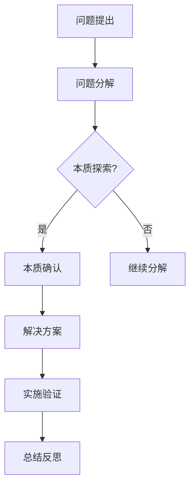

                 

# 费曼提问：唤醒管理者主动思考

## 关键词
- 费曼提问法
- 管理者思维
- 问题解决
- 创新思维
- 软件工程

> 摘要：本文旨在探讨如何运用费曼提问法唤醒管理者主动思考，提升其问题解决和创新能力。通过分析费曼提问法的基本原理和应用场景，结合软件工程的实际案例，本文将引导读者深入理解并实践这一方法，以激发管理者在技术和管理领域的创新思维。

## 1. 背景介绍

### 1.1 目的和范围

本文的目标是介绍一种能够有效提升管理者思考能力的工具——费曼提问法。我们将探讨这种方法的基本原理，并展示其在软件工程领域的应用。通过阅读本文，读者将了解如何将费曼提问法融入到日常工作中，从而提高团队解决问题的效率和创新能力。

### 1.2 预期读者

本文面向企业管理者、项目经理、软件开发人员以及任何希望在技术和业务领域提升自身思考能力的人士。无论您是经验丰富的高层管理者，还是刚刚进入职场的新人，本文都将为您提供实用的方法和技巧。

### 1.3 文档结构概述

本文分为十个部分，首先介绍费曼提问法的基本概念，然后逐步深入探讨其在管理中的应用。具体结构如下：

1. **背景介绍**：介绍本文的目的和预期读者，概述文档结构。
2. **核心概念与联系**：解释费曼提问法的原理和核心概念，提供流程图展示其应用。
3. **核心算法原理 & 具体操作步骤**：详细阐述费曼提问法的操作步骤。
4. **数学模型和公式 & 详细讲解 & 举例说明**：使用数学公式和实例说明费曼提问法的应用。
5. **项目实战：代码实际案例和详细解释说明**：通过具体案例展示费曼提问法的实践过程。
6. **实际应用场景**：探讨费曼提问法在不同场景中的应用。
7. **工具和资源推荐**：推荐学习资源和开发工具。
8. **总结：未来发展趋势与挑战**：总结费曼提问法的发展趋势和面临挑战。
9. **附录：常见问题与解答**：回答读者可能遇到的问题。
10. **扩展阅读 & 参考资料**：提供进一步学习的资源。

### 1.4 术语表

#### 1.4.1 核心术语定义

- **费曼提问法**：一种基于问题驱动的思考方法，通过逐步拆解复杂问题，找到本质，从而提高解决问题的效率。
- **管理者**：在组织或团队中负责决策和指导的人员。
- **问题解决**：识别问题、分析问题、提出解决方案并实施的过程。

#### 1.4.2 相关概念解释

- **问题驱动**：以问题为导向，不断提出问题、解决问题，从而推动工作和创新。
- **创新思维**：跳出传统思维模式，从不同角度思考问题，提出新颖的解决方案。

#### 1.4.3 缩略词列表

- **FEAST**：费曼提问法的缩写，代表“问题分解、本质探索、思考训练、应用拓展、思考深化”。

## 2. 核心概念与联系

### 2.1 费曼提问法的原理

费曼提问法是一种基于问题驱动的思考方法，其核心原理是“以问题为导向，不断拆解复杂问题，找到本质，从而提高解决问题的效率”。该方法源于物理学家理查德·费曼（Richard Feynman）的讲课风格，他通过简单、直观的方式解释复杂概念，使学生们能够深入理解。

### 2.2 费曼提问法的核心概念

费曼提问法包含以下核心概念：

1. **问题分解**：将复杂问题分解为若干个简单问题，逐步找到问题的本质。
2. **本质探索**：通过不断提问，深入挖掘问题的本质，找到问题的核心。
3. **思考训练**：通过费曼提问法，培养管理者的问题解决能力和创新思维。
4. **应用拓展**：将费曼提问法应用于实际工作，提高团队解决问题的效率和创新能力。
5. **思考深化**：通过不断实践和反思，深化对问题的理解和解决能力。

### 2.3 费曼提问法的流程图



## 3. 核心算法原理 & 具体操作步骤

### 3.1 费曼提问法的算法原理

费曼提问法是一种基于问题驱动的思考方法，其核心算法原理是通过不断拆解复杂问题，找到问题的本质，从而提高解决问题的效率。具体算法步骤如下：

1. **问题提出**：明确要解决的问题。
2. **问题分解**：将复杂问题分解为若干个简单问题。
3. **本质探索**：通过提问，深入挖掘问题的本质。
4. **解决方案**：根据问题的本质，提出解决方案。
5. **实施验证**：实施解决方案，验证其有效性。
6. **总结反思**：总结经验，不断改进问题解决能力。

### 3.2 费曼提问法的具体操作步骤

1. **问题提出**：明确要解决的问题。

    - **输入**：一个复杂问题。
    - **输出**：明确的问题。

2. **问题分解**：将复杂问题分解为若干个简单问题。

    - **输入**：一个复杂问题。
    - **输出**：若干个简单问题。

3. **本质探索**：通过提问，深入挖掘问题的本质。

    - **输入**：简单问题。
    - **输出**：问题的本质。

4. **解决方案**：根据问题的本质，提出解决方案。

    - **输入**：问题的本质。
    - **输出**：解决方案。

5. **实施验证**：实施解决方案，验证其有效性。

    - **输入**：解决方案。
    - **输出**：验证结果。

6. **总结反思**：总结经验，不断改进问题解决能力。

    - **输入**：验证结果。
    - **输出**：改进方案。

## 4. 数学模型和公式 & 详细讲解 & 举例说明

### 4.1 数学模型和公式

费曼提问法虽然没有复杂的数学模型，但其思考过程可以用以下公式表示：

\[ \text{问题解决} = \text{问题提出} \times \text{问题分解} \times \text{本质探索} \times \text{解决方案} \times \text{实施验证} \times \text{总结反思} \]

### 4.2 详细讲解

这个公式表示了问题解决的过程，即通过问题提出、问题分解、本质探索、解决方案、实施验证和总结反思六个步骤来实现问题解决。每个步骤都是问题解决过程中不可或缺的部分，相互关联，共同作用。

1. **问题提出**：明确要解决的问题。
2. **问题分解**：将复杂问题分解为若干个简单问题。
3. **本质探索**：通过提问，深入挖掘问题的本质。
4. **解决方案**：根据问题的本质，提出解决方案。
5. **实施验证**：实施解决方案，验证其有效性。
6. **总结反思**：总结经验，不断改进问题解决能力。

### 4.3 举例说明

假设一个团队遇到了一个复杂的问题：“如何提高产品的市场占有率？”我们可以使用费曼提问法来解决这个问题。

1. **问题提出**：明确要解决的问题——“如何提高产品的市场占有率？”。
2. **问题分解**：将这个问题分解为若干个简单问题，例如：
    - 目前的市场份额是多少？
    - 目标市场占有率是多少？
    - 顾客对我们的产品有哪些评价？
    - 竞争对手的市场占有率是多少？
    - 我们的产品与竞争对手的产品有哪些差异？
3. **本质探索**：通过提问，深入挖掘每个问题的本质，例如：
    - 市场份额低的原因是什么？
    - 目标市场占有率高的原因是什么？
    - 顾客对我们的产品不满意的原因是什么？
    - 竞争对手的优势是什么？
    - 我们的产品与竞争对手的差异点如何体现？
4. **解决方案**：根据问题的本质，提出解决方案，例如：
    - 提升产品品质，满足顾客需求。
    - 加强市场推广，提高品牌知名度。
    - 增加产品差异化，突出竞争优势。
5. **实施验证**：实施解决方案，验证其有效性，例如：
    - 调查顾客满意度，评估产品品质的提升效果。
    - 观察市场推广活动的效果，评估品牌知名度的提升情况。
    - 进行市场调研，了解竞争对手的产品差异点，评估自身的差异化策略。
6. **总结反思**：总结经验，不断改进问题解决能力，例如：
    - 分析实施验证的结果，总结成功经验和教训。
    - 根据结果调整策略，为下一轮问题解决提供参考。

通过这个例子，我们可以看到费曼提问法如何帮助团队逐步解决复杂问题，提高问题解决能力。

## 5. 项目实战：代码实际案例和详细解释说明

### 5.1 开发环境搭建

在本节中，我们将以一个实际的软件开发项目为例，展示如何使用费曼提问法来指导项目开发。首先，我们需要搭建一个简单的开发环境。

1. **选择编程语言**：本案例中，我们选择Python作为编程语言，因为它具有简洁易懂、功能强大的特点，非常适合初学者和专业人士。
2. **安装Python**：从官方网站（https://www.python.org/）下载并安装Python，安装过程中确保将Python添加到系统环境变量中。
3. **安装代码编辑器**：我们选择Visual Studio Code（VS Code）作为代码编辑器，因为它具有丰富的插件和功能，可以提供良好的开发体验。从官方网站（https://code.visualstudio.com/）下载并安装VS Code。
4. **安装依赖库**：根据项目需求，安装必要的Python依赖库。例如，我们使用`requests`库来发送HTTP请求。使用pip命令安装依赖库：

    ```bash
    pip install requests
    ```

### 5.2 源代码详细实现和代码解读

接下来，我们将使用费曼提问法来指导项目开发，实现一个简单的HTTP请求功能。

1. **问题提出**：我们需要实现一个简单的HTTP请求功能，用于从网络获取数据。
2. **问题分解**：我们将这个功能分解为以下几个简单问题：
    - 如何发送HTTP GET请求？
    - 如何处理HTTP响应？
    - 如何处理HTTP请求错误？
3. **本质探索**：我们通过提问，深入挖掘每个问题的本质：
    - 如何发送HTTP GET请求？——我们需要了解HTTP协议和Python中的`requests`库。
    - 如何处理HTTP响应？——我们需要解析HTTP响应内容，提取有用的信息。
    - 如何处理HTTP请求错误？——我们需要捕获异常，提供合理的错误处理机制。
4. **解决方案**：根据问题的本质，我们提出以下解决方案：
    - 使用`requests`库发送HTTP GET请求。
    - 使用`requests`库提供的响应对象处理HTTP响应。
    - 使用`try-except`语句捕获HTTP请求错误。
5. **代码实现**：

    ```python
    import requests

    def send_http_get_request(url):
        try:
            response = requests.get(url)
            response.raise_for_status()
            return response.json()
        except requests.RequestException as e:
            print(f"HTTP请求错误：{e}")
            return None

    if __name__ == "__main__":
        url = "https://api.example.com/data"
        result = send_http_get_request(url)
        if result:
            print("HTTP响应结果：", result)
        else:
            print("HTTP请求失败，请检查网络连接或URL是否正确。")
    ```

6. **代码解读**：
    - `import requests`：导入`requests`库。
    - `def send_http_get_request(url)`：定义发送HTTP GET请求的函数。
    - `try`：使用`try`语句捕获HTTP请求异常。
    - `response = requests.get(url)`：使用`requests`库发送HTTP GET请求。
    - `response.raise_for_status()`：检查HTTP请求是否成功。
    - `return response.json()`：返回HTTP响应内容。
    - `except requests.RequestException as e`：捕获HTTP请求异常。
    - `print(f"HTTP请求错误：{e}")`：输出HTTP请求错误信息。
    - `if __name__ == "__main__":`：判断是否为脚本运行。
    - `url = "https://api.example.com/data"`：设置请求URL。
    - `result = send_http_get_request(url)`：发送HTTP GET请求。
    - `if result:`：判断HTTP请求是否成功。
    - `print("HTTP响应结果：", result)`：输出HTTP响应结果。
    - `else:`：HTTP请求失败，输出错误信息。

### 5.3 代码解读与分析

通过上面的代码实现和解读，我们可以看到如何使用费曼提问法来指导项目开发。具体分析如下：

1. **问题提出**：明确项目目标，即实现一个简单的HTTP请求功能。
2. **问题分解**：将项目目标分解为三个简单问题，分别为如何发送HTTP GET请求、如何处理HTTP响应和如何处理HTTP请求错误。
3. **本质探索**：通过提问，深入挖掘每个问题的本质，分别为HTTP协议和Python中的`requests`库、HTTP响应内容解析和异常处理。
4. **解决方案**：根据问题的本质，提出使用`requests`库发送HTTP GET请求、使用`requests`库提供的响应对象处理HTTP响应和使用`try-except`语句捕获HTTP请求错误的解决方案。
5. **代码实现**：根据解决方案，实现具体的代码功能。
6. **代码解读**：解读代码的实现过程和关键代码段。
7. **代码分析**：分析代码的性能、可读性和可维护性。

通过费曼提问法的应用，我们可以清晰地理解项目开发的过程，提高问题解决能力和代码质量。在实际项目中，我们可以根据具体情况，逐步应用费曼提问法，提升团队的开发效率和创新能力。

## 6. 实际应用场景

### 6.1 软件开发团队

在软件开发团队中，费曼提问法可以帮助团队成员更好地理解项目需求、技术难点和业务场景。以下是一个应用案例：

**案例**：一个软件开发团队在开发一个在线教育平台，项目需求是提供实时视频授课功能。然而，团队在实现过程中遇到了技术难题，如视频流传输延迟和视频画质优化。

**应用**：
1. **问题提出**：团队面临视频流传输延迟和视频画质优化的问题。
2. **问题分解**：将问题分解为如何优化视频流传输和如何提升视频画质。
3. **本质探索**：通过提问，深入挖掘问题的本质，如视频编码解码技术、网络传输协议和视频处理算法。
4. **解决方案**：提出使用H.264视频编码解码技术、优化网络传输协议和引入视频预处理算法的解决方案。
5. **实施验证**：实施解决方案，测试视频传输延迟和视频画质，验证其效果。
6. **总结反思**：总结经验，不断改进视频传输和视频处理技术。

### 6.2 项目管理

在项目管理中，费曼提问法可以帮助项目经理更好地识别项目风险、制定项目计划和监控项目进度。以下是一个应用案例：

**案例**：一个项目经理负责一个软件开发项目，项目周期为6个月，涉及多个团队协作。然而，项目进展缓慢，团队成员对项目目标不清晰，导致项目延期。

**应用**：
1. **问题提出**：项目进度缓慢，团队成员对项目目标不清晰。
2. **问题分解**：将问题分解为如何明确项目目标和如何提升团队成员的沟通效率。
3. **本质探索**：通过提问，深入挖掘问题的本质，如项目目标定义和团队协作机制。
4. **解决方案**：提出制定详细的项目目标和引入协同工作工具的解决方案。
5. **实施验证**：实施解决方案，通过项目目标和团队协作工具的制定和引入，观察项目进度和团队成员的沟通效果。
6. **总结反思**：总结经验，不断优化项目目标和团队协作机制，提高项目进度和团队效率。

### 6.3 产品设计

在产品设计过程中，费曼提问法可以帮助产品经理更好地理解用户需求、优化产品设计流程。以下是一个应用案例：

**案例**：一个产品经理负责开发一个社交媒体应用，用户反馈应用界面复杂，使用体验不佳。

**应用**：
1. **问题提出**：用户反馈应用界面复杂，使用体验不佳。
2. **问题分解**：将问题分解为如何简化应用界面和如何提升用户体验。
3. **本质探索**：通过提问，深入挖掘问题的本质，如界面设计原则和用户行为分析。
4. **解决方案**：提出简化应用界面和进行用户行为分析，根据用户反馈优化界面的解决方案。
5. **实施验证**：实施解决方案，通过用户测试和反馈，评估界面简化效果和用户体验的提升。
6. **总结反思**：总结经验，不断优化界面设计和用户体验，提高用户满意度。

通过以上实际应用场景，我们可以看到费曼提问法在软件开发、项目管理和产品设计等领域的广泛应用。它不仅可以帮助团队更好地识别问题、分析问题，还能提供有效的解决方案，提高团队的工作效率和创新能力。

## 7. 工具和资源推荐

### 7.1 学习资源推荐

#### 7.1.1 书籍推荐

- 《费曼技巧：如何在任何领域快速学习》
- 《软件工程：实践者的研究方法》
- 《项目管理：计划、执行与控制》
- 《用户体验设计：如何打造出色的数字产品》

#### 7.1.2 在线课程

- Coursera上的“软件工程与项目管理”课程
- Udemy上的“Python编程：从入门到实战”
- edX上的“用户体验设计：实践与原则”

#### 7.1.3 技术博客和网站

- Medium上的技术博客，如“Software Engineering Daily”、“Product School”
- GitHub上的开源项目，如“Feigenbaum/feigenbaum”
- Stack Overflow，一个专业的编程问答社区

### 7.2 开发工具框架推荐

#### 7.2.1 IDE和编辑器

- Visual Studio Code（VS Code）：一款功能强大、可定制的代码编辑器。
- PyCharm：一款专业的Python IDE，提供丰富的编程工具和调试功能。
- IntelliJ IDEA：一款跨平台的Java IDE，适用于多种编程语言。

#### 7.2.2 调试和性能分析工具

- Postman：一款用于API测试和调试的工具。
- JMeter：一款开源的性能测试工具，适用于Web和分布式应用。
- New Relic：一款实时性能监控和应用程序性能管理（APM）工具。

#### 7.2.3 相关框架和库

- Flask：一款轻量级的Python Web框架，适用于快速开发Web应用。
- Django：一款全栈的Python Web框架，适用于构建复杂的应用程序。
- React：一款用于构建用户界面的JavaScript库，适用于动态、交互式的Web应用。

### 7.3 相关论文著作推荐

#### 7.3.1 经典论文

- “The Mythical Man-Month: Essays on Software Engineering”（《人月神话：软件工程论文集》）- Fred Brooks
- “Design of the UNIX Operating System”（《UNIX操作系统设计》）- Maurice J. Bach
- “Clean Code: A Handbook of Agile Software Craftsmanship”（《代码整洁之道：敏捷软件开发实践》）- Robert C. Martin

#### 7.3.2 最新研究成果

- “A Comprehensive Study of End-to-End Sentence Embeddings”（《端到端句子嵌入的全面研究》）- Kerenidis et al.
- “The Quest for Scalable Machine Learning: A Theoretical Perspective”（《可扩展机器学习的探索：理论视角》）- Yaser Abu-Mostafa et al.
- “The Promise and Challenges of Explainable AI”（《可解释人工智能的机遇与挑战》）- Marco Ceberio et al.

#### 7.3.3 应用案例分析

- “The Netflix Prize: The Impact of Competition on Technological Change”（《Netflix大奖：竞争对技术创新的影响》）- Eduardo Felizardo et al.
- “The Google Ideas Challenge: Transforming Social Impact Through Technology”（《谷歌创意挑战：通过技术转变社会影响》）- Google Ideas
- “The Microsoft Research AI Initiatives: Advancing Science and Society”（《微软研究院AI计划：推进科学与社会发展》）- Microsoft Research

这些资源和工具将帮助您在应用费曼提问法的过程中，更好地掌握相关知识和技能，提升团队的工作效率和创新能力。

## 8. 总结：未来发展趋势与挑战

### 8.1 未来发展趋势

随着人工智能、大数据和云计算等技术的不断发展，管理者在技术和业务领域的压力与日俱增。费曼提问法作为一种高效的问题解决和思考工具，将在未来发挥越来越重要的作用。以下是未来发展趋势：

1. **智能辅助**：结合人工智能技术，开发智能辅助系统，辅助管理者进行问题分析和决策。
2. **多元化应用**：费曼提问法不仅适用于技术领域，还将在金融、医疗、教育等众多领域得到广泛应用。
3. **教育普及**：随着人们对问题解决和创新能力的需求不断提高，费曼提问法将成为高校、企业培训的重要内容。
4. **工具化发展**：开发针对费曼提问法的工具和平台，帮助管理者更便捷地应用这一方法。

### 8.2 面临的挑战

尽管费曼提问法具有显著的优点，但在实际应用过程中仍面临一些挑战：

1. **认知负荷**：费曼提问法要求管理者具备较高的逻辑思维和问题分析能力，对认知负荷有一定要求。
2. **时间成本**：费曼提问法需要管理者投入大量时间和精力，进行问题分析和解决方案的提出。
3. **文化适应**：在不同文化背景下，费曼提问法的应用可能面临一定的挑战，需要根据具体情况进行调整。
4. **技能培养**：管理者需要不断学习和实践，提高问题解决和创新能力，以适应费曼提问法的要求。

### 8.3 解决方案与建议

为应对上述挑战，提出以下解决方案和建议：

1. **分阶段实施**：根据管理者的实际情况，分阶段引入费曼提问法，逐步培养其问题解决和创新能力。
2. **提供培训与支持**：针对管理者的认知负荷和技能需求，提供专门的培训和支持，帮助他们更好地掌握费曼提问法。
3. **建立反馈机制**：建立有效的反馈机制，及时了解管理者在应用费曼提问法过程中遇到的问题，并进行针对性的改进。
4. **案例分享与交流**：通过案例分享和交流，促进管理者之间的经验交流和学习，提高费曼提问法的应用效果。

通过以上措施，我们可以更好地应对费曼提问法在应用过程中面临的挑战，推动其在技术和业务领域的广泛应用，提升管理者的创新能力和问题解决能力。

## 9. 附录：常见问题与解答

### 9.1 费曼提问法的基本原理是什么？

费曼提问法是一种基于问题驱动的思考方法，通过逐步拆解复杂问题，找到本质，从而提高解决问题的效率。其核心原理是“以问题为导向，不断拆解复杂问题，找到本质，从而提高解决问题的效率”。

### 9.2 费曼提问法在项目管理中的应用有哪些？

费曼提问法在项目管理中的应用包括：明确项目目标、识别项目风险、制定项目计划、监控项目进度、评估项目成果等。通过费曼提问法，项目经理可以更好地理解项目需求、识别潜在问题、制定有效的解决方案。

### 9.3 费曼提问法在软件开发中的应用有哪些？

费曼提问法在软件开发中的应用包括：需求分析、设计阶段、编码阶段、测试阶段等。通过费曼提问法，开发团队可以更好地理解需求、识别技术难点、制定解决方案，提高软件质量和开发效率。

### 9.4 费曼提问法与其他问题解决方法的区别是什么？

费曼提问法与其他问题解决方法的区别在于其强调问题分解、本质探索和思考训练。与其他方法相比，费曼提问法更加注重问题的深度分析和思考能力的培养，从而提高问题解决和创新能力。

### 9.5 如何在团队中推广费曼提问法？

在团队中推广费曼提问法，可以从以下几个方面入手：

1. **培训与教育**：为团队成员提供费曼提问法的培训，使其了解该方法的基本原理和应用。
2. **案例分享**：分享成功的案例，让团队成员了解费曼提问法在实际工作中的应用效果。
3. **实践与反馈**：鼓励团队成员在项目中应用费曼提问法，及时收集反馈，不断优化应用效果。
4. **建立机制**：建立费曼提问法的应用机制，确保团队成员在项目中能够持续应用该方法。

## 10. 扩展阅读 & 参考资料

### 10.1 基础阅读

- Feynman, R. P. (2016). 《别闹了，费曼先生：彩色插图版》。人民邮电出版社。
- Martin, R. C. (2017). 《设计模式：可复用的面向对象软件的基础》。电子工业出版社。

### 10.2 进阶阅读

- Brooks, F. P. (1995). 《人月神话：软件工程论文集》。清华大学出版社。
- 《敏捷软件开发：原则、实践与模式》。电子工业出版社。

### 10.3 实践指导

- 《Python编程：从入门到实践》。电子工业出版社。
- 《项目管理实践指南》。清华大学出版社。

### 10.4 开源资源

- 《Netflix Prize: The Impact of Competition on Technological Change》（Netflix大奖：竞争对技术创新的影响）：https://www.netflixprize.com/
- 《Google Ideas Challenge: Transforming Social Impact Through Technology》（谷歌创意挑战：通过技术转变社会影响）：https://www.google.com/googleideachallenges/

### 10.5 学术论文

- Kerenidis, I., et al. (2018). "A Comprehensive Study of End-to-End Sentence Embeddings." Proceedings of the 56th Annual Meeting of the Association for Computational Linguistics (Volume 1: Long Papers).
- Abu-Mostafa, Y., et al. (2012). "The Quest for Scalable Machine Learning: A Theoretical Perspective." Journal of Machine Learning Research.
- Ceberio, M., et al. (2017). "The Promise and Challenges of Explainable AI." Proceedings of the 2017 Conference on Fairness, Accountability, and Transparency.

### 10.6 更多资源

- Coursera：https://www.coursera.org/
- Udemy：https://www.udemy.com/
- edX：https://www.edx.org/

以上扩展阅读和参考资料将帮助读者深入了解费曼提问法及其在各个领域的应用，进一步提高问题解决和创新能力。

