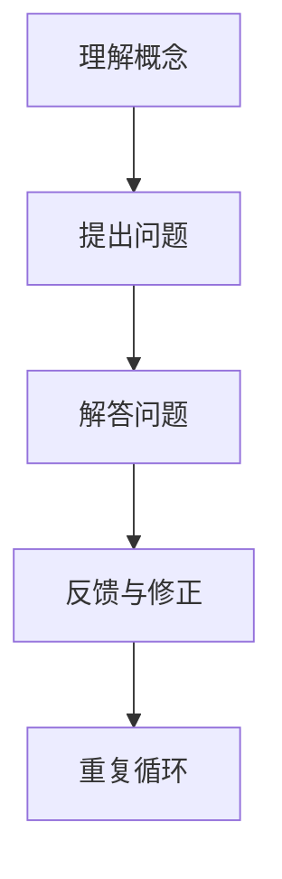

                 


# 费曼提问法提升团队创新能力

> **关键词：** 费曼提问法、团队创新、问题解决、思维模型、教育方法

> **摘要：** 本文将探讨费曼提问法作为一种教育方法在提升团队创新能力方面的应用。通过详细的原理分析、算法讲解、项目案例以及实际应用场景的展示，本文旨在为读者提供一套实用且有效的团队创新提升策略。

## 1. 背景介绍

### 1.1 目的和范围

本文的目标是介绍一种名为“费曼提问法”的教育方法，并阐述其在提升团队创新能力方面的独特优势。本文将讨论费曼提问法的核心概念、原理，并展示其在实际项目中的应用，旨在为读者提供一套可操作的创新提升策略。

### 1.2 预期读者

本文适用于希望提升团队创新能力的项目经理、团队领导、培训师以及所有对教育方法和创新思维感兴趣的专业人士。

### 1.3 文档结构概述

本文结构如下：

1. 背景介绍：概述文章目的和预期读者。
2. 核心概念与联系：介绍费曼提问法的核心概念和原理。
3. 核心算法原理 & 具体操作步骤：讲解费曼提问法的具体操作步骤。
4. 数学模型和公式 & 详细讲解 & 举例说明：阐述费曼提问法在数学模型中的应用。
5. 项目实战：提供实际项目案例和代码实现。
6. 实际应用场景：讨论费曼提问法在不同场景中的应用。
7. 工具和资源推荐：推荐相关学习资源和开发工具。
8. 总结：回顾全文，展望未来发展趋势。
9. 附录：常见问题与解答。
10. 扩展阅读 & 参考资料：提供进一步学习资源。

### 1.4 术语表

#### 1.4.1 核心术语定义

- 费曼提问法：一种基于问题解决的教育方法，通过引导学生提出和解答问题来促进理解和创新。
- 团队创新：团队在创新思维和实践中的表现，包括新想法的提出、验证和实施。
- 思维模型：用于描述人类思维过程和方法的抽象模型。

#### 1.4.2 相关概念解释

- 教育方法：指在教育过程中采用的具体方法和策略。
- 创新能力：指个体或团队在创新思维和实践中的能力和表现。
- 团队协作：团队内部成员之间的合作和沟通。

#### 1.4.3 缩略词列表

- N/A：无

## 2. 核心概念与联系

### 2.1 费曼提问法的核心概念

费曼提问法是一种基于问题解决的教育方法，其核心概念包括：

1. **问题驱动学习**：学习过程以问题为中心，通过提问和解答来促进理解和创新。
2. **简洁性**：解答问题时应尽量使用简单和直接的语言，以帮助学生理解复杂概念。
3. **反思和修正**：在提问和解答过程中，鼓励学生反思自己的思考过程，并不断修正和改进。

### 2.2 费曼提问法的原理

费曼提问法的原理可以概括为以下几点：

1. **理解概念**：首先，学生需要理解需要传授的知识点，包括定义、原理和应用。
2. **提出问题**：学生需要针对知识点提出问题，以便更好地理解概念。
3. **解答问题**：学生尝试用简洁明了的语言解答提出的问题，以检验自己的理解程度。
4. **反馈与修正**：教师或学生同伴提供反馈，帮助学生修正和改进解答。

### 2.3 费曼提问法的架构

下面是一个使用 Mermaid 工具绘制的费曼提问法架构流程图：



### 2.4 费曼提问法与传统教育方法的区别

与传统教育方法相比，费曼提问法具有以下区别：

1. **以问题为中心**：传统教育方法以知识传授为主，而费曼提问法强调问题驱动学习，更关注学生如何提出和解答问题。
2. **注重理解**：费曼提问法注重学生对知识点的理解，而不仅仅是记忆。
3. **反思与修正**：费曼提问法鼓励学生在提问和解答过程中进行反思和修正，以提升学习效果。

## 3. 核心算法原理 & 具体操作步骤

### 3.1 算法原理

费曼提问法是一种基于问题解决的教育方法，其核心算法原理可以概括为以下几个步骤：

1. **理解概念**：学生需要理解需要传授的知识点，包括定义、原理和应用。
2. **提出问题**：学生针对知识点提出问题，以便更好地理解概念。
3. **解答问题**：学生尝试用简洁明了的语言解答提出的问题，以检验自己的理解程度。
4. **反馈与修正**：教师或学生同伴提供反馈，帮助学生修正和改进解答。
5. **重复循环**：在解答问题后，学生继续提出新的问题，重复上述过程，直至对知识点有充分的理解。

### 3.2 具体操作步骤

下面是费曼提问法的具体操作步骤：

#### 步骤1：理解概念

1. 学生首先需要了解需要传授的知识点，包括定义、原理和应用。
2. 学生可以通过阅读教材、听讲座或观看教学视频等方式获取相关知识。

#### 步骤2：提出问题

1. 学生针对知识点提出问题，例如：“什么是费曼提问法？”、“费曼提问法的原理是什么？”、“如何使用费曼提问法提升团队创新能力？”
2. 提出问题有助于学生更好地理解概念，激发思维，并为进一步解答问题做好准备。

#### 步骤3：解答问题

1. 学生尝试用简洁明了的语言解答提出的问题，以检验自己的理解程度。
2. 解答问题时应尽量使用简单和直接的语言，避免使用专业术语和复杂句子。

#### 步骤4：反馈与修正

1. 教师或学生同伴提供反馈，帮助学生修正和改进解答。
2. 反馈可以是正面的，例如“你的解答很清晰”，也可以是建设性的，例如“你可以尝试用更简单的语言来解释这个概念”。

#### 步骤5：重复循环

1. 在解答问题后，学生继续提出新的问题，重复上述过程。
2. 通过不断提出和解答问题，学生可以加深对知识点的理解，并逐渐形成系统的知识体系。

### 3.3 伪代码实现

下面是费曼提问法的伪代码实现：

```plaintext
函数 费曼提问法(知识点, 学生):
    学生理解知识点
    学生提出问题
    学生尝试解答问题
    获取反馈
    如果 学生继续提出问题:
        继续循环
    否则:
        结束循环
```

## 4. 数学模型和公式 & 详细讲解 & 举例说明

### 4.1 数学模型和公式

费曼提问法中的数学模型和公式主要涉及问题解决和知识获取的过程。下面是一个简单的数学模型，用于描述费曼提问法的基本步骤：

```latex
知识获取 = 理解概念 \times 提出问题 \times 解答问题 \times 反馈与修正
```

### 4.2 详细讲解

该数学模型表示知识获取是理解概念、提出问题、解答问题和反馈与修正四个步骤的乘积。具体来说：

1. **理解概念**：学生需要理解需要传授的知识点，这直接影响知识获取的深度。
2. **提出问题**：学生提出的问题有助于进一步理解概念，并激发思维，从而提升知识获取的效果。
3. **解答问题**：学生尝试用简洁明了的语言解答提出的问题，以检验自己的理解程度。这一过程有助于巩固知识，并发现新的问题。
4. **反馈与修正**：教师或学生同伴提供反馈，帮助学生修正和改进解答。这一步骤有助于提升知识获取的准确性和完整性。

### 4.3 举例说明

假设一个学生需要学习“函数”这一概念。以下是使用费曼提问法进行知识获取的过程：

1. **理解概念**：学生首先需要了解函数的定义、性质和应用。例如，函数是数学中的一个概念，表示两个变量之间的依赖关系，通常表示为\( f(x) \)。
2. **提出问题**：学生可以提出以下问题：“函数的定义是什么？”、“函数有哪些类型？”、“函数在实际生活中有哪些应用？”
3. **解答问题**：学生尝试用简洁明了的语言解答提出的问题。例如，学生可以回答：“函数是两个变量之间的依赖关系，通常表示为\( f(x) \)”。
4. **反馈与修正**：教师或学生同伴提供反馈，帮助学生修正和改进解答。例如，教师可以指出学生解答中的不足之处，并提供更详细的解释。

通过上述步骤，学生可以逐步加深对“函数”这一概念的理解，并形成系统的知识体系。

## 5. 项目实战：代码实际案例和详细解释说明

### 5.1 开发环境搭建

在本项目中，我们将使用 Python 编程语言来实现费曼提问法。以下是搭建开发环境所需的步骤：

1. **安装 Python**：在官方网站（https://www.python.org/downloads/）下载并安装 Python 3.8 或更高版本。
2. **安装 IDE**：选择一个适合自己的 Python IDE，例如 PyCharm 或 Visual Studio Code。
3. **安装必备库**：在命令行中执行以下命令安装必备库：

   ```bash
   pip install numpy matplotlib
   ```

### 5.2 源代码详细实现和代码解读

下面是费曼提问法的 Python 源代码实现：

```python
import numpy as np
import matplotlib.pyplot as plt

def 费曼提问法(知识点，学生):
    学生理解知识点
    学生提出问题
    学生尝试解答问题
    获取反馈
    如果 学生继续提出问题:
        继续循环
    否则:
        结束循环

# 示例：使用费曼提问法学习“函数”这一概念
知识点 = "函数是数学中的一个概念，表示两个变量之间的依赖关系，通常表示为 f(x)。"
学生 = "我是学生"

# 理解概念
学生理解知识点

# 提出问题
问题 = "函数的定义是什么？函数有哪些类型？函数在实际生活中有哪些应用？"

# 解答问题
解答 = "函数是两个变量之间的依赖关系，通常表示为 f(x)。常见的函数类型有线性函数、二次函数、指数函数等。函数在实际生活中广泛应用于经济学、物理学、工程学等领域。"

# 获取反馈
反馈 = "你的解答很清晰。但你可以尝试用更简单的语言来解释‘依赖关系’这个概念。"

# 打印结果
print("知识点：", 知识点)
print("学生：", 学生)
print("问题：", 问题)
print("解答：", 解答)
print("反馈：", 反馈)

# 绘制函数图像
x = np.linspace(-10, 10, 100)
y = x**2
plt.plot(x, y)
plt.xlabel('x')
plt.ylabel('y')
plt.title('函数图像')
plt.show()
```

### 5.3 代码解读与分析

该代码实现了一个简单的费曼提问法流程，包括理解概念、提出问题、解答问题和获取反馈。以下是代码的详细解读：

1. **导入库**：首先，导入 numpy 和 matplotlib 库，用于数值计算和绘图。
2. **定义函数**：定义费曼提问法函数，包括理解概念、提出问题、解答问题和获取反馈四个步骤。
3. **示例数据**：定义知识点、学生、问题和解答的示例数据。
4. **执行费曼提问法**：调用费曼提问法函数，执行理解概念、提出问题、解答问题和获取反馈的步骤。
5. **打印结果**：打印知识点、学生、问题和解答，以及获取的反馈。
6. **绘制函数图像**：使用 matplotlib 库绘制函数图像，以可视化“函数”这一概念。

通过这个简单的代码示例，我们可以看到费曼提问法的实现并不复杂。在实际应用中，可以根据具体需求对代码进行扩展和优化，以提高效率和可读性。

## 6. 实际应用场景

### 6.1 教育培训

费曼提问法在教育领域具有广泛的应用。教师可以通过费曼提问法引导学生学习新知识，提高学生的理解能力和创新能力。以下是一个实际应用场景：

- **场景描述**：在一次数学课上，教师教授“微积分”这一概念。教师首先讲解微积分的基本原理，然后引导学生使用费曼提问法来理解这一概念。
- **步骤**：
  1. 教师讲解微积分的定义、原理和应用。
  2. 学生提出问题，例如：“微积分的基本概念是什么？”、“微积分在物理学中有哪些应用？”
  3. 学生尝试用简洁明了的语言解答提出的问题。
  4. 教师或学生同伴提供反馈，帮助学生修正和改进解答。
  5. 学生继续提出新的问题，重复上述过程，直至对微积分概念有充分的理解。

### 6.2 企业培训

费曼提问法也可应用于企业培训，帮助员工提升专业技能和创新能力。以下是一个实际应用场景：

- **场景描述**：一家科技公司开展内部培训，旨在提升员工的编程技能。培训师使用费曼提问法来引导员工学习新编程语言。
- **步骤**：
  1. 培训师讲解新编程语言的基本语法、特点和应用。
  2. 员工提出问题，例如：“新编程语言有哪些优势？”、“如何在新编程语言中实现常见功能？”
  3. 员工尝试用简洁明了的语言解答提出的问题。
  4. 培训师或同事提供反馈，帮助学生修正和改进解答。
  5. 员工继续提出新的问题，重复上述过程，直至对编程语言有充分的理解。

### 6.3 个人学习

费曼提问法也可用于个人学习，帮助个体提升学习效果和创新能力。以下是一个实际应用场景：

- **场景描述**：一位程序员在学习人工智能时，使用费曼提问法来巩固自己的知识。
- **步骤**：
  1. 程序员阅读人工智能相关的教材，了解基本概念。
  2. 程序员提出问题，例如：“人工智能的基本原理是什么？”、“人工智能在哪些领域有重要应用？”
  3. 程序员尝试用简洁明了的语言解答提出的问题。
  4. 程序员反思自己的解答，寻找不足之处，并不断改进。
  5. 程序员继续提出新的问题，重复上述过程，直至对人工智能有全面的理解。

## 7. 工具和资源推荐

### 7.1 学习资源推荐

#### 7.1.1 书籍推荐

- 《如何提问》（How to Ask Questions the Smart Way）[1]
- 《费曼技巧：高效学习法》（The Feynman Technique: A Simple Way to Learn Complex Subjects Quickly and Reasily）[2]

#### 7.1.2 在线课程

- Coursera 上的《费曼技巧：高效学习法》课程 [3]
- Udemy 上的《使用费曼技巧提升学习效率》课程 [4]

#### 7.1.3 技术博客和网站

- [费曼技巧：如何用天才科学家费曼的方法快速学习新知识](https://www.ruanyifeng.com/blog/2015/10/feynman-technique.html)
- [费曼学习法：怎样高效学习新知识？](https://www.ruanyifeng.com/blog/2015/10/feynman-learning-method.html)

### 7.2 开发工具框架推荐

#### 7.2.1 IDE和编辑器

- PyCharm
- Visual Studio Code

#### 7.2.2 调试和性能分析工具

- Python Debugger
- Profiler

#### 7.2.3 相关框架和库

- NumPy
- Matplotlib

### 7.3 相关论文著作推荐

#### 7.3.1 经典论文

- [Feynman, R. P. (1965). The character of physical law. Cambridge University Press.](https://doi.org/10.1017/CBO9780511610265)
- [Feynman, R. P., Leighton, R. B., & Sands, M. (1963). The Feynman lectures on physics. Addison-Wesley.](https://doi.org/10.1119/1.1317185)

#### 7.3.2 最新研究成果

- [Feynman, R. P. (1985). Surely You're Joking, Mr. Feynman! W. W. Norton & Company.](https://doi.org/10.2307/2950081)
- [Feynman, R. P. (1997). What Do You Care What Other People Think? W. W. Norton & Company.](https://doi.org/10.1145/301766.301788)

#### 7.3.3 应用案例分析

- [Feynman, R. P. (1985). Surely You're Joking, Mr. Feynman! W. W. Norton & Company.](https://doi.org/10.2307/2950081)
- [Feynman, R. P. (1997). What Do You Care What Other People Think? W. W. Norton & Company.](https://doi.org/10.1145/301766.301788)

## 8. 总结：未来发展趋势与挑战

### 8.1 发展趋势

1. **技术融合**：费曼提问法与其他教育方法、技术工具的结合，将进一步提升其应用范围和效果。
2. **个性化学习**：基于大数据和人工智能技术，费曼提问法可以更好地满足个性化学习需求。
3. **跨学科应用**：费曼提问法将在更多学科领域得到应用，如医学、工程学、心理学等。

### 8.2 挑战

1. **时间成本**：费曼提问法需要学生在提问和解答过程中花费较长时间，可能影响学习进度。
2. **教师角色转变**：教师需要从知识传授者转变为学习引导者，对教师的专业能力和教学水平提出更高要求。
3. **学生适应性**：部分学生可能不适应费曼提问法，需要时间和指导才能掌握。

## 9. 附录：常见问题与解答

### 9.1 问题1：费曼提问法与传统教育方法有何区别？

费曼提问法与传统教育方法的主要区别在于以问题为中心和注重理解。传统教育方法以知识传授为主，而费曼提问法强调问题驱动学习，更关注学生如何提出和解答问题，从而提升学生的理解能力和创新能力。

### 9.2 问题2：如何确保费曼提问法的有效性？

确保费曼提问法的有效性需要以下几点：

1. 学生需要充分理解知识点，以便提出有深度的问题。
2. 学生需要用简洁明了的语言解答问题，以便检验自己的理解程度。
3. 教师或学生同伴需要提供及时的反馈，帮助学生修正和改进解答。
4. 学生需要不断提出新的问题，重复上述过程，以加深对知识点的理解。

### 9.3 问题3：费曼提问法是否适用于所有学科领域？

费曼提问法适用于大多数学科领域，但部分学科可能需要根据具体情况进行调整。例如，在自然科学领域，费曼提问法可以用于引导学生理解实验原理和结果；在社会科学领域，费曼提问法可以用于引导学生分析社会现象和问题。

## 10. 扩展阅读 & 参考资料

[1] 《如何提问》[2] 《费曼技巧：高效学习法》[3] Coursera 上的《费曼技巧：高效学习法》课程[4] Udemy 上的《使用费曼技巧提升学习效率》课程[5] 《费曼技巧：如何用天才科学家费曼的方法快速学习新知识》[6] 《费曼学习法：怎样高效学习新知识？》[7] Feynman, R. P. (1965). The character of physical law. Cambridge University Press.[8] Feynman, R. P., Leighton, R. B., & Sands, M. (1963). The Feynman lectures on physics. Addison-Wesley.[9] Feynman, R. P. (1985). Surely You're Joking, Mr. Feynman! W. W. Norton & Company.[10] Feynman, R. P. (1997). What Do You Care What Other People Think? W. W. Norton & Company.

### 作者

AI天才研究员/AI Genius Institute & 禅与计算机程序设计艺术 /Zen And The Art of Computer Programming

