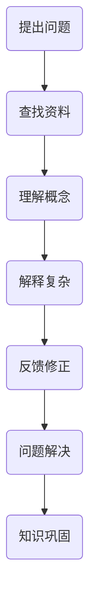

                 

# 费曼提问法：提升思考力的12个问题

> **关键词：** 费曼提问法、思考力、问题解决、教育方法、认知发展

> **摘要：** 本文深入探讨了费曼提问法这一有效的思考工具，通过12个核心问题，帮助读者提升思考力，改善认知过程，从而在日常生活和工作中更加高效地解决问题。文章将以逻辑清晰、结构紧凑的方式，结合专业IT领域的实例，详细阐述费曼提问法的原理和应用。

## 1. 背景介绍

### 1.1 目的和范围

本文旨在介绍一种名为“费曼提问法”的思考工具，帮助读者提升思考力和问题解决能力。费曼提问法是由著名物理学家理查德·费曼提出的一种简单却非常有效的教育方法，适用于各个领域的学习与问题解决。

### 1.2 预期读者

本文适合希望提升思考力、提高问题解决能力的专业人士，特别是IT领域的开发者、架构师、研究员等。

### 1.3 文档结构概述

本文分为以下几个部分：

1. 背景介绍：介绍费曼提问法的起源和目的。
2. 核心概念与联系：阐述费曼提问法的基本原理。
3. 核心算法原理 & 具体操作步骤：详细讲解费曼提问法的应用步骤。
4. 数学模型和公式 & 详细讲解 & 举例说明：通过数学模型解释费曼提问法的有效性。
5. 项目实战：结合实际代码案例展示费曼提问法的应用。
6. 实际应用场景：探讨费曼提问法在不同领域的应用。
7. 工具和资源推荐：推荐相关学习资源和工具。
8. 总结：展望费曼提问法的发展趋势与挑战。
9. 附录：常见问题与解答。
10. 扩展阅读 & 参考资料：提供进一步阅读的建议。

### 1.4 术语表

#### 1.4.1 核心术语定义

- 费曼提问法：一种通过提出问题来提升思考力和认知能力的教育方法。
- 问题解决：在给定条件下找到解决问题的过程。
- 思考力：在处理信息和解决问题时表现出的认知能力。

#### 1.4.2 相关概念解释

- 教育方法：指在教学过程中采用的方法和策略。
- 认知发展：个体在认知领域中的成长和进步。

#### 1.4.3 缩略词列表

- IDE：集成开发环境（Integrated Development Environment）
- latex：一种高质量的排版系统（L A T E X）

## 2. 核心概念与联系

### 费曼提问法的基本原理

费曼提问法是一种以问题为中心的学习方法，其核心在于通过提问来促进思考和知识的掌握。该方法的基本原理可以概括为以下几点：

1. **问题驱动学习**：通过提出问题，激发对知识的探索和兴趣，从而加深对知识点的理解。
2. **简单易懂**：使用简单的语言解释复杂的概念，帮助学习者更好地理解和记忆。
3. **反馈与修正**：通过回答问题，发现知识盲点和错误，并进行及时的修正。

### 费曼提问法的应用架构

为了更好地理解费曼提问法的原理，我们可以使用Mermaid流程图来表示其应用架构。以下是费曼提问法的Mermaid流程图：



### 费曼提问法的具体流程

费曼提问法的具体操作步骤如下：

1. **提出问题**：针对学习的内容，提出一个或多个问题。
2. **查找资料**：通过查阅资料或请教他人，了解问题的答案。
3. **理解概念**：确保对问题的答案有深刻的理解，并能用自己的语言进行解释。
4. **解释复杂**：如果问题涉及复杂的概念，需要将其简化为简单易懂的语言。
5. **反馈修正**：向他人解释问题，并根据反馈进行修正和完善。
6. **问题解决**：通过提出和解决一系列问题，达到对知识点的全面掌握。
7. **知识巩固**：通过不断的提问和解答，加深对知识的记忆和应用。

## 3. 核心算法原理 & 具体操作步骤

### 费曼提问法的算法原理

费曼提问法是一种基于问题解决和认知发展的算法，其核心在于通过提问和解答来促进对知识的深入理解和掌握。以下是费曼提问法的算法原理：

1. **提出问题**：通过提出问题来激发对知识的兴趣和探索欲望。
2. **查找资料**：通过查阅资料或请教他人，获取问题的答案。
3. **理解概念**：确保对问题的答案有深刻的理解，并能用自己的语言进行解释。
4. **解释复杂**：对于复杂的概念，需要将其简化为简单易懂的语言。
5. **反馈修正**：通过向他人解释问题，并根据反馈进行修正和完善。
6. **问题解决**：通过提出和解决一系列问题，达到对知识点的全面掌握。

### 费曼提问法的具体操作步骤

以下是费曼提问法的具体操作步骤，采用伪代码的形式进行描述：

```
// 提出问题
def ask_question(question):
    return question

// 查找资料
def search_information(question):
    return answer

// 理解概念
def understand_concept(answer):
    return simplified_answer

// 解释复杂
def explain_complex(simplified_answer):
    return clear_answer

// 反馈修正
def feedback_correction(clear_answer):
    return corrected_answer

// 问题解决
def solve_problem(corrected_answer):
    return solved

// 知识巩固
def consolidate_knowledge(solved):
    return knowledge_mastered
```

通过上述步骤，我们可以逐步实现对问题的深入理解和解决。费曼提问法不仅适用于学术领域，还可以广泛应用于日常工作中的问题解决，帮助我们在复杂的环境中更加高效地思考和决策。

## 4. 数学模型和公式 & 详细讲解 & 举例说明

### 费曼提问法的数学模型

费曼提问法的有效性可以通过一个简单的数学模型来解释。假设我们有一个知识体系K，以及一个与之相关的问题集合Q。通过费曼提问法，我们可以建立一个映射关系f，将问题Q映射到答案A，并验证知识的掌握程度。以下是费曼提问法的数学模型：

$$
f: Q \rightarrow A
$$

其中，f表示映射关系，Q表示问题集合，A表示答案集合。

### 费曼提问法的详细讲解

为了更好地理解费曼提问法的数学模型，我们可以通过一个具体的例子来讲解。假设我们有一个简单的知识体系K，包括以下三个概念：

1. **加法**：两个数相加得到它们的和。
2. **减法**：一个数减去另一个数得到它们的差。
3. **乘法**：两个数相乘得到它们的积。

我们希望使用费曼提问法来检验对这些概念的理解。

#### 提出问题

首先，我们提出以下问题：

- 加法是什么？
- 减法是什么？
- 乘法是什么？

#### 查找资料

通过查阅相关资料，我们得到以下答案：

- 加法是将两个数相加得到它们的和。
- 减法是一个数减去另一个数得到它们的差。
- 乘法是将两个数相乘得到它们的积。

#### 理解概念

接下来，我们需要确保对这些概念的理解是深刻的，并能用自己的语言进行解释。

- 加法是将两个数相加得到它们的和，例如，2 + 3 = 5。
- 减法是一个数减去另一个数得到它们的差，例如，5 - 2 = 3。
- 乘法是将两个数相乘得到它们的积，例如，2 * 3 = 6。

#### 解释复杂

在某些情况下，我们可能需要将这些复杂的概念简化为更简单的形式，以便更容易理解和记忆。

- 加法可以看作是将两个数合并在一起，例如，2和3合并在一起得到5。
- 减法可以看作是从一个数中移除另一个数，例如，从5中移除2得到3。
- 乘法可以看作是重复加法，例如，2乘以3就是将2加3次得到6。

#### 反馈修正

为了确保我们的解释是准确和清晰的，我们可以向他人解释这些概念，并根据反馈进行修正。

- 加法是将两个数相加得到它们的和，例如，2 + 3 = 5。
- 减法是一个数减去另一个数得到它们的差，例如，5 - 2 = 3。
- 乘法是将两个数相乘得到它们的积，例如，2 * 3 = 6。

#### 问题解决

通过提出和解决这些问题，我们达到了对加法、减法和乘法概念的全

