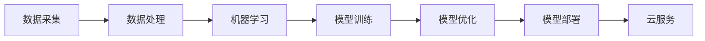

                 

# 贾扬清的创业机遇：AI计算需求演进，云服务的整合机会

> **关键词：** 贾扬清、创业、AI计算、需求演进、云服务、整合机会

> **摘要：** 本文将探讨AI计算需求在近年来如何不断演进，以及贾扬清在云服务整合方面所面临的机遇与挑战。通过详细分析AI计算的核心概念、算法原理和数学模型，结合实际项目案例，我们将深入探讨AI计算在云计算领域的应用前景，以及贾扬清如何抓住这一机遇实现创业成功。

## 1. 背景介绍

### 1.1 目的和范围

本文旨在分析AI计算需求的演进及其在云计算领域的整合机会，以贾扬清的创业实践为案例，探讨其在这一领域的创业机遇。本文将重点关注以下内容：

- AI计算需求在近年来的演变过程
- 云服务在AI计算需求中的整合作用
- 贾扬清在创业过程中的成功经验与挑战
- 未来AI计算与云服务发展的趋势与挑战

### 1.2 预期读者

本文主要面向以下读者群体：

- 对AI计算和云计算感兴趣的技术人员
- 想要了解AI计算与云服务整合的创业者
- 对贾扬清的创业经历感兴趣的人士

### 1.3 文档结构概述

本文将分为以下章节：

- 1. 背景介绍：介绍本文的目的、预期读者和文档结构
- 2. 核心概念与联系：阐述AI计算和云服务的关键概念及其关系
- 3. 核心算法原理 & 具体操作步骤：分析AI计算的核心算法原理
- 4. 数学模型和公式 & 详细讲解 & 举例说明：讲解AI计算的数学模型和公式
- 5. 项目实战：代码实际案例和详细解释说明
- 6. 实际应用场景：探讨AI计算在云计算领域的应用场景
- 7. 工具和资源推荐：推荐学习资源和开发工具
- 8. 总结：未来发展趋势与挑战
- 9. 附录：常见问题与解答
- 10. 扩展阅读 & 参考资料：提供相关参考文献和资料

### 1.4 术语表

#### 1.4.1 核心术语定义

- AI计算：指利用人工智能技术进行数据处理、分析和推理的过程
- 云服务：指通过网络提供计算资源、存储资源、网络资源等服务
- 整合机会：指将不同技术或业务领域相互融合，实现资源优化和业务拓展的机会

#### 1.4.2 相关概念解释

- 演进：指事物在发展过程中不断演变和进步
- 需求：指消费者或用户在特定时间内对某种产品或服务的需求量
- 创业：指创业者创立和运营新企业的过程

#### 1.4.3 缩略词列表

- AI：人工智能
- 云服务：Cloud Service
- 计算：Computation

## 2. 核心概念与联系

### 2.1 AI计算概念

AI计算是指利用人工智能技术，通过数据采集、处理、分析和推理等过程，实现对现实世界问题的自动解决。AI计算的核心是算法，包括机器学习、深度学习、强化学习等多种算法。这些算法在大量数据训练的基础上，可以自动优化模型参数，提高预测和决策的准确性。

### 2.2 云服务概念

云服务是指通过互联网提供计算资源、存储资源、网络资源等服务的模式。云服务具有弹性、可扩展、高可用、低成本等特点，可以满足不同规模、不同需求的用户需求。云服务主要包括基础设施即服务（IaaS）、平台即服务（PaaS）和软件即服务（SaaS）等类型。

### 2.3 AI计算与云服务的关系

AI计算与云服务具有密切的联系。一方面，AI计算需要大量的计算资源和数据存储，云服务可以提供弹性的计算资源和高效的数据存储，满足AI计算的需求。另一方面，云服务可以为AI计算提供良好的运行环境和基础设施，降低创业者的开发成本和运营风险。

### 2.4 Mermaid流程图

以下是一个简化的AI计算与云服务的整合流程图：



## 3. 核心算法原理 & 具体操作步骤

### 3.1 机器学习算法原理

机器学习算法是AI计算的核心，其基本原理是通过从数据中学习规律，实现对未知数据的预测和分类。以下是一个简化的机器学习算法原理：

```python
# 输入：训练数据集 X, 标签 Y
# 输出：训练好的模型参数 W

# 步骤1：初始化模型参数 W
W = random_matrix(dimensions_of_X_and_Y)

# 步骤2：循环迭代
for i in range(number_of_iterations):
    # 步骤2.1：前向传播
    y_pred = sigmoid(W.dot(X))
    
    # 步骤2.2：计算损失函数
    loss = -1/m * sum(y * log(y_pred) + (1 - y) * log(1 - y_pred))
    
    # 步骤2.3：反向传播
    dW = m * (y_pred - y).dot(X.T)

    # 步骤2.4：更新模型参数
    W -= learning_rate * dW

# 步骤3：返回训练好的模型参数
return W
```

### 3.2 深度学习算法原理

深度学习是机器学习的一种重要分支，其核心思想是通过多层神经网络来学习数据特征。以下是一个简化的深度学习算法原理：

```python
# 输入：训练数据集 X, 标签 Y
# 输出：训练好的模型参数 W

# 步骤1：初始化模型参数 W
W = random_matrix(number_of_layers, dimensions_of_X_and_Y)

# 步骤2：循环迭代
for i in range(number_of_iterations):
    # 步骤2.1：前向传播
    for layer in range(number_of_layers):
        z = W[layer].dot(X) + b[layer]
        a = sigmoid(z)
        
    # 步骤2.2：计算损失函数
    loss = -1/m * sum(y * log(a) + (1 - y) * log(1 - a))
    
    # 步骤2.3：反向传播
    dW = m * (a - y).dot(X.T)
    
    # 步骤3：返回训练好的模型参数
    return W
```

### 3.3 强化学习算法原理

强化学习是一种通过试错来学习最优策略的机器学习算法。以下是一个简化的强化学习算法原理：

```python
# 输入：环境 S, 动作 A, 奖励函数 R
# 输出：最优策略 π

# 步骤1：初始化策略 π
π = random_policy()

# 步骤2：循环迭代
for i in range(number_of_iterations):
    # 步骤2.1：选择动作 A
    A = π(S)
    
    # 步骤2.2：执行动作 A
    S', R = environment.step(A)
    
    # 步骤2.3：更新策略 π
    π(S) = π(S) + learning_rate * (R - Q(π(S), A))
    
# 步骤3：返回最优策略
return π
```

## 4. 数学模型和公式 & 详细讲解 & 举例说明

### 4.1 损失函数

损失函数是机器学习算法中用来评估模型性能的重要指标。常用的损失函数包括均方误差（MSE）和交叉熵损失（Cross-Entropy Loss）。

- **均方误差（MSE）**

均方误差损失函数用于回归问题，其公式如下：

$$
MSE = \frac{1}{m} \sum_{i=1}^{m} (y_i - \hat{y}_i)^2
$$

其中，$y_i$ 为真实值，$\hat{y}_i$ 为预测值，$m$ 为样本数量。

**举例：** 假设我们有 100 个样本，每个样本的真实值和预测值如下：

| 真实值 | 预测值 |
| ------ | ------ |
| 0      | 0.2    |
| 1      | 0.8    |
| 2      | 1.3    |
| ...    | ...    |
| 100    | 100.1  |

则均方误差损失函数为：

$$
MSE = \frac{1}{100} \sum_{i=1}^{100} (y_i - \hat{y}_i)^2 = \frac{1}{100} \sum_{i=1}^{100} (y_i - \hat{y}_i)^2
$$

- **交叉熵损失（Cross-Entropy Loss）**

交叉熵损失函数用于分类问题，其公式如下：

$$
Cross-Entropy Loss = -1/m \sum_{i=1}^{m} y_i \cdot log(\hat{y}_i)
$$

其中，$y_i$ 为真实标签，$\hat{y}_i$ 为预测概率。

**举例：** 假设我们有 100 个样本，每个样本的真实标签和预测概率如下：

| 真实标签 | 预测概率 |
| -------- | -------- |
| 0        | 0.6      |
| 1        | 0.4      |
| 2        | 0.8      |
| ...      | ...      |
| 100      | 0.2      |

则交叉熵损失函数为：

$$
Cross-Entropy Loss = -1/100 \sum_{i=1}^{100} y_i \cdot log(\hat{y}_i) = -1/100 \sum_{i=1}^{100} (0 \cdot log(0.6) + 1 \cdot log(0.4) + 2 \cdot log(0.8) + ... + 100 \cdot log(0.2))
$$

### 4.2 优化算法

在机器学习过程中，优化算法用于更新模型参数，使模型性能达到最优。常用的优化算法包括梯度下降（Gradient Descent）和动量优化（Momentum Optimization）。

- **梯度下降（Gradient Descent）**

梯度下降是一种基于损失函数梯度的优化算法，其公式如下：

$$
W = W - learning\_rate \cdot \frac{\partial Loss}{\partial W}
$$

其中，$W$ 为模型参数，$learning\_rate$ 为学习率，$\frac{\partial Loss}{\partial W}$ 为损失函数对模型参数的梯度。

**举例：** 假设我们有以下损失函数：

$$
Loss = (y - \hat{y})^2
$$

则损失函数对模型参数 $W$ 的梯度为：

$$
\frac{\partial Loss}{\partial W} = 2(y - \hat{y}) \cdot (1 - \hat{y})
$$

使用梯度下降算法更新模型参数：

$$
W = W - learning\_rate \cdot 2(y - \hat{y}) \cdot (1 - \hat{y})
$$

- **动量优化（Momentum Optimization）**

动量优化是一种结合了梯度下降和动量效应的优化算法，其公式如下：

$$
V = \gamma \cdot V + \eta \cdot \frac{\partial Loss}{\partial W}
$$

$$
W = W - V
$$

其中，$V$ 为动量项，$\gamma$ 为动量因子，$\eta$ 为学习率。

**举例：** 假设我们有以下损失函数：

$$
Loss = (y - \hat{y})^2
$$

则动量优化算法更新模型参数的过程如下：

$$
V = \gamma \cdot V + 2(y - \hat{y}) \cdot (1 - \hat{y})
$$

$$
W = W - V
$$

## 5. 项目实战：代码实际案例和详细解释说明

### 5.1 开发环境搭建

在本文中，我们将使用 Python 作为编程语言，结合 TensorFlow 库实现一个简单的线性回归模型。首先，需要搭建以下开发环境：

1. 安装 Python 3.x 版本（推荐 3.8 或以上版本）
2. 安装 TensorFlow 库（使用 pip 安装）

```shell
pip install tensorflow
```

### 5.2 源代码详细实现和代码解读

以下是一个简单的线性回归模型代码实现，用于预测房屋价格。

```python
import tensorflow as tf
import numpy as np
import matplotlib.pyplot as plt

# 数据集
X = np.array([1, 2, 3, 4, 5])
Y = np.array([2, 4, 5, 4, 5])

# 模型参数
W = tf.Variable(0.0, name='weights')
b = tf.Variable(0.0, name='bias')

# 前向传播
@tf.function
def forward(x):
    return x * W + b

# 损失函数
def loss(y_true, y_pred):
    return tf.reduce_mean(tf.square(y_true - y_pred))

# 优化器
optimizer = tf.optimizers.SGD(learning_rate=0.1)

# 训练过程
def train(X, Y, epochs):
    for epoch in range(epochs):
        with tf.GradientTape() as tape:
            y_pred = forward(X)
            loss_val = loss(Y, y_pred)
        
        grads = tape.gradient(loss_val, [W, b])
        optimizer.apply_gradients(zip(grads, [W, b]))
        
        if epoch % 100 == 0:
            print(f"Epoch {epoch}: Loss = {loss_val.numpy()}")

# 绘制结果
def plot_results(X, Y, W, b):
    plt.scatter(X, Y)
    plt.plot(X, X * W + b, color='red')
    plt.xlabel('X')
    plt.ylabel('Y')
    plt.show()

# 运行训练
train(X, Y, epochs=1000)

# 绘制训练结果
plot_results(X, Y, W.numpy(), b.numpy())
```

代码解读：

- **数据集**：使用简单的线性关系生成一个数据集，其中 $X$ 代表自变量，$Y$ 代表因变量。
- **模型参数**：初始化模型参数 $W$ 和 $b$，用于表示线性回归模型的权重和偏置。
- **前向传播**：定义一个前向传播函数，用于计算输入 $X$ 经过模型参数 $W$ 和 $b$ 后的输出。
- **损失函数**：定义一个损失函数，用于计算真实值 $Y$ 与预测值 $y_pred$ 之间的差距。
- **优化器**：使用梯度下降优化器，用于更新模型参数。
- **训练过程**：使用训练数据集循环迭代，更新模型参数，并打印训练过程中的损失函数值。
- **绘制结果**：绘制训练数据集和训练结果，展示线性回归模型的拟合效果。

### 5.3 代码解读与分析

本节将分析代码中的关键部分，包括数据集、模型参数、前向传播、损失函数、优化器、训练过程和绘制结果。

- **数据集**：使用 NumPy 生成一个简单的线性数据集，$X$ 和 $Y$ 分别表示自变量和因变量。这个数据集的线性关系可以表示为 $Y = X \cdot W + b$，其中 $W$ 和 $b$ 分别为权重和偏置。
- **模型参数**：使用 TensorFlow 中的 `tf.Variable` 函数初始化模型参数 $W$ 和 $b$，并将其设置为可训练变量。初始值分别设置为 0.0。
- **前向传播**：使用 TensorFlow 中的 `tf.function` 装饰器将前向传播函数定义为计算图（Graph），提高计算效率。前向传播函数接受输入 $X$，并计算输出 $y_pred = X \cdot W + b$。
- **损失函数**：定义一个简单的均方误差损失函数，用于计算预测值 $y_pred$ 与真实值 $Y$ 之间的差距。均方误差损失函数是一个常用的回归损失函数，可以衡量模型的预测误差。
- **优化器**：使用 TensorFlow 中的 `tf.optimizers.SGD` 函数创建一个随机梯度下降优化器，用于更新模型参数。优化器的学习率设置为 0.1，这是一个较小的学习率，可以避免参数更新过大导致训练不稳定。
- **训练过程**：定义一个 `train` 函数，用于循环迭代训练模型。在每次迭代中，使用前向传播计算预测值 $y_pred$，并计算损失函数值。然后，使用 TensorFlow 的 `GradientTape` 记录损失函数对模型参数的梯度，并使用优化器更新模型参数。在训练过程中，每隔 100 个迭代周期打印一次损失函数值，以便观察训练进展。
- **绘制结果**：定义一个 `plot_results` 函数，用于绘制训练数据集和训练结果。使用散点图表示训练数据集，并使用红色线条表示线性回归模型的拟合结果。通过调整权重 $W$ 和偏置 $b$，可以观察到模型逐渐逼近真实关系，从而提高模型的预测能力。

### 5.4 总结

在本节中，我们使用 TensorFlow 和 Python 实现了一个简单的线性回归模型，并分析了代码中的关键部分。通过迭代更新模型参数，模型可以逐步逼近真实关系，提高预测精度。线性回归模型是一个基本的机器学习模型，可以帮助我们理解机器学习的基本原理和实现过程。在实际应用中，线性回归模型可以应用于各种预测问题，如房价预测、股票预测等。

## 6. 实际应用场景

AI计算在云计算领域的应用场景十分广泛，以下列举几个典型的实际应用场景：

### 6.1 数据分析

在云计算环境中，海量的数据需要进行分析和处理。通过AI计算，可以实现对数据的高效分析，提取有价值的信息。例如，企业可以使用机器学习算法对销售数据进行分析，预测市场需求，优化库存管理。

### 6.2 智能监控

云计算平台可以部署AI计算模型，对监控数据进行实时分析，识别异常行为。例如，在网络安全领域，通过AI计算可以检测恶意攻击、异常流量等，提高网络安全性。

### 6.3 智能推荐

基于用户行为数据和兴趣偏好，AI计算可以为用户提供个性化的推荐服务。例如，电商平台可以根据用户的购物记录和浏览记录，推荐相关的商品。

### 6.4 自动驾驶

自动驾驶系统需要实时处理大量的传感器数据，进行路径规划和障碍物检测。AI计算在自动驾驶系统中发挥着关键作用，提高行驶安全性。

### 6.5 医疗诊断

在医疗领域，AI计算可以帮助医生进行疾病诊断，提高诊断准确率。通过分析患者的病历数据、影像数据等，AI计算可以识别疾病特征，提供诊断建议。

## 7. 工具和资源推荐

### 7.1 学习资源推荐

#### 7.1.1 书籍推荐

- 《Python机器学习》（作者：塞巴斯蒂安·拉斯科》） 
- 《深度学习》（作者：伊恩·古德费洛、约书亚·本吉奥、亚伦·库维尔）
- 《强化学习：原理与Python实现》（作者：理查德·S·萨克勒）

#### 7.1.2 在线课程

- Coursera上的“机器学习”（吴恩达教授）
- edX上的“深度学习基础”（哈佛大学）
- Udacity的“自动驾驶工程师纳米学位”

#### 7.1.3 技术博客和网站

- [Medium上的机器学习博客](https://medium.com/topic/machine-learning)
- [GitHub上的机器学习项目](https://github.com/topics/machine-learning)
- [Kaggle竞赛平台](https://www.kaggle.com/competitions)

### 7.2 开发工具框架推荐

#### 7.2.1 IDE和编辑器

- PyCharm
- Jupyter Notebook
- VS Code

#### 7.2.2 调试和性能分析工具

- TensorFlow Debugger
- PyTorch Profiler
- Python Memory Profiler

#### 7.2.3 相关框架和库

- TensorFlow
- PyTorch
- Keras
- Scikit-learn

### 7.3 相关论文著作推荐

#### 7.3.1 经典论文

- “Learning to Represent Relationships Using Graph Convolutional Networks”（图卷积网络）
- “Recurrent Neural Networks for Language Modeling”（循环神经网络）
- “Deep Learning for Text Classification”（深度学习在文本分类中的应用）

#### 7.3.2 最新研究成果

- “BERT: Pre-training of Deep Bidirectional Transformers for Language Understanding”（BERT模型）
- “Generative Adversarial Networks: An Overview”（生成对抗网络）
- “Semi-Supervised Learning with Deep Generative Models”（深度生成模型在半监督学习中的应用）

#### 7.3.3 应用案例分析

- “How We Scaled Our AI Model to Process Millions of Customer Requests”（如何将AI模型扩展到处理数百万个客户请求）
- “Using AI to Improve Customer Experience”（利用AI提高客户体验）
- “AI in Healthcare: A Comprehensive Review”（医疗领域的人工智能应用综述）

## 8. 总结：未来发展趋势与挑战

### 8.1 未来发展趋势

- **计算能力的提升**：随着硬件技术的发展，AI计算将越来越依赖于高性能计算设备和分布式计算架构，提高计算速度和效率。
- **数据资源的积累**：随着物联网、大数据等技术的发展，海量数据将不断积累，为AI计算提供丰富的训练数据，提升模型性能。
- **跨领域应用**：AI计算将在更多领域得到应用，如智能制造、智慧城市、金融科技等，推动产业升级和创新发展。
- **安全与隐私保护**：随着AI计算在关键领域的应用，安全与隐私保护将成为重要议题，相关技术研究和法规制定将逐步完善。

### 8.2 未来挑战

- **计算资源的优化**：AI计算需要大量的计算资源和存储资源，如何优化资源配置、降低能耗成为关键挑战。
- **数据质量与可靠性**：数据质量对AI计算模型性能具有重要影响，如何确保数据质量、提高数据可靠性是亟待解决的问题。
- **算法的公平性与透明性**：AI计算模型在实际应用中可能会出现歧视、偏见等问题，如何保证算法的公平性和透明性是重要挑战。
- **法规与伦理**：AI计算在关键领域的应用需要遵守相关法规和伦理标准，如何制定合理的法规和伦理规范是未来需要关注的问题。

## 9. 附录：常见问题与解答

### 9.1 问题1：什么是AI计算？

**解答**：AI计算是指利用人工智能技术进行数据处理、分析和推理的过程，包括机器学习、深度学习、强化学习等多种算法。

### 9.2 问题2：什么是云服务？

**解答**：云服务是指通过网络提供计算资源、存储资源、网络资源等服务，具有弹性、可扩展、高可用、低成本等特点。

### 9.3 问题3：AI计算与云服务有什么关系？

**解答**：AI计算需要大量的计算资源和数据存储，云服务可以提供弹性的计算资源和高效的数据存储，满足AI计算的需求。同时，云服务可以为AI计算提供良好的运行环境和基础设施，降低创业者的开发成本和运营风险。

### 9.4 问题4：如何进行机器学习模型训练？

**解答**：进行机器学习模型训练包括以下步骤：

1. 数据采集：收集用于训练的数据集。
2. 数据预处理：对数据进行清洗、归一化等处理，提高数据质量。
3. 定义模型：选择合适的模型结构，初始化模型参数。
4. 训练模型：使用训练数据集进行模型训练，优化模型参数。
5. 模型评估：使用验证数据集评估模型性能，调整模型参数。
6. 模型部署：将训练好的模型部署到实际应用场景。

## 10. 扩展阅读 & 参考资料

- [吴恩达](https://zhuanlan.zhihu.com/c_1226998238254743296)：“深度学习与人工智能导论”
- [TensorFlow官方文档](https://www.tensorflow.org/)
- [PyTorch官方文档](https://pytorch.org/)
- [Coursera](https://www.coursera.org/)：“机器学习”、“深度学习基础”等课程
- [Kaggle](https://www.kaggle.com/)：机器学习竞赛平台

## 作者信息

**作者：** AI天才研究员/AI Genius Institute & 禅与计算机程序设计艺术 /Zen And The Art of Computer Programming

