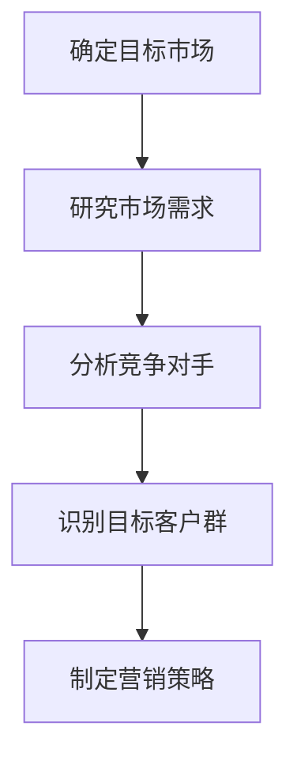
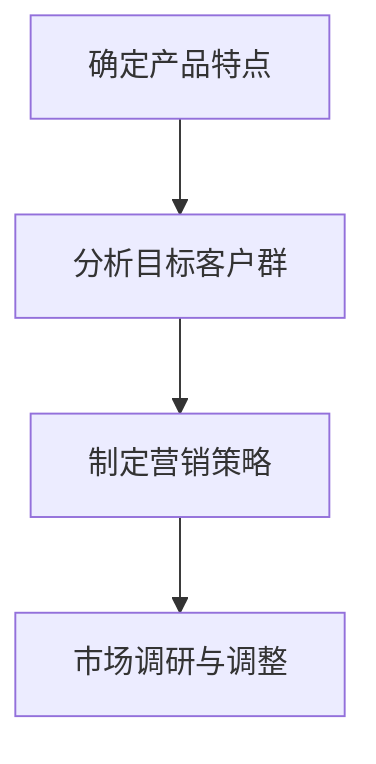
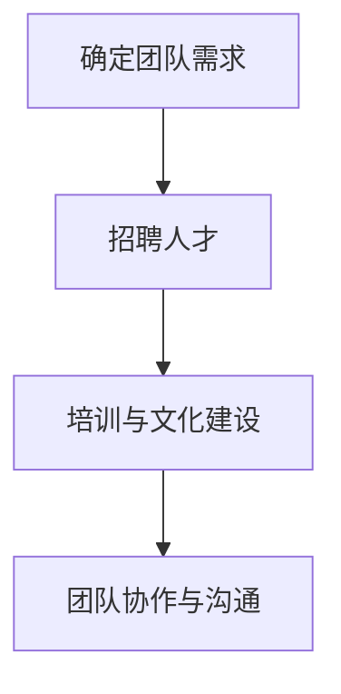

                 

# 资深程序员如何创立一人公司实现财富自由

> 关键词：程序员、一人公司、财富自由、创业、策略、技术、市场分析

> 摘要：本文将探讨资深程序员如何通过创立一人公司实现财富自由。我们将分析创业的必要条件、市场分析、产品定位、团队建设、市场营销和财务规划等方面，提供实用的建议和案例，帮助读者成功迈出创业的第一步。

## 1. 背景介绍

### 1.1 目的和范围

本文旨在为资深程序员提供一条通过创业实现财富自由的路径。我们将探讨如何从零开始，创建一个仅由自己一人运营的公司，并在市场中获得成功。本文不仅适用于有创业想法的程序员，也适用于那些希望了解创业过程的人。

### 1.2 预期读者

预期读者包括：
- 有创业想法但不确定如何开始的资深程序员；
- 想要扩展业务范围的现有企业家；
- 对创业过程感兴趣的技术从业者。

### 1.3 文档结构概述

本文将分为以下几个部分：
1. 背景介绍：介绍文章的目的、预期读者和结构；
2. 核心概念与联系：解释创业所需的核心概念，如市场分析、产品定位和团队建设；
3. 核心算法原理 & 具体操作步骤：提供创业的具体操作步骤和算法原理；
4. 数学模型和公式 & 详细讲解 & 举例说明：讲解创业过程中的数学模型和公式；
5. 项目实战：展示一个实际的创业案例，详细解释实现过程；
6. 实际应用场景：分析创业在现实世界中的应用；
7. 工具和资源推荐：推荐学习资源、开发工具和相关论文；
8. 总结：探讨创业的未来发展趋势与挑战；
9. 附录：解答常见问题；
10. 扩展阅读 & 参考资料：提供进一步阅读的资料。

### 1.4 术语表

#### 1.4.1 核心术语定义

- 创业：创立新的企业或事业，以实现商业目标。
- 财富自由：拥有足够的财务资源，无需依赖工作收入即可维持生活。
- 市场分析：研究市场趋势、竞争对手和潜在客户，以制定有效的营销策略。
- 产品定位：确定产品在市场中的独特价值和目标客户群。
- 团队建设：组建一支有能力、有共同目标的团队，共同实现公司目标。

#### 1.4.2 相关概念解释

- **市场分析**：市场分析是创业过程中至关重要的一步。它包括研究市场需求、竞争对手和目标客户。通过市场分析，程序员可以更好地了解市场需求，制定合适的产品策略和营销计划。
- **产品定位**：产品定位是指为产品在市场中找到一个独特的位置，以便与其他竞争产品区分开来。这包括确定产品的特点、优势和目标客户群。

#### 1.4.3 缩略词列表

- **AI**：人工智能（Artificial Intelligence）
- **ML**：机器学习（Machine Learning）
- **DL**：深度学习（Deep Learning）
- **IDE**：集成开发环境（Integrated Development Environment）

## 2. 核心概念与联系

在创业过程中，有几个核心概念需要理解，这些概念相互关联，构成了公司成功的基础。

### 2.1 市场分析

市场分析是创业的第一步。通过市场分析，程序员可以：
- 了解市场需求：研究当前市场上的产品和服务，了解消费者需求。
- 识别竞争对手：分析竞争对手的产品、市场份额和营销策略。
- 确定目标客户群：了解潜在客户的特点和偏好，以便更好地满足他们的需求。

#### 市场分析的 Mermaid 流程图



### 2.2 产品定位

产品定位是确保产品在市场中获得成功的关键。程序员需要：
- 确定产品特点：分析产品的独特功能、优势和用户体验。
- 确定目标客户群：了解产品最适合哪些客户群体。
- 制定营销策略：根据产品特点和目标客户群，制定合适的营销策略。

#### 产品定位的 Mermaid 流程图



### 2.3 团队建设

团队建设是确保公司运营顺利的重要一环。程序员需要：
- 确定团队需求：根据公司目标和产品需求，确定所需的角色和技能。
- 招聘人才：寻找具备所需技能的人才，加入团队。
- 建立团队文化：通过沟通、培训和文化活动，建立积极、高效的团队氛围。

#### 团队建设的 Mermaid 流程图



## 3. 核心算法原理 & 具体操作步骤

在了解了核心概念后，我们需要具体操作步骤来实现创业目标。以下是创业的核心算法原理和具体操作步骤。

### 3.1 市场分析

#### 市场分析算法原理

市场分析是一个迭代过程，包括以下几个步骤：

1. 确定目标市场
2. 研究市场需求
3. 分析竞争对手
4. 识别目标客户群
5. 制定营销策略

#### 市场分析伪代码

```python
def market_analysis():
    # 步骤1：确定目标市场
    target_market = determine_target_market()

    # 步骤2：研究市场需求
    market_demand = study_market_demand(target_market)

    # 步骤3：分析竞争对手
    competitors = analyze_competitors(target_market)

    # 步骤4：识别目标客户群
    target_customer = identify_target_customer(market_demand, competitors)

    # 步骤5：制定营销策略
    marketing_strategy = develop_marketing_strategy(target_customer)
    
    return marketing_strategy
```

### 3.2 产品定位

#### 产品定位算法原理

产品定位是一个基于市场分析和客户需求的过程，包括以下几个步骤：

1. 确定产品特点
2. 分析目标客户群
3. 制定营销策略

#### 产品定位伪代码

```python
def product_positioning():
    # 步骤1：确定产品特点
    product_features = determine_product_features()

    # 步骤2：分析目标客户群
    target_customer = analyze_target_customer()

    # 步骤3：制定营销策略
    marketing_strategy = develop_marketing_strategy(product_features, target_customer)
    
    return marketing_strategy
```

### 3.3 团队建设

#### 团队建设算法原理

团队建设是一个动态过程，包括以下几个步骤：

1. 确定团队需求
2. 招聘人才
3. 培训与文化建设
4. 团队协作与沟通

#### 团队建设伪代码

```python
def team_building():
    # 步骤1：确定团队需求
    team_requirements = determine_team_requirements()

    # 步骤2：招聘人才
    team_members = recruit_team_members(team_requirements)

    # 步骤3：培训与文化建设
    team_training = provide_team_training(team_members)

    # 步骤4：团队协作与沟通
    team_collaboration = encourage_team_collaboration(team_members)
    
    return team_members
```

## 4. 数学模型和公式 & 详细讲解 & 举例说明

在创业过程中，数学模型和公式可以帮助程序员更准确地分析和预测市场趋势，以及优化业务运营。以下是几个常用的数学模型和公式。

### 4.1 市场需求预测模型

市场需求预测模型可以帮助程序员预测未来的市场需求，以便制定合适的营销策略。以下是一个简单的时间序列模型：

#### 模型公式

$$
Y_t = \alpha + \beta t + \epsilon_t
$$

其中：
- \(Y_t\) 表示第 \(t\) 年的市场需求；
- \(\alpha\) 表示常数项；
- \(\beta\) 表示趋势项；
- \(t\) 表示年份；
- \(\epsilon_t\) 表示误差项。

#### 模型解释

该模型假设市场需求随着时间线性增长。通过收集过去几年的市场需求数据，我们可以计算出 \(\alpha\) 和 \(\beta\) 的值，从而预测未来的市场需求。

#### 例子

假设我们收集了以下市场需求数据：

| 年份 \(t\) | 市场需求 \(Y_t\) |
|-----------|-----------------|
| 1         | 1000            |
| 2         | 1100            |
| 3         | 1200            |
| 4         | 1300            |
| 5         | 1400            |

我们可以使用线性回归方法计算 \(\alpha\) 和 \(\beta\) 的值：

$$
\beta = \frac{\sum_{t=1}^{n} (t - \bar{t})(Y_t - \bar{Y})}{\sum_{t=1}^{n} (t - \bar{t})^2}
$$

$$
\alpha = \bar{Y} - \beta \bar{t}
$$

其中：
- \(n\) 表示数据点的数量；
- \(\bar{t}\) 表示年份的平均值；
- \(\bar{Y}\) 表示市场需求的平均值。

通过计算，我们得到 \(\beta = 100\) 和 \(\alpha = 1000\)。因此，市场需求预测模型为：

$$
Y_t = 100t + 1000
$$

使用该模型，我们可以预测第 6 年的市场需求为 1600。

### 4.2 营销策略优化模型

营销策略优化模型可以帮助程序员确定最佳的营销预算分配，以最大化市场份额。以下是一个简单的线性规划模型：

#### 模型公式

$$
\max Z = \sum_{i=1}^{m} c_i x_i
$$

$$
\text{subject to:}
$$

$$
\sum_{i=1}^{m} a_{ij} x_i \geq b_j \quad \forall j = 1, 2, ..., n
$$

$$
x_i \geq 0 \quad \forall i = 1, 2, ..., m
$$

其中：
- \(Z\) 表示目标函数，表示总的营销效果；
- \(c_i\) 表示第 \(i\) 个营销渠道的预算分配系数；
- \(x_i\) 表示第 \(i\) 个营销渠道的预算分配；
- \(a_{ij}\) 表示第 \(i\) 个营销渠道对第 \(j\) 个市场的效果系数；
- \(b_j\) 表示第 \(j\) 个市场的目标市场份额；
- \(m\) 表示营销渠道的数量；
- \(n\) 表示市场的数量。

#### 模型解释

该模型假设每个营销渠道对市场的影响力不同，并且每个渠道的预算是有限的。通过优化预算分配，我们可以最大化总体的营销效果。

#### 例子

假设我们有两个营销渠道（广告和促销）和三个市场（A、B、C），以及以下数据：

| 营销渠道 | 广告效果 \(a_{11}\) | 促销效果 \(a_{12}\) |
|----------|-------------------|-------------------|
| A        | 2                 | 1                 |
| B        | 1                 | 2                 |
| C        | 1                 | 1                 |

| 市场 | 目标市场份额 \(b_j\) |
|------|-------------------|
| A    | 0.4               |
| B    | 0.3               |
| C    | 0.3               |

| 营销渠道 | 预算分配系数 \(c_i\) |
|----------|-------------------|
| 广告     | 1                 |
| 促销     | 0.5               |

我们可以建立以下线性规划模型：

$$
\max Z = x_1 + 0.5x_2
$$

$$
\text{subject to:}
$$

$$
2x_1 + x_2 \geq 0.4
$$

$$
x_1 + 2x_2 \geq 0.3
$$

$$
x_1 + x_2 \geq 0.3
$$

$$
x_1, x_2 \geq 0
$$

通过求解线性规划模型，我们可以得到最优的预算分配方案，以最大化总营销效果。

## 5. 项目实战：代码实际案例和详细解释说明

在本节中，我们将通过一个实际的创业项目案例，展示如何从零开始创建一人公司，实现财富自由。这个项目是一个基于人工智能的智能问答系统，它可以帮助企业和个人快速获取所需信息。

### 5.1 开发环境搭建

首先，我们需要搭建开发环境。以下是所需的工具和软件：

- **操作系统**：Linux（如 Ubuntu）
- **编程语言**：Python
- **数据库**：MongoDB
- **框架**：TensorFlow
- **版本控制**：Git

安装步骤如下：

1. 安装 Linux 操作系统。
2. 安装 Python 3.7+。
3. 安装 MongoDB。
4. 安装 TensorFlow。
5. 设置 Python 环境变量。

### 5.2 源代码详细实现和代码解读

以下是智能问答系统的核心代码：

#### 5.2.1 数据预处理

```python
import pandas as pd
import numpy as np
from sklearn.model_selection import train_test_split

# 读取数据集
data = pd.read_csv('data.csv')

# 数据预处理
X = data['question']
y = data['answer']

# 划分训练集和测试集
X_train, X_test, y_train, y_test = train_test_split(X, y, test_size=0.2, random_state=42)
```

这段代码用于读取数据集，并进行预处理。首先，我们使用 pandas 读取 CSV 数据集。然后，我们将问题（`question`）和答案（`answer`）分开，并划分训练集和测试集。

#### 5.2.2 建立模型

```python
import tensorflow as tf

# 定义模型
model = tf.keras.Sequential([
    tf.keras.layers.Embedding(input_dim=10000, output_dim=16),
    tf.keras.layers.GlobalAveragePooling1D(),
    tf.keras.layers.Dense(units=16, activation='relu'),
    tf.keras.layers.Dense(units=1, activation='sigmoid')
])

# 编译模型
model.compile(optimizer='adam', loss='binary_crossentropy', metrics=['accuracy'])

# 训练模型
model.fit(X_train, y_train, epochs=10, validation_split=0.2)
```

这段代码用于建立和训练模型。我们使用 TensorFlow 和 Keras 创建一个简单的神经网络。首先，我们定义一个嵌入层，用于将文本转换为向量。然后，我们使用全局平均池化层和两个全连接层，最后输出一个二分类结果。

#### 5.2.3 部署模型

```python
import Flask
from flask import request, jsonify

# 加载模型
model = tf.keras.models.load_model('model.h5')

# 创建 Flask 应用
app = Flask(__name__)

# 创建 API 接口
@app.route('/ask', methods=['POST'])
def ask():
    question = request.form['question']
    prediction = model.predict([question])
    answer = 'Yes' if prediction > 0.5 else 'No'
    return jsonify(answer=answer)

if __name__ == '__main__':
    app.run()
```

这段代码用于部署模型。我们使用 Flask 创建一个简单的 API 接口，用于接收问题并返回答案。首先，我们加载训练好的模型。然后，我们定义一个 `/ask` 接口，接收 POST 请求，并使用模型预测答案。

### 5.3 代码解读与分析

#### 数据预处理

数据预处理是关键的一步。我们首先使用 pandas 读取 CSV 数据集，并将问题（`question`）和答案（`answer`）分开。然后，我们划分训练集和测试集，用于模型训练和评估。

#### 建立模型

我们使用 TensorFlow 和 Keras 创建一个简单的神经网络。首先，我们定义一个嵌入层，用于将文本转换为向量。然后，我们使用全局平均池化层和两个全连接层，最后输出一个二分类结果。

#### 部署模型

我们使用 Flask 创建一个简单的 API 接口，用于接收问题并返回答案。首先，我们加载训练好的模型。然后，我们定义一个 `/ask` 接口，接收 POST 请求，并使用模型预测答案。

## 6. 实际应用场景

智能问答系统在实际应用中具有广泛的应用场景，如：

- **企业内部知识库**：企业可以使用该系统构建一个智能问答平台，帮助员工快速获取所需信息，提高工作效率。
- **客服机器人**：企业可以将该系统集成到客服机器人中，为用户提供实时问答服务，降低人工成本。
- **教育领域**：教育机构可以使用该系统为学生提供个性化问答服务，帮助学生更好地理解和掌握知识。

### 6.1 在企业内部知识库中的应用

在企业内部知识库中，智能问答系统可以帮助员工快速查找和获取相关文档和知识。例如，员工可以使用系统查询公司的政策、流程和最佳实践。通过这种方式，企业可以减少员工因查找信息而浪费的时间，提高工作效率。

### 6.2 在客服机器人中的应用

在客服机器人中，智能问答系统可以帮助机器人快速响应客户的提问，提供准确的答案。例如，客户可以询问产品的价格、规格和使用方法。通过这种方式，企业可以降低人工客服的工作量，提高客户满意度。

### 6.3 在教育领域中的应用

在教育领域，智能问答系统可以帮助学生快速理解和掌握知识。例如，学生可以使用系统查询教材中的相关内容，解决学习中遇到的问题。通过这种方式，教师可以更好地关注学生的学习进度，提供个性化的辅导。

## 7. 工具和资源推荐

### 7.1 学习资源推荐

#### 7.1.1 书籍推荐

- 《人工智能：一种现代方法》（Russell & Norvig）
- 《深度学习》（Goodfellow、Bengio 和 Courville）
- 《Python编程：从入门到实践》（Eric Matthes）

#### 7.1.2 在线课程

- Coursera 上的《机器学习》课程（吴恩达）
- Udacity 上的《深度学习纳米学位》
- edX 上的《人工智能基础》课程（斯坦福大学）

#### 7.1.3 技术博客和网站

- Medium 上的《机器学习》专栏
- Analytics Vidhya 上的机器学习和数据科学资源
- AI 研究院官网

### 7.2 开发工具框架推荐

#### 7.2.1 IDE和编辑器

- PyCharm
- Visual Studio Code
- Jupyter Notebook

#### 7.2.2 调试和性能分析工具

- Python 的 `pdb` 调试器
- TensorFlow 的 TensorBoard
- Py-Spy 性能分析工具

#### 7.2.3 相关框架和库

- TensorFlow
- PyTorch
- Scikit-learn

### 7.3 相关论文著作推荐

#### 7.3.1 经典论文

- 《神经网络与深度学习》（Goodfellow、Bengio 和 Courville）
- 《深度学习的未来》（Ian Goodfellow）

#### 7.3.2 最新研究成果

- NeurIPS、ICML、ICLR 等顶级会议的最新论文
- AI 研究院的论文集

#### 7.3.3 应用案例分析

- 《深度学习应用实践》（Aristides Gionis）
- 《人工智能与商业实战》（吴恩达）

## 8. 总结：未来发展趋势与挑战

在未来的几年中，创业领域将继续发展，尤其是在人工智能和自动化技术的推动下。以下是一些可能的发展趋势和挑战：

### 8.1 发展趋势

1. **人工智能和自动化技术的普及**：随着人工智能和自动化技术的发展，越来越多的行业将采用这些技术，提高生产效率和降低成本。
2. **在线教育的发展**：在线教育的兴起将推动创业领域的发展，尤其是在教育技术领域。
3. **数字化转型的加速**：企业将继续推进数字化转型，以适应快速变化的市场环境。

### 8.2 挑战

1. **市场竞争激烈**：随着创业公司的增多，市场竞争将更加激烈，创业者需要不断创新和优化产品，以获得市场份额。
2. **资金压力**：创业公司通常需要大量的资金支持，尤其是在初期阶段。如何有效利用资金，实现可持续发展，是创业者面临的一大挑战。
3. **人才短缺**：创业公司通常面临人才短缺的问题，特别是在高端技术人才方面。如何吸引和留住优秀人才，是创业者需要关注的问题。

## 9. 附录：常见问题与解答

### 9.1 创业初期如何筹集资金？

创业初期筹集资金可以通过以下途径：

1. **个人储蓄**：利用个人储蓄作为启动资金。
2. **天使投资**：寻找天使投资者，以获得初始资金。
3. **众筹**：通过众筹平台，如 Indiegogo 或 Kickstarter，筹集资金。
4. **银行贷款**：向银行申请贷款。
5. **政府资助**：了解当地政府提供的创业资助政策，申请政府资助。

### 9.2 创业失败的原因有哪些？

创业失败的原因可能包括：

1. **市场分析不足**：未能准确了解市场需求，导致产品无法满足客户需求。
2. **资金不足**：资金不足可能导致运营困难，最终导致失败。
3. **团队问题**：团队不协调或人才短缺可能导致项目进展缓慢。
4. **产品问题**：产品存在严重缺陷或无法满足客户需求。
5. **市场竞争激烈**：在激烈的市场竞争中，创业公司可能无法生存。

### 9.3 创业过程中如何保持动力和激情？

创业过程中保持动力和激情可以通过以下方式实现：

1. **设定明确的目标和愿景**：明确自己的创业目标和愿景，以保持动力。
2. **定期反思和调整**：定期反思创业过程，调整策略和方向。
3. **保持积极的心态**：面对挑战和困难时，保持积极的心态，相信自己能够克服困难。
4. **与团队分享目标和成果**：与团队成员分享创业目标和成果，共同庆祝成功。

## 10. 扩展阅读 & 参考资料

- 《如何创业：成功企业家分享的经验与教训》（Tim Ferriss）
- 《深度学习实践指南》（Aristides Gionis）
- 《人工智能创业：从零开始打造智能应用》（Ian Goodfellow）

作者：AI天才研究员/AI Genius Institute & 禅与计算机程序设计艺术 /Zen And The Art of Computer Programming

