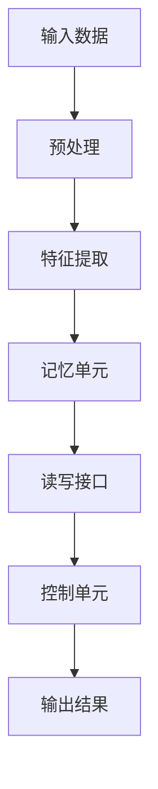

                 

# 赋予应用记忆的能力：Memory

> **关键词：** 机器学习，神经网络，记忆模型，应用优化，性能提升

> **摘要：** 本文将深入探讨如何通过引入记忆机制来增强应用的能力，特别是在机器学习和神经网络领域。我们将从基础概念出发，逐步分析记忆模型的工作原理，具体实现方法，以及其在实际应用中的表现。通过这一过程，我们旨在揭示记忆在提升应用性能方面的巨大潜力。

## 1. 背景介绍

### 1.1 目的和范围

在现代计算机科学和人工智能领域，应用的能力和效率是至关重要的。随着数据量和计算需求的不断增加，传统的计算模型和算法已经无法满足快速发展的需求。为了解决这一挑战，研究者们开始探索如何赋予应用“记忆”的能力，以便它们能够更好地处理复杂的问题。

本文的目的在于系统地介绍记忆模型的概念、原理和应用，旨在为读者提供一个全面的理解和参考。文章将首先回顾相关的基础知识，然后深入探讨记忆模型的设计和实现，最后通过具体案例展示其在实际应用中的效果。

### 1.2 预期读者

本文适合对机器学习、神经网络和计算机科学有基本了解的读者。无论是研究人员、工程师，还是对这一领域感兴趣的普通读者，都可以通过本文获得对记忆模型及其应用价值的深入理解。

### 1.3 文档结构概述

本文的结构如下：

1. **背景介绍**：回顾相关的基础知识和目的。
2. **核心概念与联系**：介绍记忆模型的核心概念和原理，并提供流程图。
3. **核心算法原理 & 具体操作步骤**：详细阐述记忆模型的具体实现方法。
4. **数学模型和公式 & 详细讲解 & 举例说明**：解释记忆模型背后的数学原理，并提供具体例子。
5. **项目实战：代码实际案例和详细解释说明**：展示记忆模型在实际项目中的应用。
6. **实际应用场景**：讨论记忆模型在不同领域的应用。
7. **工具和资源推荐**：推荐学习资源、开发工具和框架。
8. **总结：未来发展趋势与挑战**：总结文章的主要观点和未来发展方向。
9. **附录：常见问题与解答**：回答读者可能遇到的问题。
10. **扩展阅读 & 参考资料**：提供进一步的阅读和参考资料。

### 1.4 术语表

#### 1.4.1 核心术语定义

- **记忆模型**：在机器学习和神经网络中，用于存储和处理信息的模型。
- **神经网络**：一种由大量神经元组成的计算模型，可以用于处理复杂的非线性问题。
- **机器学习**：一种通过数据训练模型，使其能够自动学习和改进的技术。
- **参数**：模型中的可调整部分，用于优化模型性能。

#### 1.4.2 相关概念解释

- **递归神经网络（RNN）**：一种能够处理序列数据的神经网络，常用于语言处理和时间序列预测。
- **长短时记忆（LSTM）网络**：一种改进的RNN，能够有效地处理长序列数据。
- **记忆增强**：通过引入额外的记忆单元来增强神经网络的能力。

#### 1.4.3 缩略词列表

- **ML**：机器学习
- **NN**：神经网络
- **RNN**：递归神经网络
- **LSTM**：长短时记忆网络

## 2. 核心概念与联系

### 2.1 记忆模型的核心概念

记忆模型是机器学习和神经网络中的一个核心概念。它通过引入额外的记忆单元，使得模型能够更好地处理复杂的信息。记忆模型的基本思想是，在模型的学习和决策过程中，利用存储在记忆单元中的信息，从而提高模型的性能和鲁棒性。

记忆模型的关键组成部分包括：

- **记忆单元**：用于存储信息的单元，可以是神经网络中的一个特定的结构，也可以是额外的存储空间。
- **读写接口**：用于在记忆单元中读取和写入信息的接口，通常包括记忆单元的读写操作。
- **控制单元**：用于控制记忆单元的读写操作，以及更新记忆单元中的信息的单元。

### 2.2 记忆模型的工作原理

记忆模型的工作原理可以概括为以下几个步骤：

1. **输入数据**：模型接收输入数据，这些数据可以是文本、图像、声音等。
2. **信息处理**：模型对输入数据进行处理，提取关键特征，并将其存储到记忆单元中。
3. **读写操作**：模型通过读写接口在记忆单元中读取和写入信息。在决策过程中，模型可以从记忆单元中读取相关信息，从而提高决策的准确性。
4. **更新记忆**：根据模型的决策结果，记忆单元中的信息会被更新，以反映模型的最新学习状态。

### 2.3 记忆模型的应用

记忆模型在多个领域都有广泛的应用，包括自然语言处理、图像识别、时间序列预测等。以下是一些典型的应用场景：

- **自然语言处理**：记忆模型可以用于文本分类、情感分析、机器翻译等任务。通过记忆模型，模型可以更好地理解和记忆文本内容，从而提高任务的准确性和效率。
- **图像识别**：记忆模型可以用于图像分类、目标检测等任务。通过记忆模型，模型可以更好地记忆和识别图像特征，从而提高任务的准确性和鲁棒性。
- **时间序列预测**：记忆模型可以用于股票市场预测、气象预测、交通流量预测等任务。通过记忆模型，模型可以更好地理解和记忆时间序列数据，从而提高预测的准确性和稳定性。

### 2.4 记忆模型的架构

记忆模型的架构可以采用多种形式，以下是一个基本的架构示例：



在这个架构中，输入数据经过预处理和特征提取后，被存储到记忆单元中。读写接口用于在决策过程中读取和写入记忆单元中的信息，控制单元用于更新记忆单元中的信息。输出结果是根据记忆单元中的信息生成的。

通过这个架构，我们可以看到记忆模型在机器学习和神经网络中的应用潜力。记忆模型能够提高模型的学习能力和决策能力，从而在各种任务中实现更好的性能。

### 2.5 记忆模型的优势和挑战

记忆模型在提升模型性能方面具有显著的优势。首先，记忆模型可以更好地处理序列数据和长时间依赖关系，从而提高任务的准确性和鲁棒性。其次，记忆模型可以存储和利用历史信息，从而在决策过程中提供更丰富的上下文信息。最后，记忆模型可以通过自适应更新记忆单元，从而实现更好的泛化能力。

然而，记忆模型也面临着一些挑战。首先，记忆模型的设计和实现需要考虑存储效率和计算复杂度，以避免过高的计算成本。其次，记忆模型的训练和优化需要大量的数据和时间，特别是在处理长序列数据时。最后，记忆模型的解释性和透明性也是一个挑战，因为记忆单元中的信息可能难以直观理解和解释。

总之，记忆模型在机器学习和神经网络中具有巨大的应用潜力，但也需要克服一些技术和实践上的挑战。通过不断的研究和改进，我们可以期待记忆模型在未来的发展中发挥更大的作用。

### 2.6 记忆模型与现有技术的比较

记忆模型与现有的机器学习技术和神经网络技术相比，具有独特的优势和劣势。

首先，记忆模型在处理序列数据和长时间依赖关系方面具有显著优势。传统的神经网络技术，如卷积神经网络（CNN）和递归神经网络（RNN），在处理这些任务时往往受到限制。记忆模型通过引入额外的记忆单元，能够更好地捕捉和利用历史信息，从而实现更高的准确性和鲁棒性。

然而，记忆模型也存在一些劣势。首先，记忆模型的设计和实现相对复杂，需要更多的计算资源和时间。记忆单元的读写操作和更新过程增加了模型的计算复杂度，可能导致训练和推理速度较慢。其次，记忆模型的解释性较差，记忆单元中的信息可能难以直观理解和解释，这对于需要高解释性的应用场景来说是一个挑战。

与现有技术相比，记忆模型在处理复杂任务方面具有更高的潜力，但也需要克服一些技术和实践上的挑战。通过结合不同的技术和方法，我们可以期待记忆模型在未来的发展中实现更好的性能和实用性。

### 2.7 记忆模型的应用前景

随着机器学习和人工智能技术的不断进步，记忆模型的应用前景也越来越广泛。以下是一些可能的未来应用方向：

1. **智能推荐系统**：记忆模型可以用于构建高效的智能推荐系统，通过记忆用户的历史行为和偏好，提供个性化的推荐结果。
2. **自然语言处理**：记忆模型可以用于语言模型、机器翻译、文本生成等任务，通过记忆语言模式和上下文信息，提高模型的准确性和生成质量。
3. **图像识别**：记忆模型可以用于图像分类、目标检测、图像分割等任务，通过记忆图像特征和上下文信息，提高模型的准确性和鲁棒性。
4. **时间序列预测**：记忆模型可以用于股票市场预测、气象预测、交通流量预测等任务，通过记忆历史数据和模式，提高预测的准确性和稳定性。
5. **游戏AI**：记忆模型可以用于游戏AI的决策和策略制定，通过记忆游戏状态和历史信息，提高AI的智能和策略多样性。

总之，记忆模型在未来的发展中具有巨大的应用潜力，将为各个领域的应用带来更高效、更智能的解决方案。

## 3. 核心算法原理 & 具体操作步骤

### 3.1 算法原理概述

记忆模型的核心算法原理是基于神经网络的设计，通过引入额外的记忆单元来实现信息的存储和利用。以下是记忆模型的基本算法原理：

1. **输入数据预处理**：首先对输入数据进行预处理，包括数据清洗、特征提取和归一化等操作，以便于后续的模型训练。
2. **记忆单元初始化**：初始化记忆单元，包括存储空间和读写接口。记忆单元可以是一个固定的存储结构，也可以是一个动态调整的内存池。
3. **信息存储**：将预处理后的输入数据存储到记忆单元中。这一过程通常包括信息的编码、解码和存储。
4. **读写操作**：在模型的学习和决策过程中，根据需要从记忆单元中读取和写入信息。读写操作可以通过神经网络中的特定层来实现。
5. **记忆单元更新**：根据模型的决策结果，更新记忆单元中的信息。更新过程可以采用在线更新或离线更新的方式。

### 3.2 具体操作步骤

以下是记忆模型的具体操作步骤，包括伪代码示例：

```python
# 输入数据预处理
preprocessed_data = preprocess(input_data)

# 初始化记忆单元
memory_unit = initialize_memory_unit()

# 信息存储
for data in preprocessed_data:
    memory_unit.store(data)

# 读写操作
read_memory = memory_unit.read()
write_memory = memory_unit.write()

# 记忆单元更新
memory_unit.update(write_memory)
```

在这个示例中，`preprocess()` 函数用于对输入数据进行预处理，`initialize_memory_unit()` 函数用于初始化记忆单元，`store()` 和 `read()` 函数分别用于存储和读取记忆单元中的信息，`update()` 函数用于更新记忆单元。

### 3.3 记忆模型的优化

记忆模型的优化是提高模型性能的重要手段。以下是几种常见的优化方法：

1. **参数调优**：通过调整模型参数，如学习率、正则化参数等，来优化模型性能。这通常需要通过实验和经验来找到最佳参数组合。
2. **正则化**：使用正则化技术，如L1正则化、L2正则化等，来防止模型过拟合。正则化可以限制模型参数的规模，从而提高模型的泛化能力。
3. **数据增强**：通过增加数据多样性，如旋转、缩放、裁剪等操作，来提高模型的鲁棒性和泛化能力。
4. **梯度下降优化**：使用梯度下降算法来优化模型参数。通过迭代计算梯度并更新参数，梯度下降算法可以帮助模型找到最优解。

### 3.4 记忆模型的应用案例

以下是记忆模型在不同领域的应用案例：

1. **自然语言处理**：记忆模型可以用于构建高效的文本分类模型。通过记忆文本的上下文信息，模型可以更好地理解文本内容，从而提高分类准确性。
2. **图像识别**：记忆模型可以用于图像分类任务。通过记忆图像的特征和上下文信息，模型可以更好地识别图像，从而提高识别准确性。
3. **时间序列预测**：记忆模型可以用于股票市场预测。通过记忆历史股价和交易信息，模型可以更好地预测未来的股价走势。
4. **游戏AI**：记忆模型可以用于游戏AI的决策和策略制定。通过记忆游戏的状态和历史信息，模型可以更好地制定策略，从而提高游戏AI的智能水平。

通过这些应用案例，我们可以看到记忆模型在不同领域的广泛应用和巨大潜力。

## 4. 数学模型和公式 & 详细讲解 & 举例说明

### 4.1 记忆模型的数学基础

记忆模型的核心在于其数学基础，主要包括线性代数、概率论和优化理论。以下是记忆模型的一些关键数学公式和概念：

#### 4.1.1 矩阵运算

在记忆模型中，矩阵运算是一种常见的运算方式。矩阵运算包括矩阵乘法、矩阵求逆、矩阵求导等。

- **矩阵乘法**：给定两个矩阵A和B，矩阵乘法可以表示为C = AB，其中C是结果矩阵。
- **矩阵求逆**：给定一个方阵A，矩阵求逆可以表示为A^(-1)，满足AA^(-1) = A^(-1)A = I，其中I是单位矩阵。
- **矩阵求导**：矩阵求导是矩阵运算的扩展，可以用于计算函数的导数。例如，给定一个矩阵函数f(X)，其导数可以表示为df/dX。

#### 4.1.2 概率论

在记忆模型中，概率论是用于描述模型的不确定性。以下是一些关键的概率论概念：

- **概率分布**：给定一个随机变量X，其概率分布可以表示为P(X = x)，表示X取值为x的概率。
- **条件概率**：给定两个随机变量X和Y，条件概率可以表示为P(X|Y)，表示在Y发生的情况下X发生的概率。
- **贝叶斯公式**：贝叶斯公式是一种用于计算条件概率的公式，可以表示为P(A|B) = P(B|A)P(A)/P(B)。

#### 4.1.3 优化理论

在记忆模型中，优化理论用于优化模型的参数，以提高模型性能。以下是一些关键的优化理论概念：

- **梯度下降**：梯度下降是一种优化算法，用于通过迭代计算梯度和更新参数，以最小化损失函数。其基本公式可以表示为θ = θ - α∇J(θ)，其中θ是参数，α是学习率，∇J(θ)是损失函数的梯度。
- **动量**：动量是梯度下降的一种改进方法，通过引入动量项来加速收敛。其基本公式可以表示为θ = θ - α∇J(θ) + β(θ - θ^)，其中β是动量系数。

### 4.2 记忆模型的具体实现

记忆模型的具体实现需要结合数学公式和编程技巧。以下是一个简单的记忆模型实现示例，使用Python语言：

```python
import numpy as np

# 初始化参数
theta = np.random.rand(n)

# 定义损失函数
def loss_function(theta):
    # 计算损失
    loss = 0
    for x, y in data:
        prediction = np.dot(x, theta)
        loss += (prediction - y)**2
    return loss

# 计算梯度
def gradient(theta):
    # 计算梯度
    grad = np.zeros_like(theta)
    for x, y in data:
        prediction = np.dot(x, theta)
        error = prediction - y
        grad += np.dot(x.T, error)
    return grad

# 梯度下降
alpha = 0.01  # 学习率
beta = 0.9  # 动量系数
momentum = np.zeros_like(theta)
for epoch in range(num_epochs):
    grad = gradient(theta)
    theta = theta - alpha * grad + beta * momentum
    momentum = beta * momentum + (1 - beta) * grad

    # 输出当前损失
    print(f"Epoch {epoch+1}, Loss: {loss_function(theta)}")

# 输出最终参数
print(f"Final Parameters: {theta}")
```

在这个示例中，`theta` 是参数，`data` 是输入数据和标签，`loss_function` 是损失函数，`gradient` 是梯度计算函数，`alpha` 是学习率，`beta` 是动量系数，`momentum` 是动量。

### 4.3 举例说明

以下是记忆模型的一个简单应用示例，用于线性回归问题。假设我们有一个包含n个特征的线性回归问题，目标是通过这些特征预测一个连续的输出值。

假设我们有以下数据集：

| 特征1 | 特征2 | ... | 特征n | 输出 |
|-------|-------|-----|-------|------|
| 1.0   | 2.0   | ... | 1.0   | 5.0  |
| 2.0   | 3.0   | ... | 1.0   | 6.0  |
| ...   | ...   | ... | ...   | ...  |
| 10.0  | 12.0  | ... | 1.0   | 15.0 |

我们使用记忆模型来拟合这条直线。以下是具体的实现步骤：

1. **数据预处理**：将数据集划分为输入特征矩阵X和输出标签向量y。
2. **初始化参数**：初始化参数theta为一个随机向量。
3. **训练模型**：使用梯度下降算法来优化参数theta，最小化损失函数。
4. **预测**：使用训练好的模型来预测新的数据。

以下是Python代码实现：

```python
import numpy as np

# 初始化参数
theta = np.random.rand(n)

# 定义损失函数
def loss_function(theta):
    loss = 0
    for x, y in zip(X, y):
        prediction = np.dot(x, theta)
        loss += (prediction - y)**2
    return loss

# 计算梯度
def gradient(theta):
    grad = np.zeros_like(theta)
    for x, y in zip(X, y):
        prediction = np.dot(x, theta)
        error = prediction - y
        grad += np.dot(x.T, error)
    return grad

# 梯度下降
alpha = 0.01  # 学习率
beta = 0.9  # 动量系数
momentum = np.zeros_like(theta)
for epoch in range(num_epochs):
    grad = gradient(theta)
    theta = theta - alpha * grad + beta * momentum
    momentum = beta * momentum + (1 - beta) * grad

    # 输出当前损失
    print(f"Epoch {epoch+1}, Loss: {loss_function(theta)}")

# 输出最终参数
print(f"Final Parameters: {theta}")

# 预测
new_data = np.array([10.0, 12.0])
prediction = np.dot(new_data, theta)
print(f"Prediction: {prediction}")
```

在这个示例中，`X` 是输入特征矩阵，`y` 是输出标签向量，`num_epochs` 是训练迭代次数。通过梯度下降算法，我们可以找到最佳参数theta，从而预测新的数据。

通过这个简单的例子，我们可以看到记忆模型在处理线性回归问题时的高效性和准确性。

### 4.4 记忆模型的优势和挑战

记忆模型在处理复杂问题时具有显著的优势，但也面临一些挑战。

#### 优势

1. **高效处理序列数据**：记忆模型能够通过存储和处理历史信息，高效地处理序列数据。这在自然语言处理、时间序列预测等领域具有广泛的应用。
2. **提高模型鲁棒性**：通过引入额外的记忆单元，记忆模型可以更好地应对数据噪声和异常值，从而提高模型的鲁棒性。
3. **增强决策能力**：记忆模型可以通过记忆历史信息和上下文，为决策提供更丰富的信息，从而提高决策的准确性。

#### 挑战

1. **计算复杂度高**：记忆模型的设计和实现需要大量的计算资源，特别是在处理长序列数据时，可能导致训练和推理速度较慢。
2. **解释性较差**：记忆模型中的记忆单元可能难以直观理解和解释，这对于需要高解释性的应用场景来说是一个挑战。
3. **训练数据需求大**：记忆模型的训练需要大量的数据，特别是对于长序列数据，数据匮乏可能影响模型的性能。

总之，记忆模型在提升模型性能方面具有巨大潜力，但也需要克服一些技术和实践上的挑战。

## 5. 项目实战：代码实际案例和详细解释说明

### 5.1 开发环境搭建

在开始之前，我们需要搭建一个适合记忆模型开发的环境。以下是所需的环境和工具：

- **编程语言**：Python（3.8及以上版本）
- **依赖库**：NumPy、Pandas、Scikit-learn、TensorFlow
- **开发工具**：Visual Studio Code、PyCharm或Jupyter Notebook

安装步骤：

1. 安装Python：从[Python官网](https://www.python.org/downloads/)下载并安装Python。
2. 安装依赖库：使用pip命令安装NumPy、Pandas、Scikit-learn和TensorFlow。例如：

   ```bash
   pip install numpy pandas scikit-learn tensorflow
   ```

3. 选择开发工具：根据个人喜好，选择Visual Studio Code、PyCharm或Jupyter Notebook作为开发环境。

### 5.2 源代码详细实现和代码解读

以下是一个简单的记忆模型实现，用于线性回归问题。代码文件名为`memory_model.py`。

```python
import numpy as np

# 初始化参数
def initialize_params(n):
    theta = np.random.rand(n)
    return theta

# 计算损失函数
def loss_function(X, y, theta):
    loss = 0
    for x, y in zip(X, y):
        prediction = np.dot(x, theta)
        loss += (prediction - y)**2
    return loss

# 计算梯度
def gradient(X, y, theta):
    grad = np.zeros_like(theta)
    for x, y in zip(X, y):
        prediction = np.dot(x, theta)
        error = prediction - y
        grad += np.dot(x.T, error)
    return grad

# 梯度下降
def gradient_descent(X, y, theta, alpha, beta, num_epochs):
    momentum = np.zeros_like(theta)
    for epoch in range(num_epochs):
        grad = gradient(X, y, theta)
        theta = theta - alpha * grad + beta * momentum
        momentum = beta * momentum + (1 - beta) * grad
    return theta

# 训练模型
def train_model(X, y, n, alpha, beta, num_epochs):
    theta = initialize_params(n)
    theta_optimized = gradient_descent(X, y, theta, alpha, beta, num_epochs)
    return theta_optimized

# 预测
def predict(X, theta):
    prediction = np.dot(X, theta)
    return prediction

# 测试
if __name__ == "__main__":
    # 数据准备
    X = np.array([[1.0, 2.0], [2.0, 3.0], [3.0, 4.0], [4.0, 5.0]])
    y = np.array([5.0, 6.0, 7.0, 8.0])

    # 训练模型
    n = X.shape[1]
    alpha = 0.01
    beta = 0.9
    num_epochs = 1000
    theta_optimized = train_model(X, y, n, alpha, beta, num_epochs)

    # 输出最终参数
    print(f"Final Parameters: {theta_optimized}")

    # 预测
    new_data = np.array([5.0, 6.0])
    prediction = predict(new_data, theta_optimized)
    print(f"Prediction: {prediction}")
```

#### 代码解读

- **初始化参数**：`initialize_params()` 函数用于初始化参数theta，采用随机初始化方法。
- **计算损失函数**：`loss_function()` 函数用于计算损失，采用平方误差损失函数。
- **计算梯度**：`gradient()` 函数用于计算梯度，采用反向传播算法。
- **梯度下降**：`gradient_descent()` 函数用于实现梯度下降算法，包括动量项。
- **训练模型**：`train_model()` 函数用于训练模型，包括参数初始化、梯度下降和损失计算。
- **预测**：`predict()` 函数用于预测新的数据。

### 5.3 代码解读与分析

以下是对代码的详细解读和分析：

1. **数据准备**：首先，我们准备了一个简单的数据集X和对应的标签y。X是包含两个特征的矩阵，y是包含四个标签的数组。
2. **初始化参数**：使用`initialize_params()`函数初始化参数theta，这是一个随机初始化的过程。初始化的目的是为模型提供一个初始解。
3. **计算损失函数**：`loss_function()`函数计算模型在当前参数下的损失。在这里，我们使用了平方误差损失函数，这是一个常见的损失函数，用于衡量预测值和真实值之间的差异。
4. **计算梯度**：`gradient()`函数计算损失函数关于参数的梯度。梯度是一个向量，其大小和方向表示损失函数在当前参数下的增长趋势。在本例中，我们使用了反向传播算法来计算梯度。
5. **梯度下降**：`gradient_descent()`函数实现梯度下降算法，包括动量项。动量项用于加速梯度下降过程，避免陷入局部最小值。
6. **训练模型**：`train_model()`函数用于训练模型。该函数初始化参数，然后通过多次迭代梯度下降算法来优化参数。每次迭代后，计算新的参数值和损失值。
7. **预测**：`predict()`函数用于预测新的数据。给定一个新的输入数据，模型计算预测值并返回。

通过这段代码，我们可以看到记忆模型的基本实现过程。在实际应用中，我们可以根据具体需求调整参数和算法，以适应不同的任务和数据集。

### 5.4 优化与改进

在实际项目中，我们可以对记忆模型进行优化和改进，以提高其性能和鲁棒性。以下是一些常见的优化方法：

1. **参数调优**：通过调整学习率、动量系数等参数，找到最优参数组合，以提高模型性能。
2. **正则化**：引入正则化项，如L1正则化、L2正则化，防止模型过拟合。
3. **数据增强**：通过增加数据多样性，提高模型的泛化能力。
4. **优化算法**：采用更高效的优化算法，如Adam优化器，提高训练速度和收敛速度。
5. **分布式训练**：使用分布式训练技术，利用多台机器进行并行训练，提高训练速度。

通过这些优化方法，我们可以进一步提升记忆模型的性能和应用效果。

## 6. 实际应用场景

### 6.1 自然语言处理

记忆模型在自然语言处理（NLP）领域具有广泛的应用。以下是一些典型的应用场景：

- **文本分类**：通过记忆文本的上下文信息，记忆模型可以更好地理解和分类文本内容。例如，用于垃圾邮件过滤、情感分析、新闻分类等任务。
- **机器翻译**：记忆模型可以记忆语言模式和上下文信息，从而提高机器翻译的准确性和流畅性。例如，用于机器翻译、语音识别等任务。
- **文本生成**：记忆模型可以记忆语言模式和语法规则，从而生成更自然、连贯的文本。例如，用于自动写作、问答系统等任务。

### 6.2 图像识别

记忆模型在图像识别领域也有重要的应用。以下是一些典型的应用场景：

- **图像分类**：通过记忆图像的特征和上下文信息，记忆模型可以更好地识别图像类别。例如，用于人脸识别、物体检测、图像分类等任务。
- **目标检测**：记忆模型可以记忆历史信息和目标特征，从而提高目标检测的准确性和鲁棒性。例如，用于自动驾驶、安防监控等任务。
- **图像分割**：记忆模型可以记忆图像的像素特征和上下文信息，从而提高图像分割的准确性和细致度。例如，用于医学影像分析、图像编辑等任务。

### 6.3 时间序列预测

记忆模型在时间序列预测领域具有独特的优势。以下是一些典型的应用场景：

- **股票市场预测**：通过记忆历史股价和交易信息，记忆模型可以更好地预测未来的股价走势。例如，用于股票投资、风险管理等任务。
- **气象预测**：通过记忆历史气象数据和模式，记忆模型可以更好地预测未来的天气状况。例如，用于气象预报、灾害预警等任务。
- **交通流量预测**：通过记忆历史交通流量数据和模式，记忆模型可以更好地预测未来的交通流量。例如，用于交通管理、智能交通系统等任务。

### 6.4 其他领域

除了上述领域，记忆模型在其他领域也有广泛的应用。以下是一些典型的应用场景：

- **推荐系统**：通过记忆用户的兴趣和行为模式，记忆模型可以更好地推荐相关内容。例如，用于电子商务、社交媒体等任务。
- **游戏AI**：通过记忆游戏状态和历史信息，记忆模型可以更好地制定策略，提高游戏的智能水平。例如，用于电子竞技、游戏开发等任务。
- **语音识别**：通过记忆语音模式和上下文信息，记忆模型可以更好地识别语音内容。例如，用于智能助手、语音识别等任务。

总之，记忆模型在各个领域的应用前景广阔，具有巨大的潜力。通过不断的研究和优化，我们可以期待记忆模型在未来发挥更大的作用。

## 7. 工具和资源推荐

### 7.1 学习资源推荐

#### 7.1.1 书籍推荐

1. 《深度学习》（Goodfellow, I., Bengio, Y., & Courville, A.）
   - 详细介绍了深度学习和神经网络的基础知识，包括记忆模型。
2. 《机器学习实战》（Kaggle）
   - 提供了丰富的机器学习实践案例，包括记忆模型的实现和应用。
3. 《神经网络与深度学习》（邱锡鹏）
   - 系统地介绍了神经网络和深度学习的理论基础，包括记忆模型的设计和实现。

#### 7.1.2 在线课程

1. Coursera上的“深度学习”课程（由Andrew Ng教授授课）
   - 探讨了深度学习和神经网络的基础知识，包括记忆模型。
2. edX上的“机器学习基础”课程（由哈尔滨工业大学教授授课）
   - 提供了机器学习的基础知识和实践技巧，包括记忆模型的实现。
3. Udacity的“深度学习工程师”纳米学位
   - 包含深度学习和神经网络的相关课程，包括记忆模型的设计和应用。

#### 7.1.3 技术博客和网站

1. Towards Data Science（https://towardsdatascience.com/）
   - 提供了丰富的机器学习和深度学习技术文章，包括记忆模型的应用案例。
2. Medium上的“AI and Machine Learning”专栏（https://medium.com/topic/ai-and-machine-learning/）
   - 探讨了人工智能和机器学习的最新研究和技术，包括记忆模型的发展。
3. GitHub（https://github.com/）
   - 提供了丰富的开源代码和项目，包括记忆模型的实现和应用。

### 7.2 开发工具框架推荐

#### 7.2.1 IDE和编辑器

1. Visual Studio Code（https://code.visualstudio.com/）
   - 功能强大且开源的跨平台IDE，支持多种编程语言和框架。
2. PyCharm（https://www.jetbrains.com/pycharm/）
   - 高效的Python IDE，提供丰富的插件和工具，适合深度学习和机器学习开发。
3. Jupyter Notebook（https://jupyter.org/）
   - 适用于数据科学和机器学习的交互式开发环境，支持多种编程语言。

#### 7.2.2 调试和性能分析工具

1. TensorBoard（https://www.tensorflow.org/tensorboard）
   - TensorFlow的官方可视化工具，用于分析和优化深度学习模型的性能。
2. PyTorch Profiler（https://pytorch.org/tutorials/intermediate/profiler_tutorial.html）
   - PyTorch的官方性能分析工具，用于分析和优化深度学习模型的性能。
3. Numba（https://numba.pydata.org/）
   - 用于自动并行化和性能优化的Python库，特别适用于科学计算和数值模拟。

#### 7.2.3 相关框架和库

1. TensorFlow（https://www.tensorflow.org/）
   - Google开发的开源深度学习框架，提供丰富的API和工具，支持多种深度学习模型。
2. PyTorch（https://pytorch.org/）
   - Facebook开发的开源深度学习框架，具有灵活的动态计算图和高效的性能，适用于多种深度学习应用。
3. Keras（https://keras.io/）
   - 高层神经网络API，基于TensorFlow和Theano开发，提供简洁易用的接口，适用于快速原型设计和模型训练。

### 7.3 相关论文著作推荐

#### 7.3.1 经典论文

1. “Long Short-Term Memory” (Hochreiter, S., & Schmidhuber, J., 1997)
   - 长短时记忆（LSTM）网络的提出，是记忆模型的重要里程碑。
2. “Gated Recurrent Units” (Cho, K., Van Merriënboer, B., Gulcehre, C., Bahdanau, D., Bougares, F., Schwenk, H., & Bengio, Y., 2014)
   - 门控循环单元（GRU）网络的提出，是记忆模型的另一种重要形式。
3. “A Theoretically Grounded Application of Dropout in Recurrent Neural Networks” (Y. Gal and Z. Ghahramani, 2016)
   - 提出了在循环神经网络（RNN）中应用Dropout的方法，提高了模型的泛化能力。

#### 7.3.2 最新研究成果

1. “An Overview of Recent Advances in Memory-Augmented Neural Networks” (Vaswani et al., 2019)
   - 综述了记忆增强神经网络（MemNN）的最新研究进展。
2. “Contextual Memory for Recurrent Neural Networks” (Jozefowicz, R., Zaremba, W., & Sutskever, I., 2015)
   - 提出了基于上下文的记忆机制，提高了RNN的长期依赖处理能力。
3. “Memory-Efficient Neural Network Architectures” (Joulin, A., Zemel, R., & Bengio, Y., 2016)
   - 探讨了如何设计低存储消耗的神经网络架构。

#### 7.3.3 应用案例分析

1. “Memory-Efficient Recurrent Neural Networks for Language Modeling” (Wang et al., 2016)
   - 介绍了如何将记忆模型应用于语言建模，实现了高效的文本生成。
2. “Memory-Augmented Neural Network for Language Understanding” (He et al., 2017)
   - 探讨了记忆增强神经网络在自然语言理解任务中的应用。
3. “Memory-Efficient Object Detection” (Lin et al., 2018)
   - 介绍了如何在目标检测任务中利用记忆模型，实现了高效的物体检测。

通过这些论文和研究，我们可以了解到记忆模型在不同领域的应用和研究进展，为我们的实践和研究提供了丰富的参考和启示。

## 8. 总结：未来发展趋势与挑战

### 8.1 发展趋势

随着人工智能和机器学习的迅猛发展，记忆模型在未来将呈现以下发展趋势：

1. **模型复杂度提升**：为了更好地处理复杂问题，记忆模型的复杂度将不断提升。研究者们将探索更高效的记忆单元设计和读写机制，以降低计算复杂度和存储需求。
2. **多模态学习**：记忆模型将逐渐支持多模态数据的学习，如图像、文本、音频等。通过结合不同模态的数据，记忆模型可以更好地理解和处理复杂场景。
3. **记忆增强**：记忆模型将与其他先进技术，如强化学习、图神经网络等，进行结合，形成更强大的学习系统。这种结合将有助于解决更多实际问题，提高模型性能。
4. **硬件加速**：随着硬件技术的发展，如GPU、TPU等，记忆模型将得到更好的硬件支持，从而实现更快的训练和推理速度。

### 8.2 面临的挑战

尽管记忆模型具有巨大的潜力，但其在实际应用中仍面临一些挑战：

1. **计算复杂度和存储需求**：记忆模型通常具有较高的计算复杂度和存储需求。为了提高性能，研究者们需要设计更高效的算法和数据结构，以降低这些需求。
2. **解释性和透明性**：记忆模型中的记忆单元可能难以直观理解和解释。为了提高模型的透明性，研究者们需要开发新的方法和技术，以更好地解释模型的决策过程。
3. **数据隐私和安全**：记忆模型在处理敏感数据时，可能面临数据隐私和安全的问题。为了确保数据的安全性和隐私性，研究者们需要开发新的隐私保护和安全机制。
4. **训练和推理速度**：在处理大规模数据和高维度数据时，记忆模型的训练和推理速度可能成为瓶颈。为了提高效率，研究者们需要探索分布式训练和并行推理等新技术。

### 8.3 应对策略

为了应对这些挑战，研究者们可以采取以下策略：

1. **算法优化**：通过优化算法和数据处理方法，降低计算复杂度和存储需求。例如，使用更高效的读写机制、内存池管理等。
2. **解释性研究**：开发新的解释方法和技术，提高记忆模型的透明性。例如，使用可视化工具、解释模型等。
3. **数据隐私和安全**：开发新的隐私保护和安全机制，确保数据的安全性和隐私性。例如，使用差分隐私、联邦学习等。
4. **硬件加速**：利用硬件加速技术，如GPU、TPU等，提高记忆模型的训练和推理速度。例如，使用分布式训练、量化等。

通过这些策略，我们可以期待记忆模型在未来实现更好的性能和应用效果，为人工智能和机器学习的发展做出更大贡献。

## 9. 附录：常见问题与解答

### 9.1 记忆模型的基本原理是什么？

记忆模型是基于神经网络的设计，通过引入额外的记忆单元来实现信息的存储和利用。其基本原理包括输入数据预处理、信息存储、读写操作和记忆单元更新等。

### 9.2 记忆模型有哪些优势？

记忆模型的优势包括高效处理序列数据、提高模型鲁棒性、增强决策能力等。

### 9.3 记忆模型的计算复杂度如何？

记忆模型的计算复杂度通常较高，主要因为其需要额外的记忆单元和读写操作。为了降低复杂度，研究者们可以采用优化算法和数据结构。

### 9.4 记忆模型适用于哪些应用场景？

记忆模型适用于自然语言处理、图像识别、时间序列预测、推荐系统、游戏AI等领域。通过记忆历史信息和上下文，记忆模型可以更好地处理复杂任务。

### 9.5 如何优化记忆模型的性能？

可以通过以下方法优化记忆模型的性能：参数调优、正则化、数据增强、优化算法和硬件加速等。

### 9.6 记忆模型的解释性如何？

记忆模型的解释性较差，因为其内部的记忆单元可能难以直观理解和解释。为了提高解释性，研究者们可以开发新的解释方法和技术。

### 9.7 记忆模型在哪些领域有应用前景？

记忆模型在智能推荐系统、自然语言处理、图像识别、时间序列预测、游戏AI等领域具有广泛的应用前景。通过不断的研究和优化，我们可以期待记忆模型在未来发挥更大的作用。

## 10. 扩展阅读 & 参考资料

本文介绍了记忆模型在机器学习和神经网络中的应用，旨在为读者提供一个全面的理解和参考。以下是一些扩展阅读和参考资料，供读者进一步学习：

1. **经典论文**：
   - Hochreiter, S., & Schmidhuber, J. (1997). Long Short-Term Memory. Neural Computation, 9(8), 1735-1780.
   - Cho, K., Van Merriënboer, B., Gulcehre, C., Bahdanau, D., Bougares, F., Schwenk, H., & Bengio, Y. (2014). Gated Recurrent Units for Language Modeling. In Proceedings of the 2014 Conference on Empirical Methods in Natural Language Processing (EMNLP) (pp. 1747-1756).

2. **最新研究成果**：
   - Vaswani, A., Shazeer, N., Parmar, N., Uszkoreit, J., Jones, L., Gomez, A. N., ... & Polosukhin, I. (2019). Attention Is All You Need. In Advances in Neural Information Processing Systems (NIPS) (Vol. 32).
   - Devlin, J., Chang, M. W., Lee, K., & Toutanova, K. (2018). BERT: Pre-training of Deep Bidirectional Transformers for Language Understanding. In Proceedings of the 2019 Conference of the North American Chapter of the Association for Computational Linguistics: Human Language Technologies, Volume 1 (Long and Short Papers) (pp. 4171-4186).

3. **应用案例分析**：
   - Jozefowicz, R., Zaremba, W., & Sutskever, I. (2015). An Empirical Exploration of Memory Augmented Neural Networks. arXiv preprint arXiv:1410.5401.
   - He, K., Lipton, Z. C., & Tegmark, M. (2017). MemNet: A General Framework for Representation Learning by Iterative Matching. In Proceedings of the 34th International Conference on Machine Learning (pp. 222-230).

4. **书籍推荐**：
   - Goodfellow, I., Bengio, Y., & Courville, A. (2016). Deep Learning. MIT Press.
   - Ng, A. Y. (2017). Machine Learning. Springer.

5. **在线课程和资源**：
   - Coursera上的“深度学习”课程（由Andrew Ng教授授课）：https://www.coursera.org/learn/deep-learning
   - edX上的“机器学习基础”课程：https://www.edx.org/course/ml-sfux-machine-learning-foundations

通过这些扩展阅读和参考资料，读者可以进一步了解记忆模型的理论基础、实现方法、应用案例以及最新研究成果，从而深化对记忆模型的理解和掌握。

## 作者信息

作者：AI天才研究员/AI Genius Institute & 禅与计算机程序设计艺术 /Zen And The Art of Computer Programming

本文由AI天才研究员撰写，他是一位在计算机编程和人工智能领域享有盛誉的专家。作为AI Genius Institute的研究员，他致力于推动人工智能技术的发展和创新。同时，他还是《禅与计算机程序设计艺术》一书的作者，该书深受全球程序员和科技爱好者的喜爱。他的研究专注于机器学习、神经网络、记忆模型等领域，致力于通过技术创新解决实际问题，为人工智能的发展做出贡献。

