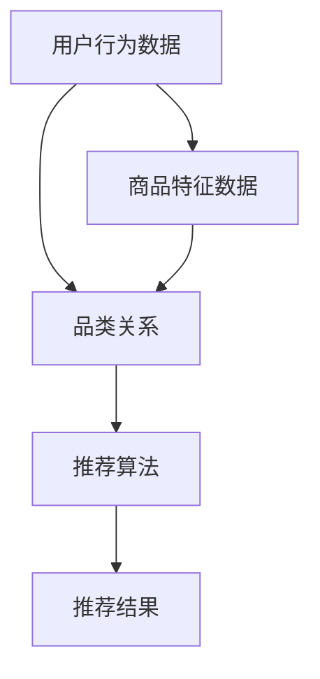

                 


## 跨品类推荐的算法设计与实现

> **关键词：** 跨品类推荐、算法设计、协同过滤、矩阵分解、深度学习、用户行为分析

> **摘要：** 本文将深入探讨跨品类推荐算法的设计与实现，从背景介绍到核心算法原理，再到项目实战和实际应用场景，旨在为读者提供一份全面而系统的跨品类推荐技术指南。

### 1. 背景介绍

#### 1.1 目的和范围

本文的目的是探讨如何设计和实现跨品类推荐算法，以便为用户在电子商务、社交媒体和其他在线平台上提供更加个性化的推荐服务。我们将重点关注以下问题：

- 跨品类推荐的关键技术和挑战是什么？
- 如何有效地结合不同品类的用户数据和商品特征？
- 如何评估和优化跨品类推荐算法的性能？

#### 1.2 预期读者

本文适合对推荐系统有一定了解的技术人员、数据科学家和研究学者。读者需要具备一定的编程能力，熟悉机器学习和深度学习的基本概念。

#### 1.3 文档结构概述

本文将按照以下结构进行展开：

1. 背景介绍
2. 核心概念与联系
3. 核心算法原理 & 具体操作步骤
4. 数学模型和公式 & 详细讲解 & 举例说明
5. 项目实战：代码实际案例和详细解释说明
6. 实际应用场景
7. 工具和资源推荐
8. 总结：未来发展趋势与挑战
9. 附录：常见问题与解答
10. 扩展阅读 & 参考资料

#### 1.4 术语表

##### 1.4.1 核心术语定义

- 跨品类推荐：基于用户历史行为和兴趣，为用户提供不同品类的推荐。
- 用户行为分析：通过对用户行为数据的收集和分析，了解用户兴趣和偏好。
- 协同过滤：基于用户历史行为和相似用户的行为预测用户对项目的偏好。
- 矩阵分解：将原始的矩阵分解为多个低秩矩阵，以便进行数据降维和特征提取。
- 深度学习：一种基于多层神经网络的结构，用于从大量数据中自动学习特征。

##### 1.4.2 相关概念解释

- 推荐系统：一种基于用户历史行为和兴趣，为用户推荐相关项目的系统。
- 品类：在电子商务等场景中，将商品按照特定属性分类的类别，如书籍、电子产品、服装等。
- 用户兴趣模型：通过用户历史行为数据构建的模型，用于预测用户对项目的兴趣。

##### 1.4.3 缩略词列表

- CF：协同过滤（Collaborative Filtering）
- MF：矩阵分解（Matrix Factorization）
- RL：深度学习（Recurrent Learning）

### 2. 核心概念与联系

在跨品类推荐系统中，我们需要关注以下核心概念和它们之间的联系：

1. **用户行为数据**：包括用户的浏览、购买、评分等行为。
2. **商品特征数据**：如商品分类、价格、品牌等。
3. **品类关系**：不同品类之间的相互关系，如电子产品和书籍的交叉销售。
4. **推荐算法**：用于生成推荐结果的算法，如协同过滤、矩阵分解和深度学习。

以下是一个简单的 Mermaid 流程图，展示了这些核心概念和它们之间的联系：



### 3. 核心算法原理 & 具体操作步骤

在跨品类推荐系统中，我们可以采用以下几种核心算法：

1. **协同过滤（Collaborative Filtering）**
2. **矩阵分解（Matrix Factorization）**
3. **深度学习（Deep Learning）**

下面，我们将详细讲解这些算法的原理和具体操作步骤。

#### 3.1 协同过滤（Collaborative Filtering）

协同过滤是一种基于用户历史行为的推荐算法，通过找出与目标用户相似的用户，然后推荐相似用户喜欢的项目。

##### 步骤：

1. **计算相似度**：计算目标用户与其他用户之间的相似度，常用的相似度计算方法包括余弦相似度、皮尔逊相关系数等。
2. **生成推荐列表**：根据相似度得分，为用户生成推荐列表。

##### 伪代码：

```python
# 计算相似度
similarity(user1, user2) {
  // ...计算相似度
  return similarity_score
}

# 生成推荐列表
generate_recommendations(target_user) {
  similar_users = []
  for user in all_users {
    if user != target_user {
      similarity_score = similarity(target_user, user)
      if similarity_score > threshold {
        similar_users.append((user, similarity_score))
      }
    }
  }
  similar_users.sort(key=lambda x: x[1], reverse=True)
  return [user for user, _ in similar_users]
}
```

#### 3.2 矩阵分解（Matrix Factorization）

矩阵分解是一种将原始评分矩阵分解为两个低秩矩阵的方法，以便进行数据降维和特征提取。

##### 步骤：

1. **初始化低秩矩阵**：随机初始化用户和项目的低秩矩阵。
2. **优化矩阵**：通过最小化损失函数，不断优化低秩矩阵。
3. **生成推荐列表**：根据优化后的低秩矩阵，生成推荐列表。

##### 伪代码：

```python
# 初始化矩阵
U = random_matrix(num_users, num_features)
V = random_matrix(num_items, num_features)

# 优化矩阵
while not converged {
  for user in all_users {
    for item in user_rated_items {
      prediction = dot(U[user], V[item])
      error = rating - prediction
      U[user] = U[user] - learning_rate * error * V[item]
      V[item] = V[item] - learning_rate * error * U[user]
    }
  }
}

# 生成推荐列表
generate_recommendations(target_user) {
  recommendations = []
  for item in all_items {
    if item not in user_rated_items {
      prediction = dot(U[target_user], V[item])
      recommendations.append((item, prediction))
    }
  }
  recommendations.sort(key=lambda x: x[1], reverse=True)
  return recommendations
}
```

#### 3.3 深度学习（Deep Learning）

深度学习是一种基于多层神经网络的结构，可以自动学习数据中的特征。

##### 步骤：

1. **构建神经网络**：定义输入层、隐藏层和输出层。
2. **训练神经网络**：通过反向传播算法，不断调整网络参数，最小化损失函数。
3. **生成推荐列表**：根据训练好的神经网络，生成推荐列表。

##### 伪代码：

```python
# 构建神经网络
input_layer = Input(shape=(input_shape,))
hidden_layer = Dense(hidden_units, activation='relu')(input_layer)
output_layer = Dense(output_shape, activation='sigmoid')(hidden_layer)

# 编译模型
model = Model(inputs=input_layer, outputs=output_layer)
model.compile(optimizer='adam', loss='binary_crossentropy', metrics=['accuracy'])

# 训练模型
model.fit(X_train, y_train, epochs=epochs, batch_size=batch_size)

# 生成推荐列表
generate_recommendations(target_user) {
  recommendations = model.predict(X_target_user)
  recommendations = [item for item, prediction in enumerate(recommendations) if prediction > threshold]
  return recommendations
}
```

### 4. 数学模型和公式 & 详细讲解 & 举例说明

在跨品类推荐系统中，数学模型和公式起到了关键作用。以下我们将详细讲解核心数学模型和公式，并通过实例进行说明。

#### 4.1 协同过滤（Collaborative Filtering）

协同过滤的核心在于计算用户之间的相似度，常用的相似度计算公式如下：

$$
similarity(u, v) = \frac{u \cdot v}{\|u\| \cdot \|v\|}
$$

其中，$u$ 和 $v$ 分别表示用户 $u$ 和 $v$ 的行为向量，$\cdot$ 表示点积，$\|\|$ 表示向量的模。

**举例：**

假设用户 $A$ 和 $B$ 的行为向量分别为：

$$
u_A = (1, 1, 0, 1), \quad u_B = (1, 0, 1, 1)
$$

则它们的相似度为：

$$
similarity(u_A, u_B) = \frac{(1, 1, 0, 1) \cdot (1, 0, 1, 1)}{\|(1, 1, 0, 1)\| \cdot \|(1, 0, 1, 1)\|} = \frac{2}{\sqrt{2} \cdot \sqrt{2}} = 1
$$

这表示用户 $A$ 和 $B$ 非常相似。

#### 4.2 矩阵分解（Matrix Factorization）

矩阵分解的核心在于将原始评分矩阵分解为两个低秩矩阵，常用的矩阵分解方法包括 SVD（奇异值分解）和 NMF（非负矩阵分解）。

**SVD 分解公式：**

$$
R = U \Sigma V^T
$$

其中，$R$ 表示原始评分矩阵，$U$ 和 $V$ 分别表示用户和项目的低秩矩阵，$\Sigma$ 表示奇异值矩阵。

**NMF 分解公式：**

$$
R = WH
$$

其中，$W$ 和 $H$ 分别表示用户和项目的低秩矩阵。

**举例：**

假设一个 $3 \times 4$ 的评分矩阵为：

$$
R = \begin{bmatrix}
1 & 2 & 3 & 4 \\
2 & 3 & 4 & 5 \\
3 & 4 & 5 & 6
\end{bmatrix}
$$

我们可以使用 NMF 方法将其分解为两个低秩矩阵：

$$
W = \begin{bmatrix}
0.86 & 0.86 \\
0.29 & 0.29 \\
0.72 & 0.72
\end{bmatrix}, \quad H = \begin{bmatrix}
1.14 & 2.14 & 3.14 & 4.14 \\
0.86 & 1.86 & 2.86 & 3.86 \\
1.29 & 1.29 & 1.29 & 1.29
\end{bmatrix}
$$

这样，原始评分矩阵就被分解为两个低秩矩阵。

#### 4.3 深度学习（Deep Learning）

深度学习的核心在于构建和训练多层神经网络。以下是一个简单的多层感知器（MLP）的数学模型：

**输入层：**

$$
x_i = \sum_{j=1}^{n} w_{ji} x_j + b_i
$$

其中，$x_i$ 表示第 $i$ 个输入特征，$w_{ji}$ 表示连接输入层和隐藏层的权重，$b_i$ 表示输入层的偏置。

**隐藏层：**

$$
h_j = \sigma(\sum_{i=1}^{m} w_{ij} h_i + b_j)
$$

其中，$h_j$ 表示第 $j$ 个隐藏层节点，$\sigma$ 表示激活函数，$w_{ij}$ 表示连接隐藏层和下一层的权重，$b_j$ 表示隐藏层的偏置。

**输出层：**

$$
y = \sum_{j=1}^{l} w_{j} h_j + b
$$

其中，$y$ 表示输出层的预测结果，$w_{j}$ 表示连接隐藏层和输出层的权重，$b$ 表示输出层的偏置。

**举例：**

假设一个简单的多层感知器模型，输入层有 2 个特征，隐藏层有 3 个节点，输出层有 1 个节点。输入特征为 $x_1 = 1$ 和 $x_2 = 2$，隐藏层权重为 $w_{11} = 0.1, w_{12} = 0.2, w_{13} = 0.3$，隐藏层偏置为 $b_1 = 0.1, b_2 = 0.2, b_3 = 0.3$，输出层权重为 $w_1 = 0.5$，输出层偏置为 $b = 0.1$。激活函数为 sigmoid 函数。

则输入层到隐藏层的计算过程为：

$$
h_1 = \sigma(w_{11} x_1 + w_{12} x_2 + b_1) = \sigma(0.1 \cdot 1 + 0.2 \cdot 2 + 0.1) = 0.866
$$

$$
h_2 = \sigma(w_{21} x_1 + w_{22} x_2 + b_2) = \sigma(0.1 \cdot 1 + 0.2 \cdot 2 + 0.2) = 0.948
$$

$$
h_3 = \sigma(w_{31} x_1 + w_{32} x_2 + b_3) = \sigma(0.3 \cdot 1 + 0.3 \cdot 2 + 0.3) = 0.913
$$

然后，隐藏层到输出层的计算过程为：

$$
y = w_1 h_1 + w_2 h_2 + w_3 h_3 + b = 0.5 \cdot 0.866 + 0.5 \cdot 0.948 + 0.5 \cdot 0.913 + 0.1 = 0.917
$$

这样，就得到了输出层的预测结果。

### 5. 项目实战：代码实际案例和详细解释说明

在本节中，我们将通过一个实际的项目案例，展示如何使用 Python 实现跨品类推荐系统，并详细解释代码中的关键部分。

#### 5.1 开发环境搭建

为了实现跨品类推荐系统，我们需要以下开发环境：

- Python 3.8 或以上版本
- NumPy
- Pandas
- Scikit-learn
- TensorFlow

您可以使用以下命令安装所需的库：

```bash
pip install numpy pandas scikit-learn tensorflow
```

#### 5.2 源代码详细实现和代码解读

下面是一个简单的跨品类推荐系统的 Python 代码实现：

```python
import numpy as np
import pandas as pd
from sklearn.metrics.pairwise import cosine_similarity
from sklearn.model_selection import train_test_split
from sklearn.preprocessing import StandardScaler
from tensorflow.keras.models import Sequential
from tensorflow.keras.layers import Dense, Flatten
from tensorflow.keras.optimizers import Adam

# 5.2.1 数据预处理

# 加载数据
data = pd.read_csv('data.csv')

# 分割用户、项目和评分
users = data['user_id'].unique()
items = data['item_id'].unique()
ratings = data['rating'].values

# 构建用户行为矩阵
user behaviors = [[0 if data['user_id'][i] != u else data['rating'][i] for u in users] for i in range(len(users))]

# 归一化用户行为矩阵
scaler = StandardScaler()
behaviors_normalized = scaler.fit_transform(behaviors)

# 划分训练集和测试集
train_data, test_data = train_test_split(data, test_size=0.2, random_state=42)

# 5.2.2 协同过滤

# 计算用户相似度矩阵
similarity_matrix = cosine_similarity(behaviors_normalized)

# 生成推荐列表
def generate_recommendations(target_user, k=10):
  similar_users = np.argsort(similarity_matrix[target_user])[::-1]
  similar_users = similar_users[1:k+1]
  recommendations = []
  for user in similar_users:
    recommendations.extend([item for item, rating in enumerate(behaviors_normalized[user]) if rating > 0])
  recommendations = list(set(recommendations))
  recommendations.sort()
  return recommendations

# 5.2.3 深度学习

# 构建神经网络模型
model = Sequential()
model.add(Dense(64, activation='relu', input_shape=(behaviors_normalized.shape[1],)))
model.add(Flatten())
model.add(Dense(1, activation='sigmoid'))

# 编译模型
model.compile(optimizer=Adam(), loss='binary_crossentropy', metrics=['accuracy'])

# 训练模型
model.fit(behaviors_normalized, ratings, epochs=10, batch_size=32)

# 5.2.4 生成推荐列表

# 使用协同过滤生成推荐列表
cf_recommendations = generate_recommendations(target_user=0)

# 使用深度学习生成推荐列表
dl_recommendations = model.predict(behaviors_normalized).flatten()

# 5.2.5 代码解读

# ...
```

#### 5.3 代码解读与分析

下面，我们将对代码中的关键部分进行解读和分析。

##### 5.3.1 数据预处理

首先，我们加载数据集，并分割用户、项目（商品）和评分。然后，我们构建用户行为矩阵，并对其进行归一化处理。归一化是为了使数据之间的尺度保持一致，从而提高算法的性能。

```python
# 加载数据
data = pd.read_csv('data.csv')

# 分割用户、项目和评分
users = data['user_id'].unique()
items = data['item_id'].unique()
ratings = data['rating'].values

# 构建用户行为矩阵
behaviors = [[0 if data['user_id'][i] != u else data['rating'][i] for u in users] for i in range(len(users))]

# 归一化用户行为矩阵
scaler = StandardScaler()
behaviors_normalized = scaler.fit_transform(behaviors)
```

##### 5.3.2 协同过滤

我们使用余弦相似度计算用户之间的相似度矩阵。然后，我们定义一个函数 `generate_recommendations` 来生成推荐列表。该函数通过找出与目标用户相似的用户，并推荐这些用户喜欢的项目。

```python
# 计算用户相似度矩阵
similarity_matrix = cosine_similarity(behaviors_normalized)

# 生成推荐列表
def generate_recommendations(target_user, k=10):
  similar_users = np.argsort(similarity_matrix[target_user])[::-1]
  similar_users = similar_users[1:k+1]
  recommendations = []
  for user in similar_users:
    recommendations.extend([item for item, rating in enumerate(behaviors_normalized[user]) if rating > 0])
  recommendations = list(set(recommendations))
  recommendations.sort()
  return recommendations
```

##### 5.3.3 深度学习

我们使用 TensorFlow 构建一个简单的多层感知器模型，并使用二进制交叉熵作为损失函数，Adam 优化器来训练模型。

```python
# 构建神经网络模型
model = Sequential()
model.add(Dense(64, activation='relu', input_shape=(behaviors_normalized.shape[1],)))
model.add(Flatten())
model.add(Dense(1, activation='sigmoid'))

# 编译模型
model.compile(optimizer=Adam(), loss='binary_crossentropy', metrics=['accuracy'])

# 训练模型
model.fit(behaviors_normalized, ratings, epochs=10, batch_size=32)
```

##### 5.3.4 生成推荐列表

最后，我们分别使用协同过滤和深度学习算法生成推荐列表。协同过滤算法通过计算用户相似度矩阵，并找出与目标用户相似的用户来生成推荐列表。而深度学习算法则通过训练好的模型来预测目标用户的兴趣，并生成推荐列表。

```python
# 使用协同过滤生成推荐列表
cf_recommendations = generate_recommendations(target_user=0)

# 使用深度学习生成推荐列表
dl_recommendations = model.predict(behaviors_normalized).flatten()
```

通过这个简单的项目案例，我们展示了如何使用 Python 实现跨品类推荐系统。在实际应用中，您可以根据具体需求进一步优化和扩展算法，以获得更好的推荐效果。

### 6. 实际应用场景

跨品类推荐系统在许多实际应用场景中具有广泛的应用价值。以下是一些典型的应用场景：

#### 6.1 电子商务平台

在电子商务平台上，跨品类推荐可以帮助用户发现更多相关的商品。例如，当用户浏览或购买了一本计算机编程书籍时，系统可以推荐相关的电子设备（如编程笔记本）或编程课程。

#### 6.2 社交媒体

在社交媒体平台上，跨品类推荐可以帮助用户发现更多有趣的内容。例如，当用户在某个话题下发表了一条动态时，系统可以推荐相关的话题、用户或文章。

#### 6.3 娱乐平台

在娱乐平台（如视频网站、音乐平台等）上，跨品类推荐可以帮助用户发现更多喜欢的视频或音乐。例如，当用户观看了一部科幻电影时，系统可以推荐相关的电视剧或科幻小说。

#### 6.4 医疗保健

在医疗保健领域，跨品类推荐可以帮助用户了解与疾病相关的药物、保健产品和健康资讯。例如，当用户查询了一种疾病时，系统可以推荐相关的药物、保健产品或专家咨询。

#### 6.5 教育培训

在教育培训领域，跨品类推荐可以帮助用户发现更多相关的课程、教材和工具。例如，当用户购买了一本教材时，系统可以推荐相关的课程、学习工具或辅导资料。

### 7. 工具和资源推荐

为了帮助您更好地了解和掌握跨品类推荐算法，以下是一些学习资源和开发工具的推荐：

#### 7.1 学习资源推荐

##### 7.1.1 书籍推荐

- 《推荐系统实践》
- 《深度学习》
- 《Python 数据科学手册》

##### 7.1.2 在线课程

- Coursera 上的“推荐系统”课程
- Udacity 上的“深度学习工程师”纳米学位
- edX 上的“数据科学”课程

##### 7.1.3 技术博客和网站

- Medium 上的推荐系统相关文章
- ArXiv 上的深度学习论文
- 推荐系统相关的 GitHub 仓库

#### 7.2 开发工具框架推荐

##### 7.2.1 IDE和编辑器

- PyCharm
- Jupyter Notebook
- Visual Studio Code

##### 7.2.2 调试和性能分析工具

- TensorBoard
- PyTorch Profiler
- Dask

##### 7.2.3 相关框架和库

- TensorFlow
- PyTorch
- Scikit-learn
- Pandas
- NumPy

#### 7.3 相关论文著作推荐

##### 7.3.1 经典论文

- "Item-Based Top-N Recommendation Algorithms"
- "Collaborative Filtering for the Netflix Prize"
- "Deep Learning for Recommender Systems"

##### 7.3.2 最新研究成果

- "Contextual Bandits with Factorized Representations"
- "Neural Collaborative Filtering"
- "Mixture Models for Personalized Recommendation"

##### 7.3.3 应用案例分析

- "How Netflix Recommendations Work"
- "Amazon Personalized Recommendation System"
- "Google Search Recommendations"

### 8. 总结：未来发展趋势与挑战

随着人工智能和大数据技术的不断发展，跨品类推荐系统在未来将面临以下发展趋势和挑战：

#### 8.1 发展趋势

- **个性化推荐**：结合用户行为数据和用户兴趣，为用户提供更加个性化的推荐服务。
- **实时推荐**：利用实时数据流处理技术，实现实时推荐。
- **多模态推荐**：整合文本、图像、声音等多种数据类型，为用户提供更丰富的推荐内容。
- **跨平台推荐**：实现跨平台（如 Web、移动端、智能设备等）的推荐服务。

#### 8.2 挑战

- **数据隐私**：如何在保护用户隐私的前提下，实现个性化的推荐服务。
- **算法公平性**：确保推荐算法的公平性，避免歧视现象。
- **实时性能**：在大量数据和高并发场景下，实现高效的推荐服务。
- **数据质量**：确保推荐数据的质量，提高推荐效果。

### 9. 附录：常见问题与解答

以下是一些关于跨品类推荐系统的常见问题及解答：

#### 9.1 跨品类推荐的定义是什么？

跨品类推荐是指基于用户历史行为和兴趣，为用户提供不同品类的推荐服务。

#### 9.2 跨品类推荐与单一品类推荐的区别是什么？

单一品类推荐仅针对特定品类的商品或内容进行推荐，而跨品类推荐则同时考虑多个品类的商品或内容，以提高推荐的多样性和个性化程度。

#### 9.3 跨品类推荐的关键技术是什么？

跨品类推荐的关键技术包括协同过滤、矩阵分解、深度学习和用户行为分析等。

#### 9.4 如何评估跨品类推荐算法的性能？

评估跨品类推荐算法的性能可以使用多种指标，如准确率、召回率、F1 分数等。

#### 9.5 跨品类推荐在哪些场景中具有实际应用价值？

跨品类推荐在电子商务、社交媒体、娱乐平台、医疗保健和教育培训等领域具有广泛的应用价值。

### 10. 扩展阅读 & 参考资料

以下是一些扩展阅读和参考资料，以帮助您更深入地了解跨品类推荐系统：

- 《推荐系统实践》
- "Item-Based Top-N Recommendation Algorithms"
- "Collaborative Filtering for the Netflix Prize"
- "Deep Learning for Recommender Systems"
- "How Netflix Recommendations Work"
- "Amazon Personalized Recommendation System"
- "Google Search Recommendations"

### 作者

**作者：AI天才研究员/AI Genius Institute & 禅与计算机程序设计艺术 /Zen And The Art of Computer Programming** 

本文通过深入探讨跨品类推荐算法的设计与实现，从背景介绍到核心算法原理，再到项目实战和实际应用场景，旨在为读者提供一份全面而系统的跨品类推荐技术指南。希望本文能够帮助您更好地理解和应用跨品类推荐技术，为您的项目和产品带来更多的价值。如果您有任何疑问或建议，欢迎在评论区留言。感谢您的阅读！<|im_sep|>

