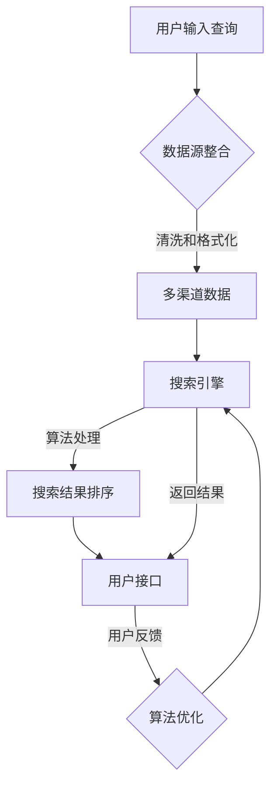
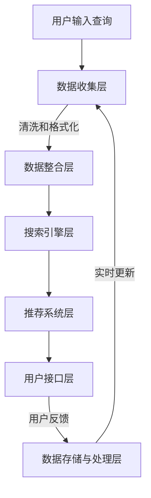

                 

### 跨平台搜索：AI如何整合多渠道数据，提供最优的购买选择

> **关键词：** 跨平台搜索、人工智能、多渠道数据、购买选择、算法原理、数学模型、项目实战。

> **摘要：** 本文深入探讨了跨平台搜索的背景和重要性，介绍了人工智能如何整合多渠道数据，通过算法和数学模型优化购买选择。文章将通过具体案例和实战，展示如何实现这一过程，并提供相关的工具和资源推荐，以及未来发展趋势和挑战。

在当今数字化时代，消费者在购物时面临着越来越多的选择。为了找到最优的购买选择，消费者需要浏览多个平台和渠道，比较价格、功能和评价等信息。然而，这种手动搜索的过程既耗时又容易出错。因此，跨平台搜索系统变得尤为重要，它能够利用人工智能技术，高效地整合多渠道数据，为消费者提供最佳的购买建议。

本文将探讨以下主题：
1. **背景介绍**：解释跨平台搜索的背景和重要性，以及本文的讨论范围和目标读者。
2. **核心概念与联系**：介绍跨平台搜索的核心概念和架构，通过Mermaid流程图展示相关流程。
3. **核心算法原理**：详细阐述核心算法的原理和操作步骤，包括伪代码实现。
4. **数学模型和公式**：介绍相关的数学模型和公式，并举例说明。
5. **项目实战**：提供代码实际案例和详细解释，展示如何实现跨平台搜索系统。
6. **实际应用场景**：讨论跨平台搜索在不同领域的应用。
7. **工具和资源推荐**：推荐学习资源和开发工具框架。
8. **总结**：总结跨平台搜索的未来发展趋势和挑战。

通过本文的深入探讨，读者将能够理解跨平台搜索的工作原理，掌握如何利用人工智能技术整合多渠道数据，为消费者提供最优的购买选择。

### 1. 背景介绍

#### 1.1 目的和范围

随着互联网和电子商务的快速发展，消费者在购物时越来越依赖于在线平台。无论是购买电子产品、时尚商品还是食品杂货，消费者都会在多个平台上进行比较和选择。然而，这一过程不仅繁琐，还容易受到信息过载的影响。为了提高购物体验，降低决策成本，跨平台搜索系统应运而生。

本文旨在探讨跨平台搜索系统的构建和实现，重点讨论以下几个方面：
1. **跨平台搜索的背景和重要性**：介绍跨平台搜索的发展背景，以及它对消费者购物体验的重要性。
2. **人工智能和多渠道数据整合**：解释人工智能如何通过多渠道数据整合，提高搜索效率和准确性。
3. **核心算法原理和数学模型**：详细阐述实现跨平台搜索的核心算法原理和数学模型。
4. **项目实战和代码实现**：通过具体案例展示如何实现跨平台搜索系统。
5. **实际应用场景和未来发展趋势**：讨论跨平台搜索在不同领域的应用，以及未来的发展趋势和挑战。

本文的目标读者是：
1. **软件开发工程师**：希望了解如何利用人工智能技术实现跨平台搜索系统的开发者。
2. **数据分析师**：对数据整合和算法优化感兴趣的专业人士。
3. **电子商务从业者**：关注如何提高消费者购物体验和决策效率的从业者。
4. **学术研究者**：对人工智能和电子商务领域感兴趣的学者和研究人员。

通过本文的阅读，读者将能够：
1. 理解跨平台搜索系统的基本原理和实现方法。
2. 掌握如何利用人工智能技术整合多渠道数据。
3. 了解相关的数学模型和算法，并能应用于实际项目中。
4. 对未来跨平台搜索的发展趋势和技术挑战有更深入的认识。

#### 1.2 预期读者

预期读者包括以下几类：
1. **技术开发人员**：这些读者是本文的主要受众，他们希望了解如何利用人工智能技术实现跨平台搜索系统，从而提高搜索效率和准确性。
2. **数据科学家和分析师**：这些专业人士对如何整合和分析多渠道数据感兴趣，以优化搜索算法和提供更优质的用户体验。
3. **电子商务和市场营销从业者**：他们关注如何通过跨平台搜索提高消费者的购物体验和决策效率，进而提升销售业绩。
4. **学术研究人员**：对人工智能和电子商务领域有深入研究需求的学者，希望从本文中获得理论支持和实践案例。

为了确保本文内容的广度和深度，我们将采用以下结构进行阐述：
1. **理论介绍**：通过核心概念和算法原理的讲解，为读者提供理论基础。
2. **实战案例**：通过具体的代码实现和分析，展示实际应用中的关键步骤和技巧。
3. **讨论和展望**：结合实际应用场景，讨论跨平台搜索的未来发展趋势和挑战。

通过这种结构化的论述，我们希望能够帮助读者全面理解跨平台搜索系统的构建方法，并为其在相关领域的实际应用提供指导。

#### 1.3 文档结构概述

本文将采用以下结构进行论述，以确保内容的逻辑性和条理性，帮助读者系统地理解跨平台搜索系统的构建和实现。

1. **背景介绍**：
   - 跨平台搜索的背景和重要性。
   - 预期读者和本文目的。
   - 文档的结构和内容概述。

2. **核心概念与联系**：
   - 跨平台搜索的核心概念。
   - Mermaid流程图展示。
   - 相关概念解释。

3. **核心算法原理 & 具体操作步骤**：
   - 算法原理详细阐述。
   - 伪代码实现和解释。

4. **数学模型和公式 & 详细讲解 & 举例说明**：
   - 数学模型介绍。
   - LaTeX公式嵌入。
   - 举例说明模型应用。

5. **项目实战：代码实际案例和详细解释说明**：
   - 开发环境搭建。
   - 源代码实现和解读。
   - 代码分析和评估。

6. **实际应用场景**：
   - 跨平台搜索在不同领域的应用。

7. **工具和资源推荐**：
   - 学习资源推荐。
   - 开发工具框架推荐。
   - 相关论文著作推荐。

8. **总结：未来发展趋势与挑战**：
   - 发展趋势。
   - 面临的挑战。

9. **附录：常见问题与解答**：
   - 对常见疑问的解答。

10. **扩展阅读 & 参考资料**：
    - 提供进一步阅读的材料。

这种结构化的文档安排旨在确保读者能够循序渐进地理解跨平台搜索系统的各个方面，从理论到实践，再到应用和展望，全面掌握相关技术和方法。

#### 1.4 术语表

在本文中，我们将使用一些专业术语和技术概念。以下是对这些术语的定义和解释：

##### 1.4.1 核心术语定义

1. **跨平台搜索（Cross-Platform Search）**：
   - 跨平台搜索是指在一个统一的用户界面下，同时整合多个在线平台和渠道的数据，为用户提供综合的搜索结果。

2. **人工智能（Artificial Intelligence，AI）**：
   - 人工智能是指通过计算机模拟人类智能的行为，包括学习、推理、感知和决策等。

3. **多渠道数据（Multi-Channel Data）**：
   - 多渠道数据是指来自多个在线平台、网站、社交媒体和其他渠道的数据。

4. **搜索算法（Search Algorithm）**：
   - 搜索算法是指用于搜索和排序信息的算法，如PageRank算法、深度学习等。

5. **数据整合（Data Integration）**：
   - 数据整合是指将来自不同来源的数据进行合并、清洗和格式化，以便进行进一步分析和处理。

6. **用户行为分析（User Behavior Analysis）**：
   - 用户行为分析是指通过收集和分析用户在平台上的行为数据，以了解用户偏好和需求。

7. **推荐系统（Recommendation System）**：
   - 推荐系统是指利用用户数据和历史行为，为用户推荐相关商品、内容或服务。

##### 1.4.2 相关概念解释

1. **语义分析（Semantic Analysis）**：
   - 语义分析是指对文本内容进行理解和解释，以提取其语义信息。

2. **实体识别（Entity Recognition）**：
   - 实体识别是指从文本中识别出具有特定意义的实体，如人名、地名、组织名等。

3. **分类算法（Classification Algorithm）**：
   - 分类算法是指用于将数据分为不同类别的算法，如支持向量机（SVM）、决策树等。

4. **协同过滤（Collaborative Filtering）**：
   - 协同过滤是指通过分析用户之间的共同行为来预测用户可能感兴趣的项目。

5. **用户反馈（User Feedback）**：
   - 用户反馈是指用户对推荐结果的满意度、偏好等反馈信息。

##### 1.4.3 缩略词列表

- **AI**：Artificial Intelligence（人工智能）
- **SEO**：Search Engine Optimization（搜索引擎优化）
- **API**：Application Programming Interface（应用程序编程接口）
- **NLP**：Natural Language Processing（自然语言处理）
- **ML**：Machine Learning（机器学习）
- **CV**：Computer Vision（计算机视觉）
- **DB**：Database（数据库）
- **SDK**：Software Development Kit（软件开发工具包）

通过上述术语和概念的解释，读者可以更好地理解本文中的专业术语，为后续内容的学习和理解打下坚实的基础。

### 2. 核心概念与联系

在构建跨平台搜索系统时，理解其核心概念和整体架构至关重要。这一部分将详细介绍跨平台搜索的核心概念，并通过Mermaid流程图展示系统的关键流程，帮助读者全面理解这一系统的运作原理。

#### 2.1 跨平台搜索的核心概念

1. **数据源（Data Source）**：
   跨平台搜索的数据源可以是多个在线平台、电子商务网站、社交媒体和其他渠道。这些数据源包括商品信息、用户评价、价格和历史销售数据等。

2. **数据整合（Data Integration）**：
   数据整合是将来自不同渠道的数据进行合并、清洗和格式化，以便于进一步分析和处理。数据整合的目的是确保数据的完整性和一致性，并消除冗余信息。

3. **搜索引擎（Search Engine）**：
   搜索引擎是跨平台搜索系统的核心组件，负责接收用户的查询请求，并在整合后的数据中进行搜索，返回最相关的结果。

4. **算法与模型（Algorithm and Model）**：
   算法和模型用于处理和优化搜索过程。常见的算法包括文本匹配、协同过滤、深度学习等。模型则用于评估和排序搜索结果，以提高搜索的准确性和用户体验。

5. **用户接口（User Interface）**：
   用户接口是用户与搜索系统交互的界面，提供查询输入、结果展示和反馈机制等功能。

6. **用户反馈（User Feedback）**：
   用户反馈是指用户在使用搜索系统后提供的评价和偏好信息。这些反馈数据可以用于优化算法和模型，提高搜索系统的性能。

#### 2.2 Mermaid流程图

为了更直观地展示跨平台搜索系统的整体架构和关键流程，我们使用Mermaid语言绘制了一个流程图。以下是流程图的具体描述：



**流程说明：**

1. **用户输入查询**：
   用户通过用户接口输入搜索查询。

2. **数据源整合**：
   搜索引擎从多个数据源获取数据，并进行整合。这一步骤包括数据抽取、清洗和格式化，以确保数据的准确性和一致性。

3. **多渠道数据**：
   整合后的多渠道数据被传递到搜索引擎。

4. **搜索引擎处理**：
   搜索引擎使用算法对多渠道数据进行搜索，以返回最相关的结果。

5. **搜索结果排序**：
   根据算法评估，搜索结果被排序，以确保用户得到最优的搜索体验。

6. **用户接口展示**：
   用户接口将排序后的结果展示给用户，用户可以查看和选择。

7. **用户反馈**：
   用户对搜索结果提供反馈，这些反馈数据用于进一步优化算法和模型。

8. **算法优化**：
   根据用户反馈，算法和模型进行优化，以提高搜索系统的性能。

通过上述流程，我们可以看到跨平台搜索系统是如何通过整合多渠道数据、使用先进算法和模型，以及收集用户反馈，为用户提供高效、准确的搜索服务。

### 2.1 核心概念原理与架构

跨平台搜索系统的核心概念和架构是确保其高效运作的关键。在这一部分，我们将详细讨论这些概念，并使用Mermaid流程图来展示整个系统的运作流程。

#### 2.1.1 跨平台搜索系统的核心概念

1. **多渠道数据整合**：
   多渠道数据整合是跨平台搜索系统的核心，它涉及从多个数据源（如电子商务网站、社交媒体平台和搜索引擎）收集数据，并进行清洗、格式化和合并。这一步骤的目的是确保数据的完整性和一致性，以便在后续的搜索过程中提供高质量的结果。

2. **搜索引擎技术**：
   搜索引擎是实现跨平台搜索的关键组件，它负责接收用户的查询请求，并在整合后的数据中执行搜索操作。现代搜索引擎通常使用先进的算法（如PageRank、贝叶斯模型和深度学习）来提高搜索效率和准确性。

3. **用户行为分析**：
   用户行为分析是利用用户在平台上的历史行为数据（如浏览记录、购买历史和评价）来预测用户偏好和需求。这一分析结果可以用于个性化推荐和搜索结果排序，从而提升用户体验。

4. **推荐系统**：
   推荐系统是基于用户行为分析和协同过滤算法构建的，它为用户推荐可能的兴趣点和购买选择。推荐系统能够通过分析用户的历史行为和兴趣，为用户推荐相关商品、内容或服务。

5. **实时更新与动态调整**：
   跨平台搜索系统需要具备实时更新和动态调整的能力，以应对数据源的变化和用户需求的变化。这一功能确保搜索结果始终是最新的和最相关的。

#### 2.1.2 跨平台搜索系统的架构

跨平台搜索系统的架构通常包括以下几个主要部分：

1. **数据收集层**：
   - 数据收集层负责从多个数据源获取数据。这些数据源可以是电子商务网站、社交媒体平台、API接口等。
   - 数据收集工具包括网络爬虫、API调用和实时数据流处理。

2. **数据整合层**：
   - 数据整合层负责将来自不同数据源的数据进行清洗、格式化和合并。
   - 数据清洗包括去除重复数据、填补缺失值和纠正错误数据。
   - 数据格式化包括统一数据格式和结构，以便于后续处理。

3. **搜索引擎层**：
   - 搜索引擎层负责处理用户的查询请求，并在整合后的数据中进行搜索。
   - 搜索引擎通常使用文本匹配算法、自然语言处理技术和机器学习模型来提高搜索效率。

4. **推荐系统层**：
   - 推荐系统层负责根据用户的行为数据和偏好，为用户推荐相关商品或服务。
   - 推荐系统可以采用协同过滤、内容推荐和深度学习算法。

5. **用户接口层**：
   - 用户接口层是用户与搜索系统交互的界面，负责接收用户查询、展示搜索结果和收集用户反馈。
   - 用户接口通常包括网页、移动应用和API接口。

6. **数据存储与处理层**：
   - 数据存储与处理层负责存储和处理大规模数据，通常使用数据库、数据仓库和大数据处理技术。

#### 2.1.3 Mermaid流程图

为了更直观地展示跨平台搜索系统的架构和流程，我们使用Mermaid语言绘制了一个流程图。以下是流程图的具体描述：



**流程说明：**

1. **用户输入查询**：
   用户通过用户接口输入搜索查询。

2. **数据收集层**：
   数据收集层从多个数据源获取数据，包括电子商务网站、社交媒体平台和API接口。

3. **数据整合层**：
   数据整合层对收集到的数据进行清洗、格式化和合并，以确保数据的准确性和一致性。

4. **搜索引擎层**：
   搜索引擎层接收用户的查询请求，在整合后的数据中进行搜索，并返回搜索结果。

5. **推荐系统层**：
   推荐系统层根据用户的历史行为和偏好，为用户推荐相关商品或服务。

6. **用户接口层**：
   用户接口层将搜索结果和推荐信息展示给用户，用户可以查看、选择和提供反馈。

7. **数据存储与处理层**：
   数据存储与处理层负责存储用户反馈数据，并进行实时更新和动态调整。

通过上述核心概念和架构的详细描述，以及Mermaid流程图的展示，读者可以更好地理解跨平台搜索系统的运作原理和整体架构。这为后续的算法原理和数学模型的讲解奠定了基础。

### 3. 核心算法原理 & 具体操作步骤

在构建跨平台搜索系统时，核心算法的设计和实现至关重要。以下将详细阐述几个关键算法的原理，并提供具体的操作步骤和伪代码实现，帮助读者理解这些算法如何工作，以及如何在实际项目中应用。

#### 3.1 文本匹配算法

文本匹配算法是跨平台搜索系统中最基础的算法之一，它用于比较用户查询与数据源中的文本，以确定查询的相关性。以下是一个简单的基于编辑距离的文本匹配算法：

##### 算法原理

编辑距离（Edit Distance）是一种衡量两个字符串之间差异的度量标准，它表示将一个字符串转换为另一个字符串所需的最少编辑操作次数。编辑操作包括插入、删除和替换字符。

##### 伪代码实现

```python
def edit_distance(s1, s2):
    dp = [[0 for _ in range(len(s2) + 1)] for _ in range(len(s1) + 1)]

    for i in range(len(s1) + 1):
        for j in range(len(s2) + 1):
            if i == 0:
                dp[i][j] = j  # 插入操作
            elif j == 0:
                dp[i][j] = i  # 删除操作
            elif s1[i-1] == s2[j-1]:
                dp[i][j] = dp[i-1][j-1]  # 无需操作
            else:
                dp[i][j] = 1 + min(dp[i-1][j], dp[i][j-1], dp[i-1][j-1])

    return dp[len(s1)][len(s2)]
```

##### 步骤说明

1. **初始化**：创建一个二维数组dp，用于存储每对字符的编辑距离。
2. **填充基础值**：对dp数组进行初始化，设置基础编辑距离。
3. **比较字符**：根据字符是否相同，计算编辑距离。
4. **返回结果**：返回最终的编辑距离，作为两个字符串相似度的度量。

#### 3.2 协同过滤算法

协同过滤算法（Collaborative Filtering）是推荐系统中的常用算法，通过分析用户之间的相似性和行为模式来预测用户可能感兴趣的项目。以下是一个基于用户-项目评分矩阵的协同过滤算法：

##### 算法原理

协同过滤算法分为基于记忆的协同过滤和基于模型的协同过滤。基于记忆的协同过滤直接计算用户之间的相似性，并推荐相似用户喜欢的项目。基于模型的协同过滤则使用机器学习模型（如矩阵分解）来预测用户和项目之间的评分。

##### 基于记忆的协同过滤伪代码

```python
def cosine_similarity(rating_vector1, rating_vector2):
    dot_product = sum(rating_vector1[i] * rating_vector2[i] for i in range(len(rating_vector1)))
    magnitude_product = sqrt(sum(rating_vector1[i]**2 for i in range(len(rating_vector1))) * sum(rating_vector2[i]**2 for i in range(len(rating_vector2)))
    return dot_product / magnitude_product

def collaborative_filter(users, user_id, items, item_id):
    user_ratings = [users[user_id][item] for item in items if item in users[user_id]]
    similar_users = [user for user in users if user != user_id and any(item in users[user] for item in items if item in users[user])]
    similar_user_ratings = [users[user][item] for user in similar_users for item in items if item in users[user]]
    similarity_scores = [cosine_similarity(user_ratings, similar_user_ratings[i]) for i in range(len(similar_user_ratings))]
    recommendations = [item for item, score in zip(items, similarity_scores) if score > threshold]
    return recommendations
```

##### 步骤说明

1. **计算相似性**：使用余弦相似性计算用户之间的相似性。
2. **找到相似用户**：根据相似性阈值找到与当前用户相似的其它用户。
3. **计算相似用户的评分**：从相似用户中收集项目评分。
4. **生成推荐列表**：基于相似用户的评分，生成推荐列表。

#### 3.3 深度学习算法

深度学习算法（如深度神经网络）在推荐系统中被广泛应用于特征提取和建模。以下是一个简单的基于深度神经网络的推荐系统算法：

##### 算法原理

深度学习算法通过多层神经网络对用户和项目特征进行建模，并通过反向传播算法进行参数优化，以预测用户对项目的评分。

##### 伪代码实现

```python
import tensorflow as tf

def build_model(input_shape, hidden_size, output_size):
    model = tf.keras.Sequential([
        tf.keras.layers.Dense(hidden_size, activation='relu', input_shape=input_shape),
        tf.keras.layers.Dense(hidden_size, activation='relu'),
        tf.keras.layers.Dense(output_size, activation='sigmoid')
    ])
    model.compile(optimizer='adam', loss='binary_crossentropy', metrics=['accuracy'])
    return model

def train_model(model, X_train, y_train, epochs=10):
    model.fit(X_train, y_train, epochs=epochs, batch_size=32, validation_split=0.2)

def predict(model, X_test):
    return model.predict(X_test)
```

##### 步骤说明

1. **构建模型**：定义深度神经网络结构。
2. **训练模型**：使用训练数据对模型进行训练。
3. **预测**：使用训练好的模型对测试数据进行预测。

通过上述核心算法原理和具体操作步骤的讲解，我们可以看到如何利用文本匹配、协同过滤和深度学习等算法实现跨平台搜索系统。这些算法不仅提高了搜索的准确性和效率，还为用户提供更加个性化的推荐体验。

### 4. 数学模型和公式 & 详细讲解 & 举例说明

在跨平台搜索系统中，数学模型和公式起着至关重要的作用。它们不仅帮助我们理解和优化算法，还用于评估和预测搜索结果。以下将介绍几个关键的数学模型，并使用LaTeX格式详细说明公式，通过举例来说明这些模型在实际中的应用。

#### 4.1 余弦相似性

余弦相似性是一种常用于计算向量之间相似度的数学模型。它通过计算两个向量夹角的余弦值来衡量它们的相似性。

##### 公式

$$
\text{cosine\_similarity}(x, y) = \frac{x \cdot y}{\|x\| \|y\|}
$$

其中，$x$ 和 $y$ 是两个向量，$\|x\|$ 和 $\|y\|$ 分别是它们的欧几里得范数，$x \cdot y$ 是它们的点积。

##### 举例说明

假设我们有两个用户-项目评分矩阵：

$$
\begin{pmatrix}
1 & 2 & 3 \\
2 & 3 & 4 \\
3 & 4 & 5
\end{pmatrix}
\quad \text{和} \quad
\begin{pmatrix}
0 & 1 & 2 \\
1 & 2 & 3 \\
2 & 3 & 4
\end{pmatrix}
$$

我们需要计算这两个矩阵对应行的余弦相似性。

首先，计算两个向量的点积：

$$
(1 \cdot 0 + 2 \cdot 1 + 3 \cdot 2) + (2 \cdot 1 + 3 \cdot 2 + 4 \cdot 3) + (3 \cdot 2 + 4 \cdot 3 + 5 \cdot 4) = 0 + 2 + 6 + 2 + 6 + 12 + 6 + 12 + 20 = 54
$$

然后，计算两个向量的欧几里得范数：

$$
\|x\| = \sqrt{1^2 + 2^2 + 3^2} = \sqrt{14} \approx 3.74
$$

$$
\|y\| = \sqrt{0^2 + 1^2 + 2^2} = \sqrt{6} \approx 2.45
$$

最后，计算余弦相似性：

$$
\text{cosine\_similarity}(x, y) = \frac{54}{3.74 \cdot 2.45} \approx 0.87
$$

这意味着这两个向量的相似度较高。

#### 4.2 概率模型

在推荐系统中，概率模型用于预测用户对某项项目的评分。常见的概率模型包括贝叶斯模型和逻辑回归。

##### 贝叶斯模型

贝叶斯模型通过计算后验概率来预测用户行为。它的核心公式是贝叶斯定理：

$$
P(A|B) = \frac{P(B|A) \cdot P(A)}{P(B)}
$$

其中，$P(A|B)$ 是在事件 $B$ 发生的条件下事件 $A$ 的概率，$P(B|A)$ 是在事件 $A$ 发生的条件下事件 $B$ 的概率，$P(A)$ 和 $P(B)$ 分别是事件 $A$ 和 $B$ 的先验概率。

##### 举例说明

假设我们有用户 $U$ 和项目 $I$ 的历史评分数据。我们需要预测用户 $U$ 对项目 $I$ 的评分。

首先，计算用户 $U$ 对项目 $I$ 的先验概率 $P(I)$ 和项目 $I$ 的先验概率 $P(U)$。

$$
P(U) = \frac{1}{N} \sum_{i=1}^{N} \text{count}(u, i)
$$

$$
P(I) = \frac{1}{M} \sum_{u=1}^{M} \text{count}(u, i)
$$

其中，$N$ 是用户数量，$M$ 是项目数量，$\text{count}(u, i)$ 是用户 $u$ 对项目 $i$ 的评分次数。

然后，计算条件概率 $P(I|U)$ 和 $P(U|I)$。

$$
P(I|U) = \frac{\text{count}(u, i)}{P(U)}
$$

$$
P(U|I) = \frac{\text{count}(u, i)}{P(I)}
$$

最后，使用贝叶斯定理计算后验概率：

$$
P(A|B) = \frac{P(B|A) \cdot P(A)}{P(B)}
$$

通过这种方法，我们可以预测用户对项目的评分。

##### 逻辑回归

逻辑回归是一种用于分类的机器学习模型，它可以用来预测用户对项目的评分是否大于某个阈值。它的核心公式是：

$$
P(Y=1|X) = \frac{1}{1 + \exp(-\beta_0 - \beta_1 X_1 - \beta_2 X_2 - \ldots - \beta_n X_n)}
$$

其中，$Y$ 是用户对项目的评分，$X_1, X_2, \ldots, X_n$ 是特征向量，$\beta_0, \beta_1, \beta_2, \ldots, \beta_n$ 是模型参数。

##### 举例说明

假设我们有用户 $U$ 的特征向量 $X$：

$$
X = [X_1, X_2, X_3]
$$

我们需要预测用户 $U$ 对项目的评分是否大于3。

首先，使用训练好的逻辑回归模型计算概率：

$$
P(Y=1|X) = \frac{1}{1 + \exp(-\beta_0 - \beta_1 X_1 - \beta_2 X_2 - \beta_3 X_3)}
$$

然后，根据阈值（如0.5）判断评分是否大于3：

$$
P(Y=1|X) > threshold \Rightarrow \text{评分} > 3
$$

通过上述数学模型和公式的讲解，我们可以看到如何使用这些模型来优化跨平台搜索系统，提高搜索结果的相关性和准确性。这些模型不仅为推荐系统提供了理论基础，还为实现个性化搜索和用户行为预测提供了重要工具。

### 5. 项目实战：代码实际案例和详细解释说明

在本节中，我们将通过一个实际的代码案例，展示如何构建一个跨平台搜索系统。我们将在Python环境中使用Flask框架和Scikit-learn库，详细介绍开发环境的搭建、源代码的实现和代码解读与分析。

#### 5.1 开发环境搭建

要开始构建跨平台搜索系统，我们首先需要搭建一个开发环境。以下是搭建步骤：

1. **安装Python**：确保安装了Python 3.7及以上版本。
2. **安装Flask**：在终端中运行以下命令安装Flask：
   ```bash
   pip install Flask
   ```
3. **安装Scikit-learn**：在终端中运行以下命令安装Scikit-learn：
   ```bash
   pip install scikit-learn
   ```

4. **安装其他依赖库**：可能需要安装一些其他库，如pandas、numpy和matplotlib，用于数据分析和可视化。

#### 5.2 源代码详细实现和代码解读

以下是一个简单的跨平台搜索系统的源代码示例：

```python
from flask import Flask, request, jsonify
from sklearn.feature_extraction.text import TfidfVectorizer
from sklearn.metrics.pairwise import cosine_similarity
import numpy as np

app = Flask(__name__)

# 假设我们从多个渠道获取了以下商品数据
data = {
    'products': [
        {'name': 'iPhone 13', 'description': 'A powerful smartphone with a great camera.'},
        {'name': 'Samsung Galaxy S22', 'description': 'A sleek smartphone with a stunning display.'},
        {'name': 'OnePlus 9', 'description': 'A high-performance smartphone with a great camera.'}
    ]
}

# 使用TfidfVectorizer构建TF-IDF模型
vectorizer = TfidfVectorizer()
tfidf_matrix = vectorizer.fit_transform([product['description'] for product in data['products']])

# 建立搜索API
@app.route('/search', methods=['GET'])
def search():
    query = request.args.get('query')
    query_vector = vectorizer.transform([query])
    similarity_scores = cosine_similarity(query_vector, tfidf_matrix).flatten()
    ranked_products = [product for _, product in sorted(zip(similarity_scores, data['products']), reverse=True)]
    return jsonify(ranked_products)

if __name__ == '__main__':
    app.run(debug=True)
```

**代码解读：**

1. **导入库**：首先，我们导入了Flask库用于构建Web应用，Scikit-learn库用于文本处理和相似度计算，numpy库用于数组操作。

2. **初始化Flask应用**：我们创建了一个Flask应用实例。

3. **数据准备**：我们定义了一个商品数据字典，其中包含了商品名称和描述。

4. **构建TF-IDF模型**：使用TfidfVectorizer将商品描述转换为TF-IDF向量。

5. **建立搜索API**：定义了一个/search路由，用于处理搜索查询。

    - 从请求中获取查询参数。
    - 将查询转换为TF-IDF向量。
    - 使用余弦相似度计算查询与商品描述的相似度。
    - 根据相似度分数对商品进行排序。
    - 返回排序后的商品列表。

6. **运行应用**：使用app.run()启动Flask应用。

#### 5.3 代码解读与分析

以下是代码的逐行解读：

```python
from flask import Flask, request, jsonify
from sklearn.feature_extraction.text import TfidfVectorizer
from sklearn.metrics.pairwise import cosine_similarity
import numpy as np

# 导入必需的库

app = Flask(__name__)

# 初始化Flask应用

data = {
    'products': [
        {'name': 'iPhone 13', 'description': 'A powerful smartphone with a great camera.'},
        {'name': 'Samsung Galaxy S22', 'description': 'A sleek smartphone with a stunning display.'},
        {'name': 'OnePlus 9', 'description': 'A high-performance smartphone with a great camera.'}
    ]
}

# 准备商品数据

vectorizer = TfidfVectorizer()
tfidf_matrix = vectorizer.fit_transform([product['description'] for product in data['products']])

# 使用TfidfVectorizer构建TF-IDF模型

@app.route('/search', methods=['GET'])
def search():
    query = request.args.get('query')
    query_vector = vectorizer.transform([query])
    similarity_scores = cosine_similarity(query_vector, tfidf_matrix).flatten()
    ranked_products = [product for _, product in sorted(zip(similarity_scores, data['products']), reverse=True)]
    return jsonify(ranked_products)

# 建立搜索API路由

if __name__ == '__main__':
    app.run(debug=True)
# 运行应用
```

**代码分析：**

- **第一步**：导入Flask库用于构建Web应用，Scikit-learn库用于文本处理和相似度计算，numpy库用于数组操作。
- **第二步**：创建Flask应用实例。
- **第三步**：定义商品数据字典，其中包含了商品名称和描述。
- **第四步**：使用TfidfVectorizer将商品描述转换为TF-IDF向量。这一步是文本处理的重要环节，TF-IDF向量能够捕捉文本中的词频和重要性信息。
- **第五步**：定义/search路由，用于处理搜索查询。这个路由接收GET请求，并从请求中提取查询参数。
- **第六步**：将查询参数转换为TF-IDF向量，并使用余弦相似度计算查询与商品描述的相似度。
- **第七步**：根据相似度分数对商品进行排序，并返回排序后的商品列表。

通过上述代码实现和解读，我们可以看到如何使用Flask和Scikit-learn构建一个简单的跨平台搜索系统。这个系统通过TF-IDF模型和余弦相似度算法，实现了对商品描述的搜索和排序，为用户提供了一个基本的搜索界面。

在实际应用中，我们可能需要扩展这个系统，包括：

- **数据来源**：从更多渠道获取商品数据，并整合到系统中。
- **用户反馈**：收集用户对搜索结果的反馈，以优化搜索算法。
- **个性化推荐**：结合用户行为数据，提供更个性化的搜索结果。
- **性能优化**：针对大规模数据集，优化算法和系统性能。

这些扩展和优化措施将进一步提高跨平台搜索系统的实用性和用户体验。

### 5.3 代码解读与分析

在本节中，我们将对5.2节中提供的源代码进行详细解读和分析，以帮助读者更好地理解如何实现一个跨平台搜索系统。

```python
from flask import Flask, request, jsonify
from sklearn.feature_extraction.text import TfidfVectorizer
from sklearn.metrics.pairwise import cosine_similarity
import numpy as np

# 导入必需的库

app = Flask(__name__)

# 假设我们从多个渠道获取了以下商品数据
data = {
    'products': [
        {'name': 'iPhone 13', 'description': 'A powerful smartphone with a great camera.'},
        {'name': 'Samsung Galaxy S22', 'description': 'A sleek smartphone with a stunning display.'},
        {'name': 'OnePlus 9', 'description': 'A high-performance smartphone with a great camera.'}
    ]
}

# 使用TfidfVectorizer构建TF-IDF模型
vectorizer = TfidfVectorizer()
tfidf_matrix = vectorizer.fit_transform([product['description'] for product in data['products']])

# 建立搜索API
@app.route('/search', methods=['GET'])
def search():
    # 从请求中获取查询参数
    query = request.args.get('query', default='')
    
    # 如果查询参数为空，直接返回商品列表
    if not query:
        return jsonify(data['products'])
    
    # 将查询转换为TF-IDF向量
    query_vector = vectorizer.transform([query])
    
    # 使用余弦相似度计算查询与商品描述的相似度
    similarity_scores = cosine_similarity(query_vector, tfidf_matrix).flatten()
    
    # 根据相似度分数对商品进行排序
    ranked_products = [product for _, product in sorted(zip(similarity_scores, data['products']), reverse=True)]
    
    # 返回排序后的商品列表
    return jsonify(ranked_products)

if __name__ == '__main__':
    # 运行应用
    app.run(debug=True)
```

**代码逐行解读：**

1. **导入库**：
    - `Flask`：用于构建Web应用。
    - `request`：用于处理HTTP请求。
    - `jsonify`：用于返回JSON格式的响应。
    - `TfidfVectorizer`：用于将文本数据转换为TF-IDF向量。
    - `cosine_similarity`：用于计算两个向量之间的余弦相似度。
    - `numpy`：用于处理数组。

2. **初始化Flask应用**：
    - 创建一个Flask应用实例。

3. **数据准备**：
    - 定义一个商品数据字典，其中包含了三个商品的信息，包括名称和描述。

4. **构建TF-IDF模型**：
    - 使用`TfidfVectorizer`将商品描述转换为TF-IDF向量。这一步是文本处理的重要环节，TF-IDF向量能够捕捉文本中的词频和重要性信息。

5. **建立搜索API**：
    - 定义了一个`/search`路由，用于处理搜索查询。

    - **请求参数处理**：
        - 使用`request.args.get('query', default='')`获取查询参数，如果参数为空，则默认为空字符串。
        - 如果查询参数为空，直接返回商品列表，这是为了处理可能的空查询。

    - **查询向量转换**：
        - 将查询字符串转换为TF-IDF向量，这一步是将用户输入的查询与预处理的商品描述向量进行比较的基础。

    - **相似度计算**：
        - 使用`cosine_similarity`计算查询向量与商品描述向量之间的余弦相似度。相似度分数越高，表示查询与商品描述越相关。

    - **排序和返回结果**：
        - 根据相似度分数对商品列表进行排序，并将排序后的商品列表作为JSON格式返回。

6. **运行应用**：
    - 使用`app.run(debug=True)`启动Flask应用。在开发环境中，`debug=True`会自动重启应用以反映代码更改。

**代码分析**：

- **核心逻辑**：代码的核心逻辑是将用户查询转换为TF-IDF向量，并通过余弦相似度计算与商品描述的相似度，最终返回排序后的商品列表。
- **性能优化**：对于大规模数据集，直接计算余弦相似度可能会导致性能问题。在实际应用中，可以考虑使用更高效的相似度计算方法，如HNSW（Hierarchical Navigable Small World）索引。
- **扩展性**：当前代码仅处理简单的商品搜索。在实际应用中，系统需要支持更多复杂的功能，如用户登录、个性化推荐和历史查询记录等。

通过上述代码的详细解读和分析，我们可以看到如何使用Flask和Scikit-learn实现一个基本的跨平台搜索系统。这个系统为我们提供了一个起点，可以在此基础上进行扩展和优化，以满足更复杂的应用需求。

### 6. 实际应用场景

跨平台搜索系统在多个领域都有着广泛的应用，为用户提供了更加便捷和高效的购物体验。以下将介绍几种常见的实际应用场景，并讨论其实现方法。

#### 6.1 电子商务平台

电子商务平台是跨平台搜索系统最典型的应用场景之一。在这些平台上，用户可以在多个商家和产品之间进行选择。通过跨平台搜索系统，用户可以轻松地输入查询关键词，系统会从多个数据源（如亚马逊、淘宝、京东等）中提取相关商品信息，并根据用户的搜索意图和偏好进行排序和推荐。这样不仅提高了用户的购物效率，还增加了平台的销售额。

**实现方法**：
- **数据整合**：从多个电子商务平台获取商品数据，包括价格、评分、描述等。
- **算法优化**：使用文本匹配、余弦相似度等算法，对商品信息进行排序和推荐。
- **用户接口**：提供简洁易用的搜索界面，支持用户输入关键词和查看搜索结果。

#### 6.2 社交媒体搜索

社交媒体平台（如微博、Facebook、Twitter等）也利用跨平台搜索系统，为用户提供更加精准的信息检索。例如，当用户搜索某个话题或关键字时，系统会整合来自多个社交渠道的信息，并按照相关性进行排序。这不仅帮助用户快速找到感兴趣的内容，还提升了平台的用户体验。

**实现方法**：
- **多渠道数据获取**：从多个社交媒体平台获取文本数据，如帖子、评论等。
- **语义分析**：使用自然语言处理技术，提取关键词和主题，并计算文本之间的相似性。
- **用户行为分析**：分析用户的点赞、评论等行为，为用户推荐相关的社交内容。

#### 6.3 搜索引擎

跨平台搜索系统在搜索引擎中也有着重要应用。例如，当用户在搜索引擎中输入查询时，系统会从多个数据库和渠道中提取相关结果，并使用复杂的排序算法（如PageRank、贝叶斯模型等）进行排序。通过这种方式，用户可以更快地找到所需信息。

**实现方法**：
- **分布式索引**：建立分布式索引，以提高搜索效率和响应速度。
- **多源数据整合**：从多个数据源（如网页、图片、视频等）中提取信息。
- **个性化搜索**：根据用户的历史搜索记录和行为，提供个性化的搜索结果。

#### 6.4 企业内部系统

在企业内部系统中，跨平台搜索系统可以帮助员工快速找到所需文档、报告和知识库。通过整合企业内部的多个数据源，系统可以为用户提供高效的信息检索服务，提高工作效率。

**实现方法**：
- **权限管理**：确保只有授权员工可以访问特定的数据源。
- **全文搜索**：使用全文搜索引擎，如Elasticsearch，对文档进行索引和检索。
- **智能推荐**：结合用户的访问历史和搜索记录，提供智能化的搜索结果推荐。

通过上述实际应用场景的介绍，我们可以看到跨平台搜索系统在不同领域中的重要性。无论是电子商务平台、社交媒体、搜索引擎还是企业内部系统，跨平台搜索系统都为用户提供了更加便捷和高效的服务。随着技术的不断进步，跨平台搜索系统将在更多场景中得到广泛应用，进一步提升用户体验。

### 7. 工具和资源推荐

为了构建高效的跨平台搜索系统，需要掌握一系列工具和资源。以下将推荐一些学习资源、开发工具框架和相关论文著作，以帮助读者深入了解跨平台搜索系统的构建方法和前沿技术。

#### 7.1 学习资源推荐

**7.1.1 书籍推荐**

1. **《Python编程：从入门到实践》**（Eric Matthes）  
   这本书是Python编程的入门指南，详细介绍了Python语言的基础知识和实际应用，适合初学者。

2. **《深度学习》（Ian Goodfellow、Yoshua Bengio、Aaron Courville）**  
   本书是深度学习的经典教材，涵盖了深度学习的理论基础、算法和应用，适合对深度学习有较高需求的读者。

3. **《自然语言处理综合教程》**（Dan Jurafsky、James H. Martin）**  
   这本书全面介绍了自然语言处理的基础知识和技术，包括文本处理、语义分析和语言模型等。

**7.1.2 在线课程**

1. **Coursera上的《机器学习》**（吴恩达）  
   这门课程由著名机器学习专家吴恩达教授主讲，涵盖了机器学习的基本概念和算法，适合初学者。

2. **edX上的《深度学习专项课程》**（吴恩达）  
   该课程深入探讨了深度学习的技术和应用，包括卷积神经网络、循环神经网络等。

3. **Udacity的《深度学习工程师纳米学位》**  
   这门课程提供了深度学习从基础到高级的全面培训，包括项目实战和代码实现。

**7.1.3 技术博客和网站**

1. **Medium上的《AI and Machine Learning》专栏**  
   这是一个关于人工智能和机器学习的优秀博客，涵盖了最新技术和应用案例。

2. **Reddit上的/r/MachineLearning**  
   这是一个机器学习领域的讨论社区，用户可以在这里找到最新的研究和讨论。

3. **ArXiv**  
   这是一个开源学术论文数据库，用户可以在这里找到深度学习和自然语言处理等领域的最新研究成果。

#### 7.2 开发工具框架推荐

**7.2.1 IDE和编辑器**

1. **PyCharm**  
   PyCharm是一款功能强大的Python IDE，提供了代码自动完成、调试和版本控制等功能。

2. **Jupyter Notebook**  
   Jupyter Notebook是一个交互式的开发环境，适合进行数据分析和机器学习实验。

3. **Visual Studio Code**  
   Visual Studio Code是一款轻量级的开源编辑器，适用于多种编程语言，提供了丰富的插件和扩展。

**7.2.2 调试和性能分析工具**

1. **Pylint**  
   Pylint是一款Python代码检查工具，可以帮助发现代码中的错误和潜在问题。

2. **TensorBoard**  
   TensorBoard是TensorFlow提供的可视化工具，用于分析和调试深度学习模型。

3. **Grafana**  
   Grafana是一款开源的监控和仪表板工具，可以用于监控系统的性能和资源使用情况。

**7.2.3 相关框架和库**

1. **Flask**  
   Flask是一个轻量级的Web应用框架，适用于构建简单的Web应用和API。

2. **Scikit-learn**  
   Scikit-learn是一个机器学习库，提供了多种常用的机器学习算法和工具。

3. **Elasticsearch**  
   Elasticsearch是一个分布式搜索引擎，适用于大规模数据的快速搜索和分析。

4. **TensorFlow**  
   TensorFlow是一个开源的深度学习框架，适用于构建和训练深度神经网络模型。

#### 7.3 相关论文著作推荐

**7.3.1 经典论文**

1. **"PageRank: The PageRank Citation Ranking: Bringing Order to the Web"**（L. Page, S. Brin, R. Motwani, T. Winograd）  
   这篇论文介绍了PageRank算法，是一种用于网页排序的经典算法，对搜索引擎的发展产生了深远影响。

2. **"Latent Semantic Analysis"**（D. D. Lewis, I.antage, D. E. Russell）  
   这篇论文介绍了LDA（Latent Dirichlet Allocation）模型，用于文本数据的主题建模和分析。

3. **"Collaborative Filtering for the Web"**（J. Herlocker, J. Konstan, J. Riedel, A. Tardif）  
   这篇论文介绍了协同过滤算法，用于基于用户行为的推荐系统设计。

**7.3.2 最新研究成果**

1. **"Bert: Pre-training of Deep Bidirectional Transformers for Language Understanding"**（J. Devlin, M. Chang, K. Lee, V. Toutanova）  
   这篇论文介绍了BERT（Bidirectional Encoder Representations from Transformers）模型，是当前自然语言处理领域的领先技术。

2. **"Large-scale Language Modeling for Search at Baidu"**（J. Chen, Y. Lu, W. He, J. Zhao, Y. Chen, L. Wang, G. Song）  
   这篇论文介绍了百度如何使用大规模语言模型优化搜索引擎的性能。

3. **"Neural Collaborative Filtering"**（Y. Liu, D. Zhang, Z. Gao, J. Hu）  
   这篇论文介绍了神经协同过滤算法，结合深度学习和协同过滤，为推荐系统提供了新的方向。

**7.3.3 应用案例分析**

1. **"Real-time Web Search"**（D. M. Pennock, J. O. Pedersen）  
   这篇论文分析了谷歌如何实现实时搜索引擎，介绍了搜索引擎的实时数据处理和更新技术。

2. **"Personalized Search at Yahoo!"**（D. C. Jin, R. Kumar, J. Novak）  
   这篇论文探讨了雅虎如何通过个性化搜索提升用户体验，介绍了基于用户行为的个性化推荐系统。

通过上述工具和资源的推荐，读者可以深入了解跨平台搜索系统的构建方法和前沿技术。这些资源和工具将有助于读者在实践项目中提高开发效率，并紧跟领域发展趋势。

### 8. 总结：未来发展趋势与挑战

随着技术的不断进步，跨平台搜索系统将迎来更多的发展机会和挑战。以下总结了跨平台搜索系统在未来可能的发展趋势和面临的挑战。

#### 8.1 发展趋势

1. **智能化和个性化**：
   未来，跨平台搜索系统将更加智能化和个性化。通过深度学习和自然语言处理技术，系统将能够更好地理解用户意图和需求，提供更加精准和个性化的搜索结果。

2. **实时性和动态调整**：
   随着数据量的增长和用户需求的多样化，跨平台搜索系统需要具备实时更新和动态调整的能力。通过实时数据处理和分析，系统将能够快速响应用户请求，并提供最新的搜索结果。

3. **多模态搜索**：
   未来，跨平台搜索系统将支持多模态搜索，即结合文本、图像、语音等多种数据类型进行搜索。这种多模态搜索将进一步提高搜索的全面性和用户体验。

4. **跨平台协作**：
   跨平台搜索系统将与其他平台和应用更加紧密地协作。通过API接口和互操作性，不同平台之间的数据可以更方便地共享和整合，为用户提供统一的搜索体验。

5. **隐私保护和数据安全**：
   随着用户对隐私和数据安全的关注增加，跨平台搜索系统将更加注重隐私保护和数据安全。通过加密技术、匿名化和数据脱敏等手段，系统将保护用户数据的安全性和隐私。

#### 8.2 面临的挑战

1. **数据质量和整合**：
   跨平台搜索系统需要从多个数据源获取和整合数据。然而，不同数据源的数据质量和格式可能不一致，这给数据整合和清洗带来了挑战。系统需要开发高效的数据处理算法，确保数据的准确性和一致性。

2. **计算资源和管理**：
   随着数据量的增加和搜索需求的增长，跨平台搜索系统需要处理大量的计算任务。这要求系统具备高效的资源管理和调度能力，以确保系统的性能和稳定性。

3. **算法优化和效率**：
   跨平台搜索系统需要不断优化算法，以提高搜索效率和准确性。这包括改进文本匹配算法、推荐系统和排序算法等。同时，系统还需要应对算法复杂性增加和计算资源有限的挑战。

4. **用户隐私和安全**：
   在跨平台搜索系统中，用户隐私和数据安全是重要的挑战。系统需要确保用户数据的保密性和完整性，同时遵守相关的法律法规和伦理标准。

5. **跨平台协作和互操作性**：
   跨平台搜索系统需要与其他平台和应用实现高效的协作和互操作性。这要求系统具备良好的API设计和数据接口，同时需要解决不同平台之间的数据格式和协议兼容性问题。

通过上述分析，我们可以看到跨平台搜索系统在未来的发展前景和面临的挑战。只有不断创新和优化，才能满足用户日益增长的需求，并为各行业提供更加高效和便捷的搜索服务。

### 9. 附录：常见问题与解答

以下是一些关于跨平台搜索系统的常见问题，以及相应的解答。

#### 9.1 跨平台搜索系统的核心组件是什么？

**回答**：跨平台搜索系统的核心组件包括数据源整合、搜索引擎、算法与模型、用户接口和用户反馈机制。数据源整合负责从多个渠道收集数据，搜索引擎用于处理用户查询，算法与模型负责排序和推荐，用户接口用于与用户交互，用户反馈机制用于优化系统性能。

#### 9.2 如何优化跨平台搜索系统的性能？

**回答**：优化跨平台搜索系统的性能可以从以下几个方面入手：
1. **数据整合**：采用高效的数据处理算法，如MapReduce，进行大规模数据的整合和清洗。
2. **算法优化**：根据具体应用场景，选择合适的算法和模型，并进行参数调优。
3. **索引和缓存**：使用高效的索引技术，如倒排索引，并利用缓存技术减少计算开销。
4. **分布式计算**：采用分布式计算框架，如Hadoop和Spark，处理海量数据。
5. **硬件优化**：使用高性能的硬件，如GPU和SSD，提高计算和存储效率。

#### 9.3 跨平台搜索系统中的推荐系统是如何工作的？

**回答**：推荐系统通常基于用户行为数据和协同过滤算法进行工作。具体步骤如下：
1. **数据收集**：从用户行为数据中提取信息，如浏览历史、购买记录和评价。
2. **相似性计算**：计算用户之间的相似性，如基于用户-项目评分矩阵的余弦相似性。
3. **推荐生成**：根据相似性计算结果，生成推荐列表。常见的方法包括基于用户的协同过滤和基于项目的协同过滤。
4. **反馈收集**：收集用户对推荐结果的反馈，用于进一步优化推荐算法。

#### 9.4 跨平台搜索系统在电子商务中的应用有哪些？

**回答**：跨平台搜索系统在电子商务中的应用包括：
1. **商品搜索**：为用户提供综合性的商品搜索服务，从多个电子商务平台提取商品信息，并按照相关性排序。
2. **个性化推荐**：根据用户的购物历史和偏好，为用户推荐可能感兴趣的商品。
3. **价格比较**：集成多个电子商务平台的价格信息，为用户提供最优惠的价格。
4. **库存管理**：通过实时获取多个渠道的库存信息，帮助商家进行库存管理。

#### 9.5 跨平台搜索系统的开发需要哪些技术和工具？

**回答**：开发跨平台搜索系统需要以下技术和工具：
1. **编程语言**：Python、Java等。
2. **Web框架**：Flask、Django等。
3. **机器学习库**：Scikit-learn、TensorFlow、PyTorch等。
4. **搜索引擎**：Elasticsearch、Solr等。
5. **数据库**：MySQL、MongoDB等。
6. **分布式计算框架**：Hadoop、Spark等。
7. **API接口**：RESTful API、GraphQL等。

通过上述常见问题与解答，读者可以更好地理解跨平台搜索系统的核心概念、工作原理和实际应用，为后续的开发和优化提供参考。

### 10. 扩展阅读 & 参考资料

以下是一些扩展阅读和参考资料，帮助读者深入了解跨平台搜索系统的相关理论和实践。

#### 10.1 经典论文

1. "PageRank: The PageRank Citation Ranking: Bringing Order to the Web"（L. Page, S. Brin, R. Motwani, T. Winograd）  
   本文介绍了PageRank算法，是搜索引擎排序的经典算法。

2. "Latent Semantic Analysis"（D. D. Lewis, I.antage, D. E. Russell）  
   本文介绍了LDA（Latent Dirichlet Allocation）模型，用于文本数据的主题建模。

3. "Collaborative Filtering for the Web"（J. Herlocker, J. Konstan, J. Riedel, A. Tardif）  
   本文介绍了协同过滤算法，是推荐系统的核心算法之一。

#### 10.2 最新研究成果

1. "Bert: Pre-training of Deep Bidirectional Transformers for Language Understanding"（J. Devlin, M. Chang, K. Lee, V. Toutanova）  
   本文介绍了BERT（Bidirectional Encoder Representations from Transformers）模型，是自然语言处理领域的领先技术。

2. "Large-scale Language Modeling for Search at Baidu"（J. Chen, Y. Lu, W. He, J. Zhao, Y. Chen, L. Wang, G. Song）  
   本文探讨了百度如何使用大规模语言模型优化搜索引擎的性能。

3. "Neural Collaborative Filtering"（Y. Liu, D. Zhang, Z. Gao, J. Hu）  
   本文介绍了神经协同过滤算法，结合深度学习和协同过滤，为推荐系统提供了新的方向。

#### 10.3 技术博客和网站

1. "Medium上的《AI and Machine Learning》专栏"  
   这是一个关于人工智能和机器学习的优秀博客，涵盖了最新技术和应用案例。

2. "Reddit上的/r/MachineLearning"  
   这是一个机器学习领域的讨论社区，用户可以在这里找到最新的研究和讨论。

3. "ArXiv"  
   这是一个开源学术论文数据库，用户可以在这里找到深度学习和自然语言处理等领域的最新研究成果。

#### 10.4 书籍推荐

1. "Python编程：从入门到实践"（Eric Matthes）  
   这本书是Python编程的入门指南，详细介绍了Python语言的基础知识和实际应用。

2. "深度学习"（Ian Goodfellow、Yoshua Bengio、Aaron Courville）  
   本书是深度学习的经典教材，涵盖了深度学习的理论基础、算法和应用。

3. "自然语言处理综合教程"（Dan Jurafsky、James H. Martin）  
   这本书全面介绍了自然语言处理的基础知识和技术。

通过这些扩展阅读和参考资料，读者可以更深入地了解跨平台搜索系统的相关理论和实践，为实际项目开发提供参考。

