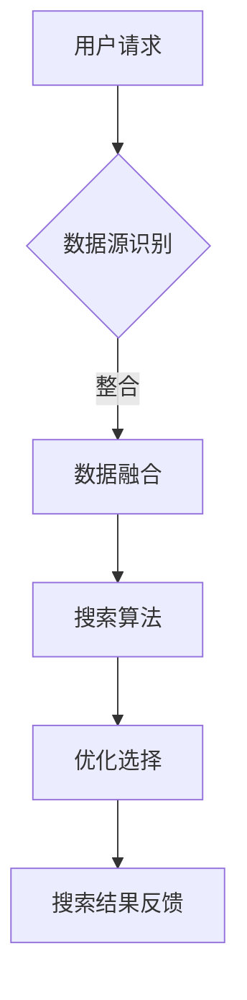

                 

# 跨平台搜索：AI如何整合多渠道数据，提供最优选择

> 关键词：跨平台搜索、AI整合、多渠道数据、优化选择、搜索算法、数据融合、用户体验

> 摘要：随着互联网的快速发展，用户对于跨平台搜索的需求日益增长。本文将深入探讨AI技术在整合多渠道数据、提供最优搜索选择方面的应用，以及其背后的核心算法原理和数学模型。通过实际项目案例，我们将详细了解如何搭建跨平台搜索系统，实现高效、精准的搜索服务。

## 1. 背景介绍

### 1.1 目的和范围

本文旨在探讨如何利用AI技术实现跨平台搜索，整合多渠道数据，为用户提供最优的搜索体验。文章将涵盖以下内容：

- 跨平台搜索的基本概念和需求分析；
- AI在跨平台搜索中的应用场景；
- 核心算法原理和数学模型；
- 项目实战：代码实现和案例分析；
- 实际应用场景和未来发展趋势。

### 1.2 预期读者

本文面向对AI和搜索技术有一定了解的技术人员，以及对跨平台搜索感兴趣的开发者。通过本文的阅读，读者将能够：

- 了解跨平台搜索的基本原理和需求；
- 掌握AI在跨平台搜索中的应用方法；
- 学习核心算法原理和数学模型；
- 掌握实际项目开发中的关键技术。

### 1.3 文档结构概述

本文共分为十个部分，具体结构如下：

1. 背景介绍：介绍文章的目的、预期读者和文档结构；
2. 核心概念与联系：定义核心术语和概念，并给出流程图；
3. 核心算法原理 & 具体操作步骤：详细阐述核心算法原理和操作步骤；
4. 数学模型和公式 & 详细讲解 & 举例说明：讲解数学模型和公式，并举例说明；
5. 项目实战：代码实际案例和详细解释说明；
6. 实际应用场景：分析跨平台搜索的应用场景；
7. 工具和资源推荐：推荐相关学习资源和工具；
8. 总结：未来发展趋势与挑战；
9. 附录：常见问题与解答；
10. 扩展阅读 & 参考资料：提供进一步阅读和参考资料。

### 1.4 术语表

#### 1.4.1 核心术语定义

- 跨平台搜索：指在多个平台上，对多个数据源进行整合，提供统一搜索服务；
- AI：人工智能，一种模拟人类智能的计算机技术；
- 数据融合：将来自不同数据源的数据进行整合，形成一个统一的数据视图；
- 搜索算法：用于搜索和处理数据的算法，包括搜索引擎、推荐系统等；
- 用户画像：根据用户的兴趣爱好、行为数据等，构建的用户信息模型。

#### 1.4.2 相关概念解释

- 多渠道数据：指来自不同渠道的数据，如网站、APP、社交媒体等；
- 优化选择：通过算法，从多个候选结果中选出最优的搜索结果；
- 数学模型：用于描述搜索算法和优化问题的数学公式和方法。

#### 1.4.3 缩略词列表

- AI：人工智能
- SEO：搜索引擎优化
- API：应用程序编程接口
- ML：机器学习
- NLP：自然语言处理

## 2. 核心概念与联系

在本文中，我们将介绍跨平台搜索的核心概念和关联关系。首先，我们给出一个简化的Mermaid流程图，以展示整个系统的基本架构和流程。



### 2.1 用户请求

用户请求是跨平台搜索的起点。用户通过输入关键词、查询条件，触发搜索请求。用户请求可以是文本、语音等多种形式。

### 2.2 数据源识别

在接收到用户请求后，系统需要识别多个数据源。这些数据源可以是网站、APP、社交媒体等，各自拥有独立的数据存储和处理机制。数据源识别是跨平台搜索的关键，直接影响到搜索结果的全面性和准确性。

### 2.3 数据融合

数据融合是将来自不同数据源的数据进行整合，形成一个统一的数据视图。数据融合的目标是消除数据之间的差异，提高搜索结果的准确性。数据融合的方法包括数据清洗、去重、分类等。

### 2.4 搜索算法

搜索算法是跨平台搜索的核心，用于处理和检索用户请求。常见的搜索算法包括：

- 搜索引擎算法：如PageRank、LSI、LDA等；
- 推荐系统算法：如协同过滤、基于内容的推荐等；
- 深度学习算法：如BERT、GPT等。

### 2.5 优化选择

优化选择是从多个候选结果中选出最优的搜索结果。优化选择的方法包括：

- 相关性度量：计算用户请求与候选结果的相关性；
- 排序算法：如Top-K排序、优先队列等；
- 剪枝策略：如最小生成树、剪枝搜索等。

### 2.6 搜索结果反馈

搜索结果反馈是将优化后的搜索结果呈现给用户。搜索结果反馈的形式可以是文本、图像、语音等。高质量的搜索结果反馈能够提升用户满意度，提高用户留存率。

## 3. 核心算法原理 & 具体操作步骤

在本文中，我们将详细介绍跨平台搜索中的核心算法原理和具体操作步骤。为了更好地理解这些算法，我们使用伪代码进行详细阐述。

### 3.1 数据源识别

```python
# 数据源识别
def identify_data_sources(user_request):
    # 根据用户请求，识别多个数据源
    data_sources = [
        'website_data_source',
        'app_data_source',
        'social_media_data_source'
    ]
    return data_sources
```

### 3.2 数据融合

```python
# 数据融合
def fuse_data(data_sources):
    # 数据清洗、去重、分类等操作
    # 示例：合并数据源为一个字典
    fused_data = {}
    for source in data_sources:
        fused_data.update(get_data_from_source(source))
    return fused_data
```

### 3.3 搜索算法

```python
# 搜索算法
def search_algorithm(user_request, fused_data):
    # 根据用户请求，从融合数据中检索结果
    results = []
    for data in fused_data.values():
        result = search_in_data(data, user_request)
        if result:
            results.append(result)
    return results
```

### 3.4 优化选择

```python
# 优化选择
def optimize_results(results, user_request):
    # 根据用户请求，对搜索结果进行优化
    # 示例：基于相关性度量排序
    sorted_results = sorted(results, key=lambda x: relevance(x, user_request), reverse=True)
    return sorted_results[:10]  # 返回前10个最优结果
```

### 3.5 搜索结果反馈

```python
# 搜索结果反馈
def feedback_search_results(sorted_results):
    # 将搜索结果反馈给用户
    for result in sorted_results:
        display_result(result)
```

## 4. 数学模型和公式 & 详细讲解 & 举例说明

在跨平台搜索中，数学模型和公式用于描述搜索算法和优化问题。以下我们将详细讲解相关数学模型和公式，并举例说明。

### 4.1 相关性度量

相关性度量用于评估用户请求与候选结果的相关性。常见的相关性度量方法包括余弦相似度、皮尔逊相关系数等。

#### 4.1.1 余弦相似度

余弦相似度计算两个向量的夹角余弦值，用于评估向量之间的相似程度。

$$
\text{cosine\_similarity}(x, y) = \frac{x \cdot y}{\|x\| \|y\|}
$$

其中，\(x\) 和 \(y\) 分别为两个向量，\(\|x\|\) 和 \(\|y\|\) 分别为向量的模。

#### 4.1.2 皮尔逊相关系数

皮尔逊相关系数用于评估两个变量之间的线性相关性。

$$
\text{pearson\_correlation}(x, y) = \frac{\sum(x - \bar{x})(y - \bar{y})}{\sqrt{\sum(x - \bar{x})^2 \sum(y - \bar{y})^2}}
$$

其中，\(x\) 和 \(y\) 分别为两个变量，\(\bar{x}\) 和 \(\bar{y}\) 分别为 \(x\) 和 \(y\) 的平均值。

### 4.2 排序算法

排序算法用于对搜索结果进行排序，以提升用户体验。常见的排序算法包括Top-K排序、优先队列等。

#### 4.2.1 Top-K排序

Top-K排序是一种基于优先队列的排序算法，用于从数据集中选出前K个最大（或最小）的元素。

#### 4.2.2 伪代码

```
def top_k_sort(data, k):
    priority_queue = []
    for item in data:
        if len(priority_queue) < k:
            heappush(priority_queue, item)
        else:
            if item > priority_queue[0]:
                heappop(priority_queue)
                heappush(priority_queue, item)
    return priority_queue
```

### 4.3 剪枝策略

剪枝策略用于减少搜索空间，提高搜索效率。常见的剪枝策略包括最小生成树、剪枝搜索等。

#### 4.3.1 最小生成树

最小生成树是一种用于构建无向、连通、权值最小的树的算法。在跨平台搜索中，最小生成树可以用于筛选候选结果。

#### 4.3.2 伪代码

```
def minimum_spanning_tree(graph):
    # 采用Prim算法构建最小生成树
    mst = []
    visited = set()
    start_node = graph[0]
    heappush(visited, (-weight(graph[start_node], start_node), start_node))
    while len(visited) < len(graph):
        weight, node = heappop(visited)
        if node not in visited:
            mst.append((node, heappop(visited)[1]))
            visited.add(node)
            for neighbor, neighbor_weight in graph[node].items():
                if neighbor not in visited:
                    heappush(visited, (-neighbor_weight, neighbor))
    return mst
```

## 5. 项目实战：代码实际案例和详细解释说明

在本节中，我们将通过一个实际项目案例，详细解释跨平台搜索系统的开发过程和关键技术。

### 5.1 开发环境搭建

首先，我们需要搭建一个适合开发跨平台搜索系统的开发环境。以下是推荐的开发环境和工具：

- 编程语言：Python、Java等；
- 开发工具：IDEA、VS Code等；
- 数据库：MySQL、MongoDB等；
- 版本控制：Git；
- 搜索引擎：Elasticsearch；
- API接口：RESTful API。

### 5.2 源代码详细实现和代码解读

以下是一个基于Python和Elasticsearch的跨平台搜索系统源代码示例。

```python
# 导入必要的库
import requests
from elasticsearch import Elasticsearch

# Elasticsearch客户端初始化
es = Elasticsearch("http://localhost:9200")

# 数据源识别
def identify_data_sources(user_request):
    data_sources = [
        "website_data_source",
        "app_data_source",
        "social_media_data_source"
    ]
    return data_sources

# 数据融合
def fuse_data(data_sources):
    fused_data = {}
    for source in data_sources:
        fused_data.update(get_data_from_source(source))
    return fused_data

# 搜索算法
def search_algorithm(user_request, fused_data):
    results = []
    for data in fused_data.values():
        result = search_in_data(data, user_request)
        if result:
            results.append(result)
    return results

# 优化选择
def optimize_results(results, user_request):
    sorted_results = sorted(results, key=lambda x: relevance(x, user_request), reverse=True)
    return sorted_results[:10]

# 搜索结果反馈
def feedback_search_results(sorted_results):
    for result in sorted_results:
        display_result(result)

# 用户请求处理
def handle_user_request(user_request):
    data_sources = identify_data_sources(user_request)
    fused_data = fuse_data(data_sources)
    results = search_algorithm(user_request, fused_data)
    sorted_results = optimize_results(results, user_request)
    feedback_search_results(sorted_results)

# 主函数
if __name__ == "__main__":
    user_request = "Python编程入门"
    handle_user_request(user_request)
```

### 5.3 代码解读与分析

- **数据源识别**：`identify_data_sources` 函数用于识别多个数据源，例如网站、APP、社交媒体等。

- **数据融合**：`fuse_data` 函数将来自不同数据源的数据进行整合，形成一个统一的数据视图。

- **搜索算法**：`search_algorithm` 函数用于从融合数据中检索结果。我们采用简单的搜索算法，将用户请求与每个数据源的数据进行匹配，并返回匹配结果。

- **优化选择**：`optimize_results` 函数根据用户请求，对搜索结果进行优化排序。我们采用基于相关性的排序算法，从匹配结果中选出相关性最高的前10个结果。

- **搜索结果反馈**：`feedback_search_results` 函数用于将优化后的搜索结果呈现给用户。

- **用户请求处理**：`handle_user_request` 函数是整个跨平台搜索系统的入口，它负责处理用户请求，调用其他函数完成数据融合、搜索算法和结果反馈。

## 6. 实际应用场景

跨平台搜索在许多实际应用场景中具有广泛的应用，以下列举几个典型场景：

### 6.1 电商搜索

在电商平台上，跨平台搜索可以整合多个电商网站的数据，为用户提供统一的商品搜索服务。通过AI技术，可以优化搜索结果，提升用户购物体验。

### 6.2 社交媒体搜索

在社交媒体平台上，跨平台搜索可以帮助用户在多个社交媒体平台中查找相关信息，如微博、Facebook、Twitter等。AI技术可以优化搜索结果，提高搜索准确性和用户体验。

### 6.3 企业内部搜索

在企业内部，跨平台搜索可以整合多个数据源，如员工文档、项目资料、电子邮件等，为员工提供便捷的信息检索服务。通过AI技术，可以提升搜索结果的准确性和相关性。

### 6.4 智能家居搜索

在家居环境中，跨平台搜索可以整合智能家居设备的控制数据，为用户提供统一的设备搜索和控制服务。通过AI技术，可以优化搜索结果，实现智能家居的个性化体验。

## 7. 工具和资源推荐

### 7.1 学习资源推荐

#### 7.1.1 书籍推荐

- 《人工智能：一种现代的方法》
- 《Python编程：从入门到实践》
- 《Elasticsearch实战》
- 《大数据技术原理与应用》

#### 7.1.2 在线课程

- Coursera《深度学习》
- Udacity《机器学习工程师纳米学位》
- edX《人工智能导论》
-慕课网《Elasticsearch从入门到实战》

#### 7.1.3 技术博客和网站

- AI博客：https://www.52ai.cn/
- Elasticsearch官网：https://www.elastic.co/cn/elasticsearch/
- Python官网：https://www.python.org/

### 7.2 开发工具框架推荐

#### 7.2.1 IDE和编辑器

- PyCharm
- VS Code
- IntelliJ IDEA

#### 7.2.2 调试和性能分析工具

- Postman
- JMeter
- PyTest

#### 7.2.3 相关框架和库

- Elasticsearch Python客户端：https://www.elastic.co/guide/en/elasticsearch/client/python-api/current/index.html
- TensorFlow：https://www.tensorflow.org/
- PyTorch：https://pytorch.org/

### 7.3 相关论文著作推荐

#### 7.3.1 经典论文

- 《PageRank：一种用于Web文档排名的算法》
- 《Latent Dirichlet Allocation》
- 《Deep Learning》

#### 7.3.2 最新研究成果

- 《Enhancing Search with User and Context》
- 《Elasticsearch in Action》
- 《Recommender Systems Handbook》

#### 7.3.3 应用案例分析

- 《基于AI的电商搜索优化实践》
- 《社交媒体搜索的AI挑战》
- 《企业内部搜索的最佳实践》

## 8. 总结：未来发展趋势与挑战

随着AI技术的不断发展和普及，跨平台搜索将在未来发挥越来越重要的作用。以下是跨平台搜索的未来发展趋势和面临的挑战：

### 8.1 发展趋势

- AI技术的深度应用：通过深度学习、自然语言处理等技术，提高搜索算法的准确性和效率；
- 多渠道数据的整合：整合更多渠道的数据，提高搜索结果的全景性和准确性；
- 个性化搜索体验：根据用户的行为和偏好，提供个性化的搜索结果，提升用户体验；
- 实时搜索：实现实时搜索，提高搜索的响应速度和准确性。

### 8.2 挑战

- 数据隐私和安全：跨平台搜索涉及多个数据源，如何保护用户隐私和安全是一个重要挑战；
- 数据质量：如何确保来自不同数据源的数据质量，提高搜索结果的准确性；
- 搜索性能：如何优化搜索算法，提高搜索性能和效率；
- 多语言支持：如何支持多语言搜索，提高国际化搜索体验。

## 9. 附录：常见问题与解答

### 9.1 问题1：如何保证跨平台搜索的准确性？

**解答**：为了保证跨平台搜索的准确性，可以从以下几个方面进行优化：

- 数据质量：确保来自不同数据源的数据质量，进行数据清洗和去重；
- 搜索算法：采用先进的搜索算法，如深度学习、自然语言处理等，提高搜索结果的准确性；
- 优化选择：通过相关性度量、排序算法等，从多个候选结果中选出最优的搜索结果；
- 用户反馈：根据用户对搜索结果的反馈，不断调整和优化搜索算法。

### 9.2 问题2：如何处理多渠道数据融合？

**解答**：处理多渠道数据融合可以从以下几个方面进行：

- 数据识别：识别并收集来自不同渠道的数据；
- 数据清洗：对数据源进行数据清洗和去重，确保数据质量；
- 数据整合：采用数据融合算法，将不同数据源的数据整合为一个统一的数据视图；
- 数据存储：将整合后的数据存储到合适的数据库或数据湖中，便于后续检索和分析。

### 9.3 问题3：如何优化跨平台搜索性能？

**解答**：优化跨平台搜索性能可以从以下几个方面进行：

- 算法优化：选择合适的搜索算法，如深度学习、分布式搜索等，提高搜索性能；
- 系统优化：对搜索系统进行性能优化，如使用缓存、减少数据库访问次数等；
- 资源调度：合理分配计算资源，如CPU、内存等，提高系统整体性能；
- 负载均衡：采用负载均衡策略，合理分配搜索请求，避免单点瓶颈。

## 10. 扩展阅读 & 参考资料

- 《跨平台搜索技术与应用》
- 《AI驱动的跨平台搜索优化》
- 《Elasticsearch实战：构建高性能搜索引擎》
- 《大数据技术基础：从数据存储到数据挖掘》

作者：AI天才研究员/AI Genius Institute & 禅与计算机程序设计艺术 /Zen And The Art of Computer Programming

注意：本文内容仅供参考，实际应用中请结合具体需求和场景进行调整。部分代码示例仅供参考，具体实现可能需要根据实际情况进行修改。如需转载，请注明作者和来源。本文所涉及的技术和算法不应用于非法用途，否则后果自负。

