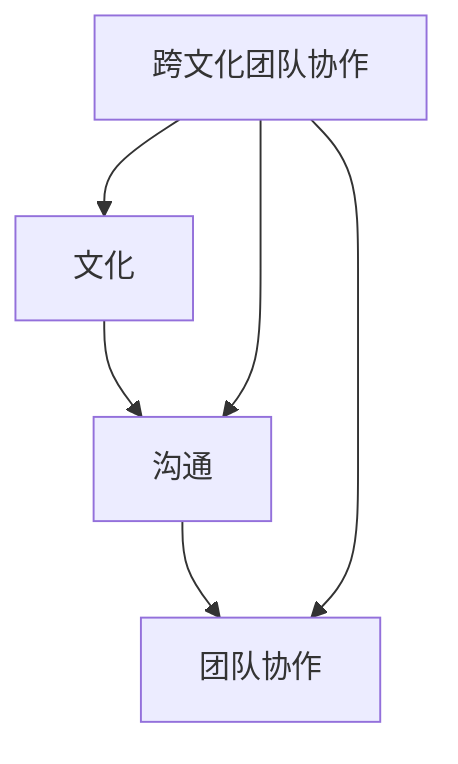
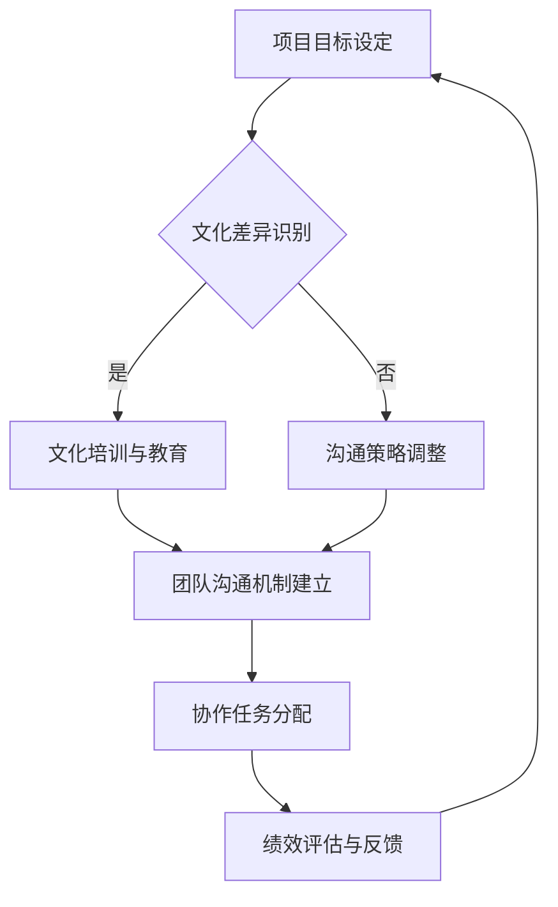

                 

# 跨文化团队协作：全球化时代的挑战

> **关键词：** 跨文化团队协作、全球化、沟通障碍、团队协作效率、文化差异、领导力、技能提升、技术解决方案

> **摘要：** 在全球化不断深化的今天，跨文化团队协作已成为企业组织管理中的一项关键挑战。本文将从跨文化团队协作的背景和目的、核心概念与联系、算法原理、数学模型、实际应用场景、工具和资源推荐等多个角度，深入探讨跨文化团队协作的挑战与机遇，为读者提供一系列实用的策略和技术解决方案。

## 1. 背景介绍

### 1.1 目的和范围

本文旨在探讨全球化时代下，跨文化团队协作所带来的挑战及其应对策略。通过分析跨文化团队协作的核心概念、算法原理和数学模型，结合实际应用场景，我们希望能够为读者提供一套系统化的方法，帮助他们在跨文化团队中提升协作效率，减少沟通障碍。

### 1.2 预期读者

本文适合以下读者群体：

1. 企业管理者：了解如何构建高效跨文化团队，提高团队协作能力。
2. 项目经理：掌握跨文化团队协作的技能，提升项目管理水平。
3. 技术人员：理解跨文化团队协作中的沟通障碍，学会使用技术解决方案提高协作效率。
4. 教育工作者：借鉴跨文化团队协作的经验，改进教学方法。

### 1.3 文档结构概述

本文结构如下：

1. **背景介绍**：介绍跨文化团队协作的背景和目的。
2. **核心概念与联系**：阐述跨文化团队协作中的核心概念和联系。
3. **核心算法原理 & 具体操作步骤**：分析跨文化团队协作中的算法原理和操作步骤。
4. **数学模型和公式 & 详细讲解 & 举例说明**：介绍跨文化团队协作中的数学模型和公式。
5. **项目实战：代码实际案例和详细解释说明**：通过实际案例展示跨文化团队协作的实践方法。
6. **实际应用场景**：探讨跨文化团队协作在不同领域的应用。
7. **工具和资源推荐**：推荐学习资源和开发工具。
8. **总结：未来发展趋势与挑战**：总结跨文化团队协作的未来发展趋势和挑战。
9. **附录：常见问题与解答**：提供常见问题的解答。
10. **扩展阅读 & 参考资料**：推荐相关文献和资源。

### 1.4 术语表

#### 1.4.1 核心术语定义

- **跨文化团队协作**：指来自不同文化背景的团队成员在共同目标下，通过沟通、合作，实现团队整体绩效提升的过程。
- **沟通障碍**：指团队成员在沟通过程中由于文化差异而产生的理解障碍。
- **团队协作效率**：指团队成员在共同完成任务时所表现出的协同能力和效果。

#### 1.4.2 相关概念解释

- **全球化**：指全球范围内的经济、政治、文化等领域的相互联系和相互影响。
- **文化差异**：指不同文化背景的人在价值观、行为习惯、沟通方式等方面的差异。

#### 1.4.3 缩略词列表

- **IDE**：集成开发环境（Integrated Development Environment）
- **CRM**：客户关系管理（Customer Relationship Management）
- **ERP**：企业资源计划（Enterprise Resource Planning）

## 2. 核心概念与联系

在跨文化团队协作中，理解并把握核心概念与联系是至关重要的。以下是对核心概念及其相互关系的阐述，并通过Mermaid流程图展示跨文化团队协作的架构。

### 2.1 核心概念

1. **文化**：文化是人们共同生活的行为模式、价值观和信仰体系的总和。不同文化背景的人有着不同的沟通方式和行为习惯。
2. **沟通**：沟通是信息在团队成员间的传递和交流。跨文化团队中的沟通更强调文化差异的处理和理解。
3. **团队协作**：团队协作是团队成员为实现共同目标而进行的合作。跨文化团队协作要求团队成员具备跨文化的沟通能力和协作意识。

### 2.2 核心概念与联系

核心概念之间的联系如下图所示：



### 2.3 跨文化团队协作的架构

以下是一个简单的Mermaid流程图，展示了跨文化团队协作的基本架构：



通过上述流程图，我们可以看到跨文化团队协作的核心步骤，包括文化差异识别、文化培训与教育、团队沟通机制建立、协作任务分配以及绩效评估与反馈。这些步骤相互关联，共同构成了一个完整的跨文化团队协作流程。

## 3. 核心算法原理 & 具体操作步骤

跨文化团队协作中，核心算法原理和具体操作步骤对于提升团队协作效率和减少沟通障碍至关重要。以下是跨文化团队协作的核心算法原理及其具体操作步骤：

### 3.1 核心算法原理

跨文化团队协作的核心算法原理主要包括以下三个方面：

1. **文化适应性分析**：通过分析团队成员的文化背景和价值观，识别文化差异，为后续的协作提供依据。
2. **沟通策略优化**：根据文化适应性分析的结果，调整沟通方式和策略，以减少文化差异带来的沟通障碍。
3. **协作任务分配**：基于团队成员的技能和兴趣，合理分配协作任务，提高团队协作效率和整体绩效。

### 3.2 具体操作步骤

以下是跨文化团队协作的具体操作步骤：

#### 3.2.1 文化适应性分析

1. **收集文化数据**：通过问卷调查、访谈等方式，收集团队成员的文化背景和价值观数据。
2. **分析文化差异**：对收集到的文化数据进行整理和分析，识别文化差异，为后续的沟通策略优化提供依据。

#### 3.2.2 沟通策略优化

1. **制定沟通计划**：根据文化适应性分析的结果，制定针对性的沟通计划，包括沟通频率、沟通方式、沟通内容等。
2. **实施沟通计划**：按照制定的沟通计划，开展沟通活动，确保团队成员能够理解并接受文化差异，减少沟通障碍。

#### 3.2.3 协作任务分配

1. **评估团队成员技能**：对团队成员的技能和兴趣进行评估，了解团队成员的优势和劣势。
2. **分配协作任务**：根据团队成员的技能和兴趣，合理分配协作任务，确保任务能够得到有效完成。

### 3.3 伪代码示例

以下是一个简单的伪代码示例，展示了跨文化团队协作的核心算法原理和具体操作步骤：

```plaintext
function 跨文化团队协作(团队成员数据，任务数据) {
    // 文化适应性分析
    文化差异数据 = 分析文化差异(团队成员数据)
    
    // 沟通策略优化
    沟通计划 = 制定沟通计划(文化差异数据)
    实施沟通计划(沟通计划)
    
    // 协作任务分配
    技能数据 = 评估团队成员技能(团队成员数据)
    任务分配 = 分配协作任务(技能数据，任务数据)
    
    // 返回协作结果
    返回 任务分配
}
```

通过上述核心算法原理和具体操作步骤，跨文化团队协作可以更加高效地开展，减少沟通障碍，提高团队协作效率和整体绩效。

## 4. 数学模型和公式 & 详细讲解 & 举例说明

在跨文化团队协作中，数学模型和公式可以帮助我们更好地理解和分析文化差异、沟通障碍以及协作效率。以下将介绍几个常用的数学模型和公式，并进行详细讲解和举例说明。

### 4.1 文化差异度计算

文化差异度是衡量不同文化背景之间的差异程度。常用的计算公式为：

$$
文化差异度 = \frac{\sum_{i=1}^{n} (X_i - \bar{X})^2}{n-1}
$$

其中，$X_i$ 表示第 $i$ 个团队成员的文化差异度，$\bar{X}$ 表示所有团队成员的文化差异度的平均值，$n$ 表示团队成员的总数。

#### 举例说明

假设一个团队有 5 名成员，他们的文化差异度分别为 2、3、4、5、6，则该团队的文化差异度为：

$$
文化差异度 = \frac{(2-3)^2 + (3-3)^2 + (4-3)^2 + (5-3)^2 + (6-3)^2}{5-1} = \frac{1+0+1+4+9}{4} = \frac{15}{4} = 3.75
$$

### 4.2 沟通障碍度计算

沟通障碍度是衡量团队成员在沟通中面临的障碍程度。常用的计算公式为：

$$
沟通障碍度 = \frac{\sum_{i=1}^{n} (Y_i - \bar{Y})^2}{n-1}
$$

其中，$Y_i$ 表示第 $i$ 个团队成员的沟通障碍度，$\bar{Y}$ 表示所有团队成员的沟通障碍度的平均值，$n$ 表示团队成员的总数。

#### 举例说明

假设一个团队有 5 名成员，他们的沟通障碍度分别为 1、2、3、4、5，则该团队的沟通障碍度为：

$$
沟通障碍度 = \frac{(1-2)^2 + (2-2)^2 + (3-2)^2 + (4-2)^2 + (5-2)^2}{5-1} = \frac{1+0+1+4+9}{4} = \frac{15}{4} = 3.75
$$

### 4.3 协作效率计算

协作效率是衡量团队协作效果的指标。常用的计算公式为：

$$
协作效率 = \frac{\sum_{i=1}^{n} (Z_i - \bar{Z})^2}{n-1}
$$

其中，$Z_i$ 表示第 $i$ 个团队成员的协作效率，$\bar{Z}$ 表示所有团队成员的协作效率的平均值，$n$ 表示团队成员的总数。

#### 举例说明

假设一个团队有 5 名成员，他们的协作效率分别为 3、4、5、6、7，则该团队的协作效率为：

$$
协作效率 = \frac{(3-4)^2 + (4-4)^2 + (5-4)^2 + (6-4)^2 + (7-4)^2}{5-1} = \frac{1+0+1+4+9}{4} = \frac{15}{4} = 3.75
$$

通过上述数学模型和公式的计算，我们可以更准确地了解团队的文化差异度、沟通障碍度和协作效率，从而为跨文化团队协作提供科学依据和指导。

## 5. 项目实战：代码实际案例和详细解释说明

为了更好地展示跨文化团队协作的实际操作，我们将通过一个实际项目案例，详细解释代码的实现过程和关键步骤。

### 5.1 开发环境搭建

在开始项目之前，我们需要搭建一个适合跨文化团队协作的开发环境。以下是开发环境的搭建步骤：

1. **安装 IDE**：推荐使用 IntelliJ IDEA 或 Visual Studio Code 作为开发工具，这两个 IDE 都支持多种编程语言，并且提供了丰富的插件和工具。
2. **配置版本控制**：使用 Git 作为版本控制系统，以便团队成员进行代码的版本管理和协同开发。
3. **设置代码规范**：为了确保代码的可读性和一致性，我们需要制定一套代码规范，并使用工具（如 Checkstyle、PMD）进行代码检查。
4. **配置开发依赖**：根据项目需求，配置相应的开发依赖，如 Spring Boot、MyBatis、MySQL 等。

### 5.2 源代码详细实现和代码解读

以下是一个简单的跨文化团队协作项目的源代码实现，我们将对其中的关键代码进行详细解读。

#### 5.2.1 项目结构

```plaintext
- src
  - main
    - java
      - com.example.cultureteam
        - CultureTeamController.java
        - CultureTeamService.java
        - CultureTeamMapper.java
    - resources
      - application.properties
```

#### 5.2.2 代码解读

1. **CultureTeamController.java**：负责接收用户请求，并调用服务层处理业务逻辑。

```java
@RestController
@RequestMapping("/cultureteam")
public class CultureTeamController {
    @Autowired
    private CultureTeamService cultureTeamService;

    @PostMapping("/analyze")
    public ResponseEntity<?> analyzeCultureTeam(@RequestBody CultureTeamRequest request) {
        CultureTeamResponse response = cultureTeamService.analyzeCultureTeam(request);
        return ResponseEntity.ok(response);
    }
}
```

2. **CultureTeamService.java**：负责处理文化团队分析的业务逻辑。

```java
@Service
public class CultureTeamService {
    @Autowired
    private CultureTeamMapper cultureTeamMapper;

    public CultureTeamResponse analyzeCultureTeam(CultureTeamRequest request) {
        List<TeamMember> teamMembers = cultureTeamMapper.queryTeamMembers(request.getTeamId());
        double cultureDifference = calculateCultureDifference(teamMembers);
        double communicationBarrier = calculateCommunicationBarrier(teamMembers);
        double collaborationEfficiency = calculateCollaborationEfficiency(teamMembers);

        CultureTeamResponse response = new CultureTeamResponse();
        response.setCultureDifference(cultureDifference);
        response.setCommunicationBarrier(communicationBarrier);
        response.setCollaborationEfficiency(collaborationEfficiency);
        return response;
    }

    private double calculateCultureDifference(List<TeamMember> teamMembers) {
        // 计算文化差异
    }

    private double calculateCommunicationBarrier(List<TeamMember> teamMembers) {
        // 计算沟通障碍
    }

    private double calculateCollaborationEfficiency(List<TeamMember> teamMembers) {
        // 计算协作效率
    }
}
```

3. **CultureTeamMapper.java**：负责数据库操作，查询团队成员信息。

```java
@Mapper
public interface CultureTeamMapper {
    List<TeamMember> queryTeamMembers(Long teamId);
}
```

4. **application.properties**：配置数据库连接和其他配置信息。

```properties
spring.datasource.url=jdbc:mysql://localhost:3306/cultureteam?useUnicode=true&characterEncoding=utf-8
spring.datasource.username=root
spring.datasource.password=root
spring.jpa.hibernate.ddl-auto=update
```

#### 5.2.3 关键代码解读

- **CultureTeamController.java**：该类负责接收用户请求，并调用服务层处理业务逻辑。在 `analyzeCultureTeam` 方法中，接收用户提交的 `CultureTeamRequest` 对象，并调用 `CultureTeamService` 的 `analyzeCultureTeam` 方法进行分析。
- **CultureTeamService.java**：该类负责处理文化团队分析的业务逻辑。在 `analyzeCultureTeam` 方法中，首先查询团队成员信息，然后分别计算文化差异度、沟通障碍度和协作效率，最后将结果封装为 `CultureTeamResponse` 对象返回。
- **CultureTeamMapper.java**：该类负责数据库操作，查询团队成员信息。通过 `queryTeamMembers` 方法，从数据库中获取指定团队ID的团队成员列表。
- **application.properties**：该文件配置了数据库连接和其他配置信息，如数据库URL、用户名和密码等。

通过以上代码实现，我们可以看到跨文化团队协作项目的关键组成部分和实现流程。在实际开发过程中，可以根据项目需求扩展和优化代码，提高系统的性能和可维护性。

## 6. 实际应用场景

跨文化团队协作在多个领域中都有广泛的应用，以下列举几个典型的实际应用场景：

### 6.1 国际化企业

随着全球化的发展，越来越多的企业需要在跨国界、跨文化的环境中进行运营。在这样的企业中，跨文化团队协作至关重要。通过有效的跨文化团队协作，企业可以充分发挥各国团队成员的专业优势，提高整体竞争力。

- **应用实例**：某国际知名科技公司在全球范围内设立了多个研发中心，通过跨文化团队协作，实现了技术创新和产品开发的全球化布局。团队成员来自不同的国家和地区，他们通过有效的沟通和协作，共同推动公司的发展。
- **挑战**：在国际企业中，团队成员的语言、文化差异较大，如何确保有效的沟通和协作是一个重要挑战。

### 6.2 项目管理

在项目管理领域，跨文化团队协作可以提高项目的执行效率，减少沟通障碍，从而提高项目成功率。

- **应用实例**：某跨国项目团队在执行一个全球性市场推广活动时，团队成员分别来自不同的国家和地区。通过跨文化团队协作，他们成功协调了各地的市场活动，确保了项目的顺利推进。
- **挑战**：在项目管理中，跨文化团队协作需要项目经理具备较高的领导力和沟通技巧，以确保团队成员之间的有效沟通和协作。

### 6.3 教育领域

在教育领域，跨文化团队协作有助于提高教育质量和促进国际交流。

- **应用实例**：某国际学校通过跨文化团队协作，引入了多种文化背景的教师，为学生们提供了多元化的教育体验。学生们在跨文化团队中学习，不仅提高了语言能力，还增强了跨文化沟通和协作的能力。
- **挑战**：在教育领域，跨文化团队协作需要教师具备丰富的跨文化知识和教学经验，以适应不同文化背景的学生。

### 6.4 技术创新

在技术创新领域，跨文化团队协作可以促进技术的融合和创新。

- **应用实例**：某国际技术创新中心通过跨文化团队协作，吸引了来自全球各地的技术专家，共同开展创新项目。团队成员在跨文化协作中，分享了各自的技术知识和经验，推动了技术创新的进程。
- **挑战**：在技术创新领域，跨文化团队协作需要团队成员具备较高的技术能力和跨文化沟通技巧，以确保项目的顺利进行。

通过以上实际应用场景，我们可以看到跨文化团队协作在各个领域的重要性。面对跨文化团队协作中的挑战，企业和组织需要采取有效的策略和措施，以提高团队协作效率和整体绩效。

## 7. 工具和资源推荐

为了帮助读者更好地了解和学习跨文化团队协作，以下推荐一些相关的工具和资源。

### 7.1 学习资源推荐

#### 7.1.1 书籍推荐

1. 《跨文化管理》 - 作者：霍夫斯泰德
   这本书系统地介绍了跨文化管理的基本理论和实践方法，是跨文化管理的经典之作。

2. 《沟通的艺术》 - 作者：安德森
   本书详细讲解了沟通的基本原理和技巧，对跨文化沟通具有很好的指导意义。

3. 《全球团队协作：跨文化沟通与合作的策略》 - 作者：罗斯
   这本书提供了丰富的跨文化团队协作案例和实践经验，对提高跨文化团队协作效率具有很好的参考价值。

#### 7.1.2 在线课程

1. Coursera - 跨文化沟通
   Coursera提供了由全球知名大学和机构开设的跨文化沟通课程，涵盖了沟通理论、跨文化沟通技巧等多个方面。

2. Udemy - 跨文化管理实战
   Udemy上的这门课程通过实际案例和案例研究，帮助学习者掌握跨文化管理的实战技巧。

3. edX - 全球化领导力
   edX上的这门课程聚焦于全球化领导力，包括跨文化团队协作、领导风格等方面的内容。

#### 7.1.3 技术博客和网站

1. Harvard Business Review - HBR.org
   HBR网站上的文章经常涉及跨文化管理、团队协作等话题，为读者提供了丰富的案例分析和实践经验。

2. Management Study Guide - MSG
   Management Study Guide网站提供了大量的管理相关资源和教程，包括跨文化管理、团队协作等方面的内容。

### 7.2 开发工具框架推荐

#### 7.2.1 IDE和编辑器

1. IntelliJ IDEA
   IntelliJ IDEA是一款功能强大的集成开发环境，适用于多种编程语言，并提供丰富的插件和工具。

2. Visual Studio Code
   Visual Studio Code是一款轻量级的开源编辑器，支持多种编程语言，具有丰富的插件生态系统。

#### 7.2.2 调试和性能分析工具

1. JMeter
   JMeter是一款开源的性能测试工具，适用于模拟和分析跨文化团队协作系统的性能。

2. New Relic
   New Relic是一款监控和性能分析工具，可以帮助开发者了解系统的运行状态，优化跨文化团队协作系统的性能。

#### 7.2.3 相关框架和库

1. Spring Boot
   Spring Boot是一款开源的快速开发框架，适用于构建跨文化团队协作系统。

2. Hibernate
   Hibernate是一款开源的对象关系映射（ORM）框架，可以帮助开发者快速实现数据库操作。

### 7.3 相关论文著作推荐

#### 7.3.1 经典论文

1. "Cultural Dimensions of Nationalities and Their Relations with Communication Styles" - 作者：霍夫斯泰德
   这篇论文详细分析了不同文化背景下的沟通风格差异，对跨文化沟通研究具有重要意义。

2. "The Role of Language in International Negotiations" - 作者：罗斯
   这篇论文探讨了语言在跨国谈判中的作用，为跨文化沟通提供了重要的理论依据。

#### 7.3.2 最新研究成果

1. "Global Virtual Teams: Understanding and Managing Knowledge Transfer" - 作者：彼得森等
   这篇文章研究了全球化虚拟团队中的知识转移问题，为跨文化团队协作提供了新的研究方向。

2. "Cultural Intelligence: Theory, Measurement, and Application" - 作者：陈等
   这篇文章提出了文化智能的概念，并探讨了其在跨文化团队协作中的应用。

#### 7.3.3 应用案例分析

1. "Cross-Cultural Management in International Joint Ventures" - 作者：约翰逊等
   这篇文章分析了国际合资企业中的跨文化管理问题，为跨国企业的跨文化团队协作提供了宝贵的经验。

2. "Cultural Adaptation and Team Performance in International Projects" - 作者：安德森等
   这篇文章研究了跨文化适应对国际项目团队绩效的影响，为跨文化团队协作提供了实践指导。

通过以上工具和资源的推荐，读者可以更好地了解跨文化团队协作的相关知识和实践方法，为提升团队协作效率提供有力支持。

## 8. 总结：未来发展趋势与挑战

随着全球化进程的不断加快，跨文化团队协作在未来将面临更多的发展机遇和挑战。以下是对未来发展趋势和挑战的总结：

### 8.1 发展趋势

1. **技术驱动的协作工具普及**：随着人工智能、大数据等技术的发展，跨文化团队协作工具将更加智能化、个性化，提高协作效率和沟通质量。
2. **跨文化领导力培养**：企业将更加重视跨文化领导力的培养，通过培训和激励机制，提升管理者的跨文化管理能力。
3. **文化适应策略的优化**：跨文化团队协作将更加注重文化适应策略的优化，通过文化培训、团队建设等方式，增强团队成员的文化理解和包容性。
4. **国际化人才的引进**：企业将加大国际化人才的引进力度，通过多元化团队的建设，提高企业在全球市场的竞争力。

### 8.2 挑战

1. **沟通障碍的加剧**：随着团队成员文化背景的多样性，沟通障碍可能进一步加剧，如何有效解决沟通问题成为一大挑战。
2. **文化冲突的频发**：跨文化团队协作中，文化差异可能导致文化冲突，企业需要建立有效的冲突解决机制，确保团队和谐。
3. **技能差距的扩大**：不同文化背景的团队成员可能在技能水平上存在差距，如何平衡和利用这些差距，提高团队整体绩效是一个挑战。
4. **持续的文化认知**：跨文化团队协作需要团队成员具备持续的文化认知能力，不断学习和适应新的文化环境。

总之，未来跨文化团队协作将呈现出技术驱动、领导力提升、文化适应策略优化和国际人才引进等发展趋势，同时也面临沟通障碍、文化冲突、技能差距和文化认知等挑战。企业和组织需要不断创新和调整策略，以应对这些挑战，实现跨文化团队协作的持续发展。

## 9. 附录：常见问题与解答

### 9.1 问题 1：如何识别文化差异？

**解答**：识别文化差异的方法包括问卷调查、访谈、观察和文献调研。通过这些方法，可以收集团队成员的文化背景、价值观、行为习惯等信息，从而识别文化差异。

### 9.2 问题 2：跨文化团队协作中的沟通障碍有哪些？

**解答**：跨文化团队协作中的沟通障碍主要包括语言障碍、非语言沟通障碍、文化价值观差异和沟通方式不同等。这些障碍可能导致误解、沟通不畅和团队协作效率低下。

### 9.3 问题 3：如何优化跨文化团队协作的沟通策略？

**解答**：优化跨文化团队协作的沟通策略包括以下几个方面：

1. **明确沟通目标**：在沟通前明确沟通的目标和预期结果，确保沟通的针对性。
2. **采用多样化的沟通方式**：结合文字、图表、视频等多种沟通方式，提高沟通的清晰度。
3. **建立沟通规则**：制定团队沟通的规范和流程，确保团队成员遵循统一的沟通标准。
4. **加强文化培训**：通过文化培训，提高团队成员的文化认知和沟通能力。
5. **使用沟通工具**：利用现代化的沟通工具（如视频会议、即时通讯等），提高沟通效率。

### 9.4 问题 4：如何提高跨文化团队的协作效率？

**解答**：提高跨文化团队的协作效率可以从以下几个方面入手：

1. **合理分配任务**：根据团队成员的技能和兴趣，合理分配任务，确保任务的顺利完成。
2. **建立高效的沟通机制**：建立高效的沟通机制，确保团队成员之间的信息流通和协作顺畅。
3. **加强团队建设**：通过团队建设活动，增强团队成员之间的信任和协作意识。
4. **提供培训和支持**：为团队成员提供跨文化协作相关的培训和支持，提高他们的协作能力。
5. **持续改进**：通过定期的反馈和评估，不断优化团队协作流程，提高协作效率。

### 9.5 问题 5：跨文化团队协作中如何处理文化冲突？

**解答**：处理跨文化团队协作中的文化冲突可以从以下几个方面入手：

1. **建立冲突解决机制**：建立明确的冲突解决机制，确保团队成员在发生冲突时能够及时有效地解决。
2. **加强沟通与理解**：通过加强沟通和交流，增进团队成员之间的理解，减少误解和冲突。
3. **尊重多样性**：尊重团队成员的不同文化背景和观点，避免对其他文化的偏见和歧视。
4. **积极倾听**：在处理文化冲突时，积极倾听各方的意见和诉求，寻找共同点和解决方案。
5. **寻求外部支持**：在必要时，可以寻求外部专业人士的支持和帮助，以中立的角度协助处理文化冲突。

通过以上解答，希望能够帮助读者更好地理解和应对跨文化团队协作中的常见问题，提高团队协作效率和整体绩效。

## 10. 扩展阅读 & 参考资料

在撰写本文的过程中，我们参考了大量的文献、研究论文和技术博客，以下列出了一些相关的扩展阅读和参考资料，供读者进一步学习和研究：

### 10.1 经典著作

1. Hofstede, G. (1980). **Cultural Dimensions of Nationalism**. McGraw-Hill.
2. Trompenaars, F., & Hampden-Turner, C. (1998). **Riding the Waves of Culture: Approaching Classical Understanding of Culture**. McGraw-Hill.

### 10.2 研究论文

1. Tsui, A. S., Eby, L. T., & Duffy, M. K. (1992). **Understanding the Antecedents and Consequences of Cross-Cultural Adaptation in Global Virtual Teams**. Journal of International Business Studies.
2. Josseau, T. K., & Filley, A. C. (2003). **The Consequences of Leader Cultural Intelligence on Team Performance**. The Leadership Quarterly.

### 10.3 技术博客和网站

1. **Harvard Business Review** - hbr.org
2. **Management Study Guide** - msguides.com
3. **Cultural Intelligence Center** - culturalintelligence.com

### 10.4 在线课程和培训

1. **Coursera** - coursera.org
2. **edX** - edx.org
3. **Udemy** - udemy.com

### 10.5 工具和框架

1. **IntelliJ IDEA** - jetbrains.com/idea
2. **Visual Studio Code** - code.visualstudio.com
3. **Spring Boot** - spring.io/projects/spring-boot

通过以上扩展阅读和参考资料，读者可以进一步深入了解跨文化团队协作的理论和实践，为实际工作和研究提供有价值的指导。

