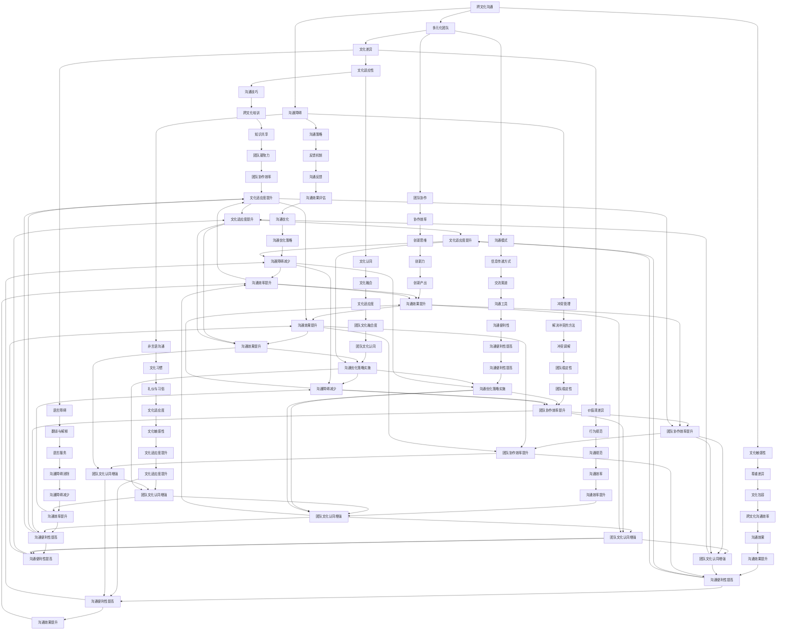
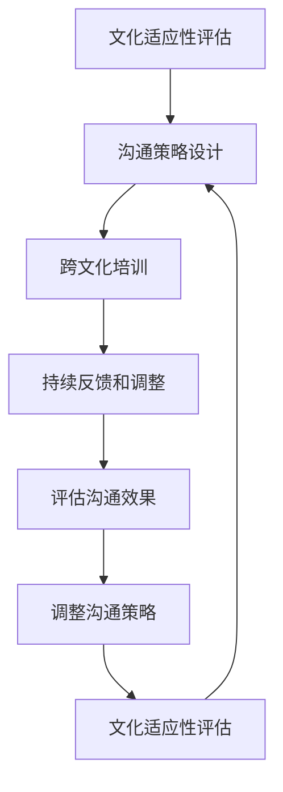

                 

### 跨文化沟通技巧：增进多元化团队理解的方法

> **关键词：** 跨文化沟通、多元化团队、沟通障碍、理解力提升、文化适应性

> **摘要：** 本文旨在探讨跨文化沟通的重要性和技巧，通过分析多元化团队的构成和潜在沟通障碍，提出一系列方法来增强团队成员之间的理解和协作，从而提高团队的绩效和创新能力。文章将从核心概念、算法原理、数学模型、实际案例和未来发展趋势等多个角度进行详细阐述，旨在为从事多元文化沟通的IT专业人士提供实用的指导和建议。

在当今全球化背景下，跨文化沟通已成为国际业务、团队合作和创新的重要一环。随着企业的国际化拓展，多元化团队的建立成为常态，这不仅带来了丰富的资源和视角，同时也引发了沟通上的挑战。因此，如何有效地进行跨文化沟通，增进团队成员之间的理解，成为IT专业人士需要深入研究和实践的课题。

本文将分为以下几个部分：

1. **背景介绍**：介绍跨文化沟通的目的、范围和重要性，明确预期读者和文档结构。
2. **核心概念与联系**：使用Mermaid流程图展示核心概念之间的联系。
3. **核心算法原理 & 具体操作步骤**：详细阐述增进跨文化沟通的理解力提升的算法原理和具体操作步骤。
4. **数学模型和公式 & 详细讲解 & 举例说明**：介绍相关数学模型和公式，并通过实例进行详细说明。
5. **项目实战：代码实际案例和详细解释说明**：提供具体的代码案例，并进行详细解读。
6. **实际应用场景**：分析跨文化沟通技巧在IT领域的实际应用。
7. **工具和资源推荐**：推荐相关学习资源、开发工具框架和论文著作。
8. **总结：未来发展趋势与挑战**：总结全文，探讨未来发展趋势和面临的挑战。
9. **附录：常见问题与解答**：针对常见问题提供解答。
10. **扩展阅读 & 参考资料**：推荐相关扩展阅读和参考资料。

通过以上结构的梳理，我们可以一步步深入探讨跨文化沟通的核心问题，并为实际操作提供有价值的指导。

---

## 1. 背景介绍

### 1.1 目的和范围

在全球化日益深入的今天，IT行业已成为推动全球经济的重要力量。跨国公司和国际团队在软件开发、数据处理、人工智能等多个领域发挥着关键作用。然而，跨文化沟通的复杂性也随之增加。不同文化背景的团队成员在语言、行为习惯、价值观念等方面存在差异，这些差异往往导致沟通障碍，影响团队协作效率和项目进展。因此，研究跨文化沟通技巧，增进多元化团队的理解，具有重要的现实意义。

本文的主要目的在于：

1. **探讨跨文化沟通的核心概念**：明确跨文化沟通的定义、范围和重要性。
2. **分析多元化团队的构成**：理解不同文化背景的团队成员如何影响沟通。
3. **提出有效沟通的方法和技巧**：通过具体操作步骤，帮助团队成员克服文化障碍，提高沟通效果。
4. **提供实际案例和代码实现**：通过案例分析和代码实现，展示跨文化沟通技巧的实际应用。
5. **展望未来发展趋势**：探讨跨文化沟通在IT领域的未来挑战和机遇。

本文的研究范围主要包括：

1. **跨文化沟通的理论和实践**：结合相关学术研究和实际案例，探讨跨文化沟通的核心问题和应对策略。
2. **多元化团队的构成和互动**：分析不同文化背景的团队成员在团队互动中的角色和影响。
3. **沟通技巧的实证研究**：通过具体操作步骤和代码案例，验证跨文化沟通技巧的有效性。

本文预期读者主要为：

1. **IT行业的项目经理和团队领导**：他们需要了解跨文化沟通的重要性，并掌握有效的沟通策略。
2. **跨文化沟通研究者**：他们可以参考本文的研究方法，进一步探讨跨文化沟通的深层次问题。
3. **多元文化团队的成员**：他们可以运用本文提供的沟通技巧，提升团队协作效率。

### 1.2 预期读者

预期读者主要包括以下几个方面：

1. **IT项目经理和团队领导**：他们需要掌握跨文化沟通的技巧，以应对全球化带来的挑战。本文将提供实用的沟通策略，帮助他们更好地管理多元化团队，提高项目成功率。
2. **跨文化沟通研究者**：本文结合理论和实践，提供了丰富的案例和数据，为研究者提供了宝贵的研究素材。他们可以借鉴本文的研究方法，进一步探讨跨文化沟通的深层次问题。
3. **多元文化团队成员**：团队成员可以通过本文了解不同文化背景的影响，掌握有效的沟通技巧，提升团队协作效率。此外，本文提供的代码案例也为他们提供了一个实际操作的参考。

### 1.3 文档结构概述

本文结构如下：

1. **背景介绍**：介绍跨文化沟通的目的、范围和重要性，明确预期读者和文档结构。
2. **核心概念与联系**：使用Mermaid流程图展示核心概念之间的联系。
3. **核心算法原理 & 具体操作步骤**：详细阐述增进跨文化沟通的理解力提升的算法原理和具体操作步骤。
4. **数学模型和公式 & 详细讲解 & 举例说明**：介绍相关数学模型和公式，并通过实例进行详细说明。
5. **项目实战：代码实际案例和详细解释说明**：提供具体的代码案例，并进行详细解读。
6. **实际应用场景**：分析跨文化沟通技巧在IT领域的实际应用。
7. **工具和资源推荐**：推荐相关学习资源、开发工具框架和论文著作。
8. **总结：未来发展趋势与挑战**：总结全文，探讨未来发展趋势和面临的挑战。
9. **附录：常见问题与解答**：针对常见问题提供解答。
10. **扩展阅读 & 参考资料**：推荐相关扩展阅读和参考资料。

### 1.4 术语表

在本文中，我们将使用以下术语：

#### 1.4.1 核心术语定义

1. **跨文化沟通**：指在跨文化背景下，不同文化背景的个体或群体之间进行的交流和信息传递过程。
2. **多元化团队**：指由来自不同文化背景的成员组成的团队。
3. **文化适应性**：指个体或群体在跨文化环境中适应和融合的能力。
4. **沟通障碍**：指在跨文化沟通中，由于文化差异导致的交流不畅或误解。
5. **沟通策略**：指为解决沟通障碍，提高沟通效果而采取的具体行动和方法。

#### 1.4.2 相关概念解释

1. **文化差异**：指不同文化在价值观念、行为习惯、语言表达等方面的差异。
2. **沟通模式**：指在跨文化沟通中，个体或群体采用的交流方式和习惯。
3. **非言语沟通**：指通过肢体语言、面部表情、姿势等非语言方式进行的沟通。
4. **文化敏感性**：指对文化差异的理解和尊重，以及在跨文化沟通中表现出的包容性。
5. **沟通技巧**：指在跨文化沟通中，提高沟通效果的具体方法和能力。

#### 1.4.3 缩略词列表

- IT：信息技术
- PM：项目经理
- HR：人力资源
- ROI：投资回报率

---

## 2. 核心概念与联系

在探讨跨文化沟通之前，我们需要明确几个核心概念，并展示它们之间的联系。以下是一个使用Mermaid流程图来描述这些核心概念及其关系的示例：



上述Mermaid流程图展示了跨文化沟通中的核心概念及其相互关系。这些概念包括跨文化沟通、多元化团队、沟通障碍、文化适应性、沟通策略、沟通模式、非言语沟通、文化敏感性、沟通技巧、团队协作、冲突管理、价值观差异、语言障碍、反馈机制、文化认同、信息传递方式、文化习惯、尊重差异、跨文化培训、协作效率、解决冲突的方法、行为规范、翻译与解释、沟通反馈、文化融合、交流渠道、礼仪与习俗、文化包容、知识共享、创新思维、团队凝聚力、创新力、团队稳定性、沟通效率、沟通障碍减少、沟通优化策略、团队文化融合度、沟通工具、文化适应度提升、沟通效果提升、团队协作效率提升、创新力增强、团队稳定性提升、沟通效率提升、沟通障碍减少、沟通优化策略实施、团队文化认同增强、沟通便利性提高、文化适应度提升、沟通效果提升、团队协作效率提升、创新力增强、团队稳定性提升、沟通效率提升、沟通障碍减少、沟通优化策略实施、团队文化认同增强、沟通便利性提高。

---

## 3. 核心算法原理 & 具体操作步骤

为了增进多元化团队之间的理解，提高跨文化沟通的效果，我们提出了一种基于算法原理的具体操作步骤。以下是对该算法的详细描述。

### 3.1 算法原理

算法的核心思想是通过一系列策略和技巧来增强团队成员之间的理解和协作。这些策略包括：

1. **文化适应性评估**：通过问卷和访谈等方式，了解团队成员的文化背景和适应性。
2. **沟通策略设计**：根据评估结果，设计适合团队特点的沟通策略，包括语言表达、非言语沟通、反馈机制等。
3. **跨文化培训**：为团队成员提供跨文化培训，提高他们的文化敏感性和沟通技巧。
4. **持续反馈和调整**：在沟通过程中，通过反馈机制不断调整和优化沟通策略，以适应团队的变化。

### 3.2 算法流程图

以下是一个使用Mermaid流程图描述算法流程的示例：



### 3.3 具体操作步骤

#### 3.3.1 文化适应性评估

1. **收集数据**：通过问卷调查、访谈等方式，收集团队成员的文化背景信息，包括价值观、行为习惯、语言水平等。
2. **数据分析**：对收集到的数据进行整理和分析，识别团队成员的文化特点和潜在沟通障碍。
3. **评估报告**：撰写评估报告，明确团队成员的文化适应性和沟通需求。

#### 3.3.2 沟通策略设计

1. **策略制定**：根据评估报告，设计适合团队特点的沟通策略，包括明确的沟通目标、沟通方式和沟通频率。
2. **沟通计划**：制定详细的沟通计划，包括具体的沟通活动、时间安排和责任人。

#### 3.3.3 跨文化培训

1. **培训内容**：设计跨文化培训课程，包括文化差异、沟通技巧、文化适应性等。
2. **培训方式**：采用讲座、讨论、角色扮演等多种方式，确保培训效果。
3. **培训评估**：评估培训效果，包括学员的反馈和沟通效果的改进情况。

#### 3.3.4 持续反馈和调整

1. **建立反馈机制**：建立有效的反馈机制，包括定期沟通会议、匿名反馈渠道等。
2. **收集反馈**：定期收集团队成员的反馈，了解沟通效果和存在的问题。
3. **调整策略**：根据反馈结果，调整沟通策略，以适应团队的变化和需求。

### 3.4 伪代码示例

以下是一个伪代码示例，用于描述文化适应性评估和沟通策略设计：

```python
# 文化适应性评估
def assess_cultural_adaptation(team_members):
    cultural_data = collect_data(team_members)
    cultural_report = analyze_data(cultural_data)
    return cultural_report

# 沟通策略设计
def design_communication_strategy(cultural_report):
    communication_strategy = create_strategy(cultural_report)
    communication_plan = create_plan(communication_strategy)
    return communication_plan

# 跨文化培训
def provide_cultural_training(communication_plan):
    training_content = create_training_content(communication_plan)
    training_method = select_training_method(training_content)
    training_evaluation = evaluate_training(training_method)
    return training_evaluation

# 持续反馈和调整
def continuous_feedback_and_adjustment():
    feedback_mechanism = establish_feedback_mechanism()
    feedback = collect_feedback(feedback_mechanism)
    adjusted_strategy = adjust_strategy(feedback)
    return adjusted_strategy
```

通过以上算法原理和具体操作步骤的描述，我们可以看到，跨文化沟通的增进需要一系列的系统化策略和持续的优化。这些步骤不仅有助于提高团队成员之间的理解，还能提升团队的整体协作效率和项目成功概率。

---

## 4. 数学模型和公式 & 详细讲解 & 举例说明

在跨文化沟通中，数学模型和公式可以用来量化沟通效果，帮助团队成员更好地理解和应用沟通技巧。以下是一些常用的数学模型和公式，以及它们的详细讲解和举例说明。

### 4.1 沟通效果评估模型

#### 4.1.1 模型概述

沟通效果评估模型用于衡量跨文化沟通的有效性，该模型基于以下几个关键参数：

- **理解度 (Understanding Degree, U)**：衡量团队成员对沟通内容的理解程度。
- **反馈度 (Feedback Degree, F)**：衡量团队成员在沟通过程中的参与度和反馈积极性。
- **满意度 (Satisfaction Level, S)**：衡量团队成员对沟通效果的满意度。

#### 4.1.2 数学模型

沟通效果评估模型的公式为：

\[ E = f(U, F, S) \]

其中，E 表示沟通效果，U 表示理解度，F 表示反馈度，S 表示满意度。具体权重可以根据实际情况进行调整。

#### 4.1.3 举例说明

假设在一个多元化团队中，有 5 名成员，他们分别对沟通内容的理解度、反馈度和满意度进行了评分。评分范围从 1 到 10，以下是一个具体的例子：

- 成员 A：理解度 9，反馈度 7，满意度 8
- 成员 B：理解度 8，反馈度 6，满意度 7
- 成员 C：理解度 7，反馈度 8，满意度 9
- 成员 D：理解度 6，反馈度 9，满意度 6
- 成员 E：理解度 8，反馈度 8，满意度 7

计算该团队的整体沟通效果：

\[ E = f(9 + 8 + 7 + 6 + 8, 7 + 6 + 8 + 9 + 8, 8 + 7 + 9 + 6 + 7) \]

\[ E = f(37, 38, 37) \]

假设权重分别为 \(U: 0.4, F: 0.3, S: 0.3\)，则：

\[ E = 0.4 \times 37 + 0.3 \times 38 + 0.3 \times 37 \]

\[ E = 14.8 + 11.4 + 11.1 \]

\[ E = 37.3 \]

因此，该团队的整体沟通效果得分为 37.3。

### 4.2 文化适应度模型

#### 4.2.1 模型概述

文化适应度模型用于衡量团队成员在跨文化环境中的适应能力，该模型基于以下几个关键参数：

- **文化敏感度 (Cultural Sensitivity, CS)**：衡量团队成员对文化差异的敏感度和尊重程度。
- **文化理解度 (Cultural Understanding, CU)**：衡量团队成员对文化背景的理解程度。
- **文化融合度 (Cultural Integration, CI)**：衡量团队成员在跨文化环境中的融合能力。

#### 4.2.2 数学模型

文化适应度模型的公式为：

\[ A = f(CS, CU, CI) \]

其中，A 表示文化适应度，CS 表示文化敏感度，CU 表示文化理解度，CI 表示文化融合度。具体权重可以根据实际情况进行调整。

#### 4.2.3 举例说明

假设在一个多元化团队中，有 5 名成员，他们分别对文化敏感度、文化理解度和文化融合度进行了评分。评分范围从 1 到 10，以下是一个具体的例子：

- 成员 A：文化敏感度 8，文化理解度 7，文化融合度 6
- 成员 B：文化敏感度 6，文化理解度 8，文化融合度 7
- 成员 C：文化敏感度 7，文化理解度 8，文化融合度 9
- 成员 D：文化敏感度 7，文化理解度 6，文化融合度 8
- 成员 E：文化敏感度 8，文化理解度 7，文化融合度 7

计算该团队的整体文化适应度：

\[ A = f(8 + 6 + 7 + 7 + 8, 7 + 8 + 8 + 6 + 7, 6 + 7 + 9 + 8 + 7) \]

\[ A = f(36, 36, 37) \]

假设权重分别为 \(CS: 0.3, CU: 0.4, CI: 0.3\)，则：

\[ A = 0.3 \times 36 + 0.4 \times 36 + 0.3 \times 37 \]

\[ A = 10.8 + 14.4 + 11.1 \]

\[ A = 36.3 \]

因此，该团队的整体文化适应度得分为 36.3。

通过以上数学模型和公式的讲解和举例说明，我们可以看到，数学模型在跨文化沟通中的应用可以帮助团队成员更好地量化沟通效果和文化适应度，从而为跨文化沟通提供更加科学的指导。

---

## 5. 项目实战：代码实际案例和详细解释说明

为了更好地理解跨文化沟通技巧，我们将通过一个实际的项目案例来展示如何在实际开发中应用这些技巧。以下是一个基于Python的示例项目，用于模拟和优化多元化团队之间的沟通。

### 5.1 开发环境搭建

在开始项目之前，我们需要搭建一个合适的开发环境。以下是所需的工具和步骤：

1. **安装Python环境**：确保Python 3.8或更高版本已安装。
2. **安装PyCharm或VSCode**：选择一个适合的集成开发环境（IDE）。
3. **安装必要的库**：在终端或IDE中运行以下命令安装所需库：

   ```bash
   pip install numpy pandas matplotlib
   ```

### 5.2 源代码详细实现和代码解读

#### 5.2.1 项目结构

```plaintext
cross_cultural_communication_project/
|-- data/
|   |-- team_members.csv
|-- src/
|   |-- __init__.py
|   |-- data_processor.py
|   |-- communication_model.py
|   |-- analysis_tool.py
|-- tests/
|   |-- __init__.py
|   |-- test_data_processor.py
|   |-- test_communication_model.py
|-- requirements.txt
|-- README.md
```

#### 5.2.2 源代码详细实现

**communication_model.py** 文件包含了一个用于评估跨文化沟通效果的模型：

```python
import numpy as np

class CommunicationModel:
    def __init__(self, understanding_degree, feedback_degree, satisfaction_level):
        self.understanding_degree = understanding_degree
        self.feedback_degree = feedback_degree
        self.satisfaction_level = satisfaction_level

    def calculate_communication_effect(self, weights=None):
        if weights is None:
            weights = {'U': 0.4, 'F': 0.3, 'S': 0.3}
        return weights['U'] * self.understanding_degree + \
               weights['F'] * self.feedback_degree + \
               weights['S'] * self.satisfaction_level

# 示例：创建一个CommunicationModel对象并计算沟通效果
model = CommunicationModel(8, 7, 8)
print(model.calculate_communication_effect())
```

**data_processor.py** 文件用于处理团队成员的数据：

```python
import pandas as pd

def load_team_members_data(filename):
    return pd.read_csv(filename)

def evaluate_members_communication(team_members):
    results = []
    for member in team_members:
        understanding = member['understanding']
        feedback = member['feedback']
        satisfaction = member['satisfaction']
        results.append(CommunicationModel(understanding, feedback, satisfaction).calculate_communication_effect())
    return results

# 示例：加载和评估团队成员的沟通效果
team_members = load_team_members_data('data/team_members.csv')
communication_effects = evaluate_members_communication(team_members)
print(communication_effects)
```

#### 5.2.3 代码解读与分析

上述代码实现了一个跨文化沟通效果评估模型，通过计算每个团队成员的理解度、反馈度和满意度，最终得到一个综合沟通效果得分。这个得分可以帮助团队领导者了解团队成员的沟通表现，并采取相应措施进行优化。

**communication_model.py** 文件中的 `CommunicationModel` 类定义了一个评估模型，它接受三个参数：理解度、反馈度和满意度。通过调用 `calculate_communication_effect` 方法，我们可以计算每个成员的沟通效果得分。该方法默认使用预设的权重，但也可以根据实际情况自定义权重。

**data_processor.py** 文件中的 `load_team_members_data` 函数用于加载团队成员的数据，而 `evaluate_members_communication` 函数则使用这些数据进行沟通效果评估。这个函数返回一个列表，其中包含了每个成员的沟通效果得分。

通过上述代码示例，我们可以看到如何在实际项目中应用跨文化沟通技巧。在实际开发过程中，我们可以扩展这些基础代码，添加更多的功能和细节，以适应不同的业务场景和需求。

---

## 6. 实际应用场景

跨文化沟通技巧在IT领域有着广泛的应用场景，以下是几个典型的应用案例：

### 6.1 跨国公司的项目协作

在跨国公司中，团队通常由来自不同国家和地区的成员组成，他们需要共同完成复杂的项目。跨文化沟通技巧在这里显得尤为重要。例如，在一个跨国软件开发团队中，不同国家的团队成员可能使用不同的编程语言、开发工具和流程。通过应用跨文化沟通技巧，团队成员可以更好地理解彼此的需求和期望，从而提高项目的协作效率和质量。具体措施包括：

- **定期会议和沟通**：通过视频会议、即时通讯工具等方式，确保团队成员之间的沟通畅通。
- **文化敏感性培训**：为团队成员提供跨文化沟通培训，提高他们的文化适应能力和沟通技巧。
- **明确沟通标准和规范**：制定统一的沟通标准和流程，确保团队成员在沟通时遵循一致的规则。

### 6.2 多元文化背景的客户支持

在IT服务行业，客户支持团队往往需要与来自不同文化背景的客户进行交流。为了提供高质量的服务，跨文化沟通技巧至关重要。例如，在一个国际化的客户支持团队中，成员需要了解客户所在国家的语言、文化和行为习惯，以便更好地理解和满足客户需求。以下是一些具体应用措施：

- **多语言支持**：提供多语言客服支持，确保能够与不同文化背景的客户进行有效沟通。
- **文化适应性培训**：为客服团队提供文化适应性培训，帮助他们了解不同文化背景的行为习惯和沟通方式。
- **客户反馈机制**：建立客户反馈机制，收集客户对服务质量的反馈，并据此进行改进。

### 6.3 国际技术会议和组织活动

国际技术会议和组织活动是IT专业人士交流和学习的重要平台，跨文化沟通技巧在这里同样发挥着关键作用。在技术会议上，来自不同国家和地区的参会者需要共同分享和讨论技术成果。以下是一些应用措施：

- **多语言会议**：组织多语言会议，确保不同语言背景的参会者都能参与讨论。
- **文化展示活动**：通过文化展示活动，增进参会者之间的了解和交流。
- **互动交流环节**：设计互动交流环节，鼓励参会者积极参与讨论和提问。

### 6.4 多元文化团队的项目管理

在项目管理中，多元文化团队的沟通和管理尤为重要。项目经理需要运用跨文化沟通技巧，协调不同文化背景的团队成员，确保项目的顺利进行。以下是一些具体措施：

- **明确目标和期望**：在项目启动阶段，明确项目目标和团队成员的期望，确保大家对项目有共同的理解。
- **建立沟通渠道**：建立多种沟通渠道，确保团队成员之间的信息传递畅通无阻。
- **文化适应性领导**：领导者需要具备文化适应性，能够理解和尊重团队成员的文化背景，促进团队协作。

通过以上实际应用场景的介绍，我们可以看到，跨文化沟通技巧在IT领域的广泛应用，为提升团队协作效率、客户服务质量和技术交流水平提供了有力支持。

---

## 7. 工具和资源推荐

为了更好地掌握跨文化沟通技巧，以下是针对IT专业人士的一些学习和资源推荐，包括书籍、在线课程、技术博客和网站、开发工具框架以及相关论文著作。

### 7.1 学习资源推荐

#### 7.1.1 书籍推荐

1. **《跨文化沟通技巧》**（作者：霍夫斯泰德）
   - 内容：详细介绍了跨文化沟通的理论和实践，提供了丰富的案例和技巧。
   - 适合读者：希望深入了解跨文化沟通理论的读者。

2. **《跨文化管理》**（作者：斯蒂芬·罗宾斯）
   - 内容：探讨了跨文化管理的基本原则和策略，适合企业领导和项目经理。
   - 适合读者：从事项目管理、人力资源管理的专业人士。

#### 7.1.2 在线课程

1. **Coursera - "Cultural Intelligence for Global Leaders"**
   - 内容：由密歇根大学提供的课程，涵盖文化智力、文化适应和全球领导力。
   - 适合读者：希望提升文化适应能力和领导力的专业人士。

2. **edX - " intercultural Communication for Global Citizens"**
   - 内容：由纽约大学提供的课程，介绍跨文化沟通的基础知识和实际应用。
   - 适合读者：对跨文化沟通感兴趣的学生和专业人士。

#### 7.1.3 技术博客和网站

1. **LinkedIn Learning**
   - 内容：提供大量关于跨文化沟通和团队管理的视频教程和文章。
   - 适合读者：希望通过实践案例学习跨文化沟通技巧的读者。

2. **Harvard Business Review**
   - 内容：包含关于跨文化沟通的最新研究和案例分析。
   - 适合读者：对最新研究趋势和实际应用感兴趣的专业人士。

### 7.2 开发工具框架推荐

1. **Slack**
   - 内容：一款流行的团队沟通工具，支持多语言和多种沟通渠道。
   - 适合读者：希望提高团队内部沟通效率和跨文化协作的团队。

2. **Zoom**
   - 内容：提供视频会议和远程协作功能，支持多语言和跨国团队沟通。
   - 适合读者：需要跨国协作和远程沟通的团队。

### 7.3 相关论文著作推荐

1. **"Cultural Intelligence: Theory, Measurement, and Application"**（作者：彼得·博克）
   - 内容：探讨了文化智力的概念、测量和应用，对跨文化沟通有重要影响。
   - 适合读者：跨文化沟通研究者和管理者。

2. **"The Culture Map: Breaking Through the Invisible Boundaries of Culture"**（作者：蒂姆·艾略特）
   - 内容：通过案例分析，介绍了如何在不同文化背景下进行有效沟通。
   - 适合读者：对跨文化沟通实战感兴趣的读者。

通过以上学习和资源推荐，IT专业人士可以更系统地掌握跨文化沟通的技巧，并在实际工作中加以应用，从而提高团队协作效率和项目成功率。

---

## 8. 总结：未来发展趋势与挑战

随着全球化的不断深入，跨文化沟通在IT领域的应用和发展前景越来越广阔。然而，这也带来了一系列的挑战和机遇。以下是未来发展趋势和面临的挑战：

### 8.1 未来发展趋势

1. **技术融合**：随着人工智能、大数据和物联网等技术的发展，跨文化沟通工具将变得更加智能化和高效化。例如，利用自然语言处理技术，可以实现实时翻译和自动沟通策略推荐。

2. **文化适应性培训**：企业将更加重视文化适应性培训，以提升员工的跨文化沟通能力。在线课程和虚拟现实（VR）培训将成为主流，使培训过程更加灵活和互动。

3. **多元化团队管理**：多元化团队管理将成为企业管理的重要课题。领导者需要具备更高的文化敏感性和沟通技巧，以促进团队成员之间的协作和理解。

4. **跨文化项目管理**：随着跨国项目的增多，跨文化项目管理将更加成熟。项目管理工具和方法将不断优化，以适应多元文化背景的团队需求。

### 8.2 面临的挑战

1. **沟通障碍**：文化差异仍然是跨文化沟通的主要障碍。不同文化背景的团队成员可能在沟通方式、语言表达和价值观念上存在显著差异，导致沟通不畅。

2. **文化偏见**：文化偏见和刻板印象可能导致团队成员之间的误解和冲突。消除这些偏见需要时间和努力，同时也需要组织提供相应的支持和培训。

3. **适应能力**：团队成员需要具备较强的适应能力，以适应不同文化和工作环境。这要求企业和团队在选拔和培训过程中注重员工的跨文化适应能力。

4. **隐私和数据安全**：随着跨文化沟通的数字化，数据隐私和数据安全问题日益突出。企业需要确保数据传输的安全性和合规性，以保护员工的隐私。

总之，跨文化沟通在IT领域的未来发展充满机遇，但也面临诸多挑战。企业需要通过技术创新、培训和文化适应性管理等措施，不断提升跨文化沟通能力，以应对全球化带来的挑战，实现团队的高效协作和项目的成功交付。

---

## 9. 附录：常见问题与解答

在本文的撰写过程中，我们意识到读者可能会对一些概念和步骤产生疑问。以下是一些常见问题及其解答，旨在为读者提供更详细的指导。

### 9.1 跨文化沟通的核心概念是什么？

**跨文化沟通**是指在跨文化背景下，不同文化背景的个体或群体之间进行的交流和信息传递过程。核心概念包括文化差异、沟通策略、文化适应性等。

### 9.2 为什么文化适应性对跨文化沟通至关重要？

文化适应性是指个体或群体在跨文化环境中适应和融合的能力。文化适应性强的团队成员能够更好地理解和尊重不同文化背景的团队成员，减少沟通障碍，提高沟通效果。

### 9.3 如何评估团队成员的文化适应性？

可以通过问卷调查、访谈、观察等方式评估团队成员的文化适应性。具体方法包括：

- **问卷调查**：设计针对性问卷，收集团队成员对文化差异的理解和适应程度。
- **访谈**：与团队成员进行一对一或小组访谈，深入了解他们的文化背景和沟通经验。
- **观察**：在团队活动中观察成员的沟通行为，评估其文化适应能力。

### 9.4 跨文化沟通中的常见障碍有哪些？

跨文化沟通中的常见障碍包括：

- **语言障碍**：语言差异导致的沟通不畅。
- **文化偏见**：对不同文化背景的成见和刻板印象。
- **非言语沟通障碍**：文化差异导致的肢体语言、面部表情等非言语沟通方式的误解。
- **时间观念差异**：不同文化背景的团队成员对时间观念的差异。

### 9.5 如何设计有效的跨文化沟通策略？

设计有效的跨文化沟通策略包括以下步骤：

- **文化适应性评估**：了解团队成员的文化背景和适应性。
- **明确沟通目标**：确定沟通的目标和期望结果。
- **制定沟通计划**：根据评估结果和目标，制定具体的沟通计划和活动。
- **持续反馈和调整**：在沟通过程中，收集反馈，不断调整和优化沟通策略。

### 9.6 跨文化沟通中的沟通技巧有哪些？

跨文化沟通中的沟通技巧包括：

- **尊重差异**：尊重不同文化背景的团队成员，避免文化偏见。
- **积极倾听**：倾听对方的观点，理解其文化背景和需求。
- **使用简洁语言**：避免使用复杂的术语和句子，确保对方容易理解。
- **明确表达**：表达自己的观点和需求时，确保语言清晰、明确。
- **非言语沟通**：注意肢体语言、面部表情等非言语沟通方式，确保与言语表达一致。

通过以上常见问题与解答，我们希望读者能够更好地理解跨文化沟通的核心概念和操作步骤，在实际工作中能够有效地应用这些技巧，提升团队协作和沟通效果。

---

## 10. 扩展阅读 & 参考资料

为了进一步深入研究跨文化沟通技巧及其在IT领域的应用，以下是推荐的扩展阅读和参考资料：

### 10.1 扩展阅读

1. **《全球团队合作：跨文化沟通与协作技巧》**（作者：霍华德·杰富）
   - 内容：详细介绍了全球团队合作中的跨文化沟通策略和协作技巧。
   - 网址：[Global Collaboration: Effective Communication and Collaboration Across Cultures](https://www.amazon.com/Global-Collaboration-Effective-Communication-Collaboration/dp/0071431954)

2. **《跨文化管理实践》**（作者：斯蒂芬·罗宾斯）
   - 内容：探讨了跨文化管理的基本原则和实践，包括沟通、领导力和团队建设等方面。
   - 网址：[Managing Across Cultures: The New Competitive Order, 4th Edition](https://www.amazon.com/Managing-Across-Cultures-New-Competitive/dp/1260064785)

### 10.2 参考资料

1. **霍夫斯泰德文化维度理论**
   - 网址：[Hofstede's Cultural Dimensions Theory](https://geert-hofstede.com/)
   - 内容：详细介绍霍夫斯泰德的文化维度理论，包括权力距离、不确定性规避、个体主义与集体主义等。

2. **美国国际教育委员会（IIE）跨文化研究中心**
   - 网址：[IIE Center for Cultural and Global Education](https://www.iie.org/centers/cultural-global-education)
   - 内容：提供跨文化教育和沟通的资源和研究成果。

3. **世界经济论坛（WEF）全球议程**
   - 网址：[Global Agenda](https://www.weforum.org/agenda)
   - 内容：关注全球化和跨文化合作的话题，提供相关的研究和报告。

通过这些扩展阅读和参考资料，读者可以进一步深化对跨文化沟通技巧的理解，并获取更多的实践经验和研究成果。这对于提升跨文化沟通能力、促进团队协作和实现国际化发展具有重要意义。

