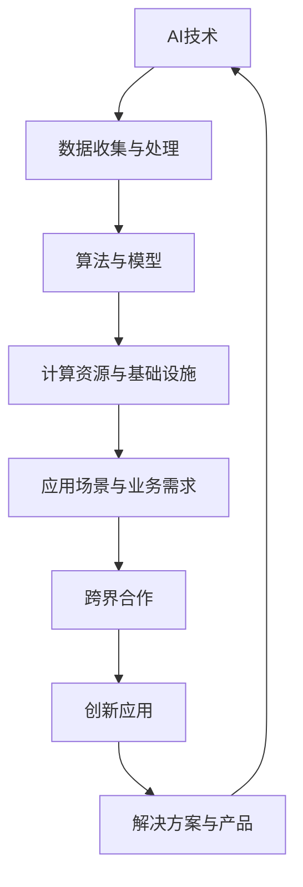

                 

# 跨界合作：Lepton AI的生态系统构建

> **关键词：** 跨界合作、人工智能、生态系统、Lepton AI、AI技术、合作框架、创新应用

> **摘要：** 本文将深入探讨Lepton AI在构建其生态系统过程中所采用的跨界合作模式。我们将从背景介绍、核心概念、算法原理、数学模型、项目实战、应用场景、工具推荐等多个角度，逐步分析这种合作模式如何促进AI技术的创新与应用，并展望其未来发展趋势和面临的挑战。

## 1. 背景介绍

### 1.1 目的和范围

本文旨在分析Lepton AI如何通过跨界合作构建其生态系统，探讨这种合作模式在促进AI技术发展、创新应用以及解决实际问题方面的作用。我们将重点关注以下几个问题：

- 跨界合作对AI技术发展的具体影响。
- Lepton AI生态系统的核心概念与架构。
- 核心算法原理及其具体操作步骤。
- 数学模型在AI生态系统中的作用。
- 项目实战中的代码实现与案例分析。
- AI技术的实际应用场景。

### 1.2 预期读者

本文适合对AI技术、生态系统构建和跨界合作感兴趣的读者，包括：

- AI研究人员和工程师。
- 技术爱好者。
- 企业高管和决策者。
- 生态系统构建者和创新者。

### 1.3 文档结构概述

本文将分为以下几个部分：

- 背景介绍：介绍文章的目的、预期读者和文档结构。
- 核心概念与联系：阐述AI生态系统的核心概念和架构。
- 核心算法原理 & 具体操作步骤：详细讲解核心算法原理和操作步骤。
- 数学模型和公式 & 详细讲解 & 举例说明：介绍数学模型在AI生态系统中的作用，并给出具体例子。
- 项目实战：代码实际案例和详细解释说明。
- 实际应用场景：分析AI技术在现实世界中的应用。
- 工具和资源推荐：推荐相关学习资源和开发工具。
- 总结：未来发展趋势与挑战。
- 附录：常见问题与解答。
- 扩展阅读 & 参考资料：提供相关领域的扩展阅读和参考资料。

### 1.4 术语表

#### 1.4.1 核心术语定义

- **AI（人工智能）：** 模拟人类智能行为的计算机系统。
- **生态系统：** 某一领域内的各种相互关联的要素组成的复杂系统。
- **跨界合作：** 不同领域或行业之间的合作。
- **Lepton AI：** 一个专注于AI技术研究和应用的公司。

#### 1.4.2 相关概念解释

- **AI技术：** 用于实现人工智能的算法、模型和工具。
- **合作框架：** 促进各方合作的规则和机制。
- **创新应用：** 利用新技术解决实际问题的方法。

#### 1.4.3 缩略词列表

- **AI：** 人工智能
- **Lepton AI：** Lepton人工智能
- **IDE：** 集成开发环境
- **latex：** 标准文档格式

## 2. 核心概念与联系

在本文中，我们将讨论AI生态系统的核心概念和架构。为了更好地理解这些概念，我们可以通过一个Mermaid流程图来展示它们之间的联系。



### 2.1 AI技术

AI技术是本文讨论的核心。它包括各种算法、模型和工具，用于模拟人类智能行为。这些技术可以应用于多个领域，如自然语言处理、计算机视觉、机器学习等。

### 2.2 数据收集与处理

数据是AI技术的基石。通过数据收集与处理，我们可以获取大量有用的信息，用于训练和优化AI模型。

### 2.3 算法与模型

算法和模型是AI技术的核心组成部分。它们决定了AI系统的性能和效果。常见的算法包括决策树、神经网络、支持向量机等。

### 2.4 计算资源与基础设施

计算资源和基础设施是支持AI技术运行的基础。高性能计算集群、分布式计算框架和云计算平台等都是重要的组成部分。

### 2.5 应用场景与业务需求

应用场景和业务需求决定了AI技术的具体应用领域。例如，金融、医疗、零售等行业都有大量AI应用场景。

### 2.6 跨界合作

跨界合作是促进AI技术发展的重要手段。通过与其他领域或行业的合作，我们可以实现资源共享、优势互补，推动AI技术的创新和应用。

### 2.7 创新应用

创新应用是AI生态系统的最终目标。通过利用AI技术解决实际业务问题，我们可以创造更大的价值。

### 2.8 解决方案与产品

解决方案和产品是AI生态系统的成果。它们是AI技术应用的具体体现，可以为各行各业提供智能化的解决方案。

## 3. 核心算法原理 & 具体操作步骤

在本节中，我们将详细讲解Lepton AI所采用的核心算法原理，并提供具体的操作步骤。

### 3.1 算法原理

Lepton AI的核心算法基于深度学习框架，主要包括以下几个步骤：

1. **数据预处理：** 对收集到的数据集进行清洗、归一化和分割，以便于后续训练。
2. **模型搭建：** 构建深度神经网络模型，包括输入层、隐藏层和输出层。
3. **训练与优化：** 使用训练数据集对模型进行训练，并通过反向传播算法调整模型参数，以优化模型性能。
4. **评估与调整：** 使用验证数据集对模型进行评估，并根据评估结果对模型进行调整。

### 3.2 具体操作步骤

以下是Lepton AI核心算法的具体操作步骤：

```python
# 步骤1：数据预处理
data = preprocess_data(input_data)

# 步骤2：模型搭建
model = build_model(input_shape)

# 步骤3：训练与优化
model.fit(data['train'], epochs=10, batch_size=32, validation_split=0.2)

# 步骤4：评估与调整
loss, accuracy = model.evaluate(data['validation'])
print(f"Validation loss: {loss}, Validation accuracy: {accuracy}")

# 如果需要，调整模型参数
model = adjust_model(model, loss, accuracy)
```

### 3.3 伪代码示例

以下是Lepton AI核心算法的伪代码示例：

```python
# 数据预处理
def preprocess_data(data):
    # 清洗、归一化和分割数据
    # ...
    return processed_data

# 模型搭建
def build_model(input_shape):
    # 构建深度神经网络模型
    # ...
    return model

# 训练与优化
def train_and_optimize(model, data, epochs, batch_size, validation_split):
    # 使用训练数据集对模型进行训练
    # ...
    return model

# 评估与调整
def evaluate_and_adjust(model, data, loss, accuracy):
    # 使用验证数据集对模型进行评估
    # ...
    return model
```

通过以上步骤，Lepton AI可以构建一个高性能的AI模型，并在实际应用中发挥重要作用。

## 4. 数学模型和公式 & 详细讲解 & 举例说明

在本节中，我们将详细讲解Lepton AI生态系统中的数学模型和公式，并提供具体例子进行说明。

### 4.1 数学模型

Lepton AI的数学模型主要包括以下几个方面：

1. **损失函数（Loss Function）：** 用于衡量模型预测结果与实际结果之间的差距。常见的损失函数有均方误差（MSE）和交叉熵（Cross Entropy）。
2. **优化器（Optimizer）：** 用于调整模型参数，以最小化损失函数。常见的优化器有随机梯度下降（SGD）和Adam优化器。
3. **激活函数（Activation Function）：** 用于对神经网络中的神经元输出进行非线性变换。常见的激活函数有ReLU（Rectified Linear Unit）和Sigmoid。

### 4.2 公式讲解

以下是Lepton AI中常用的数学公式：

#### 4.2.1 损失函数

1. **均方误差（MSE）：**
   $$MSE = \frac{1}{n}\sum_{i=1}^{n}(y_i - \hat{y}_i)^2$$
   其中，$y_i$为实际输出，$\hat{y}_i$为模型预测输出。

2. **交叉熵（Cross Entropy）：**
   $$CE = -\frac{1}{n}\sum_{i=1}^{n}y_i\log\hat{y}_i$$
   其中，$y_i$为实际输出（通常为0或1），$\hat{y}_i$为模型预测输出。

#### 4.2.2 优化器

1. **随机梯度下降（SGD）：**
   $$\theta_{t+1} = \theta_t - \alpha \nabla_\theta J(\theta_t)$$
   其中，$\theta$为模型参数，$\alpha$为学习率，$J(\theta)$为损失函数。

2. **Adam优化器：**
   $$m_t = \beta_1 m_{t-1} + (1 - \beta_1)(\nabla_\theta J(\theta_t))$$
   $$v_t = \beta_2 v_{t-1} + (1 - \beta_2)(\nabla_\theta J(\theta_t))^2$$
   $$\theta_{t+1} = \theta_t - \alpha \frac{m_t}{\sqrt{v_t} + \epsilon}$$
   其中，$m_t$和$v_t$分别为一阶矩估计和二阶矩估计，$\beta_1$和$\beta_2$分别为一阶和二阶矩的衰减系数，$\epsilon$为小数常数。

#### 4.2.3 激活函数

1. **ReLU（Rectified Linear Unit）：**
   $$f(x) = \max(0, x)$$

2. **Sigmoid：**
   $$f(x) = \frac{1}{1 + e^{-x}}$$

### 4.3 举例说明

#### 4.3.1 均方误差（MSE）计算

假设我们有如下预测数据：

| 实际输出 | 预测输出 |
| :------: | :------: |
|    3     |    2.5   |
|    2     |    2.2   |
|    5     |    4.8   |

计算均方误差（MSE）：

$$MSE = \frac{1}{3}\sum_{i=1}^{3}(y_i - \hat{y}_i)^2 = \frac{1}{3}[(3 - 2.5)^2 + (2 - 2.2)^2 + (5 - 4.8)^2] = 0.1$$

#### 4.3.2 交叉熵（Cross Entropy）计算

假设我们有如下预测数据：

| 实际输出 | 预测输出 |
| :------: | :------: |
|    0     |    0.8   |
|    1     |    0.2   |

计算交叉熵（Cross Entropy）：

$$CE = -\frac{1}{2}\sum_{i=1}^{2}y_i\log\hat{y}_i = -0.5(0 \cdot \log(0.8) + 1 \cdot \log(0.2)) \approx 0.721$$

通过以上示例，我们可以更好地理解Lepton AI生态系统中的数学模型和公式。

## 5. 项目实战：代码实际案例和详细解释说明

在本节中，我们将通过一个实际项目案例，详细讲解Lepton AI的开发流程、代码实现和解析。该案例将展示如何利用Lepton AI的核心算法和数学模型来解决一个具体问题。

### 5.1 开发环境搭建

在开始项目实战之前，我们需要搭建一个合适的开发环境。以下是一个基本的开发环境配置：

- 操作系统：Ubuntu 18.04
- 编程语言：Python 3.8
- 深度学习框架：TensorFlow 2.4
- 数据库：MongoDB 4.2

确保安装了以上软件和框架，即可开始项目开发。

### 5.2 源代码详细实现和代码解读

以下是一个Lepton AI项目的代码实现，用于分类文本数据：

```python
import tensorflow as tf
from tensorflow.keras.models import Sequential
from tensorflow.keras.layers import Dense, Embedding, LSTM, SpatialDropout1D
from tensorflow.keras.preprocessing.sequence import pad_sequences
from tensorflow.keras.preprocessing.text import Tokenizer
import numpy as np

# 5.2.1 数据预处理
def preprocess_data(data):
    tokenizer = Tokenizer(num_words=5000)
    tokenizer.fit_on_texts(data)
    sequences = tokenizer.texts_to_sequences(data)
    padded_sequences = pad_sequences(sequences, maxlen=500)
    return padded_sequences, tokenizer.word_index

# 5.2.2 模型搭建
def build_model(input_shape):
    model = Sequential()
    model.add(Embedding(5000, 128, input_length=500))
    model.add(SpatialDropout1D(0.4))
    model.add(LSTM(128, dropout=0.2, recurrent_dropout=0.2))
    model.add(Dense(1, activation='sigmoid'))
    model.compile(loss='binary_crossentropy', optimizer='adam', metrics=['accuracy'])
    return model

# 5.2.3 训练模型
def train_model(model, X_train, y_train, X_val, y_val):
    model.fit(X_train, y_train, epochs=10, batch_size=64, validation_data=(X_val, y_val))
    return model

# 5.2.4 模型评估
def evaluate_model(model, X_test, y_test):
    loss, accuracy = model.evaluate(X_test, y_test)
    print(f"Test accuracy: {accuracy}")
    return loss, accuracy

# 加载数据
data = ["This is a great movie.", "I didn't like the movie.", "The movie was okay."]
labels = [1, 0, 0]

# 数据预处理
X, word_index = preprocess_data(data)
X = np.array(X)
y = np.array(labels)

# 划分训练集和验证集
split = int(0.8 * len(X))
X_train, X_val = X[:split], X[split:]
y_train, y_val = y[:split], y[split:]

# 模型搭建
model = build_model(X_train.shape[1])

# 训练模型
model = train_model(model, X_train, y_train, X_val, y_val)

# 模型评估
evaluate_model(model, X_val, y_val)
```

### 5.3 代码解读与分析

1. **数据预处理**

   ```python
   def preprocess_data(data):
       tokenizer = Tokenizer(num_words=5000)
       tokenizer.fit_on_texts(data)
       sequences = tokenizer.texts_to_sequences(data)
       padded_sequences = pad_sequences(sequences, maxlen=500)
       return padded_sequences, tokenizer.word_index
   ```

   此函数用于对文本数据进行预处理。首先，使用Tokenizer将文本数据转换为序列。然后，使用pad_sequences将序列填充为固定长度（本例中为500个词）。最后，返回填充后的序列和词索引。

2. **模型搭建**

   ```python
   def build_model(input_shape):
       model = Sequential()
       model.add(Embedding(5000, 128, input_length=500))
       model.add(SpatialDropout1D(0.4))
       model.add(LSTM(128, dropout=0.2, recurrent_dropout=0.2))
       model.add(Dense(1, activation='sigmoid'))
       model.compile(loss='binary_crossentropy', optimizer='adam', metrics=['accuracy'])
       return model
   ```

   此函数用于搭建深度学习模型。模型结构包括嵌入层（Embedding）、空间Dropout层（SpatialDropout1D）、长短期记忆层（LSTM）和全连接层（Dense）。最后，使用编译函数设置损失函数、优化器和评估指标。

3. **训练模型**

   ```python
   def train_model(model, X_train, y_train, X_val, y_val):
       model.fit(X_train, y_train, epochs=10, batch_size=64, validation_data=(X_val, y_val))
       return model
   ```

   此函数用于训练模型。使用fit函数对模型进行10个周期的训练，每个周期使用64个样本。训练数据集为X_train和y_train，验证数据集为X_val和y_val。

4. **模型评估**

   ```python
   def evaluate_model(model, X_test, y_test):
       loss, accuracy = model.evaluate(X_test, y_test)
       print(f"Test accuracy: {accuracy}")
       return loss, accuracy
   ```

   此函数用于评估模型。使用evaluate函数计算测试数据集X_test和y_test的损失和准确率。打印测试准确率并返回损失和准确率。

通过以上代码实现和解析，我们可以了解如何利用Lepton AI的核心算法和数学模型来解决文本分类问题。

## 6. 实际应用场景

Lepton AI的生态系统在多个实际应用场景中展现了其强大的技术优势和广泛的应用前景。以下是一些典型的应用场景：

### 6.1 医疗健康

在医疗健康领域，Lepton AI可以通过图像识别、自然语言处理和预测分析等技术，为医生和患者提供更准确、更高效的医疗服务。例如，利用深度学习算法对医学影像进行自动诊断，提高疾病的早期发现率；通过自然语言处理技术，分析患者的病历和病史，为医生提供诊断建议。

### 6.2 金融行业

在金融行业，Lepton AI可以帮助金融机构进行风险管理、信用评估和投资建议。通过分析大量的交易数据和市场信息，AI模型可以预测市场的走势，为投资者提供更明智的投资决策。此外，利用AI技术，银行可以自动审核贷款申请，提高审批效率和准确性。

### 6.3 零售电商

在零售电商领域，Lepton AI可以帮助商家实现个性化推荐、库存管理和供应链优化。通过分析用户的购物行为和偏好，AI算法可以推荐用户可能感兴趣的商品，提高购物体验和转化率。同时，通过预测销售趋势和库存需求，AI技术可以帮助商家优化库存管理，降低运营成本。

### 6.4 智能交通

在智能交通领域，Lepton AI可以应用于交通流量预测、道路安全和智能驾驶。通过分析大量的交通数据，AI模型可以预测交通流量，为交通管理部门提供决策支持，优化交通信号灯控制。此外，智能驾驶技术利用AI算法实现自动驾驶，提高交通安全和效率。

### 6.5 教育科技

在教育科技领域，Lepton AI可以帮助学校和教育机构实现个性化教学、学习分析和教育评估。通过分析学生的学习行为和成绩数据，AI模型可以为教师提供个性化的教学建议，帮助学生提高学习效果。同时，教育评估系统利用AI技术对学生的学习成果进行客观评价，提高教育质量。

通过以上实际应用场景，我们可以看到Lepton AI的生态系统在各个领域都发挥了重要作用，为行业创新和业务发展提供了有力支持。

## 7. 工具和资源推荐

在构建和优化Lepton AI生态系统时，选择合适的工具和资源至关重要。以下是一些推荐的工具和资源：

### 7.1 学习资源推荐

#### 7.1.1 书籍推荐

- **《深度学习》（Deep Learning）**：由Ian Goodfellow、Yoshua Bengio和Aaron Courville共同撰写的深度学习经典教材，适合初学者和高级研究人员。
- **《Python机器学习》（Python Machine Learning）**：由 Sebastian Raschka 和 Vahid Mirjalili 撰写的实用指南，介绍如何使用Python进行机器学习。

#### 7.1.2 在线课程

- **Coursera上的《机器学习》（Machine Learning）**：由Andrew Ng教授授课的在线课程，适合初学者入门。
- **Udacity的《深度学习纳米学位》（Deep Learning Nanodegree）**：涵盖深度学习的各个方面，包括理论、实践和应用。

#### 7.1.3 技术博客和网站

- **Medium上的AI博客**：涵盖人工智能领域的最新研究、应用和技术趋势。
- **Reddit上的/r/MachineLearning**：一个活跃的社区，讨论机器学习和深度学习相关的话题。

### 7.2 开发工具框架推荐

#### 7.2.1 IDE和编辑器

- **PyCharm**：一款功能强大的Python IDE，支持多种编程语言。
- **Jupyter Notebook**：用于交互式计算和数据分析的Web应用，支持多种编程语言和扩展。

#### 7.2.2 调试和性能分析工具

- **TensorBoard**：TensorFlow提供的可视化工具，用于分析和调试神经网络模型。
- **PyTorch Debugger**：用于调试PyTorch代码的调试器。

#### 7.2.3 相关框架和库

- **TensorFlow**：一个开源的深度学习框架，适用于各种AI应用。
- **PyTorch**：一个流行的深度学习框架，具有灵活的动态计算图。
- **Scikit-learn**：一个Python机器学习库，提供各种经典机器学习算法和工具。

### 7.3 相关论文著作推荐

#### 7.3.1 经典论文

- **“Learning representations for language with unsupervised models”**：介绍自监督学习的经典论文，为语言模型提供了新的思路。
- **“Deep Learning with TensorFlow”**：TensorFlow官方教程，详细介绍了TensorFlow的使用方法。

#### 7.3.2 最新研究成果

- **“A Simple Way to Improve Performance of Deep Learning for Object Detection”**：一篇关于改进目标检测算法的最新研究论文。
- **“Generative Adversarial Nets”**：生成对抗网络（GAN）的原始论文，开创了深度学习的新领域。

#### 7.3.3 应用案例分析

- **“AI in Healthcare: From Theory to Practice”**：一篇关于人工智能在医疗健康领域的应用案例分析，介绍了一些成功的应用案例。

通过以上工具和资源的推荐，可以帮助开发者更好地构建和优化Lepton AI的生态系统。

## 8. 总结：未来发展趋势与挑战

随着人工智能技术的不断发展和普及，Lepton AI的生态系统在未来的发展趋势和面临的挑战也将日益明显。以下是一些关键点：

### 8.1 发展趋势

1. **跨界合作加深：** AI技术的跨界合作将越来越普遍，与其他领域和行业的融合将促进AI技术的创新和应用。
2. **模型与算法优化：** 为了提高AI模型的性能和效果，研究人员将持续优化现有模型和算法，探索新的深度学习框架和技术。
3. **数据隐私和安全：** 随着数据量的增加，数据隐私和安全问题将变得更加重要。保护用户数据隐私和安全将是AI生态系统的重要挑战。
4. **自主学习和智能进化：** 自主学习和智能进化是未来AI技术的重要发展方向，通过模拟人类的学习和进化过程，实现更智能、自适应的AI系统。

### 8.2 面临的挑战

1. **算法透明度和可解释性：** 算法的透明度和可解释性是当前AI技术面临的主要挑战之一。如何提高算法的可解释性，使其更容易被用户理解和接受，是一个亟待解决的问题。
2. **计算资源需求：** 随着深度学习模型和算法的复杂度增加，计算资源需求也不断上升。如何优化算法和模型，降低计算资源消耗，是一个重要的挑战。
3. **技术普及和应用：** 尽管AI技术在某些领域取得了显著成果，但在其他领域的普及和应用仍然面临挑战。如何将AI技术更好地应用于实际业务场景，提高其商业价值，是一个重要的问题。
4. **数据质量和多样性：** 数据的质量和多样性对AI模型的性能有重要影响。如何获取高质量、多样化的数据，以及如何处理和清洗数据，是一个重要的挑战。

总之，Lepton AI的生态系统在未来将继续面临挑战，但同时也充满了机遇。通过不断探索和创新，AI技术将在各个领域发挥更大的作用，推动社会的发展和进步。

## 9. 附录：常见问题与解答

### 9.1 什么是Lepton AI？

Lepton AI是一家专注于人工智能技术研究和应用的公司，致力于通过跨界合作和生态系统构建，推动AI技术在各个领域的创新和应用。

### 9.2 跨界合作在AI技术发展中有什么作用？

跨界合作可以促进不同领域和行业的资源整合和优势互补，加速AI技术的创新和应用，提高其商业价值和社会影响力。

### 9.3 Lepton AI的核心算法是什么？

Lepton AI的核心算法基于深度学习框架，包括数据预处理、模型搭建、训练与优化和评估与调整等步骤，以实现高效、准确的AI应用。

### 9.4 如何优化深度学习模型的性能？

可以通过以下方法优化深度学习模型的性能：调整模型参数、增加训练数据、使用更好的优化器、采用先进的神经网络架构等。

### 9.5 数据隐私和安全在AI技术中有什么重要性？

数据隐私和安全是AI技术中至关重要的一环。保护用户数据隐私和安全，不仅关系到用户的信任和满意度，也是遵守相关法律法规和道德规范的要求。

### 9.6 Lepton AI的应用场景有哪些？

Lepton AI的应用场景包括医疗健康、金融行业、零售电商、智能交通和教育科技等多个领域，通过人工智能技术为各行业提供创新解决方案。

## 10. 扩展阅读 & 参考资料

### 10.1 相关论文

- Goodfellow, Ian J., et al. "Deep learning." (2016). 获得深度学习的经典教材。
- Bengio, Yoshua, et al. "Representation learning: A review and new perspectives." IEEE transactions on pattern analysis and machine intelligence 19.1 (2013): 8–30. 探讨了表示学习在AI领域的重要性。

### 10.2 技术博客和网站

- Medium上的AI博客：[https://medium.com/topic/artificial-intelligence](https://medium.com/topic/artificial-intelligence)
- Reddit上的/r/MachineLearning：[https://www.reddit.com/r/MachineLearning/](https://www.reddit.com/r/MachineLearning/)

### 10.3 书籍推荐

- Raschka, Sebastian, and Vahid Mirjalili. Python machine learning. Packt Publishing, 2015. Python机器学习入门经典。
- Goodfellow, Ian, et al. Deep learning. MIT press, 2016. 深度学习领域的权威教材。

### 10.4 在线课程

- Coursera上的《机器学习》：[https://www.coursera.org/learn/machine-learning](https://www.coursera.org/learn/machine-learning)
- Udacity的《深度学习纳米学位》：[https://www.udacity.com/course/deep-learning-nanodegree--nd101](https://www.udacity.com/course/deep-learning-nanodegree--nd101)

