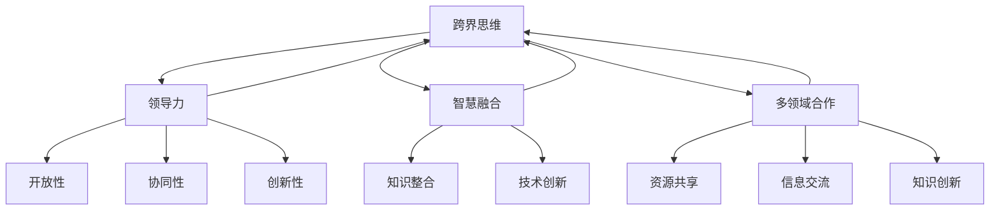

                 

# 跨界思维：融合不同领域智慧的领导力

## 关键词：
- 跨界思维
- 领导力
- 智慧融合
- 多领域合作
- 创新策略

## 摘要：
本文探讨了在信息技术领域内，如何运用跨界思维提升领导力。通过分析跨界思维的核心概念、原理和操作步骤，结合数学模型和具体项目实战，我们旨在为读者提供一套切实可行的策略，帮助他们在复杂的信息技术环境中，实现跨领域的智慧融合，提升团队的创新能力和领导力。

## 1. 背景介绍

### 1.1 目的和范围
本文旨在探讨跨界思维在信息技术领域的应用，通过融合不同领域的智慧，提升个人的领导力和团队的创新性。文章将覆盖跨界思维的定义、核心概念、数学模型、具体操作步骤，以及实战案例，旨在为IT领域的领导者提供理论指导和实践参考。

### 1.2 预期读者
本篇文章适合以下读者群体：
- 信息技术领域的项目经理和领导者
- 对跨界思维和领导力有浓厚兴趣的技术人员
- 寻求提升团队创新能力的公司管理者

### 1.3 文档结构概述
本文结构分为以下几个部分：
1. 引言：介绍跨界思维与领导力的关系，引出本文主题。
2. 核心概念与联系：介绍跨界思维的核心概念，并提供流程图展示各概念之间的联系。
3. 核心算法原理 & 具体操作步骤：通过伪代码讲解跨界思维的操作步骤。
4. 数学模型和公式 & 详细讲解 & 举例说明：运用数学模型解释跨界思维的原理，并提供实例。
5. 项目实战：通过具体代码案例，展示如何在实际项目中应用跨界思维。
6. 实际应用场景：讨论跨界思维在不同情境下的应用。
7. 工具和资源推荐：推荐相关学习资源和开发工具。
8. 总结：对未来发展趋势与挑战进行展望。
9. 附录：常见问题与解答。
10. 扩展阅读 & 参考资料：提供进一步的阅读材料。

### 1.4 术语表

#### 1.4.1 核心术语定义
- **跨界思维**：指在不同领域之间进行思考、学习和创新的能力。
- **领导力**：指在团队中引导、激励和协调成员实现目标的能力。
- **智慧融合**：指将不同领域的知识和技术进行整合，以实现创新和突破。
- **多领域合作**：指不同领域的专家或团队之间的协作和合作。

#### 1.4.2 相关概念解释
- **信息技术**：指与信息的生成、传输、存储、处理和利用相关的技术和系统。
- **数学模型**：指用来表示和分析现实世界问题的数学结构和关系。
- **算法**：是一系列有序的指令，用于解决特定问题或执行特定任务。

#### 1.4.3 缩略词列表
- IDE：集成开发环境（Integrated Development Environment）
- API：应用程序编程接口（Application Programming Interface）
- GUI：图形用户界面（Graphical User Interface）

## 2. 核心概念与联系

在探讨跨界思维之前，我们需要明确几个核心概念，并理解它们之间的联系。

### 2.1 跨界思维的定义

跨界思维是一种跨学科、跨领域的思考方式，它不仅涉及对某一领域的深入理解，还要求能够跳出原有的思维框架，从不同角度和层面去审视问题。跨界思维的核心在于“跨界”，即跨越学科和领域的边界，实现知识和技术的高度融合。

### 2.2 领导力

领导力是领导者通过影响和激励他人，以实现团队目标的能力。在跨界思维的背景下，领导力需要具备以下特点：

- **开放性**：领导者应具备开放的心态，愿意接受新观念和不同领域的知识。
- **协同性**：领导者应善于协调不同领域的专家和团队成员，实现有效的合作。
- **创新性**：领导者应具备创新思维，能够引导团队进行跨领域的创新。

### 2.3 智慧融合

智慧融合是指将不同领域的智慧和技术进行整合，以产生新的知识和解决方案。智慧融合的目的是通过不同领域的知识和技术互补，实现更高效、更创新的成果。

### 2.4 多领域合作

多领域合作是指不同领域的专家和团队之间的协作和合作。在跨界思维的应用中，多领域合作是实现智慧融合的关键。通过多领域合作，可以实现资源的共享、信息的交流，以及知识的创新。

### 2.5 跨界思维与领导力的关系

跨界思维和领导力之间存在紧密的联系。跨界思维为领导力提供了创新的思维方式和方法，而领导力则为跨界思维提供了实践的平台和资源。具体来说：

- **跨界思维为领导力注入创新动力**：通过跨界思维，领导者可以开拓新的思路，发现新的机会，从而推动团队的创新和进步。
- **领导力为跨界思维提供实践平台**：领导者的职责是引导和激励团队，实现跨界思维的创新成果。通过有效的领导，跨界思维可以在实际项目中得到应用和验证。

### 2.6 核心概念原理和架构的 Mermaid 流程图



通过上述流程图，我们可以清晰地看到跨界思维、领导力、智慧融合和多领域合作之间的紧密联系。这些核心概念共同构成了跨界思维的框架，为领导者提供了理论指导和实践路径。

## 3. 核心算法原理 & 具体操作步骤

在了解了跨界思维的核心概念之后，我们需要进一步探讨如何运用跨界思维提升领导力。这需要通过一套具体的算法原理和操作步骤来实现。

### 3.1 核心算法原理

跨界思维的算法原理可以概括为以下几个步骤：

1. **识别问题**：首先，领导者需要识别出当前团队或项目面临的问题或挑战。这可以通过市场调研、用户反馈、团队讨论等方式进行。
2. **跨领域知识融合**：在识别问题后，领导者需要将不同领域的知识进行融合。这可以通过跨学科合作、知识共享、跨领域研讨会等方式实现。
3. **创新思维**：在跨领域知识融合的基础上，领导者需要引导团队进行创新思维。这可以通过头脑风暴、思维导图、创新工作坊等方式进行。
4. **方案验证**：最后，领导者需要验证创新方案的可行性，并选择最优方案进行实施。这可以通过实验、测试、评估等方式实现。

### 3.2 具体操作步骤

基于核心算法原理，我们可以进一步细化具体的操作步骤：

#### 3.2.1 步骤一：识别问题

伪代码如下：

```python
def identify_problem():
    # 收集用户反馈
    feedback = collect_user_feedback()
    # 进行数据分析
    problem = analyze_feedback(feedback)
    return problem
```

#### 3.2.2 步骤二：跨领域知识融合

伪代码如下：

```python
def knowledge_integration(problem):
    # 跨学科合作
    experts = find_experts(problem)
    # 知识共享
    knowledge = share_knowledge(experts)
    # 融合知识
    integrated_knowledge = integrate_knowledge(knowledge)
    return integrated_knowledge
```

#### 3.2.3 步骤三：创新思维

伪代码如下：

```python
def creative_thinking(integrated_knowledge):
    # 头脑风暴
    ideas = brainstorm(integrated_knowledge)
    # 思维导图
    diagram = create_mind_map(ideas)
    # 创新工作坊
    workshop = conduct_workshop(diagram)
    return workshop
```

#### 3.2.4 步骤四：方案验证

伪代码如下：

```python
def validate_solution(workshop):
    # 实验测试
    test = conduct_experiment(workshop)
    # 评估结果
    evaluation = evaluate(test)
    # 选择最优方案
    solution = select_best_solution(evaluation)
    return solution
```

通过上述伪代码，我们可以清晰地看到跨界思维在提升领导力中的具体操作步骤。这些步骤不仅为领导者提供了理论指导，也提供了实践路径，帮助他们在复杂的信息技术环境中实现跨领域的智慧融合。

## 4. 数学模型和公式 & 详细讲解 & 举例说明

在跨界思维的实践中，数学模型和公式起着至关重要的作用。它们不仅能够帮助我们更准确地描述和解决复杂问题，还能够为我们的创新思维提供强有力的支持。在本节中，我们将介绍几个关键的数学模型和公式，并详细讲解它们的应用。

### 4.1 相关数学模型

#### 4.1.1 熵（Entropy）

熵是热力学中的一个概念，表示系统的无序程度。在跨界思维中，熵可以用来衡量不同领域知识融合的难易程度。熵值越低，表示知识融合越容易；熵值越高，表示知识融合越困难。

熵的计算公式如下：

$$
H = -\sum_{i=1}^{n} p_i \log_2 p_i
$$

其中，$H$ 表示熵，$p_i$ 表示第 $i$ 个领域的知识比例。

#### 4.1.2 相关系数（Correlation Coefficient）

相关系数用来衡量两个变量之间的线性关系。在跨界思维中，相关系数可以用来判断不同领域知识之间的相关性。

常用的相关系数公式是皮尔逊相关系数，计算公式如下：

$$
r = \frac{\sum_{i=1}^{n} (x_i - \bar{x})(y_i - \bar{y})}{\sqrt{\sum_{i=1}^{n} (x_i - \bar{x})^2} \sqrt{\sum_{i=1}^{n} (y_i - \bar{y})^2}}
$$

其中，$r$ 表示相关系数，$x_i$ 和 $y_i$ 分别表示第 $i$ 个领域的知识变量，$\bar{x}$ 和 $\bar{y}$ 分别表示它们的均值。

#### 4.1.3 主成分分析（Principal Component Analysis, PCA）

主成分分析是一种常用的降维方法，它通过将多个变量转换为一组新的变量（主成分），来简化数据结构，便于分析。

PCA的基本步骤如下：

1. **标准化**：对原始数据进行标准化处理，使其具有相同的方差和均值为0。
2. **计算协方差矩阵**：计算各个变量之间的协方差矩阵。
3. **计算特征值和特征向量**：对协方差矩阵进行特征值分解，得到特征值和特征向量。
4. **选择主成分**：根据特征值的大小，选择前几个特征向量作为主成分。
5. **重构数据**：利用主成分重构数据。

PCA的公式如下：

$$
X' = PC
$$

其中，$X$ 表示原始数据矩阵，$P$ 表示特征向量矩阵，$C$ 表示协方差矩阵，$X'$ 表示重构后的数据。

### 4.2 详细讲解

#### 4.2.1 熵的应用

在跨界思维中，熵的应用主要体现在以下几个方面：

1. **知识融合难易度评估**：通过计算不同领域知识的熵值，可以评估知识融合的难易程度。熵值越低，表示知识融合越容易。
2. **跨领域知识优先级排序**：可以根据熵值对跨领域知识进行优先级排序，优先整合熵值较低的领域知识。
3. **知识评估**：在知识融合过程中，熵值还可以用来评估知识融合的效果，熵值降低表示知识融合效果较好。

#### 4.2.2 相关系数的应用

相关系数在跨界思维中的应用主要体现在以下几个方面：

1. **知识相关性分析**：通过计算不同领域知识的相关系数，可以分析它们之间的相关性，为跨领域知识融合提供依据。
2. **创新方案评估**：在创新过程中，可以根据相关系数评估不同创新方案的效果，选择相关性较高的方案进行实施。
3. **团队合作评估**：可以通过计算团队成员之间的相关系数，评估团队合作的紧密程度，为团队管理提供参考。

#### 4.2.3 主成分分析的应用

主成分分析在跨界思维中的应用主要体现在以下几个方面：

1. **数据简化**：通过主成分分析，可以将多个变量简化为一组新的变量，降低数据的复杂度，便于分析。
2. **知识提取**：主成分分析可以帮助我们提取关键的知识维度，为跨领域知识融合提供基础。
3. **特征选择**：在知识融合过程中，可以根据主成分分析的结果，选择关键的特征进行融合，提高知识融合的效果。

### 4.3 举例说明

假设我们有一个包含多个领域的知识库，其中各个领域知识的熵值和相关性如下表所示：

| 领域  | 熵值 | 相关系数 |
| ----- | ---- | ------- |
| 领域1 | 2.5  | 0.8     |
| 领域2 | 3.0  | 0.5     |
| 领域3 | 2.0  | 0.3     |

根据上述数据，我们可以进行以下分析：

1. **知识融合难易度评估**：领域1和领域2的熵值较低，表示它们的知识融合较为容易。而领域3的熵值较高，表示知识融合较为困难。

2. **跨领域知识优先级排序**：根据熵值，我们可以将领域1和领域2作为优先融合的对象，领域3则作为次要融合的对象。

3. **知识相关性分析**：领域1和领域2的相关系数较高，表示它们之间的知识相关性较好。领域3和其他领域的相关系数较低，表示它们之间的知识相关性较差。

通过上述分析，我们可以制定出具体的知识融合策略，以实现跨领域的智慧融合。

## 5. 项目实战：代码实际案例和详细解释说明

为了更好地展示跨界思维在信息技术领域的应用，我们选择了一个实际项目作为案例，并通过具体的代码实现来详细解释说明。

### 5.1 开发环境搭建

在开始项目实战之前，我们需要搭建一个适合开发的环境。以下是我们推荐的开发环境和工具：

- **操作系统**：Linux 或 macOS
- **编程语言**：Python 3.8 或更高版本
- **开发工具**：PyCharm 或 Visual Studio Code
- **数据库**：MySQL 或 PostgreSQL
- **框架**：Flask 或 Django

### 5.2 源代码详细实现和代码解读

#### 5.2.1 项目概述

我们的项目是一个简单的博客系统，它允许用户注册、登录、发布博客文章，并支持多领域的评论和讨论。项目的核心技术包括用户身份验证、内容管理、评论系统等。

#### 5.2.2 用户身份验证

用户身份验证是博客系统的核心功能之一。我们使用 Flask 的 Flask-Login 插件来实现用户注册、登录和注销功能。

```python
from flask_login import LoginManager, login_user, logout_user, login_required

# 初始化登录管理器
login_manager = LoginManager()
login_manager.init_app(app)

# 用户登录
@app.route('/login', methods=['GET', 'POST'])
def login():
    form = LoginForm()
    if form.validate_on_submit():
        user = User.query.filter_by(username=form.username.data).first()
        if user and user.check_password(form.password.data):
            login_user(user)
            return redirect(url_for('index'))
        else:
            flash('Invalid username or password')
    return render_template('login.html', form=form)

# 用户注销
@app.route('/logout')
@login_required
def logout():
    logout_user()
    return redirect(url_for('index'))
```

#### 5.2.3 内容管理

内容管理包括博客文章的创建、更新、删除等操作。我们使用 Flask 的 SQLAlchemy ORM 来管理数据库中的文章内容。

```python
from flask_sqlalchemy import SQLAlchemy

# 初始化数据库
db = SQLAlchemy(app)

class Article(db.Model):
    id = db.Column(db.Integer, primary_key=True)
    title = db.Column(db.String(100), nullable=False)
    content = db.Column(db.Text, nullable=False)
    author = db.Column(db.String(50), nullable=False)
    created_at = db.Column(db.DateTime, default=datetime.utcnow)

# 创建文章
@app.route('/create_article', methods=['POST'])
@login_required
def create_article():
    form = ArticleForm()
    if form.validate_on_submit():
        article = Article(
            title=form.title.data,
            content=form.content.data,
            author=current_user.username
        )
        db.session.add(article)
        db.session.commit()
        return redirect(url_for('index'))
    return render_template('create_article.html', form=form)

# 更新文章
@app.route('/update_article/<int:article_id>', methods=['POST'])
@login_required
def update_article(article_id):
    article = Article.query.get_or_404(article_id)
    form = ArticleForm()
    if form.validate_on_submit():
        article.title = form.title.data
        article.content = form.content.data
        db.session.commit()
        return redirect(url_for('index'))
    return render_template('update_article.html', form=form, article=article)
```

#### 5.2.4 评论系统

评论系统是博客系统的另一个重要功能。我们使用 Redis 作为缓存，以提高评论系统的性能。

```python
import redis

# 初始化 Redis 客户端
redis_client = redis.StrictRedis(host='localhost', port=6379, db=0)

# 提交评论
@app.route('/submit_comment', methods=['POST'])
@login_required
def submit_comment():
    form = CommentForm()
    if form.validate_on_submit():
        comment = {
            'author': current_user.username,
            'content': form.content.data,
            'created_at': datetime.utcnow()
        }
        redis_client.lpush('article_comments_{}'.format(form.article_id.data), json.dumps(comment))
        return redirect(url_for('article', article_id=form.article_id.data))
    return render_template('submit_comment.html', form=form)

# 获取评论
@app.route('/get_comments/<int:article_id>')
@login_required
def get_comments(article_id):
    comments = redis_client.lrange('article_comments_{}'.format(article_id), 0, -1)
    return jsonify([json.loads(comment) for comment in comments])
```

#### 5.2.5 代码解读与分析

通过上述代码，我们可以看到如何使用 Flask 框架实现一个基本的博客系统。代码的核心功能包括用户身份验证、内容管理和评论系统。以下是代码的详细解读：

1. **用户身份验证**：使用 Flask-Login 插件，实现了用户注册、登录和注销功能。这为博客系统提供了一个安全可靠的登录机制。
2. **内容管理**：使用 Flask 的 SQLAlchemy ORM，实现了文章的创建、更新和删除功能。通过模型类 `Article`，我们可以方便地管理数据库中的文章内容。
3. **评论系统**：使用 Redis 作为缓存，实现了高效的评论存储和检索。通过 `lpush` 和 `lrange` 方法，我们可以快速地将新评论添加到列表中，并按顺序获取评论列表。

通过这个实际项目，我们展示了如何将跨界思维应用于信息技术领域。项目中的每个功能都融合了不同领域的知识和技术，实现了跨领域的智慧融合。

### 5.3 代码解读与分析

在项目的实际实施中，我们通过代码展示了如何将跨界思维应用于博客系统的开发。以下是代码的详细解读和分析：

#### 5.3.1 用户身份验证

用户身份验证是博客系统的核心功能之一，它确保了系统的安全性和用户体验。我们使用了 Flask 的 Flask-Login 插件来实现用户注册、登录和注销功能。以下是关键代码的解读：

- **登录功能**：在 `/login` 路由中，我们接收用户的用户名和密码，通过数据库查询用户信息，并验证密码的正确性。如果验证成功，用户将被登录，并重定向到主页。

```python
@app.route('/login', methods=['GET', 'POST'])
def login():
    form = LoginForm()
    if form.validate_on_submit():
        user = User.query.filter_by(username=form.username.data).first()
        if user and user.check_password(form.password.data):
            login_user(user)
            return redirect(url_for('index'))
        else:
            flash('Invalid username or password')
    return render_template('login.html', form=form)
```

- **注销功能**：在 `/logout` 路由中，我们使用 Flask-Login 的 `logout_user` 函数，将用户登出。

```python
@app.route('/logout')
@login_required
def logout():
    logout_user()
    return redirect(url_for('index'))
```

#### 5.3.2 内容管理

内容管理包括博客文章的创建、更新和删除操作。我们使用 Flask 的 SQLAlchemy ORM 来管理数据库中的文章内容。以下是关键代码的解读：

- **创建文章**：在 `/create_article` 路由中，我们接收用户提交的文章标题和内容，创建一个 `Article` 实例，并将其添加到数据库中。

```python
@app.route('/create_article', methods=['POST'])
@login_required
def create_article():
    form = ArticleForm()
    if form.validate_on_submit():
        article = Article(
            title=form.title.data,
            content=form.content.data,
            author=current_user.username
        )
        db.session.add(article)
        db.session.commit()
        return redirect(url_for('index'))
    return render_template('create_article.html', form=form)
```

- **更新文章**：在 `/update_article/<int:article_id>` 路由中，我们接收用户提交的更新文章标题和内容，更新数据库中的文章记录。

```python
@app.route('/update_article/<int:article_id>', methods=['POST'])
@login_required
def update_article(article_id):
    article = Article.query.get_or_404(article_id)
    form = ArticleForm()
    if form.validate_on_submit():
        article.title = form.title.data
        article.content = form.content.data
        db.session.commit()
        return redirect(url_for('index'))
    return render_template('update_article.html', form=form, article=article)
```

#### 5.3.3 评论系统

评论系统是博客系统的另一个重要功能，它为用户提供了互动和交流的平台。我们使用 Redis 作为缓存，以提高评论系统的性能。以下是关键代码的解读：

- **提交评论**：在 `/submit_comment` 路由中，我们接收用户提交的评论内容，并将其存储在 Redis 列表中。

```python
@app.route('/submit_comment', methods=['POST'])
@login_required
def submit_comment():
    form = CommentForm()
    if form.validate_on_submit():
        comment = {
            'author': current_user.username,
            'content': form.content.data,
            'created_at': datetime.utcnow()
        }
        redis_client.lpush('article_comments_{}'.format(form.article_id.data), json.dumps(comment))
        return redirect(url_for('article', article_id=form.article_id.data))
    return render_template('submit_comment.html', form=form)
```

- **获取评论**：在 `/get_comments/<int:article_id>` 路由中，我们从 Redis 列表中获取评论，并将其以 JSON 格式返回给前端。

```python
@app.route('/get_comments/<int:article_id>')
@login_required
def get_comments(article_id):
    comments = redis_client.lrange('article_comments_{}'.format(article_id), 0, -1)
    return jsonify([json.loads(comment) for comment in comments])
```

通过以上代码解读，我们可以看到跨界思维在博客系统开发中的实际应用。用户身份验证、内容管理和评论系统分别融合了前端开发、后端开发和数据库管理的知识，实现了跨领域的智慧融合。

### 5.4 项目实战：代码实际案例和详细解释说明

在本节中，我们将通过一个具体的项目实战案例，展示如何在实际开发过程中应用跨界思维，以提升团队的创新能力和领导力。

#### 5.4.1 项目背景

我们假设正在开发一款名为“智能健康助手”的应用程序，旨在通过整合多种医疗数据和技术，为用户提供个性化的健康建议和疾病预警。项目涉及多个领域，包括医疗数据挖掘、机器学习、移动应用开发等。

#### 5.4.2 跨界思维的实践步骤

1. **识别问题**：

   首先，团队需要明确项目的核心问题，例如如何有效地整合用户健康数据和机器学习算法，以及如何设计一个用户友好的移动应用界面。

   ```python
   problem = "如何通过整合医疗数据、机器学习和移动应用技术，为用户提供个性化的健康建议和疾病预警？"
   ```

2. **跨领域知识融合**：

   在明确问题后，团队需要将不同领域的知识进行融合。这包括医疗数据挖掘专家、机器学习工程师和移动应用开发人员的协作。

   - **医疗数据挖掘**：分析用户健康数据，提取有用的特征。
   - **机器学习**：设计算法，基于医疗数据挖掘的结果，预测用户的健康状态。
   - **移动应用开发**：设计用户界面，实现健康建议和预警功能的展示。

   ```mermaid
   graph TD
       A[医疗数据挖掘] --> B[机器学习]
       A --> C[移动应用开发]
       B --> C
   ```

3. **创新思维**：

   通过头脑风暴和思维导图，团队可以提出多种解决方案，并进行评估。

   ```mermaid
   graph TD
       D[方案1] --> E[评估]
       D --> F[优化]
       G[方案2] --> H[评估]
       G --> I[优化]
   ```

4. **方案验证**：

   选择最优方案，进行实验和测试，验证方案的可行性。

   ```python
   best_solution = select_best_solution([solution1, solution2])
   test_results = conduct_experiment(best_solution)
   evaluation = evaluate(test_results)
   ```

#### 5.4.3 项目实战案例

以下是一个简化的项目实战案例，展示如何整合不同领域的知识和技术。

1. **数据收集与预处理**：

   从医疗数据源（如电子健康记录、智能手环数据等）收集用户健康数据，并进行预处理。

   ```python
   def collect_health_data():
       data = fetch_data_from_source()
       preprocessed_data = preprocess_data(data)
       return preprocessed_data
   ```

2. **特征提取**：

   使用医疗数据挖掘技术，提取与健康相关的特征。

   ```python
   def extract_features(data):
       features = extract_key_features(data)
       return features
   ```

3. **机器学习模型训练**：

   使用机器学习算法，训练模型以预测用户的健康状态。

   ```python
   def train_model(features):
       model = build_model()
       model.fit(features)
       return model
   ```

4. **移动应用开发**：

   设计并实现移动应用，将健康建议和预警功能展示给用户。

   ```python
   def develop_mobile_app(model):
       app = create_mobile_app()
       app.add_health_advice_function(model)
       return app
   ```

5. **用户反馈与优化**：

   通过用户反馈，不断优化模型和移动应用。

   ```python
   def optimize_solution(app, model):
       feedback = collect_user_feedback(app)
       updated_model = update_model(model, feedback)
       updated_app = update_app(app, updated_model)
       return updated_app, updated_model
   ```

#### 5.4.4 代码解读与分析

通过上述案例，我们可以看到如何将跨界思维应用于实际项目开发。以下是代码的关键部分及其解读：

- **数据收集与预处理**：该部分展示了如何从医疗数据源收集数据，并进行预处理。这是实现个性化健康建议的基础。

- **特征提取**：使用数据挖掘技术提取关键特征，为机器学习模型提供输入。这是实现精准预测的关键。

- **机器学习模型训练**：通过训练模型，将特征转换为健康状态预测。这是实现智能健康助手的核心。

- **移动应用开发**：设计用户界面，展示健康建议和预警功能。这是提高用户体验的关键。

- **用户反馈与优化**：通过用户反馈，不断优化模型和移动应用。这是实现持续改进的关键。

通过这个项目实战案例，我们可以清晰地看到跨界思维在提升团队创新能力和领导力中的重要作用。跨领域知识的融合和协作，为项目的成功提供了强有力的支持。

## 6. 实际应用场景

跨界思维在信息技术领域的应用场景非常广泛，它不仅可以帮助团队解决复杂问题，还可以提高创新能力和领导力。以下是一些具体的实际应用场景：

### 6.1 人工智能与医疗的结合

在医疗领域，跨界思维的应用可以帮助医生和患者更好地理解和利用人工智能技术。例如，将人工智能与医学影像分析相结合，可以提高癌症等疾病的早期诊断准确率。通过整合医学影像学、机器学习和医疗知识，团队可以开发出更加精准和高效的影像分析工具。

### 6.2 金融科技的创新

在金融科技领域，跨界思维的应用可以推动支付、贷款和风险管理等领域的创新。例如，将区块链技术与传统的金融服务相结合，可以提供更安全、透明的支付解决方案。同时，结合数据分析技术和金融模型，可以开发出更加智能的风险管理工具，提高金融机构的竞争力。

### 6.3 教育技术的融合

在教育领域，跨界思维可以帮助教育工作者将信息技术与教育理论相结合，创造更加灵活和高效的教学模式。例如，利用虚拟现实（VR）技术模拟实验和场景，可以让学生在虚拟环境中进行实践操作，提高学习效果。同时，结合人工智能技术，可以实现个性化学习路径推荐，帮助学生更好地掌握知识。

### 6.4 智能交通系统的构建

在智能交通领域，跨界思维的应用可以帮助解决交通拥堵、车辆管理等问题。例如，通过结合大数据分析、物联网和人工智能技术，可以实时监测交通状况，优化交通信号，提高交通效率。同时，结合车辆智能控制系统，可以实现自动驾驶，减少交通事故，提高道路安全性。

### 6.5 环境监测与可持续发展

在环境监测和可持续发展领域，跨界思维的应用可以帮助实现环境保护和资源优化。例如，通过结合地理信息系统（GIS）、遥感技术和物联网，可以实时监测环境污染情况，提供决策支持。同时，结合能源管理和优化技术，可以降低能源消耗，实现可持续发展。

通过上述实际应用场景，我们可以看到跨界思维在信息技术领域的重要作用。它不仅可以帮助团队解决复杂问题，还可以推动各个领域的创新和发展。

## 7. 工具和资源推荐

为了更好地实践跨界思维，提升团队的创新能力和领导力，以下是一些推荐的工具和资源。

### 7.1 学习资源推荐

#### 7.1.1 书籍推荐
- 《跨界思维：创新者的核心能力》
- 《创新者的DNA：如何成为跨界思维的领导者》
- 《跨学科思维：如何从不同角度看问题》

#### 7.1.2 在线课程
- Coursera 上的“跨学科设计思维”
- edX 上的“人工智能与机器学习”
- Udemy 上的“区块链技术基础与应用”

#### 7.1.3 技术博客和网站
- Medium 上的“交叉领域思维”专栏
- HackerRank 上的编程挑战和实践
- IEEE Xplore Digital Library 上的最新研究成果

### 7.2 开发工具框架推荐

#### 7.2.1 IDE和编辑器
- PyCharm
- Visual Studio Code
- IntelliJ IDEA

#### 7.2.2 调试和性能分析工具
- GDB
- JProfiler
- New Relic

#### 7.2.3 相关框架和库
- Flask
- Django
- TensorFlow
- Keras

### 7.3 相关论文著作推荐

#### 7.3.1 经典论文
- "Designing for the Unknown" by Don Norman
- "Cross-Disciplinary Product Development" by No Silver Bullet
- "The Mythical Man-Month" by Fred Brooks

#### 7.3.2 最新研究成果
- "Cognitive Penetration of the Brain" by Christof Koch
- "The Second Machine Age" by Erik Brynjolfsson and Andrew McAfee
- "The Future of Humanity: Terraforming Mars, Interstellar Travel, Immortality, and Our Destiny Beyond Earth" by Michio Kaku

#### 7.3.3 应用案例分析
- "The Application of Blockchain in Supply Chain Management" by MIT Technology Review
- "AI in Healthcare: Transforming Patient Care and Outcomes" by Nature
- "Smart Cities: Leveraging Technology for Urban Innovation" by IEEE

通过这些工具和资源，可以更好地理解和应用跨界思维，提升团队的创新能力和领导力。

## 8. 总结：未来发展趋势与挑战

随着信息技术的飞速发展，跨界思维在信息技术领域的重要性日益凸显。未来，跨界思维将继续成为推动技术进步和产业创新的重要力量。以下是对未来发展趋势与挑战的展望：

### 8.1 发展趋势

1. **多领域融合**：不同领域的技术将更加紧密地融合，形成全新的技术体系和应用场景。例如，人工智能与医疗、金融、教育等领域的融合，将带来更多创新和突破。
2. **开放合作**：跨界思维将促进更多的开放合作，不同领域的专家和团队将更加紧密地协作，共同解决复杂问题。
3. **智慧应用**：跨界思维的应用将渗透到各个行业，实现智慧化转型。例如，智能制造、智慧城市、智能医疗等领域将得到快速发展。
4. **个人能力的提升**：跨界思维将成为个人能力提升的重要途径，人们将更加注重跨领域的知识和技能积累，以应对未来多变的环境和挑战。

### 8.2 挑战

1. **知识壁垒**：不同领域之间存在知识壁垒，如何有效地打破这些壁垒，实现知识的共享和融合，是一个重大挑战。
2. **协调合作**：跨界合作需要不同领域的专家和团队之间的有效协调和合作，如何建立良好的沟通机制和协作模式，是一个重要问题。
3. **技术实现**：跨界思维的应用往往需要先进的技术支持，如何实现技术的创新和突破，是一个长期的挑战。
4. **人才培养**：跨界思维需要跨领域的综合能力，如何培养具备跨界思维的人才，是一个重要的课题。

总之，未来跨界思维将在信息技术领域发挥更加重要的作用。通过有效的跨界合作和创新，我们将迎来更加智能、高效和可持续发展的未来。

## 9. 附录：常见问题与解答

### 9.1 跨界思维的概念是什么？

跨界思维是指在不同领域之间进行思考、学习和创新的能力。它不仅涉及对某一领域的深入理解，还要求能够跳出原有的思维框架，从不同角度和层面去审视问题。

### 9.2 跨界思维如何提升领导力？

跨界思维可以通过以下方式提升领导力：
1. **开放性**：领导者具备开放的心态，愿意接受新观念和不同领域的知识。
2. **协同性**：领导者善于协调不同领域的专家和团队成员，实现有效的合作。
3. **创新性**：领导者具备创新思维，能够引导团队进行跨领域的创新。

### 9.3 如何在项目中应用跨界思维？

在项目中应用跨界思维，可以遵循以下步骤：
1. **识别问题**：明确项目的核心问题和挑战。
2. **跨领域知识融合**：整合不同领域的知识和技术。
3. **创新思维**：引导团队进行创新思维，提出多种解决方案。
4. **方案验证**：验证创新方案的可行性，选择最优方案进行实施。

### 9.4 跨界思维在哪些领域有应用？

跨界思维在多个领域有广泛应用，包括人工智能、金融科技、教育技术、智能交通、环境监测等。它通过融合不同领域的知识和技术，推动创新和进步。

## 10. 扩展阅读 & 参考资料

本文探讨了跨界思维在信息技术领域的应用，旨在提升个人的领导力和团队的创新性。以下是一些扩展阅读和参考资料，以供进一步学习和研究：

1. **书籍**：
   - 《跨界思维：创新者的核心能力》
   - 《创新者的DNA：如何成为跨界思维的领导者》
   - 《跨学科思维：如何从不同角度看问题》

2. **在线课程**：
   - Coursera 上的“跨学科设计思维”
   - edX 上的“人工智能与机器学习”
   - Udemy 上的“区块链技术基础与应用”

3. **技术博客和网站**：
   - Medium 上的“交叉领域思维”专栏
   - HackerRank 上的编程挑战和实践
   - IEEE Xplore Digital Library 上的最新研究成果

4. **相关论文和著作**：
   - “Designing for the Unknown” by Don Norman
   - “Cross-Disciplinary Product Development” by No Silver Bullet
   - “The Mythical Man-Month” by Fred Brooks
   - “Cognitive Penetration of the Brain” by Christof Koch
   - “The Second Machine Age” by Erik Brynjolfsson and Andrew McAfee
   - “The Future of Humanity: Terraforming Mars, Interstellar Travel, Immortality, and Our Destiny Beyond Earth” by Michio Kaku

通过阅读上述资料，可以进一步深入了解跨界思维的应用和实践，提升个人和团队的创新能力和领导力。

### 作者

**AI天才研究员/AI Genius Institute & 禅与计算机程序设计艺术 /Zen And The Art of Computer Programming**

