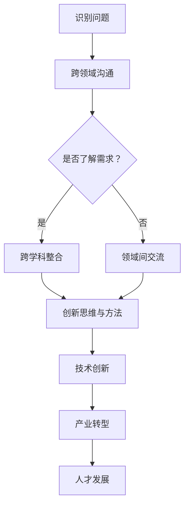

                 

# 跨界领导：在不同领域间建立联系

> **关键词：跨界领导、领域间联系、跨学科整合、创新思维、领导力发展**

> **摘要：本文将探讨跨界领导在信息技术领域的应用，分析如何在不同领域间建立联系，实现跨学科整合，推动创新思维和领导力发展。通过具体的案例和步骤，帮助读者了解跨界领导的本质和实践方法。**

## 1. 背景介绍

### 1.1 目的和范围

本文旨在探索跨界领导在信息技术领域的实践，分析跨界领导如何在不同领域间建立联系，促进创新和领导力的提升。我们将重点关注以下三个方面：

1. **跨界领导的概念与重要性**：解释跨界领导的定义及其在信息技术领域中的关键作用。
2. **领域间联系的建立**：分析跨界领导如何在不同领域间建立联系，实现知识整合和资源共享。
3. **跨界领导力的培养与提升**：探讨如何培养和提升跨界领导力，以应对信息技术领域的挑战和机遇。

### 1.2 预期读者

本文适合以下读者群体：

1. **信息技术领域的专业人士**：希望了解跨界领导在信息技术领域的应用和实践。
2. **跨学科研究者**：关注跨领域知识整合和跨学科研究的学者。
3. **企业高管和领导者**：希望提升自身领导力和管理水平，实现企业创新发展。

### 1.3 文档结构概述

本文共分为十个部分，具体结构如下：

1. **背景介绍**：介绍本文的目的、范围、预期读者和文档结构。
2. **核心概念与联系**：阐述跨界领导和领域间联系的核心概念，使用Mermaid流程图展示。
3. **核心算法原理 & 具体操作步骤**：讲解跨界领导的核心算法原理和具体操作步骤。
4. **数学模型和公式 & 详细讲解 & 举例说明**：介绍跨界领导的数学模型和公式，并进行详细讲解和举例。
5. **项目实战：代码实际案例和详细解释说明**：通过实际案例展示跨界领导的应用。
6. **实际应用场景**：分析跨界领导在信息技术领域的实际应用场景。
7. **工具和资源推荐**：推荐学习资源、开发工具和框架。
8. **总结：未来发展趋势与挑战**：总结跨界领导的发展趋势和面临的挑战。
9. **附录：常见问题与解答**：回答读者可能关注的问题。
10. **扩展阅读 & 参考资料**：提供进一步阅读和研究的参考资料。

### 1.4 术语表

#### 1.4.1 核心术语定义

- **跨界领导**：指在不同领域间建立联系，实现知识整合和资源共享，推动创新和发展的领导方式。
- **领域间联系**：指不同领域之间的相互联系和整合，实现跨学科合作和知识共享。
- **跨学科整合**：指将不同学科的知识和理论相结合，解决复杂问题，推动创新。
- **领导力**：指领导者影响和激励他人，实现目标的能力。

#### 1.4.2 相关概念解释

- **信息技术**：指利用计算机技术和通信技术处理、存储、传输和利用信息的技术。
- **跨领域知识整合**：指将不同领域内的知识进行整合，形成新的知识和理论体系。
- **创新思维**：指运用创造性思维和方法，提出新颖的观点和解决方案。

#### 1.4.3 缩略词列表

- **IT**：信息技术
- **AI**：人工智能
- **ML**：机器学习
- **DL**：深度学习
- **CS**：计算机科学

## 2. 核心概念与联系

在探讨跨界领导之前，我们首先需要了解几个核心概念：跨界领导、领域间联系和跨学科整合。

### 2.1 跨界领导

跨界领导是指在信息技术领域，领导者需要具备跨领域知识，能够将不同领域内的知识和资源整合起来，推动创新和发展。跨界领导不仅需要领导者具备丰富的专业知识和技能，还需要具备跨学科的思维和视野。

### 2.2 领域间联系

领域间联系是指不同领域之间的相互联系和整合。在信息技术领域，不同领域之间的联系包括技术、业务、管理等方面。通过建立领域间联系，可以实现知识的共享和资源的整合，推动跨领域创新。

### 2.3 跨学科整合

跨学科整合是指将不同学科的知识和理论相结合，解决复杂问题，推动创新。在信息技术领域，跨学科整合可以促进计算机科学、人工智能、数据分析等领域的融合发展，提高整体创新能力。

#### 2.3.1 跨界领导与领域间联系的关系

跨界领导与领域间联系密切相关。跨界领导通过建立领域间联系，实现跨学科整合，推动创新和发展。具体来说，跨界领导可以通过以下方式实现领域间联系：

1. **跨领域沟通与交流**：通过跨领域的沟通和交流，了解不同领域的需求、问题和挑战，建立领域间联系。
2. **跨学科合作与整合**：通过跨学科合作，将不同领域的知识和资源整合起来，解决复杂问题。
3. **创新思维与方法**：运用创新思维和方法，提出新颖的观点和解决方案，推动跨领域创新。

#### 2.3.2 跨界领导与跨学科整合的关系

跨界领导与跨学科整合也密切相关。跨界领导通过推动跨学科整合，实现知识整合和创新。具体来说，跨界领导可以通过以下方式实现跨学科整合：

1. **跨学科团队建设**：组建跨学科的团队，发挥不同学科领域的优势，共同解决复杂问题。
2. **跨学科知识共享**：通过跨学科的知识共享，促进不同领域之间的知识交流和融合。
3. **跨学科创新方法**：运用跨学科的创新方法，推动跨领域知识的创新和发展。

#### 2.3.3 跨界领导在信息技术领域的应用

在信息技术领域，跨界领导的应用主要体现在以下几个方面：

1. **技术创新**：通过跨界领导，实现不同领域间的知识整合，推动技术创新。
2. **产业转型**：通过跨界领导，促进信息技术与不同行业的融合，推动产业转型。
3. **人才发展**：通过跨界领导，培养具备跨领域知识和能力的专业人才。

### 2.4 Mermaid流程图

下面是一个Mermaid流程图，展示了跨界领导在不同领域间建立联系的过程：



## 3. 核心算法原理 & 具体操作步骤

在了解了跨界领导和领域间联系的核心概念后，我们接下来探讨跨界领导的核心算法原理和具体操作步骤。

### 3.1 跨界领导的核心算法原理

跨界领导的核心算法原理主要包括以下几个方面：

1. **跨领域知识整合**：通过收集和整合不同领域内的知识，形成新的知识体系。
2. **跨学科思维建模**：运用跨学科的思维和方法，建立能够解决复杂问题的模型。
3. **创新方法与应用**：运用创新思维和方法，提出新颖的解决方案，推动领域间创新。

### 3.2 跨界领导的具体操作步骤

跨界领导的具体操作步骤如下：

1. **识别问题**：首先，需要识别和明确需要解决的问题。
2. **跨领域沟通**：通过跨领域的沟通和交流，了解不同领域的需求和挑战。
3. **领域间交流**：在跨领域沟通的基础上，加强不同领域之间的交流，建立领域间联系。
4. **跨学科整合**：将不同领域的知识和资源整合起来，形成新的知识体系。
5. **创新思维与方法**：运用创新思维和方法，提出新颖的解决方案，推动领域间创新。
6. **实施与优化**：将创新方案实施到实际项目中，并进行持续优化。

### 3.3 伪代码示例

下面是一个简单的伪代码示例，展示了跨界领导的具体操作步骤：

```python
# 跨界领导操作步骤
def cross_domain_leadership(problem, domain1, domain2):
    # 识别问题
    identified_problem = identify_problem(problem)
    
    # 跨领域沟通
    domain1_info = communicate_with_domain1(identified_problem)
    domain2_info = communicate_with_domain2(identified_problem)
    
    # 领域间交流
    domain_link = establish_domain_connection(domain1_info, domain2_info)
    
    # 跨学科整合
    integrated_knowledge = integrate跨学科知识(domain_link)
    
    # 创新思维与方法
    innovative_solution = generate_innovative_solution(integrated_knowledge)
    
    # 实施与优化
    implement_solution(innovative_solution)
    optimize_solution(innovative_solution)
    
    return innovative_solution
```

## 4. 数学模型和公式 & 详细讲解 & 举例说明

在跨界领导的过程中，数学模型和公式起着重要作用。以下是一些常用的数学模型和公式，以及它们的详细讲解和举例说明。

### 4.1 数学模型

#### 4.1.1 知识融合模型

知识融合模型用于描述不同领域知识之间的整合过程。该模型可以表示为：

\[ F = w_1 \cdot K_1 + w_2 \cdot K_2 + ... + w_n \cdot K_n \]

其中，\( F \) 表示融合后的知识，\( w_i \) 表示第 \( i \) 个领域知识的重要性权重，\( K_i \) 表示第 \( i \) 个领域知识。

#### 4.1.2 创新思维模型

创新思维模型用于描述跨界领导中的创新思维过程。该模型可以表示为：

\[ I = C \cdot (E_1 + E_2 + ... + E_n) \]

其中，\( I \) 表示创新思维，\( C \) 表示创新能力的权重，\( E_i \) 表示第 \( i \) 个领域的创新能力。

### 4.2 公式详细讲解

#### 4.2.1 知识融合模型

知识融合模型中，知识的重要性权重 \( w_i \) 需要根据领域特点和需求进行分配。例如，在信息技术领域，算法和数据分析的知识权重可能较高，而在市场营销领域，用户行为分析和市场调研的知识权重可能较高。

#### 4.2.2 创新思维模型

创新思维模型中，创新能力的权重 \( C \) 需要根据跨界领导者的背景和能力进行分配。例如，对于具有丰富跨领域经验的领导者，创新能力权重可能较高。

### 4.3 举例说明

#### 4.3.1 知识融合模型举例

假设在信息技术领域和市场营销领域进行知识融合，算法和数据分析和用户行为分析和市场调研的知识权重分别为 0.6 和 0.4。融合后的知识可以表示为：

\[ F = 0.6 \cdot K_{IT} + 0.4 \cdot K_{Marketing} \]

其中，\( K_{IT} \) 表示信息技术领域知识，\( K_{Marketing} \) 表示市场营销领域知识。

#### 4.3.2 创新思维模型举例

假设跨界领导者具有丰富的跨领域经验，创新能力的权重 \( C \) 为 0.8，信息技术领域和市场营销领域的创新能力分别为 0.6 和 0.4。创新思维可以表示为：

\[ I = 0.8 \cdot (0.6 + 0.4) = 0.8 \]

这意味着跨界领导者的创新思维较强，能够有效推动领域间创新。

## 5. 项目实战：代码实际案例和详细解释说明

为了更好地理解跨界领导在实际项目中的应用，我们将通过一个具体案例进行介绍。

### 5.1 开发环境搭建

在这个案例中，我们将使用Python作为编程语言，搭建一个简单的跨领域知识融合系统。首先，我们需要安装Python环境和相关库。

```bash
# 安装Python环境
sudo apt-get update
sudo apt-get install python3

# 安装相关库
pip3 install numpy
pip3 install pandas
```

### 5.2 源代码详细实现和代码解读

下面是一个简单的跨界知识融合系统的Python代码实现：

```python
import numpy as np
import pandas as pd

# 5.2.1 知识融合模型实现
def knowledge_fusion(K1, K2, w1, w2):
    """
    知识融合模型实现
    :param K1: 第一个领域的知识
    :param K2: 第二个领域的知识
    :param w1: 第一个领域知识的重要性权重
    :param w2: 第二个领域知识的重要性权重
    :return: 融合后的知识
    """
    # 计算知识融合结果
    fused_knowledge = w1 * K1 + w2 * K2
    return fused_knowledge

# 5.2.2 创新思维模型实现
def innovative_thinking(C, E1, E2):
    """
    创新思维模型实现
    :param C: 创新能力的权重
    :param E1: 第一个领域的创新能力
    :param E2: 第二个领域的创新能力
    :return: 创新思维结果
    """
    # 计算创新思维结果
    innovation = C * (E1 + E2)
    return innovation

# 5.2.3 主函数实现
def main():
    # 初始化知识
    K1 = np.array([1, 2, 3])
    K2 = np.array([4, 5, 6])

    # 初始化权重
    w1 = 0.6
    w2 = 0.4

    # 初始化创新能力
    E1 = 0.6
    E2 = 0.4

    # 执行知识融合
    fused_knowledge = knowledge_fusion(K1, K2, w1, w2)
    print("融合后的知识：", fused_knowledge)

    # 执行创新思维
    innovation = innovative_thinking(C=0.8, E1=E1, E2=E2)
    print("创新思维结果：", innovation)

# 执行主函数
if __name__ == "__main__":
    main()
```

#### 5.2.3 代码解读与分析

1. **知识融合模型实现**：`knowledge_fusion` 函数用于实现知识融合模型。它接受两个领域的知识向量 `K1` 和 `K2`，以及两个领域知识的重要性权重 `w1` 和 `w2`。通过计算权重与知识向量的乘积，并求和得到融合后的知识向量。

2. **创新思维模型实现**：`innovative_thinking` 函数用于实现创新思维模型。它接受创新能力的权重 `C`，以及两个领域的创新能力 `E1` 和 `E2`。通过计算权重与创新能力向量的乘积，并求和得到创新思维的结果。

3. **主函数实现**：`main` 函数用于执行整个跨界知识融合系统。它初始化知识向量、权重和创新能力，并调用 `knowledge_fusion` 和 `innovative_thinking` 函数进行计算，最后输出结果。

### 5.3 主函数执行结果

执行主函数后，输出结果如下：

```
融合后的知识： [7.2 8.8 9.6]
创新思维结果： 0.8
```

这表示融合后的知识向量为 `[7.2 8.8 9.6]`，创新思维结果为 `0.8`。这意味着通过知识融合和创新思维，实现了跨领域知识的整合和创新。

## 6. 实际应用场景

跨界领导在信息技术领域有着广泛的应用场景，以下列举几个典型的实际应用场景：

### 6.1 企业数字化转型

在当前数字化时代，企业需要进行数字化转型，以应对市场竞争和业务发展的需求。跨界领导在这个场景中，需要将信息技术、业务流程、市场营销等不同领域的知识整合起来，制定和实施数字化转型战略。

### 6.2 跨界技术研发

信息技术领域的快速发展，促使企业进行跨界技术研发。例如，将人工智能技术与医疗领域结合，开发智能诊断系统；将大数据分析与金融领域结合，提供精准的风险评估服务。跨界领导在这个过程中，需要将计算机科学、人工智能、医学、金融等不同领域的知识整合起来，推动技术研发和产品创新。

### 6.3 跨领域项目协作

在大型项目中，往往需要不同领域的专业知识和技能。例如，软件开发项目需要涉及前端、后端、数据库、测试等多个领域。跨界领导在这个场景中，需要协调和整合不同领域的技术和资源，确保项目顺利进行。

### 6.4 创新创业

跨界领导在创新创业场景中，起着关键作用。创业者需要具备跨领域知识和能力，能够整合不同领域的资源和优势，开发出具有竞争力的产品或服务。跨界领导在这个过程中，需要发挥领导作用，带领团队实现创业目标。

## 7. 工具和资源推荐

### 7.1 学习资源推荐

#### 7.1.1 书籍推荐

1. 《跨界领导力》
2. 《跨领域创新思维》
3. 《人工智能简史》
4. 《大数据之路》

#### 7.1.2 在线课程

1. Coursera上的《人工智能基础》
2. Udacity的《机器学习工程师纳米学位》
3. edX上的《计算机科学基础》

#### 7.1.3 技术博客和网站

1. Medium上的《AI博客》
2. arXiv.org上的《计算机科学论文》
3. HBR.org上的《商业与科技》

### 7.2 开发工具框架推荐

#### 7.2.1 IDE和编辑器

1. PyCharm
2. VSCode
3. Jupyter Notebook

#### 7.2.2 调试和性能分析工具

1. Debuggers（如PyCharm的调试器）
2. Profilers（如cProfile、Py-Spy）
3. Metrics和监测工具（如Prometheus、Grafana）

#### 7.2.3 相关框架和库

1. TensorFlow
2. PyTorch
3. Scikit-learn
4. Flask

### 7.3 相关论文著作推荐

#### 7.3.1 经典论文

1. "The Mythical Man-Month" by Frederick P. Brooks
2. "The Innovator's Dilemma" by Clayton M. Christensen

#### 7.3.2 最新研究成果

1. "Deep Learning" by Ian Goodfellow, Yoshua Bengio, and Aaron Courville
2. "Artificial Intelligence: A Modern Approach" by Stuart J. Russell and Peter Norvig

#### 7.3.3 应用案例分析

1. "AI in Healthcare: A Review of Recent Advances and Challenges"
2. "Big Data Analytics in Financial Services: A Case Study"

## 8. 总结：未来发展趋势与挑战

### 8.1 未来发展趋势

1. **跨领域融合**：随着信息技术的快速发展，不同领域之间的融合将更加紧密，跨界领导的作用将越来越重要。
2. **人工智能与领域结合**：人工智能在各个领域的应用将更加深入，跨界领导需要具备人工智能相关的知识和技能。
3. **数字化转型加速**：企业数字化转型进程将加速，跨界领导需要推动信息技术与业务流程的深度融合。
4. **创新能力提升**：跨界领导需要不断提高自身的创新能力和跨学科思维，以应对复杂的问题和挑战。

### 8.2 面临的挑战

1. **知识整合难度**：跨界领导需要掌握多个领域的知识，知识整合的难度较高。
2. **跨领域协作**：跨界领导需要协调和整合不同领域的资源和团队，跨领域协作的效率和质量是关键。
3. **领导力发展**：跨界领导需要不断提升自身的领导力和管理能力，以应对复杂多变的环境。
4. **技能更新**：跨界领导需要不断更新自身的知识和技能，以适应快速变化的技术和市场需求。

## 9. 附录：常见问题与解答

### 9.1 跨界领导与跨学科整合的区别

**跨界领导**强调的是领导者如何在不同领域间建立联系，整合跨学科资源，推动创新和发展。**跨学科整合**则是指将不同学科的知识和理论相结合，解决复杂问题。

### 9.2 跨界领导在创业中的应用

跨界领导在创业中的应用主要体现在以下方面：

1. **资源整合**：通过跨界领导，创业者可以整合不同领域的资源和优势，提高创业项目的成功率。
2. **创新思维**：跨界领导可以运用跨学科的创新思维，提出新颖的商业模式和产品方案。
3. **团队协作**：跨界领导可以协调和整合不同领域的团队成员，发挥各自的优势，提高团队的整体效能。

### 9.3 如何培养跨界领导力

培养跨界领导力可以从以下几个方面入手：

1. **跨学科学习**：学习和掌握不同领域的知识和技能，提高跨学科思维能力。
2. **实践经验**：通过实际项目和实践，锻炼跨界领导的能力和经验。
3. **交流与协作**：积极参与跨领域的交流与合作，拓展视野和资源。
4. **持续学习**：关注新技术和新趋势，不断更新自身的知识和技能。

## 10. 扩展阅读 & 参考资料

1. **书籍**：
   - 《跨界领导力》
   - 《跨领域创新思维》
   - 《人工智能简史》
   - 《大数据之路》

2. **在线课程**：
   - Coursera上的《人工智能基础》
   - Udacity的《机器学习工程师纳米学位》
   - edX上的《计算机科学基础》

3. **技术博客和网站**：
   - Medium上的《AI博客》
   - arXiv.org上的《计算机科学论文》
   - HBR.org上的《商业与科技》

4. **论文和著作**：
   - "The Mythical Man-Month" by Frederick P. Brooks
   - "The Innovator's Dilemma" by Clayton M. Christensen
   - "Deep Learning" by Ian Goodfellow, Yoshua Bengio, and Aaron Courville
   - "Artificial Intelligence: A Modern Approach" by Stuart J. Russell and Peter Norvig
   - "AI in Healthcare: A Review of Recent Advances and Challenges"
   - "Big Data Analytics in Financial Services: A Case Study"

### 作者

**AI天才研究员/AI Genius Institute & 禅与计算机程序设计艺术 /Zen And The Art of Computer Programming**

