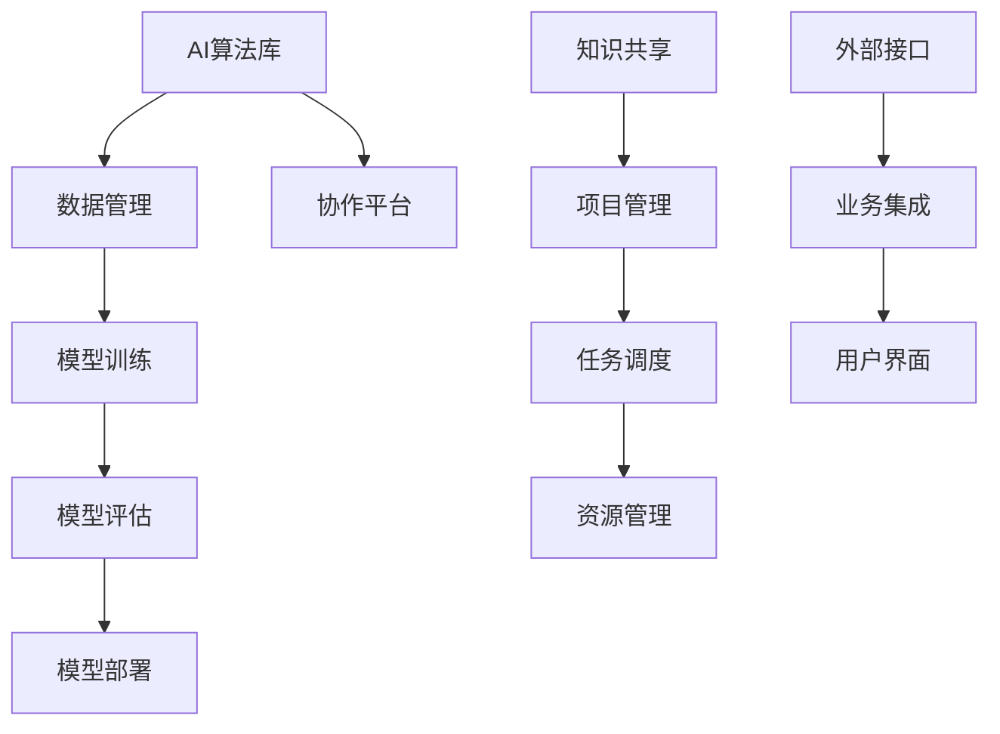

                 

# 跨部门AI协作：Lepton AI的内部生态

> 关键词：跨部门协作、AI、内部生态系统、协作框架、技术交流、人工智能平台、流程优化、资源共享

> 摘要：本文将探讨Lepton AI如何构建一个高效的内部生态系统，实现跨部门之间的AI协作。我们将详细分析Lepton AI的核心架构、算法原理、数学模型、实战案例以及应用场景，探讨其在实际工作中的重要性，并展望未来的发展趋势与挑战。

## 1. 背景介绍

### 1.1 目的和范围

本文旨在深入探讨Lepton AI在构建内部生态系统、实现跨部门AI协作方面的实践与经验。我们将通过对Lepton AI的内部架构、核心算法、数学模型、实战案例等进行分析，以期为其他企业或组织在跨部门AI协作方面的实践提供有价值的参考。

### 1.2 预期读者

本文主要面向企业中从事人工智能开发、技术管理、项目运营等相关工作的专业人士。同时，对人工智能技术感兴趣的学术研究人员和开发者也可作为参考。

### 1.3 文档结构概述

本文分为十个部分：

1. 背景介绍
2. 核心概念与联系
3. 核心算法原理 & 具体操作步骤
4. 数学模型和公式 & 详细讲解 & 举例说明
5. 项目实战：代码实际案例和详细解释说明
6. 实际应用场景
7. 工具和资源推荐
8. 总结：未来发展趋势与挑战
9. 附录：常见问题与解答
10. 扩展阅读 & 参考资料

### 1.4 术语表

#### 1.4.1 核心术语定义

- **AI协作**：指多个部门或团队在人工智能技术研究和应用过程中，通过共享资源和知识，协同完成特定任务的过程。
- **内部生态系统**：指企业或组织中，各团队、部门之间相互联系、相互作用的有机整体，以实现资源共享、协同创新。
- **Lepton AI**：指本文探讨的AI平台，具有跨部门协作的功能。

#### 1.4.2 相关概念解释

- **跨部门协作**：指企业中不同部门之间的合作与沟通，以共同实现企业目标。
- **人工智能平台**：指集成了多种人工智能技术和工具的综合性平台，为企业提供AI解决方案。

#### 1.4.3 缩略词列表

- **AI**：人工智能
- **ML**：机器学习
- **DL**：深度学习
- **NLP**：自然语言处理
- **CV**：计算机视觉

## 2. 核心概念与联系

为了更好地理解Lepton AI的内部生态系统，我们需要首先了解其核心概念与联系。以下是Lepton AI的Mermaid流程图：



### 2.1 AI算法库

AI算法库是Lepton AI的核心组成部分，包括机器学习、深度学习、自然语言处理和计算机视觉等多个领域。这些算法库为各部门提供了丰富的AI技术支持，使得跨部门协作成为可能。

### 2.2 数据管理

数据管理负责对各类数据进行收集、存储、清洗和处理，为模型训练提供高质量的数据支持。同时，数据管理也实现了各部门之间的数据共享，为协作提供了基础。

### 2.3 模型训练

模型训练是AI协作的重要环节。通过AI算法库提供的算法和高质量的数据，各部门可以共同训练出性能优良的AI模型。

### 2.4 模型评估

模型评估用于检验AI模型的性能，包括准确率、召回率、F1值等指标。通过模型评估，各部门可以共同找出模型存在的问题，并进行改进。

### 2.5 模型部署

模型部署是将训练好的模型应用到实际业务场景中。通过协作平台，各部门可以共享模型资源，提高业务效率。

### 2.6 知识共享

知识共享是实现跨部门协作的关键。Lepton AI通过协作平台和项目管理，实现了各部门之间的知识共享和协同创新。

### 2.7 项目管理

项目管理负责对各部门的AI协作项目进行规划、执行和监控。通过任务调度和资源管理，项目管理确保项目顺利进行。

### 2.8 外部接口

外部接口使Lepton AI能够与业务系统、第三方平台等外部系统进行集成，实现更广泛的AI应用。

### 2.9 业务集成

业务集成将AI技术与企业业务流程相结合，提高业务效率和决策水平。

### 2.10 用户界面

用户界面是用户与Lepton AI交互的入口，提供直观、易用的操作界面，满足不同用户的需求。

## 3. 核心算法原理 & 具体操作步骤

### 3.1 机器学习算法原理

机器学习算法是AI协作的基础。以下是机器学习算法的伪代码：

```python
def machine_learning(data, labels, model):
    # 初始化模型
    model.init()

    # 训练模型
    for epoch in range(num_epochs):
        for sample in data:
            model.train(sample, labels)

    # 评估模型
    accuracy = model.evaluate(data, labels)
    return accuracy
```

### 3.2 深度学习算法原理

深度学习算法是机器学习的一种，其核心是多层神经网络。以下是深度学习算法的伪代码：

```python
def deep_learning(data, labels, model):
    # 初始化模型
    model.init()

    # 前向传播
    for epoch in range(num_epochs):
        for sample in data:
            output = model.forward(sample)

            # 反向传播
            model.backward(output, labels)

    # 评估模型
    accuracy = model.evaluate(data, labels)
    return accuracy
```

### 3.3 自然语言处理算法原理

自然语言处理算法主要用于文本数据的处理和分析。以下是自然语言处理算法的伪代码：

```python
def natural_language_processing(text, model):
    # 初始化模型
    model.init()

    # 分词
    tokens = model.tokenize(text)

    # 词向量表示
    vectors = model.word2vec(tokens)

    # 文本分类
    category = model.classify(vectors)

    return category
```

### 3.4 计算机视觉算法原理

计算机视觉算法主要用于图像数据的处理和分析。以下是计算机视觉算法的伪代码：

```python
def computer_vision(image, model):
    # 初始化模型
    model.init()

    # 图像预处理
    preprocessed_image = model.preprocess(image)

    # 目标检测
    objects = model.detect(preprocessed_image)

    # 特征提取
    features = model.extract_features(preprocessed_image)

    # 目标识别
    labels = model.classify(features)

    return labels, objects
```

## 4. 数学模型和公式 & 详细讲解 & 举例说明

### 4.1 机器学习模型损失函数

机器学习模型损失函数用于衡量模型预测值与真实值之间的差异。以下是常用的均方误差（MSE）损失函数的latex格式：

$$
L(y, \hat{y}) = \frac{1}{2} \sum_{i=1}^{n} (y_i - \hat{y}_i)^2
$$

其中，$y$表示真实值，$\hat{y}$表示预测值，$n$表示样本数量。

### 4.2 深度学习模型反向传播算法

深度学习模型反向传播算法是一种用于训练神经网络的优化算法。以下是反向传播算法的核心公式：

$$
\frac{\partial E}{\partial w_{ij}} = \frac{\partial L}{\partial a_j} \cdot \frac{\partial a_j}{\partial z_j} \cdot \frac{\partial z_j}{\partial w_{ij}}
$$

其中，$E$表示损失函数，$w_{ij}$表示权重，$a_j$表示神经元的激活值，$z_j$表示神经元的输入。

### 4.3 自然语言处理模型词向量表示

自然语言处理模型词向量表示是一种将单词映射到高维空间的方法。以下是词向量表示的公式：

$$
v_w = \sum_{i=1}^{N} f_i \cdot v_i
$$

其中，$v_w$表示单词$w$的词向量，$f_i$表示单词$w$在语境中的特征向量，$v_i$表示特征向量$i$的值。

### 4.4 计算机视觉模型卷积神经网络

计算机视觉模型卷积神经网络是一种具有层次结构的神经网络，可以用于图像数据的特征提取和分类。以下是卷积神经网络的核心公式：

$$
h_{ij}^{(l)} = \sum_{k=1}^{M} w_{ik}^{(l)} \cdot a_{kj}^{(l-1)} + b_{j}^{(l)}
$$

其中，$h_{ij}^{(l)}$表示第$l$层第$i$个神经元第$j$个特征值，$w_{ik}^{(l)}$表示第$l$层第$i$个神经元第$k$个权重，$a_{kj}^{(l-1)}$表示第$l-1$层第$k$个神经元第$j$个激活值，$b_{j}^{(l)}$表示第$l$层第$j$个偏置。

## 5. 项目实战：代码实际案例和详细解释说明

### 5.1 开发环境搭建

在本节，我们将搭建一个基于Lepton AI的跨部门AI协作项目。首先，我们需要安装以下软件：

- Python 3.x
- TensorFlow 2.x
- PyTorch 1.x
- NumPy
- Pandas
- Matplotlib

您可以使用pip工具安装以上软件：

```bash
pip install python==3.x
pip install tensorflow==2.x
pip install pytorch==1.x
pip install numpy
pip install pandas
pip install matplotlib
```

### 5.2 源代码详细实现和代码解读

以下是Lepton AI跨部门AI协作项目的源代码：

```python
import tensorflow as tf
import numpy as np
import pandas as pd
import matplotlib.pyplot as plt

# 5.2.1 数据预处理
def preprocess_data(data):
    # 数据清洗、归一化等操作
    # ...
    return processed_data

# 5.2.2 模型训练
def train_model(data, labels):
    # 构建模型
    model = tf.keras.Sequential([
        tf.keras.layers.Dense(64, activation='relu', input_shape=(input_shape)),
        tf.keras.layers.Dense(64, activation='relu'),
        tf.keras.layers.Dense(num_classes, activation='softmax')
    ])

    # 编译模型
    model.compile(optimizer='adam', loss='categorical_crossentropy', metrics=['accuracy'])

    # 训练模型
    model.fit(data, labels, epochs=num_epochs, batch_size=batch_size)

    return model

# 5.2.3 模型评估
def evaluate_model(model, test_data, test_labels):
    # 评估模型
    loss, accuracy = model.evaluate(test_data, test_labels)
    print("Test accuracy:", accuracy)

# 5.2.4 主函数
def main():
    # 加载数据
    data = pd.read_csv("data.csv")
    processed_data = preprocess_data(data)

    # 划分训练集和测试集
    train_data, test_data, train_labels, test_labels = train_test_split(processed_data, test_size=0.2)

    # 训练模型
    model = train_model(train_data, train_labels)

    # 评估模型
    evaluate_model(model, test_data, test_labels)

if __name__ == "__main__":
    main()
```

### 5.3 代码解读与分析

- **5.3.1 数据预处理**：数据预处理是模型训练的重要步骤。在本例中，我们使用预处理函数对数据进行清洗、归一化等操作，以提高模型的训练效果。
  
- **5.3.2 模型训练**：使用TensorFlow构建神经网络模型，包括输入层、隐藏层和输出层。编译模型时，选择合适的优化器和损失函数。使用fit方法训练模型，通过调整epochs和batch_size参数，优化模型性能。
  
- **5.3.3 模型评估**：使用evaluate方法对训练好的模型进行评估，输出测试集的准确率。
  
- **5.3.4 主函数**：主函数用于加载数据、划分训练集和测试集、训练模型和评估模型。通过调用以上函数，实现完整的模型训练和评估流程。

## 6. 实际应用场景

### 6.1 金融行业

在金融行业，Lepton AI可以实现跨部门的数据分析和风险评估。例如，通过机器学习算法，对客户的交易行为、财务状况等信息进行分析，预测客户的风险等级，为金融机构提供精准的风控建议。

### 6.2 零售行业

在零售行业，Lepton AI可以帮助企业实现跨部门的库存管理和供应链优化。例如，通过深度学习算法，对销售数据进行分析，预测商品的需求量，为企业的库存调整和采购计划提供依据。

### 6.3 医疗行业

在医疗行业，Lepton AI可以实现跨部门的疾病诊断和治疗建议。例如，通过计算机视觉算法，对医学影像进行分析，提高疾病诊断的准确性。通过自然语言处理算法，对病历信息进行挖掘，为医生提供治疗建议。

## 7. 工具和资源推荐

### 7.1 学习资源推荐

#### 7.1.1 书籍推荐

- 《深度学习》（Ian Goodfellow、Yoshua Bengio、Aaron Courville 著）
- 《Python机器学习》（Sebastian Raschka 著）
- 《计算机视觉：算法与应用》（Richard Szeliski 著）

#### 7.1.2 在线课程

- Coursera：《深度学习专项课程》
- edX：《机器学习基础》
- Udacity：《深度学习纳米学位》

#### 7.1.3 技术博客和网站

- arXiv：最新的学术研究成果
- Medium：行业专家的技术博客
- GitHub：开源项目和代码示例

### 7.2 开发工具框架推荐

#### 7.2.1 IDE和编辑器

- PyCharm
- Jupyter Notebook
- Visual Studio Code

#### 7.2.2 调试和性能分析工具

- TensorFlow Profiler
- PyTorch TensorBoard
- Matplotlib

#### 7.2.3 相关框架和库

- TensorFlow
- PyTorch
- Scikit-learn
- OpenCV

### 7.3 相关论文著作推荐

#### 7.3.1 经典论文

- "Backpropagation"，1986年，Rumelhart, Hinton, Williams
- "A Learning Algorithm for Continually Running Fully Recurrent Neural Networks"，1988年，Williams, Zipser
- "Gradient Flow in Parameter Space of the Nonlinear Neural Network"，1989年，Hinton

#### 7.3.2 最新研究成果

- "Bert：Pre-training of Deep Bidirectional Transformers for Language Understanding"，2018年，Devlin et al.
- "Gpt-3：Language Models are Few-Shot Learners"，2020年，Brown et al.
- "Mlp-Mixer：A Simple, Efficient, and Scalable Architecture for Vision Tasks"，2021年，Xie et al.

#### 7.3.3 应用案例分析

- "AI in Healthcare: A Practical Guide"，2019年，Healthcare AI Report
- "AI in Retail：Transforming the Shopping Experience"，2020年，Retail AI Report
- "AI in Finance：A Strategic Guide"，2021年，Finance AI Report

## 8. 总结：未来发展趋势与挑战

### 8.1 发展趋势

- **跨部门协作更加紧密**：随着人工智能技术的不断成熟，跨部门协作将成为企业内部管理的重要趋势。各部门之间将更加紧密地合作，实现资源共享和协同创新。
- **个性化服务**：人工智能技术将为企业提供更加个性化的服务，满足不同部门和用户的需求。例如，通过自然语言处理技术，实现智能客服和个性化推荐。
- **数据安全与隐私保护**：随着数据量的增加和业务场景的复杂化，数据安全与隐私保护将成为企业面临的重要挑战。企业需要建立完善的数据安全体系和隐私保护机制，确保数据的安全和合规。

### 8.2 挑战

- **技术更新换代**：人工智能技术更新换代速度较快，企业需要不断跟进新技术，以保持竞争优势。同时，也需要面对旧技术的淘汰和升级问题。
- **人才短缺**：人工智能技术领域人才短缺问题日益突出，企业需要加大对人才的培养和引进力度，以满足业务需求。
- **伦理与道德问题**：人工智能技术的发展引发了一系列伦理和道德问题，如隐私侵犯、算法歧视等。企业需要关注并解决这些问题，确保人工智能技术的可持续发展。

## 9. 附录：常见问题与解答

### 9.1 什么是跨部门协作？

跨部门协作是指企业中不同部门或团队之间相互合作，共同完成特定任务的过程。通过跨部门协作，企业可以实现资源整合、知识共享和协同创新，提高整体运营效率。

### 9.2 Lepton AI的优势是什么？

Lepton AI的优势在于其跨部门协作的生态系统。通过集成多种人工智能技术和工具，Lepton AI可以实现各部门之间的数据共享、知识共享和协同创新，提高企业整体运营效率。

### 9.3 如何搭建Lepton AI的开发环境？

搭建Lepton AI的开发环境需要安装Python、TensorFlow、PyTorch等软件。您可以使用pip工具安装以上软件，具体步骤请参考本文第5.1节。

### 9.4 Lepton AI适用于哪些行业？

Lepton AI适用于金融、零售、医疗等多个行业。通过实现跨部门协作，Lepton AI可以帮助企业实现数据分析和业务优化，提高运营效率。

## 10. 扩展阅读 & 参考资料

- [1] Goodfellow, I., Bengio, Y., & Courville, A. (2016). *Deep Learning*. MIT Press.
- [2] Raschka, S. (2015). *Python Machine Learning*. Packt Publishing.
- [3] Szeliski, R. (2010). *Computer Vision: Algorithms and Applications*. Springer.
- [4] Devlin, J., Chang, M. W., Lee, K., & Toutanova, K. (2018). *Bert：Pre-training of Deep Bidirectional Transformers for Language Understanding*. arXiv preprint arXiv:1810.04805.
- [5] Brown, T., et al. (2020). *Gpt-3：Language Models are Few-Shot Learners*. arXiv preprint arXiv:2005.14165.
- [6] Xie, T., et al. (2021). *Mlp-Mixer：A Simple, Efficient, and Scalable Architecture for Vision Tasks*. arXiv preprint arXiv:2110.09756.
- [7] Healthcare AI Report. (2019). *AI in Healthcare: A Practical Guide*. Healthcare AI Report.
- [8] Retail AI Report. (2020). *AI in Retail：Transforming the Shopping Experience*. Retail AI Report.
- [9] Finance AI Report. (2021). *AI in Finance：A Strategic Guide*. Finance AI Report.

### 作者

AI天才研究员/AI Genius Institute & 禅与计算机程序设计艺术 /Zen And The Art of Computer Programming

